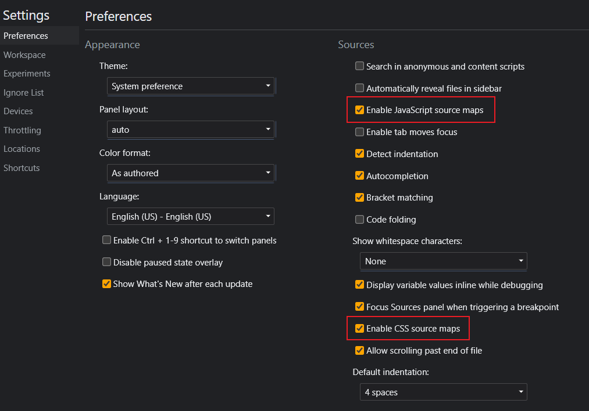
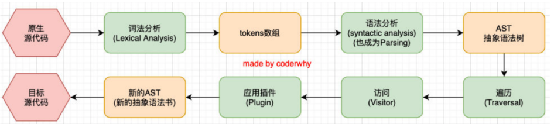
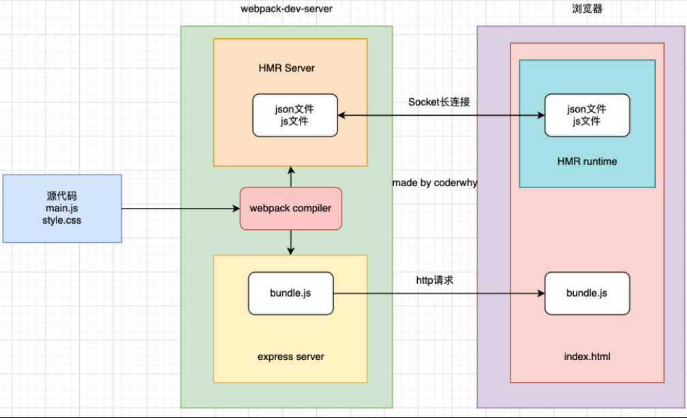
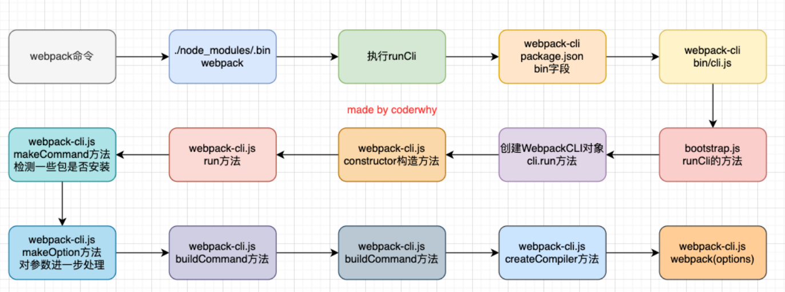
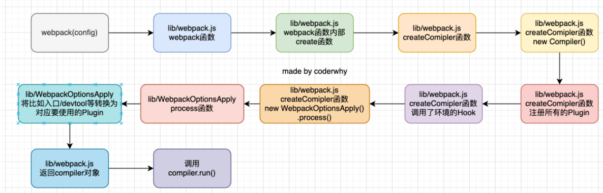
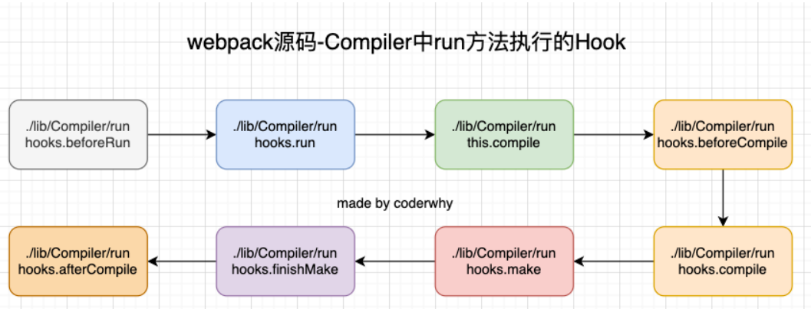
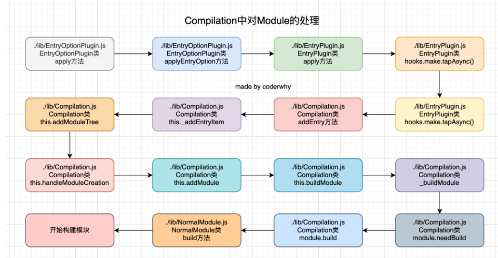
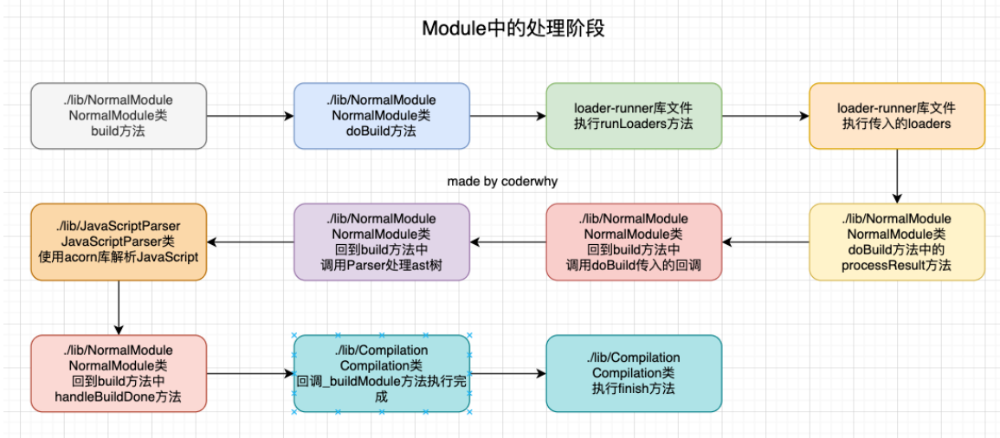
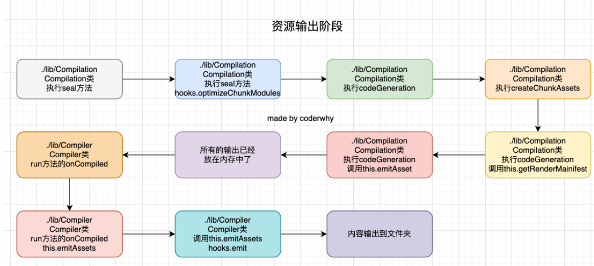
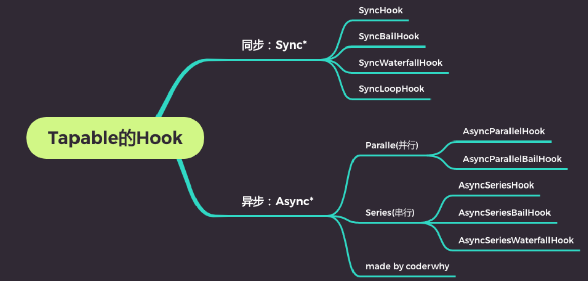

## 第一章、认识webpack

### 1 webpack是什么

webpack是一个静态的模块化打包，为现代JavaScript应用程序。

- 打包bundler：webpack可以帮我们进行打包，所以它是一个打包工具。
- 静态的static：这样表述的原因是我们最终可以将代码打包成最终的静态资源（部署到静态服务器）；
- 模块化module：webpack默认支持各种模块化开发，ES Module、CommonJS、AMD等；
- 现代的modern：我们前端说过，正是因为现代前端开发面临各种各样的问题，才催生了webpack的出现和发 展；

### 2 webpack与webpack-cli

1.webpack的安裝目前分为两个：webpack、webpack-cli（非必须安装，webpack-cli会读取webpack.config.js的内 容然后进行解析，再传入webpack，vue有自己的实现）。

2.webpack和webpack-cli的关系：

- 执行webpack命令，会执行node_modules下的.bin目录下的webpack；
- webpack在执行时是依赖webpack-cli的，如果没有安装就会报错；
- 而webpack-cli中代码执行时，才是真正利用webpack进行编译和打包的过程；
- 所以在安装webpack时，我们需要同时安装webpack-cli（第三方的脚手架事实上是没有使用webpack-cli的，而是类似于 自己的vue-service-cli的东西）

### 3 核心概念

- Entry:入口， Webpack 行构建的第一步将 Entry 开始，可抽象成输入。
- Module ：模块，在 Webpack 切皆模块，一个模块对应一个文件。 Webpack 会从配置的 Entry 开始递归找出所有依赖的模块。
- Chunk ：代码块，一个chunk 多个模块组合而成，用于代码合并与分割。
- Loader ：模块转换器，用于将模块的原内容按照需求转换成新内容。
- Plugin ：扩展插件，在 Webpack 构建流程中的特定时机注入扩展逻辑，来改变构建结 果或做我们想要的事情。
- Output ：输出结果，在 Webpack 经过一系列处理并得出最终想要的代码后输出结果。

Webpack 在启动后会从 Entry里配置的 Module 开始，递归解析 Entry 依赖的所有 Module 。每找到一个 Module ，就会根据配置的 Loader 去找出对应的转换规则，对 Module 进行转换后， 再解析出当前 Module 依赖的 Module 这些模块会以 Entry为单位进行分组，Entry及其 所有依赖的 Module 被分到一个组也就是 Chunk 。最后， Webpack 将所有 Chunk 转换成 文件输出。在整个流程中， Webpack 会在恰当的时机执行 Plugin里定义的逻辑。

## 第二章、基础项目搭建

基础的项目搭建包括了对css的解析，已经通过webpack-dev-serve启动一个服务。

步骤如下：

1. 新建一个空的文件夹。（项目文件夹）

2. 在项目项目文件夹下使用 **npm init - y** 初始化项目，生成package.json。

3. 安装webpack及webpack-cli：**npm i webpack webpack-cli**。

4. 创建项目模板。项目文件夹下新建**public**文件夹，并在文件夹下新建一个**html**文件作为项目模板。

   ```html
   <!DOCTYPE html>
   <html lang="en">
   <head>
     <meta charset="UTF-8">
     <meta http-equiv="X-UA-Compatible" content="IE=edge">
     <meta name="viewport" content="width=device-width, initial-scale=1.0">
     <title>webpack</title>
   </head>
   <body>
     <div id="app"></div>
   </body>
   </html>
   ```

5. 创建项目文件夹下创建**src**文件夹用来存放项目的逻辑代码，并在src文件夹下新建**index.js**作为项目的入口。

6. 编写webpack配置文件：webpack.coonfig.js。

   ```js
   const { resolve } = require('path')
   module.exports = {
     entry: './src/index.js',
     output: {
       filename: 'bundle.js',
       path: resolve(__dirname, './dist')
     }
   }
   ```

7. 在package.json文件中编写脚本：**"build":"webpack"**

8. 经过上述的操作，我们就可以通过**npm run build**对项目进行打包，并在dist文件夹下可以看到打包后的代码。css配置及服务的启动在下面进行讲解。

### 2.1 加载CSS

对于webpack来说，只能识别js或者json等模块，那么如果我们需要使用css那么就得借助loader来对css模块进行解析。

1. 安装用来解析css的loader：**npm i css-loader style-loader**

2. 在webpack的配置文件中使用配置css的解析规则：

   ```js
    module:{
       rules:[
         {
           test:/\.css$/,
           use:["style-loader","css-loader"]
         }
       ]
     }
   ```

经过上述操作我们就可以使用css了，下面进行css使用的测试：

1. 在src下新建style目录，并在目录下编写index.css文件。

   ```css
   body,html{
       height:100%;
       padding:0px;
       margin:0px;
   }
   #app{
       height:100%;
       background:#1890FF;
   }
   ```

2. 在index.js文件中引入index.css。

   ```js
   import './style/index.css'
   ```

   

经过上述操作，我们的webpack便可以解析css文件，此时如果想看到效果，可以先对项目进行打包然后在public下的index.html中引入打包后的js文件。然后使用浏览器打开html文件就可以看到。

### 2.2 使用html-webpack-plugin

在2.1中我们最后打包之后还需要手动的进行打包后文件的引入，这样很不方便。此时我们可以使用插件来帮我们完成这个工作。使用**npm i html-webpack-plugin**进行安装。在webpack.config.js中加入下面的代码。

```js
const HtmlWebpackPlugin = require('html-webpack-plugin');
plugins: [
    new HtmlWebpackPlugin({
        template: './public/index.html'
    })
]
```

经过上述操作，我们进行打包就可以看到dist文件夹下帮除了帮我们生成bundle.js之后，还生成了index.html文件，此时我们通过浏览器打开生成后的html就可以看到效果了。

### 2.3 使用webpack-dev-server为我们提供一个前端服务

在经过2.1和2.2之后我们的项目还是需要通过open live server来打开html，此时我们可以通过webpack-dev-server来提供服务。

使用：

1. 安装webpack-dev-server：**npm i webpack-dev-server -D**

2. 在package.json中配置脚本。

   ```json
   "serve":"webpack-dev-server"
   ```

经过上述操作，就可以通过npm run serve将项目运行在本地服务。通过浏览器输入服务地址就能看到效果了。

## 第三章、loader

loader其实就是解析器，用来解析模块的，前面说到过webpack只认识js和json文件。配置方式如下：

- module.rules
- rules下放的是一个个的rule，一个rule对应一种解析规则。rule是一个对象，可设置多个属性：
  - test：对于模块资源进行匹配，通常使用正则表达式
  - use：
    - loader：必须有一个loader，对应的值为一个字符串；
    - options：可选属性，值为字符串或对象，值会被传到loader中。
  - loader：rule.ues的简写。

### 3.1 使用less

1. 安装解析less的loader：npm i less less-loader

2. 编写less解析的规则

   ```js
   {
       test:/\.less$/,
       use:["style-loader","css-loader","less-loader"]
   }
   ```

### 3.2 使用postCSS

PostCSS是一个通过JavaScript来转换样式的工具；这个工具可以帮助我们进行一些CSS的转换和适配，比如自动添加浏览器前缀、css样式的重置；但是实现这些工具，我们需要借助于PostCSS对应的插件。

#### 3.2.1 如何使用PostCSS

1. 查找PostCSS在构建工具中的扩展，比如webpack中的postcss-loader
2. 选择可以添加你需要的PostCSS相关的插件

#### 3.2.2 postcss-loader

在webpack中使用postcss就是使用postcss-loader来处理的；安装：**npm install postcss-loader  autoprefixer -D**

```js
rules:[
      {
        test:/\.css$/,
        use:["style-loader","css-loader",{
          loader:"postcss-loader",
          options:{
            postcssOptions:{
              plugins:[
                require("autoprefixer")
              ]
            }
          }
        }]
      }
]
```

比如：**user-select: none;**会被打包为：

```css
#app{
    height:100%;
    -webkit-user-select: none;
       -moz-user-select: none;
            user-select: none;
}
```

#### 3.2.3 postcss-preset-env

比autoprefixer更好用，可以把十六进制八位转为rgba。npm install postcss-preset-env -D

```js
rules:[
      {
        test:/\.css$/,
        use:["style-loader","css-loader",{
          loader:"postcss-loader",
          options:{
            postcssOptions:{
              plugins:[
                require("postcss-preset-env")
              ]
            }
          }
        }]
      }
]
```

#### 3.2.4 postcss.config.js

将postcss的配置单独抽出来。

```js
module.exports = {
  plugins:[
    require('postcss-preset-env')
  ]
}
```

#### 3.2.5 @import样式处理

在我们使用@import的时候，如果按照上述写法配置webpack则不会让postcss处理@import的CSS，因为是通过js去先找到当前的css由于@import是CSS语法，所以不会让postCSS解析，下面这个配置可以让其加载。

```js
rules:[
      {
        test:/\.css$/,
        use:["style-loader",{
          loader:"css-loader",
          options:{
            importLoaders:1
          }
        },{
          loader:"postcss-loader",
          // 可以在postcss.config.js里面配置
          // options:{
          //   postcssOptions:{
          //     plugins:[
          //       require("autoprefixer")
          //     ]
          //   }
          // }
        }]
      }
]
```

### 3.3 加载图片svg

#### 3.3.1 file-loader

安装file-loader：npm i file-loader 

**文件的名称规则**

- [ext]： 处理文件的扩展名；
- [name]：处理文件的名称；
- [hash]：文件的内容，使用MD4的散列函数处理，生成的一个128位的hash值（32个十六进制）；
- [contentHash]：在file-loader中和[hash]结果是一致的（在webpack的一些其他地方不一样，后面会讲到）；
- [hash:]：截图hash的长度，默认32个字符太长了；
- [path]：文件相对于webpack配置文件的路径；

```js
{
        test: /\.(png|jpe?g|gif|svg)$/,
        use: [
          {
            loader: 'file-loader',
            options: {
              name: "[name].[hash:6].[ext]",
              outputPath:'img'
            }
          }
        ]
 }
```

#### 3.3.2 url-loader

**url-loader(**url-loader和file-loader的工作方式是相似的，但是可以将较小的文件，转成base64的URI**)**

- npm install url-loader -D
- 但是开发中我们往往是小的图片需要转换，但是大的图片直接使用图片即可
  - 这是因为小的图片转换base64之后可以和页面一起被请求，减少不必要的请求过程；
  - 而大的图片也进行转换，反而会影响页面的请求速度；
- 如何可以限制哪些大小的图片转换和不转换
- url-loader有一个options属性limit，可以用于设置转换的限制

```js
{
        test: /\.(png|jpe?g|gif|svg)$/,
        use: [
          {
            loader: 'url-loader',
            options: {
              name: "img/[name].[hash:6].[ext]",
              limit: 100 * 1024
            }
          }
        ]
}
```

### 3.4 对TS的支持

- 在项目开发中，我们会使用TypeScript来开发，那么TypeScript代码是需要转换成JavaScript代码。
- 可以通过TypeScript的compiler来转换成JavaScript：npm install typescript -D
- 另外TypeScript的编译配置信息我们通常会编写一个tsconfig.json文件tsc --init
- 之后我们可以运行 npx tsc来编译自己的ts代码：npx tsc

#### 3.4.1 使用ts-loader

如果我们希望在webpack中使用TypeScript，那么我们可以使用ts-loader来处理ts文件：npm install ts-loader -D

```js
 {
        test: /\.ts$/,
        exclude: /node_modules/,
        use: "ts-loader"
  }
```

如果这样做需要使用tsc --init创建ts的配置文件。

#### 3.4.2 使用babel-loader

- 除了可以使用TypeScript Compiler来编译TypeScript之外，我们也可以使用Babel
  - Babel是有对TypeScript进行支持；
  - 我们可以使用插件： @babel/tranform-typescript；但是更推荐直接使用preset：@babel/preset-typescript
- 我们来安装@babel/preset-typescript：npm install @babel/preset-typescript -D

```js
//webpack.config.js
{
        test: /\.ts$/,
        exclude: /node_modules/,
        // 本质上是依赖于typescript(typescript compiler)
        use: "babel-loader"
 }
 //babel.config.js
  presets: [
    ["@babel/preset-env", {
      useBuiltIns: "usage",
      corejs: 3
    }],
    ["@babel/preset-react"],
    ["@babel/preset-typescript"]
  ]
```

#### 3.4.3 ts-loader和babel-loader选择

- 那么我们在开发中应该选择ts-loader还是babel-loader呢？

- 使用ts-loader

    - 来直接编译TypeScript，那么只能将ts转换成js；
    - 如果我们还希望在这个过程中添加对应的polyfill，那么ts-loader是无能为力的；

- 使用babel-loader

    - 直接编译TypeScript，也可以将ts转换成js，并且可以实现polyfill的功能；
    - 但是babel-loader在编译的过程中，不会对类型错误进行检测；

- 如何可以使用tsc来进行类型的检查呢？

    - 在scripts中添加了两个脚本，用于类型检查；

    ```js
    "scripts": {
        "build": "webpack --config webpack.config.js",
        "type-check": "tsc --noEmit",
        "type-check-watch": "tsc --noEmit --watch"
      },
    ```

    

### 3.5 vue的加载

使用vue-loader及vue-template-compiler

- npm  i vue
- npm  i vue-loader 
- npm  i vue-template-compiler

```js
const VueLoaderPlugin = require('vue-loader/lib/plugin');
 
 module: {
    rules: [
      {
        test: /\.vue$/,
        use: "vue-loader"
      }
    ]
},plugins: [
    new CleanWebpackPlugin(),
    new HtmlWebpackPlugin({
      title: "coderwhy webpack",
      template: "./index.html"
    }),
    new VueLoaderPlugin()
]
```

## 第四章、plugin

loader是用于特定的模块的类型转换,plugin用于执行更加广泛的任务，比如打包优化、资源管理、环境变量注入等。

### 4.1 CleanWebpackPlugin

用于清除之前打包的文件。npm install clean-webpack-plugin 

```js
const { CleanWebpackPlugin } = require('clean-webpack-plugin');
plugins: [
    new CleanWebpackPlugin()
]
```

### 4.2 DefinePlugin

DefinePlugin允许在编译时创建配置的全局常量，是一个webpack内置的插件（不需要单独安装）
比如：全局注册一个名为BASE_URL

```js
const { DefinePlugin } = require('webpack');
plugins: [
    new DefinePlugin({
      BASE_URL: '"./"'
    })
]
```

### 4.3 CopyWebpackPlugin

安装：npm install copy-webpack-plugin 。接下来配置CopyWebpackPlugin即可:

- 复制的规则在patterns中设置
- from：设置从哪一个源中开始复制
- to：复制到的位置，可以省略，会默认复制到打包的目录下
- globOptions：设置一些额外的选项，其中可以编写需要忽略的文件
  - .DS_Store：mac目录下回自动生成的一个文件
  - index.html：也不需要复制，因为我们已经通过HtmlWebpackPlugin完成了index.html的生成。

```js
new CopyWebpackPlugin({
      patterns: [
        {
          from: "public",
          globOptions: {
            ignore: [
              "**/index.html",
              "**/.DS_Store",
              "**/abc.txt"
            ]
          }
        }
      ]
})
```

### 4.4 MiniCssExtractPlugin

MiniCssExtractPlugin可以帮助我们将css提取到一个独立的css文件中，该插件需要在webpack4+才可以使用。首先，我们需要安装 mini-css-extract-plugin：**npm install mini-css-extract-plugin**，然后配置rules和plugins。

```js
module: {
      rules: [
        {
          test: /\.css/i,
          // style-lodader -> development
          use: [
            isProduction ? MiniCssExtractPlugin.loader: "style-loader", 
            "css-loader"],
        },
      ],
    },    
plugins: [
    // 生产环境
    new MiniCssExtractPlugin({
      filename: "css/[name].[hash:8].css"
    })
  ]
```

## 第五章、Browserslist

浏览器市场占有率：https://caniuse.com/usage-table。

**如何css兼容性和js兼容性下共享我们配置的兼容性条件？**

就是当我们设置了一个条件：> 1%；我们表达的意思是css要兼容市场占有率大于1%的浏览器，js也要兼容市场占有率大于1%的浏览器；如果我们是通过工具来达到这种兼容性的，比如后面我们会讲到的postcss-prest-env、babel、autoprefixer等如何可以让他们共享我们的配置呢？Browserslist是一个在不同的前端工具之间，共享目标浏览器和Node.js版本的配置。

### 5.1 Browserslist编写规则

- **defaults：Browserslist的默认浏览器（> 0.5%, last 2 versions, Firefox ESR, not dead）**
- **5%：通过全局使用情况统计信息选择的浏览器版本。 >=，<和<=工作过。**
  - 5% in US：使用美国使用情况统计信息。它接受两个字母的国家/地区代码。
  - \> 5% in alt-AS：使用亚洲地区使用情况统计信息。有关所有区域代码的列表，请参见caniuse-lite/data/regions
  - \> 5% in my stats：使用自定义用法数据。
  - \> 5% in browserslist-config-mycompany stats：使用 来自的自定义使用情况数据browserslist-config-mycompany/browserslist-stats.json。 p cover 99.5%：提供覆盖率的最受欢迎的浏览器。
  - cover 99.5% in US：与上述相同，但国家/地区代码由两个字母组成。
  - cover 99.5% in my stats：使用自定义用法数据。
- **dead：24个月内没有官方支持或更新的浏览器。现在是IE 10，IE_Mob 11，BlackBerry 10，BlackBerry 7， Samsung 4和OperaMobile 12.1**
- l**ast 2 versions：每个浏览器的最后2个版本。**
- node 10和node 10.4：选择最新的Node.js10.x.x 或10.4.x版本。
- iOS 7：直接使用iOS浏览器版本7。
- extends browserslist-config-mycompany：从browserslist-config-mycompanynpm包中查询 。
- supports es6-module：支持特定功能的浏览器。 es6-module这是“我可以使用” 页面feat的URL上的参数。有关所有可用功能的列表，请参见 。caniuselite/data/features
- browserslist config：在Browserslist配置中定义的浏览器。在差异服务中很有用，可用于修改用户的配置，例如 browserslist config and supports es6-module。
- since 2015或last 2 years：自2015年以来发布的所有版本（since 2015-03以及since 2015-03-10）。
- unreleased versions或unreleased Chrome versions：Alpha和Beta版本。

### 5.2 **配置browserslist的两种方式** 

- 在packag.json中配置

  ```json
  "browserslist": [
      ">1%",
      "last 2 version",
      "not dead"
    ]
  ```

- .browserslistrc文件

  ```
  > 1%
  last 2 version
  not dead
  ```

## 第六章、asset module type

我们当前使用的webpack版本是webpack5：

- 在webpack5之前，加载这些资源我们需要使用一些loader，比如raw-loader 、url-loader、file-loader；
- 在webpack5之后，我们可以直接使用资源模块类型（asset module type），来替代上面的这些loader；

资源模块类型(asset module type)，通过添加 4 种新的模块类型，来替换所有这些 loader：

- asset/resource 发送一个单独的文件并导出 URL。之前通过使用 file-loader 实现；
- asset/inline 导出一个资源的 data URI。之前通过使用 url-loader 实现；
- asset/source 导出资源的源代码。之前通过使用 raw-loader 实现
- asset 在导出一个 data URI 和发送一个单独的文件之间自动选择。之前通过使用 url-loader，并且配置资源 体积限制实现；

### 6.1加载图片

**如何可以自定义文件的输出路径和文件名**

- 修改output，添加assetModuleFilename属性
- 在Rule中，添加一个generator属性，并且设置filename；

```js
//方式一配合file-loader使用
output: {
    filename: "bundle.js",
    // 必须是一个绝对路径
    path: path.resolve(__dirname, "./build"),
    assetModuleFilename: "img/[name].[hash:6][ext]"
 },
 
 //方式二
 {
        test: /\.(png|jpe?g|gif|svg)$/,
        type: "asset/resource", file-loader的效果
        generator: {
          filename: "img/[name].[hash:6][ext]"
        }
 },
 // url-loader的limit效果   
 {
        test: /\.(png|jpe?g|gif|svg)$/,
        // type: "asset/resource", file-loader的效果
        // type: "asset/inline", url-loader
        type: "asset",
        generator: {
          filename: "img/[name].[hash:6][ext]"
        },
        parser: {
          dataUrlCondition: {
            maxSize: 100 * 1024
          }
        }
 },
```

### 6.2 加载字体

```js
{
        test: /\.ttf|eot|woff2?$/i,
        type: "asset/resource",
        generator: {
          filename: "font/[name].[hash:6][ext]"
        }
 }
 //或者
 {
     test: /\.ttf|eot|woff2?$/i,
     loader:'file-loader',
     options: {
          name: "[name].[hash:6].[ext]",
          outputPath:'font'
      }
 }
```

## 第七章、模块化原理

Webpack的模块化原理是将所有的代码都视为模块，然后将这些模块通过不同的loader进行静态分析，将其转换成浏览器可以识别的代码，并打包输出成对应的bundle文件。Webpack通过多种功能来实现这一过程，例如代码分割、Tree Shaking等，使得开发者可以更加方便地进行打包和部署。同时，Webpack支持多种模块化规范，包括CommonJS、ES6 Module等，使得开发者可以根据自己的需要选择合适的模块化方式。

### 7.1 mode配置

Mode配置选项，可以告知webpack使用响应模式的内置优化：

- 默认值是production
- 可选值有：'none' | 'development' | 'production'

| 选项        | 描述                                                         |
| ----------- | ------------------------------------------------------------ |
| development | 会将 DefinePlugin 中 process.env.NODE_ENV 的值设置为 development. 为模块和 chunk 启用有效的名。 |
| production  | 会将 DefinePlugin 中 process.env.NODE_ENV 的值设置为 production。为模块和 chunk 启用确定性的混淆名称，FlagDependencyUsagePlugin，FlagIncludedChunksPlugin，ModuleConcatenationPlugin，NoEmitOnErrorsPlugin 和 TerserPlugin 。 |
| none        | 不使用任何默认优化选项                                       |

### 7.2 从代码层面观察webpack模块化

在development模式下观察源码，需要修改dev-tool的值为source-map，默认为eval，但是使用eval不利于我们观察源码。

#### 7.2.1 webpack对commonjs的支持

**源代码：**

```js
//---------------./js/format-------------
const dateFormat = (date) => {
  return "2020-12-12";
}

const priceFormat = (price) => {
  return "100.00";
}

console.log(cba);

module.exports = {
  dateFormat,
  priceFormat
}

//---------------index.js----------------------
const { dateFormat, priceFormat } = require('./js/format');

console.log(dateFormat("abc"));
console.log(priceFormat("abc"));
```

**打包后的代码：**

```js
;(function () {
  // 1.创建模块对象，路径作为key,内容作为自调用函数function
  var __webpack_modules__ = {
    './src/js/format.js': function (module) {
      const dateFormat = (date) => {
        return '2020-12-12'
      }

      const priceFormat = (price) => {
        return '100.00'
      }

      console.log(cba)
      // 再传进来的module上的exports属性上添加属性
      module.exports = {
        dateFormat,
        priceFormat,
      }
    },
  }

  // 2.定义一个对象，作为加载模块的缓存
  var __webpack_module_cache__ = {}

  // 3.函数，当我们加载一个模块时，都会通过这个函数来加载
  function __webpack_require__(moduleId) {
    // 判断是否存在缓存，如果存在缓存直接在缓存中读取
    if (__webpack_module_cache__[moduleId]) {
      return __webpack_module_cache__[moduleId].exports
    }
    // 创建一个module，并且在缓存中也添加对象{exports:{}},和module指向同一块内存
    var module = (__webpack_module_cache__[moduleId] = {
      exports: {},
    })
    // 调用模块对象里moduleId（'./src/js/format.js'）对应的函数
    __webpack_modules__[moduleId](module, module.exports, __webpack_require__)
    // 返回导出的值
    return module.exports
  }

  // 4.具体执行的代码
  !(function () {
    const { dateFormat, priceFormat } =
      __webpack_require__('./src/js/format.js')

    console.log(dateFormat('abc'))
    console.log(priceFormat('abc'))
  })()
})()
```

#### 7.2.2 webpack对ESModule的支持

**源码：**

```js
import { sum, mul } from "./js/math";

console.log(mul(20, 30));
console.log(sum(20, 30));

//---------------./js/math----
export const sum = (num1, num2) => {
  return num1 + num2;
}

export const mul = (num1, num2) => {
  return num1 * num2;
}
```

**打包后的：**

```js
// step1.定义了一个对象，对象里面放的是模块映射
var __webpack_modules__ = {
  './src/es_index.js': function (
    __unused_webpack_module,
    __webpack_exports__,
    __webpack_require__
  ) {
    // step8.调用r的目的是记录是一个__esModule -> true
    __webpack_require__.r(__webpack_exports__)
    // step9.使用__webpack_require__加载'./src/js/math.js'
    //step12. _js_math__WEBPACK_IMPORTED_MODULE_0__相当绑定了./src/js/math.js上的exports
    var _js_math__WEBPACK_IMPORTED_MODULE_0__ =
      __webpack_require__('./src/js/math.js')

    //step13.调用函数
    console.log(_js_math__WEBPACK_IMPORTED_MODULE_0__.mul(20, 30))
    console.log(_js_math__WEBPACK_IMPORTED_MODULE_0__.sum(20, 30))
  },

  './src/js/math.js': function (
    __unused_webpack_module,
    __webpack_exports__,
    __webpack_require__
  ) {
    // step10.调用r的目的是记录是一个__esModule -> true
    __webpack_require__.r(__webpack_exports__)
    // step11.调用d，给exports设置了一个代理definition
    __webpack_require__.d(__webpack_exports__, {
      sum: function () {
        return sum
      },
      mul: function () {
        return mul
      },
    })
    const sum = (num1, num2) => {
      return num1 + num2
    }

    const mul = (num1, num2) => {
      return num1 * num2
    }
  },
}

// step2.模块的缓存
var __webpack_module_cache__ = {}

//step3.require函数的实现
function __webpack_require__(moduleId) {
  if (__webpack_module_cache__[moduleId]) {
    return __webpack_module_cache__[moduleId].exports
  }
  var module = (__webpack_module_cache__[moduleId] = {
    exports: {},
  })
  __webpack_modules__[moduleId](module, module.exports, __webpack_require__)
  return module.exports
}

//step4.立即执行函数
!(function () {
  //  __webpack_require__这个函数添加了一个属性: d -> 值function
  __webpack_require__.d = function (exports, definition) {
    for (var key in definition) {
      // step12.判断是否有这个属性，definition相当于代理
      if (
        __webpack_require__.o(definition, key) &&
        !__webpack_require__.o(exports, key)
      ) {
        Object.defineProperty(exports, key, {
          enumerable: true,
          get: definition[key],
        })
      }
    }
  }
})()

!(function () {
  // step5. __webpack_require__这个函数添加了一个属性: o -> 值function
  __webpack_require__.o = function (obj, prop) {
    return Object.prototype.hasOwnProperty.call(obj, prop)
  }
})()

!(function () {
  // step6. __webpack_require__这个函数添加了一个属性: r -> 值function
  __webpack_require__.r = function (exports) {
    if (typeof Symbol !== 'undefined' && Symbol.toStringTag) {
      Object.defineProperty(exports, Symbol.toStringTag, {
        value: 'Module',
      })
    }
    // 打标记，是否是esModule模块
    Object.defineProperty(exports, '__esModule', { value: true })
  }
})()

//step7.加载入口
__webpack_require__('./src/es_index.js')
```

#### 7.2.3 同时使用ESModule和Commonjs

```js
var __webpack_modules__ = {
  './src/index.js': function (
    __unused_webpack_module,
    __webpack_exports__,
    __webpack_require__
  ) {
    'use strict'
    __webpack_require__.r(__webpack_exports__)
    var _js_format__WEBPACK_IMPORTED_MODULE_0__ =
      __webpack_require__('./src/js/format.js')
    var _js_format__WEBPACK_IMPORTED_MODULE_0___default = __webpack_require__.n(
      _js_format__WEBPACK_IMPORTED_MODULE_0__
    )
    // es module导出内容, CommonJS导入内容
    const { sum, mul } = __webpack_require__('./src/js/math.js')

    // CommonJS导出内容, es module导入内容

    console.log(sum(20, 30))
    console.log(mul(20, 30))

    console.log((0, _js_format__WEBPACK_IMPORTED_MODULE_0__.dateFormat)('aaa'))
    console.log((0, _js_format__WEBPACK_IMPORTED_MODULE_0__.priceFormat)('bbb'))

    console.log(abc)
  },

  './src/js/format.js': function (module) {
    const dateFormat = (date) => {
      return '2020-12-12'
    }

    const priceFormat = (price) => {
      return '100.00'
    }

    console.log(cba)

    module.exports = {
      dateFormat,
      priceFormat,
    }
  },

  './src/js/math.js': function (
    __unused_webpack_module,
    __webpack_exports__,
    __webpack_require__
  ) {
    'use strict'
    __webpack_require__.r(__webpack_exports__)
    __webpack_require__.d(__webpack_exports__, {
      sum: function () {
        return sum
      },
      mul: function () {
        return mul
      },
    })
    const sum = (num1, num2) => {
      return num1 + num2
    }

    const mul = (num1, num2) => {
      return num1 * num2
    }
  },
}
var __webpack_module_cache__ = {}

function __webpack_require__(moduleId) {
  if (__webpack_module_cache__[moduleId]) {
    return __webpack_module_cache__[moduleId].exports
  }
  var module = (__webpack_module_cache__[moduleId] = {
    exports: {},
  })

  __webpack_modules__[moduleId](module, module.exports, __webpack_require__)

  return module.exports
}

!(function () {
  __webpack_require__.n = function (module) {
    // 对于esModule中存在exports.default
    var getter =
      module && module.__esModule
        ? function () {
            return module['default']
          }
        : function () {
            return module
          }
    __webpack_require__.d(getter, { a: getter })
    return getter
  }
})()

!(function () {
  __webpack_require__.d = function (exports, definition) {
    for (var key in definition) {
      if (
        __webpack_require__.o(definition, key) &&
        !__webpack_require__.o(exports, key)
      ) {
        Object.defineProperty(exports, key, {
          enumerable: true,
          get: definition[key],
        })
      }
    }
  }
})()

!(function () {
  __webpack_require__.o = function (obj, prop) {
    return Object.prototype.hasOwnProperty.call(obj, prop)
  }
})()

!(function () {
  __webpack_require__.r = function (exports) {
    if (typeof Symbol !== 'undefined' && Symbol.toStringTag) {
      Object.defineProperty(exports, Symbol.toStringTag, {
        value: 'Module',
      })
    }
    Object.defineProperty(exports, '__esModule', { value: true })
  }
})()

// 入口
__webpack_require__('./src/index.js')
```

## 第八章、source-map

### 8.1 认识source-map

- 我们的代码通常运行在浏览器上时，是通过打包压缩的
  - 真实跑在浏览器上的代码，和我们编写的代码其实是有差异的
  - ES6的代码可能被转换成ES5
  - 对应的代码行号、列号在经过编译后肯定会不一致
  - 代码进行丑化压缩时，会将编码名称等修改
  - 我们使用了TypeScript等方式编写的代码，最终转换成JavaScript
- 但是，当代码报错需要调试时（debug），调试转换后的代码是很困难的
- 如何可以调试这种转换后不一致的代码呢？答案就是source-map
  - source-map是从已转换的代码，映射到原始的源文件
  - 使浏览器可以重构原始源并在调试器中显示重建的原始源

### 8.2 如何使用source-map

1. 根据源文件，生成source-map文件，webpack在打包时，可以通过配置生成source-map；

2. 在转换后的代码，最后添加一个注释，它指向sourcemap；

   ```js
   //# sourceMappingURL=common.bundle.js.map
   ```

浏览器会根据我们的注释，查找响应的source-map，并且根据source-map还原我们的代码，方便进行调试
在Chrome中，我们可以按照如下的方式打开source-map,默认是打开的（浏览器小齿轮设置）



**分析source-map**

目前的source-map长什么样子呢？

- version：当前使用的版本，也就是最新的第三版；
- sources：从哪些文件转换过来的source-map和打包的代码（最初始的文件）；
- names：转换前的变量和属性名称（因为我目前使用的是development模式，所以不需要保留转换前的名 称）；
- mappings：source-map用来和源文件映射的信息（比如位置信息等），一串base64 VLQ（veriablelength quantity可变长度值）编码；
- file：打包后的文件（浏览器加载的文件）；
- sourceContent：转换前的具体代码信息（和sources是对应的关系）；
- sourceRoot：所有的sources相对的根目录；

[**dev-tool设置**](https://webpack.docschina.org/configuration/devtool/)

下面几个值不会生成source-map

- false：不使用source-map，也就是没有任何和source-map相关的内容
- none：production模式下的默认值，不生成source-map。
- eval：development模式下的默认值，不生成source-map
  - 但是它会在eval执行的代码中，添加 //# sourceURL=；
  - 它会被浏览器在执行时解析，并且在调试面板中生成对应的一些文件目录，方便我们调试代码；
- source-map值：生成一个独立的source-map文件，并且在bundle文件中有一个注释，指向source-map文件；
- eval-source-map：会生成sourcemap，但是source-map是以DataUrl添加到eval函数的后面
- inline-source-map：会生成sourcemap，但是source-map是以DataUrl添加到bundle文件的后面
- cheap-source-map
  - 会生成sourcemap，但是会更加高效一些（cheap低开销），因为它没有生成列映射（Column Mapping）
  - 因为在开发中，我们只需要行信息通常就可以定位到错误了
- cheap-module-source-map值
- 会生成sourcemap，类似于cheap-source-map，但是对源自loader的sourcemap处理会更好。
- hidden-source-map
  - 会生成sourcemap，但是不会对source-map文件进行引用
  - 相当于删除了打包文件中对sourcemap的引用注释；
- nosources-source-map
- 会生成sourcemap，但是生成的sourcemap只有错误信息的提示，不会生成源代码文件；

**多个值的组合**

组合的规则如下：

- inline-|hidden-|eval：三个值时三选一；
- nosources：可选值；
- cheap可选值，并且可以跟随module的值；

```
[inline-|hidden-|eval-][nosources-][cheap-[module-]]source-map
```

- **开发阶段：推荐使用 source-map或者cheap-module-source-map**
- **测试阶段：推荐使用 source-map或者cheap-module-source-map**
- **发布阶段：false、缺省值（不写）**

## 第九章、babel

### 9.1 babel命令行使用

- babel本身可以作为一个独立的工具（和postcss一样），不和webpack等构建工具配置来单独使用

- 如果我们希望在命令行尝试使用babel，需要安装如下库

  - @babel/core：babel的核心代码，必须安装；
  - @babel/cli：可以让我们在命令行使用babel；

  ```
  npm install @babel/cli @babel/core
  ```

- 使用babel来处理我们的源代码

  - src：是源文件的目录；
  - --out-dir：指定要输出的文件夹dist；

  ```
  npx babel src --out-dir dist
  ```

### 9.2 插件的使用

- 比如我们需要转换箭头函数，那么我们就可以使用箭头函数转换相关的插件

  ```
  npm install @babel/plugin-transform-arrow-functions -D
  npx babel src --out-dir dist --plugins=@babel/plugin-transform-arrow-functions
  ```

- 查看转换后的结果：我们会发现 const 并没有转成 var

  - 这是因为 plugin-transform-arrow-functions，并没有提供这样的功能	
  - 我们需要使用 plugin-transform-block-scoping 来完成这样的功能

  ```
  npm install @babel/plugin-transform-block-scoping -D 
  npx babel src --out-dir dist --plugins=@babel/plugin-transform-block-scoping
  ,@babel/plugin-transform-arrow-functions
  ```

### 9.3 babel的预设preset

- 但是如果要转换的内容过多，一个个设置是比较麻烦的，我们可以使用预设（preset）
- 安装@babel/preset-env预设：npm install @babel/preset-env -D
- npx babel src --out-dir dist --presets=@babel/preset-env

### 9.4 babel的底层原理

- babel是如何做到将我们的一段代码（ES6、TypeScript、React）转成另外一段代码（ES5）的呢
- 从一种源代码（原生语言）转换成另一种源代码（目标语言），这是什么的工作呢？
  - 就是编译器，事实上我们可以将babel看成就是一个编译器。
  - Babel编译器的作用就是将我们的源代码，转换成浏览器可以直接识别的另外一段源代码
- Babel也拥有编译器的工作流程
  - 解析阶段（Parsing）
  - 转换阶段（Transformation）
  - 生成阶段（Code Generation）



### 9.5 babel-loader

- 在实际开发中，我们通常会在构建工具中通过配置babel来对其进行使用的，比如在webpack中

- 那么我们就需要去安装相关的依赖：npm install babel-loader @babel/core

- 我们可以设置一个规则，在加载js文件时，使用我们的babel：

  ```js
  module:{
      rules:[
          test:/.m?js$/,
          use:{
              loader:'babel-loader'        
          }    
      ]
  }
  ```

### 9.6 指定使用的插件

```js
module:{
    rules:[
        test:/.m?js$/,
        use:{
            loader:'babel-loader',
            options:{
                plugins:[
                     "@babel/plugin-transform-arrow-functions",     
                     "@babel/plugin-transform-block-scoping"  
                ]            
            }     
        }    
    ]
}
```

### 9.7 babel-preset

npm install @babel/preset-env

```js
test:/.m?js$/,
use:{
    loader:'babel-loader',
    options:{ 
      presets: [
          ["@babel/preset-env"]   
       ]                          
    }     
}  
```

### 9.8 设置目标浏览器 targets

- 默认适配browserslist，配置的targets属性会覆盖browserslist；
- 但是在开发中，更推荐通过browserslist来配置，因为类似于postcss工具，也会使用browserslist，进行统一浏览器 的适配；

```js
test:/.m?js$/,
use:{
    loader:'babel-loader',
    options:{ 
      presets: [
          ["@babel/preset-env",{
              target:"last 2 version"          
          }]   
       ]                          
    }     
} 
```

### 9.9 Stage-X的preset

- Stage 0:strawman(稻草人)，任何尚未提交作为正式提案的讨论、想法变更或者补充都被认为是第 0 阶段的稻草人”;
- Stage 1:proposal(提议)，提案已经被正式化，并期望解决此问题，还需要观察与其他提案的相互影响:
- Staae2:draft(草稿)，Staae2的提案应提供规范初稿。草稿。此时，语言的实现者开始观察 runtime 的具体实现是否合理;
- Staae3:candidate(候补)，Staae3提案是建议的候选提案。在这个高级阶段，规范的编辑人员和评审人员必
  须在最终规范上签字。Staae 3 的提案不会有太大的改变，在对外发布之前只是修正一些问题:
- Stage4:finished(完成)，进入 Stage4 的提案将包含在 ECMAScript的下一个修订版中;

### 9.10  babel的配置文件

- babel配置文件的两种方式
  - babel.config.json（或者.js，.cjs，.mjs）文件；
  - .babelrc.json（或者.babelrc，.js，.cjs，.mjs）文件
- 它们两个有什么区别呢？目前很多的项目都采用了多包管理的方式（babel本身、element-plus、umi等）；
  - .babelrc.json：早期使用较多的配置方式，但是对于配置Monorepos项目是比较麻烦的
  - babel.config.json（babel7）：可以直接作用于Monorepos项目的子包，更加推荐

### 9.11 polyfill

#### 9.11.1 为什么会用到polyfill呢？

比如我们使用了一些语法特性（例如：Promise, Generator, Symbol等以及实例方法例如Array.prototype.includes等）但是某些浏览器压根不认识这些特性，必然会报错；我们可以使用polyfill来填充或者说打一个补丁，那么就会包含该特性了； 

如何使用polyfill？

- babel7.4.0之前，可以使用 @babel/polyfill的包，但是该包现在已经不推荐使用了：
- babel7.4.0之后，可以通过单独引入core-js和regenerator-runtime来完成polyfill的使用：npm install core-js regenerator-runtime --save

```js
{
    test:/\.m?js$/,
    exclued:/nodes_modules/,
    use:'babel-boader'
}
```

#### 9.11.2 配置babel.config.js

我们需要在babel.config.js文件中进行配置，给preset-env配置一些属性

- useBuiltIns：设置以什么样的方式来使用polyfill；
  - 第一个值：false
  - 打包后的文件不使用polyfill来进行适配；
  - 并且这个时候是不需要设置corejs属性的；
  - 第二个值：usage
    - 会根据源代码中出现的语言特性，自动检测所需要的polyfill；
    - 这样可以确保最终包里的polyfill数量的最小化，打包的包相对会小一些
    - 可以设置corejs属性来确定使用的corejs的版本；

```js
//babel.config.js
presets: [
    ["@babel/preset-env", {
      // false: 不用任何的polyfill相关的代码
      // usage: 代码中需要哪些polyfill, 就引用相关的api
      // entry: 手动在入口文件中导入 core-js/regenerator-runtime, 根据目标浏览器引入所有对应的polyfill
      useBuiltIns: "usage",
      corejs: 3.8
    }]
  ]
 //index.js
import "core-js/stable";
import "regenerator-runtime/runtime";
```

- 第三个值：entry

  - 如果我们依赖的某一个库本身使用了某些polyfill的特性，但是因为我们使用的是usage，所以之后用户浏览器 可能会报错；所以，如果你担心出现这种情况，可以使用 entry；
  - 并且需要在入口文件中添加 `import 'core-js/stable'; import 'regenerator-runtime/runtime';
  - 这样做会根据 browserslist 目标导入所有的polyfill，但是对应的包也会变大；

  ```JS
  //babel.config.js
  presets: [
      ["@babel/preset-env", {
        useBuiltIns: "entry",
        corejs: 3.8
      }]
    ]
  //index.js
  import "core-js/stable";
  import "regenerator-runtime/runtime";
  ```

- corejs：设置corejs的版本，目前使用较多的是3.x。
  - 另外corejs可以设置是否对提议阶段的特性进行支持；
  - 设置 proposals属性为true即可

### 9.12 Plugin-transform-runtime

在前面我们使用的polyfill，默认情况是添加的所有特性都是全局的

- 如果我们正在编写一个工具库，这个工具库需要使用polyfill；
- 别人在使用我们工具时，工具库通过polyfill添加的特性，可能会污染它们的代码；
- 所以，当编写工具时，babel更推荐我们使用一个插件： @babel/plugin-transform-runtime来完成polyfill 的功能；

**使用Plugin-transform-runtime**

- 安装 @babel/plugin-transform-runtime：npm install @babel/plugin-transform-runtime -D
- 使用plugins来配置babel.config.js：

```js
  plugins: [
    ["@babel/plugin-transform-runtime", {
      corejs: 3
    }]
  ]
```

### 9.13 React的jsx支持

- 在我们编写react代码时，react使用的语法是jsx，jsx是可以直接使用babel来转换的
- 对react jsx代码进行处理需要如下的插件
  - @babel/plugin-syntax-jsx
  - @babel/plugin-transform-react-jsx
  - babel-plugin-transform-react-display-name
- 但是开发中，我们并不需要一个个去安装这些插件，我们依然可以使用preset来配置：npm install @babel/preset-react -D

```js
presets: [
    [
      '@babel/preset-env',
    ],
    ['@babel/preset-react'],
  ]
```

## 第十章、ESlint

### 10.1 什么是ESLint呢？

- ESLint是一个静态代码分析工具（Static program analysis，在没有任何程序执行的情况下，对代码进行分析）；
- ESLint可以帮助我们在项目中建立统一的团队代码规范，保持正确、统一的代码风格，提高代码的可读性、可维护 性；
- 并且ESLint的规则是可配置的，我们可以自定义属于自己的规则；

### 10.2 使用ESLint？

- 安装ESLintnpm install eslint -D
- 创建ESLint的配置文件npx eslint --init
- 选择想要使用的ESLint
- 执行检测命令npx eslint ./src/main.js

### 10.3 ESLint的文件解析

默认创建的环境如下

- env：运行的环境，比如是浏览器，并且我们会使用es2021（对应的ecmaVersion是12）的语法
- extends：可以扩展当前的配置，让其继承自其他的配置信息，可以跟字符串或者数组（多个）；
- parserOptions：这里可以指定ESMAScript的版本、sourceType的类型
- parser：默认情况下是espree（也是一个JS Parser，用于ESLint），但是因为我们需要编译TypeScript，所 以需要指定对应的解释器；
- plugins：指定我们用到的插件
- rules：自定义的一些规则；

### 10.4 ESLint插件使用

vscode中使用eslint及Prettier对我们的代码进行修复，配置formatter，.prettierrc

使用eslint-loader在打包的时候进行检测

## 第十一章、devServer与watch

### 11.1 watch

监听源代码的变化

如何开启watch呢？两种方式

- 方式一：在导出的配置中，添加 watch: true；
- 方式二：在启动webpack的命令中，添加 --watch的标识；

缺点：

- 通过live-server插件提供本地服务
- 对所有的源代码都重新进行编译
- 编译成功之后，都会生成新的文件（文件操作 file system）
- live-server属于vscode插件，不属于webpack解决方案。
- live-server每次都会重新刷新整个页面

### 11.2 webpack-dev-server

webpack-dev-server 在编译之后不会写入到任何输出文件。而是将 bundle 文件保留在内存中。事实上webpack-dev-server使用了一个库叫memfs。

### 11.3 webpack-dev-middleware

webpack-dev-middleware 是一个封装器(wrapper)，它可以把 webpack 处理过的文件发送到一个 server。

- webpack-dev-server 在内部使用了它，然而它也可以作为一个单独的 package 来使用，以便根据需求进行 更多自定义设置；
- 我们可以搭配一个服务器来使用它，比如express；npm install --save-dev express webpack-dev-middleware

```js
const express = require('express');
const webpack = require('webpack');
const webpackDevMiddleware = require('webpack-dev-middleware');

const app = express();

const config = require("./webpack.config");

// 传入配置信息, webpack根据配置信息进行编译
const compiler =  webpack(config);

const middleware = webpackDevMiddleware(compiler);
app.use(middleware);

app.listen(3000, () => {
  console.log("服务已经开启在3000端口上~");
});
```

### 11.4 认识模块热替换

模块热替换是指在应用程序运行过程中，替换、添加、删除模块，而无需重新刷新整个页面；

**HMR通过如下几种方式，来提高开发的速度：**

- 不重新加载整个页面，这样可以保留某些应用程序的状态不丢失；
- 只更新需要变化的内容，节省开发的时间
- 修改了css、js源代码，会立即在浏览器更新，相当于直接在浏览器的devtools中直接修改样式；

#### 11.4.1 如何使用HMR呢？

- 默认情况下，webpack-dev-server已经支持HMR，我们只需要开启即可；
- 在不开启HMR的情况下，当我们修改了源代码之后，整个页面会自动刷新，使用的是live reloading；

**开启HMR**

```js
devServer: {
    hot: true,
},
```

但是你会发现，当我们修改了某一个模块的代码时，依然是刷新的整个页面：
这是因为我们需要去指定哪些模块发生更新时，进行HMR；

```js
//index.js
if (module.hot) {
  module.hot.accept("./math.js", () => {
    console.log("math模块发生了更新~");
  });
}
```

#### 11.4.2 框架的HMR

- vue开发中，我们使用vue-loader，此loader支持vue组件的HMR，提供开箱即用的体验
- react开发中，有React Hot Loader，实时调整react组件（目前React官方已经弃用了，改成使用react-refresh）；

**React的HMR**

- 在之前，React是借助于React Hot Loader来实现的HMR，目前已经改成使用react-refresh来实现了

- 安装实现HMR相关的依赖：npm install -D @pmmmwh/react-refresh-webpack-plugin react-refresh

- 修改webpack.config.js和babel.config.js文件：

  ```js
  const ReactRefreshWebpackPlugin = require('@pmmmwh/react-refresh-webpack-plugin')
  plugins: [
      new HtmlWebpackPlugin({
        template: './index.html',
      }),
      new ReactRefreshWebpackPlugin()
    ],
    //babel.config.js
    module.exports = {
    presets: [
      ["@babel/preset-env"],
      ["@babel/preset-react"],
    ],
    plugins: [
      ["react-refresh/babel"]
    ]
  }
  ```

**Vue的HMR**

Vue的加载我们需要使用vue-loader，而vue-loader加载的组件默认会帮助我们进行HMR的处理

安装加载vue所需要的依赖:npm install vue-loader vue-template-compiler -D

```js
const VueLoaderPlugin = require('vue-loader/lib/plugin')
rules:{
        test: /\.vue$/i,
        use: 'vue-loader',
      },
plugins: [
    new HtmlWebpackPlugin({
      template: './index.html',
    }),
    //new ReactRefreshWebpackPlugin(),
    new VueLoaderPlugin(),
  ],
```

### 11.5 HMR的原理

**那么HMR的原理是什么呢？如何可以做到只更新一个模块中的内容呢？**

- webpack-dev-server会创建两个服务：提供静态资源的服务（express）和Socket服务（net.Socket）
- express server负责直接提供静态资源的服务（打包后的资源直接被浏览器请求和解析）

**HMR Socket Server，是一个socket的长连接：**

- 长连接有一个最好的好处是建立连接后双方可以通信（服务器可以直接发送文件到客户端）
- 当服务器监听到对应的模块发生变化时，会生成两个文件.json（manifest文件）和.js文件（update chunk）
- 通过长连接，可以直接将这两个文件主动发送给客户端（浏览器）；
- 浏览器拿到两个新的文件后，通过HMR runtime机制，加载这两个文件，并且针对修改的模块进行更新



### 11.6 output的publicPath 和devServer的publicPath

**output中的path的作用是告知webpack之后的输出目录**

- 比如静态资源的js、css等输出到哪里，常见的会设置为dist、build文件夹等

**output中还有一个publicPath属性，该属性是指定index.html文件打包引用的一个基本路径**

- 它的默认值是一个空字符串，所以我们打包后引入js文件时，路径是 bundle.js
- 在开发中，我们也将其设置为 / ，路径是 /bundle.js，那么浏览器会根据所在的域名+路径去请求对应的资源
- 如果我们希望在本地直接打开html文件来运行，会将其设置为 ./，路径时 ./bundle.js，可以根据相对路径去 查找资源

**devServer中也有一个publicPath的属性，该属性是指定本地服务所在的文件夹**

- 它的默认值是 /，也就是我们直接访问端口即可访问其中的资源 http://localhost:8080；
- 如果我们将其设置为了 /abc，那么我们需要通过 http://localhost:8080/abc才能访问到对应的打包后的资源
- 并且这个时候，我们其中的bundle.js通过 http://localhost:8080/bundle.js也是无法访问的：
  - 所以必须将output.publicPath也设置为 /abc；
  - 官方其实有提到，建议 devServer.publicPath 与 output.publicPath相同；

### 11.7 devServer的contentBase

devServer中contentBase对于我们直接访问打包后的资源其实并没有太大的作用，它的主要作用是如果我们打包后的资源，又依赖于其他的一些资源，那么就需要指定从哪里来查找这个内容：

- 比如在index.html中，我们需要依赖一个 abc.js 文件，这个文件我们存放在 public文件 中；

- 在index.html中，我们应该如何去引入这个文件呢

  - 比如代码是这样的：

    ```html
    <script src="./public/abc.js"></script>
    ```

  - 但是这样打包后浏览器是无法通过相对路径去找到这个文件夹的；

  - 所以代码是这样的：

    ```
    <script src="/abc.js"></script>;
    ```

  - 但是我们如何让它去查找到这个文件的存在呢？ 设置contentBase即可

- 当然在devServer中还有一个可以监听contentBase发生变化后重新编译的一个属性：watchContentBase。添加之后才会刷新，否则修改静态资源不会被刷新。

### 11.8 hotOnly、host、port、open、compress配置

hotOnly是当代码编译失败时，是否刷新整个页面

- 默认情况下当代码编译失败修复后，我们会重新刷新整个页面
- 如果不希望重新刷新整个页面，可以设置hotOnly为true；

host设置主机地址

- 默认值是localhost；
- 如果希望其他地方也可以访问，可以设置为 0.0.0.0；

localhost 和 0.0.0.0 的区别

- localhost：本质上是一个域名，通常情况下会被解析成127.0.0.1
- 127.0.0.1：回环地址(Loop Back Address)，表达的意思其实是我们主机自己发出去的包，直接被自己接收
  - 正常的数据库包经常 应用层 - 传输层 - 网络层 - 数据链路层 - 物理层
  - 而回环地址，是在网络层直接就被获取到了，是不会经常数据链路层和物理层的;
  - 比如我们监听 127.0.0.1时，在同一个网段下的主机中，通过ip地址是不能访问的
- 0.0.0.0：监听IPV4上所有的地址，再根据端口找到不同的应用程序
- 比如我们监听 0.0.0.0时，在同一个网段下的主机中，通过ip地址是可以访问的

port设置监听的端口，默认情况下是8080

open是否打开浏览器

- 默认值是false，设置为true会打开浏览器
- 也可以设置为类似于 Google Chrome等值

compress是否为静态文件开启gzip compression

- 默认值是false，可以设置为true

```js
 devServer: {
    hot: true,
    hotOnly: true,
    // host: "0.0.0.0",
    // port: 7777,
    // open: true,
    compress: true,
    contentBase: path.resolve(__dirname, "./why"),
    watchContentBase: true,
    // publicPath: "/abc"
 },
```

### 11.9 Proxy代理

- proxy是我们开发中非常常用的一个配置选项，它的目的设置代理来解决跨域访问的问题
  - 比如我们的一个api请求是 http://localhost:8888，但是本地启动服务器的域名是 http://localhost:8000，这 个时候发送网络请求就会出现跨域的问题；
  - 那么我们可以将请求先发送到一个代理服务器，代理服务器和API服务器没有跨域的问题，就可以解决我们的 跨域问题了
- 我们可以进行如下的设置
  - target：表示的是代理到的目标地址，比如 /api-yihua/test会被代理到 http://localhost:8888/api-hy/yihua/test；
  - pathRewrite：默认情况下，我们的 /api-yihua 也会被写入到URL中，如果希望删除，可以使用pathRewrite
  - secure：默认情况下不接收转发到https的服务器上，如果希望支持，可以设置为false；
  - changeOrigin：它表示是否更新代理后请求的headers中host地址；

```js
 devServer: {
    hot: true,
    hotOnly: true,
    // host: "0.0.0.0",
    // port: 7777,
    // open: true,
    compress: true,
    contentBase: path.resolve(__dirname, "./yihua"),
    watchContentBase: true,
    // publicPath: "/abc",
    proxy: {
      "/api-yihua": {
        target: "http://localhost:8888",
        pathRewrite: {
          "^/api-yihua": ""
        },
        secure: false,
        changeOrigin: true
      }
},
```

## 第十二章、historyApiFallback

historyApiFallback是开发中一个非常常见的属性，它主要的作用是解决SPA页面在路由跳转之后，进行页面刷新 时，返回404的错误。

- boolean值：默认是false
- 如果设置为true，那么在刷新时，返回404错误时，会自动返回 index.html 的内容；

- object类型的值，可以配置rewrites属性：
- 可以配置from来匹配路径，决定要跳转到哪一个页面

```js
// historyApiFallback: true
historyApiFallback: {
      rewrites: [
        {from: /abc/, to: "/index.html"}
      ]
    }
  },
```

## 第十三章、resolve模块解析

webpack能解析三种文件路径

- 绝对路径
- 相对路径
- 模块路径

确实文件还是文件夹

- 如果是一个文件
  - 如果文件具有扩展名，则直接打包文件
  - 否则，将使用 resolve.extensions选项作为文件扩展名解析
- 如果是一个文件夹
  - 会在文件夹中根据 resolve.mainFiles配置选项中指定的文件顺序查找
  - resolve.mainFiles的默认值是 ['index']；
  - 再根据 resolve.extensions来解析扩展名；

extensions和alias配置

- 默认值是 ['.wasm', '.mjs', '.js', '.json']；
- 所以如果我们代码中想要添加加载 .vue 或者 jsx 或者 ts 等文件时，我们必须自己写上扩展名；

另一个非常好用的功能是配置别名alias

```js
  resolve: {
    extensions: ['.wasm', '.mjs', '.js', '.json', '.jsx', '.ts', '.vue'],
    alias: {
      "@": path.resolve(__dirname, "./src"),
      "pages": path.resolve(__dirname, "./src/pages")
    }
  },
```

## 第十四章、入口文件解析

我们之前编写入口文件的规则是这样的：./src/index.js，但是如果我们的配置文件所在的位置变成了 config 目录， 我们是否应该变成 ../src/index.js

- 如果我们这样编写，会发现是报错的，依然要写成 ./src/index.js；
- 这是因为入口文件其实是和另一个属性时有关的 context；

context的作用是用于解析入口（entry point）和加载器（loader）：

- 默认是当前路径
- 另外推荐在配置中传入一个值


## 第十五章、环境区分

### 15.1 如何区分开发环境

编写两个不同的配置文件，开发和生成时，分别加载不同的配置文件即可。在不同的配置文件中使用变量来说明环境，也可以通过配置脚本带上--env production来表明开发环境，这样就可以在webpack.config.js中导出的函数中通过参数判断环境，当然最终返回的还是对象。

```json
  "scripts": {
    "build": "webpack --config ./config/webpack.prod.js --env production",
    "serve": "webpack serve --config ./config/webpack.dev.js --env development"
  }
```

### 15.2 配置分离

先设置process.env.NODE_ENV，然后通过process.env.NODE_ENV获取当前的环境是生产环境还是开发环境。

编写webpack.dev.js和webpack.prod.js及webpack.common.js。然后通过使用merge进行合并。注意babel的配置文件，由于需要判断环境，所以我们在webpack.common.js进行process.env.NODE_ENV的挂载，在babel.config.js拿到进行判断不同环境，babel不同的配置。

#### 15.2.1 webpack.common.js

```js
const resolveApp = require("./paths");
const HtmlWebpackPlugin = require("html-webpack-plugin");
const VueLoaderPlugin = require("vue-loader/lib/plugin");

const { merge } = require("webpack-merge");

const prodConfig = require("./webpack.prod");
const devConfig = require("./webpack.dev");

const commonConfig = {
  entry: "./src/index.js",
  output: {
    filename: "bundle.js",
    path: resolveApp("./build"),
  },
  resolve: {
    extensions: [".wasm", ".mjs", ".js", ".json", ".jsx", ".ts", ".vue"],
    alias: {
      "@": resolveApp("./src"),
      pages: resolveApp("./src/pages"),
    },
  },
  module: {
    rules: [
      {
        test: /\.jsx?$/i,
        use: "babel-loader",
      },
      {
        test: /\.vue$/i,
        use: "vue-loader",
      },
      {
        test: /\.css/i,
        use: ["style-loader", "css-loader"],
      },
    ],
  },
  plugins: [
    new HtmlWebpackPlugin({
      template: "./index.html",
    }),
    new VueLoaderPlugin(),
  ]
};

module.exports = function(env) {
  const isProduction = env.production;
  process.env.NODE_ENV = isProduction ? "production": "development";

  const config = isProduction ? prodConfig : devConfig;
  const mergeConfig = merge(commonConfig, config);

  return mergeConfig;
};
```

#### 15.2.2 webpack.dev.js

```js
const resolveApp = require('./paths');
const ReactRefreshWebpackPlugin = require('@pmmmwh/react-refresh-webpack-plugin');

const isProduction = false;

console.log("加载devConfig配置文件");

module.exports = {
  mode: "development",
  devServer: {
    hot: true,
    hotOnly: true,
    compress: true,
    contentBase: resolveApp("./why"),
    watchContentBase: true,
    proxy: {
      "/why": {
        target: "http://localhost:8888",
        pathRewrite: {
          "^/why": ""
        },
        secure: false,
        changeOrigin: true
      }
    },
    historyApiFallback: {
      rewrites: [
        {from: /abc/, to: "/index.html"}
      ]
    }
  },
  plugins: [
    // 开发环境
    new ReactRefreshWebpackPlugin(),
  ]
}
```

#### 15.2.3 webpack.prod.js

```js
const { CleanWebpackPlugin } = require('clean-webpack-plugin');
const isProduction = true;

module.exports = {
  mode: "production",
  plugins: [
    // 生成环境
    new CleanWebpackPlugin({}),
  ]
}
```

#### 15.2.4 babel.config.js

```js
const presets = [
  ["@babel/preset-env"],
  ["@babel/preset-react"],
];
const plugins = [];
const isProduction = process.env.NODE_ENV === "production";

// React HMR -> 模块的热替换 必然是在开发时才有效果
if (!isProduction) {
  plugins.push(["react-refresh/babel"]);
} else {

}
module.exports = {
  presets,
  plugins
}
```

## 第十六章、代码分离

代码分离（Code Splitting）是webpack一个非常重要的特性。它主要的目的是将代码分离到不同的bundle中，之后我们可以按需加载，或者并行加载这些文件。比如默认情况下，所有的JavaScript代码（业务代码、第三方依赖、暂时没有用到的模块）在首页全部都加载， 就会影响首页的加载速度。代码分离可以分出出更小的bundle，以及控制资源加载优先级，提供代码的加载性能

Webpack中常用的代码分离有三种模式：

- 多入口起点：使用entry配置手动分离代码；
- 防止重复：使用Entry Dependencies或者SplitChunksPlugin去重和分离代码；
- 动态导入：通过模块的内联函数调用来分离代码

### 16.1 多入口起点

配置一个index.js和main.js的入口；他们分别有自己的代码逻辑。

```js
entry: {
    main: "./src/main.js",
    index: "./src/index.js"
  },
  output: {
    path: resolve(__dirname, './dist'),
    filename: "[name].bundle.js"
  },
```

### 16.2 Entry Dependencies

假如我们的index.js和main.js都依赖两个库：lodash、dayjs，如果我们单纯的进行入口分离，那么打包后的两个bunlde都有会有一份lodash和dayjs；事实上我们可以对他们进行共享

```js
entry: {
    main: { import: "./src/main.js", dependOn: "shared" },
    index: { import: "./src/index.js", dependOn: "shared" },
    shared: ["lodash", "dayjs"]
},
output: {
    path: resolveApp("./build"),
    filename: "[name].bundle.js"
},
```

### 16.3 SplitChunks

另外一种分包的模式是splitChunk，它是使用SplitChunksPlugin来实现的：因为该插件webpack已经默认安装和集成，所以我们并不需要单独安装和直接使用该插件；只需要提供SplitChunksPlugin相关的配置信息即可；Webpack提供了SplitChunksPlugin默认的配置，我们也可以手动来修改它的配置。比如默认配置中，chunks仅仅针对于异步（async）请求，我们可以设置为initial或者all。

```js
 optimization: {
    // 对代码进行压缩相关的操作
    minimizer: [
      new TerserPlugin({
        extractComments: false,
      }),
    ],
    splitChunks: {
      // async异步导入
      // initial同步导入
      // all 异步/同步导入
      chunks: "all",  
  }
```

**SplitChunks自定义配置**

Chunks:

- 默认值是async
- 另一个值是initial，表示对同步的代码进行处理
- all表示对同步和异步代码都进行处理

minSize： 

- 拆分包的大小, 至少为minSize； 
- 如果一个包拆分出来达不到minSize,那么这个包就不会拆分；

maxSize： 

- 将大于maxSize的包，拆分为不小于minSize的包；

minChunks：

- 至少被引入的次数，默认是1；
- 如果我们写一个2，但是引入了一次，那么不会被单独拆分；

name：设置拆包的名称

- 可以设置一个名称，也可以设置为false；
- 设置为false后，需要在cacheGroups中设置名称

cacheGroups

- 用于对拆分的包就行分组，比如一个lodash在拆分之后，并不会立即打包，而是会等到有没有其他符合规则的包一起来打 包；
- test属性：匹配符合规则的包；
- name属性：拆分包的name属性；
- filename属性：拆分包的名称，可以自己使用placeholder属性；

```js
   splitChunks: {
      // async异步导入
      // initial同步导入
      // all 异步/同步导入
      chunks: "all",
      // 最小尺寸: 如果拆分出来一个, 那么拆分出来的这个包的大小最小为minSize
      minSize: 20000,
      // 将大于maxSize的包, 拆分成不小于minSize的包
      maxSize: 20000,
      // minChunks表示引入的包, 至少被导入了几次
      minChunks: 1,
      cacheGroups: {
        vendor: {
          test: /[\\/]node_modules[\\/]/,
          filename: "[id]_vendors.js",
          // name: "vendor-chunks.js",
          priority: -10
        },
        // bar: {
        //   test: /bar_/,
        //   filename: "[id]_bar.js"
        // }
        default: {
          minChunks: 2,
          filename: "common_[id].js",
          //优先级
          priority: -20
        }
      }
    },
```

### 16.4 动态导入

另外一个代码拆分的方式是动态导入时，webpack提供了两种实现动态导入的方式

- 第一种，使用ECMAScript中的 import() 语法来完成，也是目前推荐的方式
- 第二种，使用webpack遗留的 require.ensure，目前已经不推荐使用；

动态导入的文件命名：

- 因为动态导入通常是一定会打包成独立的文件的，所以并不会再cacheGroups中进行配置；
- 那么它的命名我们通常会在output中，通过 chunkFilename 属性来命名

```js
 output: {
    path: resolveApp("./build"),
    filename: "[name].bundle.js",
    chunkFilename: "[name].[hash:6].chunk.js"
 },
```

但是，你会发现默认情况下我们获取到的 [name] 是和id的名称保持一致的：

- 如果我们希望修改name的值，可以通过magic comments（魔法注释）的方式.

```js
import(/* webpackChunkName: "foo" */"./foo").then(res => {
  console.log(res);
});
```

### 16.5 optimization.chunkIds

optimization.chunkIds配置用于告知webpack模块的id采用什么算法生成。

- 有三个比较常见的值：
  - natural：按照数字的顺序使用id；
  - named：development下的默认值，一个可读的名称的id；
  - deterministic：确定性的，在不同的编译中不变的短数字id
- 最佳实践
  - 开发过程中，我们推荐使用named；
  - 打包过程中，我们推荐使用deterministic；

```js
module.exports = {
  //...
  optimization: {
    chunkIds: 'named',
  },
};
```

### 16.6 代码的懒加载（比如路由懒加载）

动态import使用最多的一个场景是懒加载

- 封装一个component.js，返回一个component对象
- 我们可以在一个按钮点击时，加载这个对象

```js
const element = document.createElement('div');

element.innerHTML = "Hello Element";

export default element;
```

```js
const button = document.createElement("button");
button.innerHTML = "加载元素";
button.addEventListener("click", () => {
  // prefetch -> 魔法注释(magic comments)
    /* webpackPrefetch: true */
    /* webpackPreload: true */
  import(
    /* webpackChunkName: 'element' */
    /* webpackPrefetch: true */
    "./element"
  ).then(({default: element}) => {
    document.body.appendChild(element);
  })
});
```

### 16.7 Prefetch和Preload

webpack v4.6.0+ 增加了对预获取和预加载的支持。

- 在声明 import 时，使用下面这些内置指令，来告知浏览器：
  - prefetch(预获取)：将来某些导航下可能需要的资源
  - preload(预加载)：当前导航下可能需要资源
- 与 prefetch 指令相比，preload 指令有许多不同之处
  - preload chunk 会在父 chunk 加载时，以并行方式开始加载。prefetch chunk 会在父 chunk 加载结束后开 始加载
  - preload chunk 具有中等优先级，并立即下载。prefetch chunk 在浏览器闲置时下载。
  - preload chunk 会在父 chunk 中立即请求，用于当下时刻。prefetch chunk 会用于未来的某个时刻。

### 16.8 optimization. runtimeChunk配置

- 配置runtime相关的代码是否抽取到一个单独的chunk中
  - runtime相关的代码指的是在运行环境中，对模块进行解析、加载、模块信息相关的代码
  - 比如我们的component、bar两个通过import函数相关的代码加载，就是通过runtime代码完成的
- 抽离出来后，有利于浏览器缓存的策略
  - 比如我们修改了业务代码（main），那么runtime和component、bar的chunk是不需要重新加载的；
  - 比如我们修改了component、bar的代码，那么main中的代码是不需要重新加载的
- 设置的值
  - true/multiple：针对每个入口打包一个runtime文件
  - single：打包一个runtime文件；
  - 对象：name属性决定runtimeChunk的名称

```js
splitChunks：{
    // true/multiple
    // single
    // object: name
    runtimeChunk: {
      name: function(entrypoint) {
        return `yihua-${entrypoint.name}`
      }
    }
}
```

### 16.9 CDN

CDN称之为内容分发网络

- 它是指通过相互连接的网络系统，利用最靠近每个用户的服务器
- 更快、更可靠地将音乐、图片、视频、应用程序及其他文件发送给用户
- 来提供高性能、可扩展性及低成本的网络内容传递给用户

在开发中，我们使用CDN主要是两种方式

1. 打包的所有静态资源，放到CDN服务器，用户所有资源都是通过CDN服务器加载的；
2. 一些第三方资源放到CDN服务器上

**第三方库的CDN服务器**

- 通常一些比较出名的开源框架都会将打包后的源码放到一些比较出名的、免费的CDN服务器上：
  - 国际上使用比较多的是unpkg、JSDelivr、cdnjs
  - 国内也有一个比较好用的CDN是bootcdn；
- 在项目中，我们如何去引入这些CDN呢
  - 第一，在打包的时候我们不再需要对类似于lodash或者dayjs这些库进行打包
  - 第二，在html模块中，我们需要自己加入对应的CDN服务器地址；
- 第一步，我们可以通过webpack配置，来排除一些库的打包
- 第二步，在html模块中，加入CDN服务器地址

```js
 //webpack.config.js
 externals: {
    // window._
    lodash: "_",
    // window.dayjs
    dayjs: "dayjs"
  },
  
  //index.html
    <!-- ejs中的if判断 -->
  <% if (process.env.NODE_ENV === 'production') { %> 
  <script src="https://unpkg.com/dayjs@1.8.21/dayjs.min.js"></script>
  <script src="https://cdn.jsdelivr.net/npm/lodash@4.17.21/lodash.min.js"></script>
  <% } %> 
```

### 16.10 shimming

 shimming是一个概念，是某一类功能的统称。shimming翻译过来我们称之为 垫片，相当于给我们的代码填充一些垫片来处理一些问题；比如我们现在依赖一个第三方的库，这个第三方的库本身依赖lodash，但是默认没有对lodash进行导入，那么我们就可以通过ProvidePlugin来实现shimming的效果；**注意：webpack并不推荐随意的使用shimming**。Webpack背后的整个理念是使前端开发更加模块化；也就是说，需要编写具有封闭性的、不存在隐含依赖（比如全局变量）的彼此隔离的模块；

**Shimming预支全局变量**

- 目前我们的lodash、dayjs都使用了CDN进行引入，所以相当于在全局是可以使用_和dayjs的
- 假如一个文件中我们使用了axios，但是没有对它进行引入，那么代码是会报错的
- 我们可以通过使用ProvidePlugin来实现shimming的效果：
- ProvidePlugin能够帮助我们在每个模块中，通过一个变量来获取一个package
- 另外ProvidePlugin是webpack默认的一个插件，所以不需要专门导入

```js
 plugins: [
// 当在代码中遇到某一个变量找不到时, 我们会通过ProvidePlugin, 自动导入对应的库
      new webpack.ProvidePlugin({
        axios: "axios",
        get: ["axios", "get"]
      })
]
```

### 16.11 Hash、ContentHash、ChunkHash

在我们给打包的文件进行命名的时候，会使用placeholder，placeholder中有几个属性比较相似。hash、chunkhash、contenthash。hash本身是通过MD4的散列函数处理后，生成一个128位的hash值（32个十六进制）；

- hash值的生成和整个项目有关系
  - 比如我们现在有两个入口index.js和main.js；
  - 它们分别会输出到不同的bundle文件中，并且在文件名称中我们有使用hash
  - 这个时候，如果修改了index.js文件中的内容，那么hash会发生变化；
  - 那就意味着两个文件的名称都会发生变化；
- chunkhash可以有效的解决上面的问题，它会根据不同的入口进行借来解析来生成hash值：
- 比如我们修改了index.js，那么main.js的chunkhash是不会发生改变的；
- contenthash表示生成的文件hash名称，只和内容有关系：
  - 比如我们的index.js，引入了一个style.css，style.css有被抽取到一个独立的css文件中
  - 这个css文件在命名时，如果我们使用的是chunkhash
  - 那么当index.js文件的内容发生变化时，css文件的命名也会发生变化
  - 这个时候我们可以使用contenthash；

```js
output: {
      path: resolveApp("./build"),
      filename: "js/[name].[chunkhash:6].bundle.js",
      chunkFilename: "js/[name].[contenthash:6].chunk.js",
      publicPath: ""
 },
```

## 第十七章、DLL（了解）

DLL是什么呢

- 动态链接库，是为软件在Windows中实现共享函数库的一种实现方式
- 那么webpack中也有内置DLL的功能，它指的是我们可以将可以共享，并且不经常改变的代码，抽取成一个共 享的库；
- 这个库在之后编译的过程中，会被引入到其他项目的代码中；

DLL库的使用分为两步:

- 打包一个DLL库
- 项目中引入DLL库

**在升级到webpack4之后，React和Vue脚手架都移除了DLL库**

## 第十八章、tree Shaking

### 18.1 什么是Tree Shaking？

- Tree Shaking是一个术语，在计算机中表示消除死代码
- 最早的想法起源于LISP，用于消除未调用的代码
- 后来Tree Shaking也被应用于其他的语言，比如JavaScript、Dart

**JavaScript的Tree Shaking**

- 对JavaScript进行Tree Shaking是源自打包工具rollup
- 这是因为Tree Shaking依赖于ES Module的静态语法分析
- webpack2正式内置支持了ES2015模块，和检测未使用模块的能力
- 在webpack4正式扩展了这个能力，并且通过 package.json的 sideEffects属性作为标记，告知webpack在编译时， 哪里文件可以安全的删除掉；
- webpack5中，也提供了对部分CommonJS的tree shaking的支持；

### 18.2 webpack实现Tree Shaking

事实上webpack实现Tree Shaking采用了两种不同的方案

- usedExports：通过标记某些函数是否被使用，之后通过Terser来进行优化的；
- sideEffects：跳过整个模块/文件，直接查看该文件是否有副作用；

#### 18.2.1 usedExports

- 将mode设置为development模式
  - 为了可以看到 usedExports带来的效果，我们需要设置为 development 模式
  - 因为在 production 模式下，webpack默认的一些优化会带来很大的影响。
- 设置usedExports为true和false对比打包后的代码：
  - 在usedExports设置为true时，会有一段注释：unused harmony export mul；
  - 这段注释的意义是什么呢？告知Terser在优化时，可以删除掉这段代码；
- 这个时候，我们将 minimize设置true：
  - usedExports设置为false时，mul函数（没有被使用的函数）没有被移除掉；
  - usedExports设置为true时，mul函数（没有被使用的函数）有被移除掉；
- 所以，usedExports实现Tree Shaking是结合Terser来完成的

```js
  optimization: {
    // usedExports: 目的是标注出来哪些函数是没有被使用 unused
    usedExports: true, // production
    minimize: true,
    minimizer: [
      // 由Terser将未使用的函数, 从我们的代码中删除
      new TerserPlugin({
        parallel: true,
        extractComments: false,
        terserOptions: {
          compress: {
            arguments: false,
            dead_code: true
          },
          mangle: true,
          toplevel: true,
          keep_classnames: true,
          keep_fnames: true
        }
      })
    ]
  },
```

#### 18.2.2 sideEffects

sideEffects用于告知webpack compiler哪些模块时有副作用的：

- 副作用的意思是这里面的代码有执行一些特殊的任务，不能仅仅通过export来判断这段代码的意义

在package.json中设置sideEffects的值

- 如果我们将sideEffects设置为false，就是告知webpack可以安全的删除未用到的exports；
- 如果有一些我们希望保留，可以设置为数组；

比如我们有一个format.js、style.css文件

- 该文件在导入时没有使用任何的变量来接受
- 那么打包后的文件，不会保留format.js、style.css相关的任何代码

package.json

```json
"sideEffects": false,
//或者
"sideEffects": ["./src/format.js","./src/css/style.css"],
//匹配所有css
"sideEffects": ["./src/format.js","**.css"],
```

webpack.common.js

```js
module: {
  rules: [
    ...,
    {
      test: /\.css/i,
      // style-lodader -> development
      use: [
        isProduction ? MiniCssExtractPlugin.loader: "style-loader", 
        "css-loader"],
      sideEffects: true // react 脚手架中
    },
  ],
},
```

### 18.3 Webpack中tree shaking的设置

所以，如何在项目中对JavaScript的代码进行TreeShaking呢（生成环境）

- optimization中配置usedExports为true，来帮助Terser进行优化；
- 在package.json中配置sideEffects，直接对模块进行优化

### 18.4 CSS实现Tree Shaking

安装PurgeCss的webpack插件：npm install purgecss-webpack-plugin 

配置PurgeCss

- paths：表示要检测哪些目录下的内容需要被分析，这里我们可以使用glob；
- 默认情况下，Purgecss会将我们的html标签的样式移除掉，如果我们希望保留，可以添加一个safelist的属性。

```js
const path = require('path');

// node中的api
const appDir = process.cwd();
const resolveApp = (relativePath) => path.resolve(appDir, relativePath);

module.exports = resolveApp;
```

```js
const PurgeCssPlugin = require('purgecss-webpack-plugin');
const glob = require('glob');
const resolveApp = require('./paths');
plugins: [
 ...,
  new PurgeCssPlugin({
    paths: glob.sync(`${resolveApp("./src")}/**/*`, {nodir: true}),
    safelist: function() {
      return {
        standard: ["body", "html"]
      }
    }
  })
]
```

## 第十九章、压缩

### 19.1 什么是HTTP压缩

HTTP压缩是一种内置在服务器和客户端 之间的，以改进传输速度和带宽利用率的方式；

HTTP压缩的流程什么呢？

- HTTP数据在服务器发送前就已经被压缩了
- 兼容的浏览器在向服务器发送请求时，会告知服务器自己支持哪些压缩格式
- 服务器在浏览器支持的压缩格式下，直接返回对应的压缩后的文件，并且在响应头中告知浏览器

### 19.2 目前的压缩格式

- compress： UNIX的“compress”程序的方法
- deflate：基于deflate算法（定义于RFC 1951）的压缩，使用zlib数据格式封装；
- gzip：GNU zip格式（定义于RFC 1952），是目前使用比较广泛的压缩算法
- br：一种新的开源压缩算法，专为HTTP内容的编码而设计

### 19.3 Webpack对文件压缩

webpack中相当于是实现了HTTP压缩的第一步操作，我们可以使用CompressionPlugin。npm install compression-webpack-plugin 

```js
const CompressionPlugin = require('compression-webpack-plugin');
new CompressionPlugin({
  test: /\.(css|js)$/i,
  threshold: 0,
  minRatio: 0.8,
  algorithm: "gzip",
  // exclude
  // include
}),
```

### 19.4 HTML文件中代码的压缩

我们之前使用了HtmlWebpackPlugin插件来生成HTML的模板，事实上它还有一些其他的配置

- nject：设置打包的资源插入的位置：true、 false 、body、head
- cache：设置为true，只有当文件改变时，才会生成新的文件（默认值也是true）
- minify：默认会使用一个插件html-minifier-terser

```js
new HtmlWebpackPlugin({
  template: "./index.html",
  // inject: "body"
  cache: true, // 当文件没有发生任何改变时, 直接使用之前的缓存
  minify: isProduction ? {
    removeComments: false, // 是否要移除注释
    removeRedundantAttributes: false, // 是否移除多余的属性
    removeEmptyAttributes: true, // 是否移除一些空属性
    collapseWhitespace: false,
    removeStyleLinkTypeAttributes: true,
    minifyCSS: true,
    minifyJS: {
      mangle: {
        toplevel: true
      }
    }
  }: false
}),
```

### 19.5 InlineChunkHtmlPlugin

另外有一个插件，可以辅助将一些chunk出来的模块，内联到html中

- 比如runtime的代码，代码量不大，但是是必须加载的，那么我们可以直接内联到html中；

这个插件是在react-dev-utils中实现的，所以我们可以安装一下它：

- npm install react-dev-utils -D

```js
const InlineChunkHtmlPlugin = require('react-dev-utils/InlineChunkHtmlPlugin');
new InlineChunkHtmlPlugin(HtmlWebpackPlugin, [/runtime.*\.js/,])
```

## 第二十章、Library

### 20.1 封装Library

math.js

```js
export function sum(num1, num2) {
  return num1 + num2;
}

export function mul(num1, num2) {
  return num1 + num2;
}
```

format.js

```js
export function dateFormat() {
  return "2021-11-11";
}
```

index.js

```js
import * as math from './lib/math';
import * as format from './lib/format';

console.log("abc");

export {
  math,
  format
}
```

发布：npm login(登录npm)，npm publish(发布)

### 20.2 打包Library

```js
const path = require('path');

module.exports = {
  mode: "production",
  entry: "./index.js",
  output: {
    path: path.resolve(__dirname, "./build"),
    filename: "yihua_utils.js",
    // AMD/CommonJS/浏览器
    // CommnJoS: 社区规范的CommonJS, 这个里面是没有module对象
    // CommonJS2: Node实现的CommonJS, 这个里面是有module对象, module.exports
    libraryTarget: "umd",
    library: "libraryName",
    globalObject: "self"
  }
}
```

## 第二十一章、webpack打包分析及源码

### 21.1 打包的时间分析

如果我们希望看到每一个loader、每一个Plugin消耗的打包时间，可以借助于一个插件：speed-measure-webpack-plugin

1. npm install speed-measure-webpack-plugin -D
2. 创建插件导出的对象 SpeedMeasurePlugin
3. 使用 smp.wrap 包裹我们导出的webpack配置；

```js
const SpeedMeasurePlugin = require('speed-measure-webpack-plugin');
const smp = new SpeedMeasurePlugin();
return smp.wrap(mergeConfig)
```

### 21.2 打包后文件分析

方案一：生成一个stats.json的文件

```js
 "stats": "webpack --config ./config/webpack.common.js --env production --profile --json=stats.json"
```

执行npm run stats在http://webpack.github.com/analyse分析打包后的json文件。

方案二：使用webpack-bundle-analyzer工具

```js
// 打包大小分析的插件
const { BundleAnalyzerPlugin } = require("webpack-bundle-analyzer");
new BundleAnalyzerPlugin()
```

在打包webpack的时候，这个工具是帮助我们打开一个8888端口上的服务，我们可以直接的看到每个包的大小。

### 21.3 webpack的启动流程



**自己启动webpack不使用webpack-cli**

```js
const webpack = require('webpack');
const config = require("./config/webpack.common")({
  production: true
});

const compiler = webpack(config);

compiler.run((err, stats) => {
  if (err) {
    console.error(err);
  } else {
    console.log(stats);
  }
});
```

使用node运行上述文件

### 21.4 创建Compiler

Compiler和Compilation的区别？

- Compiler：在webpack构建的之初就会创建的一个对象, 并且在webpack的整个生命周期都会存在(before - run - beforeCompiler - compile - make - finishMake - afterCompiler - done)。只要是做webpack的编译, 都会先创建一个Compiler
- Compilation：Compilation是到准备编译模块(比如main.js), 才会创建Compilation对象。主要是存在于 compile(之后) - make(之前) 阶段主要使用的对象
  - watch -> 源代码发生改变就需要重新编译模块
  - Compiler可以继续使用(如果我修改webpack的配置, 那么需要重新执行run run build)
  - Compilation需要创建一个新的Compilation对象











## 第二十二章、自定义loader

Loader本质上是一个导出为函数的JavaScript模块，loader runner库会调用这个函数，然后将上一个loader产生的结果或者资源文件传入进去。**loader执行顺序：从后向前、从右向左的**。loader模块这个函数会接收三个参数：

1. content：资源文件的内容
2. map：sourcemap相关的数据
3. meta：一些元数据

### 22.1 编写自己的loader

main.js

```js
// delete next line
console.log('this is my first loader')
console.log('123')
```

loader

```js
module.exports = (content) => {
  const arr = content.split('\r\n')
  const rst = []

  for (let i = 0; i < arr.length; i++) {
    if (typeof arr[i] === 'string' && arr[i].trim().startsWith('//') && arr[i].indexOf('delete next line')) {
      i++
    }else {
      rst.push(arr[i])
    }
  }
  return rst.join('\r\n')
}
```

webpack.config.js

```js
const path = require('path')

module.exports = {
  mode: 'development',
  entry: './src/main.js',
  output: {
    filename: 'bundle.js',
    path: path.resolve(__dirname, 'dist')
  },
  module: {
    rules: [
      {
        test: /\.js$/,
        use: './myLoader/hello-loader.js'
      }
    ]
  }
}
```

### 22.2 resolveLoader属性

```js
const path = require('path')

module.exports = {
  mode: 'development',
  entry: './src/main.js',
  output: {
    filename: 'bundle.js',
    path: path.resolve(__dirname, 'dist')
  },
  module: {
    rules: [
      {
        test: /\.js$/,
        use: 'hello-loader.js'
      }
    ]
  },
  resolveLoader: {
    modules: ['node_modules', 'myLoader']
  }
}
```

### 22.3 pitchLoader

为什么loader的执行顺序是相反的：

- run-loader先优先执行PitchLoader，在执行PitchLoader时进行loaderIndex++；
- run-loader之后会执行NormalLoader，在执行NormalLoader时进行loaderIndex--

能不能改变它们的执行顺序呢

- 可以拆分成多个Rule对象，通过enforce来改变它们的顺序

enforce一共有四种方式：

- 默认所有的loader都是normal；
- 在行内设置的loader是inline
- 也可以通过enforce设置 pre 和 post；

在Pitching和Normal它们的执行顺序分别是

- post, inline, normal, pre
- pre, normal, inline, post

### 22.4 同步的Loader

什么是同步的Loader呢

- 默认创建的Loader就是同步的Loader
- 这个Loader必须通过 return 或者 this.callback 来返回结果，交给下一个loader来处理
- 通常在有错误的情况下，我们会使用 this.callback；

this.callback的用法如下

- 第一个参数必须是 Error 或者 nul
- 第二个参数是一个 string或者Buffer

### 22.5 异步的Loader

什么是异步的Loader呢

- 有时候我们使用Loader时会进行一些异步的操作
- 我们希望在异步操作完成后，再返回这个loader处理的结果
- 这个时候我们就要使用异步的Loader了

loader-runner已经在执行loader时给我们提供了方法，让loader变成一个异步的loader。

```js
module.exports = (content) => {
  const callback = this.async()

  setTimeout(() => {
    callback(null, content)
  }, 2000)
}
```

### 22.6 传入和获取参数

安装loader-utils：**npm install loader-utils -D**，使用loader

```js
{
  test: /\.js$/i,
  use: {
    loader: "loader01",
    options: {
      name: "yihua",
      age: "18"
    }
  }
},
```

**loader01**

```js
const { getOptions } = require("loader-utils");
module.exports = function(content) {
  // 获取传入的参数:
  const options = getOptions(this);
  console.log("传入的参数是:", options);
  const callback = this.async();
  setTimeout(() => {
    callback(null, content);
  }, 2000);
}
```

### 22.7 校验参数

安装schema-utils：npm install schema-utils -D

检验规则**loader01-schema.json**

```json
{
  "type": "object",
  "properties": {
    "name": {
      "type": "string",
      "description": "请输入您的名字"
    },
    "age": {
      "type": "number",
      "description": "请输入您的年龄"
    }
  }, 
  "additionalProperties": true
}
```

loader01.js

```js
const { getOptions } = require("loader-utils");
++ const { validate } = require('schema-utils');
++ const schema = require("../yihua-schema/loader01-schema.json");

module.exports = function(content) {
  // 获取传入的参数:
  const options = getOptions(this);
 ++  validate(schema, options, {
    name: "hy-loader02"
  })

  const callback = this.async();

  setTimeout(() => {
    callback(null, content);
  }, 2000);
}
```

### 22.8 babel-loader的实现

安装@babel/core：npm i @babel/core -D

```js
const babel = require("@babel/core");
const { getOptions } = require("loader-utils");

module.exports = function(content) {
  // 0.设置为异步的loader
  const callback = this.async();

  // 1.获取传入的参数
  const options = getOptions(this);

  // 2.对源代码进行转换
  babel.transform(content, options, (err, result) => {
    if (err) {
      callback(err);
    } else {
      callback(null, result.code)
    }
  })
}
```

### 22.9 编写md-loader

npm i marked highlight.js

```js
const marked = require('marked');
const hljs = require('highlight.js');

module.exports = function(content) {
  marked.setOptions({
    highlight: function(code, lang) {
      return hljs.highlight(lang, code).value;
    }
  })

  const htmlContent = marked(content);
  const innerContent = "`" + htmlContent + "`";
  const moduleCode = `var code=${innerContent}; export default code;`
  return moduleCode;
} 
```

## 第二十三章、自定义plugin

### 23.1 webpack与tapable

webpack有两个非常重要的类：Compiler和Compilation

- 他们通过注入插件的方式，来监听webpack的所有生命周期
- 插件的注入离不开各种各样的Hook,其实是创建了Tapable库中的各种Hook的实例
- Tapable是官方编写和维护的一个库
- Tapable是管理着需要的Hook，这些Hook可以被应用到我们的插件中；

### 23.2  Tapable有哪些Hook呢



 **分类:**

- 同步和异步的
  - 以sync开头的，是同步的Hook
  - 以async开头的，两个事件处理回调，不会等待上一次处理回调结束后再执行下一次回调
- 其他的类别
  - bail：当有返回值时，就不会执行后续的事件触发了
  - Loop：当返回值为true，就会反复执行该事件，当返回值为undefined或者不返回内容，就退出事件
  - Waterfall：当返回值不为undefined时，会将这次返回的结果作为下次事件的第一个参数；
  - Parallel：并行，会同时执行次事件处理回调结束，才执行下一次事件处理回调
  - Series：串行，会等待上一是异步的Hook

```js
const { SyncHook, SyncBailHook, SyncLoopHook, SyncWaterfallHook } = require("tapable");
const { AsyncSeriesHook, AsyncParallelHook } = require('tapable');

let counter = 0;

class YHLearnTapable {
  constructor() {
    this.hooks = {
      // syncHook: new SyncHook(["name", "age"])
      // bail: 在某一个事件监听的函数中, 如果有返回值, 那么后续的监听的事件就不会执行了
      // syncHook: new SyncBailHook(["name", "age"])
      // loop:在某个时间监听的函数中, 如果返回值为true, 那么这个回调函数就会循环执行.(返回undefined, 就停止执行)
      // syncHook: new SyncLoopHook(["name", "age"])
      // waterfall: 在某个时间监听的函数中, 如果有返回值, 那么它的返回值会作为下一次事件监听函数的第一个参数
      syncHook: new SyncWaterfallHook(["name", "age"]),

      // series: 在一个hook中, 监听了多次事件(多个回调函数), 这两个回调函数是串行执行
      asyncHook: new AsyncSeriesHook(["name", "age"])

      // parallel: 在一个hook中, 监听了多次事件(多个回调函数), 这两个回调函数是并行执行
      // asyncHook: new AsyncParallelHook(["name", "age"])
    }

    // this.hooks.syncHook.tap("event1", (name, age) => {
    //   console.log("event1", name, age);
    //   return "event1";
    // });

    // this.hooks.syncHook.tap("event2", (name, age) => {
    //   console.log("event2", name, age);
    // });

    // this.hooks.asyncHook.tapAsync("event1", (name, age, callback) => {
    //   setTimeout(() => {
    //     console.log("event1", name, age);
    //     callback();
    //   }, 2000);
    // });

    // this.hooks.asyncHook.tapAsync("event2", (name, age, callback) => {
    //   setTimeout(() => {
    //     console.log("event2", name, age);
    //     callback();
    //   }, 2000);
    // });

    this.hooks.asyncHook.tapPromise("event1", (name, age) => {
      return new Promise((resolve, reject) => {
        setTimeout(() => {
          console.log("event1", name, age);
          resolve();
        }, 2000);
      })
    });

    this.hooks.asyncHook.tapPromise("event2", (name, age) => {
      return new Promise((resolve, reject) => {
        setTimeout(() => {
          console.log("event2", name, age);
          resolve();
        }, 2000);
      })
    });
  }

  emit() {
    // this.hooks.syncHook.call("why", 18);

    // this.hooks.asyncHook.callAsync("kobe", 30, () => {
    //   console.log("第一次事件执行完成");
    // });

    this.hooks.asyncHook.promise("james", 33).then(() => {
      console.log("事件监听完成");
    });
  }
}

const lt = new YHLearnTapable();
lt.emit();
```

### 23.3 AutoUploadPlugin编写

```js
const { NodeSSH } = require('node-ssh');

class AutoUploadPlugin {
  constructor(options) {
    this.ssh = new NodeSSH();
    this.options = options;
  }

  apply(compiler) {
    compiler.hooks.afterEmit.tapAsync("AutoUploadPlugin", async (compilation, callback) => {

      // 1.获取输出的文件夹
      const outputPath = compilation.outputOptions.path;

      // 2.连接服务器(ssh连接)
      await this.connectServer();

      // 3.删除原来目录中的内容
      const serverDir = this.options.remotePath;
      await this.ssh.execCommand(`rm -rf ${serverDir}/*`);

      // 4.上传文件到服务器(ssh连接)
      await this.uploadFiles(outputPath, serverDir);

      // 5.关闭ssh
      this.ssh.dispose();

      callback();
    });
  }

  async connectServer() {
    await this.ssh.connect({
      host: this.options.host,
      username: this.options.username,
      password: this.options.password
    });

    console.log("连接成功~");
  }

  async uploadFiles(localPath, remotePath) {
    const status = await this.ssh.putDirectory(localPath, remotePath, {
      recursive: true, //递归
      concurrency: 10  //并发数
    });
    console.log('传送到服务器: ', status ? "成功": "失败");
  }
}

module.exports = AutoUploadPlugin;
```

webpack.config.js

```js
const AutoUploadPlugin = require("./plugins/AutoUploadPlugin");
new AutoUploadPlugin({
      host: "上传的IP地址",
      username: "root",
      password: "",
      removePath: "/root/test"
})
```

