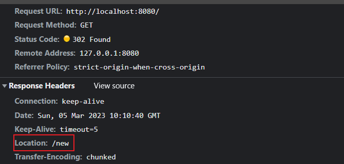

## 一、HTTP协议基础及发展历史

### 1.1 网络模型

1. 应用层
   1. 为应用提供很多服务
   2. 构建于TCP协议之上
   3. 屏蔽了网络传输相关细节
2. 传输层
   1. 向用户提供可靠的端到端服务
   2. 传输层向高层屏蔽了下层数据通信的细节
3. 网络层：在结点之间传输创建逻辑链路
4. 数据链路层：在通信和实体之间建立数据链路
5. 物理层：定义物理设备如何传输数据

### 1.2 http协议发展历史

1. http0.9
   1. 只有GET
   2. 没有HEADER等描述数据的信息
   3. 服务器发送完毕就关闭了TCP连接
2. http1.0
   1. 增加了很多命令
   2. 增加了status code和header
   3. 多字符集支持、多部分发送、权限、缓存等
3. http1.1
   1. 持久连接
   2. pipeline
   3. 增加host和其它命令
4. http2.0
   1. 所有数据以二进制传输
   2. 同一个连接里面发送多个请求不再需要按照顺序来
   3. 头部信息压缩及推送等高效率的功能

### 1.3 HTTP三次握手

1. 客户端发送一个信息到服务端，信息包含SYN=1，Seq=X；
2. 服务端响应，信息包含SYN=1，ACK=X+1，Seq=Y；
3. 客户端发送信息：ACK=Y+1，Seq= Z；

为什么需要三次握手？

为了避免网络原因导致的多余的服务器开销。

### 1.4 URL、URI、URN

- Uniform Resource Identifier  /  统一资源标识符。
  - 用来唯一标识互联网上的信息资源
  - 包含URL和URN
-  Uniform Resource Locator / 统一资源定位器
- 协议 + 域名 + 端口号
- URN 永久统一资源定位符

### 1.5 HTTP报文


## 二、HTTP各种特性总览

### 2.1 CORS跨域与解决办法

**模拟跨域：**

server.js

```js
const http  = require('http')
const fs = require('fs')

const server =  http.createServer((req,res)=>{
  const html = fs.readFileSync('test.html','utf8')
  res.writeHead(200,{
    'Content-Type':'text/html'
  })
  res.end(html)
})

server.listen(8080,()=>{
  console.log('server running at localhost:8080');
})
```

server1.js

```js
const http = require('http')

const server = http.createServer((req, res) => {
  res.end('123')
})

server.listen(8081, () => {
  console.log('server running at localhost:8081')
})
```

test.html

```html
<!DOCTYPE html>
<html lang="en">
<head>
  <meta charset="UTF-8">
  <meta http-equiv="X-UA-Compatible" content="IE=edge">
  <meta name="viewport" content="width=device-width, initial-scale=1.0">
  <title>Document</title>
</head>
<body>
    <script>
      const xhr = new XMLHttpRequest()
      xhr.open('GET','http://localhost:8081/');
      xhr.send()
    </script>
</body>
</html>
```

**服务端设置允许跨域请求**

```js
const http = require('http')

const server = http.createServer((req, res) => {
  res.writeHead(200,{
    'Access-Control-Allow-Origin':'*'
  })
  res.end('123')
})

server.listen(8081, () => {
  console.log('server running at localhost:8081')
})
```

### 2.2 CORS跨域限制以及预请求验证

#### 2.2.1 跨域允许

方法：

- GET
- Head
- POST

允许Content-Type

- text/plain
- multipart/form-data
- applicaltion/x-www-form-urlencoded

其它限制

- 请求头限制
- XMLHTTPRequestUpload对象均没有注册任何时间监听器
- 请求中没有使用ReadableStream对象

#### 2.2.2 预请求

在进行跨域请求的时候先进行一个请求，通过服务器允许之后再发送真正的请求。

```js
const http = require('http')

const server = http.createServer((req, res) => {
  res.writeHead(200, {
    'Access-Control-Allow-Origin': '*',    // 允许跨域的源
    'Access-Control-Allow-Headers': 'X-Test-Cors',  // 允许自定义请求头
    'Access-Control-Allow-Methods': 'POST,PUT,Delete',  // 允许跨域的方法
    'Access-Control-Max-Age': '1000' , // 允许跨域请求时间
  })
  res.end('123')
})

server.listen(8081, () => {
  console.log('server running at localhost:8081')
})
```

### 2.3 缓存头

#### 2.3.1 可缓存性

- public：http经过的任何地方都可以进行缓存
- private：发请求的浏览器可以进行缓存
- no-cache：本地可以存缓存，要服务器验证才可以存缓存

#### 2.3.2 到期

- max-age= : 缓存的到期时间，经过多少时间之后需要重新从浏览器获取
- s-maxage=：代理服务器中读取的
- max-stale=:发起请求主动带的头，就是当max-age过期了，还可以在max-stale的时间内使用过期的缓存。

#### 2.3.3 重新验证

- must-revalidate：在max-age设置的缓存过期的时候，必须发起请求，不能使用本地过期的缓存。
- proxy-revalidate：和must-revalidate差不多，用于缓存服务器

#### 2.3.4 其它

- no-store：不能缓存
- np-transform：用于代理服务器告诉代理服务器不要改内容。

#### 2.3.5 设置缓存

```js
res.writeHead(200, {
      'Content-Type': 'text/javascript',
      'Cache-Control':'max-age=20'
})
res.end('console.log("test cache")')
```


**解决刷新页面缓存方法**

打包的时候生成的js等静态资源加上了hash值，这样请求的资源就和以前的不一样。hash的生成和内容相关。

### 2.4 资源验证


**验证头**

- Last-Modified
  - 上次修改时间
  - 配合If-Modified-Since或者If-Unmodified-Since使用
  - 对比上次修改时间来验证资源是否需要更新。
- Etag
  - 数据签名
  - 配合If-Match或者If-Non-Match使用
  - 对比资源的签名判断是否使用缓存。

### 2.5 Cookie

- 通过set-Cookie设置

- 下次请求自动带上

- 键值对的形式，可以设置多个。

- 属性：

- - max-age和expires设置过期时间
  - Secure只在https的时候发送
  - HttpOnly无法通过document.cookie访问

```js
 if (req.url === '/') {
    const html = fs.readFileSync('test.html', 'utf8')
    res.writeHead(200, {
      'Content-Type': 'text/html',
      'Set-Cookie': ['id=123;max-age=2', 'abc=456;HttpOnly']
    })
    res.end(html)
  }
```

**二级域名相同下共享cookie使用domain**

比如a.test.com和b.test.com需要共享cookie，那么我们可以借助test.com设置cookie，并且采用domain

```js
'Set-Cookie': ['id=123;max-age=2', 'abc=456;domain=test.com']
```

### 2.6 长连接


谷歌浏览器最多并发6个，保持的长连接将会被复用。


可以通过设置响应头关闭连接

```js
 res.writeHead(200, {
      'Content-Type': 'image/png',
      'Connection':'close'
 })
```

### 2.7 数据协商

**Accept**

- Accept：想要的数据类型
- Accept-Encoding：数据的编码方式，限制数据的压缩
- Accept-Language：希望展示的语言
- User-Agent：浏览器相关的信息，PC端还是移动端

**Content**

- Content-Type：返回的数据格式
- Content-Encoding：编码格式
- Content-Language：语言类型


### 2.8 redirect



```js
const server = http.createServer((req, res) => {
  if (req.url === '/') {
    res.writeHead(302,{
      'Location':'/new'
    })
    res.end('')
  }
  if (req.url === '/new') {
    const html = fs.readFileSync('test.html', 'utf8')
    res.end(html)
  }
})
```

**301和302区别**

301第一次重定向之后后面访问改路径直接访问被指向的路径。并且会被缓存。使用需谨慎。

302则代表短暂重定向，每次请求都是还会经过当前访问路径。

### 2.9 Content-Security-Policy

https://developer.mozilla.org/zh-CN/docs/Web/HTTP/CSP

**作用**

- 限制获取资源
- 报告资源获取越权

**限制方式**

- default-src限制全局
- 制定资源类型

```js
const http = require('http')
const fs = require('fs')

http.createServer(function (request, response) {
  console.log('request come', request.url)

  if (request.url === '/') {
    const html = fs.readFileSync('test.html', 'utf8')
    response.writeHead(200, {
      'Content-Type': 'text/html',
      // 'Content-Security-Policy': 'script-src \'self\'; form-action \'self\'; report-uri /report'                           
    })
    response.end(html)
  } else {
    response.writeHead(200, {
      'Content-Type': 'application/javascript'
    })
    response.end('console.log("loaded script")')
  }
}).listen(8888)

console.log('server listening on 8888')
```

**前端写法**

```html
 <meta http-equiv="Content-Security-Policy" content="script-src 'self'; form-action 'self';">
```

## 三、nginx与HTTPS

### 3.1 安装使用

nginx官网下载压缩文件，解压之后。通过start nginx就可以启动 了。

```js
server {
  listen      80;
  server_name localhost;

  location /test/ {
    proxy_pass http://127.0.0.1:8080;
    proxy_set_header Host $host;
  }
}
```

### 3.2 代理缓存

```nginx
proxy_cache_path cache levels=1:2 keys_zone=my_cache:10m

server {
  listen      80;
  server_name localhost;

  location /test/ {
    proxy_cache my_cache;
    proxy_pass http://127.0.0.1:8080;
    proxy_set_header Host $host;
  }
}
```

```js
if (request.url === '/data') {
    response.writeHead(200, {
      'Cache-Control': 'max-age=2, s-maxage=20, private',
      'Vary': 'X-Test-Cache' , //校验头是否一样，一样使用代理缓存。
    })
    wait(2).then(() => response.end('success'))
  }
```

### 3.3 https

**加密**

- 私钥
- 公钥

使用公钥加密数据传输到服务器，服务器使用私钥来解。


 https://gist.github.com/Jokcy/5e73fd6b2a9b21c142ba2b1995150808

**生成秘钥**

在nginx下创建certs文件夹，使用上面的命令生成私钥和公钥。

```nginx
server {
  listen       443;
  server_name  test.com;

  ssl on;
  ssl_certificate_key  ../certs/localhost-privkey.pem;
  ssl_certificate      ../certs/localhost-cert.pem;

  location / {
    proxy_cache my_cache;
    proxy_pass http://127.0.0.1:8888;
    proxy_set_header Host $host;
  }
}
```

实现访问http的时候就跳转到https

```nginx
server {
  listen       80;
  # listen       [::]:80 default_server;
  server_name  test.com;

  # return 302 https://$server_name$request_uri;

  location / {
    proxy_cache my_cache;
    proxy_pass http://127.0.0.1:8888;
    proxy_set_header Host $host;
  }
}

server {
  listen       443;
  server_name  test.com;

  ssl on;
  ssl_certificate_key  ../certs/localhost-privkey.pem;
  ssl_certificate      ../certs/localhost-cert.pem;

  location / {
    proxy_cache my_cache;
    proxy_pass http://127.0.0.1:8888;
    proxy_set_header Host $host;
  }
}
```

### 3.4 http2

- 信道复用
- 分帧传输
- Server Push：可以主动推送

只需要一个连接来发送请求，性能好。

使用nginx开启http2

```nginx
server {
  listen       443 http2;
  server_name  test.com;

  http2_push_preload  on;

  ssl on;
  ssl_certificate_key  ../certs/localhost-privkey.pem;
  ssl_certificate      ../certs/localhost-cert.pem;

  location / {
    proxy_cache my_cache;
    proxy_pass http://127.0.0.1:8888;
    proxy_set_header Host $host;
  }
}
```

