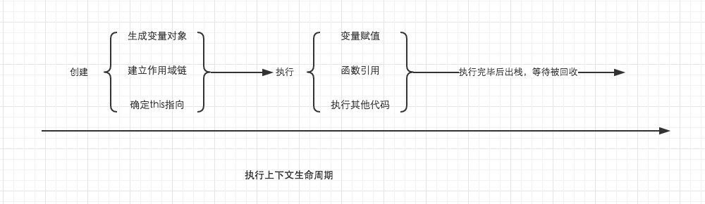
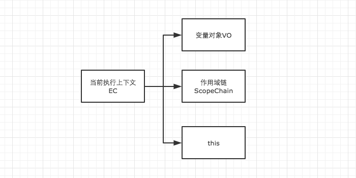
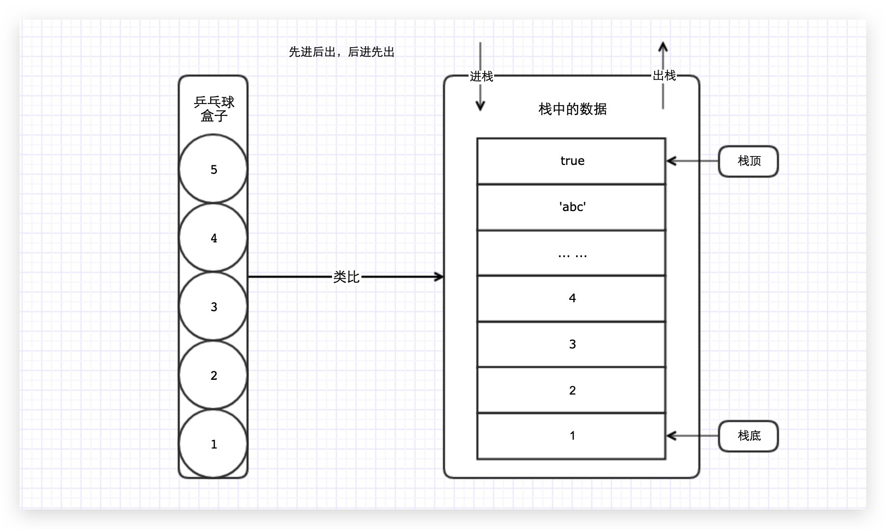
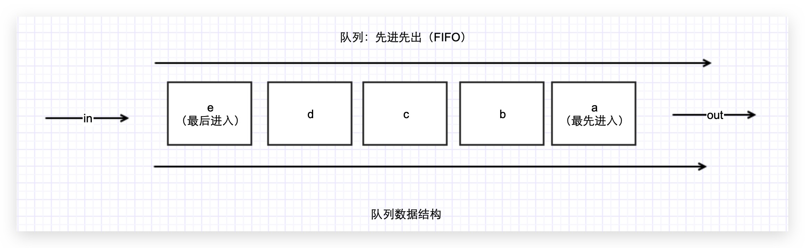
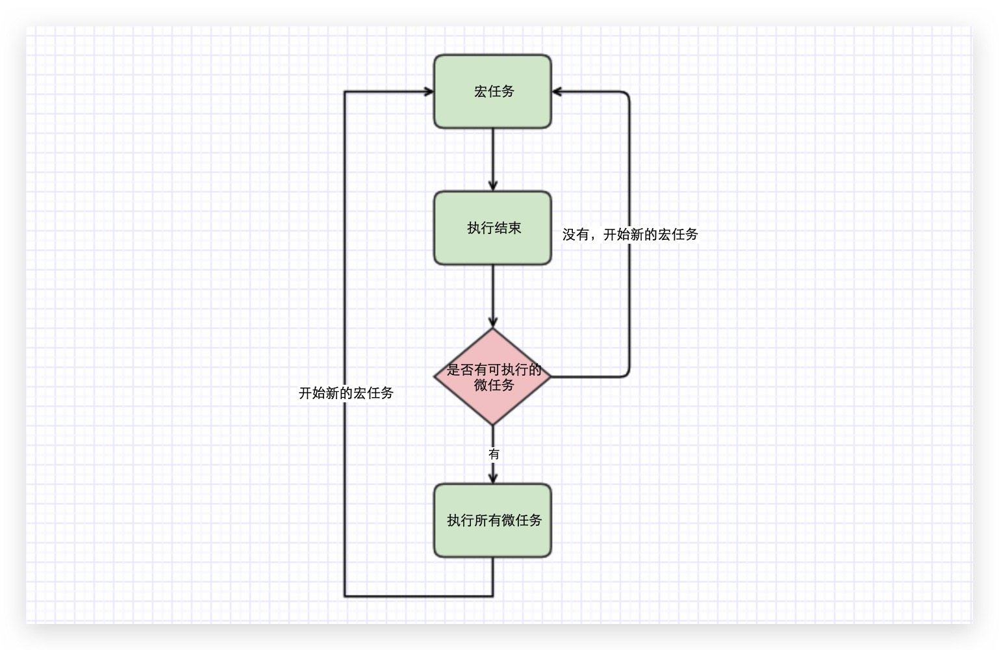
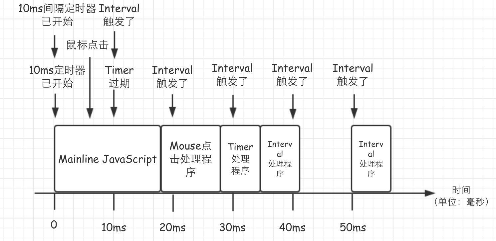

## 第一章、编译阶段

### 1.1 编译原理及编译过程

#### 1.1.1 编译原理

JavaScript 是一门编译语言。与传统的编译语言不同的是，JavaScript 不是提前编译的，编译结果也不能在分布式系统中进行移植。

在传统编译语言的流程中，程序中的一段源代码在执行之前会经历三个步骤，统称为 **编译**。

1. 分词 / 词法分析
2. 解析 / 语法分析
3. 代码生成

##### 1.1.1.1 分词和词法分析

这个过程会将由字符组成的字符串分解成有意义的代码块（对编程语言来说），这些代码块被称为 词法单元（Token）。

----

```js
const a = 2;
```

这段程序通常会被分解成为下列词法单元：`var`、`a`、`=`、`2`、`;`。

空格是否会被当作词法单元，取决于空格在这门语言中是否具有意义。

分词（Tokenizing）和词法分析（Lexing）之间的主要差异在于词法单元的识别是通过有状态还是无状态的方式进行的。简单来说，如果词法单元生成器在判断 `a` 是一个独立的词法单元还是其他词法单元的一部分时，调用的是 **有状态的解析规则**，那么这个过程就被称为 **词法分析**。

----

##### 1.1.1.2 解析和语法分析

语法分析（Parsing） 这个过程是将词法单元流转换成一个 由元素逐级嵌套所组成 的代表了程序语法结构的树。这个树被称为 抽象语法树。

##### 1.1.1.3 代码生成

 AST 转换为可执行代码的过程被称为 **代码生成**。这个过程与语言、目标平台等息息相关。 抛开具体细节，简单来说就是有某种方法可以将 `var a = 2;` 的 AST 转化为一组 **机器指令**：创建一个叫做 `a` 的变量（包括 **分配内存** 等），并将一个值存储在变量 `a` 中。

通过上述三个阶段，浏览器已经可以运行我们得到的 **可执行代码**，这三个阶段还有一个合称叫 **编译阶段**。我们把之后对可执行代码的执行称为 **运行阶段**。

#### 1.1.2 编译过程

编译过程中的关键角色：

- **引擎**：从头到尾负责整个 JavaScript 程序的编译及执行过程
- **编译器**：负责语法分析及代码生成等步骤
- **作用域**：负责收集并维护由所有声明的标识符（变量）组成的一系列查询，并实施一套非常严格的规则，确定当前执行的代码对这些标识符的访问权限

---

```js
const a = 2;
```

1. 执行流遇到 `var a`，编译器会询问作用域是否已经有一个该名称的变量存在于同一个作用域的集合中。如果是，编译器会忽略该声明，继续进行编译；否则它会要求作用域在当前作用域的集合中声明一个新的变量，并命名为`a`。
2. 接下来编译器会为引擎生成运行所需的代码，这些代码被用来处理 `a = 2` 这个赋值操作。引擎运行时会首先询问作用域，在当前的作用域集合中，是否存在一个叫作 `a` 的变量，如果是，引擎就会使用这个变量；如果否，引擎就会继续查找该变量。

总结起来就是：

- 编译器在作用域声明变量（如果没有）
- 引擎在运行这些代码时查找该变量，如果作用域中有该变量则进行赋值

在上面的第二步中，引擎执行运行时所需的代码时，会通过查找变量 `a` 来判断它是否已经声明过。查找的过程由作用域进行协助，但是引擎执行怎么查找，会影响最终的查找结果。

还是 `var a = 2;` 这个例子，引擎会为变量 `a` 进行 LHS 查询。当然还有一种 RHS 查询。

> 那么 LHS 和 RHS 查询是什么呢？

这里的 L 代表左侧，R 代表右侧。通俗且不严谨的解释 LHS 和 RHS 的含义就是：**当变量出现在赋值操作的左侧时进行 LHS 查询，出现在右侧时进行 RHS 查询。**

那么描述的更准确的一点，RHS 查询与简单的查找某个变量的值毫无二致，而 LHS 查询则是试图找到变量的容器本身，从而可以对其赋值。

从这个角度说，RHS 并不是真正意义上的"赋值操作的右侧"，更准确的说是"非左侧"。所以，我们可以将 RHS 理解成 Retrieve his source value（取到它的源值），这意味着，"得到某某的值"。

那我们来看一段代码深入理解一下 LHS 与 RHS。

```js
function foo(a) {  
    console.log(a);
}
foo(2);
```

- 在 `console.log(a)` 中，变量 `a` 的引用是一个 RHS 引用，因为我们是取到 `a` 的值。并将这个值传递给 `console.log(…)` 方法
- 相比之下，例如： `a = 2` ，调用 `foo(2)` 时，隐式的进行了赋值操作。这里对 `a` 的引用就是 LHS 引用，因为我们实际上不关心当前的值时什么，只要想把 `=2` 这个赋值操作找到一个目标。

LHS 和 RHS 的含义是 **赋值操作的左侧或右侧** 并不一定意味着就是 `= 赋值操作符的左侧或右侧`。

赋值操作还有其他几种形式，因此在概念上最好将其理解 **赋值操作的目标是谁**（LHS） 以及 **谁是赋值操作的源头**（RHS）。

当然上面的程序并不只有一个 LHS 和 RHS 引用：

```js
function foo(a) {
  // 这里隐式的进行了对形参 a 的 LHS 引用。

  // 这里对 log() 方法进行了 RHS 引用，询问 console 对象上是否有 log() 方法。
  // 对 log(a) 方法内的 a 进行 RHS 引用，取到 a 的值。
  console.log(a);
  // 2
}

// 此处调用 foo() 方法，需要调用对 foo 的 RHS 引用。意味着"去找foo这个值，并把它给我"
foo(2);
```

需要注意的是：我们经常会将函数声明 `function foo(a) {...}` 转化为普通的变量赋值（函数表达式） `var foo = function(a) {…}`，这样去理解的话，这个函数是 LHS 查询。但是有一个细微的差别，编译器可以在代码生成的同时处理声明和值的定义，比如引擎执行代码时，并不会有线程专门用来将一个函数值"分配给" `foo`，因此，将函数声明理解成前面讨论的 LHS 查询和赋值的形式并不合适。

### 1.2  词法作用域

作用域就是变量（标识符）适用范围，控制着变量的可见性。

作用域共有两种主要的工作模式：

- 词法作用域/静态作用域
- 动态作用域

JavaScript 采用 **词法作用域**（Lexical Scope），也称为 **静态作用域**。

因为 JavaScript 采用的是词法作用域，因此函数的作用域在函数定义的时候就决定了。

而与词法作用域相对的是动态作用域，函数的作用域是在函数调用的时候才决定的。

#### 1.2.1 词法作用域/静态作用域

简单来说，词法作用域就是定义在词法阶段的作用域。换句话来说，词法作用域是由你在写代码时将变量和块作用域写在哪里来决定的，因此当词法分析器处理代码时会保持作用域不变

```js
function foo(a) {
  var b = a * 2;

  function brc(c) {
    console.log(a, b, c);
  }

  bar(b * 3);
}

foo(2); // 2, 4, 12
```


- 包含着整个全局作用域，其中只有一个标识符：`foo`
- 包含着 `foo` 所创建的作用域，其中有三个标识符：`a`、`bar` 和 `b`
- 包含着 `bar` 所创建的作用域，其中只有一个标识符：`c`

##### 1.2.1.1 查找

作用域气泡的结构和互相之间的位置关系给引擎提供了足够的位置信息，引擎利用这些信息来查找标识符的位置。

在上个代码片段中，引擎执行 `console.log` 声明，并依次查找 `a`、`b` 和 `c` 三个变量的引用。

- 它首先从最内部的作用域，也就是 `bar` 函数的作用域气泡开始查找
- 引擎无法在这里找到 `a`，因此会去上一级到所嵌套的 `foo` 的作用域中继续查找。在这里找到了 `a`，因此引擎使用了这个引用
- 对 `b` 来讲也是一样的
- 而对 `c` 来说，引擎在 `bar` 中就找到了它

如果 `a`、`c` 都存在于 `bar` 和 `foo` 的内部，`console.log` 就可以直接使用 `bar` 中的变量，而无需到外面的 `foo` 中查找。

##### 1.2.1.2 遮蔽

**作用域查找会在找到第一个匹配的标识符时停止**。

在多层嵌套作用域中允许定义同名标识符，称为 **遮蔽效应**（内部的标识符遮蔽了外部的标识符）。

抛开遮蔽效应，作用域查找始终从运行时所处的最内部作用域开始，逐级向外或者说向上层作用域进行查询，直到遇见第一个匹配的标识符为止。

全局变量会自动成为全局对象的属性（比如浏览器中的 Window 对象），因此可以不直接使用全局对象的词法名称，而是间接地通过对全局对象属性的引用来对其进行访问。

#### 1.2.2 动态作用域

词法作用域最重要的特征是它的定义过程发生在代码的书写阶段。

实际上动态作用域是 JavaScript 另一个重要机制 [this](https://tsejx.github.io/javascript-guidebook/core-modules/executable-code-and-execution-contexts/execution/this) 的表亲。作用域混乱多数是因为词法作用域和 `this` 机制相混淆。

**动态作用域** 并不关心函数和作用域是如何声明以及在何处声明，它只关心它们从何处调用。

换句话说，[作用域链](https://tsejx.github.io/javascript-guidebook/core-modules/executable-code-and-execution-contexts/execution/scope-chain) 是基于 **调用栈** 的，而不是代码中的作用域嵌套。

```js
const a = 2;

function foo() {
  console.log(a);
}

function bar() {
  const a = 3;
  foo();
}

bar();
```

- 如果处于词法作用域，变量 `a` 首先在 `foo` 函数中查找，没有找到。于是 **顺着作用域链到全局作用域** 中查找，找到并赋值为 `2`。所以控制台输出 `2`
- 如果处于动态作用域，同样地，变量 `a` 首先在 `foo` 中查找，没有找到。这里会 **顺着调用栈** 在调用 `foo` 函数的地方，也就是 `bar` 函数中查找，找到并赋值为 `3`。所以控制台输出 `3`

对于两种作用域的区别，简而言之，词法作用域是在 **定义** 时确定的，而动态作用域是在 **运行** 时确定的。

### 1.3 函数作用域

**函数作用域** 指属于这个函数的全部变量都可以在整个函数的范围内使用及复用（事实上在嵌套的作用域中也可以使用）。这种设计方案是非常有用的，能充分利用 JavaScript 变量可以根据需要改变值类型的动态特性。

#### 1.3.1 隐藏内部实现

对函数的传统认知就是先声明一个函数，然后再向里面添加代码。但反过来想也可以带来一些启示：从所写的代码中挑选出一个任意的片段，然后用函数声明对它进行包装，实际上就是把这些代码隐藏起来。

实际的结果就是在这个代码片段的周围创建了一个作用域气泡，也就是说这段代码中的任何声明（变量或函数）都将绑定在这个新创建的包装函数的作用域中，而不是先前所在的作用域中。换句话说，可以把变量和函数包裹在一个函数的作用域中，然后用这个作用域来隐藏它们。

有很多原因促成了这种基于作用域的隐藏方法。它们大都是从 [最小权限原则](https://zh.wikipedia.org/wiki/最小权限原则) 中引申出来的。

这个原则是指在软件设计中，应该最小限度地暴露必要内容，而将其他内容都 **隐藏** 起来，比如某个模块或对象的 API 设计。这个原则可以延伸到如何选择作用域来包含变量和函数。如果所有变量和函数都在全局作用域中。当然可以在所有的内部嵌套作用域中访问到它们。但这样会破坏前面提到的最小权限原则，因为可能会暴露过多的变量或函数，而这些变量或函数本应该是私有的，正确的代码应该是 **可以阻止对这些变量或函数进行访问**。

```js
function doSomething(a) {
  b = a + doSomethingElse(a * 2);

  console.log(b * 3);
}

function doSomethingElse(a) {
  return a - 1;
}

var b;

doSomething(2);
// 15
```

在这个代码片段中，变量 `b` 和函数 `doSomethingElse` 应该是 `doSomething` 内部具体实现的私有内容。给予外部作用域对 `b` 和 `doSomethingElse` 的访问权限不仅没有必要，而且可能是危险的，因为它们可能被有意或无意地以非预期的方式使用，从而导致超出了 `doSomething` 的适用条件。更使用的设计会将这些私有的具体内容隐藏在 `doSomething` 内部。

```js
function doSomething(a) {
  function doSomethingElse(a) {
    return a - 1;
  }

  var b;

  b = a + doSomethingElse(a * 2);

  console.log(b * 3);
}

doSomething(2); // 15
```

现在，`b` 和 `doSomethingElse` 都无法从外部被访问，而只能被 `doSomething` 所控制。功能性和最终效果都没有受影响，但是设计上将具体内容私有化了，设计良好的软件都会依次进行实现。

#### 1.3.2 规避命名冲突

隐藏作用域中的变量和函数可以避免同名标识符之间的冲突，两个标识符可能具有相同的名字但用途却不一样，无意间可能造成命名冲突。冲突会导致变量的值被意外覆盖。

```js
function foo() {
  function bar(a) {
    // 修改 for 循环所属作用域中的 i
    i = 3;
    console.log(a + i);
  }

  for (var i = 0; i < 10; i++) {
    // 糟糕，无限循环了！
    bar(i * 2);
  }
}

foo();
```

#### 1.3.2.1 全局命名空间

变量冲突的一个典型例子存在于全局作用域中。当程序中加载了多个第三方库时，如果它们没有妥善地将内部私有的函数或变量隐藏起来，就会很容易引发冲突。

这些库通常会在全局作用域中声明一个名字足够独特的变量，通常是一个对象。这个对象被用作库的命名空间，所有需要暴露给外界的功能都会成为这个对象（命名空间）的属性，而不是将自己的标识符暴露在顶级的词法作用域中。

```js
const MyReallyCoolLibrary = {
  awesome: 'stuff',
  doSomething: function () {
    // ...
  },
  doAnotherThing: function () {
    // ...
  },
};
```

##### 1.3.2.2 模块管理

另外一种避免冲突的办法和现代的模块机制很接近，就是众多模块管理器中挑选一个来使用。使用这些工具，任何库都无需将标识符加入到全局作用域中，而是通过依赖管理器的机制将库的标识符显式地导入到另外一个特定的作用域中。

显而易见，这些工具并没有能够违反词法作用域规则的功能。它们只是利用作用域的规则强制所有标识符都不能注入到共享作用域中，而是保持在私有、无冲突的作用域中，这样可以有效规避掉所有的意外冲突，

因此，只要你愿意，即使不使用任何依赖管理工具也可以实现规避冲突的功效。

在任意代码片段外部添加包装函数，可以将内部的变量和函数定义 **隐藏** 起来，外部作用域无法访问包装函数内部的任何内容。

```js
const a = 2;

function foo() {
  // <-- 添加这一行
  const a = 3;
  console.log(a); // 3
} // <-- 以及这一行
foo(); // <-- 以及这一行

console.log(a); // 2
```

虽然这种技术可以解决一些问题，但是它并不理想，因为会导致一些额外的问题。首先，必须声明一个具名函数 `foo()` ，意味着 `foo` 这个名称本身"污染"了所在作用域（在这个例子中是全局作用域）。其次，必须显式地通过函数名`foo()`调用这个函数才能运行其中的代码。

如果函数不需要函数名（或者至少函数名可以不污染所在作用域），并且能够自动运行，这将会更加理想。

#### 1.3.3 匿名和具名函数表达式

无论是匿名还是具名，都是针对 **函数表达式** 的。函数声明必须有名称，否则报错。

```js
// 函数声明
function foo() {
  // do something
}
```

而函数表达式可以有名称也可以没有名称。

**匿名函数表达式：**

```js
let foo = function () {
  // do something
};
console.log(foo.name);
// foo
```

**具名函数表达式：**

```js
// 不要这样写
let bar = function foobar() {
  // do something
};
console.log(bar.name);
// foobar
```

对于函数表达式最熟悉的场景可能就是回调参数了。

```js
setTimeout(function () {
  console.log('I waited 1 second!');
}, 1000);
```

这叫 **匿名函数表达式**，因为 `function(){}` 是没有名称的标识符。

**注意**：函数表达式可以是匿名的，而 **函数声明** 是不可以省略函数名。

匿名函数表达式的缺点：

- 匿名函数在栈追踪中不会显示出有意义的函数名，使得调试很困难
- 如果没有函数名，当函数需要引用自身时只能使用已经过期的 `arguments.callee` 引用。比如在递归中，另一个函数需要引用自身的例子，是在事件触发后事件监听器需要解绑自身
- 匿名函数省略了对于代码可读性 / 可理解性很重要的函数名。一个描述性的名称可以让代码不言自明

行内函数表达式非常强大且有用——匿名和具名之间的区别并不会对这点有任何影响。给函数表达式指定一个函数名可以有效解决以上问题。始终给函数表达式命名时一个最佳实践。

#### 1.3.4 立即执行函数表达式 IIFE

**立即执行函数表达式** 又称 **自执行函数**，社区给他规定了术语为 **IIFE**（Immediately Invoked Function Expression）。

**代码示例**：

```js
(function () {
  // do something
  console.log('IIFE');
})();
```

IIFE 的另一个非常普遍的进阶用法是把它们当作函数调用并传递参数进去。

```js
var a = 2;
(function IIFE(global) {  var a = 3;  console.log(a);  // 3  console.log(global.a);  // 2})(window);
console.log(a);// 2
```

### 1.4 块作用域

尽管函数作用域是最常见的作用域单元，也是现行大多数 JavaScript 最普遍的设计方法，但其他类型的作用域单元也是存在的，并且通过使用其他类型的作用域单元甚至可以实现维护起来更加优秀、简洁的代码，比如块作用域。

#### 1.4.1 var

ES5 及之前是没有块级变量这个说法的，常规性是用 **闭包** 来防止内存泄漏。

如下所示为 ES5 中 `var` 声明的一些特点：

- 函数内的变量若是带 `var` 声明，则会覆盖外部的全局变量 **优先使用**
- 若是函数内部声明变量不带 `var` 声明，则直接 **覆盖同名的全局变量**
- 函数内存在 [声明提升](https://tsejx.github.io/javascript-guidebook/core-modules/executable-code-and-execution-contexts/compilation/hoisting) 的情况，可以先使用后声明
- `for` 循环中的 `var` 会污染全局（不局限于循环内）

#### 1.4.2 let

`let` 声明使用方法基本和 `var` 相同，而且声明的变量只在其块和子块中可用。 二者之间最主要的区别在于 `var` 声明的变量的作用域是整个封闭函数。

- 不允许重新声明同名变量，会抛出异常，具有唯一性
- 不允许没声明就使用，会抛出异常，只有执行该声明的时候才能使用
- 有自己特色的闭包特性，比如在 `for` 循环的应用中

#### 1.4.3 const

`const` 的用法跟 `let` 差不多，但是 `const` 一定要赋值，不赋值会报错。

`const` 是块级作用域，`const` 跟 `let` 的语义相似，就是用来声明常量的，一旦声明了就不能更改。

值得注意的是 `const` 声明的变量记录的是 **指针**，不可更改的是 **指针**，如果 `const` 所声明的是对象，对象的内容还是可以修改的。

- 与 `let` 一样，具有唯一性，**不可重复声明**
- 可以将 `const` 声明的基本类型变量理解为只读变量，但是其声明的引用类型变量则是可修改的

#### 1.4.4 暂时性死区

使用 `let` 或 `const` 声明的变量，在声明赋值没有到达之前，访问该变量都会导致报错，就连一直以为安全的 `typeof` 也不再安全。

```js
// TDZ1
function foo() {
  // TDZ 开始
  console.log(typeof number);
  let number = 5; // TDZ 结束
}

foo();
// ReferenceError: number is not defined
```

报的错是 `ReferenceError`，如果使用 `var` 声明的话，`number` 输出应该是 `undefined`，从 `let` 声明的变量的块的第一行，到声明变量之间的这个区域被称作 **暂时性死区**（TDZ）。凡是在这个区域使用这些变量都会报错。

```js
// TDZ2
function bar() {
  console.log(typeof number);
}

bar();
// undefined
```

在函数里没有用 `let` 声明 `number` 的时候，`number` 是 `undefined`，讲道理在 `let` 声明前也应该是 `5`，然而 `foo` 函数却报了错，证明了就算是在未到达 `let` 声明的地方，但是在用 `let` 之前已经起到了作用。这是不是说明其实 `let` 也有提升（这个提升并不是 `var` 的那种提升，只是有影响），只是在 TDZ 使用的时候报错了，而不是 `undefined`。

事实上，当 JavaScript 引擎检视下面的代码块有变量声明时，对于 `var` 声明的变量，会将声明提升到函数或全局作用域的顶部，而对 `let` 或 `const` 的时候会将声明放在暂时性死区内。

任何在暂时性死区内访问变量的企图都会导致 **运行时错误**（Runtime Error）。只有执行到变量的声明语句时，该变量才会从暂时性死区内被移除并可以安全使用。

#### 1.4.5 显式块级作用域

在嵌套的作用域内使用 `let` 声明同一变量是被允许的。这个嵌套的作用域，在 ES6 中又称 **显式块级作用域**。

```js
var foo = 1;

{
  // 不会报错
  let = 2;
  // other code
}
```

同时因为是 `let` 和 `const` 是块级作用域，声明的变量在当前块使用完之后就会被释放，所以就算使用相同的标识符也不会覆盖外部作用域的变量, 而 `var` 是会覆盖外部作用域的变量的。

```js
function foo() {
  var bar = 1;
  {
    let bar = 2;
  }

  console.log(bar);
}

function zoo() {
  var bar = 1;
  {
    var bar = 2;
  }

  console.log(bar);
}

foo(); // 1
zoo(); // 2
```

在 ECMAScript 6 的发展阶段，被广泛认可的变量声明方式是：默认情况下应当使用 `let` 而不是 `var` 。

对于多数 JavaScript 开发者来说， `let` 的行为方式正是 `var` 本应有的方式，因此直接用 `let` 替代 `var` 更符合逻辑。在这种情况下，你应当对 **需要受到保护的变量** 使用 `const`。

在默认情况下使用 `const` ，而只在你知道变量值 **需要被更改** 的情况下才使用 `let` 。这在代码中能确保基本层次的不可变性，有助于防止某些类型的错误。

### 1.5 声明提升

JavaScript 程序的运行阶段分为 **预编译阶段** 和 **执行阶段**。

在预编译阶段，JavaScript 引擎会做一件事情，那就是读取 `变量的定义` 并 `确定其作用域` 即生效范围。

- 变量定义
  - 使用 `var` 或 `let` 关键字定义的变量，在未赋值的情况下，该变量的值是 `undefined`
  - 使用 `const` 关键字定义变量却不赋值，将会抛出错误
- 变量作用域
  - 全局变量的作用域遍布全局
  - 局部变量的作用域仅在于函数内部及其嵌套函数的作用域
  - 函数内部的同名变量或参数优先级高于全局同名变量

在 JavaScript 中，如果变量或函数没有声明就被使用，会引致错误的。

```js
console.log(a);
// Uncaught ReferenceError: a is not defined
```

**声明提升** 包括 **变量声明提升** 和 **函数声明提升**：

- **变量声明提升**：通过 `var`、`let` 和 `const` 声明的变量在代码执行之前被 JavaScript 引擎提升到当前作用域的顶部
- **函数声明提升**：通过函数声明的方式（非函数表达式）声明的函数在代码执行之前被 JavaScript 引擎提升了当前作用域的顶部，而且 **函数声明提升优先于变量声明提升**

JavaScript 的代码在生成前，会先对代码进行编译，编译的一部分工作就是找到所有的声明，然后建立作用域将其关联起来，因此，在 **当前作用域内** 包括变量和函数在内的所有声明都会在任何代码被执行前首先被处理。

注意这里是 **声明** 会被提前处理，**赋值** 并没有， 定义声明是在编译阶段进行的，而赋值是在执行阶段进行的 。也就是说声明提升了，赋值还留着原地，等待执行。

#### 1.5.1 变量声明提升

```js
console.log(a);
var a = 2;
console.log(a);
```

```js
var a;
// 变量声明 默认赋值 undefined

comsole.log(a);
// 输出变量a undefined

a = 2;
// 给a赋值2

console.log(a);
// 输出变量 a 为 2
```

#### 1.5.2 函数声明提升

函数的两种创建方式：

- 函数声明
- 函数表达式

```js
foo();
// 输出 'bar'

function foo() {
  console.log('bar');
}
```

```js
foo();
// 报错：foo is not a function

var foo = function () {
  console.log('bar');
};
```

解析：同样地先执行函数，后创建函数，结果却是不一样。原因在于，通过函数声明的方式，该 **函数声明**（包括定义）会被提升至作用域的顶部，而表达式的创建方式则只提升了变量 `foo` 至作用域的顶部，此时的 `foo` 其值为`undefined`，调用 `foo` 自然报错：`foo` 不是一个方法。

```js
var foo = function () {
  console.log('1');
};

function foo() {
  console.log('2');
}

foo();
// '1'
```

预编译阶段进行变量声明提升和函数声明提升后，上述代码执行效果等同于：

```js
// 变量声明提升
const foo;

// 函数声明提升
function foo(){
  console.log('2');
}

// 变量赋值保持原位执行，foo 函数被覆盖
foo = function(){
  console.log('1');
};

foo();
// '1'
```

总结：

- 函数声明提升，会将函数的声明和定义全都提升至作用域顶部
- 变量声明提升，只提升声明部分（未赋值状态），赋值部分保持原位置不动

#### 1.5.3 函数覆盖

函数声明和变量声明都会被提升。但是，**函数声明会覆盖变量声明**。

```js
var a;

function a() {}

console.log(a);
// 'function a(){}'
```

但是，如果变量存在赋值操作，则最终的值为变量的值。

```js
var a = 1;
function a() {}
console.log(a);
// 'function a(){}'

var a;
function a() {}
console.log(a);
// 'function a(){}'

a = 1;
console.log(a);
// 1
```

**变量的重复声明是无用的**，但**函数的重复声明会覆盖前面的声明**（无论是变量还是函数声明）。

##### 1.5.3.1 重复声明无效

```js
var a = 1;
var a;
console.log(a);
```

输出结果为 1，以上代码等同于：

```js
// 此时 a 的默认值为 undefined
var a;

a = 1;

console.log(a);
// 1
```

##### 1.5.3.2 函数声明优先

由于函数声明提升优先于变量声明提升，所以变量的声明无效。

```js
var a;

function a() {
  console.log(1);
}

a();
// 1
```

##### 1.5.3.3 函数声明覆盖

后面的函数声明会覆盖前面的函数声明。

```js
a();
// 2

function a() {
  console.log(1);
}

function a() {
  console.log(2);
}
```

### 1.6 闭包

在了解闭包之前，先要熟悉以下几点：

1. 首先要理解执行环境（[执行上下文栈](https://tsejx.github.io/javascript-guidebook/core-modules/executable-code-and-execution-contexts/execution/execution-context-stack)），执行环境定义了变量或函数有权访问的其他数据。
2. 每个执行环境都有一个与之关联的 [变量对象](https://tsejx.github.io/javascript-guidebook/core-modules/executable-code-and-execution-contexts/execution/variable-object)，环境中定义的所有变量和函数都保存在这个对象中。
3. 每个函数都有自己的执行环境，当执行流进入一个函数时，函数的环境就会被推入到一个环境栈中。而在函数执行之后，栈将其环境弹出，把控制权返回给之前的执行环境。
4. 当某个函数被调用时，会创建一个执行环境及其相应的 **作用域链**。然后使用 `arguments` 和其他命名参数的值来初始化函数的活动对象。在函数中，活动对象作为变量对象使用（*作用域链是由每层的变量对象使用链结构链接起来的*）。
5. 在作用域链中，外部函数的活动对象始终处于第二位，外部函数的外部函数的活动对象处于第三位，直到作用域链终点即全局执行环境。
6. **作用域链的本质是一个指向变量对象的指针列表，它只引用但不实际包含变量对象。**

#### 1.6.1 定义

**闭包的定义**：指有权访问另一个函数作用域中的变量的函数，一般情况就是在一个函数中包含另一个函数。

**闭包的作用**：访问函数内部变量、保持函数在环境中一直存在，不会被垃圾回收机制处理

函数内部声明的变量是局部的，只能在函数内部访问到，但是函数外部的变量是对函数内部可见的。

子级可以向父级查找变量，逐级查找，直到找到为止或全局作用域查找完毕。

因此我们可以在函数内部再创建一个函数，这样对内部的函数来说，外层函数的变量都是可见的，然后我们就可以访问到他的变量了。

```js
function foo() {
  let value = 1;

  function bar() {
    console.log(value);
  }

  return bar;
}

const baz = foo();

// 这就是闭包的作用，调用 foo 函数，就会执行里面的 bar 函数，foo 函数这时就会访问函数外层的变量
baz();
```

`bar` 包含 `foo` 内部作用域的闭包，使得该作用域能够一直存活，不会被垃圾回收机制处理掉，这就是闭包的作用，以供 `bar` 在任何时间进行引用。

#### 1.6.2 执行过程分析

我们通过一段代码仔细分析上述代码片段执行过程到底发生了什么：

```js
function foo() {
  var a = 2;

  function bar() {
    console.log(a);
  }

  return bar;
}

var baz = foo();

baz();
```

1. 代码执行流进入全局执行环境，并对全局执行环境中的代码进行声明提升。
2. 执行流执行 `var baz = foo` ，调用 `foo` 函数，此时执行流进入 `foo` 执行环境中，对该执行环境中的代码进行声明提升过程。此时执行环境栈中存在两个执行环境，`foo` 函数为当前执行流所在执行环境。
3. 执行流执行代码 `var a = 2;`，对 `a` 进行 LHS 查询，给 `a` 赋值 2。
4. 执行流执行 `return bar` ，将 `bar` 函数作为返回值返回。按理说，这时 `foo` 函数已经执行完毕，应该销毁其执行环境，等待垃圾回收。但因为其返回值是 `bar` 函数。`bar` 函数中存在自由变量 `a`，需要通过作用域链到 `foo` 函数的执行环境中找到变量 `a` 的值，所以虽然 `foo` 函数的执行环境被销毁，但其变量对象不能被销毁，**只是从活动状态变成非活动状态**；而全局环境的变量对象则变成活动状态；执行流继续执行 `var baz = foo`，把 `foo` 函数的返回值 `bar` 函数赋值给 `baz`。
5. 执行流执行 `baz` ，通过在全局执行环境中查找 `baz` 的值，`baz` 保存着 `foo` 函数的返回值 `bar`。所以这时执行 `baz` ，会调用 `bar` 函数，此时执行流进入 `bar` 函数执行环境中，对该执行环境中的代码进行声明提升过程。此时执行环境栈中存在三个执行环境，`bar` 函数为当前执行流所在的执行环境。
6. 在声明提升的过程中，由于 `a` 是个自由变量，需要通过 `bar` 函数的作用域链 `bar -> foo -> 全局作用域` 进行查找，最终在 `foo` 函数中找到 `var a = 2;` ，然后在 `foo` 函数的执行环境中找到 `a` 的值是 2，所以给 `a` 赋值 2。
7. 执行流执行 `console.log(a)` ，调用内部对象 `console`，并从 `console` 对象中找到 `log` 方法，将 `a` 作为参数传递进去。从 `bar` 函数的执行环境中找到 `a` 的值是 2，所以，最终在控制台显示 2。
8. 执行流执行完 `bar` 函数后，`bar` 的执行环境被弹出执行环境栈，并被销毁，等待垃圾回收，控制权还给全局执行环境。
9. 当页面关闭时，所有执行环境都被销毁。

```js
// 执行上下文栈
ECStack = [
  globalContext
]

// 全局执行上下文
global = {
  VO: [global],
  Scope: [globalContext.VO],
  this: globalContext.VO
}

// 函数foo被创建，保存作用域链到函数内部属性[[Scopes]]
foo.[[Scopes]] = [
  globalContext.VO
]
```

```js
// foo函数执行上下文
fooContext = {
  AO: {
    a: undefined,
    bar: function () {
      console.log(a);
    },
    arguments: [],
  },
  Scope: [AO, globalContext.VO],
  this: undefined,
};
```

```js
// bar 函数执行上下文
barContext = {
  AO: {
    a: undefined,
    arguments: [],
  },
  Scope: [AO, globalContext.VO],
  this: undefined,
};
```

当 `bar` 函数执行的时候，`foo` 函数上下文已经被销毁了（亦即从执行上下文栈中被弹出），怎么还会读取到 `foo` 作用域下的 `a` 值呢？

当我们了解了具体的执行过程后，我们知道 `bar` 函数执行上下文维护了一个作用域链：

```js
barContext = {
  Scope: [AO, fooContext.AO, globalContext.VO],
};
```

对的，就是因为这个作用域链，`bar` 函数依然可以读取到 `fooContext.AO` 的值，说明当 `bar` 函数引用了 `fooContext.AO` 中的值的时候，即使 `fooContext` 被销毁了，但是 JavaScript 依然会让 `fooContext.AO` 活在内存中，`bar` 函数依然可以通过 `bar` 函数的作用域链找到它，正是因为 JavaScript 做到了这一点，从而实现了闭包这个概念。

#### 1.6.3 应用场景

闭包的常见应用场景：

- **函数嵌套**：函数里面的函数能够保证外面的函数的作用域不会被销毁，所以无论是在函数里面还是在外面调用函数里面的函数都可以访问到外层函数的作用域，具体做法可以将里面函数当做返回值返回后通过两次的括号调用
- **回调函数**：回调函数会保留当前外层的作用域，然后回调到另一个地方执行，执行的时候就是闭包
- **匿名函数自执行**：严格算也不是闭包，就是 `(function(){})()` 这种格式

```js
function hoc(a, b) {
  return function () {
    console.log(a, b);
  };
}

const fn = hoc(1, 2);

setTimeout(fn, 3000);
```

一般 `setTimeout` 的第一个参数是个函数，但是不能传值。如果想传值进去，可以调用一个函数返回一个内部函数的调用，将内部函数的调用传给 `setTimeout`。内部函数执行所需的参数，外部函数传给他，在 `setTimeout` 函数中也可以访问到外部函数。

#### 1.6.4 优缺点

- 优点：能够让希望一个变量长期驻扎在内存之中成为可能，避免全局变量的污染，以及允许私有成员的存在
- 缺点：就是常驻内存会增大内存使用量，并且使用不当容易造成内存泄漏

如果不是因为某些特殊任务而需要闭包，在没有必要的情况下，在其他函数中创建函数是不明智的，因为闭包对脚本性能具有负面影响，包括处理速度和内存消耗。

## 第二章、执行阶段

### 2.1 执行上下文



当我们调用一个函数时（激活），一个新的执行上下文就会被创建。一个执行上下文的生命周期可分为 **创建阶段** 和 **代码执行阶段** 两个阶段。

**创建阶段**：在这个阶段中，执行上下文会分别进行以下操作

- 创建 [变量对象](https://tsejx.github.io/javascript-guidebook/core-modules/executable-code-and-execution-contexts/execution/variable-object)
- 建立 [作用域链](https://tsejx.github.io/javascript-guidebook/core-modules/executable-code-and-execution-contexts/execution/scope-chain)
- 确定 [this](https://tsejx.github.io/javascript-guidebook/core-modules/executable-code-and-execution-contexts/execution/this) 的指向

**代码执行阶段**：创建完成之后，就会开始执行代码，并依次完成以下步骤

- 变量赋值
- 函数引用
- 执行其他代码



#### 2.1.1 可执行代码

每次当控制器转到可执行代码的时候，就会进入一个执行上下文。执行上下文可以理解为当前代码的执行环境，它会形成一个作用域。JavaScript 中的运行环境大概包括三种情况：

- **全局环境**：JavaScript 代码运行起来会首先进入该环境
- **函数环境**：当函数被调用执行时，会进入当前函数中执行代码
- **eval**（不建议使用，可忽略）

因此在一个 JavaScript 程序中，必定会产生多个执行上下文，而 JavaScript 引擎会以栈的方式来处理它们，这个栈，我们称其为 **函数调用栈（Call Stack）**。栈底永远都是全局上下文，而栈顶就是当前执行的上下文。

当代码在执行过程中，遇到以上三种情况，都会生成一个执行上下文，放入栈中，而处于栈顶的上下文执行完毕之后，就会自动出栈。

#### 2.1.2 栈堆实现分析

JavaScript 引擎通过创建 **执行上下文栈（Execution Context Stack，ECS）** 用于管理执行上下文。

----

**为了模拟执行上下文栈的行为，让我们类比执行上下文栈是一个数组。**

```js
ECStack = [];
```

试想当 JavaScript 开始要解释执行代码的时候，最先遇到的就是全局代码，所以初始化的时候首先就会向执行上下文栈压入一个全局执行上下文，我们用 globalContext 表示它，并且只有当整个应用程序结束的时候，ECStack 才会被清空，所以程序结束之前， ECStack 最底部永远有个 globalContext。

```js
ECStack = [globalContext];
```

现在 JavaScript 遇到下面的这段代码了：

```js
function fun3() {
  console.log('fun3');
}

function fun2() {
  fun3();
}

function fun1() {
  fun2();
}

fun1();
```

当执行一个函数的时候，就会创建一个执行上下文，并且压入执行上下文栈，当函数执行完毕的时候，就会将函数的执行上下文从栈中弹出。知道了这样的工作原理，让我们来看看如何处理上面这段代码：

```js
// fun1()
ECStack.push(<fun1> functionContext);

// fun1 中竟然调用了 fun2，还要创建 fun2 的执行上下文
ECStack.push(<fun2> functionContext);

// 擦，fun2 还调用了 fun3！
ECStack.push(<fun3> functionContext);

// fun3 执行完毕
ECStack.pop();

// fun2 执行完毕
ECStack.pop();

// fun1 执行完毕
ECStack.pop();

// JavaScript 接着执行下面的代码，但是 ECStack 底层永远有个 globalContext
```

- JavaScript 引擎是单线程的
- 同步执行，只有栈顶的上下文处于执行中，其他上下文需要等待
- 全局上下文只有唯一的一个，它在浏览器关闭时出栈
- 函数的执行上下文的个数没有限制
- 每次某个函数被调用，就会有个新的执行上下文为其创建，即使是调用的自身函数，也是如此

### 2.2 变量对象

变量对象是与执行上下文相关的数据作用域，存储了在上下文中定义的 **变量** 和 **函数声明**。

因为不同执行上下文中的变量对象稍有不同，所以我们来聊聊 全局执行上下文下的变量对象和 函数执行上下文下的变量对象。

#### 2.2.1 全局执行上下文

 全局执行上下文中的变量对象就是全局对象。全局对象 是预定义的对象，作为 JavaScript 的全局函数和全局属性的占位符。通过使用全局对象，可以访问所有其他所有预定义的对象、函数和属性。

1. 可以通过 `this` 引用，在 JavaScript 中，全局对象就是 Window 对象

   ```js
   console.log(this);
   // Window { ... }
   ```

2. 全局对象是由 Object 构造函数实例化的一个对象

   ```js
   console.log(this instanceof Object);
   // true
   ```

3. 预定义全局函数和全局属性，在任何地方均可调用

   ```js
   console.log(Math.random === this.Math.random);
   // true
   
   console.log(Math.PI === this.Math.PI);
   // true
   ```

4. 作为全局变量的宿主。

   ```js
   const a = 'foo';
   
   console.log(this.a);
   // foo
   ```

5. 在 JavaScript 中，全局对象有 Window 属性指向自身

   ```js
   const a = 'foo';
   console.log(window.a);
   // 'foo'
   
   this.window.b = 'foo';
   console.log(this.b);
   // 'foo'
   ```

#### 2.2.2 函数执行上下文

在函数执行上下文中，我们用 活动对象（Activation Object，AO）来表示变量对象。

活动对象 和 变量对象 其实是同一个东西，只是变量对象是规范上的或者说是引擎实现上的，不可在 JavaScript 环境中访问，只有到当进入一个执行上下文中，这个执行上下文的变量对象才会被激活，所以才叫 Activation Object ，而只有 被激活 的变量对象，也就是活动对象上的各种属性才能被访问。

活动对象是在进入函数执行上下文时刻被创建的，它通过函数的 arguments 属性初始化。

#### 2.2.3 执行过程

执行上下文的代码会分成两个阶段进行处理：

1. **分析**：进入执行上下文
2. **执行**：代码执行

##### 2.2.3.1 进入执行上下文阶段的变量对象

当进入执行上下文时，这时候还没有执行代码，变量对象的创建，依次经历了以下几个过程：

1. 函数的所有形参（如果是函数执行上下文）
   - 建立 Arguments 对象
   - 检查当前上下文的参数，由名称和对应值组成的一个变量对象的属性被创建
   - 没有实参，属性值设为 `undefined`
2. 函数声明
   - 检查当前上下文的函数声明，也就是使用 `function` 关键字声明的函数
   - 在变量对象中以函数名建立一个属性，属性值为指向该函数所在内存地址的引用
   - 如果变量对象已经存在相同名称的属性，那么该属性将会被新的引用所覆盖
3. 变量声明
   - 检查当前上下文中的变量声明
   - 每找到一个变量声明，就在变量对象中以变量名建立一个属性，属性值为 `undefined`
   - 如果变量名称与已经声明的形式参数或函数相同，则变量声明不会干扰已经存在的这类属性（亦可理解为为了防止同名的变量属性被修改为 `undefined`，则会直接跳过，原属性值不会被修改）

---

```js
function foo(a) {
  var b = 2;

  function c() {}

  var d = function () {};

  b = 3;
}
```

```js
AO = {
  arguments: {
      0: 1,
      length: 1
  },
  a: 1,
  b: undefined,
  c: reference to function() {},
  d: undefined
}
```

##### 2.2.3.2 代码执行阶段的变量对象

在代码执行阶段，会根据代码，顺序执行代码，修改变量对象的值。还是上面的例子，当代码执行完后，这时候的 AO 是：

```js
AO = {
  arguments: {
    0: 1,
    length: 1
  },
  a: 1,
  b: 3,
  c: reference to function c(){},
  d: reference to FunctionExpression "d"
}
```

到这里变量对象的创建过程就介绍完了，让我们简洁的总结我们上述所说：

1. 全局执行上下文的变量对象初始化是全局对象
2. 函数执行上下文的变量对象初始化只包括 Arguments 对象
3. 在进入执行上下文时会给变量对象添加形参、函数声明、变量声明等初始的属性值
4. 在代码执行阶段，会再次修改变量对象的属性值

#### 2.2.4 变量对象和活动对象

> VO 和 AO 到底是什么关系？

未进入执行阶段之前，变量对象（VO：Variable Object）中的属性都不能访问。

但是进入执行阶段之后，活动对象（AO：Activation Object）被激活，里面的属性包括 VO、函数执行时传入的参数和 Arguments 对象都能被访问了，然后开始进行执行阶段的操作。

```js
AO = VO + function parameters + arguments
```

### 2.3 作用域链

当查找变量的时候，会先从当前执行上下文的变量对象中查找，如果没有找到，就会从父级（词法层面上的父级）执行上下文的变量对象中查找，一直找到全局上下文的变量对象，也就是全局对象。这样由多个执行上下文的 **变量对象** 构成的链表就叫做作用域链。

下面，我们从一个函数的 **创建** 和 **激活** 两个阶段来剖析作用域链是如何创建和变化的。

#### 2.3.1 函数的创建

函数作用域在函数定义的时候就决定了。

这是因为函数有一个内部属性 `[[Scopes]]`，当函数创建的时候，就会保存所有父级作用域内的变量对象到其中，你可以理解 `[[Scopes]]` 就是所有父级作用域的变量对象的层级链，但是注意：`[[Scopes]]` 并不代表完整的作用域链。

```js
function foo() {
  function bar() {
    // do something
  }
}
```

```js
console.dir(foo);
// [[Scopes]]: Scopes[2]
// 0: Scripts {...}
// 1: Global {...}

foo.[[Scopes]] = [
  globalContext.VO
];

bar.[[Scopes]] = [
  fooContext.AO,
  globalContext.VO
];
```

#### 2.3.2 函数的激活

当函数激活（执行）时，进入函数上下文，创建 VO / AO 后，就会将 **活动对象** 添加到作用域链的前端。

这时候执行上下文的作用域链，我们命名为 Scopes：

```js
Scopes = [AO].concat([[Scopes]]);
```

#### 2.3.3 示例分析

```js
const scope = 'global scope';
function checkscope() {
  var scope2 = 'local scope';
  return scope2;
}
checkscope();
```

1. checkscope 函数被创建，保存作用域链到内部属性 [[Scopes]]。

   ```
   checkscope.[[Scopes]] =  [globalContext.VO]
   ```

   

2. 执行 checkscope 函数，创建 checkscope 函数执行上下文，checkscope 函数执行上下文被压入执行上下文栈

   ```
   ECStack = [checkscopeContext, globalContext];
   ```

3. checkscope 函数并不立刻执行，开始做准备工作，第一步：复制函数 [[Scopes]] 属性创建作用域链。

   ```js
   checkscopeContext = {
     Scopes: checkscope.[[Scopes]],
   }
   ```

4. 用 arguments 创建活动对象，随后初始化活动对象，加入形参、函数声明、变量声明

   ```js
   checkscopeContext = {
     AO: {
       arguments: {
         length: 0
       },
       scope2: undefined
     }，
     Scopes: [checkscope.[[Scopes]]],
   }
   ```

5. 将活动对象压入 checkscope 作用域链顶端

   ```
   checkscopeContext = {
     AO: {
       arguments: {
         length: 0
       },
       scope2: undefined
     }，
     Scopes:[AO, checkscope.[[Scopes]]],
   }
   ```

6. 准备工作做完，开始执行函数，随着函数的执行，修改 AO 的属性值

   ```
   checkscopeContext = {
     AO: {
       arguments: {
         length: 0,
       },
       scope2: 'local scope',
     },
     Scopes: [AO, [[Scopes]]],
   };
   ```

7. 查找到 scope2 的值，返回后函数执行完毕，函数上下文从执行上下文栈中弹出

   ```
   ECStack = [globalContext];
   ```

### 2.4  this

#### 2.4.1 调用位置

在理解 this 的绑定过程之前，首先要理解 this 的调用位置：调用位置就是函数在代码中被调用的位置（而不是声明的位置）。

```js
function baz() {
  // 当前调用栈是：baz
  // 因此，当前调用位置是全局作用域
  console.log('baz');
  bar(); // <-- bar 的调用的位置
}

function bar() {
  // 当前调用栈是 baz -> bar
  // 因此，当前调用调用位置在 baz 中
  console.log('bar');
  foo(); // <-- foo 的调用位置
}

function foo() {
  // 当前调用栈是 baz -> bar -> foo
  // 因此，当前调用位置在 bar 中
  console.log('foo');
}

baz(); // <-- baz 的调用位置
```

#### 2.4.2 绑定规则

函数的执行过程中调用位置决定 `this` 的 **绑定对象**。

你必须找到调用位置，然后判断需要应用下面四条规则中的哪一条。我们首先会分别解释这四条规则，然后解释多条规则都可用时它们的优先级如何排列。

```js
(调用栈) => (调用位置) => (绑定规则) => 规则优先级;
```

##### 2.4.2.1 默认绑定

首先要介绍的是最常用的函数调用类型：独立函数调用。可以把这条规则看作是无法应用其他规则时的默认规则。

```js
function foo() {
  console.log(this.a);
}

// 声明在全局作用域中的变量就是全局对象的一个同名属性
// 相当于 window.a = 2
var a = 2;

// 调用 foo 函数时 this.a 被解析成了全局变量 a
// 因为在本例中，函数调用时应用了 this 的默认绑定
// 因此 this 指向全局对象 global objects 或 window objects
// 分析调用位置来获知 foo 是如何调用的
// foo 函数直接使用不带任何修饰的函数引用进行调用，因此只能使用默认绑定，无法应用其他规则
foo();
// 2
```

如果使用严格模式（Strict Mode），则不能将全局对象用于默认绑定，因此 this 会绑定到 undefined。

```js
function foo() {
  'use strict';

  console.log(this.a);
}

var a = 2;

foo();
// TypeError:this is undefined
```

这里有一个微妙但是非常重要的细节，虽然 `this` 的绑定规则完全取决于调用位置，但是只有 `foo()` 运行在非严格模式下时，默认绑定才能绑定到全局对象；在严格模式下调用 `foo` 则不受默认绑定影响。

```js
function foo() {
  console.log(this.a);
}

var a = 2;

(function () {
  'use strict';

  foo(); // 2
})();
```

##### 2.4.2.2 隐式绑定

另一条需要考虑的规则是调用位置是否有上下文对象，或者说是否被某个对象拥有或者包含，不过这种说法可能会造成一些误导。

```js
function foo() {
  console.log(this.a);
}

const container = {
  a: 2,
  foo: foo,
};

container.foo(); // 2
```

首先需要注意的是 `foo` 的声明方式，及其之后是如何被当作引用属性添加到 `container` 中的。但是无论是直接在 `container` 中定义还是先定义再添加为引用属性，这个函数严格来说都不属于 `container` 对象。

然而，调用位置会使用 `container` 上下文来引用函数，因此你可以说函数被调用时 `container` 对象 **拥有** 或者 **包含** 它。

无论你如何称呼这个模式，当 `foo` 被调用时，它的前面确实加上了对 `container` 的引用。当函数引用有上下文时，隐式绑定规则会把函数调用中的 `this` 绑定到这个上下文对象。因为调用 `foo` 时 `this` 被绑定到 `container` 上，因此 `this.a` 和 `container.a` 是一样的。

**对象属性引用链中只有上一层或最后一层在调用位置中起作用。**

```js
function foo() {
  console.log(this.a);
}

var obj2 = {
  a: 42,
  foo: foo,
};

var obj1 = {
  a: 2,
  obj2: obj2,
};

obj1.obj2.foo(); // 42
```

**隐式丢失**

一个最常见的 `this` 绑定问题就是**被隐式绑定的函数会丢失绑定对象**，也就是说它会应用默认绑定，从而把 `this` 绑定到全局对象或者 `undefined` 上（这取决于是否是严格模式）。

```js
function foo() {
  console.log(this.a);
}

const container = {
  a: 2,
  foo: foo,
};

// 函数别名
const bar = container.foo;

// a 是全局对象的属性
const a = 'Hello world!';

bar();
// "Hello world!"
```

虽然 `bar` 是 `container.foo` 的一个引用，但是实际上，它引用的是 `foo` 函数本身，因此此时的 `bar` 其实是一个不带任何修饰的函数调用，因此应用了默认绑定。

一种更微妙、更常见并且更出乎意料的情况发生在传入回调函数时。

```js
function foo() {
  console.log(this.a);
}

function bar(fn) {
  // fn 其实引用的是 foo
  fn(); // <--调用位置
}

var container = {
  a: 2,
  foo: foo,
};

// a 是全局对象的属性
var a = 'Hello world!';

bar(container.foo);
// "Hello world!"
```

参数传递其实是一种**隐式赋值**，因此我们传入函数时也会被隐式赋值，所以结果和上个示例一样。

如果把函数传入语言内置的函数而不是传入你自己声明的函数，结果是一样的，没有区别。

```js
function foo() {
  console.log(this.a);
}

function bar(fn) {
  // fn 其实引用的是 foo
  fn(); // <--调用位置
}

var container = {
  a: 2,
  foo: foo,
};

// a 是全局对象的属性
var a = 'Hello world!';

bar(container.foo);
// "Hello world!"
```

回调函数丢失 `this` 绑定是非常常见的。

除此之外，还有一种情况 `this` 的行为会出乎我们意料：调用回调函数的函数可能会修改 `this`。在一些流行的 JavaScript 库中事件处理器会把回调函数的 `this` 强制绑定到触发事件的 DOM 元素上。这在一些情况下可能很有用，但是有时它可能会让你感到非常郁闷。遗憾的是，这些工具通常无法选择是否启用这个行为。

无论是哪种情况，`this` 的改变都是意想不到的，实际上你无法控制回调函数的执行方式，因此就没有办法控制调用位置以得到期望的绑定。之后我们会介绍如何通过固定 `this` 来修复这个问题。

##### 2.4.2.3 显式绑定

JavaScript 提供了 apply、call 和 bind 方法，为创建的所有函数 绑定宿主环境。通过这些方法绑定函数的 this 指向称为 显式绑定。

```js
function foo() {
  console.log(ths.a);
}

const container = {
  a: 2,
};

var bar = function () {
  foo.call(container);
};

bar();
// 2

setTimeout(bar, 100);
// 2

// 硬绑定的 bar 不可能再修改它的 this
bar.call(window);
// 2
```

#### 2.4.3 构造调用绑定

在 JavaScript 中，构造函数只是使用 `new` 操作符时被调用的函数。它们并不会属于某个类，也不会实例化一个类，实际上，它们甚至都不能说是一种特殊的函数类型，它们只是被 `new` 操作符调用的普通函数而已。

 使用 new 来调用函数，或者说发生构造函数调用时，会自动执行下面的操作。

1. 创建全新的空对象
2. 将新对象的隐式原型对象关联构造函数的显式原型对象
3. 执行对象类的构造函数，同时该实例的属性和方法被 `this` 所引用，即 `this` 指向新构造的实例
4. 如果构造函数执行后没有返回其他对象，那么 `new` 表达式中的函数调用会自动返回这个新对象

```js
function objectFactory(constructor, ...rest) {
  // 创建空对象，空对象关联构造函数的原型对象
  const instance = Object.create(constructor.prototype);

  // 执行对象类的构造函数，同时该实例的属性和方法被 this 所引用，即 this 指向新构造的实例
  const result = constructor.apply(instance, rest);

  // 判断构造函数的运行结果是否对象类型
  if (result !== null && /^(object|function)$/.test(typeof result)) {
    return result;
  }

  return instance;
}
```

#### 2.4.4 优先级

上文介绍了函数调用中 `this` 绑定的四条规则，你需要做的就是找到函数的调用位置并判断应用哪条规则。但是，如果某个调用位置应用多条规则，则必须给这些规则设定优先级。

毫无疑问，默认绑定的优先级是四条规则中最低的，所以我们先不考虑它。

```unknown
显式绑定 > 构造调用绑定 > 隐式绑定;
```

##### 2.4.4.1 隐式绑定和显式绑定

```js
function foo() {
  console.log(this.a);
}

const container1 = {
  a: 1,
  foo: foo,
};

const container2 = {
  a: 2,
  foo: foo,
};

container1.foo();
// 1
container2.foo();
// 2

container1.foo.call(container2);
// 2
container2.foo.call(container1);
// 1
```

可以看到，显式绑定优先级更高，也就是说在判断时应当先考虑是否可以存在显式绑定。

##### 2.4.4.2 构造调用绑定和隐式绑定

```js
function foo(something) {
  this.a = something;
}

const container1 = {
  foo: foo,
};

const container2 = {};

container1.foo(2);
console.log(container1.a);
// 2

container1.foo.call(container2, 3);
console.log(container2.a);
// 3

var bar = new container1.foo(4);
console.log(container1.a);
// 2
console.log(bar.a);
// 4
```

可以看到 `new` 绑定比隐式绑定优先级高。但是 `new` 绑定和显式绑定谁的优先级更高呢？

`new` 和 `call/apply` 无法一起使用，因此无法通过 `new foo.call(obj1)` 来直接进行测试。但是我们可以使用硬绑定来测试他俩的优先级。

在看代码之前先回忆一下硬绑定是如何工作的。`Function.prototype.bind` 会创建一个新的包装函数，这个函数会忽略它当前的 `this` 绑定（无论绑定的对象是什么），并把我们提供的对象绑定到 `this` 上。

这样看起来硬绑定（也是显式绑定的一种）似乎比 `new` 绑定的优先级更高，无法使用 `new` 来控制 `this` 绑定。

```js
function foo(something) {
  this.a = something;
}

var container1 = {};

var bar = foo.bind(container1);
bar(2);
console.log(container1.a);
// 2

var baz = new bar(3);
console.log(container1.a);
// 2
console.log(baz.a);
// 3
```

#### 2.4.5 绑定例外

##### 2.4.5.1 忽略指向

如果将 `null` 或 `undefined` 作为 `this` 的绑定对象传入 `call`、`apply` 或 `bind`，这些值在调用时会被忽略，实际应用的是默认绑定规则。

```js
function foo() {
  console.log(this.a);
}

const a = 2;

foo.call(null);
// 2
```

此类写法常用于 `apply` 来展开数组，并当作参数传入一个函数，类似地，`bind` 可以对参数进行柯里化（预先设置一些参数）。

```js
function foo(a, b) {
  console.log('a:' + a + ',b:' + b);
}

// 把数组展开成参数
foo.apply(null, [2, 3]);
// a:2, b:3

// 使用 bind 进行柯里化
var bar = foo.bind(null, 2);
bar(3);
// a:2, b:3
```

这两种方法都需要传入一个参数当作 `this` 的绑定对象。如果函数并不关心 `this` 的话，你 仍然需要传入一个占位值，这时 `null` 可能是一个不错的选择。

##### 2.4.5.2 软绑定

硬绑定这种方式可以把 `this` 强制绑定到指定的对象（除了使用 `new` 时），防止函数调用应用默认绑定规则。问题在于，硬绑定会大大降低函数的灵活性，使用硬绑定之后就无法使用隐式绑定或者显式绑定来修改 `this`。

如果可以给默认绑定指定一个全局对象和 `undefined` 以外的值，那就可以实现和硬绑定相同的效果，同时保留隐式绑定或者显式绑定修改 `this` 的能力。

```js
if (!Function.prototype.softBind) { Function.prototype.softBind = function(obj) {
var fn = this;
// 捕获所有 curried 参数
var curried = [].slice.call( arguments, 1 ); var bound = function() {
return fn.apply(
(!this || this === (window || global)) ?
obj : this
curried.concat.apply( curried, arguments )
); };
             bound.prototype = Object.create( fn.prototype );
return bound; };
}
```

##### 2.4.5.3 指向变更

如下列出四种方法可以在编码中改变 `this` 指向。

- 使用 ES6 的箭头函数
- 在函数内部使用 `_this = this`
- 使用 `apply`、`call` 和 `bind`
- `new` 实例化一个对象

##### 2.4.5.4 箭头函数

箭头函数并不是使用 `function` 关键字定义的，而是使用被称为胖箭头的操作符 `=>` 定义的。箭头函数不使用 `this` 的四种标准规则，而是根据外层（函数或者全局）作用域来决定 `this` 的指向。并且，箭头函数拥有静态的上下文，即一次绑定之后，便不可再修改。

`this` 指向的固定化，并不是因为箭头函数内部有绑定 `this` 的机制，实际原因是箭头函数根本没有自己的 `this`，导致内部的 `this` 就是外层代码块的 `this`。正是因为它没有 `this`，所以也就不能用作构造函数。

```js
function foo() {
  // 返回一个箭头函数
  return (a) => {
    // this 继承自 foo()
    console.log(this.a);
  };
}
const container1 = { a: 1 };

const container2 = { a: 2 };

const bar = foo.call(container1);

bar.call(container2);
// 1
```

`foo` 内部创建的箭头函数会捕获调用时 `foo` 的 `this`。由于 `foo` 的 `this` 绑定到 `container1`，`bar`（引用箭头函数）的 `this` 也会绑定到 `container1`，箭头函数的绑定无法被修改。

箭头函数可以像 `bind` 一样确保函数的 `this` 被绑定到指定对象，此外，其重要性还体现在它用更常见的词法作用域取代了传统的 `this` 机制。实际上，在 ES6 之前我们就已经在使用一种几乎和箭头函数完全一样的模式。

虽然 `const self = this` 和箭头函数看起来都可以取代 `bind`，但是从本质上来说，它们想替代的是 `this` 机制。

如果你经常编写 `this` 风格的代码，但是绝大部分时候都会使用 `const self = this` 或者箭头函数来否定 `this` 机制，那你或许应当:

- 只使用词法作用域并完全抛弃错误 `this` 风格的代码
- 完全采用 `this` 风格，在必要时使用 `bind`，尽量避免使用 `const self = this` 和箭头函数

#### 2.4.6 应用场景总结

1. 函数的普通调用
2. 函数作为对象方法调用
3. 函数作为构造函数调用
4. 函数通过 `call`、`apply`、`bind` 间接调用
5. 箭头函数的调用

## 第三章、内存管理

### 3.1 内存模型

JavaScript 内存空间分为 **栈**（Stack）、**堆**（Heap）、**池**（一般也会归类为栈中）。其中 **栈** 存放变量，**堆** 存放复杂对象，**池** 存放常量。

#### 3.1.1 栈数据结构

与 C / C++ 不同，JavaScript 中并没有严格意义上区分栈内存与堆内存。因此我们可以简单粗暴的理解为 JavaScript 的所有数据都保存在堆内存中。但是在某些场景，我们仍然需要基于堆栈数据结构的思维来实现一些功能，比如 JavaScript 的 [执行上下文](https://tsejx.github.io/javascript-guidebook/core-modules/executable-code-and-execution-contexts/execution/execution-context-stack)。执行上下文的执行顺序借用了栈数据结构的存取方式。



#### 3.1.2 堆数据结构

堆数据结构是一种树状结构。它的存取数据的方式，则与书架与书非常相似。

书虽然也整齐的存放在书架上，但是我们只要知道书的名字，我们就可以很方便的取出我们想要的书，而不用像从乒乓球盒子里取乒乓一样，非得将上面的所有乒乓球拿出来才能取到中间的某一个乒乓球。好比在 JSON 格式的数据中，我们存储的 `key-value` 是可以无序的，因为顺序的不同并不影响我们的使用，我们只需要关心书的名字。

#### 3.1.3 队列数据结构

队列是一种先进先出（FIFO）的数据结构。正如排队过安检一样，排在队伍前面的人一定是最先过检的人。用以下的图示可以清楚的理解队列的原理。



#### 3.1.4 变量对象与基础数据类型

JavaScript 的 执行上下文 生成之后，会创建一个叫做 变量对象 的特殊对象，JavaScript 的基础数据类型往往都会保存在变量对象中。

严格意义上来说，变量对象也是存放于堆内存中，但是由于变量对象的特殊职能，我们在理解时仍然需要将其与堆内存区分开来。

JavaScript 中的基础数据类型，这些值都有固定的大小，往往都保存在栈内存中（闭包除外），由系统自动分配存储空间。我们可以直接操作保存在栈内存空间的值，因此基础数据类型都是按值访问，数据在栈内存中的存储与使用方式类似于数据结构中的堆栈数据结构，遵循 **后进先出** 的原则。

#### 3.1.5 引用数据类型与堆内存

与其他语言不同，JavaScript 的引用数据类型，比如数组 Array，它们值的大小是不固定的。引用数据类型的值是保存在堆内存中的对象。JavaScript 不允许直接访问堆内存中的位置，因此我们不能直接操作对象的堆内存空间。在操作对象时，实际上是在操作对象的引用而不是实际的对象。因此，引用类型的值都是按引用访问的。这里的引用，我们可以粗浅地理解为保存在栈内存中的一个**引用地址**，该地址与堆内存的实际值相关联。 堆存取数据的方式，则与书架与书非常相似。 书虽然也有序的存放在书架上，但是我们只要知道书的名字，我们就可以很方便的取出我们想要的书，而不用像从乒乓球盒子里取乒乓一样，非得将上面的所有乒乓球拿出来才能取到中间的某一个乒乓球。好比在 JSON 格式的数据中，我们存储的 `key-value` 是可以无序的，因为顺序的不同并不影响我们的使用，我们只需要关心书的名字。

#### 3.1.6 数据拷贝

##### 3.1.6.1 基本数据类型

在变量对象中数据发生拷贝操作时，系统会自动为新的变量分配一个新值。const b = a 赋值操作执行后，虽然变量 a 和变量 b 均为 100，但是它们其实已经是相互独立互不影响的值了。

##### 3.1.6.2 引用数据类型

引用类型的拷贝同样也会为新的变量自动分配一个新的值保存在变量对象中，但不同的是，这个新的值，仅仅只是引用类型的一个**地址指针**。当地址指针相同时，尽管他们相互独立，但是在变量对象中访问到的具体对象实际上是同一个。

#### 3.1.7 对比栈内存与堆内存

| 栈内存                 | 堆内存                       |
| ---------------------- | ---------------------------- |
| 存储基础数据类型       | 存储引用数据类型             |
| 按值访问               | 按引用访问                   |
| 存储的值大小固定       | 存储的值大小不定，可动态调整 |
| 由系统自动分配内存空间 | 由开发者通过代码进行分配     |
| 主要用来执行程序       | 主要用来存放对象             |
| 空间小，运行效率高     | 空间大，但是运行效率相对较低 |
| 先进后出，后进先出     | 无序存储，可根据引用直接获取 |

### 3.2  内存生命周期

JavaScript 环境中分配的内存一般有如下生命周期：

1. **内存分配**：当我们声明变量、函数、对象的时候，系统会自动为他们分配内存
2. **内存使用**：即读写内存，也就是使用变量、函数等
3. **内存回收**：使用完毕，由**垃圾回收机制**自动回收不再使用的内存。

### 3.3 垃圾回收

在 C 和 C++ 之类的语言中，需要手动来管理内存的，这也是造成许多不必要问题的根源。幸运的是，在编写 JavaScript 的过程中，内存的分配以及内存的回收完全实现了自动管理。

JavaScript 通过 自动垃圾收集机制 实现内存的管理。垃圾回收机制通过垃圾收集器每隔固定的时间段（周期性）找出那些不再需要继续使用的变量，执行一次释放占用内存的操作。

不再需要继续使用的变量也就是生命周期结束的变量。

- **局部变量**：在局部作用域中，当函数执行完毕，局部变量也就没有存在的必要了（除了闭包），因此垃圾收集器很容易做出判断并回收
- **全局变量**：但是全局变量的生命周期直到浏览器卸载页面才会结束，也就是**全局变量不会被当成垃圾变量回收**。所以声明一个全局变量的时候，我们一定要慎重的考虑，在使用完这个变量的对象之后，我们是否还在需要这个对象，如果不需要的话，我们应该手动的将这个变量置为空（`null`），这样在下一次垃圾回收的时候，就能去释放这个变量上一次指向的值

#### 3.3.1 原理

JavaScript 有两种策略实现垃圾回收机制：

- 引用计数法
- 标记清除法

##### 3.3.1.1 引用计数法

**引用计数法：** 跟踪记录每个值被引用的次数，当声明了一个变量并将一个引用类型赋值给该变量时，则这个值的引用次数就是 `1`，如果这个值再被赋值给另一个变量，则引用次数加 `1`。相反，如果包含对这个值引用的变量又取得了另外一个值，则这个值的引用次数就减 `1`。当这个引用次数变成 `0` 时，则说明没有办法再访问这个值了，因而就可以将其所占的内存空间给收回来。这样，垃圾收集器下次再运行时，它就会释放那些引用次数为 `0` 的值所占的内存。

这种垃圾收集方式存在一个比较大的问题就是循环引用，就是说对象 `a` 包含一个指向 `b` 的指针，对象 `b` 也包含一个指向 `a` 的引用。 这就可能造成大量内存得不到回收，也就是内存泄漏，这是因为它们的引用次数永远不可能是 `0`。

```js
function problem() {
  var a = new Object();
  var b = new Object();
  a.ref = b;
  b.ref = a;
}
```

> 浅大小（shallow size）：对象自身所存储的原生值及其他必要数据的大小。 留存大小（retained size）：对象自身的浅大小和它支配的所有对象的浅大小的总和。

引用计数法无法解决循环引用问题：

```js
function fn() {
  var x = {};
  var y = {};
  x.a = y;
  y.a = x;
}
```

##### 3.3.1.2 标记清除法

**标记清除法**：当程序执行流入到一个函数中时，会创建该函数的执行上下文，执行上下文中的变量都会被标记为 **进入环境**，从逻辑上讲，永远不能释放 **进入执行环境** 变量所占用的内存。因为只要执行流进入相应的执行上下文，就可能会用到这些变量。

标记清除的工作流程：

- 垃圾收集器在运行的时候会给存储在内存的中的 **所有变量都加上标记**
- 去掉 **执行上下文中的变量** 以及 **被环境中的变量引用的变量** 的标记
- 那些 **还存在标记的变量将被视为准备删除的变量**
- 最后垃圾收集器完成内存清除工作，销毁那些带标记的值并回收它们所占用的内存空间

手动释放内存：

```js
let a = 1;
a = null;
```

`a = null` 其实仅仅只是做了一个释放引用的操作，让变量 `a` 原本对应的值失去引用，脱离执行环境，这个值会在下一次垃圾收集器执行操作时被找到并释放。而在适当的时候解除引用，是为页面获得更好性能的一个重要方式。

JavaScript 引擎的垃圾回收机制是标记清除法，判断内存是否可回收的依据是可达性，它是对引用计数法的改良，对象间的循环引用问题不会引起回收问题，因为判断是否可回收的依据是变量是否可达。这种算法下存在一个根节点，它始终不会被回收，称为 GC Root，比如 JavaScript Runtime 的全局对象，在浏览器中叫 `window` 以及 DOM 树根节点都是 GC Root。程序间对象的引用关系形成了节点的图，凡事能够从 GC Root 出发，沿着引用关系可以访达的对象被标记为活跃对象，而那些和 GC Root 孤立的对象就会被回收，可以发现代码中引用数为 0 的对象一定无法从 GC Root 访达，也就是说某个对象引用计数法认为它应该被回收的话，那么标记清除法也会将其回收，但是和 GC Root 孤立的对象，它在代码中的引用数不一定是 0，比如说对象属性的循环引用，它们都不可达，且都和 GC Root 孤立，但它们的引用数不一定是 0。所以说标记清除算法可以取代引用计数算法。

#### 3.3.2 堆栈溢出

**堆栈溢出**：指内存空间已经被申请完，没有足够的内存提供了。

#### 3.3.3 内存泄漏

**内存泄漏**：指申请的内存执行完后没有及时的清理或者销毁，占用空闲内存，内存泄漏过多的话，就会导致后面的进程申请不到内存。因此内存泄漏会导致内部内存溢出。

```plain
内存泄漏 --可能导致--> 堆栈溢出
```

在传统的编程软件中，比如 C 语言中，需要使用 `malloc` 来申请内存空间，再使用 `free` 来释放掉，需要手动清除。而 JavaScript 中有自己的垃圾回收机制，一般常用的垃圾收集方法就是标记清除法。

- 即使 1Byte 的内存，也叫内存泄漏，并不一定是导致浏览器奔溃、卡顿才能叫内存泄漏
- 一般是堆区内存泄漏，栈区不会泄漏。基本数据类型的值保存在栈中，引用数据类型保存在堆中。所以对象、数组等才会发生内存泄漏。

**常见的内存泄漏的原因**：

- 全局变量引起的内存泄漏
- 没有被清除的定时器
- 闭包

**解决方法**：

- 减少不必要的全局变量
- 减少闭包的使用（因为闭包会导致内存泄漏）
- 避免死循环的发生

##### 3.3.3.1 全局变量

全局变量不会被当成垃圾回收，我们在编码中应该尽量避免声明全局变量。

```html
<body>
  <button onclick="grow()">Global Var</button>
  <script type="text/javascript">
    function LargeObj() {
      this.largeArr = new Array(1000_0000);
    }

    var x = [];

    function grow() {
      var o = new LargeObj();

      x.push(0);
    }
  </script>
</body>
```

当我们使用 默认绑定，`this` 会指向全局对象。

解决方法： 在函数内使用严格模式或手动释放全局变量的内存。

##### 3.3.3.2 分离的 DOM 引用

DOM 节点的内存被回收要满足两点：DOM 节点在 DOM 树上被移除，并且代码中没有对他的引用。内存泄漏发生在节点从 DOM 上被删除了，但代码中留存着对它的 JS 引用，我们称这种为分离的 DOM 节点。

```html
<body>
  <button>移除列表</button>
  <ul id="list">
    <li>项目1</li>
  </ul>
  <script type="text/javascript">
    var button = document.getElementById('button');
    var list = document.getElementById('list');

    button.addEventListener('click', function () {
      list.remove();
    });
  </script>
</body>
```

对于上例，可以把 list 节点放到点击节点的回调中，这样当回调函数返回后，局部变量会被销毁。

##### 3.3.3.3 闭包

闭包也会造成内存泄漏，是因为函数实例上的隐式指针会留存实例创建环境下的作用域对象。

```html
<body>
  <button onclick="closure()">Closure</button>
  <script type="text/javascript">
    var func = [];

    function outer() {
      var someText = new Array(1000_0000);

      return function inner() {
        return someText;
      };
    }

    function closure() {
      funcs.push(outer());
    }
  </script>
</body>
```

##### 3.3.3.4 定时器

当不需要 `setInterval` 或者 `setTimeout` 时，定时器没有被清除，定时器的回调函数以及内部依赖的变量都不能被回收，造成内存泄漏。

```js
const someResource = getData();

// node、someResource 存储了大量数据 无法回收
const timerId = setInterval(function () {
  const node = document.getElementById('Node');

  if (node) {
    // 定时器也没有清除
    node.innerHTML = JSON.stringify(someResource);
  }
}, 1000);

clearInterval(timerId);
```

 解决方法：在定时器完成工作的时候，手动清除定时器。

##### 3.3.3.5 控制台打印

使用 `console.log` 语句打印调试信息，因为控制台要始终保持他们的引用，以便随时查看，所以他们的内存也无法被回收，所以建议生产环境下去除控制台打印。

## 第四章、并发模型

### 4.1 并发模型

#### 4.1.1 名词解释

进程和线程的概念以及关系：

- **进程（Process）**：进程是系统资源分配和调度的单元。一个运行着的程序就对应了一个进程。一个进程包括了运行中的程序和程序所使用到的内存和系统资源。
- **线程（Thread）**：线程是进程下的执行者，一个进程至少开启一个线程（主线程），也可以开启多个线程。

并行和并发的概念：

- **并行（Parallelism）**：指程序的运行状态，在同一时间内有几件事情并行在处理。由于一个线程在同一时间只能处理一件事情，所以并行需要多个线程在同一时间执行多件事情。
- **并发（Concurrency）**：指程序的设计结构，在同一时间内多件事情能被交替地处理。重点是，在某个时间内只有一件事情在执行。比如单核 CPU 能实现多任务运行的过程就是并发。

阻塞和非阻塞的概念：

- **阻塞（Blocking）**：阻塞是指调用在等待的过程中线程被挂起（CPU 资源被分配到其他地方去）
- **非阻塞（Non-blocking）**：非阻塞是指等待的过程 CPU 资源还在该线程中，线程还能做其他的事情

再来区分单线程和多线程的区别：

- **单线程**：从头执行到尾，逐行执行，如果其中一行代码报错，那么剩下代码将不再执行。同时容易代码阻塞。
- **多线程**：代码运行的环境不同，各线程独立，互不影响，避免阻塞。

同步与异步的概念：

- **同步（Synchronous）**：程序发出调用的时候，一直等待直到返回结果，没有结果之前不会返回。也就是，同步时调用者主动等待调用过程，且能立即得到结果的。
- **异步（Asynchronous）**：程序发出调用之后，无法立即得到结果，需要额外的操作才能得到预期的结果是为异步。

#### 4.1.2 运行环境

JavaScript 的运行通常是在浏览器环境中进行的，具体由 JavaScript 引擎去解析和运行。

##### 4.1.2.1 浏览器线程

目前最为流行的浏览器为：Chrome、IE、Safari、Firefox、Opera。浏览器的内核是多线程的，通常由以下几个常驻的线程组成：

- **渲染引擎线程**：负责页面的渲染
- **JavaScript 引擎线程**：负责 JavaScript 的解析和执行
- **定时触发器线程**：处理定时事件，比如 `setTimeout`、`setInterval`
- **浏览器事件触发线程**：处理 DOM 事件
- **异步 HTTP 请求线程**：处理 HTTP 请求

需要注意的是，渲染线程和 JavaScript 引擎线程是 **互斥** 的。渲染线程在执行任务的时候，JavaScript 引擎线程会被挂起。因为 JavaScript 可以操作 DOM，若在渲染中 JavaScript 处理了 DOM，浏览器可能会不知所措了。

##### 4.1.2.2 内核引擎

通常讲到浏览器的时候，我们会说到两个浏览器的核心组件：**渲染引擎**（Rendering Engine）和 **JavaScript 解释器**（JavaScript Interpreter）。

| 浏览器厂商        | 渲染引擎             | JavaScript 解释器（引擎）                |
| ----------------- | -------------------- | ---------------------------------------- |
| Chrome            | Webkit => Blink      | V8                                       |
| Safari            | Webkit               | Nitro                                    |
| Firefox           | Gecko                | SpiderMonky / TraceMonkey / JaegerMonkey |
| Opera             | Presto => Blink      | Linear A / Linear B / Futhark / Carakan  |
| Internet Explorer | Trident => EdgeHTML  | JScript / Chakra（9+）                   |
| Edge              | EdgeHTML => Chromium | Chakra                                   |

不同的渲染引擎对同一个样式的实现不一致，就导致了经常被人诟病的浏览器样式兼容性问题。

JavaScript 解释器可以说是 JavaScript 虚拟机，负责 JavaScript 代码的解析和执行。

#### 4.1.3 单线程

JavaScript 的**单线程**，与它的用途有关。作为浏览器脚本语言，JavaScript 的主要用途是与用户互动，以及操作 DOM。这决定了它只能是单线程，否则会带来很复杂的同步问题。比如，假定 JavaScript 同时有两个线程，一个线程在某个 DOM 节点上添加内容，另一个线程删除了这个节点，这时浏览器应该以哪个线程为准呢？

所以，为了避免复杂性，从诞生之初以来，JavaScript 运行环境就是单线程，这已经成了这门语言的核心特征，将来也不会改变。

为了利用多核 CPU 的计算能力，HTML5 提出 Web Worker 标准，允许 JavaScript 脚本创建多个线程，但是子线程完全受主线程控制，且不得操作 DOM。所以，这个新标准并没有改变 JavaScript 单线程的本质。

**注意：** 需要注意的是，JavaScript 的单线程是指一个程序进程（在浏览器运行环境中运行的就是浏览器进程）中只有一个 JavaScript 的执行线程，同一时刻内只会有一段 JavaScript 代码在执行。而异步机制是运行环境的两个或以上常驻线程共同完成的。

#### 4.1.4 任务队列

JavaScript 中的程序任务可以分为两种：

- **同步任务（Synchronous）**：同步任务在主线程上调用之后需要一直等待，只有当前任务执行完毕后，才能执行下一个任务
- **异步任务（Asynchronous）**：异步任务会在主线程先执行一部分，然后退出主线程至专用线程中执行。在异步任务准备就绪后，会被推进任务队列等待（Task Queue），当主线程空闲时，JavaScript 解释器会执行一次事件循环（EventLoop）将事件队列中首个事件推进主线程执行

具体来说，**异步执行的运行机制** 如下：

1. 所有同步任务及异步任务按照 **编译原理** 在主线程上执行，形成一个 **执行上下文栈**（Execution Context Stack）
2. 同步任务执行完成并返回结果后退出执行上下文栈；异步任务执行一部分后，退出主线程的执行上下文栈，推进至运行环境的专用线程中继续执行
3. 当运行环境的专用线程中的异步任务准备就绪后，将被推至任务队列（Task Queue）中等待执行
4. 主线程的执行上下文栈中的所有任务执行完毕后，JavaScript 解释器就会通过事件循环机制检查任务队列中是否存在等待执行的事件。如果存在，则队首的异步任务将结束等待状态，进入执行上下文执行
5. JavaScript 主线程运行期间将不断重复上面第四步


### 4.2 事件循环

为了协调事件、用户交互、脚本、UI 渲染、网络请求，用户代理必须使用 **事件循环机制（Event Loop）**。

这种事件循环机制是由 JavaScript 的宿主环境来实现的，在浏览器运行环境中由浏览器内核引擎实现，而在 NodeJS 中则由 [libuv](https://github.com/libuv/libuv) 引擎实现。

主线程运行时候，产生堆（Heap）和栈（Stack），栈中的代码调用各种外部 API，它们在任务队列中加入各种事件。只要栈中的代码执行完毕，主线程就会通过事件循环机制读取任务队列，依次执行那些事件所对应的回调函数。

运行机制：

1. 所有同步任务都在主线程上执行，形成一个 **执行栈**（Execution Context Stack）
2. 主线程之外，还存在一个 **任务队列**（Task Queue）。只要异步任务有了运行结果，就在 **任务队列** 之中放置一个事件
3. 一旦 **执行栈** 中的所有同步任务执行完毕，系统就会读取 **任务队列**，看看里面有哪些待执行事件。那些对应的异步任务，于是结束等待状态，进入执行栈，开始执行
4. 主线程不断重复上面的第三步

#### 4.2.1 浏览器环境

JavaScript 的异步任务根据事件分类分为两种：宏任务（MacroTask）和微任务（MicroTask）

- **宏任务**：main script、setTimeout、setInterval、setImmediate（Node.js）、I/O（Mouse Events、Keyboard Events、Network Events）、UI Rendering（HTML Parsing）、MessageChannel
- **微任务**：Promise.then（非 new Promise）、process.nextTick（Node.js）、MutationObserver

宏任务与微任务的区别在于队列中事件的执行优先级。进入整体代码（宏任务）后，开始首次事件循环，当执行上下文栈清空后，事件循环机制会优先检测微任务队列中的事件并推至主线程执行，当微任务队列清空后，才会去检测宏任务队列中的事件，再将事件推至主线程中执行，而当执行上下文栈再次清空后，事件循环机制又会检测微任务队列，如此反复循环。

**宏任务与微任务的优先级**

- 宏任务的优先级低于微任务
- 每个宏任务执行完毕后都必须将当前的微任务队列清空
- 第一个 `<script>` 标签的代码是第一个宏任务
- `process.nextTick` 优先级高于 `Promise.then`



```js
console.log(1);

setTimeout(() => {
  console.log(2);
}, 0);

let promise = new Promise((res) => {
  console.log(3);
  resolve();
})
  .then((res) => {
    console.log(4);
  })
  .then((res) => {
    console.log(5);
  });

console.log(6);

// 1 3 6 4 5 2
```

#### 4.2.2 Node 环境

在 Node 中，事件循环表现出的状态与浏览器中大致相同。不同的是 Node 中有一套自己的模型。Node 中事件循环的实现是依靠的 libuv 引擎。我们知道 Node 选择 Chrome V8 引擎作为 JavaScript 解释器，V8 引擎将 JavaScript 代码分析后去调用对应的 Node API，而这些 API 最后则由 libuv 引擎驱动，执行对应的任务，并把不同的事件放在不同的队列中等待主线程执行。 因此实际上 Node 中的事件循环存在于 libuv 引擎中。

```
┌───────────────────────┐
┌─>│        timers         │
│  └──────────┬────────────┘
│  ┌──────────┴────────────┐
│  │     I/O callbacks     │
│  └──────────┬────────────┘
│  ┌──────────┴────────────┐
│  │     idle, prepare     │
│  └──────────┬────────────┘      ┌───────────────┐
│  ┌──────────┴────────────┐      │   incoming:   │
│  │         poll          │<──connections───     │
│  └──────────┬────────────┘      │   data, etc.  │
│  ┌──────────┴────────────┐      └───────────────┘
│  │        check          │
│  └──────────┬────────────┘
│  ┌──────────┴────────────┐
└──┤    close callbacks    │
   └───────────────────────┘
```

- 外部输入数据
- 轮询阶段（Poll）：等待新的 I/O 事件，Node 在一些特殊情况下会阻塞在这里
- 检查阶段（Check）：`setImmediate` 的回调会在这个阶段执行
- 关闭事件回调阶段（Close Callback）
- 定时器检测阶段（Timer）：这个阶段执行定时器队列中的回调
- I/O 事件回调阶段（I/O Callbacks）：这个阶段执行几乎所有的回调，但是不包括 `close` 事件、定时器和 `setImmediate()` 的回调
- 闲置阶段（Idle Prepare）：仅在内部使用，不必理会

当一个消息需要太长时间才能处理完毕时，Web 应用就无法处理用户的交互，例如点击或滚动。浏览器用程序需要过长时间运行的对话框来缓解这个问题。一个很好的做法是缩短消息处理，并在可能的情况下将一个消息裁剪成多个消息。

### 4.3 定时器机制



让我们看看这里发生了什么事情：

1. 首先在 `0` 毫秒的时候有一个持续 `18` 毫秒的 JavaScript 代码块要执行。
2. 然后在 `0` 毫秒的时候设了两个 `10` 毫秒延迟的定时器，`setTimeout` 以及 `setInterval` ，`setTimeout` 先设定。
3. 在第 `6` 毫秒的时候有一个发生了鼠标单击事件。

#### 4.3.1 事件排队

同时发生了这么多事情，由于 JavaScript 的单线程特性，**当主线程正在执行状态，有异步事件触发时，它就会退出主线程，进入宿主环境中用于处理定时器的线程，当准备就绪后会进入事件队列，并且在主线程空闲时才推入执行**。这里的异步事件包括：鼠标单击、定时器触发、Ajax 请求、Promise 等事件。

#### 4.3.2 先进先出原则

18 毫秒的时候代码块结束执行，有三个任务在排队等待执行，根据先进先出的原则，此时会先执行 click 鼠标点击事件，setTimeout 和 setInterval 将继续排队等待执行。先进先出原则可以理解为先排队的先执行。

#### 4.3.3 间歇调用定时器调用被废弃

在鼠标点击事件执行时，第 20 毫秒处，第二个`setInterval`也到期了，因为此时已经 `click` 事件占用了线程，所以 `setInterval` 还是不能被执行，并且因为此时队列中已经有一个 `setInterval` 正在排队等待执行，所以这一次的 `setInterval` 的调用将被废弃。

#### 4.3.4 定时器无法保证准时执行回调函数

鼠标点击事件在第 28 毫秒处结束执行，有两个任务（`setTimeout` 和 `setInterval`）正在等待执行，遵循先进先出的原则，`setTimeout` 早于 `setInterval` 设定，所以先执行 `setTimeout`。

因此我们期望在第 10 毫秒处执行的 `setTimeout` 处理程序，最终会在第 28 毫秒处才开始执行，这就是上文提到的`setTimeout`/`setInterval`无法保证准时执行回调函数。

在 30 毫秒处，`setInterval` 又触发了，因为队列中已经有 `setInterval` 在排队，所以这次的触发又作废了。

#### 4.3.5 间歇调用定时器的连续执行

`setTimeout` 执行结束，在第 36 毫秒处，队列中的 `setInterval` 处理程序才开始执行，`setInterval` 需要执行 6 毫秒。

在第 40 毫秒的时候 `setInterval` 再次触发，因为此时**上一个 `setInterval` 正在执行期间，队列中并没有 `setInterval` 在排队，这次触发的 `setInterval` 将进入队列等候**。

因此，`setInterval` 的处理时长不能比设定的间隔长，否则 `setInterval` 将会没有间隔地重复执行。

第 42 毫秒的时候，**第一个 `setInterval` 结束，然后队列中的 `setInterval` 立即开始执行**，在 48 毫秒的时候完成执行。然后 50 毫秒的时候再次触发 `setInterval`，此时没有任务在排队，将会立即执行。

#### 4.3.6 超时调用定时器按固定间隔触发周期性定时器

上文说了，`setInterval` 的处理时长不能比设定的间隔长，否则 `setInterval` 将会没有间隔的重复执行。

但是对这个问题，很多情况下，我们并不能清晰的把控处理程序所消耗的时长，为了我们能按照一定的间隔周期性的触发定时器。

```js
// 实际上我不止在忍者秘籍中见过，在很多地方都见过这种技术。
setTimeout(function repeatMe() {
  // do something
  setTimeout(repeatMe, 10);
  // 执行完处理程序的内容后，在末尾再间隔10毫秒来调用该程序，这样就能保证一定是10毫秒的周期调用
}, 10);
```

- 定时器不能非常细粒化的控制执行的时间，书中建议在 15ms 以上。
- 可以使用定时器来分解长时间运行的任务，这里可以自行谷歌。

函数 `setTimeout` 接受两个参数：待加入队列的消息和一个延迟（可选，默认为 0）。这个延迟代表了消息被实际加入到队列的最小延迟时间。如果队列中没有其它消息，在这段延迟时间过去之后，消息会被马上处理。但是，如果有其它消息，`setTimeout` 消息必须等待其它消息处理完。因此第二个参数仅仅表示最少延迟时间，而非确切的等待时间。

## 第五章、模块化

### 5.1 模块化

**模块化**：把复杂的系统分解到多个模块以方便编码

在**模块化编程**中，开发者将程序分解成离散功能块（discrete chunks of functionality），并称之为**模块**。

- 将一个复杂的程序依据一定的规则（规范）封装成几个块（文件），并进行组合在一起
- 块的内部数据相对而言是私有的，只是向外部暴露一些接口与外部其他模块通信

每个模块具有比完整程序更小的接触面，使得校验、调试、测试轻而易举。 精心编写的*模块*提供了可靠的抽象和封装界限，使得应用程序中每个模块都具有条理清楚的设计和明确的目的。

#### 5.1.1 模块化趋势

**痛点**

过去代码组织方式，会出现的问题：

- 命名空间冲突
- 无法合理地管理项目依赖和版本
- 无法方便控制依赖的加载顺序
- 项目体积变大后难以维护

**优势**

实现模块化能实现的优势：

- 方便代码维护
- 提高代码复用性
- 降低代码耦合度（解耦）
- 分治思想

#### 5.1.2 模块化进化史

##### 5.1.2.1 全局模式

**module1.js**

```js
// 数据
let data1 = 'module one data';

// 操作数据的函数
function foo() {
  console.log(`foo() ${data1}`);
}
function bar() {
  console.log(`bar() ${data1}`);
}
```

**module2.js**

```js
let data2 = 'module two data';

function foo() {
  //与模块1中的函数冲突了
  console.log(`foo() ${data2}`);
}
```

**test.html**

```js
<!-- 同步引入，若函数冲突，则后面覆盖前面 -->
<script type="text/javascript" src="module1.js"></script>
<script type="text/javascript" src="module2.js"></script>
<script type="text/javascript">
  foo(); // foo() module two data
  bar(); // bar() module one data
</script>
```

**说明：**

- 全局模式：将不同的功能封装成不同的全局函数
- 问题：全局变量被污染了，很容易引起命名冲突

##### 5.1.2.2 单例模式

**module1.js**

```js
let moduleOne = {
  data: 'module one data',
  foo() {
    console.log(`foo() ${this.data}`);
  },
  bar() {
    console.log(`bar() ${this.data}`);
  },
};
```

**module2.js**

```js
let moduleTwo = {
  data: 'module two data',
  foo() {
    console.log(`foo() ${this.data}`);
  },
  bar() {
    console.log(`bar() ${this.data}`);
  },
};
```

**test.html**

```html
<script type="text/javascript" src="module1.js"></script>
<script type="text/javascript" src="module2.js"></script>
<script type="text/javascript">
  moduleOne.foo(); //foo() module one data
  moduleOne.bar(); //bar() module one data

  moduleTwo.foo(); //foo() module two data
  moduleTwo.bar(); //bar() module two data

  moduleOne.data = 'update data'; //能直接修改模块内部的数据
  moduleOne.foo(); //foo() update data
</script>
```

说明：

- 单例模式模式：简单对象封装
- 作用：减少了全局变量（如两个模块的 `data` 都不是全局变量了，而是对象的某一个属性）
- 问题：不安全，可以直接修改模块内部的数据

##### 5.1.2.3 IIFE 模式

**module1.js**

```js
(function(window) {
  // 数据
  let data = 'IIFE module data';

  //操作数据的函数
  function foo() {
    // 用于暴露的函数
    console.log(`foo() ${data}`);
  }

  function bar() {
    // 用于暴露的函数
    console.log(`bar() ${data}`);
    otherFun(); //内部调用
  }

  function otherFun() {
    // 内部私有的函数
    console.log('privateFunction go otherFun()');
  }

  // 暴露 foo 函数和 bar 函数
  window.module = { foo, bar };
})(window);
```

**test.html**

```html
<script type="text/javascript" src="module1.js"></script>
<script type="text/javascript">
  module.foo(); // foo() IIFE module data
  module.bar(); // bar() IIFE module data    privateFunction go otherFun()

  // module.otherFun()  //报错，module.otherFun is not a function

  console.log(module.data); // undefined 因为我暴露的 module 对象中无 data
  module.data = 'xxxx'; // 不是修改的模块内部的 data，而是在 module 新增 data 属性
  module.foo(); // 验证内部的 data 没有改变  还是会输出 foo() IIFE module data
</script>
```

说明：

- IIFE 模式：匿名函数自调用（闭包）
- IIFE：Immediately-Invoked Function Expression（立即调用函数表达式）
- 作用：数据是私有的，外部只能通过暴露的方法操作
- 问题：如果当前这个模块依赖另一个模块怎么办？见下面 IIFE 增强版的（模块依赖于 jQuery）
