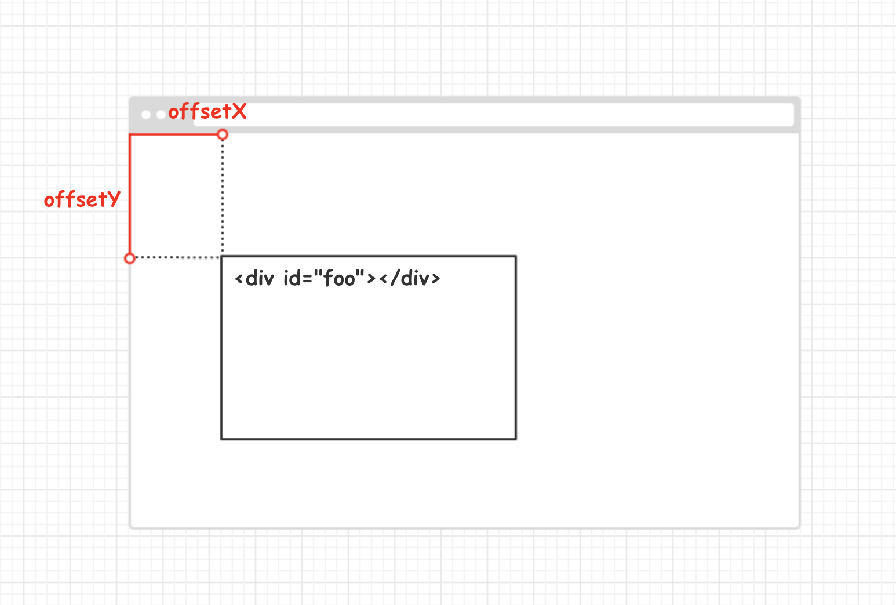
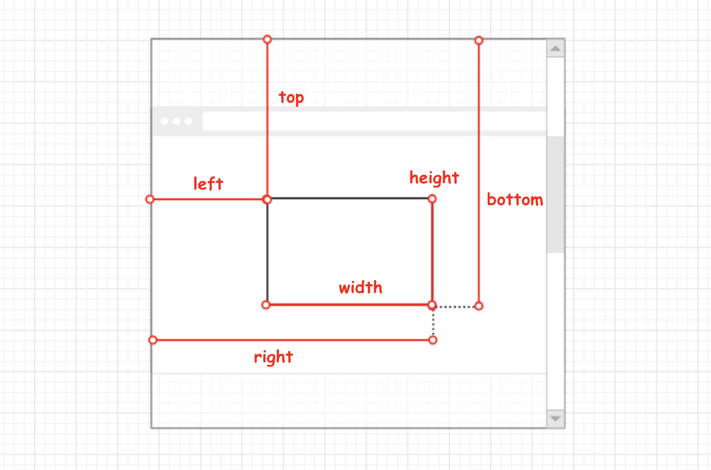
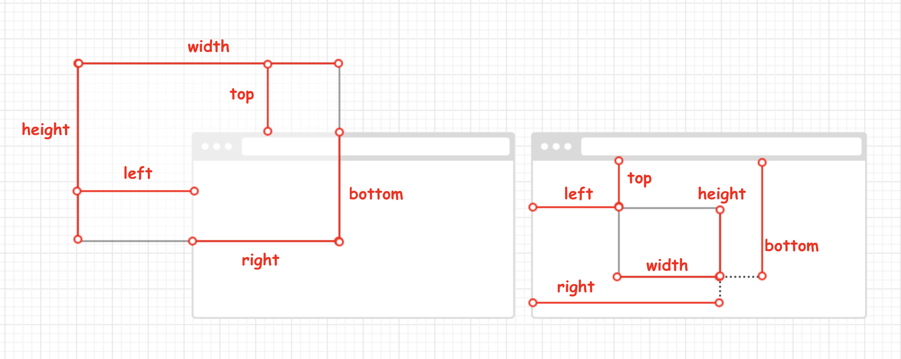
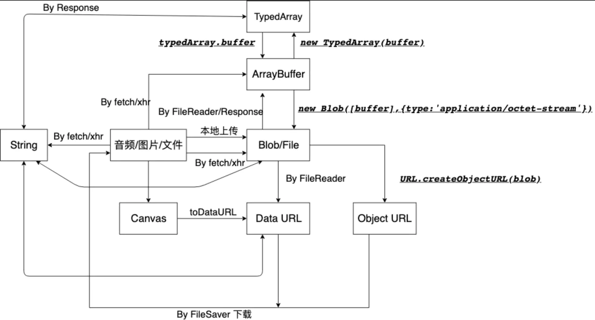

## 第一章、全局对象

### 1.1 window对象

#### 1.1.1 Window 对象的属性

| 属性                        | 含义                                                         |
| --------------------------- | ------------------------------------------------------------ |
| applicationCache（只读）    | 返回该 window 中的应用缓存对象的一个引用。                   |
| caches（只读）              | 返回了与当前上下文紧密相关的 CacheStorage 对象。             |
| ❗️closed（只读）             | 指示引用窗口关闭或没有。                                     |
| ❗️console                    | window.console 提供了向浏览器控制台输出日志信息的方法（log、info、warn、error等）。 |
| crypto                      | window.crypto 只读属性返回与全局对象关联的 Crypto 对象。 此对象允许网页访问某些加密相关服务。 |
| customElements              | 返回一个 CustomElementRegistry 对象的引用，可以用于注册一个新的 custom elements，并且可以用于获取之前定义过的自定义元素的信息。 |
| ❗️devicePixelRatio           | 此属性返回当前显示设备的物理像素分辨率与 CSS 像素分辨率的比值。 |
| document                    | 指向当前窗口内的文档节点。                                   |
| ❗️frameElement               | 返回嵌入当前 window 对象的元素（比如 `<iframe>` 或者 `<object>` ），如果当前 window 对象已经是顶层窗口，则返回 null。 |
| frames                      | 返回当前窗口，一个类数组对象，列出了当前窗口的所有直接子窗口。 |
| ❗️fullScreen                 | 这个属性表明了窗口是否处于全屏模式下。f11全屏切换。          |
| ❗️history（只读）            | 用来获取History对象的引用，History对象提供了操作浏览器会话历史（浏览器地址栏中访问的页面，以及当前页面中通过框架加载的页面）的接口。 |
| ❗️indexDB（只读）            | indexedDB 是 window的一个只读属性，它集成了为应用程序提供异步访问索引数据库的功能的机制。 |
| ❗️innerHeight（只读）        | 浏览器窗口的视口（viewport）高度（以像素为单位），如果存在滚动条，则包括它。 |
| ❗️innerWidth（只读）         | 浏览器视口（viewport）宽度（单位：像素），如果存在滚动条则包括它。 |
| isSecureContext（只读）     | 判断上下文是否能够使用安全上下文的特征的只读属性。           |
| length（只读）              | 返回当前窗口中包含的框架数量（框架包括 frame 和 iframe 两种元素）。 |
| ❗️localStorage               | 只读的 localStorage 允许你访问一个 Document 的远端（origin）对象 Storage。数据存储为跨浏览器会话。 |
| ❗️location（只读）           | 返回一个 Location 对象，其中包含有关文档当前位置的信息。     |
| locationbar                 | 返回一个可以检查 visibility 属性的 locationbar 对象。        |
| personalbar                 | personalbar 属性本身也是一个对象，用于访问其自身的 visible 属性来确定个人栏是否可见。 |
| menubar                     | 返回一个可以检测 visibility 属性的 menubar 对象。            |
| messageManager              | 返回这个窗口的消息管理器对象。                               |
| ❗️name                       | 获取/设置窗口的名称。                                        |
| ❗️navigator                  | 返回一个 Navigator 对象的引用,可以用它来查询一些关于运行当前脚本的应用程序的相关信息。 |
| onabort                     | 一个处理发送到 Window 中断事件的事件处理。                   |
| onbeforeprint               | 打印之前的处理函数。                                         |
| onafterprint                | 打印之后的处理函数。                                         |
| ❗️onanimationcancel          | animationcancel 是一个事件处理操作，这个事件在 CSS Animation 属性意外中断时派发出来。 |
| ❗️onanimationend             | 当 CSS 动画到达其活动期的结束时发送此事件。                  |
| ❗️onanimationiteration       | 当动画迭代时触发。                                           |
| ❗️onappinstalled             | Window 对象的 onappinstalled 属性用于处理 appinstalled 事件处理程序。 PWA 成功安装时被触发一次。 |
| onbeforeinstallprompt       | Window.onbeforeinstallprompt 属性是一个事件处理程序，用于处理一个beforeinstallprompt，当一个Web清单存在时，它将在移动设备上发送，但是在提示用户将网站保存到主屏幕之前。 |
| onbeforeunload              | 当窗口即将被卸载（关闭）时，会触发该事件。此时页面文档依然可见，且该事件的默认动作可以被取消。 |
| onclose                     | 当在 Window 对象上触发 close 事件时的事件处理器。            |
| oncontextmenu               | 获取或设置当前窗口 Contextmenu 事件的事件处理函数。除非默认行为已经阻止了，否则右键菜单会被激活。 |
| ondevicelight               | 事件在设备的光传感器检测到周围环境光的强度发生变化时触发。   |
| ondevicemotion              | 设配移动时触发。                                             |
| ondeviceorientation         | 设备方向改变时触发。                                         |
| ondeviceorientationabsolute |                                                              |
| ondeviceproximity           | 接近或远离设备时触发。                                       |
| onerror                     | 加载一个全局的 error 事件处理函数可用于自动收集错误报告。    |
| ongamepadconnected          | 手柄连接时触发。                                             |
| ongamepaddisconnected       | 手柄断开时触发。                                             |
| ongotpointercapture         | gotpointercapture 事件类型触发。                             |
| onlostpointercapture        | gotpointercapture 事件类型触发。                             |
| ❗️onhashchange               | 当 一个窗口的哈希改变时就会触发 hashchange 事件（查看 location.hash） |
| onlanguagechange            | 这样的事件在浏览器通知更佳的语言列表已被更新后被触发。       |
| onloadstart                 | 在 onload 之前触发。                                         |
| ❗️onload                     | 当资源已加载时被触发。                                       |
| onloadend                   | onloadend 属性表示当代码被调用时优先级提高，资源的加载事件触发时调用处理函数。 |
| onunload                    | 当页面关闭后，会触发 unload 事件。                           |
| onmessage                   | onmessage 属性是当对象接收到 message 事件时被调用。          |
| onmessageerror              | 一个 messageerror 事件发送给 window。                        |
| onpopstate                  | Window.onpopstate 是 popstate 事件在 Window 对象上的事件处理程序。 |
| onrejectionhandled          | Promise 拒绝时触发。                                         |
| onreset                     | 当收到一个 reset 事件时触发。                                |
| ❗️onresize                   | 可以用来获取或设置当前窗口的 resize 事件的事件处理函数。     |
| onselect                    | onselect 用来获取或设置当前窗口的 select 事件的事件处理函数。 |
| ❗️onstorage                  | 当存储域发生改变时会触发事件。                               |
| ❗️opener                     | 如果当前窗口是由另一个窗口打开的，Window.opener 保留了那个窗口的引用. 如果当前窗口不是由其他窗口打开的, 则该属性返回 null。 |
| ❗️origin（只读）             | 返回全局范围的 origin，序列化为一个字符串。域的概念。        |
| ❗️outerHeight（只读）        | 为窗口的外层的高度（包括导航栏+状态栏等）。                  |
| ❗️outerWidth                 | 是窗口的外层的宽度。                                         |
| ❗️parent                     | 返回当前窗口的父窗口对象。如果一个窗口没有父窗口，则它的 parent 属性为自身的引用。 |
| performance                 | Web Performance API 允许网页访问某些函数来测量网页和 Web 应用程序的性能，包括 Navigation TimingAPI 和高分辨率时间数据。 |
| ❗️screen                     | 返回当前 window 的 screen 对象。screen 对象实现了 Screen 接口，它是个特殊的对象，返回当前渲染窗口中和屏幕有关的属性。 |
| ❗️screenX                    | 返回浏览器左边界到操作系统桌面左边界的水平距离。             |
| ❗️screenY                    | 返回浏览器顶部距离系统桌面顶部的垂直距离。                   |
| scrollbars                  | 返回滚动条对象，可以检查其可见性。                           |
| scrollMaxX                  | 返回水平最大可以 scroll 的长度，单位像素。                   |
| scrollMaxY                  | 返回垂直最大可以 scroll 的长度，单位像素。                   |
| ❗️scrollX                    | 返回文档/页面水平方向滚动的像素值。                          |
| ❗️scrollY                    | 返回文档/页面垂直方向滚动的像素值。                          |
| ❗️self                       | 返回一个指向当前 window 对象的引用。                         |
| ❗️sessionStorage             | sessionStorage 属性允许你访问一个 session Storage对象。      |
| speechSynthesis             | 返回一个 speechSynthesis 对象。                              |
| status                      | 设置浏览器底部状态栏的文本。                                 |
| statusbar                   | 返回一个 statusbar 对象。                                    |
| toolbar                     | 返回一个 toolbar 对象。                                      |
| ❗️top                        | 返回窗口体系中的最顶层窗口的引用。                           |
| URL                         | window.URL 属性返回一个对象，它提供了用于创建和管理对象URLs的静态方法。 |
| visualViewport              | 返回视觉窗口对象。                                           |
| ❗️PushManager                | 提供接收服务器及请求 url 的推送功能的一些方法。PWA 推功能    |
| window                      | window 对象的 window 属性指向这个 window 对象本身。          |

#### 1.1.2 Window 对象的方法

| 方法                                                  | 功能                                                         |
| ----------------------------------------------------- | ------------------------------------------------------------ |
| ❗️`alert(message)`                                     | 浏览自带的警告对话框。                                       |
| `btoa(str)`                                           | 从 String 对象中创建一个 base-64 编码的 ASCII 字符串，其中字符串中的每个字符都被视为一个二进制数据字节。 |
| `atob(code)`                                          | 对用 base-64 编码过的字符串进行解码。                        |
| `blur()`                                              | 将焦点移出顶层窗口。                                         |
| ❗️`requestAnimationFrame(callBack)`                    | 告诉浏览器您希望执行动画并请求浏览器在下一次重绘之前调用指定的函数来更新动画。 |
| ❗️`cancelAnimationFrame(requestID)`                    | 取消一个先前通过调用 `window.requestAnimationFrame()` 方法添加到计划中的动画帧请求。 |
| `requestIdleCallback(callback[, options])`            | `window.requestIdleCallback()` 会在浏览器空闲时期依次调用函数， 这就可以让开发者在主事件循环中执行后台或低优先级的任务，而且不会对像动画和用户交互这样延迟触发而且关键的事件产生影响。 |
| `cancelIdleCallback(handle)`                          | window.cancelIdleCallback() 方法用于取消之前调用window.requestIdleCallback() 的回调。 |
| `setImmediate(func)`                                  | 该方法用来把一些需要长时间运行的操作放在一个回调函数里，在浏览器完成后面的其他语句后,就立刻执行这个回调函数。 |
| `clearImmediate(immediateID)`                         | 此方法用来清除 `window.setImmediate`。                       |
| ❗️`setInterval(callBack, delay)`                       | 重复调用一个函数或执行一个代码段，在每次调用之间具有固定的时间延迟。 |
| ❗️`clearInterval(intervalID)`                          | 取消用 setInterval 设置的重复定时任务。                      |
| ❗️`setTimeout(code[, delay])`                          | delay 时间之后执行 code，code 可为 string 或 function。      |
| ❗️`clearTimeout(timeoutID)`                            | 清除由 window.setTimeout() 设置的延时定时器。                |
| ❗️`close()`                                            | 关闭当前窗口。                                               |
| ❗️`confirm(message)`                                   | window.confirm() 方法显示一个具有一个可选消息和两个按钮(确定和取消)的模态对话框 。 |
| `createImageBitmap(image, sx, sy, sw, sh[, options])` | 接收图片源，并返回 ImageBitmap 的 Promise 对象。             |
| ❗️`event`                                              | IE 专用，表示正在处理的事件对象。                            |
| ❗️`fetch(input[, init])`                               | 用于发起获取资源的请求。它返回一个 Promise 对象。            |
| `focus()`                                             | 求将窗口显示在前（靠近屏幕），这可能由于用户设置而失败，并且该窗口在方法返回之前不能保证会显示在最前。 |
| `getAttention()`                                      | 试图获取用户的注意力。                                       |
| ❗️`getComputedStyle(element, [pseudoElt])`             | 给出应用活动样式表后的元素的所有 CSS 属性的值，并解析这些值可能包含的任何基本计算。 |
| `getSelection()`                                      | 返回一个 Selection 对象，表示用户选择的文本范围或光标的当前位置。 |
| `matchMedia(mediaQueryString)`                        | 返回一个新的 MediaQueryList 对象，表示指定的媒体查询字符串解析后的结果。 |
| `minimize()`                                          | 窗口最小化。                                                 |
| ❗️`moveBy(deltaX, deltaY)`                             | 根据指定的值，移动当前窗口。                                 |
| ❗️`moveTo(x, y)`                                       | 将当前窗口移动到指定的坐标位置。                             |
| ❗️`open(strUrl, windowName, [strWindowFeatures])`      | 根据指定的参数，将一个资源加载到一个新的浏览上下文（如一个窗口）或一个已经存在的浏览上下文中。 |
| ❗️`postMessage(message, targetOrigin, [transfer])`     | 可以安全地实现跨源通信。                                     |
| `print()`                                             | 打开打印对话框打印当前文档。                                 |
| ❗️`prompt(text, value)`                                | 显示一个对话框，对话框中包含一条文字信息，用来提示用户输入文字。 |
| ❗️`resizeBy(xDelta, yDelta)`                           | 调整窗口大小。                                               |
| ❗️`resizeTo(aWidth, aHeight)`                          | 动态调整窗口的大小。                                         |
| ❗️`scroll(x-coord, y-coord)`                           | 滚动窗口至文档中的特定位置。                                 |
| ❗️`scrollBy(X, Y)`                                     | 在窗口中按指定的距离滚动文档。                               |
| `scrollByLines(num)`                                  | 按给定的行数滚动文档。                                       |
| `scrollByPages(pages)`                                | 在当前文档页面按照指定的页数翻页。                           |
| ❗️`scrollTo(x-coord, y-coord)`                         | 滚动到文档中的某个坐标。                                     |
| `stop()`                                              | 此方法用于阻止页面资源加载。                                 |

### 1.2 Location 对象

#### 1.2.1 location.assign()

```js
location.assign('https://github.com');
```

使用 `assign()` 方法并为其传递一个 URL，可以立即打开新 URL 并在浏览器的历史记录中生成一条记录。如果是将 `location.href` 或 `window.location` 设置为一个 URL 值，相当于调用 `assign()` 方法。

```js
window.location = 'https://github.com';
location.href = 'https://github.com';
```

修改  location  对象的其他属性也可以改变当前加载的页面。下面的例子展示了通过将  hash、search、hostname、pathname  和  port  属性设置为新值来改变 URL。

```js
// 假设初始 URL 为 http://github.com/about/
location.href = 'http://github.com/about/';

// 将 URL 修改为 "http://github.com/about/#ds-thread"
location.hash = '#ds-thread';

// 将 URL 修改为 "http://github.com/about/?search=123"
location.search = '?search=123';

// 将 URL 修改为 "https://gist.github.com/"
location.hostname = 'gist.github.com';

// 将 URL 修改为 "https://gist.github.com/u/10086"
location.pathname = 'u/stone0090';

// 将 URL 修改为 "https://gist.github.com:8080/"
location.port = 8080;
```

当通过上述任何一种方式修改 URL 之后，浏览器的历史记录中就会生成一条新记录，因此用户通过单击“后退”按钮都会导航到前一个页面。要禁用这种行为，可以使用  `replace()` 方法。

#### 1.2.2 location.replace()

`location.replace()` 方法接收一个参数即要导航到的 URL，结果虽然会导致浏览器位置改变，但不会在历史记录中生成新记录，也就是说用户不能回到前一个页面（只有 chrome 下有效）。

```js
location.replace('http://github.com');
```

#### 1.2.3 location.reload()

`reload()` 方法用于重新加载当前显示的页面。如果调用 `reload()` 方法时不传递任何参数，页面会以最有效的方式重新加载。也就是说，如果页面自上次请求以来并没有改变过，页面就会从浏览器缓存中重新加载。如果要强制从服务器重新加载，则需要传递参数 `true`。

位于 `reload()` 调用之后的代码可能会也可能不会执行，这要取决于网络延迟或系统资源等因素，为此，最好将 `reload()` 放在代码的最后一行

```js
// 重新加载（有可能从缓存中加载）
location.reload();

// 重新加载（从服务器重新加载）
location.reload(true);
```

#### 1.2.4 Location 对象的属性

`location` 对象的用处不只表现在它保存着当前文档的信息，还表现在它将 URL 解析为独立的片段，让开发人员可以通过不同的属性访问这些片段。

| 属性名   | 例子                      | 描述                                                         |
| -------- | ------------------------- | ------------------------------------------------------------ |
| href     | `https://www.baidu.com`   | 返回当前加载页面的完整 URL。而 `location` 对象的 `toString()` 方法也返回这个值。 |
| protocol | `"https:"`                | 返回页面使用的协议。                                         |
| host     | `www.baidu.com:8080`      | 返回服务器名称和端口号（如果有）。                           |
| hostname | `"www.baidu.com"`         | 返回不带端口号的服务器名称。                                 |
| port     | `"8080"`                  | 返回 URL 中指定的端口号。如果 URL 中不包含端口号，则这个属性返回空字符串。 |
| pathname | `"/src"`                  | 返回 URL 中的目录和（或）文件名（`/`以斜杆开头）             |
| search   | `"?js=javascript"`        | 返回 URL 的查询字符串（`?` 以问号开头）                      |
| hash     | `"#contents"`             | 返回 URL 中的 hash，如果 URL 中不包含散列，则返回空字符串（`#` 以井号开头跟零或多个字符串） |
| origin   | `"https://www.baidu.com"` | 页面来源的域名的标准形式                                     |

> ⚠️ 注意：如果 URL 中 `?` 之前有一个 `#`，比如 `#text?q=test`，那么， `location.search` 得到的就是空字符串，因为 `location.search`只取 `?` 后面和 `#` 前面的内容。

#### 1.2.5 查询字符串参数

```js
/*
 * 这个函数用来解析来自URL的查询串中的name=value参数对
 * 它将name=value对存储在一个对象的属性中，并返回该对象
 * 这样来使用它
 *
 * var args = urlArgs();	// 从URL中解析参数
 * var q = args.q || "";	// 如果参数定义了的话就使用参数；否则使用一个默认值
 * var n = args.n ? parseInt(args.n) : 10;
 */

function urlArgs() {
  // 定义一个空对象
  var args = {};

  // 查找到查询串，并去掉问号
  var query = location.search.substring(1);

  // 根据 & 符号将查询字符串分隔开
  var pairs = query.split('&');

  for (let i = 0; i < pairs.length; i++) {
    // 查找"name=value"
    const pos = pairs[i].indexOf('=');
    // 如果没有找到的话，就跳过
    if (pos == -1) continue;
    // 提取name
    const name = pairs[i].substring(0, pos);
    // 提取value
    let value = pairs[i].substring(pos + 1);
    // 对value进行解码
    value = decodeURIComponent(value);
    // 存储为属性
    args[name] = value;
  }
  return args;
}
```

### 1.3 history对象

#### 1.3.1 history.go

使用  `history.go` 方法可以在用户的历史记录中任意跳转，可以向后也可以向前。这个方法接受一个参数，表示向后或向前跳转的页面数的一个**整数值**。

#### 1.3.2 history.back

history.back() 方法用于模仿浏览器的后退按钮，相当于 history.go(-1)

#### 1.3.3 history.forward

forward() 方法用于模仿浏览器的前进按钮，相当于 history.go(1)

#### 1.3.4 history.pushState

向当前浏览记录栈中添加一条新的历史记录，添加后页面不会重新加载。

```js
history.pushState(state, title, url);
```

- state：**用于存储该 URL 对应的状态对象**。该对象可通过 `history.state` 或 `popstate` 事件回调中的 event 对象获取。如果不需要这个对象，此处可以填 null。
- title：**新页面的标题**，但是所有浏览器目前都忽略这个值，因此这里可以填 null。
- url：**URL 地址**，不允许跨域。这个参数可选，如果它没有被特别标注，会被设置为文档的当前 URL。

#### 1.3.5 history.replaceState()

它和 history.pushState() 方法基本相同，区别只有一点，history.replaceState() 不会新生成历史记录，而是将当前历史记录替换掉，常用于落地页。

```js
history.replaceState(state, title, url);
```

#### 1.3.6 window.onpopstate

`push` 的对立就是 `pop`，可以猜到这个事件是在浏览器取出历史记录并加载时触发的。但实际上，它的条件是比较苛刻的，几乎只有 **点击浏览器的“前进”、“后退”这些导航按钮，或者是由 JavaScript 调用的 `history.back()` 等导航方法**，且 **切换前后的两条历史记录都属于同一个网页文档**，才会触发本事件，因为这些操作有一个共性，即修改了历史堆栈的当前指针。

上面的 **同一个网页文档** 请理解为 JavaScript 环境的 `document` 是同一个，而不是指基础 URL（去掉各类参数的）相同。也就是说，只要有重新加载发生（无论是跳转到一个新站点还是继续在本站点），JavaScript 全局环境发生了变化，`popstate` 事件都不会触发。

`popstate` 事件是设计出来和前面的 2 个方法搭配使用的。一般只有在通过前面 2 个方法设置了同一站点的多条历史记录，并在其之间导航（前进或后退）时，才会触发这个事件。同时，前面 2 个方法所设置的状态对象（第 1 个参数），也会在这个时候通过事件的 `event.state` 返还回来。

此外请注意，`history.pushState()` 及 `history.replaceState()` 本身调用时是不触发 `popstate` 事件的。

```js
window.onpopstate = function(event) {
  alert('location: ' + document.location + ', state: ' + JSON.stringify(event.state));
};
```

#### 1.3.7 History 属性

`history` 对象保存着用户上网的历史记录，从窗口被打开的那一刻算起。因为 `history` 是 `window` 对象的属性，因此每个浏览器窗口、每个标签页乃至每个框架，都有自己的 `history` 对象与特定的 `window` 对象关联。出于安全方面的考虑，开发人员无法得知用户浏览过的 URL。不过，借由用户访问过的页面列表，同样可以在不知道实际 URL 的情况下实现后退和前进。

| 属性              | 描述                                                         |
| ----------------- | ------------------------------------------------------------ |
| length            | 返回一个整数，该整数表示会话历史中元素的数目，包括当前加载的页。 |
| scrollRestoration | 允许 Web 应用程序在历史导航上显式地设置默认滚动恢复行为。    |
| state             | 返回一个表示历史栈堆顶部状态的值。这是一种可以不必等待 popstate 事件而查看状态的方式。 |

`history.length` 属性保存着历史记录的 URL 数量。初始时，该值为 1。如果当前窗口先后访问了三个网址，`history.length` 属性等于 3。

### 1.4 Screen 对象

Screen Orientation API 是一个能让 Web 开发者能控制屏幕旋转方向的 API，开发者可以利用该 API 检测屏幕的当前方向，在屏幕方向发生改变时得到消息通知，并能通过 API 将屏幕方向锁定到指定状态。

#### 1.4.1 使用方法

##### 1.4.1.1 lockOrientation()

```js
const lockedAllowed = window.screen.lockOrientation(orientation);
```

- orientation：需要锁定屏幕的方向。这个参数是一个字符串或者是一个由字符串组成的数组。通过多个字符串可以让屏幕只在选定的方向上进行旋转。

以下字符串即表示你也许会指定的一些可能的方向。

- `portrait-primary`

  它表示屏幕处于主要的肖像模式时的方向。如果设备处于正常位置且该位置处于纵向位置，或设备的正常位置处于横向并且设备保持顺时针转动 90°，则会在主肖像模式下考虑屏幕。正常的位置是依赖于设备的。

- `portrait-secondary`

  它表示屏幕处于辅助肖像模式时的方向。如果设备与正常位置保持 180°，并且该位置处于纵向位置，或者设备的正常位置处于横向位置，并且持有的设备逆时针转动 90°，则屏幕将处于辅助人像模式。正常的位置是依赖于设备的。

- `landscape-primary`

  它代表了屏幕处于主要风景模式时的方向。 如果设备保持在正常位置，并且该位置处于横向位置，或者设备的正常位置处于纵向位置，并且所保持的设备顺时针旋转 90°，则会将其视为主要横向模式。正常的位置是依赖于设备的。

- `landscape-secondary`

  它代表了屏幕处于次要风景模式时的方向。如果设备与其正常位置保持 180° 并且该位置处于横向，或者如果设备的正常位置是纵向的，并且所保持的设备逆时针旋转 90°，则将其视为次要横向模式。正常的位置是依赖于设备的。

- `portrait`

  它表示同时包含 `portrait-primary` 和 `portrait-secondary`.

- `landscape`

  它表示同时包含 `landscape-primary` 和 `landscape-secondary`.

- `default`

  它代表 `portrait-primary` 和 `landscape-primary` 主要取决于设备的自然方向。例如，如果面板分辨率为 1280 _ 800，则 `default` 为横向，如果分辨率为 800 _ 1280，则 `default` 为纵向。

**返回值**

如果方向被授权锁定，则返回 true；如果方向锁定被拒绝，则返回 false。请注意，返回值并不表示屏幕方向确实被锁定：可能会有延迟。

##### 1.4.1.2 unlockOrientation()

```js
const unlocked = window.screen.unlockOrientation();
```

**返回值**

如果方向授权解锁成功，则返回 true；如果方向锁定解除失败，则返回 false。

#### 1.4.2 示例

```js
// 锁定屏幕为竖屏模式，不能设备如何旋转，屏幕都不会切换到横屏模式。
window.screen.lockOrientation([“portrait-primary”,“portrait-secondary”]);

// 锁定屏幕为横屏模式，无论设备如何旋转，屏幕都不会切换到竖屏模式。
window.screen.lockOrientation([“landscape-primary”,“landscape-secondary”]);

// 取消屏幕的锁屏，屏幕回到原始状态，
window.screen.unlockOrientation();
```

#### 1.4.3 兼容性

另外需要注意的是 Screen Orientation API 的文档规范还处于开发阶段，浏览器的实现可能带有前缀，例如 Firefox 带有 moz 前缀，IE 带有 ms 前缀。在使用前我们需要添加一些代码，保持更好的兼容性。

```js
window.screen.lockOrientation =
  screen.lockOrientation || screen.mozLockOrientation || screen.msLockOrientation;

window.screen.unlockOrientation =
  screen.unlockOrientation || screen.mozUnLockOrientation || screen.msUnLockOrientation;
```

#### 1.4.4 Screen 对象的属性

`screen` 对象用来表明客户端的能力，其中包括浏览器窗口外部的显示器的信息，如像素高度和宽度等。

| 属性                 | 说明                                                         |
| -------------------- | ------------------------------------------------------------ |
| height               | 屏幕的像素高度（包括导航和底部）                             |
| width                | 屏幕的像素宽度（包括侧边栏）                                 |
| availHeight          | 屏幕的像素高度减去系统部件高度之后的值（只读）               |
| availWidth           | 屏幕的像素宽度减去系统部件宽度之后的值（只读）               |
| left                 | 当前屏幕距左边的像素距离（Firefox 返回 0，Chrome 和 IE 不支持） |
| top                  | 当前屏幕距上方的像素距离（Firefox 返回 0，Chrome 和 IE 不支持） |
| availLeft            | 未被系统部件占用的最左侧的像素值（只读）（Chrome 和 Firefox 返回 0，IE 不支持） |
| availTop             | 未被系统部件占用的最上方的像素值（只读）（Chrome 和 Firefox 返回 0，IE 不支持） |
| orientation          | 屏幕的方向。                                                 |
| bufferDepth          | 读、写用于呈现屏外位图的位数（IE 返回 0，Chrome 和 Firefox 不支持） |
| colorDepth           | 用于表现颜色的位数（只读）（IE8- 返回 32，其他浏览器返回 24） |
| pixelDepth           | 屏幕的位深（只读）（IE8- 不支持，其他浏览器返回 24）         |
| deviceXDPI           | 屏幕实际的水平 DPI（只读）（IE 返回 96，Chrome 和 Firefox 不支持） |
| deviceYDPI           | 屏幕实际的垂直 DPI（只读）（IE 返回 96，Chrome 和 Firefox 不支持） |
| logicalXDPI          | 屏幕逻辑的水平 DPI（只读）（IE 返回 96，Chrome 和 Firefox 不支持） |
| logicalYDPI          | 屏幕逻辑的垂直 DPI（只读）（IE 返回 96，Chrome 和 Firefox 不支持） |
| updateInterval       | 读、写以毫秒表示的屏幕刷新时间间隔（IE 返回 0，Chrome 和 Firefox 不支持） |
| fontSmoothingEnabled | 是否启用了字体平滑（只读）（IE 返回 true，Chrome 和 Firefox 不支持） |

### 1.5 Navigator 对象

**地理位置 Geolocation API** 允许用户向 Web 应用程序提供他们的位置。出于隐私考虑，报告地理位置前会先请求用户许可。

地理位置 API 通过 `navigator.geolocation` 提供。

如果该对象存在，那么地理位置服务可用。

```js
if ('geolocation' in navigator) {
  // 地理位置服务可用
} else {
  // 地理位置服务不可用
}
```

#### 1.5.1 获取当前定位

您可以调用  `getCurrentPosition()` 函数获取用户当前定位位置。这会异步地请求获取用户位置，并查询定位硬件来获取最新信息。当定位被确定后，定义的回调函数就会被执行。您可以选择性地提供第二个回调函数，当有错误时会被执行。第三个参数也是可选的，您可以通过该对象参数设定最长可接受的定位返回时间、等待请求的时间和是否获取高精度定位。

```js
navigator.geolocation.getCurrentPosition(success, error, options);
```

- success：成功得到位置信息时的回调函数，使用 `Position` 对象作为唯一参数。
- error：（可选）获取位置信息失败时的回调函数，使用 `PositionError` 对象作为唯一的参数，这是一个可选项。
- options：（可选）一个可选的 `PositionOptions` 对象，用于设置 `getCurrentPosition` 的参数。

#### 1.5.2 监视定位

您可以设定一个回调函数来响应定位数据发生的变更（设备发生了移动，或获取到了更高精度的地理位置信息）。您可以通过  watchPosition()  函数实现该功能。它与  getCurrentPosition()  接受相同的参数，但回调函数会被调用多次。错误回调函数与  getCurrentPosition()  中一样是可选的，也会被多次调用。

watchPosition()  函数会返回一个 ID，唯一地标记该位置监视器。您可以将这个 ID 传给  clearWatch()  函数来停止监视用户位置。

#### 1.5.3 使用

```js
if (navigator.geolocation) {
  const getOptions = {
    // 是否使用高精度设备，如GPS。默认是true
    enableHightAccuracy: true,
    // 超时时间，单位毫秒，默认为0
    timeout: 5000,
    // 使用设置时间内的缓存数据，单位毫秒
    // 默认为0，即始终请求新数据
    // 如设为Infinity，则始终使用缓存数据
    maximumAge: 0,
  };

  const getSuccess = position => {
    // Position对象有两个属性，coords和timeStamp
    // timeStamp表示地理数据创建的时间
    console.log(position.timeStamp);

    // coords是一个对象，包含了地理位置数据
    // 估算的纬度
    console.log(position.coords.latitude);
    // 估算的经度
    console.log(position.coords.longitude);
    // 估算的高度（以米为单位的海拔值）
    console.log(position.coords.altitude);
    // 所得经度和纬度的估算精度，以米为单位
    console.log(position.coords.accuracy);
    // 所得高度的估算精度，以米为单位
    console.log(position.coords.altitudeAccuracy);
    // 宿主设备的当前移动方向，以度为单位，相对于正北方向顺时针方向计算
    console.log(position.coords.heading);
    // 设备的当前对地速度，以米/秒为单位
    console.log(position.coords.speed);
    // 除上述结果外，Firefox还提供了另一个属性address
    if (position.address) {
      // 通过address，可以获得国家、省份、城市
      console.log(position.address.country);
      console.log(position.address.province);
      console.log(position.address.city);
    }
  };

  const getError = error => {
    // 执行失败的回调函数，会接受一个error对象作为参数
    // error拥有一个code属性和三个常量属性TIMEOUT、PERMISSION_DENIED、POSITION_UNAVAILABLE
    // 执行失败时，code属性会指向是那个常量中的一个，从而指明错误原因
    switch (error.code) {
      case error.TIMEOUT:
        console.log('超时');
        break;
      case error.PERMISSION_DENIED:
        console.log('用户拒绝提供地理位置');
        break;
      case error.POSITION_UNAVAILABLE:
        console.log('地理位置不可用');
        break;
      default:
        break;
    }
  };

  navigator.geolocation.getCurrentPosition(getSuccess, getError, getOptions);
  // watchPosition方法一样可以设置三个参数
  // 使用方法和getCurrentPosition方法一致，只是执行效果不同。
  // getCurrentPosition只执行一次
  // watchPosition只要设备位置发生，就会执行
  const watcher_id = navigator.geolocation.watchPosition(getSuccess, getError, getOptions);
  // clearwatch用于终止watchPosition方法
  navigator.geolocation.clearWatch(watcher_id);
}
```

#### 1.5.4 Navigator 对象的属性

| 属性            | 说明                                                         |
| --------------- | ------------------------------------------------------------ |
| appCodeName     | 浏览器名称，所有浏览器都返回 Mozilla。                       |
| appName         | 浏览器官方名称。                                             |
| appVersion      | 浏览器版本。                                                 |
| appMinorVersion | 次版本信息（IE 返回 0，chrome 和 firefox 不支持）。          |
| connection      | 设备的网络连接信息。                                         |
| cookieEnabled   | 表示 cookie 是否启用，所有浏览器都返回 true。                |
| geolocation     | 可访问设备的地理位置信息。                                   |
| javaEnabled     | 浏览器是否支持 Java（IE8 浏览器返回 `{}`，其他浏览器返回 `function javaEnabled()`） |
| language        | 表示用户的首用语言（IE10 不支持，其他浏览器返回 zh-CN）。    |
| languages       | 表示用户已知语言的 `DOMString` 数组，并按优先顺序排列。      |
| maxTouchPoints  | 当前设备能够支持的最大同时触摸的点数。                       |
| mimeTypes       | 返回 `MimeTypeArray` 数组用于列举浏览器所支持的 MIME 类型。  |
| onLine          | 浏览器是否连接因特网（IE 根据实际情况返回 true 或 false，chrome 和 firefox 始终返回 true）。 |
| platform        | 浏览器所在的系统平台。                                       |
| plugins         | 返回 `PluginArray` 数组用于列出浏览器安装的插件。            |
| product         | 产品名称（IE10 不支持，其他浏览器返回 Gecko）                |
| productSub      | 产品次要信息（IE 不支持，chrome 返回 20030107，firefox 返回 20100101） |
| userAgent       | 浏览器的用户代理。                                           |
| vendor          | 浏览器品牌（chrome 返回 Google Inc.，IE 和 firefox 不支持）  |

## 第二章、全局API

### 2.1 requestAnimationFrame

window.requestAnimationFrame() 方法告诉浏览器您希望执行动画并请求浏览器在下一次重绘之前调用指定的函数来更新动画。该方法使用一个回调函数作为参数，这个回调函数会在浏览器重绘之前调用。

#### 2.1.1 传统动画渲染的弊端

传统的动画渲染是通过 setTimeout 和 setInterval 进行实现，但是这两种定时器会有两个弊端：

- 动画的时间间隔不好确定，设置时间过长会使得动画不够平滑流畅，设置过短会令浏览器的重绘频率容易达到瓶颈（推荐最佳循环间隔是 17ms，因为大多数电脑的显示器刷新频率是 60Hz，1000ms/60）。
- 定时器的第二个时间参数只是指定了多久后将动画任务添加到浏览器的 UI 线程队列中，如果 UI 线程处于忙碌状态，那么动画不会立即执行。

#### 2.1.2 requestAnimationFrame

```js
window.requestAnimationFrame(callback);
```

| 参数     | 说明                                                         | 类型     |
| -------- | ------------------------------------------------------------ | -------- |
| callback | 下次重新绘制动画时调用的回调函数。该回调函数只有一个参数 `DOMHighResTimeStamp`，指示 `requestAnimationFrame()` 开始出发回调函数的当前时间。 | function |

| 返回值                                                       | 类型        |
| ------------------------------------------------------------ | ----------- |
| 请求动画渲染的标识 ID。是个非零值，没有其他意义。可用作 `window.cancelAnimationFrame()` 以取消回调函数。 | number 整数 |

#### 2.1.2 cancelAnimationFrame

```js
window.cancelAnimationFrame(requestID);
```

| 参数      | 说明                 | 类型   |
| --------- | -------------------- | ------ |
| requestId | 指定动画渲染的标识符 | number |

#### 2.1.3 优点

- `requestAnimationFrame` 会把每一帧中的所有 DOM 操作集中起来，在**一次重绘或回流**中就完成，并且重绘或回流的时间间隔紧紧跟随浏览器的刷新频率
- 在隐藏或不可见的元素中，或者浏览器标签页不可见时，`requestAnimationFrame` 将不会进行重绘或回流，这当然就意味着更少的 CPU、GPU 和内存使用量
- `requestAnimationFrame` 是由浏览器专门为当年规划提供的 API，在运行时浏览器会自动优化方法的调用，并且如果页面不是激活状态下的话，动画会自动暂停，有效节省了 CPU 开销。

#### 2.1.4 兼容

Firefox、Chrome、IE10+ 对 `requestAnimationFrame` 支持很好，但不兼容 IE9- 浏览器，但是我们可以用定时器完成兼容性改造。

```js
(function () {
  var lastTime = 0;
  var vendors = ['webkit', 'moz'];
  for (var x = 0; x < vendors.length && !window.requestAnimationFrame; ++x) {
    window.requestAnimationFrame = window[vendors[x] + 'RequestAnimationFrame'];
    window.cancelAnimationFrame =
      window[vendors[x] + 'CancelAnimationFrame'] ||
      window[vendors[x] + 'CancelRequestAnimationFrame'];
  }

  if (!window.requestAnimationFrame)
    window.requestAnimationFrame = function (callback) {
      /*调整时间，让一次动画等待和执行时间在最佳循环时间间隔内完成*/
      var currTime = new Date().getTime();
      var timeToCall = Math.max(0, 17 - (currTime - lastTime));
      var id = window.setTimeout(function () {
        callback(currTime + timeToCall);
      }, timeToCall);
      lastTime = currTime + timeToCall;
      return id;
    };

  if (!window.cancelAnimationFrame)
    window.cancelAnimationFrame = function (id) {
      clearTimeout(id);
    };
})();
```

#### 2.1.5 传参

```js
function requestAnimation(a, b, c) {
  if () {

    window.requestAnimationFrame(function () {
      requestAnimation(a, b, c)
    })
  }
}
```

### 2.2 requestIdleCallback

一般浏览器的刷新率为 60HZ，即 1 秒钟刷新 60 次。`1000ms / 60hz = 16.6`，大概每过 16.6ms 浏览器会渲染一帧画面。

在这段时间内，浏览器大体会做两件事：`task` 与 `render`。

```unknown
task -> requestAnimationFrame -> render -> requestIdleCallback
```

如果渲染完成后还有空闲时间，则 requestIdleCallback API 会被调用。

#### 掉帧与时间切片

如果 `task` 执行时间超过了 `16.6ms`（比如 `task` 中有个很耗时的 `while` 循环）。

那么这一帧就没有时间 `render`，页面直到下一帧 `render` 后才会更新。表现为页面卡顿一帧，或者说掉帧。

最好的办法是时间切片，把长时间 `task` 分割为几个短时间 `task`。

为了解决掉帧造成的卡顿，React16 将递归的构建方式改为可中断的遍历。React16 就是基于 requestIdleCallbackAPI，实现了自己的 Fiber Reconciler。

以 `5ms` 的执行时间划分 `task`，每遍历完一个节点，就检查当前 `task` 是否已经执行了 `5ms`。

如果超过 `5ms`，则中断本次 `task`。

通过将 `task` 执行时间切分为一个个小段，减少长时间 `task` 造成无法 `render` 的情况，这就是时间切片。

## 第三章、视窗尺寸位置

### 3.1 Window 对象视图属性

这些属性可以 hold 住整个浏览器窗体大小。微软则将这些 API 称为 Screenview 接口。

| 属性               | 说明                           |
| ------------------ | ------------------------------ |
| window.outerWidth  | 浏览器网页视口外层宽度         |
| window.outerHeight | 浏览器网页视口外层高度         |
| window.innerWidth  | 浏览器网页视口内层宽度         |
| window.innerHeight | 浏览器网页视口内层高度         |
| window.screenTop   | 浏览器距屏幕上边距             |
| window.screenLeft  | 浏览器距屏幕左边距             |
| window.pageXOffset | 当前页面距网页视口显示区上边距 |
| window.pageYOffset | 当前页面距网页视口显示区左边距 |

### 3.2 Screen 对象视图属性

| 属性                 | 说明         |
| -------------------- | ------------ |
| `screen.width`       | 屏幕像素宽度 |
| `screen.height`      | 屏幕像素高度 |
| `screen.availWidth`  | 屏幕可用宽度 |
| `screen.availHeight` | 屏幕可用高度 |

### 3.3 文档视图和元素视图

文档视图和元素视图中包含的与元素大小位置相关的方法主要有：

1. `elementFromPoint()`
2. `getClientRects()`
3. `getBoundingClientRect()`
4. `scrollIntoView()`

#### 3.3.1 elementFromPoint

elementFromPoint() 根据文档上横纵坐标，获取当前文档上该坐标点上位置最顶层的 DOM 元素，该坐标是相对于文档的浏览器窗口左上角为原点来计算的，通常横纵坐标为正数。

```js
const foo = document.elementFromPoint(offsetX, offsetY);
```



> 此方法可以用于检测元素是否发生重叠或是碰撞

#### 3.3.2 getClientRects

`getClientRects()` 方法返回一组元素相关的只读属性的矩形集合 DOMRectList。包括当前元素相对于浏览器视口左上角的顶端（top）、底端（bottom）、左端（left）、右端（right）的**偏移量**，元素自身的宽度（width）和高度（height）属性，以及元素自身的横（x）纵（y）坐标。

```js
const rectCollection = ele.getClientRects();
```



- top：元素左上角距浏览器页面顶端的距离
- left：元素左上角距浏览器页面左端的距离
- bottom：元素右下角距浏览器页面的顶端的距离
- right：元素右下角距浏览器页面的左端的距离
- width：元素宽度（包括内容、边距和边框）
- height：元素高度（包括内容、边距和边框）

> 浏览器页面指文档整体宽高组成的区域，通常通过滚动条查看未在可视区域内显示的页面内容。

```js
const foo = document.getElementById('foo');

const fooRects = foo.getClientRects();

console.log(fooRects);

// 输出内容如下：
DOMRectList[
  {
    top: 100,
    left: 100,
    right: 200, // => (left + width)
    bottom: 200, // => (top + height)
    x: 100,
    y: 100,
  }
];
```

#### 3.3.3 getBoundingClientRect

`getBoundingClientRect()` 方法放回一组元素的左、上、右及下分别**相对**浏览器可视窗口的位置的集合 DOMRect。

`getBoundingClientRect` 是 `DOM` 元素到浏览器可视范围的距离（不包含文档卷起的部分）。

```js
const rectObject = ele.getBoundingClientRect();
```



- top：元素左上角距浏览器可视区域顶端的距离
- left：元素左上角距浏览器可视区域左端的距离
- bottom：元素右下角距浏览器可视区域的顶端的距离
- right：元素右下角距浏览器可视区域的左端的距离
- width：元素宽度（包括内容、边距和边框）
- height：元素高度（包括内容、边距和边框）

#### 3.3.4 scrollIntoView

`scrollView()` 方法让当前的元素滚动到浏览器窗口的可视区域内。

```js
element.scrollIntoView(alignToTop || options);
```

| 参数       | 说明                                                         | 类型    |
| ---------- | ------------------------------------------------------------ | ------- |
| alignToTop | `true`：元素顶端和其所在滚动区的可视区域的顶端对齐`false`：元素底端和其所在滚动区的可视区域的底端对齐 | boolean |
| options    | 一个带有选项的配置对象，详细参数查看下表                     | object  |

**options**

| 参数     | 说明                                                    | 类型   | 默认值    |
| -------- | ------------------------------------------------------- | ------ | --------- |
| behavior | 定义缓慢函数，可选值为 `auto` `instant` `smooth`        | string | `auto`    |
| block    | 定义块级元素对齐方式，可选值为 `center` `end` `nearest` | string | `center`  |
| inline   | 定义行内元素对齐方式，可选值为 `center` `end` `nearest` | string | `nearest` |

#### 3.3.5 鼠标位置

| 属性    | 说明                                                         |
| ------- | ------------------------------------------------------------ |
| clientX | 设置或获取当事件被触发时鼠标指针相对于 **浏览器页面（或客户区）** 的水平坐标。 |
| clientY | 设置或获取当事件被触发时鼠标指针向对于 **浏览器页面（或客户区）** 的垂直坐标。 |
| screenX | 设置或获取当事件被触发时鼠标指针相对于**屏幕的水平坐标**。   |
| screenY | 设置或获取当事件被触发时鼠标指针相对于**屏幕的垂直坐标**。   |
| offsetX | 设置或获取鼠标指针位置相对于**触发事件的对象的横坐标**。     |
| offsetY | 设置或获取鼠标指针位置相对于**触发事件的对象的纵坐标**。     |
| X       | 事件发生的位置的**横坐标**, 它相对于用 CSS 动态定位的最内层包容元素。 |
| Y       | 事件发生的位置的**纵坐标**, 它相对于用 CSS 动态定位的最内层包容元素。 |
| pageX   | 鼠标指针的位置，相对于文档的左边缘。                         |
| pageY   | 鼠标指针的位置，相对于文档的上边缘。                         |
| layerX  | 鼠标相比较于当前坐标系的位置。                               |
| layerY  | 鼠标相比较于当前坐标系的位置。                               |

## 第四章、二进制数据和文件API

### 4.1 文件应用

历史上，JavaScript 无法处理二进制数据。如果一定要处理的话，只能使用 `String.prototype.charCodeAt()` 方法，逐个地将字节从文字编码转成二进制数据，还有一种办法是将二进制数据转成 Base64 编码，再进行处理。这两种方法不仅速度慢，而且容易出错。因此 ECMAScript 5 引入了 Blob 对象，允许直接操作二进制数据。

- Blob 对象：二进制数据基本对象，在它的基础上，又衍生出一系列相关的 API，用于操作文件
- File 对象：负责处理那些以文件形式存在的二进制数据，也就是操作本地文件
- FileList 对象：File 对象的网页表单接口
- FileReader 对象：负责将二进制数据读入内存内容
- URL 对象：用于对二进制数据生成 URL
- FormData 对象：读取页面表单项文件数据



#### 4.1.1 FormData

File API 使访问包含 File 对象的 FileList 成为可能，FileList 代表被用户选择的文件列表。如果用户只选择了一个文件，那么只需要考虑 FileList 中的第一个 File 对象。

```html
<!-- 只可以选择单个文件 -->
<input id="single" type="file" />
<!-- 可选择多个文件 -->
<input id="multipart" />

<script type="text/javascript">
  const input = document.querySelector('#single');

  // 监听表单输入框的 `change` 事件访问 FileList
  input.addEventListener(
    'change',
    function(e) {
      handleFiles(e.target.files);
    },
    false
  );

  // 监听 document 的 `dragover` 和 `drop` 事件通过拖拽选择文件
  document.addEventListener(
    'dragover',
    function(e) {
      e.preventDefault();
      e.stopPropagation();
    },
    false
  );

  document.addEventListener(
    'drop',
    function(e) {
      e.preventDefault();
      e.stopPropagation();
      handleFiles(e.dataTransfer.files);
    },
    false
  );

  function handleFiles(files) {
    const fileReader = new FileReader();

    form.append('file', files[0]);

    axios.post('https://localhost:8080/upload', form).then(res => console.log(res));
  }
</script>
```

#### 4.1.2 大文件上传

对于大文件上传考虑到上传时间太久、超出浏览器响应时间、提高上传效率、优化上传用户体验等问题进行了深入探讨，以下初略罗列各个知识点的实现思路：

1. 大文件上传对文件本身进行了文件流内容 Blob 的分割，使用 `Blob.prototype.slice` 实现大文件的上传切分为多个小文件的上传
2. 为了实现大文件上传能否做到秒传、辨别是否已存在、文件切片的秒传等功能，需要对大文件进行计算 Hash 的唯一标识，通过使用 WebWorker 开启浏览器线程来计算文件 Hash，防止阻塞 UI 渲染（另外也采用 React Fiber 所用的时间分片思想方式 `requestIdleCallback` API 来计算）
3. 上传暂停/恢复功能采用 XMLHttpRequest 请求带有的 `abort` 方法进行请求的取消来实现
4. 判断文件是否已存在，在性能上可以通过计算抽样 Hash 来大大缩短大文件全量计算 Hash 的时间，使用这个抽样 Hash 向服务器确认是否已存在文件，而达到秒传的功能，抽样 Hash 的作用在于牺牲一点点的识别率来换取时间
5. 大文件切分为小文件后，通过设置一个上传通道限制，实现控制并发上传数来防止一次性过多的 HTTP 请求而卡死浏览器
6. 文件切片上传采用请求 `catch` 捕获方式，来对上传失败的内容进行重试，重试三次后再失败就进行放弃
7. 对文件服务器过期的文件切片开启定时器清理，采用了 `node-schedule` 来实现

##### 4.1.2.1 上传切片

```html
<!-- 单选文件 -->
<input id="fileInput" type="file" />
```

```js
const fileInput = document.querySelector('#fileInput');

// 1. 点击输入框选择文件后触发
fileInput.addEventListener('change', e => {
  const [file] = e.target.files;
  if (!file) return;

  const chunkList = sliceFileChunk(file);
});

// 2. 文件切片
function sliceFileChunk(file) {
  // 文件大小
  const FILE_SIZE = file.size;
  // 文件切片大小
  const CHUNK_SIZE = 2 * 1024 * 1024;
  // 切片的个数
  const CHUNKS = Math.ceil(FILE_SIZE / CHUNK_SIZE);

  const blobSlice = Fil.prototype.slice || File.prototype.mozSlice || File.prototype.webkitSlice;
  // 生成 MD5
  const spark = new SparkMD5.ArrayBuffer();
  // 实例化读取文件对象
  const reader = new FileReader();
  const currentChunk = 0;

  reader.onload = function(e) {
    const resul = e.target.result;
    spark.append(result);
    currentChunk++;

    if (currentChunk < chunks) {
      loadNext();
      console.log(`第${currentChunk}个分片解析完成`);
    } else {
      const md5 = spark.end();
      console.log('解析完成');
    }
  };

  function loadNext() {
    const start = currentChunk * CHUNK_SIZE;
    const end = start + CHUNK_SIZE > file.size ? file.size : start + CHUNK_SIZE;

    reader.raedAsArrayBuffer(blobSlice.call(file, start, end));
  }

  loadNext();
}

// 上传切片
async function uploadChunkus() {
  const requestList = this.data
    .map(({ chunk, hash }) => {
      const formData = new FormData();
      formData.append('chunk', chunk);
      formData.append('hash', hash);
      formData.append('filename', this.container.file.name);

      return { formData };
    })
    .map(async ({ formData }) => {
      return this.request({
        url: 'http://localhost:3000',
        data: formData,
      });
    });

  // 并发上传文件切片
  await Promise.all(requestList);
}

async function handleUpload() {}
```

##### 4.1.2.2 发送合并请求

```js
const http = require('http');
const path = require('path');
const fse = require('fs-extra');
const multiparty = require('multiparty');

const server = http.createServer();
// 大文件存储目录
const UPLOAD_DIR = path.resolve(__dirname, '..', 'target');

server.on('request', async (req, res) => {
  res.setHeader('Access-Control-Allow-Oriign', '*');
  res.setHeader('Access-Control-Allow-Headers', '*');

  if (req.method === 'OPTIONS') {
    res.status = 200;
    res.end();
    return;
  }

  const multipart = new multiparty.Form();

  multipart.parse(req, async (err, fields, files) => {
    if (err) return;

    const [chunk] = files.chunk;
    const [hash] = fields.hash;
    const [filename] = fields.filename;
    const chunkDir = path.resolve(UPLOAD_DIR, filename);

    // 切片目录不存在，创建切片目录
    if (!fse.existsSync(chunkDir)) {
      await fse.mkdirs(chunkDir);
    }

    // fs-extra 专用方法，类似 fs.rename 并且跨平台
    // fs-extra 的 rename 方法 windows 平台会有权限问题
    await fse.move(chunk.path, `${chunkDir}/${hash}`);

    res.end('Received file chunk');
  });
});

server.listen(3000, () => console.log('Server is listening port 3000.'));
```

##### 4.1.2.3 合并切片

由于前端在发送合并请求时会携带文件名，服务端根据文件名可以找到上一步创建的切片文件夹。

接着使用 `fs.createWriteStream` 创建一个可写流，可写流文件名就是 **切片文件夹名 + 后缀名** 组合而成。

随后遍历整个切片文件夹，将切片通过 `fs.createReadStream` 创建可读流，传输合并到目标文件中。

值得注意的是每次可读流都会传输到可写流的指定位置，这是通过 `createWriteStream` 的第二个参数 `start/end` 控制的，目的是能够并发合并多个可读流到可写流中，这样即使流的顺序不同也能传输到正确的位置，所以这里还需要让前端在请求的时候多提供一个 `size` 参数。

####  4.1.3 断点续传

断点续传的原理在于前端/服务端需要 **记住** 已上传的切片，这样下次上传就可以跳过之前已上传的部分，有两种方案实现记忆的功能：

- 前端使用 `localStorage` 记录已上传的切片 `hash`
- 服务端保存已上传的切片 `hash`，前端每次上传前向服务端获取已上传的切片

##### 4.1.3.1 生成标识

无论是前端还是服务端，都必须要生成文件和切片的 Hash，之前我们使用 `文件名 + 切片下标` 作为切片 Hash，这样做文件名一旦修改就失去了效果，而事实上只要文件内容不变，Hash 就不应该变化，所以正确的做法是根据文件内容生成 hash，所以我们修改一下 Hash 的生成规则。

### 4.2  Blob API

Blob（Binary Large Object）对象表示一个不可变、原始数据的类文件对象。它的数据可以按文本或二进制的格式进行读取，也可以转换成 ReadableStream 来用于数据操作。

Blob 表示的不一定是 JavaScript 原生格式的数据。File 接口基于 Blob，继承了 `blob` 的功能并将其扩展使其支持用户系统上的文件。

#### 4.2.1 基本用法

可以通过 Blob 的构造函数创建 Blob 对象：

```js
const blob = new Blob(data [, options]);
```

- `data`：类数组类型，数组中的每一项连接起来构成 Blob 对象的数据，数组中的每项元素可以是 `ArrayBuffer`、`ArrayBufferView`、`Blob`、`DOMString`
- `options`：可选项，字典格式类型，可以指定如下两个属性
  - `type`：默认值为空字符串 `''`，它代表了将会被放入到 Blob 中的数组内容的 MIME 类型
  - `endings`：默认值为 `transparent`，用于指定包含行结束符 `\n` 的字符串如何被写入。 它是以下两个值中的一个:
    - `native`，表示行结束符会被更改为适合宿主操作系统文件系统的换行符
    - `transparent`，表示会保持 Blob 中保存的结束符不变

#### 4.2.2 属性和方法

| 属性        | 说明                                                    |
| ----------- | ------------------------------------------------------- |
| `Blob.size` | （只读）Blob 对象的大小（单位：字节）                   |
| `Blob.type` | （只读）Blob 对象的 MIME 类型，如果是未知，则是空字符串 |

| 方法                                          | 说明                                                       |
| --------------------------------------------- | ---------------------------------------------------------- |
| `Blob.slice([start [, end [, contentType]]])` | 返回源 Blob 对象指定范围的新 Blob 对象                     |
| `Blob.stream()`                               | 返回能读取 Blob 对象内容的 ReadableStream                  |
| `Blob.text()`                                 | 返回 Promise 且包含 Blob 所有内容的 UTF-8 格式的 USVString |
| `Blob.arrayBuffer()`                          | 返回 Promise 且包含 Blob 所有内容二进制格式的 ArrayBuffer  |

#### 4.2.3 与 ArrayBuffer 的关系

相同点：Blob 和 ArrayBuffer 都是二进制的容器

- ArrayBuffer：ArrayBuffer 更加底层，就是一段纯粹的内存上的二进制数据，我们可以对其任何一个字节进行单独的修改，也可以根据我们的需要以我们制定的形式读取指定范围的数据
- Blob：Blob 就是将一段二进制数据做了一个封装，我们拿到的就是一个整体，可以看到它的整体属性大小、类型；也可以对其分割，但不能了解到它的细节

联系：Blob 可以接受一个 ArrayBuffer 作为参数生成一个 Blob 对象，此行为就相当于对 ArrayBuffer 数据做一个封装，之后就是以整体的形式展现了

应用上的区别：由于 ArrayBuffer 和 Blob 的特性，Blob 作为一个整体文件，适合用于传输；而只有需要关注细节（比如修改某段数据时），才需要用到 ArrayBuffer

#### 4.2.4 应用示例

- 文件下载：通过 `URL.createObjectURL(blob)` 生成 Blob URL，赋给 `a.download` 属性
- 图片显示：通过 `URL.createObjectURL(blob)` 生成 Blob URL，赋给 `img.src` 属性
- 资源分段上传：通过 `Blob.slice` 可以分割二进制数据为子 Blob 上传
- 本地读取文件：`FileReader` 的 API 可以将 Blob 或 File 转化为文本/ArrayBuffer/Data URL 等类型

```js
const data1 = 'a';
const data2 = 'b';
const data3 = '<div style="color: red;">This is a blob</div>';
const data4 = { name: 'abc' };

const blob1 = new Blob([data1]);
const blob2 = new Blob([data1, data2]);
const blob3 = new Blob([data3]);
const blob4 = new Blob([JSON.stringify(data4)]);
const blob5 = new Blob([data4]);
const blob6 = new Blob([data3, data4]);

console.log(blob1);
// Blob { size: 1, type: "" }
console.log(blob2);
// Blob { size: 2, type: "" }
console.log(blob3);
// Blob { size: 44, type: "" }
console.log(blob4);
// Blob { size: 14, type: "" }
console.log(blob5);
// Blob { size: 15, type: "" }
console.log(blob6);
// Blob { size: 59, type: "" }
```

实际上，当使用普通对象创建 Blob 对象时，相当于调用了普通对象的 `toString` 方法得到字符串数据，然后再创建 Blob 对象。

#### 4.2.5 Blob URL

Blob URL 是 Blob 协议的 URL，格式如下：

```
blob:http://xxx
```

和冗长的 Base64 格式的 Data URL 相比，Blob URL 的长度显然不能够存储足够的信息，这也就意味着它只是类似于一个浏览器内部的 **引用**。

常见的应用场景：

- 作为文件的下载地址
- 作为图片资源地址
- 本地视频文件上传前播放器的预览地址

### 4.3  File API

File 对象接口提供有关文件的信息，并允许网页中的 JavaScript 访问起内容。

通常情况下，File 对象是来自：

- 用户在一个 `<input type="file">` 元素上选择文件后返回的 [FileList](https://tsejx.github.io/javascript-guidebook/browser-object-model/binary-data-and-files/file-list) 对象
- 拖拽中生成的 DataTransfer 对象
- HTMLCanvasElement 上的 `mozGetAsFile()` API

在 Gecko 中，特权代码可以创建代表任何本地文件的 File 对象，而无需用户交互。

File 对象是特殊类型的 Blob 对象，且可以用在任意的 Blob 类型的 `context` 中。比如说，FileReader，`URL.createObjectURL()`，`createImageBitmap()` 及 `XMLHttpRequest.send()` 都能处理 Blob 和 File。

#### 4.3.1 基本用法

通过 `new` 操作符构建文件对象 File。

```js
const file = new File();
```

#### 4.3.2 属性和方法

File 对象也继承了 Blob 对象的属性。以下属性均为 **只读** 属性，不可修改。

| 属性                        | 说明                                                         |
| --------------------------- | ------------------------------------------------------------ |
| `File.lastModified`         | 当前引用文件 **最后的修改时间**，为自 1970 年 1 月 1 日 0 时 0 分以来的毫秒数 |
| `File.lastModifiedDate` 🗑   | 当前引用文件 **最后的修改时间**，为 Date 对象                |
| `File.name`                 | 当前引用文件的 **名称**                                      |
| `File.size`                 | 当前引用文件的 **大小**                                      |
| `File.webkitRelativePath` ⚠️ | 当前引用文件的 **路径或 URL**                                |
| `File.type`                 | 当前引用文件的多用途互联网邮件 **扩展类型**                  |

File 对象接口没有定义任何方法，但是继承了 Blob 对象接口的方法。

#### 4.3.3 注意事项

- 下面的非标准的属性及方法在 Gecko 7（Firefox 7.0 / Thunderbird 7.0 / SeaMonkey 2.4)）里就被移除：
  - `File.fileName`
  - `File.fileSize`
  - `File.getAsBinary()`
  - `File.getAsDataURL()`
  - `File.getAsText`

应该使用 `File.name` ，`Blob.size`，和 `FileReader` 的方法来代替。

#### 4.3.4 FileList API

FileList 是 File对象的类数组序列（考虑 `<input type='file' multiple>` 或者从桌面拖动目录或文件），通常来自于一个 HTML input 元素的 `files` 属性，你可以通过这个对象访问到用户所选择的文件。该类型的对象还能是来自用户的拖放操作。

### 4.4 FileReader API

FileReader 对象允许 Web 应用程序 **异步读取** 存储在用户计算机上的文件（或原始数据缓冲区）的内容。

FileReader API 接口提供了一个异步 API，使用该 API 可以在浏览器主线程中异步访问文件系统，读取文件中的数据。

其中 File 对象可以是：

- 来自用户在一个 `<input>` 元素上选择文件后返回的 FileList 对象
- 也可以来自拖放操作生成的 DataTransfer 对象
- 还可以是来自一个 HTMLCanvasElement 上执行 `mozGetAsFile()` 方法后返回结果

#### 4.4.1 基本用法

通过 `new` 操作符构造 FileReader 对象。

```js
const fileReader = new FileReader();
```

#### 4.4.2 属性和方法

以下属性均为只读属性，不可更改。

| 属性                    | 说明                                                         |
| ----------------------- | ------------------------------------------------------------ |
| `FileReader.error`      | DOMException 类型，表示在读取文件时发生的错误                |
| `FileReader.readyState` | 表示 FileReader **状态码**（`EMPTY=0` 还没有加载任何数据；`LOADING=1` 数据正在被加载；`DONE=2` 已完成全部的读取请求） |
| `FileReader.result`     | 文件的内容，该属性仅在 **读取操作完成后** 才有效，数据的格式取决于使用哪个方法来启动读取操作。 |

对 FileReader 对象调用其中某一种读取方法后，可使用以下事件处理方式跟踪其读取进度。

| 事件                     | 说明                                                         |
| ------------------------ | ------------------------------------------------------------ |
| `FileReader.onprogress`  | 处理 progress 事件，该事件在 **读取** Blob 时触发。          |
| `FileReader.onloadstart` | 处理 loadstart 事件，该事件在读取操作 **开始** 时触发。      |
| `FileReader.onabort`     | 处理 abort 事件，该事件在读取操作 **被中断** 时触发。        |
| `FileReader.onload`      | 处理 load 事件，该事件在读取操作 **完成** 时触发。           |
| `FileReader.onloadend`   | 处理 loadend 事件，该事件在读取操作 **结束**（要么成功，要么失败）时触发。 |
| `FileReader.onerror`     | 处理 error 事件，该事件在读取操作 **发生错误** 时触发。      |

这些方法都是异步读取文件的。无论读取成功或失败，方法并不会返回读取结果，这一结果存储在 `result` 属性中。

| 方法                                       | 说明                                                         |
| ------------------------------------------ | ------------------------------------------------------------ |
| `FileReader.abort()`                       | 中止读取操作，在返回时，readyState 属性为 `DONE`。           |
| `FileReader.readAsText(file [, encoding])` | 开始读取指定的 Blob 中的内容，一旦完成，`result` 属性中将包含一个**字符串**以表示所读取文件的内容 |
| `FileReader.readAsDataURL(file)`           | 开始读取指定的 Blob 中的内容，一旦完成，`result` 属性中将包含一个 **`data:URL` 格式的字符串**以表示所读取文件的内容 |
| `FileReader.readAsArrayBuffer()`           | 开始读取指定的 Blob 中的内容，一旦完成，`result` 属性中保存的将是被读取文件的 **ArrayBuffer 数据对象** |
| `FileReader.readAsBinaryString(file)`      | 开始读取指定 Blob 中的内容，一旦完成，`result` 属性中将包含所读取文件的 **原始二进制数据** |

#### 4.4.3 应用示例

```js
const reader = new FileReader();

reader.addEventListener('loadend', function() {
  // reader.result 包含了 TypedArray 格式的 Blob 内容
});

reader.readAsArrayBuffer(blob);

blob = new Blob(['This is my blob content.'], { type: 'text/plain' });
// 读取为文本
reader.readAsText(blob);
```

#### 4.4.4 FileReaderSync

FileReaderSync 接口允许以 **同步** 的方式读取 **File** 或 **Blob** 对象中的内容。

> 该接口只在 Workers 里可用，因为在主线程里进行同步 I/O 操作可能会阻塞用户界面。

### 4.5 FormData

FormData API 接口提供了一种表示表单数据的键值对，并且将数据通过 `XMLHttpRequest.send` 方法发送出去。

#### 4.5.1 基本用法

```js
const formData = new FormData(form ? :HTMLFormElement);
```

| 参数 | 说明                                                         |
| ---- | ------------------------------------------------------------ |
| form | （可选）一个 HTML 表单元素，可以包含任何形式的表单控件，包括文件输入框 |

#### 4.5.2 方法

| 属性                    | 说明                                     |
| ----------------------- | ---------------------------------------- |
| `FormData.append()`     | 为 FormData 添加新的属性值               |
| `FormData.set()`        | 设置 FormData 中属性值                   |
| `FormData.has()`        | 判断 FormData 中是否包含某个键           |
| `FormData.get()`        | 获取 FormData 中指定键关联的值           |
| `FormData.getAll(name)` | 获取 FormData 中指定键关联的所有值的数组 |
| `FormData.delete()`     | 删除 FormData 中指定的键值对             |
| `FormData.entries()`    | 获取 FormData 中所有键值对               |
| `FormData.keys()`       | 获取 FormData 中键名组成难过的数组       |
| `FormData.values()`     | 获取 FormData 中键值组成的数组           |

#### 4.5.3 应用示例

使用已有的表单来初始化一个对象实例。假如现在页面已经有一个表单。

```html
<form id="file" action="" method="post">
  <input type="text" name="name" />名字 <input type="password" name="psw" />密码
  <input type="submit" value="提交" />
</form>
```

我们可以使用这个表单元素作为初始化参数，来实例化一个 FormData 对象。

```js
// 获取页面已有的一个 form 表单
const form = document.getElementById('file');
// 用表单来初始化
const formData = new FormData(form);
// 我们可以根据 name 来访问表单中的字段
// 获取名字
const name = formData.get('name');
// 获取密码
const psw = formData.get('psw');
// 当然也可以在此基础上，添加其他数据
formData.append('token', 'kshdfiwi3rh');
```

## 第五章、数据通信API

### 5.1 PostMessage

通常情况下，对于两个不同页面的脚步，只有当执行它们的页面位于具有相同的协议（通常是 HTTPS），端口号（443 HTTPS 的默认值），以及主机（两个页面的模数 `document.domain` 设置为相同的值）时，这两个脚本才能互相通信。`window.postMessage()` 方法提供了一种受控机制来规避此限制，只要正确的使用，这种方法就很安全。

#### 5.1.1 语法

```js
targetWindow.postMessage(message, targetOrigin [, transfer])
```

| 参数           | 说明                                                         |
| -------------- | ------------------------------------------------------------ |
| `targetWindow` | 通信目标窗口的引用，例如 `iframe` 的 `contentWindow` 属性、执行 `window.open` 返回的窗口对象、或者是命名过或数值索引的 `window.frames`。 |
| `message`      | 发送到通信目标窗口的数据。它将会被**结构化克隆算法序列化**。这意味着你可以不受什么限制的将数据对象安全的传送给目标窗口而无需自己序列化。 |
| `targetOrigin` | 通过窗口的 `origin` 属性来指定哪些窗口能接收到消息事件，其值可以是字符串或 URI。在发送消息的时候，如果目标窗口的**协议**、**主机地址**或**端口**这三者的任意一项不匹配 `targetOrigin` 提供的值，那么消息就不会被发送。只有三者完全匹配，消息才会被发送。 |
| `transfer`     | （可选）与通讯数据同时传递的 Transferable 对象，这些对象的所有权将被转移给消息的接收方，而发送方将不再保留所有权。 |

#### 5.1.2 发送方

当 `window.postMessage()` 调用时，会在所有页面脚本执行完毕后，向目标窗口派发 MessageEvent 消息。

| 属性    | 说明                         |
| ------- | ---------------------------- |
| message | 发送消息的类型               |
| data    | 从其他窗口发送过来的消息对象 |
| origin  | 发送方窗口的源               |
| source  | 发送方的窗口对象             |

```js
const message = 'Hello world!';
const target = '*';
const transfer = [];

window.postMessage('hello', target, transfer);
```

源窗口可以是全局 Window 对象，也可以是以下类型的窗口：

- 文档窗口中的 iframe

  ```js
  const iframe = document.getElementById('my-iframe');
  const win = iframe.documentWindow;
  ```

- JavaScript 打开的弹窗

  ```js
  const win = window.open();
  ```

- 当前文档窗口的父窗口

  ```js
  const win = window.parent;
  ```

- 打开当前文档的窗口

  ```js
  const win = window.opener();
  ```

#### 5.1.3 监听方

一般用于收取发送的消息，`message` 的属性有。

| 属性   | 说明                                           |
| ------ | ---------------------------------------------- |
| data   | 从源窗口传递过来的对象                         |
| origin | 调用 `postMessage` 时消息发送方窗口的 `origin` |
| source | 对发送消息的窗口对象的引用                     |

```js
window.addEventListener('message', receiveMessage, false);

function receiveMessage(event) {
  // For Chrome, the origin property is in the event.originalEvent
  // object
  const origin = event.origin || event.originalEvent.origin;
  if (origin !== 'http://example.org:8080') {
    return;
  }
}
```

#### 5.1.4 安全性

如果您不希望从其他网站接收 message，请不要为 message 事件添加任何事件侦听器。这是一个完全万无一失的方式来避免安全问题。

如果您确实希望从其他网站接收 message，请始终使用 origin 和 source 属性验证发件人的身份。任何窗口都可以向任何其他窗口发送消息，并且您不能保证未知发件人不会发送恶意消息。但是，验证身份后，您仍然应该始终验证接收到的消息的语法。否则，您信任之发送受信任邮件的网站中的安全漏洞可能会在您的网站中打开跨网站脚本漏洞。

当您使用 postMessage 将数据发送到其他窗口时，始终指定精确的目标 origin，而不是 *。恶意网站可以在您不知情的情况下更改窗口的位置，因此它可以拦截使用 postMessage 发送的数据。

### 5.2 XMLHttpRequest API

使用 XMLHttpRequest（XHR） 对象可以与服务器交互。您可以从 URL 获取数据，而无需让整个的页面刷新。

**Ajax**（Asynchronous JavaScript and XML）是一系列 Web 开发技术的集合，使用很多的 Web 技术在客户端开发异步 Web 应用。利用 Ajax，Web 应用可以异步的发送数据获取数据，而不干扰现有页面的显示和行为。通过解耦数据接口层和展现层，Ajax 允许 Web 页面或者其他扩展的 Web 应用动态的改变数据而不用重新加载整个页面。实现通常选择 JSON 代替 XML，因为更接近 JavaScript。

```unknown
EventTarget <- XMLHttpRequestEventTarget <- XMLHttpRequest
```

#### 5.2.1 基本用法

```js
const xhr = new XMLHttpRequest();
```

#### 5.2.2 原型属性

此接口继承了 `XMLHttpRequestEventTarget` 和 `EventTarget` 的属性。

| 属性                 | 说明                                                         | 类型                                                         |
| -------------------- | ------------------------------------------------------------ | ------------------------------------------------------------ |
| `onreadystatechange` | 当 `readyState` 属性发生改变时，设定的回调函数会被调用       | Function                                                     |
| `readyState`         | （只读） 用于表示请求的五种状态                              | unsigned short                                               |
| `response`           | （只读） 用于获取整个响应实体，响应体的类型由 `responseType` 来指定 | Blob ArrayBuffer Document JSON String null（请求未完成或失败） |
| `responseText`       | （只读） 用于获取请求的响应文本                              | DOMString null（请求未完成或失败）                           |
| `responseType`       | 用于设置该值能够改变响应类型                                 | XMLHttpRequestResponseType                                   |
| `status`             | （只读）用于获取请求的 **响应状态码**                        | unsigned short                                               |
| `statusText`         | （只读）用于获取请求的 **响应状态信息**，包含一个状态码和消息文本 | DOMString                                                    |
| `timeout`            | 用于表示请求 **最大请求时间**（毫秒），若超出该时间，请求会自动终止 | unsigned long                                                |
| `upload`             | （只读） 用于在 `upload` 上添加一个 **事件监听** 来跟踪上传过程 | XMLHttpRequestUpload                                         |
| `withCredentials`    | 用于指定跨域 `Access-Control` 请求是否应当带有授权信息，如 Cookie 或授权首部字段 | Boolean                                                      |

##### 5.2.2.1 onreadystatechange

使用示例：

```js
const xhr = new XMLHttpRequest();
xhr.open('GET', 'https://developer.mozilla.org/', true);
xhr.onreadystatechange = function() {
  if (xhr.readyState === XMLHttpRequest.DONE && xhr.status === 200) {
    console.log(xhr.responseText);
  }
};
xhr.send();
```

##### 5.2.2.2 readyState

| 值   | 状态               | 描述                                          |
| ---- | ------------------ | --------------------------------------------- |
| 0    | `UNSENT`           | 请求代表被创建，但尚未调用 `open` 方法        |
| 1    | `OPENED`           | `open` 方法已经被调用                         |
| 2    | `HEADERS_RECEIVED` | `send` 方法已被调用，并且头部和状态已经可访问 |
| 3    | `LOADING`          | 下载中（`responseText` 属性已经包含部分数据） |
| 4    | `DONE`             | 下载操作已完成                                |