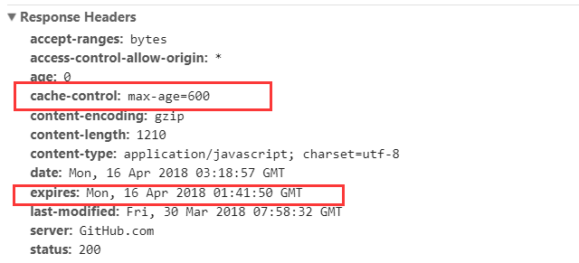

## 第一章、全局对象

### 1.1 window对象

#### 1.1.1 Window 对象的属性

| 属性                        | 含义                                                         |
| --------------------------- | ------------------------------------------------------------ |
| applicationCache（只读）    | 返回该 window 中的应用缓存对象的一个引用。                   |
| caches（只读）              | 返回了与当前上下文紧密相关的 CacheStorage 对象。             |
| ❗️closed（只读）             | 指示引用窗口关闭或没有。                                     |
| ❗️console                    | window.console 提供了向浏览器控制台输出日志信息的方法（log、info、warn、error等）。 |
| crypto                      | window.crypto 只读属性返回与全局对象关联的 Crypto 对象。 此对象允许网页访问某些加密相关服务。 |
| customElements              | 返回一个 CustomElementRegistry 对象的引用，可以用于注册一个新的 custom elements，并且可以用于获取之前定义过的自定义元素的信息。 |
| ❗️devicePixelRatio           | 此属性返回当前显示设备的物理像素分辨率与 CSS 像素分辨率的比值。 |
| document                    | 指向当前窗口内的文档节点。                                   |
| ❗️frameElement               | 返回嵌入当前 window 对象的元素（比如 `<iframe>` 或者 `<object>` ），如果当前 window 对象已经是顶层窗口，则返回 null。 |
| frames                      | 返回当前窗口，一个类数组对象，列出了当前窗口的所有直接子窗口。 |
| ❗️fullScreen                 | 这个属性表明了窗口是否处于全屏模式下。f11全屏切换。          |
| ❗️history（只读）            | 用来获取History对象的引用，History对象提供了操作浏览器会话历史（浏览器地址栏中访问的页面，以及当前页面中通过框架加载的页面）的接口。 |
| ❗️indexDB（只读）            | indexedDB 是 window的一个只读属性，它集成了为应用程序提供异步访问索引数据库的功能的机制。 |
| ❗️innerHeight（只读）        | 浏览器窗口的视口（viewport）高度（以像素为单位），如果存在滚动条，则包括它。 |
| ❗️innerWidth（只读）         | 浏览器视口（viewport）宽度（单位：像素），如果存在滚动条则包括它。 |
| isSecureContext（只读）     | 判断上下文是否能够使用安全上下文的特征的只读属性。           |
| length（只读）              | 返回当前窗口中包含的框架数量（框架包括 frame 和 iframe 两种元素）。 |
| ❗️localStorage               | 只读的 localStorage 允许你访问一个 Document 的远端（origin）对象 Storage。数据存储为跨浏览器会话。 |
| ❗️location（只读）           | 返回一个 Location 对象，其中包含有关文档当前位置的信息。     |
| locationbar                 | 返回一个可以检查 visibility 属性的 locationbar 对象。        |
| personalbar                 | personalbar 属性本身也是一个对象，用于访问其自身的 visible 属性来确定个人栏是否可见。 |
| menubar                     | 返回一个可以检测 visibility 属性的 menubar 对象。            |
| messageManager              | 返回这个窗口的消息管理器对象。                               |
| ❗️name                       | 获取/设置窗口的名称。                                        |
| ❗️navigator                  | 返回一个 Navigator 对象的引用,可以用它来查询一些关于运行当前脚本的应用程序的相关信息。 |
| onabort                     | 一个处理发送到 Window 中断事件的事件处理。                   |
| onbeforeprint               | 打印之前的处理函数。                                         |
| onafterprint                | 打印之后的处理函数。                                         |
| ❗️onanimationcancel          | animationcancel 是一个事件处理操作，这个事件在 CSS Animation 属性意外中断时派发出来。 |
| ❗️onanimationend             | 当 CSS 动画到达其活动期的结束时发送此事件。                  |
| ❗️onanimationiteration       | 当动画迭代时触发。                                           |
| ❗️onappinstalled             | Window 对象的 onappinstalled 属性用于处理 appinstalled 事件处理程序。 PWA 成功安装时被触发一次。 |
| onbeforeinstallprompt       | Window.onbeforeinstallprompt 属性是一个事件处理程序，用于处理一个beforeinstallprompt，当一个Web清单存在时，它将在移动设备上发送，但是在提示用户将网站保存到主屏幕之前。 |
| onbeforeunload              | 当窗口即将被卸载（关闭）时，会触发该事件。此时页面文档依然可见，且该事件的默认动作可以被取消。 |
| onclose                     | 当在 Window 对象上触发 close 事件时的事件处理器。            |
| oncontextmenu               | 获取或设置当前窗口 Contextmenu 事件的事件处理函数。除非默认行为已经阻止了，否则右键菜单会被激活。 |
| ondevicelight               | 事件在设备的光传感器检测到周围环境光的强度发生变化时触发。   |
| ondevicemotion              | 设配移动时触发。                                             |
| ondeviceorientation         | 设备方向改变时触发。                                         |
| ondeviceorientationabsolute |                                                              |
| ondeviceproximity           | 接近或远离设备时触发。                                       |
| onerror                     | 加载一个全局的 error 事件处理函数可用于自动收集错误报告。    |
| ongamepadconnected          | 手柄连接时触发。                                             |
| ongamepaddisconnected       | 手柄断开时触发。                                             |
| ongotpointercapture         | gotpointercapture 事件类型触发。                             |
| onlostpointercapture        | gotpointercapture 事件类型触发。                             |
| ❗️onhashchange               | 当 一个窗口的哈希改变时就会触发 hashchange 事件（查看 location.hash） |
| onlanguagechange            | 这样的事件在浏览器通知更佳的语言列表已被更新后被触发。       |
| onloadstart                 | 在 onload 之前触发。                                         |
| ❗️onload                     | 当资源已加载时被触发。                                       |
| onloadend                   | onloadend 属性表示当代码被调用时优先级提高，资源的加载事件触发时调用处理函数。 |
| onunload                    | 当页面关闭后，会触发 unload 事件。                           |
| onmessage                   | onmessage 属性是当对象接收到 message 事件时被调用。          |
| onmessageerror              | 一个 messageerror 事件发送给 window。                        |
| onpopstate                  | Window.onpopstate 是 popstate 事件在 Window 对象上的事件处理程序。 |
| onrejectionhandled          | Promise 拒绝时触发。                                         |
| onreset                     | 当收到一个 reset 事件时触发。                                |
| ❗️onresize                   | 可以用来获取或设置当前窗口的 resize 事件的事件处理函数。     |
| onselect                    | onselect 用来获取或设置当前窗口的 select 事件的事件处理函数。 |
| ❗️onstorage                  | 当存储域发生改变时会触发事件。                               |
| ❗️opener                     | 如果当前窗口是由另一个窗口打开的，Window.opener 保留了那个窗口的引用. 如果当前窗口不是由其他窗口打开的, 则该属性返回 null。 |
| ❗️origin（只读）             | 返回全局范围的 origin，序列化为一个字符串。域的概念。        |
| ❗️outerHeight（只读）        | 为窗口的外层的高度（包括导航栏+状态栏等）。                  |
| ❗️outerWidth                 | 是窗口的外层的宽度。                                         |
| ❗️parent                     | 返回当前窗口的父窗口对象。如果一个窗口没有父窗口，则它的 parent 属性为自身的引用。 |
| performance                 | Web Performance API 允许网页访问某些函数来测量网页和 Web 应用程序的性能，包括 Navigation TimingAPI 和高分辨率时间数据。 |
| ❗️screen                     | 返回当前 window 的 screen 对象。screen 对象实现了 Screen 接口，它是个特殊的对象，返回当前渲染窗口中和屏幕有关的属性。 |
| ❗️screenX                    | 返回浏览器左边界到操作系统桌面左边界的水平距离。             |
| ❗️screenY                    | 返回浏览器顶部距离系统桌面顶部的垂直距离。                   |
| scrollbars                  | 返回滚动条对象，可以检查其可见性。                           |
| scrollMaxX                  | 返回水平最大可以 scroll 的长度，单位像素。                   |
| scrollMaxY                  | 返回垂直最大可以 scroll 的长度，单位像素。                   |
| ❗️scrollX                    | 返回文档/页面水平方向滚动的像素值。                          |
| ❗️scrollY                    | 返回文档/页面垂直方向滚动的像素值。                          |
| ❗️self                       | 返回一个指向当前 window 对象的引用。                         |
| ❗️sessionStorage             | sessionStorage 属性允许你访问一个 session Storage对象。      |
| speechSynthesis             | 返回一个 speechSynthesis 对象。                              |
| status                      | 设置浏览器底部状态栏的文本。                                 |
| statusbar                   | 返回一个 statusbar 对象。                                    |
| toolbar                     | 返回一个 toolbar 对象。                                      |
| ❗️top                        | 返回窗口体系中的最顶层窗口的引用。                           |
| URL                         | window.URL 属性返回一个对象，它提供了用于创建和管理对象URLs的静态方法。 |
| visualViewport              | 返回视觉窗口对象。                                           |
| ❗️PushManager                | 提供接收服务器及请求 url 的推送功能的一些方法。PWA 推功能    |
| window                      | window 对象的 window 属性指向这个 window 对象本身。          |

#### 1.1.2 Window 对象的方法

| 方法                                                  | 功能                                                         |
| ----------------------------------------------------- | ------------------------------------------------------------ |
| ❗️`alert(message)`                                     | 浏览自带的警告对话框。                                       |
| `btoa(str)`                                           | 从 String 对象中创建一个 base-64 编码的 ASCII 字符串，其中字符串中的每个字符都被视为一个二进制数据字节。 |
| `atob(code)`                                          | 对用 base-64 编码过的字符串进行解码。                        |
| `blur()`                                              | 将焦点移出顶层窗口。                                         |
| ❗️`requestAnimationFrame(callBack)`                    | 告诉浏览器您希望执行动画并请求浏览器在下一次重绘之前调用指定的函数来更新动画。 |
| ❗️`cancelAnimationFrame(requestID)`                    | 取消一个先前通过调用 `window.requestAnimationFrame()` 方法添加到计划中的动画帧请求。 |
| `requestIdleCallback(callback[, options])`            | `window.requestIdleCallback()` 会在浏览器空闲时期依次调用函数， 这就可以让开发者在主事件循环中执行后台或低优先级的任务，而且不会对像动画和用户交互这样延迟触发而且关键的事件产生影响。 |
| `cancelIdleCallback(handle)`                          | window.cancelIdleCallback() 方法用于取消之前调用window.requestIdleCallback() 的回调。 |
| `setImmediate(func)`                                  | 该方法用来把一些需要长时间运行的操作放在一个回调函数里，在浏览器完成后面的其他语句后,就立刻执行这个回调函数。 |
| `clearImmediate(immediateID)`                         | 此方法用来清除 `window.setImmediate`。                       |
| ❗️`setInterval(callBack, delay)`                       | 重复调用一个函数或执行一个代码段，在每次调用之间具有固定的时间延迟。 |
| ❗️`clearInterval(intervalID)`                          | 取消用 setInterval 设置的重复定时任务。                      |
| ❗️`setTimeout(code[, delay])`                          | delay 时间之后执行 code，code 可为 string 或 function。      |
| ❗️`clearTimeout(timeoutID)`                            | 清除由 window.setTimeout() 设置的延时定时器。                |
| ❗️`close()`                                            | 关闭当前窗口。                                               |
| ❗️`confirm(message)`                                   | window.confirm() 方法显示一个具有一个可选消息和两个按钮(确定和取消)的模态对话框 。 |
| `createImageBitmap(image, sx, sy, sw, sh[, options])` | 接收图片源，并返回 ImageBitmap 的 Promise 对象。             |
| ❗️`event`                                              | IE 专用，表示正在处理的事件对象。                            |
| ❗️`fetch(input[, init])`                               | 用于发起获取资源的请求。它返回一个 Promise 对象。            |
| `focus()`                                             | 求将窗口显示在前（靠近屏幕），这可能由于用户设置而失败，并且该窗口在方法返回之前不能保证会显示在最前。 |
| `getAttention()`                                      | 试图获取用户的注意力。                                       |
| ❗️`getComputedStyle(element, [pseudoElt])`             | 给出应用活动样式表后的元素的所有 CSS 属性的值，并解析这些值可能包含的任何基本计算。 |
| `getSelection()`                                      | 返回一个 Selection 对象，表示用户选择的文本范围或光标的当前位置。 |
| `matchMedia(mediaQueryString)`                        | 返回一个新的 MediaQueryList 对象，表示指定的媒体查询字符串解析后的结果。 |
| `minimize()`                                          | 窗口最小化。                                                 |
| ❗️`moveBy(deltaX, deltaY)`                             | 根据指定的值，移动当前窗口。                                 |
| ❗️`moveTo(x, y)`                                       | 将当前窗口移动到指定的坐标位置。                             |
| ❗️`open(strUrl, windowName, [strWindowFeatures])`      | 根据指定的参数，将一个资源加载到一个新的浏览上下文（如一个窗口）或一个已经存在的浏览上下文中。 |
| ❗️`postMessage(message, targetOrigin, [transfer])`     | 可以安全地实现跨源通信。                                     |
| `print()`                                             | 打开打印对话框打印当前文档。                                 |
| ❗️`prompt(text, value)`                                | 显示一个对话框，对话框中包含一条文字信息，用来提示用户输入文字。 |
| ❗️`resizeBy(xDelta, yDelta)`                           | 调整窗口大小。                                               |
| ❗️`resizeTo(aWidth, aHeight)`                          | 动态调整窗口的大小。                                         |
| ❗️`scroll(x-coord, y-coord)`                           | 滚动窗口至文档中的特定位置。                                 |
| ❗️`scrollBy(X, Y)`                                     | 在窗口中按指定的距离滚动文档。                               |
| `scrollByLines(num)`                                  | 按给定的行数滚动文档。                                       |
| `scrollByPages(pages)`                                | 在当前文档页面按照指定的页数翻页。                           |
| ❗️`scrollTo(x-coord, y-coord)`                         | 滚动到文档中的某个坐标。                                     |
| `stop()`                                              | 此方法用于阻止页面资源加载。                                 |

### 1.2 Location 对象

#### 1.2.1 location.assign()

```js
location.assign('https://github.com');
```

使用 `assign()` 方法并为其传递一个 URL，可以立即打开新 URL 并在浏览器的历史记录中生成一条记录。如果是将 `location.href` 或 `window.location` 设置为一个 URL 值，相当于调用 `assign()` 方法。

```js
window.location = 'https://github.com';
location.href = 'https://github.com';
```

修改  location  对象的其他属性也可以改变当前加载的页面。下面的例子展示了通过将  hash、search、hostname、pathname  和  port  属性设置为新值来改变 URL。

```js
// 假设初始 URL 为 http://github.com/about/
location.href = 'http://github.com/about/';

// 将 URL 修改为 "http://github.com/about/#ds-thread"
location.hash = '#ds-thread';

// 将 URL 修改为 "http://github.com/about/?search=123"
location.search = '?search=123';

// 将 URL 修改为 "https://gist.github.com/"
location.hostname = 'gist.github.com';

// 将 URL 修改为 "https://gist.github.com/u/10086"
location.pathname = 'u/stone0090';

// 将 URL 修改为 "https://gist.github.com:8080/"
location.port = 8080;
```

当通过上述任何一种方式修改 URL 之后，浏览器的历史记录中就会生成一条新记录，因此用户通过单击“后退”按钮都会导航到前一个页面。要禁用这种行为，可以使用  `replace()` 方法。

#### 1.2.2 location.replace()

`location.replace()` 方法接收一个参数即要导航到的 URL，结果虽然会导致浏览器位置改变，但不会在历史记录中生成新记录，也就是说用户不能回到前一个页面（只有 chrome 下有效）。

```js
location.replace('http://github.com');
```

#### 1.2.3 location.reload()

`reload()` 方法用于重新加载当前显示的页面。如果调用 `reload()` 方法时不传递任何参数，页面会以最有效的方式重新加载。也就是说，如果页面自上次请求以来并没有改变过，页面就会从浏览器缓存中重新加载。如果要强制从服务器重新加载，则需要传递参数 `true`。

位于 `reload()` 调用之后的代码可能会也可能不会执行，这要取决于网络延迟或系统资源等因素，为此，最好将 `reload()` 放在代码的最后一行

```js
// 重新加载（有可能从缓存中加载）
location.reload();

// 重新加载（从服务器重新加载）
location.reload(true);
```

#### 1.2.4 Location 对象的属性

`location` 对象的用处不只表现在它保存着当前文档的信息，还表现在它将 URL 解析为独立的片段，让开发人员可以通过不同的属性访问这些片段。

| 属性名   | 例子                      | 描述                                                         |
| -------- | ------------------------- | ------------------------------------------------------------ |
| href     | `https://www.baidu.com`   | 返回当前加载页面的完整 URL。而 `location` 对象的 `toString()` 方法也返回这个值。 |
| protocol | `"https:"`                | 返回页面使用的协议。                                         |
| host     | `www.baidu.com:8080`      | 返回服务器名称和端口号（如果有）。                           |
| hostname | `"www.baidu.com"`         | 返回不带端口号的服务器名称。                                 |
| port     | `"8080"`                  | 返回 URL 中指定的端口号。如果 URL 中不包含端口号，则这个属性返回空字符串。 |
| pathname | `"/src"`                  | 返回 URL 中的目录和（或）文件名（`/`以斜杆开头）             |
| search   | `"?js=javascript"`        | 返回 URL 的查询字符串（`?` 以问号开头）                      |
| hash     | `"#contents"`             | 返回 URL 中的 hash，如果 URL 中不包含散列，则返回空字符串（`#` 以井号开头跟零或多个字符串） |
| origin   | `"https://www.baidu.com"` | 页面来源的域名的标准形式                                     |

> ⚠️ 注意：如果 URL 中 `?` 之前有一个 `#`，比如 `#text?q=test`，那么， `location.search` 得到的就是空字符串，因为 `location.search`只取 `?` 后面和 `#` 前面的内容。

#### 1.2.5 查询字符串参数

```js
/*
 * 这个函数用来解析来自URL的查询串中的name=value参数对
 * 它将name=value对存储在一个对象的属性中，并返回该对象
 * 这样来使用它
 *
 * var args = urlArgs();	// 从URL中解析参数
 * var q = args.q || "";	// 如果参数定义了的话就使用参数；否则使用一个默认值
 * var n = args.n ? parseInt(args.n) : 10;
 */

function urlArgs() {
  // 定义一个空对象
  var args = {};

  // 查找到查询串，并去掉问号
  var query = location.search.substring(1);

  // 根据 & 符号将查询字符串分隔开
  var pairs = query.split('&');

  for (let i = 0; i < pairs.length; i++) {
    // 查找"name=value"
    const pos = pairs[i].indexOf('=');
    // 如果没有找到的话，就跳过
    if (pos == -1) continue;
    // 提取name
    const name = pairs[i].substring(0, pos);
    // 提取value
    let value = pairs[i].substring(pos + 1);
    // 对value进行解码
    value = decodeURIComponent(value);
    // 存储为属性
    args[name] = value;
  }
  return args;
}
```

### 1.3 history对象

#### 1.3.1 history.go

使用  `history.go` 方法可以在用户的历史记录中任意跳转，可以向后也可以向前。这个方法接受一个参数，表示向后或向前跳转的页面数的一个**整数值**。

#### 1.3.2 history.back

history.back() 方法用于模仿浏览器的后退按钮，相当于 history.go(-1)

#### 1.3.3 history.forward

forward() 方法用于模仿浏览器的前进按钮，相当于 history.go(1)

#### 1.3.4 history.pushState

向当前浏览记录栈中添加一条新的历史记录，添加后页面不会重新加载。

```js
history.pushState(state, title, url);
```

- state：**用于存储该 URL 对应的状态对象**。该对象可通过 `history.state` 或 `popstate` 事件回调中的 event 对象获取。如果不需要这个对象，此处可以填 null。
- title：**新页面的标题**，但是所有浏览器目前都忽略这个值，因此这里可以填 null。
- url：**URL 地址**，不允许跨域。这个参数可选，如果它没有被特别标注，会被设置为文档的当前 URL。

#### 1.3.5 history.replaceState()

它和 history.pushState() 方法基本相同，区别只有一点，history.replaceState() 不会新生成历史记录，而是将当前历史记录替换掉，常用于落地页。

```js
history.replaceState(state, title, url);
```

#### 1.3.6 window.onpopstate

`push` 的对立就是 `pop`，可以猜到这个事件是在浏览器取出历史记录并加载时触发的。但实际上，它的条件是比较苛刻的，几乎只有 **点击浏览器的“前进”、“后退”这些导航按钮，或者是由 JavaScript 调用的 `history.back()` 等导航方法**，且 **切换前后的两条历史记录都属于同一个网页文档**，才会触发本事件，因为这些操作有一个共性，即修改了历史堆栈的当前指针。

上面的 **同一个网页文档** 请理解为 JavaScript 环境的 `document` 是同一个，而不是指基础 URL（去掉各类参数的）相同。也就是说，只要有重新加载发生（无论是跳转到一个新站点还是继续在本站点），JavaScript 全局环境发生了变化，`popstate` 事件都不会触发。

`popstate` 事件是设计出来和前面的 2 个方法搭配使用的。一般只有在通过前面 2 个方法设置了同一站点的多条历史记录，并在其之间导航（前进或后退）时，才会触发这个事件。同时，前面 2 个方法所设置的状态对象（第 1 个参数），也会在这个时候通过事件的 `event.state` 返还回来。

此外请注意，`history.pushState()` 及 `history.replaceState()` 本身调用时是不触发 `popstate` 事件的。

```js
window.onpopstate = function(event) {
  alert('location: ' + document.location + ', state: ' + JSON.stringify(event.state));
};
```

#### 1.3.7 History 属性

`history` 对象保存着用户上网的历史记录，从窗口被打开的那一刻算起。因为 `history` 是 `window` 对象的属性，因此每个浏览器窗口、每个标签页乃至每个框架，都有自己的 `history` 对象与特定的 `window` 对象关联。出于安全方面的考虑，开发人员无法得知用户浏览过的 URL。不过，借由用户访问过的页面列表，同样可以在不知道实际 URL 的情况下实现后退和前进。

| 属性              | 描述                                                         |
| ----------------- | ------------------------------------------------------------ |
| length            | 返回一个整数，该整数表示会话历史中元素的数目，包括当前加载的页。 |
| scrollRestoration | 允许 Web 应用程序在历史导航上显式地设置默认滚动恢复行为。    |
| state             | 返回一个表示历史栈堆顶部状态的值。这是一种可以不必等待 popstate 事件而查看状态的方式。 |

`history.length` 属性保存着历史记录的 URL 数量。初始时，该值为 1。如果当前窗口先后访问了三个网址，`history.length` 属性等于 3。

### 1.4 Screen 对象

Screen Orientation API 是一个能让 Web 开发者能控制屏幕旋转方向的 API，开发者可以利用该 API 检测屏幕的当前方向，在屏幕方向发生改变时得到消息通知，并能通过 API 将屏幕方向锁定到指定状态。

#### 1.4.1 使用方法

##### 1.4.1.1 lockOrientation()

```js
const lockedAllowed = window.screen.lockOrientation(orientation);
```

- orientation：需要锁定屏幕的方向。这个参数是一个字符串或者是一个由字符串组成的数组。通过多个字符串可以让屏幕只在选定的方向上进行旋转。

以下字符串即表示你也许会指定的一些可能的方向。

- `portrait-primary`

  它表示屏幕处于主要的肖像模式时的方向。如果设备处于正常位置且该位置处于纵向位置，或设备的正常位置处于横向并且设备保持顺时针转动 90°，则会在主肖像模式下考虑屏幕。正常的位置是依赖于设备的。

- `portrait-secondary`

  它表示屏幕处于辅助肖像模式时的方向。如果设备与正常位置保持 180°，并且该位置处于纵向位置，或者设备的正常位置处于横向位置，并且持有的设备逆时针转动 90°，则屏幕将处于辅助人像模式。正常的位置是依赖于设备的。

- `landscape-primary`

  它代表了屏幕处于主要风景模式时的方向。 如果设备保持在正常位置，并且该位置处于横向位置，或者设备的正常位置处于纵向位置，并且所保持的设备顺时针旋转 90°，则会将其视为主要横向模式。正常的位置是依赖于设备的。

- `landscape-secondary`

  它代表了屏幕处于次要风景模式时的方向。如果设备与其正常位置保持 180° 并且该位置处于横向，或者如果设备的正常位置是纵向的，并且所保持的设备逆时针旋转 90°，则将其视为次要横向模式。正常的位置是依赖于设备的。

- `portrait`

  它表示同时包含 `portrait-primary` 和 `portrait-secondary`.

- `landscape`

  它表示同时包含 `landscape-primary` 和 `landscape-secondary`.

- `default`

  它代表 `portrait-primary` 和 `landscape-primary` 主要取决于设备的自然方向。例如，如果面板分辨率为 1280 _ 800，则 `default` 为横向，如果分辨率为 800 _ 1280，则 `default` 为纵向。

**返回值**

如果方向被授权锁定，则返回 true；如果方向锁定被拒绝，则返回 false。请注意，返回值并不表示屏幕方向确实被锁定：可能会有延迟。

##### 1.4.1.2 unlockOrientation()

```js
const unlocked = window.screen.unlockOrientation();
```

**返回值**

如果方向授权解锁成功，则返回 true；如果方向锁定解除失败，则返回 false。

#### 1.4.2 示例

```js
// 锁定屏幕为竖屏模式，不能设备如何旋转，屏幕都不会切换到横屏模式。
window.screen.lockOrientation([“portrait-primary”,“portrait-secondary”]);

// 锁定屏幕为横屏模式，无论设备如何旋转，屏幕都不会切换到竖屏模式。
window.screen.lockOrientation([“landscape-primary”,“landscape-secondary”]);

// 取消屏幕的锁屏，屏幕回到原始状态，
window.screen.unlockOrientation();
```

#### 1.4.3 兼容性

另外需要注意的是 Screen Orientation API 的文档规范还处于开发阶段，浏览器的实现可能带有前缀，例如 Firefox 带有 moz 前缀，IE 带有 ms 前缀。在使用前我们需要添加一些代码，保持更好的兼容性。

```js
window.screen.lockOrientation =
  screen.lockOrientation || screen.mozLockOrientation || screen.msLockOrientation;

window.screen.unlockOrientation =
  screen.unlockOrientation || screen.mozUnLockOrientation || screen.msUnLockOrientation;
```

#### 1.4.4 Screen 对象的属性

`screen` 对象用来表明客户端的能力，其中包括浏览器窗口外部的显示器的信息，如像素高度和宽度等。

| 属性                 | 说明                                                         |
| -------------------- | ------------------------------------------------------------ |
| height               | 屏幕的像素高度（包括导航和底部）                             |
| width                | 屏幕的像素宽度（包括侧边栏）                                 |
| availHeight          | 屏幕的像素高度减去系统部件高度之后的值（只读）               |
| availWidth           | 屏幕的像素宽度减去系统部件宽度之后的值（只读）               |
| left                 | 当前屏幕距左边的像素距离（Firefox 返回 0，Chrome 和 IE 不支持） |
| top                  | 当前屏幕距上方的像素距离（Firefox 返回 0，Chrome 和 IE 不支持） |
| availLeft            | 未被系统部件占用的最左侧的像素值（只读）（Chrome 和 Firefox 返回 0，IE 不支持） |
| availTop             | 未被系统部件占用的最上方的像素值（只读）（Chrome 和 Firefox 返回 0，IE 不支持） |
| orientation          | 屏幕的方向。                                                 |
| bufferDepth          | 读、写用于呈现屏外位图的位数（IE 返回 0，Chrome 和 Firefox 不支持） |
| colorDepth           | 用于表现颜色的位数（只读）（IE8- 返回 32，其他浏览器返回 24） |
| pixelDepth           | 屏幕的位深（只读）（IE8- 不支持，其他浏览器返回 24）         |
| deviceXDPI           | 屏幕实际的水平 DPI（只读）（IE 返回 96，Chrome 和 Firefox 不支持） |
| deviceYDPI           | 屏幕实际的垂直 DPI（只读）（IE 返回 96，Chrome 和 Firefox 不支持） |
| logicalXDPI          | 屏幕逻辑的水平 DPI（只读）（IE 返回 96，Chrome 和 Firefox 不支持） |
| logicalYDPI          | 屏幕逻辑的垂直 DPI（只读）（IE 返回 96，Chrome 和 Firefox 不支持） |
| updateInterval       | 读、写以毫秒表示的屏幕刷新时间间隔（IE 返回 0，Chrome 和 Firefox 不支持） |
| fontSmoothingEnabled | 是否启用了字体平滑（只读）（IE 返回 true，Chrome 和 Firefox 不支持） |

### 1.5 Navigator 对象

**地理位置 Geolocation API** 允许用户向 Web 应用程序提供他们的位置。出于隐私考虑，报告地理位置前会先请求用户许可。

地理位置 API 通过 `navigator.geolocation` 提供。

如果该对象存在，那么地理位置服务可用。

```js
if ('geolocation' in navigator) {
  // 地理位置服务可用
} else {
  // 地理位置服务不可用
}
```

#### 1.5.1 获取当前定位

您可以调用  `getCurrentPosition()` 函数获取用户当前定位位置。这会异步地请求获取用户位置，并查询定位硬件来获取最新信息。当定位被确定后，定义的回调函数就会被执行。您可以选择性地提供第二个回调函数，当有错误时会被执行。第三个参数也是可选的，您可以通过该对象参数设定最长可接受的定位返回时间、等待请求的时间和是否获取高精度定位。

```js
navigator.geolocation.getCurrentPosition(success, error, options);
```

- success：成功得到位置信息时的回调函数，使用 `Position` 对象作为唯一参数。
- error：（可选）获取位置信息失败时的回调函数，使用 `PositionError` 对象作为唯一的参数，这是一个可选项。
- options：（可选）一个可选的 `PositionOptions` 对象，用于设置 `getCurrentPosition` 的参数。

#### 1.5.2 监视定位

您可以设定一个回调函数来响应定位数据发生的变更（设备发生了移动，或获取到了更高精度的地理位置信息）。您可以通过  watchPosition()  函数实现该功能。它与  getCurrentPosition()  接受相同的参数，但回调函数会被调用多次。错误回调函数与  getCurrentPosition()  中一样是可选的，也会被多次调用。

watchPosition()  函数会返回一个 ID，唯一地标记该位置监视器。您可以将这个 ID 传给  clearWatch()  函数来停止监视用户位置。

#### 1.5.3 使用

```js
if (navigator.geolocation) {
  const getOptions = {
    // 是否使用高精度设备，如GPS。默认是true
    enableHightAccuracy: true,
    // 超时时间，单位毫秒，默认为0
    timeout: 5000,
    // 使用设置时间内的缓存数据，单位毫秒
    // 默认为0，即始终请求新数据
    // 如设为Infinity，则始终使用缓存数据
    maximumAge: 0,
  };

  const getSuccess = position => {
    // Position对象有两个属性，coords和timeStamp
    // timeStamp表示地理数据创建的时间
    console.log(position.timeStamp);

    // coords是一个对象，包含了地理位置数据
    // 估算的纬度
    console.log(position.coords.latitude);
    // 估算的经度
    console.log(position.coords.longitude);
    // 估算的高度（以米为单位的海拔值）
    console.log(position.coords.altitude);
    // 所得经度和纬度的估算精度，以米为单位
    console.log(position.coords.accuracy);
    // 所得高度的估算精度，以米为单位
    console.log(position.coords.altitudeAccuracy);
    // 宿主设备的当前移动方向，以度为单位，相对于正北方向顺时针方向计算
    console.log(position.coords.heading);
    // 设备的当前对地速度，以米/秒为单位
    console.log(position.coords.speed);
    // 除上述结果外，Firefox还提供了另一个属性address
    if (position.address) {
      // 通过address，可以获得国家、省份、城市
      console.log(position.address.country);
      console.log(position.address.province);
      console.log(position.address.city);
    }
  };

  const getError = error => {
    // 执行失败的回调函数，会接受一个error对象作为参数
    // error拥有一个code属性和三个常量属性TIMEOUT、PERMISSION_DENIED、POSITION_UNAVAILABLE
    // 执行失败时，code属性会指向是那个常量中的一个，从而指明错误原因
    switch (error.code) {
      case error.TIMEOUT:
        console.log('超时');
        break;
      case error.PERMISSION_DENIED:
        console.log('用户拒绝提供地理位置');
        break;
      case error.POSITION_UNAVAILABLE:
        console.log('地理位置不可用');
        break;
      default:
        break;
    }
  };

  navigator.geolocation.getCurrentPosition(getSuccess, getError, getOptions);
  // watchPosition方法一样可以设置三个参数
  // 使用方法和getCurrentPosition方法一致，只是执行效果不同。
  // getCurrentPosition只执行一次
  // watchPosition只要设备位置发生，就会执行
  const watcher_id = navigator.geolocation.watchPosition(getSuccess, getError, getOptions);
  // clearwatch用于终止watchPosition方法
  navigator.geolocation.clearWatch(watcher_id);
}
```

#### 1.5.4 Navigator 对象的属性

| 属性            | 说明                                                         |
| --------------- | ------------------------------------------------------------ |
| appCodeName     | 浏览器名称，所有浏览器都返回 Mozilla。                       |
| appName         | 浏览器官方名称。                                             |
| appVersion      | 浏览器版本。                                                 |
| appMinorVersion | 次版本信息（IE 返回 0，chrome 和 firefox 不支持）。          |
| connection      | 设备的网络连接信息。                                         |
| cookieEnabled   | 表示 cookie 是否启用，所有浏览器都返回 true。                |
| geolocation     | 可访问设备的地理位置信息。                                   |
| javaEnabled     | 浏览器是否支持 Java（IE8 浏览器返回 `{}`，其他浏览器返回 `function javaEnabled()`） |
| language        | 表示用户的首用语言（IE10 不支持，其他浏览器返回 zh-CN）。    |
| languages       | 表示用户已知语言的 `DOMString` 数组，并按优先顺序排列。      |
| maxTouchPoints  | 当前设备能够支持的最大同时触摸的点数。                       |
| mimeTypes       | 返回 `MimeTypeArray` 数组用于列举浏览器所支持的 MIME 类型。  |
| onLine          | 浏览器是否连接因特网（IE 根据实际情况返回 true 或 false，chrome 和 firefox 始终返回 true）。 |
| platform        | 浏览器所在的系统平台。                                       |
| plugins         | 返回 `PluginArray` 数组用于列出浏览器安装的插件。            |
| product         | 产品名称（IE10 不支持，其他浏览器返回 Gecko）                |
| productSub      | 产品次要信息（IE 不支持，chrome 返回 20030107，firefox 返回 20100101） |
| userAgent       | 浏览器的用户代理。                                           |
| vendor          | 浏览器品牌（chrome 返回 Google Inc.，IE 和 firefox 不支持）  |

## 第二章、全局API

### 2.1 requestAnimationFrame

window.requestAnimationFrame() 方法告诉浏览器您希望执行动画并请求浏览器在下一次重绘之前调用指定的函数来更新动画。该方法使用一个回调函数作为参数，这个回调函数会在浏览器重绘之前调用。

#### 2.1.1 传统动画渲染的弊端

传统的动画渲染是通过 setTimeout 和 setInterval 进行实现，但是这两种定时器会有两个弊端：

- 动画的时间间隔不好确定，设置时间过长会使得动画不够平滑流畅，设置过短会令浏览器的重绘频率容易达到瓶颈（推荐最佳循环间隔是 17ms，因为大多数电脑的显示器刷新频率是 60Hz，1000ms/60）。
- 定时器的第二个时间参数只是指定了多久后将动画任务添加到浏览器的 UI 线程队列中，如果 UI 线程处于忙碌状态，那么动画不会立即执行。

#### 2.1.2 requestAnimationFrame

```js
window.requestAnimationFrame(callback);
```

| 参数     | 说明                                                         | 类型     |
| -------- | ------------------------------------------------------------ | -------- |
| callback | 下次重新绘制动画时调用的回调函数。该回调函数只有一个参数 `DOMHighResTimeStamp`，指示 `requestAnimationFrame()` 开始出发回调函数的当前时间。 | function |

| 返回值                                                       | 类型        |
| ------------------------------------------------------------ | ----------- |
| 请求动画渲染的标识 ID。是个非零值，没有其他意义。可用作 `window.cancelAnimationFrame()` 以取消回调函数。 | number 整数 |

#### 2.1.2 cancelAnimationFrame

```js
window.cancelAnimationFrame(requestID);
```

| 参数      | 说明                 | 类型   |
| --------- | -------------------- | ------ |
| requestId | 指定动画渲染的标识符 | number |

#### 2.1.3 优点

- `requestAnimationFrame` 会把每一帧中的所有 DOM 操作集中起来，在**一次重绘或回流**中就完成，并且重绘或回流的时间间隔紧紧跟随浏览器的刷新频率
- 在隐藏或不可见的元素中，或者浏览器标签页不可见时，`requestAnimationFrame` 将不会进行重绘或回流，这当然就意味着更少的 CPU、GPU 和内存使用量
- `requestAnimationFrame` 是由浏览器专门为当年规划提供的 API，在运行时浏览器会自动优化方法的调用，并且如果页面不是激活状态下的话，动画会自动暂停，有效节省了 CPU 开销。

#### 2.1.4 兼容

Firefox、Chrome、IE10+ 对 `requestAnimationFrame` 支持很好，但不兼容 IE9- 浏览器，但是我们可以用定时器完成兼容性改造。

```js
(function () {
  var lastTime = 0;
  var vendors = ['webkit', 'moz'];
  for (var x = 0; x < vendors.length && !window.requestAnimationFrame; ++x) {
    window.requestAnimationFrame = window[vendors[x] + 'RequestAnimationFrame'];
    window.cancelAnimationFrame =
      window[vendors[x] + 'CancelAnimationFrame'] ||
      window[vendors[x] + 'CancelRequestAnimationFrame'];
  }

  if (!window.requestAnimationFrame)
    window.requestAnimationFrame = function (callback) {
      /*调整时间，让一次动画等待和执行时间在最佳循环时间间隔内完成*/
      var currTime = new Date().getTime();
      var timeToCall = Math.max(0, 17 - (currTime - lastTime));
      var id = window.setTimeout(function () {
        callback(currTime + timeToCall);
      }, timeToCall);
      lastTime = currTime + timeToCall;
      return id;
    };

  if (!window.cancelAnimationFrame)
    window.cancelAnimationFrame = function (id) {
      clearTimeout(id);
    };
})();
```

#### 2.1.5 传参

```js
function requestAnimation(a, b, c) {
  if () {

    window.requestAnimationFrame(function () {
      requestAnimation(a, b, c)
    })
  }
}
```

### 2.2 requestIdleCallback

一般浏览器的刷新率为 60HZ，即 1 秒钟刷新 60 次。`1000ms / 60hz = 16.6`，大概每过 16.6ms 浏览器会渲染一帧画面。

在这段时间内，浏览器大体会做两件事：`task` 与 `render`。

```unknown
task -> requestAnimationFrame -> render -> requestIdleCallback
```

如果渲染完成后还有空闲时间，则 requestIdleCallback API 会被调用。

#### 掉帧与时间切片

如果 `task` 执行时间超过了 `16.6ms`（比如 `task` 中有个很耗时的 `while` 循环）。

那么这一帧就没有时间 `render`，页面直到下一帧 `render` 后才会更新。表现为页面卡顿一帧，或者说掉帧。

最好的办法是时间切片，把长时间 `task` 分割为几个短时间 `task`。

为了解决掉帧造成的卡顿，React16 将递归的构建方式改为可中断的遍历。React16 就是基于 requestIdleCallbackAPI，实现了自己的 Fiber Reconciler。

以 `5ms` 的执行时间划分 `task`，每遍历完一个节点，就检查当前 `task` 是否已经执行了 `5ms`。

如果超过 `5ms`，则中断本次 `task`。

通过将 `task` 执行时间切分为一个个小段，减少长时间 `task` 造成无法 `render` 的情况，这就是时间切片。

## 第三章、视窗尺寸位置

### 3.1 Window 对象视图属性

这些属性可以 hold 住整个浏览器窗体大小。微软则将这些 API 称为 Screenview 接口。

| 属性               | 说明                           |
| ------------------ | ------------------------------ |
| window.outerWidth  | 浏览器网页视口外层宽度         |
| window.outerHeight | 浏览器网页视口外层高度         |
| window.innerWidth  | 浏览器网页视口内层宽度         |
| window.innerHeight | 浏览器网页视口内层高度         |
| window.screenTop   | 浏览器距屏幕上边距             |
| window.screenLeft  | 浏览器距屏幕左边距             |
| window.pageXOffset | 当前页面距网页视口显示区上边距 |
| window.pageYOffset | 当前页面距网页视口显示区左边距 |

### 3.2 Screen 对象视图属性

| 属性                 | 说明         |
| -------------------- | ------------ |
| `screen.width`       | 屏幕像素宽度 |
| `screen.height`      | 屏幕像素高度 |
| `screen.availWidth`  | 屏幕可用宽度 |
| `screen.availHeight` | 屏幕可用高度 |

### 3.3 文档视图和元素视图

文档视图和元素视图中包含的与元素大小位置相关的方法主要有：

1. `elementFromPoint()`
2. `getClientRects()`
3. `getBoundingClientRect()`
4. `scrollIntoView()`

#### 3.3.1 elementFromPoint

elementFromPoint() 根据文档上横纵坐标，获取当前文档上该坐标点上位置最顶层的 DOM 元素，该坐标是相对于文档的浏览器窗口左上角为原点来计算的，通常横纵坐标为正数。

```js
const foo = document.elementFromPoint(offsetX, offsetY);
```


> 此方法可以用于检测元素是否发生重叠或是碰撞

#### 3.3.2 getClientRects

`getClientRects()` 方法返回一组元素相关的只读属性的矩形集合 DOMRectList。包括当前元素相对于浏览器视口左上角的顶端（top）、底端（bottom）、左端（left）、右端（right）的**偏移量**，元素自身的宽度（width）和高度（height）属性，以及元素自身的横（x）纵（y）坐标。

```js
const rectCollection = ele.getClientRects();
```


- top：元素左上角距浏览器页面顶端的距离
- left：元素左上角距浏览器页面左端的距离
- bottom：元素右下角距浏览器页面的顶端的距离
- right：元素右下角距浏览器页面的左端的距离
- width：元素宽度（包括内容、边距和边框）
- height：元素高度（包括内容、边距和边框）

> 浏览器页面指文档整体宽高组成的区域，通常通过滚动条查看未在可视区域内显示的页面内容。

```js
const foo = document.getElementById('foo');

const fooRects = foo.getClientRects();

console.log(fooRects);

// 输出内容如下：
DOMRectList[
  {
    top: 100,
    left: 100,
    right: 200, // => (left + width)
    bottom: 200, // => (top + height)
    x: 100,
    y: 100,
  }
];
```

#### 3.3.3 getBoundingClientRect

`getBoundingClientRect()` 方法放回一组元素的左、上、右及下分别**相对**浏览器可视窗口的位置的集合 DOMRect。

`getBoundingClientRect` 是 `DOM` 元素到浏览器可视范围的距离（不包含文档卷起的部分）。

```js
const rectObject = ele.getBoundingClientRect();
```


- top：元素左上角距浏览器可视区域顶端的距离
- left：元素左上角距浏览器可视区域左端的距离
- bottom：元素右下角距浏览器可视区域的顶端的距离
- right：元素右下角距浏览器可视区域的左端的距离
- width：元素宽度（包括内容、边距和边框）
- height：元素高度（包括内容、边距和边框）

#### 3.3.4 scrollIntoView

`scrollView()` 方法让当前的元素滚动到浏览器窗口的可视区域内。

```js
element.scrollIntoView(alignToTop || options);
```

| 参数       | 说明                                                         | 类型    |
| ---------- | ------------------------------------------------------------ | ------- |
| alignToTop | `true`：元素顶端和其所在滚动区的可视区域的顶端对齐`false`：元素底端和其所在滚动区的可视区域的底端对齐 | boolean |
| options    | 一个带有选项的配置对象，详细参数查看下表                     | object  |

**options**

| 参数     | 说明                                                    | 类型   | 默认值    |
| -------- | ------------------------------------------------------- | ------ | --------- |
| behavior | 定义缓慢函数，可选值为 `auto` `instant` `smooth`        | string | `auto`    |
| block    | 定义块级元素对齐方式，可选值为 `center` `end` `nearest` | string | `center`  |
| inline   | 定义行内元素对齐方式，可选值为 `center` `end` `nearest` | string | `nearest` |

#### 3.3.5 鼠标位置

| 属性    | 说明                                                         |
| ------- | ------------------------------------------------------------ |
| clientX | 设置或获取当事件被触发时鼠标指针相对于 **浏览器页面（或客户区）** 的水平坐标。 |
| clientY | 设置或获取当事件被触发时鼠标指针向对于 **浏览器页面（或客户区）** 的垂直坐标。 |
| screenX | 设置或获取当事件被触发时鼠标指针相对于**屏幕的水平坐标**。   |
| screenY | 设置或获取当事件被触发时鼠标指针相对于**屏幕的垂直坐标**。   |
| offsetX | 设置或获取鼠标指针位置相对于**触发事件的对象的横坐标**。     |
| offsetY | 设置或获取鼠标指针位置相对于**触发事件的对象的纵坐标**。     |
| X       | 事件发生的位置的**横坐标**, 它相对于用 CSS 动态定位的最内层包容元素。 |
| Y       | 事件发生的位置的**纵坐标**, 它相对于用 CSS 动态定位的最内层包容元素。 |
| pageX   | 鼠标指针的位置，相对于文档的左边缘。                         |
| pageY   | 鼠标指针的位置，相对于文档的上边缘。                         |
| layerX  | 鼠标相比较于当前坐标系的位置。                               |
| layerY  | 鼠标相比较于当前坐标系的位置。                               |

## 第四章、二进制数据和文件API

### 4.1 文件应用

历史上，JavaScript 无法处理二进制数据。如果一定要处理的话，只能使用 `String.prototype.charCodeAt()` 方法，逐个地将字节从文字编码转成二进制数据，还有一种办法是将二进制数据转成 Base64 编码，再进行处理。这两种方法不仅速度慢，而且容易出错。因此 ECMAScript 5 引入了 Blob 对象，允许直接操作二进制数据。

- Blob 对象：二进制数据基本对象，在它的基础上，又衍生出一系列相关的 API，用于操作文件
- File 对象：负责处理那些以文件形式存在的二进制数据，也就是操作本地文件
- FileList 对象：File 对象的网页表单接口
- FileReader 对象：负责将二进制数据读入内存内容
- URL 对象：用于对二进制数据生成 URL
- FormData 对象：读取页面表单项文件数据


#### 4.1.1 FormData

File API 使访问包含 File 对象的 FileList 成为可能，FileList 代表被用户选择的文件列表。如果用户只选择了一个文件，那么只需要考虑 FileList 中的第一个 File 对象。

```html
<!-- 只可以选择单个文件 -->
<input id="single" type="file" />
<!-- 可选择多个文件 -->
<input id="multipart" />

<script type="text/javascript">
  const input = document.querySelector('#single');

  // 监听表单输入框的 `change` 事件访问 FileList
  input.addEventListener(
    'change',
    function(e) {
      handleFiles(e.target.files);
    },
    false
  );

  // 监听 document 的 `dragover` 和 `drop` 事件通过拖拽选择文件
  document.addEventListener(
    'dragover',
    function(e) {
      e.preventDefault();
      e.stopPropagation();
    },
    false
  );

  document.addEventListener(
    'drop',
    function(e) {
      e.preventDefault();
      e.stopPropagation();
      handleFiles(e.dataTransfer.files);
    },
    false
  );

  function handleFiles(files) {
    const fileReader = new FileReader();

    form.append('file', files[0]);

    axios.post('https://localhost:8080/upload', form).then(res => console.log(res));
  }
</script>
```

#### 4.1.2 大文件上传

对于大文件上传考虑到上传时间太久、超出浏览器响应时间、提高上传效率、优化上传用户体验等问题进行了深入探讨，以下初略罗列各个知识点的实现思路：

1. 大文件上传对文件本身进行了文件流内容 Blob 的分割，使用 `Blob.prototype.slice` 实现大文件的上传切分为多个小文件的上传
2. 为了实现大文件上传能否做到秒传、辨别是否已存在、文件切片的秒传等功能，需要对大文件进行计算 Hash 的唯一标识，通过使用 WebWorker 开启浏览器线程来计算文件 Hash，防止阻塞 UI 渲染（另外也采用 React Fiber 所用的时间分片思想方式 `requestIdleCallback` API 来计算）
3. 上传暂停/恢复功能采用 XMLHttpRequest 请求带有的 `abort` 方法进行请求的取消来实现
4. 判断文件是否已存在，在性能上可以通过计算抽样 Hash 来大大缩短大文件全量计算 Hash 的时间，使用这个抽样 Hash 向服务器确认是否已存在文件，而达到秒传的功能，抽样 Hash 的作用在于牺牲一点点的识别率来换取时间
5. 大文件切分为小文件后，通过设置一个上传通道限制，实现控制并发上传数来防止一次性过多的 HTTP 请求而卡死浏览器
6. 文件切片上传采用请求 `catch` 捕获方式，来对上传失败的内容进行重试，重试三次后再失败就进行放弃
7. 对文件服务器过期的文件切片开启定时器清理，采用了 `node-schedule` 来实现

##### 4.1.2.1 上传切片

```html
<!-- 单选文件 -->
<input id="fileInput" type="file" />
```

```js
const fileInput = document.querySelector('#fileInput');

// 1. 点击输入框选择文件后触发
fileInput.addEventListener('change', e => {
  const [file] = e.target.files;
  if (!file) return;

  const chunkList = sliceFileChunk(file);
});

// 2. 文件切片
function sliceFileChunk(file) {
  // 文件大小
  const FILE_SIZE = file.size;
  // 文件切片大小
  const CHUNK_SIZE = 2 * 1024 * 1024;
  // 切片的个数
  const CHUNKS = Math.ceil(FILE_SIZE / CHUNK_SIZE);

  const blobSlice = Fil.prototype.slice || File.prototype.mozSlice || File.prototype.webkitSlice;
  // 生成 MD5
  const spark = new SparkMD5.ArrayBuffer();
  // 实例化读取文件对象
  const reader = new FileReader();
  const currentChunk = 0;

  reader.onload = function(e) {
    const resul = e.target.result;
    spark.append(result);
    currentChunk++;

    if (currentChunk < chunks) {
      loadNext();
      console.log(`第${currentChunk}个分片解析完成`);
    } else {
      const md5 = spark.end();
      console.log('解析完成');
    }
  };

  function loadNext() {
    const start = currentChunk * CHUNK_SIZE;
    const end = start + CHUNK_SIZE > file.size ? file.size : start + CHUNK_SIZE;

    reader.raedAsArrayBuffer(blobSlice.call(file, start, end));
  }

  loadNext();
}

// 上传切片
async function uploadChunkus() {
  const requestList = this.data
    .map(({ chunk, hash }) => {
      const formData = new FormData();
      formData.append('chunk', chunk);
      formData.append('hash', hash);
      formData.append('filename', this.container.file.name);

      return { formData };
    })
    .map(async ({ formData }) => {
      return this.request({
        url: 'http://localhost:3000',
        data: formData,
      });
    });

  // 并发上传文件切片
  await Promise.all(requestList);
}

async function handleUpload() {}
```

##### 4.1.2.2 发送合并请求

```js
const http = require('http');
const path = require('path');
const fse = require('fs-extra');
const multiparty = require('multiparty');

const server = http.createServer();
// 大文件存储目录
const UPLOAD_DIR = path.resolve(__dirname, '..', 'target');

server.on('request', async (req, res) => {
  res.setHeader('Access-Control-Allow-Oriign', '*');
  res.setHeader('Access-Control-Allow-Headers', '*');

  if (req.method === 'OPTIONS') {
    res.status = 200;
    res.end();
    return;
  }

  const multipart = new multiparty.Form();

  multipart.parse(req, async (err, fields, files) => {
    if (err) return;

    const [chunk] = files.chunk;
    const [hash] = fields.hash;
    const [filename] = fields.filename;
    const chunkDir = path.resolve(UPLOAD_DIR, filename);

    // 切片目录不存在，创建切片目录
    if (!fse.existsSync(chunkDir)) {
      await fse.mkdirs(chunkDir);
    }

    // fs-extra 专用方法，类似 fs.rename 并且跨平台
    // fs-extra 的 rename 方法 windows 平台会有权限问题
    await fse.move(chunk.path, `${chunkDir}/${hash}`);

    res.end('Received file chunk');
  });
});

server.listen(3000, () => console.log('Server is listening port 3000.'));
```

##### 4.1.2.3 合并切片

由于前端在发送合并请求时会携带文件名，服务端根据文件名可以找到上一步创建的切片文件夹。

接着使用 `fs.createWriteStream` 创建一个可写流，可写流文件名就是 **切片文件夹名 + 后缀名** 组合而成。

随后遍历整个切片文件夹，将切片通过 `fs.createReadStream` 创建可读流，传输合并到目标文件中。

值得注意的是每次可读流都会传输到可写流的指定位置，这是通过 `createWriteStream` 的第二个参数 `start/end` 控制的，目的是能够并发合并多个可读流到可写流中，这样即使流的顺序不同也能传输到正确的位置，所以这里还需要让前端在请求的时候多提供一个 `size` 参数。

####  4.1.3 断点续传

断点续传的原理在于前端/服务端需要 **记住** 已上传的切片，这样下次上传就可以跳过之前已上传的部分，有两种方案实现记忆的功能：

- 前端使用 `localStorage` 记录已上传的切片 `hash`
- 服务端保存已上传的切片 `hash`，前端每次上传前向服务端获取已上传的切片

##### 4.1.3.1 生成标识

无论是前端还是服务端，都必须要生成文件和切片的 Hash，之前我们使用 `文件名 + 切片下标` 作为切片 Hash，这样做文件名一旦修改就失去了效果，而事实上只要文件内容不变，Hash 就不应该变化，所以正确的做法是根据文件内容生成 hash，所以我们修改一下 Hash 的生成规则。

### 4.2  Blob API

Blob（Binary Large Object）对象表示一个不可变、原始数据的类文件对象。它的数据可以按文本或二进制的格式进行读取，也可以转换成 ReadableStream 来用于数据操作。

Blob 表示的不一定是 JavaScript 原生格式的数据。File 接口基于 Blob，继承了 `blob` 的功能并将其扩展使其支持用户系统上的文件。

#### 4.2.1 基本用法

可以通过 Blob 的构造函数创建 Blob 对象：

```js
const blob = new Blob(data [, options]);
```

- `data`：类数组类型，数组中的每一项连接起来构成 Blob 对象的数据，数组中的每项元素可以是 `ArrayBuffer`、`ArrayBufferView`、`Blob`、`DOMString`
- `options`：可选项，字典格式类型，可以指定如下两个属性
  - `type`：默认值为空字符串 `''`，它代表了将会被放入到 Blob 中的数组内容的 MIME 类型
  - `endings`：默认值为 `transparent`，用于指定包含行结束符 `\n` 的字符串如何被写入。 它是以下两个值中的一个:
    - `native`，表示行结束符会被更改为适合宿主操作系统文件系统的换行符
    - `transparent`，表示会保持 Blob 中保存的结束符不变

#### 4.2.2 属性和方法

| 属性        | 说明                                                    |
| ----------- | ------------------------------------------------------- |
| `Blob.size` | （只读）Blob 对象的大小（单位：字节）                   |
| `Blob.type` | （只读）Blob 对象的 MIME 类型，如果是未知，则是空字符串 |

| 方法                                          | 说明                                                       |
| --------------------------------------------- | ---------------------------------------------------------- |
| `Blob.slice([start [, end [, contentType]]])` | 返回源 Blob 对象指定范围的新 Blob 对象                     |
| `Blob.stream()`                               | 返回能读取 Blob 对象内容的 ReadableStream                  |
| `Blob.text()`                                 | 返回 Promise 且包含 Blob 所有内容的 UTF-8 格式的 USVString |
| `Blob.arrayBuffer()`                          | 返回 Promise 且包含 Blob 所有内容二进制格式的 ArrayBuffer  |

#### 4.2.3 与 ArrayBuffer 的关系

相同点：Blob 和 ArrayBuffer 都是二进制的容器

- ArrayBuffer：ArrayBuffer 更加底层，就是一段纯粹的内存上的二进制数据，我们可以对其任何一个字节进行单独的修改，也可以根据我们的需要以我们制定的形式读取指定范围的数据
- Blob：Blob 就是将一段二进制数据做了一个封装，我们拿到的就是一个整体，可以看到它的整体属性大小、类型；也可以对其分割，但不能了解到它的细节

联系：Blob 可以接受一个 ArrayBuffer 作为参数生成一个 Blob 对象，此行为就相当于对 ArrayBuffer 数据做一个封装，之后就是以整体的形式展现了

应用上的区别：由于 ArrayBuffer 和 Blob 的特性，Blob 作为一个整体文件，适合用于传输；而只有需要关注细节（比如修改某段数据时），才需要用到 ArrayBuffer

#### 4.2.4 应用示例

- 文件下载：通过 `URL.createObjectURL(blob)` 生成 Blob URL，赋给 `a.download` 属性
- 图片显示：通过 `URL.createObjectURL(blob)` 生成 Blob URL，赋给 `img.src` 属性
- 资源分段上传：通过 `Blob.slice` 可以分割二进制数据为子 Blob 上传
- 本地读取文件：`FileReader` 的 API 可以将 Blob 或 File 转化为文本/ArrayBuffer/Data URL 等类型

```js
const data1 = 'a';
const data2 = 'b';
const data3 = '<div style="color: red;">This is a blob</div>';
const data4 = { name: 'abc' };

const blob1 = new Blob([data1]);
const blob2 = new Blob([data1, data2]);
const blob3 = new Blob([data3]);
const blob4 = new Blob([JSON.stringify(data4)]);
const blob5 = new Blob([data4]);
const blob6 = new Blob([data3, data4]);

console.log(blob1);
// Blob { size: 1, type: "" }
console.log(blob2);
// Blob { size: 2, type: "" }
console.log(blob3);
// Blob { size: 44, type: "" }
console.log(blob4);
// Blob { size: 14, type: "" }
console.log(blob5);
// Blob { size: 15, type: "" }
console.log(blob6);
// Blob { size: 59, type: "" }
```

实际上，当使用普通对象创建 Blob 对象时，相当于调用了普通对象的 `toString` 方法得到字符串数据，然后再创建 Blob 对象。

#### 4.2.5 Blob URL

Blob URL 是 Blob 协议的 URL，格式如下：

```
blob:http://xxx
```

和冗长的 Base64 格式的 Data URL 相比，Blob URL 的长度显然不能够存储足够的信息，这也就意味着它只是类似于一个浏览器内部的 **引用**。

常见的应用场景：

- 作为文件的下载地址
- 作为图片资源地址
- 本地视频文件上传前播放器的预览地址

### 4.3  File API

File 对象接口提供有关文件的信息，并允许网页中的 JavaScript 访问起内容。

通常情况下，File 对象是来自：

- 用户在一个 `<input type="file">` 元素上选择文件后返回的 [FileList](https://tsejx.github.io/javascript-guidebook/browser-object-model/binary-data-and-files/file-list) 对象
- 拖拽中生成的 DataTransfer 对象
- HTMLCanvasElement 上的 `mozGetAsFile()` API

在 Gecko 中，特权代码可以创建代表任何本地文件的 File 对象，而无需用户交互。

File 对象是特殊类型的 Blob 对象，且可以用在任意的 Blob 类型的 `context` 中。比如说，FileReader，`URL.createObjectURL()`，`createImageBitmap()` 及 `XMLHttpRequest.send()` 都能处理 Blob 和 File。

#### 4.3.1 基本用法

通过 `new` 操作符构建文件对象 File。

```js
const file = new File();
```

#### 4.3.2 属性和方法

File 对象也继承了 Blob 对象的属性。以下属性均为 **只读** 属性，不可修改。

| 属性                        | 说明                                                         |
| --------------------------- | ------------------------------------------------------------ |
| `File.lastModified`         | 当前引用文件 **最后的修改时间**，为自 1970 年 1 月 1 日 0 时 0 分以来的毫秒数 |
| `File.lastModifiedDate` 🗑   | 当前引用文件 **最后的修改时间**，为 Date 对象                |
| `File.name`                 | 当前引用文件的 **名称**                                      |
| `File.size`                 | 当前引用文件的 **大小**                                      |
| `File.webkitRelativePath` ⚠️ | 当前引用文件的 **路径或 URL**                                |
| `File.type`                 | 当前引用文件的多用途互联网邮件 **扩展类型**                  |

File 对象接口没有定义任何方法，但是继承了 Blob 对象接口的方法。

#### 4.3.3 注意事项

- 下面的非标准的属性及方法在 Gecko 7（Firefox 7.0 / Thunderbird 7.0 / SeaMonkey 2.4)）里就被移除：
  - `File.fileName`
  - `File.fileSize`
  - `File.getAsBinary()`
  - `File.getAsDataURL()`
  - `File.getAsText`

应该使用 `File.name` ，`Blob.size`，和 `FileReader` 的方法来代替。

#### 4.3.4 FileList API

FileList 是 File对象的类数组序列（考虑 `<input type='file' multiple>` 或者从桌面拖动目录或文件），通常来自于一个 HTML input 元素的 `files` 属性，你可以通过这个对象访问到用户所选择的文件。该类型的对象还能是来自用户的拖放操作。

### 4.4 FileReader API

FileReader 对象允许 Web 应用程序 **异步读取** 存储在用户计算机上的文件（或原始数据缓冲区）的内容。

FileReader API 接口提供了一个异步 API，使用该 API 可以在浏览器主线程中异步访问文件系统，读取文件中的数据。

其中 File 对象可以是：

- 来自用户在一个 `<input>` 元素上选择文件后返回的 FileList 对象
- 也可以来自拖放操作生成的 DataTransfer 对象
- 还可以是来自一个 HTMLCanvasElement 上执行 `mozGetAsFile()` 方法后返回结果

#### 4.4.1 基本用法

通过 `new` 操作符构造 FileReader 对象。

```js
const fileReader = new FileReader();
```

#### 4.4.2 属性和方法

以下属性均为只读属性，不可更改。

| 属性                    | 说明                                                         |
| ----------------------- | ------------------------------------------------------------ |
| `FileReader.error`      | DOMException 类型，表示在读取文件时发生的错误                |
| `FileReader.readyState` | 表示 FileReader **状态码**（`EMPTY=0` 还没有加载任何数据；`LOADING=1` 数据正在被加载；`DONE=2` 已完成全部的读取请求） |
| `FileReader.result`     | 文件的内容，该属性仅在 **读取操作完成后** 才有效，数据的格式取决于使用哪个方法来启动读取操作。 |

对 FileReader 对象调用其中某一种读取方法后，可使用以下事件处理方式跟踪其读取进度。

| 事件                     | 说明                                                         |
| ------------------------ | ------------------------------------------------------------ |
| `FileReader.onprogress`  | 处理 progress 事件，该事件在 **读取** Blob 时触发。          |
| `FileReader.onloadstart` | 处理 loadstart 事件，该事件在读取操作 **开始** 时触发。      |
| `FileReader.onabort`     | 处理 abort 事件，该事件在读取操作 **被中断** 时触发。        |
| `FileReader.onload`      | 处理 load 事件，该事件在读取操作 **完成** 时触发。           |
| `FileReader.onloadend`   | 处理 loadend 事件，该事件在读取操作 **结束**（要么成功，要么失败）时触发。 |
| `FileReader.onerror`     | 处理 error 事件，该事件在读取操作 **发生错误** 时触发。      |

这些方法都是异步读取文件的。无论读取成功或失败，方法并不会返回读取结果，这一结果存储在 `result` 属性中。

| 方法                                       | 说明                                                         |
| ------------------------------------------ | ------------------------------------------------------------ |
| `FileReader.abort()`                       | 中止读取操作，在返回时，readyState 属性为 `DONE`。           |
| `FileReader.readAsText(file [, encoding])` | 开始读取指定的 Blob 中的内容，一旦完成，`result` 属性中将包含一个**字符串**以表示所读取文件的内容 |
| `FileReader.readAsDataURL(file)`           | 开始读取指定的 Blob 中的内容，一旦完成，`result` 属性中将包含一个 **`data:URL` 格式的字符串**以表示所读取文件的内容 |
| `FileReader.readAsArrayBuffer()`           | 开始读取指定的 Blob 中的内容，一旦完成，`result` 属性中保存的将是被读取文件的 **ArrayBuffer 数据对象** |
| `FileReader.readAsBinaryString(file)`      | 开始读取指定 Blob 中的内容，一旦完成，`result` 属性中将包含所读取文件的 **原始二进制数据** |

#### 4.4.3 应用示例

```js
const reader = new FileReader();

reader.addEventListener('loadend', function() {
  // reader.result 包含了 TypedArray 格式的 Blob 内容
});

reader.readAsArrayBuffer(blob);

blob = new Blob(['This is my blob content.'], { type: 'text/plain' });
// 读取为文本
reader.readAsText(blob);
```

#### 4.4.4 FileReaderSync

FileReaderSync 接口允许以 **同步** 的方式读取 **File** 或 **Blob** 对象中的内容。

> 该接口只在 Workers 里可用，因为在主线程里进行同步 I/O 操作可能会阻塞用户界面。

### 4.5 FormData

FormData API 接口提供了一种表示表单数据的键值对，并且将数据通过 `XMLHttpRequest.send` 方法发送出去。

#### 4.5.1 基本用法

```js
const formData = new FormData(form ? :HTMLFormElement);
```

| 参数 | 说明                                                         |
| ---- | ------------------------------------------------------------ |
| form | （可选）一个 HTML 表单元素，可以包含任何形式的表单控件，包括文件输入框 |

#### 4.5.2 方法

| 属性                    | 说明                                     |
| ----------------------- | ---------------------------------------- |
| `FormData.append()`     | 为 FormData 添加新的属性值               |
| `FormData.set()`        | 设置 FormData 中属性值                   |
| `FormData.has()`        | 判断 FormData 中是否包含某个键           |
| `FormData.get()`        | 获取 FormData 中指定键关联的值           |
| `FormData.getAll(name)` | 获取 FormData 中指定键关联的所有值的数组 |
| `FormData.delete()`     | 删除 FormData 中指定的键值对             |
| `FormData.entries()`    | 获取 FormData 中所有键值对               |
| `FormData.keys()`       | 获取 FormData 中键名组成难过的数组       |
| `FormData.values()`     | 获取 FormData 中键值组成的数组           |

#### 4.5.3 应用示例

使用已有的表单来初始化一个对象实例。假如现在页面已经有一个表单。

```html
<form id="file" action="" method="post">
  <input type="text" name="name" />名字 <input type="password" name="psw" />密码
  <input type="submit" value="提交" />
</form>
```

我们可以使用这个表单元素作为初始化参数，来实例化一个 FormData 对象。

```js
// 获取页面已有的一个 form 表单
const form = document.getElementById('file');
// 用表单来初始化
const formData = new FormData(form);
// 我们可以根据 name 来访问表单中的字段
// 获取名字
const name = formData.get('name');
// 获取密码
const psw = formData.get('psw');
// 当然也可以在此基础上，添加其他数据
formData.append('token', 'kshdfiwi3rh');
```

## 第五章、数据通信API

### 5.1 PostMessage

通常情况下，对于两个不同页面的脚步，只有当执行它们的页面位于具有相同的协议（通常是 HTTPS），端口号（443 HTTPS 的默认值），以及主机（两个页面的模数 `document.domain` 设置为相同的值）时，这两个脚本才能互相通信。`window.postMessage()` 方法提供了一种受控机制来规避此限制，只要正确的使用，这种方法就很安全。

#### 5.1.1 语法

```js
targetWindow.postMessage(message, targetOrigin [, transfer])
```

| 参数           | 说明                                                         |
| -------------- | ------------------------------------------------------------ |
| `targetWindow` | 通信目标窗口的引用，例如 `iframe` 的 `contentWindow` 属性、执行 `window.open` 返回的窗口对象、或者是命名过或数值索引的 `window.frames`。 |
| `message`      | 发送到通信目标窗口的数据。它将会被**结构化克隆算法序列化**。这意味着你可以不受什么限制的将数据对象安全的传送给目标窗口而无需自己序列化。 |
| `targetOrigin` | 通过窗口的 `origin` 属性来指定哪些窗口能接收到消息事件，其值可以是字符串或 URI。在发送消息的时候，如果目标窗口的**协议**、**主机地址**或**端口**这三者的任意一项不匹配 `targetOrigin` 提供的值，那么消息就不会被发送。只有三者完全匹配，消息才会被发送。 |
| `transfer`     | （可选）与通讯数据同时传递的 Transferable 对象，这些对象的所有权将被转移给消息的接收方，而发送方将不再保留所有权。 |

#### 5.1.2 发送方

当 `window.postMessage()` 调用时，会在所有页面脚本执行完毕后，向目标窗口派发 MessageEvent 消息。

| 属性    | 说明                         |
| ------- | ---------------------------- |
| message | 发送消息的类型               |
| data    | 从其他窗口发送过来的消息对象 |
| origin  | 发送方窗口的源               |
| source  | 发送方的窗口对象             |

```js
const message = 'Hello world!';
const target = '*';
const transfer = [];

window.postMessage('hello', target, transfer);
```

源窗口可以是全局 Window 对象，也可以是以下类型的窗口：

- 文档窗口中的 iframe

  ```js
  const iframe = document.getElementById('my-iframe');
  const win = iframe.documentWindow;
  ```

- JavaScript 打开的弹窗

  ```js
  const win = window.open();
  ```

- 当前文档窗口的父窗口

  ```js
  const win = window.parent;
  ```

- 打开当前文档的窗口

  ```js
  const win = window.opener();
  ```

#### 5.1.3 监听方

一般用于收取发送的消息，`message` 的属性有。

| 属性   | 说明                                           |
| ------ | ---------------------------------------------- |
| data   | 从源窗口传递过来的对象                         |
| origin | 调用 `postMessage` 时消息发送方窗口的 `origin` |
| source | 对发送消息的窗口对象的引用                     |

```js
window.addEventListener('message', receiveMessage, false);

function receiveMessage(event) {
  // For Chrome, the origin property is in the event.originalEvent
  // object
  const origin = event.origin || event.originalEvent.origin;
  if (origin !== 'http://example.org:8080') {
    return;
  }
}
```

#### 5.1.4 安全性

如果您不希望从其他网站接收 message，请不要为 message 事件添加任何事件侦听器。这是一个完全万无一失的方式来避免安全问题。

如果您确实希望从其他网站接收 message，请始终使用 origin 和 source 属性验证发件人的身份。任何窗口都可以向任何其他窗口发送消息，并且您不能保证未知发件人不会发送恶意消息。但是，验证身份后，您仍然应该始终验证接收到的消息的语法。否则，您信任之发送受信任邮件的网站中的安全漏洞可能会在您的网站中打开跨网站脚本漏洞。

当您使用 postMessage 将数据发送到其他窗口时，始终指定精确的目标 origin，而不是 *。恶意网站可以在您不知情的情况下更改窗口的位置，因此它可以拦截使用 postMessage 发送的数据。

### 5.2 XMLHttpRequest API

使用 XMLHttpRequest（XHR） 对象可以与服务器交互。您可以从 URL 获取数据，而无需让整个的页面刷新。

**Ajax**（Asynchronous JavaScript and XML）是一系列 Web 开发技术的集合，使用很多的 Web 技术在客户端开发异步 Web 应用。利用 Ajax，Web 应用可以异步的发送数据获取数据，而不干扰现有页面的显示和行为。通过解耦数据接口层和展现层，Ajax 允许 Web 页面或者其他扩展的 Web 应用动态的改变数据而不用重新加载整个页面。实现通常选择 JSON 代替 XML，因为更接近 JavaScript。

```unknown
EventTarget <- XMLHttpRequestEventTarget <- XMLHttpRequest
```

#### 5.2.1 基本用法

```js
const xhr = new XMLHttpRequest();
```

#### 5.2.2 原型属性

此接口继承了 `XMLHttpRequestEventTarget` 和 `EventTarget` 的属性。

| 属性                 | 说明                                                         | 类型                                                         |
| -------------------- | ------------------------------------------------------------ | ------------------------------------------------------------ |
| `onreadystatechange` | 当 `readyState` 属性发生改变时，设定的回调函数会被调用       | Function                                                     |
| `readyState`         | （只读） 用于表示请求的五种状态                              | unsigned short                                               |
| `response`           | （只读） 用于获取整个响应实体，响应体的类型由 `responseType` 来指定 | Blob ArrayBuffer Document JSON String null（请求未完成或失败） |
| `responseText`       | （只读） 用于获取请求的响应文本                              | DOMString null（请求未完成或失败）                           |
| `responseType`       | 用于设置该值能够改变响应类型                                 | XMLHttpRequestResponseType                                   |
| `status`             | （只读）用于获取请求的 **响应状态码**                        | unsigned short                                               |
| `statusText`         | （只读）用于获取请求的 **响应状态信息**，包含一个状态码和消息文本 | DOMString                                                    |
| `timeout`            | 用于表示请求 **最大请求时间**（毫秒），若超出该时间，请求会自动终止 | unsigned long                                                |
| `upload`             | （只读） 用于在 `upload` 上添加一个 **事件监听** 来跟踪上传过程 | XMLHttpRequestUpload                                         |
| `withCredentials`    | 用于指定跨域 `Access-Control` 请求是否应当带有授权信息，如 Cookie 或授权首部字段 | Boolean                                                      |

##### 5.2.2.1 onreadystatechange

使用示例：

```js
const xhr = new XMLHttpRequest();
xhr.open('GET', 'https://developer.mozilla.org/', true);
xhr.onreadystatechange = function() {
  if (xhr.readyState === XMLHttpRequest.DONE && xhr.status === 200) {
    console.log(xhr.responseText);
  }
};
xhr.send();
```

##### 5.2.2.2 readyState

| 值   | 状态               | 描述                                          |
| ---- | ------------------ | --------------------------------------------- |
| 0    | `UNSENT`           | 请求代表被创建，但尚未调用 `open` 方法        |
| 1    | `OPENED`           | `open` 方法已经被调用                         |
| 2    | `HEADERS_RECEIVED` | `send` 方法已被调用，并且头部和状态已经可访问 |
| 3    | `LOADING`          | 下载中（`responseText` 属性已经包含部分数据） |
| 4    | `DONE`             | 下载操作已完成                                |

#### 5.2.3 原型方法

##### 5.2.3.1 open

`XMLHttpRequest.open` 方法用于初始化一个请求。

```js
xhr.open(method, url);
xhr.open(method, url, async);
xhr.open(method, url, async, user);
xhr.open(method, url, async, user, password);
```

参数：

- `method`：请求方法，如 GET、POST、PUT、DELETE
- `url`：请求的 URL 地址
- `async`：一个可选的布尔值参数，默认值为 `true`，表示执行异步操作。如果值为 `false`，则 `send` 方法不会返回任何东西，直到接收到了服务器的返回数据
- `user`：用户名（可选参数），用于授权。默认参数为空字符串
- `password`：密码（可选参数），用于授权。默认参数为空字符串

使用方法：

```js
const xhr = new XMLHttpRequest();
xhr.open('GET', 'https://example.com/user');
```

注意事项：

- 如果 `method` 不是有效的 HTTP 方法或 URL 地址不能被成功解析，将会抛出 `SyntaxError` 异常
- 如果请求方法（不区分大小写）为 `CONNECT`、`TRACE` 或 `TRACK` 将会抛出 `SecurityError` 异常

##### 5.2.3.2 setRequestHeader

`XMLHttpRequest.sentRequestHeader` 方法用于设置 HTTP 请求头信息。

> ⚠️ 注意：在这之前，你必须确认已经调用了 `open` 方法打开了一个 URL

语法：

```js
xhr.setRequestHeader(header, value);
```

参数：

- `header`：请求头名称
- `value`：请求头值

##### 5.2.3.3 overrideMimeType

`XMLHttpRequest.overrideMimeType` 方法用于重写由服务器返回的 MIME 类型，使服务端响应信息中传输的数据按照指定 MIME 类型处理。

例如，可以用于强制把响应流当做  `text/xml` 来解析，即使服务器没有指明数据是这个类型。

> ⚠️ 注意：这个方法必须在 `send` 之前被调用

##### 5.2.3.4 send

`XMLHttpRequest.send` 方法用于发起网络请求。

- 如果该请求是异步模式（默认），该方法会立即返回。
- 相反，如果请求是同步模式，则直到请求的响应完全接受以后，该方法才会返回。

> ⚠️ 注意：所有相关的事件绑定必须在调用 `send` 方法之前进行

语法：

```js
xhr.send(body);
```

参数：

- `body`：在 XHR 请求中要发送的数据体，可以是以下其中某种类型
  - ArrayBuffer
  - Blob
  - Document
  - DOMString
  - FormData
  - URLSearchParams
  - USVString
  - null

使用方法：

```js
const xhr = new XMLHttpRequest();
xhr.open('GET', '/server', true);

xhr.onload = function() {
  // 请求结束后处理
};

xhr.send(null);
// xhr.send('Hello world!')
// xhr.send(new Blob())
// xhr.send(new Int8Array())
// xhr.send({ form: 'data' })
// xhr.send(document)
```

##### 5.2.3.5 abort

`XMLHttpRequest.abort` 用于当请求已发送后立刻中止请求。当该方法执行后，`readyState` 将会被置为 `XMLHttpRequest.UNSENT`，并且请求的 `status` 属性置为 0。

##### 5.2.3.6 etRequestHeader

`XMLHttpRequest.getRequestHeader` 方法用于获取指定响应头的值，如果响应头还没有被接收，或该响应头不存在，则返回 `null`。

注意：使用该方法获取某些响应头时，浏览器会抛出异常，具体原因如下

- W3C 的 XHR 标准中做了限制，规定客户端无法获取 `response` 中的 `Set-Cookie`、`Set-Cookie2` 这 2 个字段，无论是同域还是跨域请求
- W3C 的 CORS 标准对于跨域请求也做了限制，规定对于跨域请求，客户端允许获取的响应头首部字段只限于简单的响应首部字段（常见的响应首部字段如下）
  - Expires
  - Cache-Control
  - Last-Modified
  - Pragma
  - Access-Control-Expose-Headers
  - Content-Language
  - Content-Type

##### 5.2.3.7 getAllRequestHeaders

`XMLHttpRequest.getAllResquestHeaders` 方法用于获取所有响应头信息（响应头名和值），如果响应头还没有接收，则返回 `null`。

> ⚠️ 注意：使用该方法获取的响应头首部字段与在开发者工具 Network 面板中看到的响应头不一致。

#### 5.2.4 原型事件

| 事件名      | 说明                                                         |
| ----------- | ------------------------------------------------------------ |
| `loadstart` | 用于当网络请求发送后触发，即调用 `XMLHttpRequest.send` 方法后触发，若未被调用则不会触发 |
| `load`      | 用于当请求完成时触发，此时 `readyState` 值为 `DONE`（4）     |
| `loaded`    | 用于当某个资源的加载进度停止后触发，例如已经触发 `abort`、`error`、`load` 事件之后 |
| `progress`  | 用于当请求接收到数据的时候被周期性触发。                     |
| `abort`     | 用于当请求被暂停时触发。                                     |
| `timeout`   | 用于当请求超出最大时间时触发。                               |
| `error`     | 用于当请求遭遇异常时触发                                     |

事件执行顺序：

- 状态变更时触发
  - `readystatechange`：`readyState` 状态变更时触发
- 请求发送前
  - `xhr.loadstart`
- 请求发送阶段
  - `xhr.upload.onloadstart`
  - `xhr.upload.onprogress`
  - `xhr.upload.onload`
  - `xhr.upload.onloadend`
- 请求发送结束，开始加载资源后
  - `xhr.onprogress`
  - `xhr.onload`
  - `xhr.onloadend`
- 异常处理
  - `xhr.onabort`
  - `xhr.timeout`
  - `xhr.error`

#### 5.2.5 应用示例

##### 5.2.5.1 传输进度

XMLHttpRequest 对象传送数据的时，通过 `progress` 事件可以获取传输进度信息。

它分成上传和下载两种情况：

- 下载的 `progress` 事件属于 XMLHttpRequest 对象
- 上传的 `progress` 事件属于 XMLHttpRequest.upload 对象

我们先定义 `progress` 事件的回调函数：

```js
function updateProgress(event) {
  if (event.lengthComputable) {
    var percentComplete = event.loaded / event.total;
  }
}

xhr.onprogress = updateProgress;
xhr.upload.onprogress = updateProgress;
```

上面的代码中，`event.total` 是需要传输的总字节，`event.loaded` 是已经传输的字节。如果 event.lengthComputable 不为真，则 `event.total` 等于 0。

##### 5.2.5.2 定时轮询

定时轮询的基本思路就是浏览器每隔一段时间向浏览器发送 HTTP 请求，服务器端在收到请求后，不论是否有数据更新，都直接进行响应。这种方式实现的即时通信，本质上还是浏览器发送请求，服务器接受请求的一个过程，通过让客户端不断的进行请求，使得客户端能够模拟实时地收到服务器端的数据的变化。

这种方式的优点是比较简单，易于理解，实现起来也没有什么技术难点。缺点是显而易见的，这种方式由于需要不断的建立 HTTP 连接，严重浪费了服务器端和客户端的资源。尤其是在客户端，距离来说，如果有数量级想对比较大的人同时位于基于短轮询的应用中，那么每一个用户的客户端都会疯狂的向服务器端发送 HTTP 请求，而且不会间断。人数越多，服务器端压力越大，这是很不合理的。

因此短轮询不适用于那些同时在线用户数量比较大，并且很注重性能的 Web 应用。

```js
const xhr = new XMLHttpRequest();

// 每 1000 毫秒向服务器发送一次轮询请求
setInterval(function() {
  xhr.open('GET', '/server');
  xhr.onreadystatechange = function() {};
  xhr.send();
}, 1000);
```

##### 5.2.5.3 长轮询

当服务器收到客户端发来的请求后,服务器端不会直接进行响应，而是先将这个请求挂起，然后判断服务器端数据是否有更新。如果有更新，则进行响应，如果一直没有数据，则到达一定的时间限制(服务器端设置)才返回。 。 客户端 JavaScript 响应处理函数会在处理完服务器返回的信息后，再次发出请求，重新建立连接。

长轮询和短轮询比起来，明显减少了很多不必要的 http 请求次数，相比之下节约了资源。长轮询的缺点在于，连接挂起也会导致资源的浪费。

```js
function checkUpdate() {
  var xhr = new XMLHttpRequest();
  xhr.open('GET', '/user');
  xhr.onreadystatechange = function() {
    checkUpdate();
  };
  xhr.send();
}
```

实现思路：

1. 处理接收到的数据并启动下一轮检测更新
2. 启动下一轮检测更新
3. 发起首次更新请求

轮询与长轮询都是基于 HTTP 的，两者本身存在着缺陷：

- 轮询需要更快的处理速度；
- 长轮询则更要求处理并发的能力；

两者都是 **被动型服务器** 的体现：服务器不会主动推送信息，而是在客户端发送 AJAX 请求后进行返回的响应。而理想的模型是在服务器端数据有了变化后，可以主动推送给客户端，这种 **主动型** 服务器是解决这类问题的很好的方案。Web Sockets 就是这样的方案。

> 那么长轮询总是比定期轮询更好的选择？

除非消息到达率已知且不变，否则长轮询将始终提供更短的消息延迟。

另一方面，开销讨论需要更细微的观点。首先，请注意，每个传递的消息仍然引起相同的 HTTP 开销；每个新消息都是独立的 HTTP 请求。但是，如果消息到达率高，那么长时间轮询会比定期轮询发出更多的 XHR 请求！

长轮询通过最小化消息延迟来动态地适应消息到达速率，这是您可能想要的或可能不需要的行为。如果对消息延迟要求不高的话，则定时轮询可能是更有效的传输方式。例如，如果消息更新速率较高，则定时轮询提供简单的”消息聚合“机制（即合并一定时间内的消息），这可以减少请求数量并提高移动设备的电池寿命。

四种前端即时通讯技术比较：

- 从兼容性考虑：`短轮询 > 长轮询 > 长连接 SSE > WebSocket`
- 从性能方面考虑：`WebSocket > 长连接 SSE > 长轮询 > 短轮询`

### 5.3 Fetch

Fetch API 提供了一个获取资源的接口（包括跨域），在功能上与 XMLHttpRequest 有很多相似的地方，但被设计成更具可扩展性和高效性。

Fetch 的核心在于对 HTTP 接口的抽象，包括 Request、Response、Headers、Body，以及用于初始化异步请求的 global fetch。得益于 JavaScript 实现的这些抽象好的 HTTP 模块，其他接口能够很方便的使用这些功能。

**语法**

```js
Promise fetch(input, init)
```

- input: 定义要获取的资源，这可能是
  - 一个 String 字符串，包含要获取资源的 URL
  - 一个 Request 对象
- init：[可选]一个配置项对象，包括所有对请求的设置，可选参数有
  - method：请求使用的方法，如 GET、POST、PUT、DELETE 等
  - headers：请求的头信息，形式为 Headers 的对象或包含 ByteString 值的对象字面量
  - body：请求的 body 信息：可能是一个 Blob、BufferSource、FormData
  - URLSearchParams 或者 String 对象。注意 GET 或 HEAD 方法的请求不能包含 body 信息
  - mode：请求的模式，如 cors、no-cors 或者 same-origin
  - credentials：请求的 credentials，如 omit、same-origin 或者 include。为了当前域名内自动发送 cookie，必须提供这个选项，从 Chorme 50 实例，这个属性也可以受 FederateCrential 实例或是一个 PasswwordCredential 实例
  - cache：请求的 cache 模型：default、no-store、reload、no-cache、force-cache 或者 only-if-cached
  - redirect：可用的 redirect 模式：follow（自动重定向），error（如果产生重定向将自动终止并且抛出一个错误）
  - referer：一个 USVSting 可以是 no-referrer、click 或一个 URL。默认 client。
  - downgrade、orign、orgin-when-cross-origin、unsafe-url
  - integrity：包括请求的 subresource integrity 值

#### 5.3.1 Guard

Guard 是 Headers 对象的特征。

当使用 `Headers()` 构造函数创建一个新的 Headers 对象的时候，它的 Guard 被设置成 `none`（默认值）。

当创建 Request 和 Response 对象的时候，它将拥有一个按照以下规则实现的与之相关联的 Headers 对象。

#### 5.3.2 Headers

Headers 类（请求头对象）能用于对 HTTP `request` 和 `response` 的检索、设置、添加和删除等各种操作。

每个 Headers 类包含一个 Headers 列表，它的初始值为空或者零个或多个键值对。

| 方法        | 说明                                                 |
| ----------- | ---------------------------------------------------- |
| `append()`  | 添加一个 header 信息                                 |
| `delete()`  | 删除指定的 header                                    |
| `entries()` | 返回 header 对象中的所有键值对，是一个 Iterator 对象 |
| `get()`     | 从 Headers 对象中返回指定的值                        |
| `getAll()`  | 获取所有的 header                                    |
| `has()`     | 检测指定的 header 的键，返回布尔值                   |
| `keys()`    | 获取所有 header 的键，是一个 Iterator 对象           |
| `set()`     | 修改或添加 header                                    |
| `values()`  | 获取所有 header 的值，是一个 Iterator 对象           |

```js
let content = 'Hello world!';

let reqHeaders = new Headers();

reqHeaders.append('Content-Type', 'text/plain');
reqHeaders.append('Content-Length', content.length.toString());
reqHeaders.append('X-Custom-Header', 'ProcessThisImmediately');
```

也可以是个对象。

```js
const reqHeaders = new Headers({
  'Content-Type': 'text/plain',
  'Content-Length': content.length.toString(),
  'X-Custom-Header': 'ProcessThisImmediately',
});
```

#### 5.3.3 Request

Request 对象是 FetchAPI 的资源请求对象。

```
Request(url, options);
```

| 参数      | 说明     | 类型   |
| --------- | -------- | ------ |
| `url`     | 请求 URL | string |
| `options` | 配置对象 | object |

属性方法

| 属性          | 说明                                                         |
| ------------- | ------------------------------------------------------------ |
| `method`      | 请求方法                                                     |
| `url`         | 请求地址                                                     |
| `headers`     | 请求头（可是 Headers 对象，可以是对象）                      |
| `context`     | 请求上下文                                                   |
| `referrer`    | 指定请求源地址                                               |
| `mode`        | 请求模式（是跨域 cors 还是正常 no-cors）                     |
| `credentials` | 跨域请求时，是否携带 Cookie 信息（omit 跨域携带/sam-origin 同源携带） |
| `redirect`    | 重定向                                                       |
| `integrity`   | 一个散列值，用于检验请求资源的完整性                         |
| `cache`       | 是否缓存这个资源                                             |

| 方法      | 说明                            |
| --------- | ------------------------------- |
| `clone()` | 复制一个当前 Request 对象的实例 |

```js
const requst = new Request('data.json', {
  method: 'POST',
  headers: {},
  body: new FormData(document.getElementById('login-form')),
  cache: 'default',
});
```

#### 5.3.4 Body

Fetch mixin 对象，提供了关联 response/request 中 body 的方法，可以定义它的文档类型以及请求如何被处理。

Request  和  Response  对象都实现了 Body 的接口，所以都拥有 Body 的方法和属性，用于指定请求体中的 body 或响应体的内容的数据类型（arrayBuffer/blob /json/text) 主要是做数据类型的转换。

| 属性       | 说明                                           |
| ---------- | ---------------------------------------------- |
| `bodyUsed` | 用于判断是否在响应体中是否设置过 body 读取类型 |

| 方法            | 说明                                                         |
| --------------- | ------------------------------------------------------------ |
| `arrayBuffer()` | 将响应流转换为 Buffer 数组的 Promise 对象，并将 `bodyUsed` 状态改为已使用 |
| `blob()`        | 将响应流转换为大的二进制的 Promise 对象，并将 `bodyUsed`  状态改为已使用，一般用于文件读取（下载大文件或视频） |
| `formData()`    | 将响应流转换为 formData 的 Promise 对象，并将 `bodyUsed` 状态改为已使用 |
| `json()`        | 将响应流转换为 json 的 Promise 对象，并将 `bodyUsed` 状态改为已使用 |
| `text()`        | 将响应流转换为文本字符串的 Promise 对象，并将 `bodyUsed` 状态改为已使用 |

#### 5.3.5 Response

Request 对象是 FetchAPI 的资源响应对象。

| 属性（只读）  | 说明                                                 |
| ------------- | ---------------------------------------------------- |
| `type`        | 响应的类型 basic/cors 等                             |
| `url`         | 包含 Response 的 URL                                 |
| `useFinalURL` | 包含了一个布尔值来标示这是否是该 Response 的最终 URL |
| `status`      | 响应码                                               |
| `ok`          | 表示响应成功                                         |
| `statusText`  | 状态码信息                                           |
| `headers`     | 响应头的 Headers 对象                                |
| `bodyUsed`    | 是否设置过响应内容的类型                             |

| 方法         | 说明                                       |
| ------------ | ------------------------------------------ |
| `clone()`    | 创建一个 Response 对象的克隆               |
| `error()`    | 返回一个绑定了网络错误的新的 Response 对象 |
| `redirect()` | 用另一个 URL 创建一个新的 Response         |

#### 5.3.6 fetch()

`fetch()` 方法用于发起获取资源的请求，它返回一个 Promise 对象，这个 Promise 对象会在请求响应后将状态变更为 Resolved，并返回 Response 对象。

```js
fetch('api/data.json', {
    method: 'POST',			// 请求类型
    headers: {},			// 请求头
    body: {},				// 请求体
    mode: '',				// 请求模式
    credentials: '',		// Cookie的跨域策略
    cache: '',				// 请求的Cache模式
}).then(response => {...})
```

**mode**

- `no-cors`：允许来自 CDN 的脚本、其他域的图片和其他一些跨域资源，但是首先有个前提条件，就是请求的 `method` 只能是 HEAD、GET 或者 POST。此外，任何 ServiceWorkers 拦截了这些请求，它不能随意添加或者改写任何 `header`。其次，JavaScript 不能访问 Response 中的任何属性，这保证了 ServiceWorkers 不会导致任何跨域下的安全问题而隐私信息泄漏。
- `cors`：通常用作跨域请求来从第三方提供的 API 获取数据。这个模式遵守 CORS 协议。只有有限的一些 `header` 被暴露给 Response 对象，但是 `body` 是可读的。
- `same-origin`：如果一个请求是跨域的，那么返回一个简单的 `error`，这样确保所有的请求遵守同源策略。

**cache**

- `default`：缓存相同的请求
- `no-store`：不缓存任何请求
- `reload`：创建一个正常的请求，并用响应更新 HTTP 缓存
- `no-cache`：如果 HTTP 缓存中有响应，并且不是正常请求，则 Fetch 创建条件请求。然后，它使用响应更新 HTTP 缓存。
- `force-cache`：Fetch 使用 HTTP 缓存中与请求匹配的任何响应，不管是否过期。如果没有响应，则会创建正常请求，并使用响应更新 HTTP 缓存。
- `only-if-cached`：Fetch 使用 HTTP 缓存中与请求匹配的任何响应，不管是否过期。如果没有响应，则返回网络错误。 （只有当请求的模式为 `same-origin` 时，才能使用任何缓存重定向，假设请求的重定向模式为 `follow`，重定向不会违反请求的模式）。

如果 `header` 中包含名称为 `If-Modified-Since`、`If-None-Match`、`If-Unmodified-Since`，`If-Match` 和 `If-Range` 之一，如果是 `default`，Fetch 会将  `cache` 自动设置为  `no-store`。

### 5.4 Web Socket

WebSocket 作为 HTML5 一种新的协议，实现了浏览器和服务器双全工通信（full-duplex）。

- 连接协商和同源策略
- 与既有 HTTP 基础设施的互操作
- 基于消息的通信和高效消息分帧
- 子协议协商及可扩展能力

#### 5.4.1 建立通信

WebSocket 通过构造函数创建一个 WebSocket 用于与服务器进行连接，返回一个 WebSocket 实例。通过这个实例监听事件，这些事件可以让我们知道**什么时候建立连接**，**什么时候服务器发消息过来**，**什么时候发生了故障**，**什么时候关闭连接**。

**语法**

```
WebSocket(url [, protocols])
```

- `url`：`ws(wss)://ip:port/url` （wss 是 WebSocketSource 缩写）
- `protocols`：可以使用的字协议包括 XMPP（可扩展息处理现场协议）、SOAP（简单对象访问协议）或者自定义协议

**属性**

|                  |                                                              |                |
| ---------------- | ------------------------------------------------------------ | -------------- |
| 属性             | 说明                                                         | 类型           |
| `onopen`         | 服务器响应 WebSocket 连接请求后的回调函数                    | EventListener  |
| `onmessage`      | 接收到来自服务器的数据时触发的回调函数（WebSocket 还可以处理二进制数据，这种数据作为 Blob 消息或者 ArrayBuffer 消息。因为设置 WebSocket 消息二进制数据类型的应用会影响二进制消息，所以必须在读取数据之前决定用于客户端的二进制数据的类型） | EventListener  |
| `onerror`        | 响应意外故障的时候出发，如果你接收一个 Error 事件，可以预期很快就会触发 `close` 事件。Error 事件处理程序时调用服务器重连逻辑以及处理来自 WebSocket 对象的异常的最佳场所。 | EventListener  |
| `onclose`        | WebSocket 连接关闭后的回调函数                               | EventListener  |
| `binaryType`     | 指示由连接发送的二进制数据的类型的字符串                     | DOMString      |
| `bufferedAmount` | （只读）未发送至服务器的字节数                               | unsigned long  |
| `extensions`     | （只读）服务器选择的扩展                                     | DOMString      |
| `protocol`       | 服务器选择的下属协议                                         | DOMString      |
| `readyState`     | 当前的连接状态                                               | unsigned short |
| `url`            | （只读）WebSocket 的绝对路径                                 |                |

**连接状态**

`readyState` 报告连接状态：

| 特性常量             | 值   | 状态                               |
| -------------------- | ---- | ---------------------------------- |
| WebSocket.CONNECTING | 0    | 连接正在进行中，但还未建立         |
| WebSocket.OPEN       | 1    | 连接已经建立，消息可以在客户端接收 |
| WebSocket.CLOSING    | 2    | 连接正在进行关闭握手               |
| WebSocket.CLOSED     | 3    | 连接以及功能关闭，不能打开         |

**方法**

| 方法                       | 说明                                                         |
| -------------------------- | ------------------------------------------------------------ |
| `close([code [, reason]])` | 关闭当前链接（`code` 可选参数，指示状态代码的数字值，解释连接正在关闭的原因。如果未指定此参数，则假定默认值为 1000（表示正常的“事务完成”关闭）；`reason` 可选参数，一个人类可读的字符串，解释连接正在关闭的原因。该字符串必须不超过 123 个字符的 UTF-8 文本） |
| `send(data)`               | 连接打开时向服务器发送数据                                   |

**Code 附录**

| 状态代码  | 状态               | 说明                                                         |
| --------- | ------------------ | ------------------------------------------------------------ |
| 1000      | 正在关闭           | 会话成功完成时发送此状态码                                   |
| 1001      | 离开               | 因应用程序离开且不期望后续的连接尝试而关闭连接时，发送此状态码。服务器可能关闭，或者客户端应用程序可能关闭 |
| 1002      | 协议错误           | 当因协议错误而关闭连接时发送此状态码                         |
| 1003      | 不可接受的数据类型 | 当应用程序接收到一条无法处理的意外类型消息时发送此状态码     |
| 1004      | 保留               | 禁用状态码。根据 RFC 6455，这个状态码保留，可能在未来定义    |
| 1005      | 保留               | 禁用状态码。WebSocket API 用此状态码表示没有接收到任何代码   |
| 1006      | 保留               | 禁用状态码。WebSocket API 用此状态码表示连接异常关闭         |
| 1007      | 无效数据           | 在接收一个格式与消息类型不匹配的消息之后发送此状态码。如果文本消息包含错误格式的 UTF-8 数据，连接应该用这个代码关闭 |
| 1008      | 消息违反政策       | 当应用程序由于其他代码所不包含的原因终止连接，或者不希望泄露消息无法处理的原因时返回此状态码 |
| 1009      | 消息过大           | 当接收的消息太大，应用程序无法处理时发送此状态码（记住，帧的载荷长度最多为 64 字节。即使你有一个大服务器，有些消息也仍然过大）。 |
| 1010      | 需要扩展           | 当应用程序需要一个或者多个服务器无法协商的特殊扩展时，从客户端（浏览器）发送此状态码。 |
| 1011      | 意外情况           | 当应用程序由于不可预见的原因，无法继续处理连接时，发送此状态码 |
| 1015      | TLS 失败（保留）   | 禁用状态码。WebSocket API 用这个代码表示 TLS 在 WebSocket 握手之前失败。 |
| 0~999     | 禁止               | 1000 以下的代码是无效的，不能用于任何目的                    |
| 1000~2999 | 保留               | 这些代码保留以用于扩展和 WebSocket 协议的修订版本。按照标准规定使用这些代码，参见表 3-4 |
| 3000~3999 | 需要注册           | 这些状态码用于“程序库、框架和应用程序”。这些状态码应该在 IANA（互联网编号分配机构）公开注册 |
| 4000~4999 | 私有               | 在应用程序中将这些状态码用于自定义用途。因为它们没有注册，所以不要期望它们能被其他 WebSocket 广泛理解 |

**前端代码**

```js
const url = 'ws://localhost:8080';

const socket = new WebSocket(url);

socket.onopen = function (event) {
    console.log('WebSocket opened:', event);
};

socket.onmessage = function (event) {
    const data = JSON.parse(event.data);
    console.log('WebSocket received:', data);

    if (data.type === 'welcome') {
        const messages = document.getElementById('messages');
        messages.innerHTML += '<p>' + data.message + '</p>';
    } else if (data.type === 'message') {
        const messages = document.getElementById('messages');
        messages.innerHTML += '<p>' + data.message + '</p>';
    }
};

socket.onclose = function (event) {
    console.log('WebSocket closed:', event);
};

const messageInput = document.getElementById('message');
const sendButton = document.getElementById('send');

sendButton.addEventListener('click', function () {
    const message = messageInput.value;
    // 发送二进制数据
    // const data = new Uint8Array([1, 2, 3, 4, 5]);
    // socket.send(data,{binary: true });
    // 发送文本
    socket.send(message);
    messageInput.value = '';
});
```

**服务器代码**

```js
const WebSocketServer = require('websocket').server;
const http = require('http');

// 创建一个 HTTP 服务器
const server = http.createServer((request, response) => {
    console.log('Received request for URL: ' + request.url);
    response.writeHead(404);
    response.end();
});

// 启动服务器
server.listen(8080, () => {
    console.log('Server is listening on port 8080');
});

// 创建 WebSocket 服务器
const wsServer = new WebSocketServer({
    httpServer: server,
    autoAcceptConnections: false
});

// 处理 WebSocket 连接
wsServer.on('request', (request) => {
    // 接受连接
    const connection = request.accept(null, request.origin);
    console.log('Connection accepted.');

    // 发送消息到客户端
    connection.sendUTF(JSON.stringify({ type: 'welcome', message: 'Welcome to the WebSocket demo!' }));

    // 处理客户端发送的消息
    connection.on('message', (message) => {
        console.log(message);
        if (message.type === 'utf8') {
            console.log('Received Message: ' + message.utf8Data);

            // 广播消息给所有客户端
            wsServer.broadcast(JSON.stringify({ type: 'message', message: message.utf8Data }));
        }
    });

    // 处理连接关闭事件
    connection.on('close', (reasonCode, description) => {
        console.log('Connection closed.');
    });
});

// 广播消息给所有客户端
wsServer.broadcast = function (data) {
    for (const connection of this.connections) {
        connection.sendUTF(data);
    }
};
```

#### 5.4.2 WebSocket 协议

WebSocket 协议有两部分：握手、数据传输。

**握手请求**

WebSocket 协议是为了浏览器实现与服务器的全双工通信和 HTTP 协议在浏览器端的广泛应用，因此 WebSocket 的握手是 HTTP 请求的升级。

建立 WebSocket 连接的请求头：

```http
GET /chat HTTP/1.1
Host: server.example.com
Upgrade: websocket
Connection: Upgrade
Sec-WebSocket-Key: x3JJHMbDL1EzLkh9GBhXDw==
Sec-WebSocket-Protocol: chat, superchat
Sec-WebSocket-Version: 13
Origin: http://example.com
```

| 头字段                 | 说明                                                         |
| ---------------------- | ------------------------------------------------------------ |
| Host                   | （必填）WebSocket 服务器主机名                               |
| Upgrade                | （必填）值必须为 `websocket`                                 |
| Connection             | （必填）值必须为 `Upgrade`                                   |
| Sec-WebSocket-Key      | （必填）Base64 encode 编码的随机 16 字节长的字符序列         |
| Sec-WebSocket-Protocol | （选填）可用选项有子协议选择器                               |
| Sec-WebSocket-Version  | （必填）WebSocket Draft（协议版本）                          |
| Origin                 | （浏览器必填）头域（ RFC6454） 用于保护 WebSocket 服务器不被未授权的运行在浏览器的脚本跨源使用 WebSocket API |

WebSocket 客户端将上述请求发送到服务器。如果是调用浏览器的 WebSocket API，浏览器会自动完成完成上述请求头。

### 5.5 Server-sent Events

服务器向浏览器推送消息，除了 WebSocket，还有一种方法：Sever-sent Events（以下简称 SSE）。


#### 5.5.1 本质

严格来说，HTTP 协议无法让服务器向客户端主动推送消息。但是，有一种变通方法，就是服务器向客户端声明，接下来要发送的是流信息（Streaming）。

也就是说，发送的不是一次性的数据包，而是一个数据流，会连续不断地发送过来。这时，客户端不会关闭连接，会一直等着服务器发过来的新的数据流，视频播放就是这样的例子。本质上，这种通信就是以流信息的方式，完成一次用时很长的下载。

SSE 就是利用这种机制，使用流信息向浏览器推送信息。它基于 HTTP 协议，目前除了 IE/Edge，其他浏览器都支持。

#### 5.5.2 特点

SSE 与 WebSocket 作用相似，都是建立浏览器与服务器之间的通信渠道，然后服务器向浏览器推送信息。

总体来说，WebSocket 更强大和灵活。因为它是全双工通道，可以双向通信；SSE 是**单向通道**，只能服务器向浏览器发送，因为流信息本质上就是下载。如果浏览器向服务器发送信息，就变成了另一次 HTTP 请求。

虽然如此，SSE 在设计时就拥有了一些 WebSocket 没有的特性，例如自动重连接、Event IDs 以及发送随机事件的能力等，我们需要根据实际应用场景，去选择不同的应用方案。

**SSE 优点：**

- SSE 基于 HTTP 协议，现有的服务器软件都支持。WebSocket 是一个独立协议。
- SSE 属于轻量级，使用简单；WebSocket 协议相对复杂。
- SSE 默认支持断线重连，WebSocket，需要自己实现。
- SSE 一般只用来传送文本，二进制数据需要编码后传送，WebSocket，默认支持传送二进制数据。
- SSE 支持自定义发送的消息类型。

**SSE 和 WebSocket 对比**

|           | 是否基于新协议 | 是否双向通信     | 是否支持跨域       | 接入成本 |
| --------- | -------------- | ---------------- | ------------------ | -------- |
| SSE       | 否（`HTTP`）   | 否（服务器单向） | 否（Firefox 支持） | 低       |
| WebSocket | 是（`WS`）     | 是               | 是                 | 高       |

#### 5.5.3 客户端实现

EventSource 接口用于接收服务器发送的事件。它通过 HTTP 连接到一个服务器，以 `text/event-stream` 格式接收事件，不关闭连接。

- 浏览器生成 EventSource 实例，向服务器发起连接。
- 建立 EventSource 实例时，构造函数接收当前网址网域作为第一参数，也可以跨域。跨域时，可以指定第二个参数，打开 `withCredentials` 属性，表示是否一起发送 Cookie。
- EventSource 实例的`readyState`属性，表明连接的当前状态。该属性只读，只可以取以下值。
  - `0`：相当于常量 `EventSource.CONNECTING`，表示连接还未建立，或者断线正在重连。
  - `1`：相当于常量 `EventSource.OPEN`，表示连接已经建立，可以接受数据。
  - `2`：相当于常量 `EventSource.CLOSED`，表示连接已断，且不会重连。
- 连接一旦建立，就会触发 `open` 事件，可以在 `onopen` 属性定义回调函数。（连接事件源）

```js
if ('EventSource' in window) {
  const source = new EventSource(url, { withCredentials: true });

  source.addEventListener(
    'open',
    event => {
      // ...
    },
    false
  );
}
```

- 客户端收到服务器发来的数据，就会触发 `message` 事件，可以在 `onmessage` 属性的回调函数。（接收事件）

```js
source.addEventListener(
  'message',
  evnet => {
    const data = event.data;
    // handle message
  },
  false
);
```

- 上述代码中，事件对象 `data` 属性就是服务器端传回的数据（文本格式）。
- 如果发生通信错误（比如连接中断），就会触发 `error` 事件，可以在 `onerror` 属性定义回调函数。（错误处理）

```js
source.addEventListener(
  'error',
  event => {
    // handle error event
  },
  false
);
```

- `close()` 方法用于关闭 SSE 连接。（主动断开连接）

```js
source.close();
```

**自定义事件**

默认情况下，服务器发来的数据，总是触发浏览器 `EventSource` 实例的 `message` 事件。开发者还可以自定义 SSE 事件，这种情况下，发送回来的数据不会触发 `message` 事件。

```js
source.addEventListener(
  'foo',
  function(event) {
    var data = event.data;
    // handle message
  },
  false
);
```

上面代码中，浏览器对 SSE 的`foo`事件进行监听。如何实现服务器发送 `foo` 事件，请看下文。

#### 5.5.4 服务器实现

**数据格式**

服务器高速客户端，返回的类型是事件流 `text/event-stream`。事件流仅仅是一个简单的文本数据流，文本应该使用 UTF-8 格式的编码。每条消息后面都由一个空行作为分隔符。以冒号开头的行为注释行，会被忽略。

```http
Content-Type: text/event-stream
Cache-Control: no-cache
Connection: keep-alive
```

- SSE 的 MIME Type 规定为 `text/event-stream`
- SSE 肯定不允许缓存
- SSE 是一个一直打开的 TCP 连接，所以 Connection 为 Keep-alive

每次发送的消息，由若干个 `message` 组成，每个 `message` 之间用 `\n\n` 分隔。每个 `message` 内部由若干行组成，每一行都是如下格式。

```http
[field]: value\n
```

`filed` 可能的类型包括：

- 空：表示该行是注释，会在处理时被忽略。
- data：表示该行包含的是数据。以 data 开头的行可以出现多次。所有这些行都是该事件的数据。
- event：表示该行用来声明事件的类型。浏览器在收到数据时，会产生对应类型的事件。
- id：表示该行用来声明事件的标识符。
- retry：表示该行用来声明浏览器在连接断开之后进行再次连接之前的等待时间。

此外，还可以有冒号开头的行，表示注释。通常，服务器每隔一段时间就会向浏览器发送一个注释，保持连接不中断。

```http
: This is a comment
```

#### 5.5.5 data 字段

数据内容由 `data` 字段表示。

```http
data: message\n\n
```

如果数据很长，可以分成多行，最后一行以 `\n\n` 结尾，前面行都用 `\n` 结尾。

```http
data: begin message\n
data: continue message\n\n
```

下面是一个发送 JSON 数据的例子。

```http
data: {\n
data: "foo": "bar",\n
data: "baz": '123',\n
data: }\n\n
```

#### 5.5.6 id 字段

数据标识符用 `id` 字段表示，相当于每一条数据的编号。

```http
id: msg1\n
data: message\n\n
```

浏览器用 `lastEventId` 属性读取这个值。一旦连接断线，浏览器会发送一个 HTTP 头，里面包含一个特殊的 `Last-Event-ID` 头信息，将这个值发送回来，用来帮助服务器端重建连接。因此，这个头信息可以被视为一种同步机制。

#### 5.5.7 event 字段

`event` 字段表示自定义的事件类型，默认是 `message` 事件。浏览器可以用 `addEventListener()` 监听该事件。

```http
event: foo\ndata: a foo event\n\n
data: an unnamed event\n\n
event: bar\ndata: a bar event\n\n
```

上面的代码创造了三条信息。第一条的名字是 `foo`，触发浏览器的 `foo` 事件；第二条未取名，表示默认类型，触发浏览器的 `message` 事件；第三条是 `bar`，触发浏览器的 `bar` 事件。

下面是另一个例子。

```http
event: userconnectdata: {"username": "bobby", "time": "02:33:48"}
event: usermessagedata: {"username": "bobby", "time": "02:34:11", "text": "Hi everyone."}
event: userdisconnectdata: {"username": "bobby", "time": "02:34:23"}
event: usermessagedata: {"username": "sean", "time": "02:34:36", "text": "Bye, bobby."}
```

#### 5.5.8 retry 字段

服务器可以用 `retry` 字段，指定浏览器重新发起连接的时间间隔。

```http
retry: 10000\n
```

两种情况会导致浏览器重新发起连接：一种是时间间隔到期，二是由于网络错误等原因，导致连接出错。

### 5.6 WebRTC

WebRTC（Web Real-Time Communications）是一项实时通讯技术，它允许网络应用或者站点，在不借助中间媒介的情况下，简历浏览器之间点对点（Peer-to-Peer）的连接，实现视频流和（或）音频流或者其他任意数据的传输。WebRTC 包含的这些标准使用户在无需安装任何插件或者第三方的软件的情况下，创建点对点（Peer-to-Peer）的数据分享和电话会议成为可能。

#### 5.6.1 引言

- 通信双方需要先通过服务器交换一些信息
- 完成信息交换后，通信双方将直接进行连接以传输数据


#### 5.6.2 WebRTC 的组成

WebRTC 由三大块组成：

- getUserMedia：负责获取用户本地的多媒体数据，如调起摄像头录像等
- RTC PeerConnection：负责建立 P2P 连接以及传输多媒体数据
- RTC DataChannel：提供一个信令通道，在游戏里面信令是实现互动的重要元素

#### 5.6.3 文件共享

目前，数据通道支持如下类型：

- String：JavaScript 基本的字符串
- Blob（Binary large object）：二进制大对象
- ArrayBuffer：确定数组长度的数据类型
- ArrayBufferView：基础的数组视图

其中，Blob 类型是一个可以存储二进制文件的容器，结合 HTML5 相关文件读取 API，可以实现文件共享的功能。

> WebRTC 作为一种复杂的图形通信传输技术，此处只作简略介绍，更深入的研究请移步其他文章。

### 5.7 Progress Event

这个 `ProgressEvent` 接口用来测量底层操作一个 HTTP 请求的进度。

```
const progressEvent = new ProgressEvent();
```

| 属性                           | 说明                                                         |
| ------------------------------ | ------------------------------------------------------------ |
| ProgressEvent.lengthComputable | （只读）它是一个布尔值标识，表明总共需要完成的工作量和已经完成的工作是否可以被底层所计算到。换而言之，它表示的就是过程是否是可以测量的。 |
| ProgressEvent.loaded           | （只读）是一个 `unsigned long long` 类型，表示底层进程已经执行到的工作量。所做的工作比率可以用属性和 ProgressEvent.total 计算。当使用 HTTP 下载资源，这只表示内容本身的一部分，而不是头和其他开销。 |
| ProgressEvent.total            | （只读）是 `unsigned long long` 类型，表示底层进程正在执行的工作总量。当使用 HTTP 下载资源时，这只表示内容本身，而不是头和其他开销。 |

```js
const progressBar = document.getElementById('p');
const client = new XMLHttpRequest();

client.open('GET', 'magical-unicorns');
client.onprogress = function(pe) {
  if (pe.lengthComputable) {
    progressBar.max = pe.total;
    progressBar.value = pe.loaded;
  }
};
client.onloadend = function(pe) {
  progressBar.value = pe.loaded;
};
client.send();
```

## 第六章、离线与存储 API

### 6.1 浏览器缓存机制

> 缓存是一种保存资源副本并在下次请求时直接使用该副本的技术。

浏览器缓存（Brower Caching）是浏览器在本地磁盘对用户最近请求过的文档进行存储，当访问者再次访问同一页面时，浏览器就可以直接从本地磁盘加载文档。

很多开发者习惯把 Cookie、WebStorage 以及 IndexedDB 存储的数据也称之为缓存，理由是都是保存在客户端的数据，没有什么区别。其实这是不严谨的，Cookie 的存在更多的是为了让服务端区别用户，WebStorage 和 IndexedDB 则更多用在保存具体的数据和在客户端存储大量结构化数据（文件 / Blobs）上面。


**缓存的作用**：

1. 缓解服务器压力（不用每次去请求资源）
2. 提升性能（打开本地资源速度当然比请求回来再打开要快得多）
3. 减少带宽消耗

缓存在宏观上可以分成两类：**私有缓存**和**共享缓存**。共享缓存就是那些能被各级代理缓存的缓存。私有缓存就是用户专享的，各级代理不能缓存的缓存。6.1.1

#### 6.1.1 浏览器缓存

我相信只要你经常使用某个浏览器（Chrome、Firefox、IE 等），肯定知道这些浏览器在设置里面都是有个清除缓存功能，这个功能存在的作用就是删除存储在你本地磁盘上资源副本，也就是清除缓存。

缓存存在的意义就是当用户点击返回按钮或是再次去访问某个页面的时候能够更快的响应。尤其是在多页应用的网站中，如果你在多个页面使用了一张相同的图片，那么缓存这张图片就变得特别的有用。

#### 6.1.2 代理服务器缓存

代理服务器缓存原理和浏览器端类似，但规模要大得多，因为是为成千上万的用户提供缓存机制，大公司和大型的 ISP 提供商通常会将它们设立在防火墙上或是作为一个独立的设备来运营。(**下文如果没有特殊说明，所有提到的缓存服务器都是指代理服务器。**)

由于缓存服务器不是客户端或是源服务器的一部分，它们存在于网络中，请求路由必须经过它们才会生效，所以实际上你可以去手动设置浏览器的代理，或是通过一个中间服务器来进行转发，这样用户自然就察觉不到代理服务器的存在了。

代理服务器缓存就是一个共享缓存，不只为一个用户服务，经常为大量用户使用，因此在减少相应时间和带宽使用方面很有效：因为同一个缓存可能会被重用多次。

#### 6.1.3 网关缓存

网关缓存也被称为 **代理缓存** 或 **反向代理缓存**，网关也是一个中间服务器，网关缓存一般是网站管理员自己部署，从让网站拥有更好的性能。

CDNS（网络内容分发商）分布网关缓存到整个（或部分）互联网上，并出售缓存服务给需要的网站，比如国内的阿里云、腾讯云、七牛云和又拍云等都有这种服务。

#### 6.1.4 数据库缓存

数据库缓存是指当我们的应用极其复杂，表自然也很繁杂，我们必须进行频繁的进行数据库查询，这样可能导致数据库不堪重负，一个好的办法就是将查询后的数据放到内存中，下一次查询直接从内存中取就好了。关于数据库缓存本篇不会展开。

### 6.2 HTTP Cache

#### 6.2.1 缓存类型

浏览器与服务器通信的方式为应答模式，即：**浏览器发起 HTTP 请求 – 服务器响应该请求**。

浏览器首次向服务器发起该请求后拿到请求结果，会根据响应报文中 HTTP 头的缓存标识，决定是否缓存结果，简单的过程如下图：


由上图我们可以知道：

- 浏览器每次发起请求，都会先在浏览器缓存中**查找**该请求的结果以及缓存标识
- 浏览器每次拿到返回的请求结果都会将该结果和缓存标识**存入**浏览器缓存中

以上两点结论就是浏览器缓存机制的关键，他确保了每个请求的缓存存入与读取，只要我们再理解浏览器缓存的使用规则，那么所有的问题都迎刃而解了，本文也将围绕着这点进行详细分析。

为了方便大家理解，这里我们根据是否需要向服务器重新发起 HTTP 请求将缓存过程分为两个部分，分别是**强缓存**和**协商缓存** 。

强缓存如果命中缓存则不需要和服务器端发生交互，而协商缓存不管是否命中都要和服务器端发生交互。强缓存的优先级高于协商缓存。

| HTTP 缓存 | HTTP 状态码 | 缓存位置   | 谁来决定   | 是否有效                  |
| --------- | ----------- | ---------- | ---------- | ------------------------- |
| 强缓存    | 200         | 本地浏览器 | 本地浏览器 | F5 刷新无效，强制刷新无效 |
| 协商缓存  | 304         | 本地浏览器 | 服务器     | F5 刷新有效，强制刷新无效 |

#### 6.2.2 强缓存

**强缓存就是向浏览器缓存查找该请求结果，并根据该结果的缓存规则来决定是否使用该缓存结果的过程**。

强缓存的情况主要有三种（暂不分析协商缓存过程）。

- **不存在**该缓存结果和缓存标识，强制缓存**失效**，则直接向服务器发起请求（跟首次发起请求一致）

  

- **存在**该缓存结果和缓存标识，但该**结果已失效**，强缓存失效，则使用协商缓存（暂不分析）

  

- 存在该缓存结果和缓存标识，且该结果尚未失效，强制缓存生效，直接返回该结果

  

```http
Age:23146
Cache-Control: max-age=2592000
Date: Tue, 28 Nov 2017 12:26:41 GMT
ETag: W/"5a1cf09a-63c6"
Expires: Thu, 28 Dec 2017 05:27:45 GMT
Last-Modified: Tue, 28 Nov 2017 05:14:02 GMT
Vary: Accept-Encoding
```

以上请求头来自百度首页某个 CSS 文件的响应头。我去除了一些和缓存无关的字段，只保留了以上部分。我们来分析下，Expires 是 HTTP/1.0 中的定义缓存的字段，它规定了缓存过期的一个绝对时间。Cache-Control 是 HTTP/1.1 定义的关于缓存的字段，max-age 为 Cache-Control 字段的其中一个指令，它规定了缓存过期的一个相对时间。

这就是强缓存阶段，当浏览器再次试图访问这个 CSS 文件，发现有这个文件的缓存，那么就会根据上一次的响应判断是否过期，如果没过期，则使用该缓存。

##### 6.2.2.1 强缓存规则

当浏览器向服务器发起请求时，服务器会将缓存规则放入 HTPP 响应报文的响应头（HTTP Header）中和请求结果一起返回给浏览器，控制强制缓存的字段分别是 Expires 和 Cache-Control，其中 Cache-Control 优先级比 Expires 高。

**内存缓存（from memory cache）和硬盘缓存（from disk cache）对比**

- 内存缓存（from memory cache）：内存缓存具有两个特点，分别是快速读取和时效性
  - **快速读取**：内存缓存会将编译解析后的文件，直接存入该进程的内存中，占据该进程的内存中，占据该进程一定的内存资源，以便下次运行使用时的快速读取
  - **时效性**：一旦该进程关闭，则该进程的内存则会清空
- **硬盘缓存（from disk cache）**：硬盘缓存则是直接将缓存写入硬盘文件中，读取缓存需要对该缓存存放的硬盘文件进行 I/O 操作，然后重新解析该缓存内容，读取复杂，速度比内存缓存慢。

在浏览器中，浏览器会在 JavaScript 脚本和图片等文件解析后直接存入内存缓存中，那么刷新页面时只需直接从内存缓存中读取（from memory cache）；而 CSS 文件则会存入硬盘文件中，所以每次渲染页面都需要从硬盘读取缓存（from disk cache）。

强制缓存只有首次请求才会与服务器通信，读取缓存资源时不会发出任何请求，资源的  Status 状态码为  200，资源的  Size 为  `from memory` 或者  `from disk` ，HTTP1.1 版本的实现优先级会高于 HTTP/1.0 版本的实现。

##### 6.2.3.2 Expires

Expires 字段用于告知客户端缓存资源过期失效的绝对时间，该字段值为 GMT 格式的时间字符串。

```http
Expires: Tue, 01 Jan 2019 12:00:00 GMT
```

- 发起请求时间超过 Expires 设定时间，即表示资源缓存时间到期，会发送请求到服务器重新获取资源
- 发起请求时间在 Expires 设定时间之前，浏览器会直接读取本地缓存数据库中的信息（form memory 或 from disk）

同样可以在 HTML 文件里直接使用：

```html
<meta http-equiv="expires" content="Thu, 30 Nov 2017 11:17:26 GMT" />
```

如果设置的时间是过去的时间，则刷新页面会重新发送请求。

 弊端：Expires 控制缓存的原理是使用客户端的时间与服务端返回的时间做对比，如果如果客户端与服务端的时间因为某些原因（例如时区不同；客户端和服务的有一方的时间不准确）发生误差，那么强制缓存则会直接失效，这样的话强制缓存的存在则毫无意义，因此到了 HTTP/1.1，Expires 被 Cache-Control 替代。

##### 6.2.3.3 Cache-Control

通过 Cache-Control 首部字段的指令可以控制告诉客户端或是服务器如何处理缓存。

| 指令            | 参数               | 说明                                |
| --------------- | ------------------ | ----------------------------------- |
| no-cache        | 无                 | 强制资源服务器再次验证              |
| no-store        | 无                 | 不缓存请求或是响应的任何内容        |
| max-age=[秒]    | 缓存时长，单位是秒 | 缓存的时长，也是响应的最大的 Age 值 |
| min-fresh=[秒]  | 必需               | 期望在指定时间内响应仍然有效        |
| no-transform    | 无                 | 代理不可更改媒体类型                |
| only-if-cached  | 无                 | 从缓存获取                          |
| cache-extension | -                  | 新的指令标记（token）               |

响应指令：

| 指令             | 参数               | 说明                                                         |
| ---------------- | ------------------ | ------------------------------------------------------------ |
| public           | 无                 | 任意一方都能缓存该资源（客户端、代理服务器等）               |
| private          | 可省略             | 只能特定用户缓存该资源（仅客户端可以缓存，代理服务器不可缓存） |
| no-cache         | 可省略             | 缓存前必需先确认其有效性                                     |
| no-store         | 无                 | 不缓存请求或响应的任何内容                                   |
| no-transform     | 无                 | 代理不可更改媒体类型                                         |
| must-revalidate  | 无                 | 可缓存但必须再向源服务器进行确认                             |
| proxy-revalidate | 无                 | 要求中间缓存服务器（代理）对缓存的响应有效性再进行确认       |
| max-age=[秒]     | 缓存时长，单位是秒 | 缓存的时长，也是响应的最大的 Age 值                          |
| s-maxage=[秒]    | 必需               | 公共缓存服务器响应的最大 Age 值                              |
| cache-extension  | -                  | 新指令标记（token）                                          |

no-cache 指令很多人误以为是不缓存，这是不准确的，no-cache 的意思是可以缓存，但每次使用缓存前应该去向服务器验证缓存是否可用。no-store 才是不缓存内容。另外部分指令也可以组合使用。

```http
Cache-Control: max-age=100, must-revalidate, public
```

上面指令的意思是缓存的有效时间为 100 秒，之后访问需要向服务器发送请求验证，此缓存可被代理服务器和客户端缓存。

一般来说，为了兼容，两个版本的强制缓存都会被实现。



由上面的例子我们可以知道：

- HTTP 响应报文中 Expires 的时间值，是一个绝对值
- HTTP 响应报文中 Cache-Control 为 max-age=600，是相对值

由于 Cache-Control 的优先级比 Expires 高，那么直接根据 Cache-Control 的值进行缓存，意思就是说在 600 秒内再次发起该请求，则会直接使用缓存结果，强制缓存生效。

⚠️ **注意**：在无法确定客户端的时间是否与服务端的时间同步的情况下，Cache-Control 相比于 Expires 是更好的选择，所以同时存在时，只有 Cache-Control 生效。

#### 6.2.3 协商缓存

**协商缓存即强制缓存失效后，浏览器携带缓存标识向服务器发起请求，由服务器根据缓存标识决定是否使用缓存的过程。**

而协商缓存与强制缓存的不同之处在于，协商缓存每次读取数据时都需要跟服务器通信，并且会增加缓存标识。

- 在第一次请求服务器时，服务器会返回资源，并且返回一个资源的缓存标识，一起存到浏览器的缓存数据库。

- 当第二次请求资源时，浏览器会首先将缓存标识发送给服务器，服务器拿到标识后判断标识是否匹配

  - 如果缓存标识不匹配，表示资源有更新，服务器会将新数据和新的缓存标识一起返回到浏览器
  - 如果缓存标识匹配，表示资源没有更新，并且返回 304 状态码，浏览器就读取本地缓存服务器中的数据。

- 协商缓存生效，返回 304

  

- 协商缓存失效，返回 200 和请求结果

  

##### 6.2.3.1 协商缓存规则

在 HTTP 协议的 1.0 和 1.1 版本中也有不同的实现方式。

在 HTTP/1.0 版本中，首次请求资源时服务器通过Last-Modified来设置响应头的缓存标识，并且把资源最后修改的时间作为值填入，然后将资源返回给浏览器。当再次请求时，浏览器会首先带上If-Modified-Since请求头去访问服务器，服务器会将 If-Modified-Since 中携带的时间与资源修改的时间匹配。

- 如果时间不一致，服务器会返回新的资源，并且将 Last-Modified 值**更新**❗️，作为响应头返回给浏览器，状态码为 200，响应体 Body 中为修改后的资源内容。
- 如果时间一致，表示资源没有更新，服务器返回 304 状态码，浏览器拿到响应状态码后从本地缓存数据库中读取缓存资源。

**弊端**：这种方式有一个弊端，就是当服务器中的资源增加了一个字符，后来又把这个字符删掉，本身资源文件并没有发生变化，但修改时间发生了变化。当下次请求过来时，服务器也会把这个本来没有变化的资源重新返回给浏览器。

因此，在 HTTP/1.1 版本中，使用 ETag 和 If-None-Match 作为缓存是否更新的标识。

当浏览器访问资源时，服务器会根据资源计算出一个哈希值，并随 ETag 响应头返回，当浏览器再次需要访问资源时，携带  If-None-Match 请求头，服务器再次计算该资源的 ETag 值。

- 如果资源有改变，则返回状态码 200 ，Body 为新的资源体。
- 如果资源没有改变，则返回状态码 304，Body 为空，并继续使用原有缓存。

| 响应头       | 请求头            | 可选值   | 优先级             | 优缺点                                                       |
| ------------ | ----------------- | -------- | ------------------ | ------------------------------------------------------------ |
| LastModified | If-Modified-Since | GMT 时间 | 依次比较，排序靠后 | 修改并不意味着改变；秒级判断                                 |
| ETag         | If-None-Match     | 校验值   | 依次比较，先比较   | 使用系统默认的 Hash 算法，再分布式部署中会导致不同服务器的 ETag 值一直 |

##### 6.2.3.2 协商缓存首部字段

协商缓存首部字段包括：

- HTTP/1.0
  - 资源响应头：Last-Modified
  - 协商请求头：If-Modified-Since、If-Unmodified-Since
- HTTP/1.1
  - 资源响应头：ETag
  - 协商请求头：If-None-Match、If-Match

##### 6.2.3.3 Last-Modified

Last-Modified 首部字段用于表示请求资源的最后一次修改时间，该字段值为 GMT 格式的时间字符串。该字段不光用于协商缓存，在启发式缓存阶段同样起到至关重要的作用。

在浏览器**首次请求**某个 URL 时，服务器端的返回状态码会是 200，响应的实体内容是客户端请求的资源，同时有一个 Last-Modified 的属性标记此文件在服务器端最后被修改的时间。

```HTTP
last-modified : Fri , 12 May 2006 18:53:33 GMT
```


弊端：使用 Last-Modified 无法准确地判断资源是否真的被修改，比如某个文件在 1 秒内频繁更改了多次，或者当服务器中的资源增加了一个字符，后来又把这个字符删掉，资源文件本身的实际内容并没有发生变化，但修改时间却发生了变化，而当下次请求过来时，服务器也会把这个本来没有变化但最后修改时间已经变化了的资源重新返回给浏览器。

##### 6.2.3.4 If-Modified-Since

当浏览器再次请求这个 URL 的时候，根据 HTTP 协议规定，浏览器会把上次请求返回的 Last-Modified 值存储在 If-Modified-Since 里面发送给服务端，告诉服务器该资源上次请求返回的最后被修改时间。服务器收到该请求后，发现请求头含有 If-Modified-Since 字段，则会根据 If-Modified-Since 的字段值与该资源在服务器的最后被修改时间来判断两次访问期间资源是否有被修改，从而决定是否返回完整的资源。

- 若服务器的资源最后被修改时间晚于 If-Modified-Since 的字段值（时间字符串），则重新返回资源，状态码为 200
- 否则则只返回响应头，状态码 304，代表资源无更新，告知浏览器资源的本地缓存仍可使用。

```http
If-Modified-Since : Fri , 12 May 2006 18:53:33 GMT
```

##### 6.2.3.5 If-Unmodified-Since

这个字段字面意思和 If-Modified-Since 相反，但处理方式并不是相反的。如果文件在两次访问期间没有被修改则返回 200 和网页资源，如果文件修改了则返回状态码 412（预处理错误）。

**用途：**

- 与含有 If-Range 消息头的范围请求搭配使用，实现断点续传的功能，即如果资源没修改继续下载，如果资源修改了，续传的意义就没有了。
- POST、PUT 请求中，优化并发控制，即当多用户编辑用一份文档的时候，如果服务器的资源已经被修改，那么在对其作出编辑会被拒绝提交。

##### 6.2.3.6 ETag

ETag 表示服务端生成的资源唯一标识（比如 MD5 标识），是 **Entity Tag（实体标签）** 的缩写。HTTP/1.1 协议并没有规范该值如何生成，一般而言为该资源的散列值。

```http
etag: W/"abc-123456"
```

ETag 的值有可能包含一个 `W/` 前缀，来提示应该采用弱比较算法（这个是画蛇添足，因为 If-None-Match 用且仅用这一算法）。

##### 6.2.3.7 If-None-Match

If-None-Match 是客户端再次发起该请求时，携带上次请求返回的唯一标识 ETag 值，通过此字段值告诉服务器该资源上次请求返回的唯一标识值，以判断缓存资源是否有效。

```http
If-None-Match: abc-123456
```

- 对于 GET 或 HEAD 请求，当且仅当服务器上没有任何资源的 ETag 首部字段与这个首部中列出的相匹配的时候，服务器端才会返回所请求的资源，响应状态码为 200。如果没有资源的 ETag 值相匹配，那么返回 04 状态码。但是不管如何，都至少返回 Cache-Control、Content-Location、Date、ETag、Expires 和 Vary 中之一的字段。
- POST、PUT 等请求改变文件的请求，如果没有资源的 ETag 值相匹配，那么返回 412 状态码。

>  注意：ETag / If-None-Match 优先级高于 Last-Modified / If-Modified-Since，同时存在则只有 ETag / If-None-Match 生效。

##### 6.2.3.8 If-Match

表示条件请求，携带上一次请求中资源的 ETag，服务器根据这个字段判断文件是否有新的修改

在请求方法为 GET 和 HEAD 的情况下，服务器仅在请求的资源满足此首部列出的 ETag 之一时才会返回资源。而对于 PUT 或其它非安全方法来说，只有满足条件的情况下才可以将资源上传。

**用途：**

- For GET 和 HEAD 方法，搭配 Range 头字段使用，可以用来保证新请求的范围与之前请求的范围是对同一份资源的请求。如果 ETag 无法匹配，那么需要返回 416（范围请求无法满足）响应。
- 对于 PUT 或者其他不安全的请求，If-Match 首部可以用来避免更新丢失问题。它可以用来检测用户想要上传的不会覆盖获取原始资源之后做出的更新。如果请求的条件不满足，那么需要返回 412（预处理错误）响应。

当然和 Last-Modified 相比，ETag 也有自己的缺点，比如由于需要对资源进行生成标识，性能方面就势必有所牺牲。

**关于强校验和弱校验：**

| ETag1   | ETag2   | Strong Comparison | Weak Comparison |
| ------- | ------- | ----------------- | --------------- |
| `W/"1"` | `W/"1"` | no match          | match           |
| `W/"1"` | `W/"2"` | no match          | no match        |
| `W/"1"` | `"1"`   | no match          | match           |
| `"1"`   | `"1"`   | match             | match           |

ETag 主要为了解决 Last-Modified 无法解决的一些问题：

1. 一些文件也许会周期性的更改，但是他的内容并不改变（仅仅改变的修改时间），这个时候我们并不希望客户端认为这个文件被修改了
2. 某些文件修改非常频繁，比如在秒以下的时间内进行修改，（比方说 1 秒内修改了 N 次），Last-Modified 能检查到的粒度是秒级的，这种修改无法判断（或者说 UNIX 记录 MTIME 只能精确到秒）
3. 某些服务器不能精确的得到文件的最后修改时间

总的来说，ETag 是 Last-Modifed 的补充，比 Last-Modified 更加严谨。但设定了 Etag 之后，每次客户端发出请求，服务端都会根据资源重新生成一个 ETag，相对来说，对性能会有影响。

#### 6.2.4 启发式缓存阶段

```http
Age: 23146
Cache-Control: public
Date: Tue, 28 Nov 2017 12:26:41 GMT
Last-Modified: Tue, 28 Nov 2017 05:14:02 GMT
Vary: Accept-Encoding
```

如果 `Expires`、`Cache-Control: max-age` 或 `Cache-Control:s-maxage` 都没有在响应头中出现，并且也没有其他缓存设置，那么浏览器默认会采用一个**启发式算法**，会根据响应头中两个个时间字段 Date 和 Last-Modified 之间的时间差值，取其值的 10% 作为缓存时间的周期。

这就是 **启发式缓存阶段**。这个阶段很容让人忽视，但实际上每时每刻都在发挥着作用。所以在今后的开发过程中如果遇到那种**默认缓存**的坑，不要叫嚣，不要生气，浏览器只是在遵循启发式缓存协议而已。

#### 6.2.5 其他缓存字段

##### 6.2.5.1 Pragma

Pragma 是 HTTP/1.1 之前版本遗留的通用首部字段，仅作为于 HTTP/1.0 的向后兼容而使用。虽然它是一个通用首部，但是它在响应报文中时的行为没有规范，依赖于浏览器的实现。RFC 中该字段只有 `no-cache` 一个可选值，会通知浏览器不直接使用缓存，要求向服务器发请求校验新鲜度。**因为它优先级最高，当存在时一定不会命中强缓存。**

Pragma 属于通用首部字段，在客户端上使用时，常规要求我们往 HTML 上加上上面这段 meta 元标签。

```html
<meta http-equiv="Pragma" content="no-cache" />
```

事实上这种禁用缓存的形式用处很有限：

- 仅有 IE 才能识别这段 `<meta>` 标签含义，其它主流浏览器仅能识别 `Cache-Control: no-store` 的 `<meta>`标签
- 在 IE 中识别到该 `<meta>` 标签含义，并不一定会在请求字段加上 Pragma，但的确会让当前页面每次都发新请求（仅限页面，页面上的资源则不受影响）。

服务端响应添加 `Progma: no-cache`，浏览器表现行为和强制刷新类似。

##### 6.2.5.2 Date

Date 首部字段表示响应报文生成的日期时间，请求经过代理服务器时，返回的 Date 未必是最新的，通常这个时候，代理服务器将增加一个 Age 字段告知该资源已缓存了多久。

该字段也用于 启发式缓存阶段 的计算。

##### 6.2.5.3 Age

Age 首部字段表示资源在缓存代理服务器中已缓存的时长，单位为秒（取决于 `max-age` 和 `s-maxgae` 的大小）。若出现此字段，表示已命中代理服务器的缓存。

```http
Age: 2383321
Date: Wed, 08 Mar 2017 16:12:42 GMT
```

以上 HTTP 报文表示代理服务器在 `2017年3月8日16:12:42` 时向源服务器发起了对该资源的请求，目前缓存代理服务器已缓存该资源 2383321 秒。

##### 6.2.5.4 Vary

Vary 首部字段用于表示代理服务器缓存的管理信息。

对于服务器而言，资源文件可能不止一个版本，比如说压缩和未压缩，针对不同的客户端，通常需要返回不同的资源版本。比如说老式的浏览器可能不支持解压缩，这个时候，就需要返回一个未压缩的版本；对于新的浏览器，支持压缩，返回一个压缩的版本，有利于节省带宽，提升体验。那么怎么区分这个版本呢，这个时候就需要 Vary 了。

服务器通过指定 `Vary: Accept-Encoding`，告知代理服务器，对于这个资源，需要缓存两个版本：压缩和未压缩。这样老式浏览器和新的浏览器，通过代理，就分别拿到了未压缩和压缩版本的资源，避免了都拿同一个资源的尴尬。

```http
Vary: Accept-Encoding, User-Agent
```

如上设置，代理服务器将针对是否压缩和浏览器类型两个维度去缓存资源。如此一来，同一个 URL，就能针对 PC 和 Mobile 返回不同的缓存内容。

#### 6.2.6 最佳优化策略

因为协商缓存本身也有 HTTP 请求的损耗，所以最佳优化策略是要尽可能的将静态文件存储为较长的时间，多利用强缓存而不是协商缓存，即消灭 304。

但是给文件设置一个很长的 Cacha-Control 也会带来其他的问题，最主要的问题是静态内容更新时，用户不能及时获得更新的内容。这时候就要**使用 Hash 的方法对文件进行命名**，通过每次更新不同的静态文件名来消除强缓存的影响。

##### 6.2.6.1 缓存资源类型

回到实际应用上来，首先要明确哪些内容适合被缓存哪些不适合。

考虑缓存的内容：

- CSS 样式文件
- JS 文件
- Logo、图标
- HTML 文件
- 可以下载的内容

一些不应该被缓存的内容：

- 业务敏感的 GET 请求

##### 6.2.6.2 用户行为分析

| 用户操作     | Expires/Cache-Control | Last-Modified/Etag |
| ------------ | --------------------- | ------------------ |
| 地址栏回车   | 有效                  | 有效               |
| 页面链接跳转 | 有效                  | 有效               |
| 新开窗口     | 有效                  | 有效               |
| 前进、后退   | 有效                  | 有效               |
| F5 刷新      | 无效                  | 有效               |
| Ctrl+F5 刷新 | 无效                  | 无效               |

协商缓存每次请求都会与服务器交互，第一次是拿数据和标识的过程，第二次开始，就是浏览器询问服务器资源是否有更新的过程。每次请求都会传输数据，如果命中缓存，则资源的  Status 状态码为  304 而不是  200 。同样的，一般来讲为了兼容，两个版本的协商缓存都会被实现，HTTP/1.1 版本的实现优先级会高于  HTTP/1.0 版本的实现。

##### 6.2.6. 3 阻止浏览器缓存静态资源

实际上，工作中很多场景都需要避免浏览器缓存，除了浏览器隐私模式，请求时想要禁用缓存，还可以设置请求头：`Cache-Control: no-cache, no-store, must-revalidate`。

当然，还有一种常用做法：即给请求的资源增加一个版本号。

```html
<link rel="stylesheet" type="text/css" href="../css/style.css?version=1.8.9" />
```

这样做的好处就是你可以自由控制什么时候加载最新的资源。

不仅如此，HTML 也可以禁用缓存，即在页面的节点中加入标签。

```html
<meta http-equiv="Cache-Control" content="no-cache, no-store, must-revalidate" />
```

上述虽能禁用缓存，但只有部分浏览器支持，而且由于代理不解析 HTML 文档，故代理服务器也不支持这种方式。

#### 6.2.7 HTTP 缓存总结

强制缓存优先于协商缓存进行，若强制缓存（Expires 和 Cache-Control）生效则直接使用缓存，若不生效则进行协商缓存（Last-Modified / If-Modified-Since 和 Etag / If-None-Match），协商缓存由服务器决定是否使用缓存，若协商缓存失效，那么代表该请求的缓存失效，重新获取请求结果，再存入浏览器缓存中；生效则返回 304，继续使用缓存，主要过程如下：


**HTTP 缓存常用字段**

| 缓存类型 | HTTP/1.0                                        | HTTP/1.1                           |
| -------- | ----------------------------------------------- | ---------------------------------- |
| 强缓存   | Expires                                         | Cache-Control                      |
| 协商缓存 | 响应头：Last-Modified 请求头：If-Modified-Since | 响应头：ETag 请求头：If-None-Match |

### 6.3 Cookie

HTTP Cookie（也叫 Web Cookie 或浏览器 Cookie）是服务器发送到用户浏览器并保存在本地的一小块数据，它会在浏览器下次向同一服务器再发起请求时被携带并发送到服务器上。通常，它用于告知服务端两个请求是否来自同一浏览器，如保持用户的登录状态。Cookie 使基于无状态的 HTTP 协议记录稳定的状态信息成为了可能。

Cookie 主要用于以下三个方面：

- 会话状态管理（如用户登录状态、购物车、游戏分数或其它需要记录的信息）
- 个性化设置（如用户自定义设置、主题等）
- 浏览器行为跟踪（如跟踪分析用户行为等）

|          |          |                                                              |
| -------- | -------- | ------------------------------------------------------------ |
| 属性     | 名称     | 说明                                                         |
| Name     | 名称     | Cookie 名称不能相同，相同的名称会被覆盖                      |
| Value    | 值       | 储存在 Cookie 中的字符串值。值必须被 URL 编码                |
| Domain   | 域       | 当该值与客户端请求的域相匹配时，浏览器会自动添加到请求头中   |
| Path     | 路径     | 对于指定域中的那个路径，应该向服务器发送 Cookie。例如，你可以指定 Cookie 只有从 `http://www.wrox.com/books/` 中才能访问，那么 `http://www.wrox.com` 的页面就不会发送 Cookie 信息，即使请求都是来自同一个域的 |
| Expires  | 失效时间 | 表示 Cookie 将被删除的时间戳。                               |
| Max-Age  | 失效时间 | 表示 Cookie 将被删除的剩余时间，单位为秒。过了这个时间 ，浏览器将不会保留这个 Cookie。如果同时指定了 Expires 和 Max-Age，那么 Max-Age 的值将优先生效 |
| Size     | 大小     | Cookie 体积大小                                              |
| HTTP     |          | 指定该 Cookie 无法通过 JavaScript 脚本访问。主要是 `document.cookie` 属性、`XMLHttpRequest` 对象和 `Request API` 都无法访问。唯有浏览器发送 HTTP 请求时，才会自动添加 Cookie 至请求中 |
| Secure   | 安全标志 | 浏览器只有在加密协议 HTTPS 下，才将这个 Cookie 发送到服务器。另一方面，如果当前协议是 HTTP，浏览器会自动忽略服务器发来的的 Secure 属性 |
| SameSite |          |                                                              |

#### 6.3.1 Name

- 不区分大小写
- 实践中需要区分大小写，某些服务器会处理
- 名称必须是 URL 编码

> 由于 Cookie 规定是名称/值是不允许包含分号，逗号，空格的，所以为了不给用户到来麻烦，考虑服务器的兼容性，任何存储 Cookie 的数据都应该被编码。

#### 6.3.2 Domain

Domain 指定了 Cookie 可以送达的主机名。假如没有指定，那么默认值为当前文档访问地址（URL）中的主机（host）部分（但是不包含子域名）。

像淘宝首页设置的 Domain 就是 `.taobao.com`，这样无论是 `a.taobao.com` 还是 `b.taobao.com` 都可以使用 Cookie。

在这里注意的是，不能跨域设置 Cookie，比如阿里域名下的页面把 Domain 设置成百度是无效的：

```http
Set-Cookie: qwerty=219ffwef9w0f; Domain=baidu.com; Path=/; Expires=Wed, 30 Aug 2020 00:00:00 GMT
```

- 前面带点和不带点的区别
  - 带点：任何 `subdomain` 都可以访问，包括父 `domain`
  - 不带点：只有完全一样的域名才能访问，`subdomain` 不能（但在 IE 下比较特殊，它支持 `subdomain` 访问）

#### 6.3.3 Path

Path 指定了一个 URL 路径，这个路径必须出现在要请求的资源的路径中才可以发送 Cookie 首部。比如设置 `Path=/docs`，`/docs/Web/` 下的资源会带 Cookie 首部，`/test` 则不会携带 Cookie 首部。

Domain 和 Path 标识共同定义了 Cookie 的作用域：即 Cookie 应该发送给哪些 URL。

- 默认值为设置该 Cookie 的网页所在的目录

> 注意：
>
> - 发生跨域 XHR 请求时，即使请求 URL 的域名和路径都满足 Cookie 的 `domain` 和 `path`，默认情况下 Cookie 也不会自动被添加到请求头部中。
> - `domain` 是可以设置为页面本身的域名（本域），或页面本身域名的父域，但不能是公共后缀 ` public suffix`。举例说明下：如果页面域名为 `www.baidu.com`，`domain` 可以设置为 `www.baidu.com`，也可以设置为 `baidu.com`，但不能设置为 `.com` 或 `com`。

#### 6.3.4 Expires

`expires` 用于设置 Cookie 的过期时间。

```http
Set-Cookie: id=a3fWa; Expires=Wed, 21 Oct 2015 07:28:00 GMT;
```

- 必须为 GMT 格式的日期（Wdy，DD-Mon-YYYY HH:SS GMT），用于指定应该删除 Cookie 的准确时间。可以通过 `new Date().toGMTString()` 或者 `new Date().toUTCString()` 来获得。
- 当 Expires 属性 **缺省** 时，表示是会话性 Cookie，如 Expires 的值为 Session，表示的就是会话性 Cookie。当为会话性 Cookie 的时候，值保存在客户端内存中，并在用户关闭浏览器时失效。需要注意的是，有些浏览器提供了会话恢复功能，这种情况下即使关闭了浏览器，会话期 Cookie 也会被保留下来，就好像浏览器从来没有关闭一样。
- 与会话性 Cookie 相对的是持久性 Cookie，持久性 Cookies 会保存在用户的硬盘中，直至过期或者清除 Cookie。这里值得注意的是，设定的日期和时间只与客户端相关，而不是服务端。
- 如果你设置的 Expires 是个以前的时间，则 Cookie 会被立刻删除。

> 通过 `expires` 属性将 Cookie 划分为临时 Cookie 和永久 Cookie

存储在硬盘上的 Cookie 可以在不同的浏览器进程间共享，比如两个 IE 窗口。而对于保存在内存的 Cookie，不同的浏览器有不同的处理方式。可以类比于本地存储的 LocalStorage。

#### 6.3.5 Max-Age

Max-Age 用于设置在 Cookie 失效之前需要经过的秒数。比如：

```http
Set-Cookie: id=a3fWa; Max-Age=604800;
```

Max-Age 可以为正数、负数、甚至是 `0`。

- 如果 `max-Age` 属性为正数时，浏览器会将其持久化，即写到对应的 Cookie 文件中。
- 当 `max-Age` 属性为负数，则表示该 Cookie 只是一个会话性 Cookie。
- 当 `max-Age` 为 `0` 时，则会立即删除这个 Cookie。

假如 Expires 和 Max-Age 都存在，Max-Age 优先级更高。

#### 6.3.6 HTTPOnly

- 该属性为 Cookie 的 HttpOnly 属性
  - 当值为 `true` 时，则只有在 HTTP 请求头中会带此 Cookie 的信息，客户端无法通过 JavaScrept 代码访问 cookie。（能有效地防止 XSS 攻击）
  - 当值为 `false` 时，客户端可以通过 JavaScript 代码去访问（包括读取、修改、删除等）这个 Cookie 的。
- 在客户端不能通过 JavaScript 代码去设置一个 `HttpOnly` 类型的 Cookie，而需要通过服务端来设置。

#### 6.3.7 Secure

标记为 Secure 的 Cookie 只应通过被 HTTPS 协议加密过的请求发送给服务端。使用 HTTPS 安全协议，可以保护 Cookie 在浏览器和 Web 服务器间的传输过程中不被窃取和篡改。

#### 6.3.8 SameSite

SameSite 属性可以让 Cookie 在跨站请求时不会被发送，从而可以阻止跨站请求伪造攻击（CSRF）。

SameSite 可以有下面三种值：

- `strict`：仅允许一方请求携带 Cookie，即浏览器将只发送相同站点请求的 Cookie，即当前网页 URL 与请求目标 URL 完全一致。
- `lax`：允许部分第三方请求携带 Cookie
- `none`：无论是否跨站都会发送 Cookie

之前默认是 `none` 的，Chrome80 后默认是 `lax`。

首先要理解的一点就是跨站和跨域是不同的。同站（same-site）/ 跨站（cross-site）和第一方（first-party）/ 第三方（third-party）是等价的。但是与浏览器同源策略（SOP）中的同源（same-origin）/ 跨域（cross-origin）是完全不同的概念。

同源策略的同源是指两个 URL 的协议/主机名/端口一致。例如，`https://www.taobao.com/pages/`，它的协议是 HTTPS，主机名是 `www.taobao.com`，端口是 443。

同源策略作为浏览器的安全基石，其 **同源** 判断是比较严格的，相对而言，Cookie 中的 **同站** 判断就比较宽松：只要两个 URL 的 `eTLD+1` 相同即可，不需要考虑协议和端口。其中，`eTLD` 表示有效顶级域名，注册于 Mozilla 维护的公共后缀列表（Public Suffix List）中，例如，`.com`、`.co.uk`、`.github.io` 等。`eTLD+1` 则表示，有效顶级域名+二级域名，例如 `taobao.com` 等。

举几个例子，`www.taobao.com` 和 `www.baidu.com` 是跨站，`www.a.taobao.com` 和 `www.b.taobao.com` 是同站，`a.github.io` 和 `b.github.io` 是跨站（注意是跨站）。

接下来看下从 None 改成 Lax 到底影响了哪些地方的 Cookies 的发送？直接来一个图表：

| 请求类型  | 实例                              | 以前        | Strict | Lax         | None        |
| --------- | --------------------------------- | ----------- | ------ | ----------- | ----------- |
| 链接      | `<a href="..."></a>`              | 发送 Cookie | 不发送 | 发送 Cookie | 发送 Cookie |
| 预加载    | `<link rel="prerender" href=""/>` | 发送 Cookie | 不发送 | 发送 Cookie | 发送 Cookie |
| GET 表单  | `<from method="GET" action="">`   | 发送 Cookie | 不发送 | 发送 Cookie | 发送 Cookie |
| POST 表单 | `<from method="POST" action="">`  | 发送 Cookie | 不发送 | 不发送      | 发送 Cookie |
| iframe    | `<iframe src="..."></iframe>`     | 发送 Cookie | 不发送 | 不发送      | 发送 Cookie |
| AJAX      | `$.get("...")`                    | 发送 Cookie | 不发送 | 不发送      | 发送 Cookie |
| Image     | ``                 | 发送 Cookie | 不发送 | 不发送      | 发送 Cookie |

从上图可以看出，对大部分 Web 应用而言，Post 表单、iframe、AJAX、Image 这四种情况从以前的跨站会发送三方 Cookie，变成了不发送。

- Post 表单：应该的，学 CSRF 总会举表单的例子。
- iframe：iframe 嵌入的 web 应用有很多是跨站的，都会受到影响。
- AJAX：可能会影响部分前端取值的行为和结果。
- Image：图片一般放 CDN，大部分情况不需要 Cookie，故影响有限。但如果引用了需要鉴权的图片，可能会受到影响。

除了这些还有 `script` 的方式，这种方式也不会发送 Cookie，像淘宝的大部分请求都是 `jsonp`，如果涉及到跨站也有可能会被影响。

#### 6.3.9 特性

1. 一个浏览器针对一个网站最多存 20 个 Cookie，浏览器一般只允许存放 300 个 Cookie
2. 每个 Cookie 的长度不能超过 4KB（稀缺）。但不同的浏览器实现的不同
3. Cookie 的不可跨域名性。
4. 浏览器的同源政策规定，两个网址只要域名和端口相同，就可以共享 Cookie。注意，这里不要求协议相同。

#### 6.3.10 设置

##### 6.3.10.1 服务端设置 Cookie

服务端通过对客户端的网络请求的响应头，设置字段 `Set-Cookie` 进行设置 cookie。

- 一个 Set-Cookie 字段只能设置一个 Cookie，当你要设置多个 Cookie，需要添加同样多的 `Set-Cookie` 字段
- 服务端可以设置 Cookie 的所有选项：Expires、Domain、Path、Secure、HttpOnly

##### 6.3.10.2 客户端设置 Cookie

客户端可以设置 Cookie 的选贤：Expires、Domain、Path、Secure（有条件：只有在 HTTP 协议的网页中，客户端设置 Secure 类型的 Cookie 才能成功），但无法设置 HttpOnly 选项。

设置多个 Cookie：

```js
document.cookie = 'name=Jonh';
document.cookie = 'age=12';
document.cookie = 'grade=111';
```

#### 6.3.11 操作

##### 6.3.11.1 发送

浏览器向服务器发送 HTTP 请求时，每个请求都会带上相应的 Cookie。 也就是说，把服务器早前保存在浏览器的这段信息，再发回服务器。 这时要使用 HTTP 头信息的 Cookie 字段。

##### 6.3.11.2 读取

查看浏览器是否开启 Cookie 功能：

```js
window.navigator.cookieEnabled;
```

获取当前网页的 Cookie：

```js
document.cookie;
```

##### 6.3.11.3 修改

Cookie 的修改只需要对 Cookie 进行重新赋值，旧的值即会被新的值所覆盖。但需要注意的是，在设置新的 Cookie 时，`key`、`domain`、`path` 和 `secure` 这几个选项一定要与旧 Cookie 保持一致。否则不会修改旧值，而是添加了一个新的 Cookie。

##### 6.3.11.4 删除

Cookie 的删除同样需要对 Cookie 进行重新赋值，同时，将这个新的 Cookie 的 `expires` 选项设置为一个过去的时间点就行了。同样需要注意的是，`key`、`domain`、`path` 和 `secure` 这几个选项一定要与旧 Cookie 保持一致。

#### 6.3.12 实现原理

Cookie 实际上是一小段的文本信息。客户端请求服务器，如果服务器需要记录该用户状态，就使用响应头向客户端器颁发一个 Cookie。客户端浏览器会把 Cookie 保存起来。当浏览器再请求该网站时，浏览器把请求的网址连同该 Cookie 一同提交给服务器。服务器检查该 Cookie，以此来辨认用户状态。服务器还可以根据需要修改 Cookie 的内容。

这个跟其实浏览器缓存类似：

1. 客户端在浏览器的地址栏中键入 Web 服务的 URL，浏览器发送读取网页的请求
2. 服务器接收到请求后，产生一个 Set-Cookie 报头，放在 HTTP 报文中一起回传客户端，发起一次会话
3. 客户端收到答应后，若要继续该次会话，则将 Set-Cookie 中的内容取出，形成一个 Cookie.txt 文件储存在客户端计算机里

#### 6.3.13 安全问题

通常 Cookie 信息都是使用 HTTP 连接传递数据，这种传递方式很容易被查看，而且 JavaScript 里面直接有一个 `document.Cookie` 方法，可以直接获取到用户的 cookie，所以 Cookie 存储的信息容易被窃取。假如 Cookie 中所传递的内容比较重要，那么就要求使用加密的数据传输。

> **如何来防范 Cookie 的安全呢？有以下几种方法：**

1. HttpOnly 属性：如果在 Cookie 中设置了 HttpOnly 属性，那么通过程序（JavaScript 脚本、Applet 等）将无法读取到 Cookie 信息，这样能有效的防止 XSS 攻击。
2. Secure 属性：当设置为 `true` 时，表示创建的 Cookie 会被以安全的形式向服务器传输，也就是只能在 HTTPS 连接中被浏览器传递到服务器端进行会话验证，如果是 HTTP 连接则不会传递该信息，所以不会被盗取到 Cookies 的具体内容。

> **登录时候用 Cookie 的话，安全性问题怎么解决？**

**第一种是：**

把用户对象（包含了用户 ID、用户名、是否登录..）序列化成字符串再加密存入 cookie。

密钥是：客户端 IP + 浏览器 Agent + 用户标识 + 固定的私有密钥

当 Cookie 被窃取后，只要任一信息不匹配，就无法解密 Cookie，进而也就不能登录了。

这样做的缺点是 IP 不能变动、频繁加密解密会加重 CPU 负担

**第二种是：**

将用户的认证信息保存在一个 Cookie 中，具体如下：

1. Cookie 名：UID。推荐进行加密，比如 MD5（站点名称）等。
2. Cookie 值：登录名 | 有效时间 Expires | hash 值。
   - hash 值可以由 `登录名 + 有效时间 Expires + 用户密码（加密后的）的前几位 + Salt`**（Salt 是保证在服务器端站点配置文件中的随机数）**

这样子设计有以下几个优点：

1. 即使数据库被盗了，盗用者还是无法登录到系统，因为组成 Cookie 值的 salt 是保证在服务器站点配置文件中而非数据库。
2. 如果账户被盗了，用户修改密码，可以使盗用者的 Cookie 值无效。
3. 如果服务器端的数据库被盗了，通过修改 salt 值可以使所有用户的 Cookie 值无效，迫使用户重新登录系统。
4. 有效时间 Expires 可以设置为 `当前时间+过去时间`（比如 2 天），这样可以保证每次登录的 Cookie 值都不一样，防止盗用者窥探到自己的 Cookie 值后作为后门，长期登录。

#### 6.3.14 常用场景

Cookie 主要用来分辨两个请求是否来自同一浏览器，以及用来保存一些状态信息。

1. 会话管理（Session）：保存登陆，购物车等需要记录的信息
2. 个性化：保存用户的偏好，如网页的背景色，字体大小等
3. 追踪：记录和分析用户行为

很多人用 Cookie 作为客户端的存储，虽然可行，但是并不推荐这种做法。

1. Cookie 设计初衷并非用于客户端存储，且可存储容量很小
2. 缺乏数据操作接口
3. 影响浏览器性能

客户端存储推荐使用 [WebStorageAPI](https://tsejx.github.io/javascript-guidebook/browser-object-model/offline-and-storage/web-storage)

#### 6.3.15 替代方案

##### 6.3.15.1 JWT

JSON Web Token（JWT）是一个自包含的信息包，可以用来存储用户标识以及认证信息。可以被用来代替 Session Cookie。和 Cookie 自动附加到每个 HTTP 请求的方式不一样，JWT 必须被 Web 应用明确指定附加到那个 HTTP 请求上。

##### 6.3.15.2 HTTP 认证

HTTP 包含基本认证以及摘要认证协议，利用这些协议只有在提供了正确的用户名和密码后才能访问到 Web 页面。如果服务端需要类似的认证信息来确保 Web 页面的访问权限，那么浏览器每次页面请求的时候都要发送这些认证信息。这些认证信息也可以用来追踪用户。

##### 6.3.15.3 IP 地址

有些用户可能会被基于访问页面的电脑 IP 地址追踪过，服务端知道当前正在运行浏览器的电脑的 IP 地址，理论上可以对这个 IP 地址关联一个用户 Session。

然后 IP 地址通常不是一个可靠的追踪 Session 或者标识用户的方法。许多电脑设计的时候就是为了让一个单独用户使用的，例如办公 PC，家庭 PC 会在网络地址转换协议下共享一个公共的 IP 地址。而且某些系统，例如 Tor 设计的时候就是为了保持匿名性的，利用 IP 地址追踪用户显然是不合适的，也是不可能的。

##### 6.3.15.4URL 查询字符串

一个更精确的技术是基于 URL 中嵌入信息。URL 中的查询字符串部分通常就是为了实现这个目的的，当然也可以使用其他部分。Java Servlet 和 PHP Session 机制都是使用这种机制，如果 Cookie 被禁止了。

这种方法由服务端在 Web 页面的所有链接中追加包含一个独立 Session 标识的查询字符串组成。当用户点击了其中了一个链接，浏览器把查询字符串传给服务端，允许服务端识别用户维持状态。

这些类型的查询字符串非常像 Cookie，都包含任意的信息供服务端选择，都会随请求返回给服务端。然而其中还是有点不同的。由于查询字符串是 URL 中的一部分，如果 URL 后面被重复发送了，那么上面附加的相同信息将会被发送到服务端，这样可能会产生混乱。例如，如果用户的偏好信息被放在了查询字符串中，用户把这个 URL 通过邮件发给了另一个用户，那么这些偏好信息就会变成另一个用户的。

而且如果相同用户从不同的源多次访问相同的页面，这样不能确保每次使用相同的查询字符串。例如，如果一个用户第一次通过一个页面的内部站点访问了一个页面，然后第二次又通过外部的搜索引擎访问到这个页面，这样查询字符串可能会不同。如果在这种情况下使用 Cookie，Cookie 可以是相同的。

使用查询字符串其他缺点就是安全问题。在查询字符串中存储标识 Session 的数据可以导致 Session 固定攻击， Referer 日志攻击以及其他安全漏洞。把 Session 标识转成 HTTP Cookie 更安全。

##### 6.3.15.5 隐藏的表单字段

另一种会话跟踪是使用隐藏域的 Web 表单。这个技术很像使用 URL 查询字符串去保存信息，也有一些优点和缺点。事实上，如果通过 HTTP 的 GET 方法处理表单，那么这种技术就和使用 URL 查询字符串类似，因为 GET 方法会把表单字段作为查询字符串追加到 URL 后面。但是大部分表单都是通过 HTTP 的 POST 方法处理，这样表单信息包括隐藏的字段都会在 HTTP 请求体中发送，这样既不是 URL 中的一部分，也不是 Cookie 的一部分。

从追踪的角度来看这种方式有两种好处。第一，把追踪信息放在 HTTP 请求体中而不是 URL 中意味着它不会被普通用户察觉。第二，当用户复制 URL 的时候不会复制到 Session 信息。

##### 6.3.15.6 Window.name DOM 属性

所有的现代浏览器都可以通过 JavaScript 使用 DOM 属性 window.name 存储一个相当大的数据（2-23M）。这个数据可以用来代替 Session Cookie 也是可以跨域的。这个技术可以和 JSON 对象一起使用来存储客户端上的复杂 Session 变量集合。

不足就是美国单独的窗口或者 Tab 页刚开始打开的时候会有一个空的 window.name 属性。而且，这个属性可以用来追踪不同站点的访问者。

在某些方面，这种方法可能比 Cookie 更加方便，因为它的内容不会像 Cookie 那样在每次请求的时候自动的发送给服务端，所以它不易收到网络 Cookie 嗅探攻击。然而如果不采用特殊的方法保护数据，它很容易受到其他攻击，因为数据可以被在同一个窗口或者 Tab 中打开的其他站点获取到。

##### 6.3.15.7 广告主标识码

苹果使用了追踪技术称为 **广告主标识码**（IDFA）。这种技术会给每个购买苹果产品的用户分配一个唯一标识。这个唯一标识会被苹果网络广告系统使用，来确定用户正在查看或者回复的广告。

##### 6.3.15.8 ETag

因为浏览器会缓存 ETags，然后在后续的请求相同资源时返回，追踪服务器可以简单的复制从浏览器接受的任意 ETag 来确保 ETag 长久留存（就像持久化 Cookie 一样）。增加缓存头也可以加强 ETag 数据的保存。

在某些浏览器中可以通过清理缓存来清除 ETag 数据。

##### 6.3.15.9 web 存储

一些 Web 浏览器支持持久化机制，允许页面本地存储信息以后使用。

HTML5 标准（绝大多数现代浏览器在某种程度上都支持）包含了一个 JavaScript API 叫做 Web storage：Local Storage 和 Session Storage。Local Storage 的行为和持久化 Cookie 类似，而 Session Storage 的行为和 Session Cookie 的行为类似，也就是 Session Storage 是绑定在一个单独的 Tab 或者窗口的生命周期中的（也就是页面 Session），而 Session Cookie 是针对整个浏览器的。

IE 支持在浏览器历史中持久化信息，在浏览器的收藏夹中，以一个 XML 格式存储，或者直接在页面中存储到硬盘。

一些 Web 浏览器插件也包含持久化机制。例如 Flash 有 Local shared object，Silverlight 有 Isolated storage。

##### 6.3.15.10 浏览器缓存

浏览器缓存也可以用来存储信息，利用这些信息也可以用来追踪用户。这项技术利用的真相是当浏览器判断出来缓存的已经是最新资源时可以利用缓存而不是重新从站点下载。

例如，一个站点托管了一个 JavaScript 文件，这个 JavaScript 文件可以给用户指定一个唯一标识（例如，`var userId = 3243242`）。只要用户访问之后，每次用户再访问这个页面时，这个文件都会从缓存中获取而不是从服务端获取。所以它的内容永远不会变。

##### 6.3.15.11 浏览器指纹

浏览器指纹是指浏览器配置信息的集合，例如版本号，屏幕分辨率，操作系统。指纹信息可以用来完全或者部分标识独立用户或者设备，即使 Cookie 已经被关闭了。

基本的 Web 浏览器配置信息一直都在被 Web 分析服务搜集为了精确的统计真实网络流量和不同类型的点击欺诈。在客户端脚本的帮助下，搜集更多的参数也是有可能的。

### 6.4 Web Storage

HTML5 中的 Web Storage 提供了两个在客户端存储数据的对象：

- localStorage：主要用于存储一个域名下的需要**永久**存在在本地的数据，这些数据可以被一直访问，直到这些数据被删除，同源下数据多窗口共享
- sessionStorage：主要用于本地存储一个**会话**（session）中的数据，这些数据只有在同一个会话中的页面才能访问，同一源下不同窗口亦无法访问，会话结束后数据也随之销毁

因此 sessionStorage 和 localStorage 的主要区别在于他们**存储数据的生命周期**，sessionStorage 存储的数据的生命周期是一个会话，而 localStorage 存储的数据的生命周期是永久，直到被主动删除，否则数据永远不会过期的。

#### 6.4.1 缓存静态文件

HTTP 协议的缓存，可以由用户浏览器清除或禁用缓存，也可以由 Web 服务器设置过期时间或不缓存。对于前端工程师，这更像是一个黑盒，想要决定文件是访问缓存还是访问远程显得有些力不从心。

使用 localStorage 控制文件缓存的方式有两种：

1. 使用 Loader 加载静态文件
2. 借助服务器端将静态文件 inline 化

这两种方式一般都会提前做好**缓存过期策略**，通常是使用**版本号**来控制。

#### 6.4.2 Web Storage API

localStorage 和 sessionStorage 有着统一的 API 接口，这为二者的操作提供了极大的便利。下面以 localStorage 为例来介绍一下 API 接口使用方法，同样这些接口也适用于 sessionStorage。

##### 6.4.2.1 添加键值

`Storage.setItem()` 接受一个键名和值作为参数，将会把键名添加到存储中，如果键名已存在，则更新其对应的值。

```js
localStorage.setItem(key, value);
sessionStorage.setItem(key, value);
```

| 参数  | 说明 | 类型      |
| ----- | ---- | --------- |
| key   | 键名 | DOMString |
| value | 键值 | DOMString |

字面量形式实现：

- `Storage.key = value`
- `Storage['key'] = value`

>  当我们要存储对象是，应先转换成我们可识别的字符串格式（比如 JSON 格式）再进行存储。

```js
localStorage.setItem('boy', 'Ben');
localStorage.boy = 'Ben';localStorage['boy'] = 'Ben';
localStorage.setItem('user', JSON.stringify({ id: 1, name: 'lilei' }));
```

##### 6.4.2.2 获取键值

用于获取指定键名的键值。

```js
localStorage.getItem(key);
sessionStorage.getItem(key);
```

| 参数 | 说明           | 类型      |
| ---- | -------------- | --------- |
| key  | 获取键值的键名 | DOMString |

```js
localStorage.getItem('boy');// 'Ben'
localStorage.boy;// 'Ben'localStorage['boy'];// 'Ben'
JSON.parse(localStorage.getItem('user'));// {id: 1, name: 'lilei}
```

##### 6.4.2.3 删除键值

用于删除指定键名的键值。

```js
localStorage.removeItem(key);
sessionStorage.removeItem(key);
```

| 参数 | 说明           | 类型      |
| ---- | -------------- | --------- |
| key  | 删除键值的键名 | DOMString |

```js
localStorage.getItem('boy');// 'Ben'
localStorage.removeItem('boy');
localStorage.getItem('boy');// null
```

##### 6.4.2.4 清除所有键值

用于清除所有存储的键值对。

```js
localStorage.clear();
sessionStorage.clear();
```

```js
localStorage.clear();
localStorage.length;// 0
```

##### 6.4.2.5 获取键名

通过指定索引获取键名称。需要注意的是赋值早的键值对应的索引值大，赋值完的键值对应的索引小，key 方法可用于遍历 localStorage 存储的键值。

```js
localStorage.key(index);
sessionStorage.key(index);
```

| 参数  | 说明 | 类型   |
| ----- | ---- | ------ |
| index | 索引 | number |

##### 6.4.2.6 获取键值数量

length 属性用于获取 localStorage 或 sessionStorage 中键值对的数量。

```js
localStorage.length;
sessionStorage.length;
```

#### 6.4.3 Web Storage 事件

在 HTML5 中，可以通过 Window 对象的 Storage 事件进行监听。当存储的 Storage 数据发生变化时都会触发它，也就是说当前页面的 Storage 改变的时候，触发这个事件也会触发调用所有同域下其他窗口的 Storage 事件。但是，该事件不会再导致数据变化的当前页面触发。而且它不同于 `click` 点击类的事件会事件捕获和冒泡，storage 事件更像是一个通知，不可取消。

触发 Storage 事件的条件：

- 同一个浏览器打开了两个同源页面
- 其中一个页面修改了 localStorage
- 另一个网页注册了这个事件

Storage 的 Event 对象的常用属性

| 属性     | 说明                                              | 类型   |
| -------- | ------------------------------------------------- | ------ |
| oldValue | 更新前的值。如果该键为新增加，则这个属性为 null。 | any    |
| newValue | 更新后的值。如果该键被删除，则这个属性为 null。   | any    |
| url      | 原始触发 storage 事件的那个网页的网址。           | string |
| key      | 存储 store 的 key 名。                            | string |

```js
function storageChanged() {
  console.log(arguments);
}
window.addEventListener('storage', storageChanged, false);
```

#### 6.4.4 使用场景

基于 Web Storage 的特点，它主要被用于储存一些**不经常改动**的，**不敏感**的数据，比如全国省市区县信息。还可以存储一些不太重要的跟用户相关的数据，比如说用户的头像地址、主题颜色等，这些信息可以先存储在用户本地一份，便于快速呈现，等真正从服务器端读取成功后再更改头像地址，主题颜色。另外，基于 storage 事件特点，Web Storage 还可以用于同域不同窗口间的通信。

#### 6.4.5 Web Storage 和 Cookie

Web Storage 和 Cookie 有许多相同之处：

- 它们都可以用于存储用户数据
- 它们存储数据的格式都是字符串形式
- 它们存储的数据都有大小限制

|                | Cookie                                                       | localStorage                                                 | sessionStorage                               |
| -------------- | ------------------------------------------------------------ | ------------------------------------------------------------ | -------------------------------------------- |
| 数据存储方面   | 数据始终在同源的 HTTP 请求中携带（即便不需要），即 Cookie 在浏览器和服务器之间来回传递。 Cookie 数据还有路径（path）的概念，可以限制 Cookie 只属于某个路径下 | 不会自动把数据发送给服务器，仅在本地保存                     | 不会自动把数据发送给服务器，仅在本地保存     |
| 容量           | 数据大小限制在 4kb 以内 同时因为每次 HTTP 请求都会携带 Cookie，所以 Cookie 只适合保存很小的数据，如会话标识 | 5MB                                                          | 5MB                                          |
| 数据存储有效期 | 只在 Cookie 设置的**过期时间**之前有效，即使窗口关闭或浏览器关闭 | **始终有效**，窗口或浏览器关闭也一直保存，本地存储，因此用作持久数据 | 仅在当前浏览器窗口**关闭之前**有效           |
| 作用域不同     | 在所有**同源窗口**中都是共享的；也就是说只要浏览器不关闭，数据仍然存在 | 在所有**同源窗口**中都是共享的；也就是说只要浏览器不关闭，数据仍然存在 | 不在不同的浏览器窗口中共享，即使是同一个页面 |

- Web Storage 拥有 `setItem`、`getItem`、`removeItem`、`clear` 等方法
- Cookie 需要自己封装 `setCookie`、`getCookie` 等方法

------

**参考资料：**

使用 `localSotrage` 实现多页面通信

需要提前约定通信标识 `key`，这里假定 `key` 为 `page_b`

A 页面监听 `storage` 事件：

```js
mounted() {
  window.addEventListener('storage', this.siblingWindowListener, false);

  this.$on('hook:beforeDestroy', () => {
    window.removeEventListener('storage', this.sibilingWindowListener);
  })
},
methods: {
  siblingWindowListener(event) {
    if (event.key === 'page_b') {
      // do something
    }
  }
}
```

B 页面，当保存时，设置约定好的 `localStorage` 的 `key` 值，关闭页面：

```js
methods: {
  close() {
    localStorage.setItem('page_b', new Date().getTime());

    try {
      window.close();
    } catch(e) {
      console.log(e);
    }
  }
}
```

### 6.5  Web Workers

JavaScript 语言采用的是单线程模型，也就是说，所有任务只能在一个线程上完成，一次只能做一件事。前面的任务没做完，后面的任务只能等着。随着电脑计算能力的增强，尤其是多核 CPU 的出現，单线程带来很大的不变，无法充分发挥计算机的计算能力。

Web Worker 的作用，就是为 JavaScript 创造多线程环境，允许主线程创建 Worker 线程，将一些任务分配给后者运行。在主线程运行的同时，Worker 线程在后台运行，两者互不干扰。等到 Worker 线程完成计算任务，再把结果返回给主线程。这样的好处是，一些计算密集型或高延迟的任务，被 Worker 线程负担了，主线程（通常负责 UI 交互）就会很流畅，不会被阻塞或拖慢。

Worker 线程一旦创建成功，就会始终运行，不会被主线程上的活动（比如用户点击按钮、提交表单）打断。这样有利于随时响应主线程的通信。但是，这也造成了 Worker 比较耗费资源，不应该过度使用，而且一旦使用完毕，就应该关闭。

Worker 使用构造函数 `WebWorker` 运行一个命名的 JavaScript 文件，这个文件包含将在工作线程中运行的代码。Worker 运行在另一个全局上下文中，不同与当前的 `window`。因此，使用 `window` 快捷方式获取当前全局范围在一个 Worker 内将返回错误。

在 Worker 线程中你可以运行任何代码，不过有一些例外情况。比如：在 Worker 内，不能直接操作 DOM 节点，也不能使用 `window` 对象的默认方法和属性。然而你可以使用大量 `window` 对象之下的东西，包括 WebSockets，IndexDB 以及 FIreFox OS 专用的 Data Store API 等数据存储机制。

Workers 和主线程间的数据传递通过这样的消息机制进行，双方都使用 `postMessage()` 方法发送各自的消息，使用 `onmessage` 事件处理函数来响应消息（消息被包含在 `Message` 事件的 `data` 属性中）。这个过程中数据并不是被共享而是被复制。

Web Worker 有以下几个使用注意点：

- 同源限制：分配给 Web Worker 线程运行的脚本文件，必须与主线程的脚本文件同源
- DOM 限制：Worker 线程所在的全局对象，与主线程不一样，无法读取主线程所在网页的 DOM 对象，也无法使用 document、window、parent 这些对象。但是，Worker 线程可以访问 navigator 对象和 location 对象。
- 通信联系：Worker 线程和主线程不再同一个上下文环境，它们不能直接通信，必须通过消息完成。
- 脚本限制：Worker 线程不能执行 `alert()` 和 `confirm()` 方法，但可以使用 XMLHttpRequest 对象发出 AJAX 请求
- 文件限制：Worker 线程无法读取本地文件，即不能打开本地的文件系统（`file://`） ，它所加载的脚本，必须来自网络

#### 6.5.1 主线程

主线程调用构造函数 Worker 创建一个 Worker 线程，构造函数参数是一个 URL。创建方式分为脚本文件和字符串形式。

**脚本文件形式**

```js
const worker = new Worker('https:// ~.js');
```

Worker 限制

- 分配给 Worker 线程运行的脚本文件，必须与主线程的脚本文件同源。
- Worker 不能读取本地的文件（不能打开本机的文件系统 `file://`），它所加载的脚本必须来自网络。

**字符串形式**

```js
const data = `
	// worker 线程 do something
`;
// 转成二进制对象
const blob = new Blob([data]);
// 生成URL
const url = window.URL.createObjectURL(blob);
// 加载URL
const worker = new Worker(url);
```

Worker 构造函数的参数是一个脚本文件，该文件就是 Worker 线程所要执行的任务。由于 Worker 不能读取本地文件，所以这个脚本必须来自网络，如果下载没有成功（比如 404 错误），Worker 就会默默地失败。

然后，**主线程**调用 `worker.postMessage()` 方法，向 Worker 发消息。

```js
worker.postMessage('Hello world!');
worker.postMessage({ method: 'echo', args: ['Work'] });
```

`worker.postMessage()` 方法的参数，就是**主线程**传给 Worker 的数据。它可以是各种数据类型，包括二进制数据。

接着，**主线程**通过 `worker.onmessage()` 指定监听函数，接收 Worker 线程发回来的消息。

```js
worker.onmessage = function(event) {
  console.log('Received message ' + event.data);
  doSomthing();
};

function doSomething() {
  // 执行任务
  worker.postMessage('Work done!');
}
```

上面代码中，事件对象的 `data` 属性可以获取 Worker 发来的数据。

Worker 完成任务以后，主线程就可以把它关掉了。

```js
worker.terminate();
```

#### 6.5.2 Worker 线程

Worker 线程内部需要有一个监听函数，监听 `message` 事件。

```js
self.addEventListener(
  'message',
  function(e) {
    self.postMessage('You said: ' + e.data);
  },
  false
);
```

上面代码，`self` 代表 Worker 线程本身，即 Worker 线程的全局对象。因此，等同于以下两种写法：

```js
// 写法一
this.addEventListener(
  'message',
  function(e) {
    this.postMessage('You said: ' + e.data);
  },
  false
);

// 写法二
addEventListener(
  'message',
  function(e) {
    postMessage('You said: ' + e.data);
  }.false
);
```

除了使用 `self.addEventListener()` 指定监听函数，也可以使用 `self.onmessage` 指定。监听函数的参数是一个事件对象，它的 `data` 属性包含主线程发来的数据。`self.postMessage()` 方法用来向主线程发送消息。

根据主线程发来的数据，Worker 线程可以调用不同的方法，下面是一个例子：

```js
self.addEventListener(
  'message',
  function(e) {
    var data = e.data;
    switch (data.cmd) {
      case 'start':
        self.postMessage('WORKER STARTED: ' + data.msg);
        break;
      case 'stop':
        self.postMessage('WORKER STOPPED: ' + data.msg);
        self.close(); // Terminates the worker.
        break;
      default:
        self.postMessage('Unknown command: ' + data.msg);
    }
  },
  false
);
```

上面代码中，`self.close()` 用于在 Worker 内部关闭自身。

#### 6.5.3 终止

如果需要从主线程中立刻终止一个运行中的 Worker，可以调用 Worker 的 `terminate` 方法。

```js
worker.terminate();
```

Worker 线程会被立即杀死，不会有任何机会让它完成自己的操作或清理工作。

而在 Worker 线程中，Workers 也可以调用自己的 `close` 方法进行关闭。

```js
close();
```

#### 6.5.4 加载脚本

Worker 内部如果要加载其它脚本，有一个专门的方法 `importScripts()`。

```js
importScripts('script1.js');
```

该方法可以同时加载多个脚本。

```js
importScripts('script1.js', 'script2.js');
```

#### 6.5.5 错误处理

主线程可以监听 Worker 是否发生错误。如果发生错误，Worker 会触发主线程的 `error` 事件。

```js
worker.onerror(function(event) {
  console.log(['ERROR: Line ', e.lineno, ' in ', e.filename, ': ', e.message].join(''));
});

// 或者
worker.addEventListener('error', function(event) {
  // ...
});
```

#### 6.5.6 数据通信

前面提及，主线程与 Worker 线程之间的通信内容，可以是文本，也可以是对象。需要注意的是，这种通信是拷贝关系，即是传值而不是传址，Worker 对通信内容的修改，不会影响到主线程。事实上，浏览器内部的运行机制是，现将通信内容串行化，然后把串行化的字符串发给 Worker，后者再将它还原。

主线程与 Worker 线程之间也可以交换二进制数据，比如 File、Blob、ArrayBuffer 等类型，也可以在线程之间发送。

```js
// 主线程
var uInt8Array = new Uint8Array(new ArrayBuffer(10));
for (var i = 0; i < uInt8Array.length; ++i) {
  uInt8Array[i] = i * 2; // [0, 2, 4, 6, 8,...]
}
worker.postMessage(uInt8Array);

// Worker 线程
self.onmessage = function(e) {
  var uInt8Array = e.data;
  postMessage('Inside worker.js: uInt8Array.toString() = ' + uInt8Array.toString());
  postMessage('Inside worker.js: uInt8Array.byteLength = ' + uInt8Array.byteLength);
};
```

但是，拷贝方式发送二进制数据，会造成性能问题。比如，主线程向 Worker 发送一个 500MB 文件，默认情况下浏览器会生成一个原文件的拷贝。为了解决这个问题，JavaScript 允许主线程把二进制数据直接转移给 Worker 线程，但是一旦转移，主线程就无法再使用这些二进制数据了，这是为了防止出现多个线程同时修改数据的麻烦局面。这种转移数据的方法，叫做 Transferable Objects。这使得主线程可以快速把数据交给 Worker，对于影像处理、声音处理、3D 运算等就非常方便了，不会产生性能负担。

如果要直接转移数据的控制权，就要使用下面的写法：

```js
// Transferable Objects 格式
worker.postMessage(arrayBuffer, [arrayBuffer]);

// 例子
var ab = new ArrayBuffer(1);
worker.postMessage(ab, [ab]);
```

#### 6.5.7 同页面的 Web Worker

通常情况下，Worker 载入的是一个单独的 JavaScript 脚本文件，但是也可以载入与主线程在同一个网页的代码。

```html
<!DOCTYPE html>
  <body>
    <script id="worker" type="app/worker">
      addEventListener('message', function () {
        postMessage('some message');
      }, false);
    </script>
  </body>
</html>
```

上面是一段嵌入网页的脚本，注意必须指定 `<script>` 标签的 type 属性是一个浏览器不认识的值，上例是 `app/worker`。

然后，读取这一段嵌入页面的脚本，用 Worker 来处理。

```js
var blob = new Blob([document.querySelector('#worker').textContent]);
var url = window.URL.createObjectURL(blob);
var worker = new Worker(url);

worker.onmessage = function(e) {
  // e.data === 'some message'
};
```

上面代码中，先将嵌入网页的脚本代码，转成一个二进制对象，然后为这个二进制对象生成 URL，再让 Worker 加载这个 URL。这样就做到了，主线程和 Worker 的代码都在同一个网页上面。

#### 6.5.8 应用场景

WebWorker 带来后台计算能力，WebWorker 自身是由 Webkit 多线程实现，但它并没有为 JavaScript 语言带来多线程编程特性，我们现在仍然不能在 JavaScript 代码中创建并管理一个线程，或者主动控制线程间的同步与锁等特性。Web Worker 只是浏览器（宿主环境）提供的一个能力 / API。而且它不支持 IE。

**使用专用线程进行数学运算**Web Worker 最简单的应用就是用来做后台计算，而这种计算并不会中断前台用户的操作

**图像处理**通过使用从 Canvas 或者 Video 元素中获取的数据，可以把图像分割成几个不同的区域并且把它们推送给并行的不同 Workers 来做计算

**大量数据的检索**当需要在调用 AJAX 后处理大量的数据，如果处理这些数据所需的时间长短非常重要，可以在 Web Worker 中来做这些，避免冻结 UI 线程。

**背景数据分析**由于在使用 Web Worker 的时候，我们有更多潜在的 CPU 可用时间，我们现在可以考虑一下 JavaScript 中的新应用场景。我们现在可以考虑一下 JavaScript 中的新应用场景。例如，我们可以想像在不影响 UI 体验的情况下实时处理用户输入。利用这样一种可能，我们可以想像一个像 Word（Office Web Apps 套装）一样的应用：当用户打字时后台在词典中进行查找，帮助用户自动纠错等等。

#### 6.5.9 Worker 线程完成轮询

有时，浏览器需要轮询服务器状态，以便第一时间得知状态改变。这个工作可以放在 Worker 线程里面完成。

```js
function createWorker(f) {
  var blob = new Blob(['(' + f.toString() +')()']);
  var url = window.URL.createObjectURL(blob);
  var worker = new Worker(url);
  return worker;
}

var pollingWorker = createWorker(function (e) {
  var cache;

  function compare(new, old) { ... };

  setInterval(function () {
    fetch('/my-api-endpoint').then(function (res) {
      var data = res.json();

      if (!compare(data, cache)) {
        cache = data;
        self.postMessage(data);
      }
    })
  }, 1000)
});

pollingWorker.onmessage = function () {
  // render data
}

pollingWorker.postMessage('init');
```

上面代码中，Worker 线程每秒钟轮询一次数据，然后跟缓存做比较。如果不一致，就说明服务端有了新的变化，因此就要通知主线程。

#### 6.5.10 实例：Worker 新建 Worker

Worker 线程内部还能再新建 Worker 线程（目前只有 Firefox 浏览器支持）。下面的例子是将一个计算密集的任务，分配到 10 个 Worker。

主线程代码如下：

```js
var worker = new Worker('worker.js');
worker.onmessage = function(event) {
  document.getElementById('result').textContent = event.data;
};
```

**Worker 线程**代码如下：

```js
// worker.js

// settings
var num_workers = 10;
var items_per_worker = 1000000;

// start the workers
var result = 0;
var pending_workers = num_workers;
for (var i = 0; i < num_workers; i += 1) {
  var worker = new Worker('core.js');
  worker.postMessage(i * items_per_worker);
  worker.postMessage((i + 1) * items_per_worker);
  worker.onmessage = storeResult;
}

// handle the results
function storeResult(event) {
  result += event.data;
  pending_workers -= 1;
  if (pending_workers <= 0) postMessage(result); // finished!
}
```

上面代码中，Worker 线程内部新建了 10 个 Worker 线程，并且依次向这 10 个 Worker 发送消息，告知了计算的起点和终点。计算任务脚本的代码如下：

```js
// core.js
var start;
onmessage = getStart;
function getStart(event) {
  start = event.data;
  onmessage = getEnd;
}

var end;
function getEnd(event) {
  end = event.data;
  onmessage = null;
  work();
}

function work() {
  var result = 0;
  for (var i = start; i < end; i += 1) {
    // perform some complex calculation here
    result += 1;
  }
  postMessage(result);
  close();
}
```

#### 6.5.11 API

##### 6.5.11.1 主线程

浏览器原生提供 `Worker()` 构造函数，用来供主线程生成 Worker 线程。

```js
const worker = new Worker(url, options);
```

`Worker()` 构造函数，可以接受两个参数。第一个参数是脚本的网址（必须遵循同源策略），该参数是必须的，且只能区分多个 Worker 线程。

```js
// 主线程var worker = new Worker('worker.js', { name: 'worker' });
// Worker 线程self.name; // worker
```

Worker()构造函数返回一个 Worker 线程对象，用来供主线程操作 Worker。Worker 线程对象的属性和方法如下：

- Worker.onerror：指定 error 事件的监听函数。
- Worker.onmessage：指定 message 事件的监听函数，发送过来的数据在 Event.data 属性中。
- Worker.onmessageerror：指定 messageerror 事件的监听函数。发送的数据无法序列化成字符串时，会触发这个事件。
- Worker.postMessage()：向 Worker 线程发送消息。
- Worker.terminate()：立即终止 Worker 线程。

##### 6.5.11.2 Worker 线程

Web Worker 有自己的全局对象，不是主线程的 `window`，而是一个专门为 Worker 定制的全局对象。因此定义在 `window` 上面的对象和方法不是全部都可以使用.

orker 线程有一些自己的全局属性和方法：

- `self.name`： Worker 的名字。该属性只读，由构造函数指定。
- `self.onmessage`：指定 message 事件的监听函数。
- `self.onmessageerror`：指定 messageerror 事件的监听函数。发送的数据无法序列化成字符串时，会触发这个事件。
- `self.close()`：关闭 Worker 线程。
- `self.postMessage()`：向产生这个 Worker 线程发送消息。
- `self.importScripts()`：加载 JS 脚本。

```html
<!DOCTYPE html>
<html lang="en">
<head>
    <meta charset="UTF-8">
    <meta http-equiv="X-UA-Compatible" content="IE=edge">
    <meta name="viewport" content="width=device-width, initial-scale=1.0">
    <title>Document</title>
</head>
<body>
    <script>
        let arr = new Array(100000);
        const worker = new Worker('worker.js');
        worker.onmessage = function(e){
            arr =  e.data
            dosomthing()
        }
        // 让子进程去处理数据,主进程先负责做其他的事情
        worker.postMessage(arr)
        // 主进程开始执行其他程序
        
        // worker处理完数据之后需要做事情
        function dosomthing(){
            console.log(arr);
        }
    </script>
</body>
</html>
```

```js
this.addEventListener('message',function(e){
    // 传过来一个数组
    const arr = e.data;
    for(let i = 0; i < arr.length; i++){
        console.log('worker===========================>',i);
        arr[i] = i+1;
    }
    postMessage(arr)
})
```

由于webWorker是异步的，所以还是会先执行主进程的同步代码。

### 6.6 EventSource

EventSource 对象接口用于接收服务器发送的事件。它通过 HTTP 连接到服务器，已 `text/event-stream` 格式接收事件，不关闭连接。

EventSource 对象主要用于 Server-Sent Events（简称 SSE）的技术。这是一种能让浏览器通过 HTTP 连接自动收到服务器端更新的技术。

这个技术的作用是可以完成从服务器端到客户端（浏览器）单向的消息传递。因此我们可以用这个来做推送。不过需要注意的是，IE 并不支持这项技术。

```js
const eventSource = new EventSource();
```

| 属性                     | 说明                                                |
| ------------------------ | --------------------------------------------------- |
| `EventSource.onerror`    | 当发生错误时被调用，并且在此对象上派发 `error` 事件 |
| `EventSource.onmessage`  | 服务器端发送给客户端一条消息时触发                  |
| `EventSource.onopen`     | SSE 连接刚打开时触发                                |
| `EventSource.readyState` | 表示连接状态（`CONNECTING` 、`OPEN` 和 `CLOSED`）   |
| `EventSource.url`        | 代表源头的 URL                                      |

| 方法                  | 说明                   |
| --------------------- | ---------------------- |
| `EventSource.close()` | 如果存在，则关闭连接， |

### 6.7  Service Worker

Service Worker 也称服务工作线程，是浏览器在后台独立网页运行的脚本，也算作是 JavaScript 工作线程。它无法直接访问 DOM，因此，如果你需要操作页面的 DOM 节点的话，可以通过  postMessage  来跟想控制的页面进行通信。 Service Worker 中的 API 大量采用 Promise 方式设计，因此代码比较友好。

如果网站要使用 Service Worker ，传输协议必须为 HTTPS 。因为 Service Worker 中会涉及到请求拦截，所以必须使用 HTTPS 协议来保证安全。 另外，如果需要本地调试 Service Worker 的话， localhost  是被支持的。

#### 6.7.1 生命周期

Service Worker 的生命周期和网页完全不相关。它由以下几个步骤：

- 下载（Download）
- 安装（Install）
- 激活（Activate）

##### 6.7.1.1 下载

这发生于浏览器下载包含 Service Worker 相关代码的  `.js` 文件。

##### 6.7.1.2 安装

为了在网络应用中使用 Service Worker，首先得在 JavaScript 代码中对其进行注册。当 Service Worker 注册的时候，它会让浏览器在后台开始安装 Service Worker 的步骤。

当你的应用之前未注册过 Service Worker 的话，那么第一步将会是注册环节。

```js
if ('serviceWorker' in navigator) {
  window.addEventListener('load', function() {
    navigator.serviceWorker
      .register('/sw.js')
      .then(registeration => {
        // success
      })
      .catch(err => {
        // error
      });
  });
}
```

请注意，以上 `'/sw.js'` 代表 Service Worker 作用域的范围为根域（也就是 Service Worker 脚本的位置），也就是说，即使你的页面在 `'/example/a.html'` 中也属于该 Service Worker 的控制范围。

Chrome 浏览器下，可以在  `chrome://inspect /#service-workers` 中，查看服务工作线程是否已经注册。如果调试的话，用隐身模式打开窗口会非常方便，因为从隐身窗口创建的任何注册和缓存在该窗口关闭后均将被清除。

除此之外，以上代码有几点需要注意：

- 需要进行特性检测，判断浏览器是否支持。
- 最好在页面所有资源都已经加载完毕后，这个时候去加载 Service Worker 是一个非常好的时间点。因为在移动端，页面打开首屏时间非常关键。

在安装阶段，最好加载和缓存一些静态资源。一旦静态资源缓存成功，Service Worker 的安装也就完成了。倘若加载失败－Service Worker 将会重试。一旦安装成功，静态资源也就缓存成功了。

假设用户第一次访问网络应用。现在还没有注册 Service Worker，而且浏览器无法事先知晓是否会最终安装它。如果进行安装，则浏览器将会为增加的线程开辟额外的 CPU 和内存，而这些资源原本是用来渲染网页的。

`load` 事件会加载完所有的资源比如图片，样式之后触发。

最终的结果即是如果在页面中安装 Service Worker，将有可能导致页面延迟加载和渲染－不能够让用户尽快地访问网页。

需要注意的是这只会发生在第一次访问页面的时候。后续的页面访问不会被 Service Worker 的安装所影响。一旦在首次访问页面的时候激活了 Service Worker ，它就可以处理后续的页面访问所触发的页面加载/缓存事件。这是正确的，Service Worker 需要加载好以处理有限的网络带宽。

##### 6.7.1.3 激活

安装完之后下一步即激活。该步骤是操作之前缓存资源的绝佳时机。

一旦激活，Service Worker 就可以开始控制在其作用域内的所有页面。一个有趣的事实即：注册了 Service Worker 的页面直到再次加载的时候才会被 Service Worker 进行处理。当 Service Worker 开始进行控制，它有以下几种状态：

- 处理来自页面的网络或者消息请求所触发的 fetch 及 message 事件
- 中止以节约内存

#### 6.7.2 处理 Service Worker 内部的安装过程

在受控页面运行注册 Service Worker 的过程中，让我们来看看 Service Worker 脚本中发生的事情，它监听 Service Worker 实例的  `install` 事件。

以下为处理 `install` 安装事件所需要执行的步骤：

- 打开缓存空间
- 缓存文件
- 确认是否所有的静态资源已缓存

```js
const CACHE_NAME = 'my-web-app-cache';
const urlsToCache = ['/', '/styles/base.css', '/dist/bundle.js'];

self.addEventListener('install', event => {
  // 开始缓存文件
  // event.waitUntil使用promise来获得安装时长及安装是否失败
  event.waitUntil(
    caches.open(CACHE_NAME).then(function(cache) {
      console.log('成功打开缓存空间');
      return cache.addAll(urlsToCache);
    })
  );
});
```

请注意，这里面有个缓存空间的概念，也即 `caches.open` 里的参数。因为每个页面对应的缓存空间可能不相同，有了缓存空间后也能更好的对缓存进行控制。打开缓存空间后，之后再调用 `cache.addAll()` 并传入文件数组进行缓存。

上述中，所有的文件都成功缓存才算成功，如果有任何文件下载失败，那么安装步骤就会失败。所以如果缓存列表过长的话，将会增加缓存失败的几率。

如果 `sw.js` 一直都不变化的话，那么 `install` 安装事件只有在首次安装的时候才会调用。

处理  `install` 事件完全是可选，当不进行处理的时候，跳过以上几个步骤即可。

#### 6.7.3 缓存运行时请求

**该部分才是干货**。在这里可以看到如何拦截请求然后返回已创建的缓存（以及创建新的缓存）。

当 Service Worker 安装完成之后，用户会导航到另一个页面或者刷新当前页面，Service Worker 将会触发 fetch 事件。这里有一个演示了如何返回缓存的静态资源或执行一个新的请求并缓存返回结果的过程的示例：

```js
self.addEventListener('fetch', function(event) {
  event.respondWith(
    // 该方法查询请求然后返回Service Worker创建的任何缓存数据
    caches.match(event.request).then(function(response) {
      // 若有缓存,则返回
      if (response) {
        return response;
      }

      // 复制请求。请求是一个流且只能被使用一次。因为之前已经通过缓存使用过一次了，所以为了在浏览器中使用fetch,需要复制下该请求
      const fetchRequest = event.request.clone();

      // 没有找到缓存。所以我们需要执行fetch以发起请求并返回请求数据
      return fetch(fetchRequest).then(function(response) {
        // 检测返回数据是否有效
        if (!response || response.status !== 200 || !response.type !== 'basic') {
          return response;
        }

        // 复制返回数据,因为它也是流。因为我们想要浏览器和缓存一样使用返回数据,所以必须复制它。这样就有两个流
        const responseToCache = response.clone();

        caches.open(CACHE_NAME).then(function(cache) {
          // 把请求添加到缓存中以备之后的查询用
          cache.put(event.request, responseToCache);
        });

        return response;
      });
    })
  );
});
```

上述是一个简单的例子：有缓存的话直接返回缓存文件，没缓存的话获取源文件并返回。如果做的好的话，可以在发现没缓存的时候，把它先缓存下来，再进行返回。

大概的流程如下：

- `event.respondWith()` 会决定如何响应 `fetch` 事件。 `caches.match()` 查询请求然后返回之前创建的缓存中的任意缓存数据并返回 promise。
- 如果有，则返回该缓存数据。
- 否则，执行 `fetch` 。
- 检查返回的状态码是否是 `200`。同时检查响应类型是否为 basic，即检查请求是否同域。当前场景不缓存第三方资源的请求。
- 把返回数据添加到缓存中。

因为请求和响应都是流而流数据只能被使用一次，所以必须进行复制。而且由于缓存和浏览器都需要使用它们，所以必须进行复制。

#### 6.7.4 更新 Service Worker

当用户访问网络应用的时候，浏览器会在后台试图重新下载 Service Worker 文件。

浏览器一旦判断到新的服务工作线程文件与其当前所用文件存在**字节差异**，则将其视为“新服务工作线程”。接下来就会做以下事情：

1. 新的服务工作线程启动，并触发 `install` 安装事件。
2. 此时，旧服务工作线程仍控制着当前页面，因此新服务工作线程将进入 `waiting` 等待状态。
3. 当网站上当前打开的页面关闭时，旧服务工作线程将会被终止，新服务工作线程将会取得控制权。
4. 新服务工作线程取得控制权后，将会触发其 `activate` 激活事件。

通常在 `activate` 激活事件中，我们会清除旧版本的缓存。

为什么所有这一切是必须的呢？这是为了避免在不同选项卡中同时运行不同版本的的网络应用所造成的问题，一些在网页中实际存在的问题且有可能会产生新的 BUG（比如当在浏览器中本地存储数据的时候却拥有不同的数据库结构）。

#### 6.7.5 从缓存中删除数据

`activate` 回调中最为常见的步骤即缓存管理。因为若想删除安装步骤中老旧的缓存，而这又会导致 Service Workers 无法获取该缓存中的文件数据，所以，这时候需要进行缓存管理。

这里有一个示例演示如何把未在白名单中的缓存删除（该情况下，以 `page-1` 或者 `page-2` 来进行命名）：

```js
self.addEventListener('activate', function(event) {
  const cacheWhitelist = ['page-1', 'page-2'];

  event.waitUntil(
    // 获得缓存中所有键
    caches.keys().then(function(cacheNames) {
      return Promise.all(
        // 遍历所有的缓存文件
        cacheNames.map(function(cacheName) {
          // 若缓存文件不在白名单中，删除之
          if (cacheWhitelist.indexOf(cacheName) === -1) {
            return caches.delete(cacheName);
          }
        })
      );
    })
  );
});
```

#### 6.7.6 注意事项

##### 6.7.6 .1 Cookie 设置

在 Service Worker 中使用 `fetch` 的时候，请求头中默认不包含 Cookie，如果要添加 Cookie 的话，需要增加 `credentials` 参数。

```js
fetch(url, {
  credentials: 'include',
});
```

##### 6.7.6 .2 HTTPS 要求

当处于开发阶段的时候，可以通过 localhost 来使用 Service Workers ，但当处于发布环境的时候，必须部署好 HTTPS（这也是使用 HTTPS 的最后一个原因了）。

可以利用 Service Worker 劫持网络连接和伪造响应数据。如果不使用 HTTPS，网络应用会容易遭受[中间人](https://en.wikipedia.org/wiki/Man-in-the-middle_attack) 攻击。

为了保证安全，必须通过 HTTPS 在页面上注册 Service Workers，这样就可以保证浏览器接收到的 Service Worker 没有在传输过程中被篡改。

#### 6.7.7 应用场景

以下罗列了几点当前以及将来 Service Worker 能做的事情：

- 拦截网络
- 离线缓存：可以将 H5 应用中不变化的资源或者很少变化的资源长久的存储在客户端，提升加载速度、降低流量消耗、降低服务器压力。如中重度的 H5 游戏、框架数据独立的 Web 资讯客户端、Web 邮件客户端等。
- 消息推送：激活沉睡的用户，推送即时信息、公告通告，激发更新等。如 Web 资讯客户端、Web 即时通讯工具、H5 游戏等运营产品。
- 事件同步：确保 Web 端产生的任务即使在用户关闭了 Web 页面也可以顺利完成。如 Web 邮件客户端、Web 即时通讯工具等。
- 定时同步（未来支持）：周期性的触发 Service Worker 脚本中的定时同步事件，可借助它提前刷新缓存内容。如 Web 资讯客户端。
- 地理围栏（未来支持）：地理围栏（Geo-fencing）是 LBS 的一种新应用，就是用一个虚拟的栅栏围出一个虚拟地理边界。当手机进入、离开某个特定地理区域，或在该区域内活动时，手机可以接收自动通知和警告。

#### 6.7.8 总结

除了离线缓存外，利用 Service Worker 还可以做很多令人兴奋的功能。比如：

- 客户端编译（把原来本地/服务端 Webpack 打包编译的事情放在 `client` 中）
- 预请求 Prefetch（SSR 框架 next.js 提供了 Link 组件来实现预请求渲染）

利用 Service Worker 能大大提升 Progress Web App（PWA） 的体验，现在各大厂商都表示支持，也代表了未来的趋势。另外， Google 提供了一套 Service Worker 库，可以消除服务工作线程样板文件代码，从而简化开发工作。

- [sw-precache](https://github.com/GoogleChrome/sw-precache/)—与构建流程集成，以生成服务工作线程，用于预缓存静态资产，例如 Application Shell。
- [sw-toolbox](https://github.com/GoogleChrome/sw-toolbox/)—实现常见运行时缓存模式，例如动态内容、API 调用以及第三方资源，实现方法就像编写 README 一样简单。
- sw-offline-google-analytics—临时保留并重试 Analytics 请求，以避免请求因网络断开连接而丢失。

### 6.8 IndexedDB

[本人博客indexdDB](https://blog.csdn.net/weixin_45737062/article/details/127390695?spm=1001.2014.3001.5501)

indexedDB 的整体架构，是由一系列的单独概念串联而成，去不概念如下列表。

- IndexedDBRequest
- IndexedDBFactory
- IndexedDBDatabase
- IndexedDBObjectStore
- IndexedDBIndex
- IndexedDBKeyRange
- IndexedDBCursor
- IndexedDBTransaction


下文主要介绍了 indexedDB 的基本概念，以及在实际应用中的实操代码。

- indexedDB 基础概念。在 indexedDB 里面会根据索引 index 来进行整体数据结构的划分。
- indexedDB 数据库的更新是一个非常蛋疼的事情，因为，Web 的灵活性，你既需要做好向上版本的更新，也需要完善向下版本的容错性。
- indexedDB 高效索引机制，在内部，indexedDB 已经提供了 index、cursor 等高效的索引机制，推荐不要直接将所有数据都取回来，再进行筛选，而是直接利用 cursor 进行。

#### 6.8.1 离线存储

IndexedDB 可以存储非常多类型的数据，比如 `Object`、`File`、`Blob` 等，里面的存储结构是根据 Database 来进行存储的。每个 DB 里面可以有不同的 Object Stores。具体结构如下图：


并且，我们可以给 `key` 设定相关特定的值，然后在索引的时候，可以直接通过 `key` 得到具体的内容。使用 IndexDB 需要注意，其遵循的是 **同域原则**。

#### 6.8.2 创建数据库

```js
const createUpdateStore = function (name, version = 1) {
  const request = window.indexdDB.open(name, version);

  request.onsuccess = function (event) {
    console.log('open success');
  };

  request.onerror = function (event) {
    console.log('open fail');
  };

  request.onupgradeneeded = function (event) {
    const db = event.target.result;

    if (!db.objectStoreNames.contains(name)) {
      // 创建仓库对象（创建表格）
      // 这里我将主键设为 ID
      const objectStore = db.createObjectStore(name, {
        keyPath: 'id',
        autoIncrement: true,
      });
    }
  };
};
```

#### 6.8.3 添加数据

```js
const addDataStore = function (storeName, data, verson) {
  return new Promise((resolve, reject) => {
    let databaseName = storeName;
    let databaseVersion = verson || 1;
    let db;
    let request = indexedDB.open(databaseName, databaseVersion);

    request.onsuccess = function (event) {
      db = event.target.result;
      db = event.target.result;
      // 将数据保存到新建的对象仓库
      let objectStore = db.transaction(databaseName, 'readwrite').objectStore(databaseName);
      if (uf.utils.typeof(data, 'array')) {
        data.forEach(function (dataItem) {
          // 添加一条数据
          objectStore.add(dataItem);
        });
        resolve();
      } else {
        // 添加一条数据
        objectStore.add(data);
        resolve();
      }
    };

    request.error = function () {
      reject();
    };

    request.onupgradeneeded = function (event) {
      let db = event.target.result;
      if (!db.objectStoreNames.contains(storeName)) {
        // 创建仓库对象（创建表格）
        // 这里我将主键设置为id
        let objectStore = db.createObjectStore(storeName, {
          keyPath: 'id',
          autoIncrement: true,
        });
      }
    };
  });
};
```

#### 6.8.4 获取数据

```js
let getStoreData = function (name, key = 1) {
  console.log('getStoreData');
  return new Promise((resolve, reject) => {
    let request = indexedDB.open(name);
    request.onsuccess = function (event) {
      let db = event.target.result;
      let req;
      try {
        req = db.transaction(name, 'readwrite').objectStore(name).get(key); // 这里的“1”也是主键的键值
      } catch (e) {
        reject('用户失败');
      }
      if (!req) {
        return;
      }
      req.onsuccess = function () {
        resolve(req.result);
      };
      req.onerror = function () {
        reject('获取失败');
      };
    };
    request.onupgradeneeded = function (event) {
      let db = event.target.result;
      if (!db.objectStoreNames.contains(name)) {
        // 创建仓库对象（创建表格）
        // 这里我将主键设置为id
        let objectStore = db.createObjectStore(name, {
          keyPath: 'id',
          autoIncrement: true,
        });
      }
    };
  });
};
```

#### 6.8.5 删除数据

```js
const delectStoreData = function (name, key) {
  console.log('delectStoreData');
  return new Promise((resolve, reject) => {
    let databaseName = name;
    let db;
    let request = window.indexedDB.open(databaseName);
    request.onsuccess = function (event) {
      db = event.target.result;
      // 这里指定的是主键的键值
      let req = db.transaction(databaseName, 'readwrite').objectStore(databaseName).delete(key);

      req.onsuccess = function () {
        resolve('删除成功');
      };

      req.onerror = function () {
        reject('删除失败');
      };
    };
  });
};
```

#### 6.8.6 更新数据

```js
const updateStoreData = function (storeName, newData, key) {
  console.log('updateStoreData');
  return new Promise((resolve, reject) => {
    let request = window.indexedDB.open(storeName);
    let db;
    request.onsuccess = function (event) {
      db = event.target.result;
      let transaction = db.transaction(storeName, 'readwrite');
      let store = transaction.objectStore(storeName);
      let storeData = store.get(key);

      storeData.onsuccess = function (e) {
        let data = e.target.result || {};
        for (a in newData) {
          data[a] = newData[a];
        }
        store.put(data);
        resolve();
      };
    };
    request.onupgradeneeded = function (event) {
      let db = event.target.result;
      if (!db.objectStoreNames.contains(storeName)) {
        // 创建仓库对象（创建表格）
        // 这里我将主键设置为id
        let objectStore = db.createObjectStore(storeName, {
          keyPath: 'id',
          autoIncrement: true,
        });
      }
    };
  });
};
```

#### 6.8.7 遍历获取

```js
const storeDataList = function (storeName) {
  console.log('storeDataList');
  return new Promise((resolve, reject) => {
    let request = window.indexedDB.open(storeName);
    let db;
    request.onsuccess = function (event) {
      db = event.target.result;
      let transaction = db.transaction(storeName);
      let store = transaction.objectStore(storeName);
      // 打开游标
      let cursor = store.openCursor();
      let dataList = new Array();
      cursor.onsuccess = function (e) {
        var cursorVal = e.target.result;
        if (cursorVal) {
          dataList.push(cursorVal.value);
          cursorVal.continue();
        } else {
          // 遍历结束
          resolve(dataList);
        }
      };
    };
    request.onupgradeneeded = function (event) {
      let db = event.target.result;
      if (!db.objectStoreNames.contains(storeName)) {
        // 创建仓库对象（创建表格）
        // 这里我将主键设置为id
        let objectStore = db.createObjectStore(storeName, {
          keyPath: 'id',
          autoIncrement: true,
        });
      }
    };
  });
};
```

#### 6.8.8 批量删除

```js
const batchDelete = function (storeName, keys) {
  console.log('batchDelete');
  let allKeys = keys.map((item) => {
    item = +item;
    return delectStoreData(storeName, item);
  });
  return allKeys;
  /* Promise.all(allKeys).then(data => {
      console.log(data);
      resolve(data);
  });*/
};
```

#### 6.8.9 第三方依赖库

如果碰到前端频繁存储操作或者大文件缓存的需求，可以考虑使用 IndexedDB，当然项目中推荐直接使用第三方库：

| 名称                                               | 说明                                                         |
| -------------------------------------------------- | ------------------------------------------------------------ |
| [zangodb](https://github.com/erikolson186/zangodb) | ZangoDB 是一个类似 MongoDB 的 HTML5 IndexedDB 接口库，支持 MongoDB 的大多数常见功能包括 filer、sorting、updating 和 aggregation，可在 Web 浏览器中使用 |
| [dexie.js](https://dexie.org/)                     | IndexedDB 的简约包装器                                       |

## 第七章、设备 API

### 7.1 地理定位 Geolocation API

根据用户的地理位置提供相关地区服务，已经是非常普遍的一项功能，例如本地生活服务类网站、外卖网站等。HTML5 新功能中提供了获取用户位置的能力。

各主要浏览器对 HTML5 Geolocation API 的支持情况：

| 浏览器                 | 版本  | 只支持 HTTPS 版本 |
| ---------------------- | ----- | ----------------- |
| IE                     | 9+    | -                 |
| Edge                   | 12+   | -                 |
| Firefox                | 3.5+  | -                 |
| Chrome                 | 5+    | 50+               |
| Safari                 | 5+    | 39+               |
| iOS Safari             | 3.2+  | 10.2+             |
| Android Browser        | 2.1+  | 56+               |
| Chrome for Android     | 57+   | 57+               |
| UC Browser for Android | 11.4+ | -                 |

注意：处于安全考虑，部分最新的浏览器的浏览器只允许通过 HTTPS 协议使用 Geolocation API。在 HTTPS 协议下使用 Geolocation API，浏览器会抛出异常。在开发阶段，127.0.0.1 和 localhost 等本地域在两种协议下均可以使用。

Geolocation API 通过 `navigator.geolocation` 全局对象进行访问。初次访问时，浏览器会询问用户是否允许共享位置，若用户选择允许则程序获得使用 Geolocation API 权限。判断浏览器是否存在 `navigator.geolocation` 对象来得知。

```js
if (navigator.geolocation) {
  // 获取地理位置
} else {
  alert('您的浏览器不支持Geolocation!');
}
```

获取用户的当前位置，可以调用 `navigator.geolocation` 的 `getCurrentPosition` 方法。

```js
if (navigator.geolocation){
	navigator.geolocation.getCurrentPosition(
    	function success(position)(){
    		console.log('获取位置成功:', position.coords);
    	},
		function error(positionError){
			console.log('获取位置失败:', positionError.code,
                        positionError.message);

        },
        {
        	enableHightAccuracy: false,
         	timeout: 30000,
         	maximumAge: 0
        }
	)
} else {
    alert('您的浏览器不支持Geolocation!');
}
```

成功获取位置后，会调用回调函数 `success`。返回参数 `position` 对象包含获取位置时的时间戳 `timestamp` 和坐标信息 `coords`。`coords` 对象包含了很多有用的位置数据信息，列举几个常用的属性：

| 属性      | 说明               |
| --------- | ------------------ |
| latitude  | 坐标纬度           |
| longitude | 坐标经度           |
| accuracy  | 坐标精度，单位为米 |

当获取位置失败时，会调用回调函数 `error`。返回的参数 `positionError` 的 `message` 属性包含了相关的错误信息描述，`positionError.code` 标识错误的原因，`positionError.code` 的值有以下几种。

| 属性                      | 说明                 |
| ------------------------- | -------------------- |
| `UNKNOWN_ERROR(0)`        | 其他错误             |
| `PERMISSION_DENIED(1)`    | 用户拒绝分享位置信息 |
| `POSITION_UNAVAILABLE(3)` | 获取用户位置信息失败 |
| `TIMEOUT(3)`              | 获取用户位置信息超时 |

`gerCurrentPosition` 方法的参数 `options` 可以设置以下内容。

| 属性              | 说明                                                         |
| ----------------- | ------------------------------------------------------------ |
| enableHighAccuray | 布尔值，是否获取高精度的位置信息，如果开启，可能会增加响应时间，默认值为 `false` |
| timeout           | 定位超时时间，单位毫秒，如到达时间时没有取得用户位置信息，则触发失败回调函数，默认值为 0，表示无限大 |
| maximumAge        | 用户位置信息缓存的最大时间（单位为毫秒），默认值为 0         |

当用户位置变化时，还可以通过 `watchPosition` 方法监听用户的位置信息，`watchPosition` 的参数和 `getCurrentPosition` 相同。函数执行后返回一个唯一标识，可以使用 `clearWatch` 方法来取消监听。

```js
const watchId = navigator.geolocation.watchPosition(success, error, options);
navigator.geolocation.clearWatch(watchId);
```

### 7.2 摄录设备

HTML5 的 `getUserMedia` API 提供了访问用户媒体设备的能力，基于该特性，开发者可以在不依赖任何浏览器插件的条件下访问视频和音频等设备。

#### 7.2.1 getUserMedia API

各主要浏览器对 `getUserMedia` API 的支持情况。

| 浏览器                 | 版本（旧版 API） | 版本（新版 API） | 说明                        |
| ---------------------- | ---------------- | ---------------- | --------------------------- |
| IE                     | 不支持           | 不支持           |                             |
| Edge                   | 12+              | 不支持           |                             |
| Firefox                | 17+              | 36+              | 需要前缀 `moz`              |
| Chrome                 | 21+              | 47+              | 部分支持，需要前缀 `webkit` |
| Safari                 | 不支持           | 不支持           |                             |
| iOS Safari             | 不支持           | 不支持           |                             |
| Android Browser        | 56+              | 不支持           | 部分支持，需要前缀 `webkit` |
| Chrome for Android     | 57+              | 不支持           | 部分支持，需要前缀 `webkit` |
| UC Browser for Android | 11.4+            | 不支持           | 部分支持，需要前缀 `webkit` |

旧版语法

```js
getUserMedia(constraints, successCallback, errorCallback);
```

新版语法

```js
getUserMedia(constraints)
  .then(successCallback)
  .catch(errorCallback);
```

参数 `constraints` 指定请求的媒体类型，主要包含 video 和 audio。

```js
// 请求不带任何参数的视频和音频
{video: true, audio: true}

// 可指定视频分辨率
{video: true, audio: true}

// 移动设备上，可指定使用前置摄像头
{video: { facingMode: 'user' } }

// 使用后置摄像头
{video: { facingMode: { exact: 'environment'} } }
```

- 成功回调函数 `successCallback` 的参数 stream，为 MediaStream 对象，表示媒体内容的数据流，可以通过 `URL.createObjectURL` 转换后设置为 Video 或 Audio 元素的 `src` 属性来使用，部分较新的浏览器也可以直接设置为 `srcObject` 属性来使用。
- 失败回调函数 `errorCallback` 的参数 `error`，其中 `name` 属性的值参考下表。

| 错误值               | 错误名称         |
| -------------------- | ---------------- |
| AbortError           | 中止错误         |
| NotAllowedError      | 拒绝错误         |
| NotFoundError        | 找不到错误       |
| NotReadableError     | 无法读取错误     |
| OverConstrainedError | 无法满足要求错误 |
| SecurityError        | 安全错误         |
| TypeError            | 类型错误         |

实例代码：

```js
navigator.mediaDevices
  .getUseMedia({ video: true })
  .then(function(stream) {
    // 成功获得媒体流
  })
  .catch(function(error) {
    console.log('获取用户媒体失败:' + error.name);
  });
```

初次访问用户媒体设备时，浏览器会询问用户是否允许访问，在用户允许后获得访问媒体设备授权。

#### 7.1.2 调用摄像头拍照实例

```js
<!-- video用于显示媒体设备的视频流,自动播放 -->
<video id="video" autoplay style="width:480px;height:320px"></video>
<div>
  <button id="capture">拍照</button>
  <!-- 拍照按钮-->
</div>
<canvas id="canvas" width="480" height="320"></canvas>
<!-- 描绘video截图 -->
```

```js
// 访问用户媒体设备的兼容方法
function getUserMedia(constraints, success, error) {
  if (navigator.mediaDevice.getUserMedia) {
    // 最新的标准API
    navigator.mediaDevice
      .getUserMedia(constraints)
      .then(success)
      .catch(error);
  } else if (navigator.webkitGetUserMedia) {
    // Webkit 核心浏览器
    navigator.webkitGetUserMedia(constraints, success, error);
  } else if (navigator.mozGetUserMedia) {
    // Firefox 浏览器
    navigator.mozGetUserMedia(constraints, success, error);
  } else if (navigator.getUserMedia) {
    // 旧版 API
    navigator.getUserMedia(constraints, success, error);
  }
}

const video = document.getElementById('video');
const canvas = document.getElementById('canvas');
const context = canvas.getContext('2D');

// 成功的回调函数
function success(stream) {
  // 兼容的webkit核心浏览器
  const compatobleURL = window.URL || window.webkitURL;
  // 将视频流设置为video元素的源
  video.src = compatibleURL.createObjectURL(stream);
  video.play(); // 播放视频
}

// 异常的回调函数
function error(error) {
  console.log('访问用户媒体设备失败:', error.name, error.message);
}

if (
  navigator.mediaDevices.getUserMedia ||
  navigator.getUserMedia ||
  navigator.webkitGetUserMedia ||
  navigator.mozGetUserMedia
) {
  // 调用用户媒体设备，访问摄像头
  getUserMedia({ video: { width: 480, height: 320 } }, success, error);
} else {
  alert('您的浏览器不支持访问用户媒体设备！');
}

// 绑定拍照按钮的单击事件
document.getElementById('capture').addEventListener('click', function() {
  context.drawImage(video, 0, 0, 480, 320); // 将video画面在canvas上绘制出来
});
```

### 7.3 位置信息 Position API

Position 接口表示在给定的时间的相关设备的位置。这个设备，用一个 Coordinates 对象表示，包括设备在地球上的二维位置，但也可以包括设备的海拔和速度。

| 属性               | 说明                                                         |
| ------------------ | ------------------------------------------------------------ |
| Position.coords    | 返回一个当前位置的 Coordinates 对象。                        |
| Position.timestamp | 返回一个时间戳 DOMTimeStamp，这个时间戳表示获取到的位置的时间。 |

## 第八章、监视 API

### 8.1 IntersectionObserver API

网页开发时，常常需要了解某个元素是否进入了「视口」（Viewport），即用户能不能看到它。

传统的实现方法是，监听到 `scroll` 事件后，调用目标元素的 `getBoundingClientRect()` 方法，得到它对应于视口左上角的坐标，再判断是否在视口之内。这种方法的缺点是，由于 `scroll` 事件密集发生，计算量很大，容易造成性能问题。

目前有个新的 IntersectionObserver API，可以自动观察元素是否可见，Chrome 51+ 已经支持。由于可见（visible）的本质是，目标元素与视口产生一个交叉区，所以这个 API 叫做 **交叉视察器**。

#### 8.1.1 API

```js
const io = new IntersectionObserver(callback, option);
```

IntersectionObserver 是浏览器原生提供的构造函数，接受两个参数：

- `callback`：可见性变化时的回调函数
- `option`：配置对象（可选）

构造函数的返回值是一个观察器实例，实例的 `observe` 方法可以指定观察哪个 DOM 节点。

```js
// 开始观察
io.observe(document.getElementById('example'));

// 停止观察
io.unobserve();

// 关闭观察器
io.disconnect();
```

上图代码中，`observe` 的参数是一个 DOM 节点对象。如果要观察多个节点，就要多次调用这个方法。

```js
io.observe(elementA);
io.observe(elementB);
```

#### 8.1.2 callback 参数

目标元素的可见性变化时，就会调用观察器的回调函数 `callback`。

`callback` 一般会出发两次。一次是目标元素刚刚进入视口（开始可见），另一次是完全离开视口（开始不可见）。

```js
const io = new IntersectionObserver(entries => console.log(entries));
```

上述代码中，回调函数采用的是箭头函数的写法。`callback` 函数的参数（`entries`）是一个数组，每个成员都是一个 IntersectionObserverEntry 对象。举例来说，如果同时有两个被观察的对象的可见性发生变化，`entries` 数组就会有两个成员。

#### 8.1.3 IntersectionObserverEntry 对象

IntersectionObserverEntry 对象提供目标元素的信息，一共有六个属性。

```js
{
  time: 3893.92,
  rootBounds: ClientRect {
    bottom: 920,
    height: 1024,
    left: 0,
    right: 1024,
    top: 0,
    width: 920
  },
  boundingClientRect: ClientRect {
    // ...
  },
  intersectionRect: ClientRect {
    // ...
  },
  intersectionRatio: 0.54,
  target: element
}
```

每个属性的含义如下：

- `time`：可见性发生变化的时间，是一个高精度时间戳，单位为毫秒
- `target`：被观察的目标元素，是一个 DOM 节点对象
- `rootBounds`：根元素的矩形区域的信息，`getBoundingClientRect()` 方法的返回值，如果没有根元素（即直接相对于视口滚动），则返回 `null`
- `boundingClientRect`：目标元素的矩形区域的信息
- `intersectionRect`：目标元素与视口（或根元素）的交叉区域的信息
- `intersectionRatio`：目标元素的可见比例，即 intersectionRect 占 boundingClientRect 的比例，完全可见时为 1，完全不可见时小于等于 0

#### 8.1.4 应用

##### 8.1.4.1 惰性加载

静态资源当用户向下滚动时，进入视口才加载，这样可以节省带宽，提高网页性能。这就叫做 **惰性加载**。

```js
function query(selector) {
  return Array.from(document.querySelectorAll(selector));
}

const observer = new IntersectionObserver(entries => {
  entries.forEach(function(entry) {
    // 观察对象
    const container = entry.target;
    const content = container.querySelector('template').content;
    container.appendChild(content);
    observer.unobserve(container);
  });
});

query('.lazy-loaded').forEach(function(item) {
  observer.observe(item);
});
```

上述代码，当目标区域可见时，才会将模版内容给你插入真实 DOM，从而引发静态资源的加载。

##### 8.1.4.2 无限滚动

```js
const io = new IntersectionObserver(entries => {
  // 如果不可见，就返回
  if (entries[0].intersectionRatio <= 0) return;

  loadItems(10);

  console.log('Loaded new items');
});

// 开始观察
intersectionObserver.observe(document.querySelector('.scrollFooter'));
```

无限滚动时，最好在页面底部有个页尾栏（又称 sentinels）。一旦页尾栏可见，就表示用户到达了页面底部，从而加载新的条目放在页尾栏前面。这样做的好处是，不需要再次调用 `observe()` 方法，现有的 IntersectionObserver 可以保持使用。

#### 8.1.5 Option 对象

IntersectionObserver 构造函数的第二个参数是个配置对象，它可以设置以下属性。

##### 8.1.5.1 threshold 属性

`threshold` 属性决定了什么时候出发回调函数。它是一个数组，每个成员都是一个门槛值，默认为 `[0]`，即交叉比例（`intersectionRatio`）达到 0 时触发回调函数。

```js
new IntersectionObserver(entries => {}, {
  threshold: [0, 0.25, 0.5, 0.75, 1],
});
```

用户可以自定义个数组。比如 `[0, 0.25, 0.5, 0.75, 1]` 就表示当目标元素 0%、25%、50%、75%、100% 可见时，会触发回调函数。

##### 8.5.1.2 root 和 rootMargin 属性

很多时候，目标元素不仅会随着窗口滚动，还会在容器里面滚动（比如在 iframe 窗口里滚动）。容器内滚动也会影响目标元素的可见性，参见本文开始时的那张示意图。

IntersectionObserver API 支持容器内滚动。`root` 属性指定目标元素所在的容器节点（即根元素）。注意，容器元素必须是目标元素的祖先节点。

```js
const opts = {
  root: document.querySelector('.container'),
  rootMargin: '500px 0px',
};

const observer = new IntersectionObserver(callback, opts);
```

上面代码中，除了 `root` 属性，还有 `rootMargin` 属性。后者定义根元素的 `margin`，用来扩展或缩小 `rootBounds` 这个矩形的大小，从而影响 `intersectionRect` 交叉区域的大小。它使用 CSS 的定义方法，比如 `10px 20px 30px 40px`，表示 top、right、bottom 和 left 四个方向的值。

这样设置以后，不管是窗口滚动或者容器内滚动，只要目标元素可见性变化，都会触发观察器。

#### 8.1.6 注意点

IntersectionObserver API 是异步的，不随着目标元素的滚动同步触发。

规格写明，IntersectionObserver 的实现，应该采用 `requestIdleCallback()`，即只有线程空闲下来，才会执行观察器。这意味着，这个观察器的优先级非常低，只有其他任务执行完，浏览器有了空闲才会执行。

### 8.2 MutationObserver API

MutationObservr API 用于监视 DOM 的任何变动，比如节点的增减、属性的变动、文本内容的变动，这个 API 都可以得到通知。

DOM 发生变动都会触发 Mutation Observer 事件。但是，它跟事件还是有不同点：事件是同步触发的，DOM 变化立即触发相应的事件；Mutation Observer 是一部触发，DOM 变化不会马上触发，而是等当前所有 DOM 操作都结束后才触发。

总的来说，特点如下：

- 它等待所有脚本任务完成后，才会运行（即一步触发方式）
- 它把 DOM 变动记录封装成一个数组进行处理，而不是一条条个别处理 DOM 变动
- 它既可以观察 DOM 的所有类型变动，也可以指定只观察某类变动

#### 8.2.1 接口定义

```js
declare var MutationObserver: {
  new(callback: Mutationcallback): MutationObserver;

  prototype: MutationObserver;
}

interface MutationObserver {
  constructor(MutationCallback callback);

  /**
   * @param target 被观察的 DOM 节点
   * @param options 配置对象（指定所要观察特征）
   */
  observer(target: Node, options?: MutationObserverInit): void;

  disconnect(): void;

  takeRecords(): MutationRecord[];
}

interface MutationObserverInit {
  /* 观察特定属性 */
  attributeFilter?: string[];
  /* 观察 attributes 变动时，是否需要记录变动前的属性值 */
  attributeOldValue?: boolean;
  /* 属性的变动*/
  attributes?: boolean;
  /* 节点内容或节点文本的变动*/
  characterData?: boolean;
  /* 观察 characterData 变动，是否需要记录变动前的值 */
  characterDataOldValue?: boolean;
  /* 子节点的变动（新增、删除或者更改） */
  childList?: boolean;
  /* 是否将观察器应用于该节点的所有后代节点 */
  subtree?: boolean;
}

interface MutationRecord {

}
```

#### 8.2.2 使用

```js
// 获取需要观察变动的元素节点
const targetElement = document.getElementById('observer');

// 观察器的配置（需要观察什么变动）
const config = { attributes: true, childList: true, subtree: true };

// 当观察到变动时执行的回调函数
const onMutationObserverChange = function(mutationsList, observer) {
  for (let mutation of mutationsList) {
    if (mutation.type === 'childList') {
      console.log('A child node has been added or removed');
    } else if (mutation.type === 'attributes') {
      console.log(mutation.attributeName);
    }
  }
};

// 创建一个观察器实例并传入回调函数
const observer = new MutationObserver(onMutationObserverChange);

// 以上述配置开始观察目标节点
observer.observe(targetNode, config);

// 停止观察
observer.disconnect();
```

## 第九章、集成API

### 9.1 全屏 Fullscreen API

全屏 API 为使用用户的整个屏幕展现网络内容提供了一种简单的方式。这种 API 让你可以简单地控制浏览器，使得一个元素与其子元素，如果存在的话，可以占据整个屏幕，并在此期间，从屏幕上隐藏所有的浏览器用户界面以及其他应用。

#### 9.1.1 激活全屏模式

通过 DOM 元素的 `requestFullScreen()` 方法可以激活全屏模式。

最常见的场景是视频窗口的全屏模式：

```html
<video id="_video" src="blob:https://wwww.example.com/"></video>
```

```js
const video = document.getElementById('_video');

video.addEventListener('click', function() {
  if (video.requestFullscreen) {
    video.requestFullscreen();
  } else if (video.msRequestFullscreen) {
    video.msRequestFullscreen();
  } else if (video.mozRequestFullscreen) {
    video.mozRequestFullscreen();
  } else if (video.webkitRequestFullscreen) {
    video.webkitRequestFullscreen();
  }
});
```

#### 9.1.2 显示差异

Gecko 和 Webkit 内核实现效果存在关键差异：

- Gecko 会自动为元素添加 CSS 规则，使其拉伸以填满屏幕 `width: 100%;height: 100%;`
- Webkit 没有这样做，相反地，它将全屏元素剧中，并以同样的大小显示，而屏幕的其他部分为黑色

为了在 Webkit 中获得相同的全屏行为，你需要自行元素添加 `width: 100%;height: 100%`

```css
#video:-webkit-full-screen {
  width: 100%;
  height: 100%;
}
```

另一个方面，如果你尝试在 Gecko 上模拟 Webkit 的行为，你需要把你想要呈现的元素放在另一个实际调整为全屏幕的元素中，并使用 CSS 规则调整内部元素，达到你想要的样式。

#### 9.1.3 通知

当成功进入全屏模式时，包含该元素的文档会收到 `fullscreenchange` 事件。当退出全屏模式时，文档会再次收到该事件。注意此事件本身，不管在文档进入和退出全屏模式时，都不会提供任何信息，但如果文档有一个非空的 `fullscreenElement`，你就可以得知你处于全屏模式中。

#### 9.1.4 退出全屏模式

通过调用 `document.exitFullscreen()` 方法能退出全屏模式。

#### 9.1.5 其他信息

`document` 提供了一些额外的信息，在开发全屏网络应用时能够使用。

| 属性              | 说明                                                         |
| ----------------- | ------------------------------------------------------------ |
| fullscreenElement | 当前以全屏模式显示的元素。若此项非空，文档处于全屏模式中，否则不在该模式中。 |
| fullscreenEnabled | 当前文档是否为允许请求进入全屏模式的状态。                   |

## 第十章、浏览器工作原理

