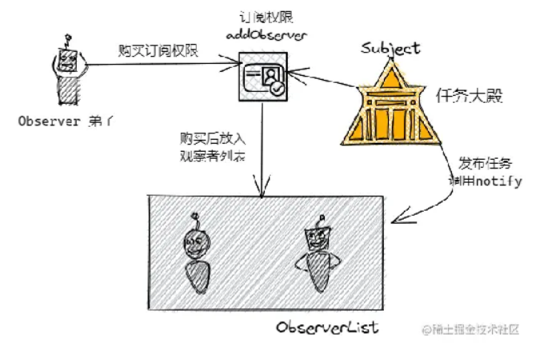
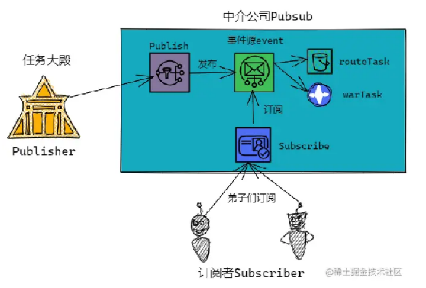
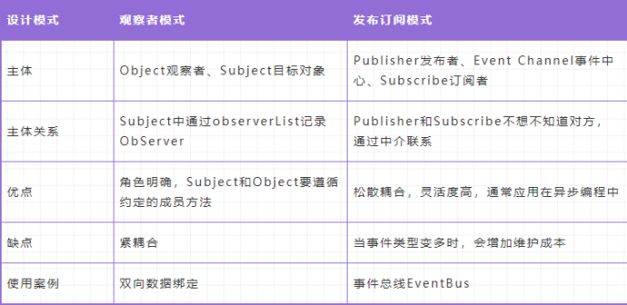

## 第一章、设计思想与原则

SOLID 原则并非单纯的 1 个原则，而是由 5 个设计原则组成的，它们分别是：单一职责原则、开闭原则、里式替换原则、接口隔离原则和依赖反转原则，依次对应 SOLID 中的 S、O、L、I、D 这 5 个英文字母。

### 1.1 SRP 单一职责原则

单一职责原则（Single Responsibility Principle）指一个类或者模块只负责完成一个职责（或者功能）。

每一个类，应该要有明确的定义，不要设计大而全的类，要设计粒度小、功能单一的类。

作用：避免将不相关的代码耦合在一起，提高了类或者模块的内聚性。

### 1.2 OCP 开闭原则

开闭原则（Open Closed Principle）指软件实体（模块、类、方法等）应该 **对扩展开放、对修改关闭**。

添加一个新的功能应该是，在已有代码基础上扩展代码（新增模块、类、方法等），而非修改已有代码（修改模块、类、方法等）。

作用：增加了类的可扩展性。

### 1.3 LSP 里式替换原则

里式替换原则（Liskov Substitution Principle）指子类对象能够替换程序中父类对象出现的任何地方，并且保证原来程序的逻辑行为不变及正确性不被破坏。

### 1.4 LSP 接口隔离原则

接口隔离原则（Interface Segregation Principle）指接口的调用者不应该被强迫依赖它不需要的接口。

这一原则和单一职责原则有点类似，只不过它更侧重于接口。

- 如果把 **接口** 理解为一组接口集合，可以是某个类库的接口等。如果部分接口只被部分调用者使用，我们就需要将这部分接口隔离出来，单独给这部分调用者使用，而不强迫其他调用者也依赖这部分不会被用到的接口。
- 如果把 **接口** 理解为单个 API 接口或函数，部分调用者只需要函数中的部分功能，那我们就需要把函数拆分成粒度更细的多个函数，让调用者只依赖它需要的那个细粒度函数。
- 如果把 **接口** 理解为 OOP 中的接口，也可以理解为面向对象编程语言中的接口语法。那接口的设计要尽量单一，不要让接口的实现类和调用者，依赖不需要的接口函数。

### 1.5 DIP 依赖反转原则

依赖反转原则（Dependency Inversion Principle）指高层模块不要依赖低层模块。高层模块和低层模块应该通过抽象来互相依赖。除此之外，抽象不要依赖具体实现细节，具体实现细节依赖抽象。大白话就是面向接口编程，依赖于抽象而不依赖于具体。

## 第二章、创建型

### 2.1 工厂模式

#### 2.1.1 介绍

工厂模式（Factory Pattern）是一种创建型设计模式，它提供了一种创建对象的方式，而不需要直接调用构造函数。工厂模式通过将对象的创建过程封装在一个工厂类中，从而将对象的创建和使用分离开来。

工厂模式通常由以下几个组件组成：

1. 抽象产品（Product）：定义了产品的接口，是工厂方法所创建对象的父类或接口。
2. 具体产品（Concrete Product）：实现了抽象产品接口的具体类，是工厂方法所创建的对象。
3. 抽象工厂（Factory）：定义了创建产品的接口，其中包含一个工厂方法，用于创建具体产品的对象。
4. 具体工厂（Concrete Factory）：实现了抽象工厂接口的具体类，用于创建具体产品的对象。

#### 2.1.2 代码

```js
// 抽象产品
class Button {
  render() {}
}

// 具体产品
class DefaultButton extends Button {
  render() {
    return '<button class="btn-default">Default Button</button>';
  }
}

class PrimaryButton extends Button {
  render() {
    return '<button class="btn-primary">Primary Button</button>';
  }
}

// 抽象工厂
class ButtonFactory {
  createButton(type) {}
}

// 具体工厂
class DefaultButtonFactory extends ButtonFactory {
  createButton(type) {
    return new DefaultButton();
  }
}

class PrimaryButtonFactory extends ButtonFactory {
  createButton(type) {
    return new PrimaryButton();
  }
}

// 使用工厂模式创建不同类型的按钮
const defaultButtonFactory = new DefaultButtonFactory();
const primaryButtonFactory = new PrimaryButtonFactory();
const defaultButton = defaultButtonFactory.createButton();
const primaryButton = primaryButtonFactory.createButton();
console.log(defaultButton.render()); // 输出：<button class="btn-default">Default Button</button>
console.log(primaryButton.render()); // 输出：<button class="btn-primary">Primary Button</button>
```

#### 2.1.3 实例

1. React.createElement：在 React 中，使用 JSX 语法可以直接声明组件，但是在底层实现中，React 使用了工厂模式来创建组件。React.createElement 函数就是一个工厂方法，它接收组件类型、组件属性和子组件等参数，然后根据这些参数创建一个 React 元素（即虚拟 DOM）。
2. Vue.component：在 Vue 中，使用 Vue.component 函数可以注册全局组件，Vue 会使用工厂模式来创建这些组件的实例。当使用这些组件时，Vue 会根据组件的配置和数据创建一个新的组件实例，并将其挂载到 DOM 中。
3. jQuery：在 jQuery 中，使用 $ 或 jQuery 函数可以创建一个 jQuery 对象，它是一个包含一组 DOM 元素的集合。在底层实现中，jQuery 使用了工厂模式来创建这些对象。
4. Axios.create：在 Axios 中，使用 Axios.create 函数可以创建一个新的 Axios 实例，这个实例包含了一些默认的配置，如 baseURL、headers 等。这个函数就是一个工厂方法，它接收一个配置对象，然后根据这个配置对象创建一个新的 Axios 实例。

### 2.2 单例模式

单例模式是一种创建型模式，它确保一个类只有一个实例，并提供全局访问点。单例模式通常包括一个私有构造函数、一个私有静态变量和一个公共静态方法。

#### 2.2.1 介绍

单例模式（Singleton Pattern）是一种创建型设计模式，它保证一个类只有一个实例，并提供一个全局访问点。单例模式通常用于管理资源、控制访问、缓存数据等场景，在前端开发中也有很多使用场景。

#### 2.2.2 代码

```js
class Singleton {
  static instance = null;

  constructor() {
    if (Singleton.instance) {
      return Singleton.instance;
    }
    Singleton.instance = this;
    // 其他初始化代码
  }

  // 其他方法
}

const instance1 = new Singleton();
const instance2 = new Singleton();
console.log(instance1 === instance2); // 输出：true
```

#### 2.2.3 实例

1. 管理资源：在一些需要频繁创建和销毁资源的场景中，单例模式可以用于管理这些资源，避免频繁的创建和销毁带来的性能损耗。
2. 控制访问：在一些需要限制访问的场景中，单例模式可以用于控制对某个对象的访问次数和访问权限，保证代码的安全性和可靠性。
3. 缓存数据：在一些需要缓存数据的场景中，单例模式可以用于管理缓存，保证缓存的一致性和有效性，提高代码的性能和可用性。
4. 状态管理：在一些需要管理应用程序状态的场景中，单例模式可以用于创建一个全局的状态管理对象，负责管理应用程序的状态和状态变化，从而简化代码逻辑和提高代码可维护性。

常见的前端框架或库中也使用了单例模式来管理一些全局的对象，如 React 中的 ReactDOM、Vue 中的 $router 和 $store、Angular 中的 HttpClient 等。

### 2.3 原型模式

原型模式（Prototype Pattern）是一种创建型设计模式，它通过复制已有对象来创建新的对象，而不是使用传统的构造函数方式。原型模式可以大大简化对象的创建过程，提高代码的可扩展性和可复用性。

#### 2.3.1 介绍

clone一个自己，生成一个新对象

#### 2.3.2 代码

```js
class Prototype {
  constructor() {
    this.name = "prototype";
  }

  clone() {
    return Object.create(this);
  }
}

const prototype = new Prototype();
const clone = prototype.clone();

console.log(clone.name); // 输出：prototype
```

#### 2.3.3 实例

在前端框架或库设计中，原型模式可以用于以下场景：

1. 组件复用：在一些需要复用组件的场景中，原型模式可以用于复制已有组件，从而创建新的组件实例，避免重复编写代码。
2. 数据共享：在一些需要共享数据的场景中，原型模式可以用于复制已有数据对象，从而创建新的数据对象实例，避免多个对象之间相互影响。
3. 数据库操作：在一些需要进行数据库操作的场景中，原型模式可以用于复制已有的数据库连接对象，从而创建新的连接实例，提高代码的性能和可用性。

常见的前端框架或库中也使用了原型模式来实现对象的复制，如 React 中的 ReactElement、Vue 中的组件实例等。

## 第三章、结构型

### 3.1 适配器模式

适配器模式（Adapter Pattern）是一种结构型设计模式，它可以将一个类的接口转换成客户端所期望的另一个接口。适配器模式可以解决不兼容接口之间的问题，提高代码的可维护性和可复用性。

适配器模式由三个主要组件组成：

1. 目标接口（Target Interface）：客户端期望使用的接口，它定义了客户端需要的方法和属性。
2. 适配器（Adapter）：实现目标接口，并包含一个对被适配对象的引用，它将客户端发出的请求转换成对被适配对象的相应调用。
3. 被适配对象（Adaptee）：需要被适配的对象，它包含了客户端需要的方法和属性，但其接口与目标接口不兼容。

#### 3.1.1 介绍

- 旧接口格式和使用者不兼容
- 中间加一个适配转换接口

#### 3.1.2 代码

```js
class Adaptee {
  specificRequest() {
    return "特殊请求";
  }
}

class Adapter {
  constructor(adaptee) {
    this.adaptee = adaptee;
  }
  
  request() {
    return `适配器转换后的请求：${this.adaptee.specificRequest()}`;
  }
}

const adaptee = new Adaptee();
const adapter = new Adapter(adaptee);
console.log(adapter.request()); // 输出：适配器转换后的请求：特殊请求
```

#### 3.1.3 实例

在前端框架或库设计中，适配器模式可以用于以下场景：

1. 兼容性处理：在一些需要处理浏览器兼容性的场景中，适配器模式可以用于将不兼容的接口转换为兼容的接口，从而保证代码在不同浏览器中的兼容性。
2. 数据格式转换：在一些需要进行数据格式转换的场景中，适配器模式可以用于将不同格式的数据转换为统一的格式，从而便于数据的处理和管理。
3. 接口统一：在一些需要统一接口的场景中，适配器模式可以用于将不同的接口转换为统一的接口，从而便于代码的管理和维护。

常见的前端框架或库中也使用了适配器模式来处理不兼容接口或数据格式的问题，如 React 中的 ReactDOM、Vue 中的 Vuex 等。

### 3.2 装饰器模式

#### 3.2.1 介绍

装饰器模式（Decorator Pattern）是一种结构型设计模式，它可以动态地给对象添加新的功能，同时又不改变其原有的结构和功能。装饰器模式可以通过对象组合的方式实现功能的扩展，从而提高代码的可扩展性和可维护性。

#### 3.2.2 代码

```js
class Component {
  operation() {
    return "基础功能";
  }
}

class Decorator {
  constructor(component) {
    this.component = component;
  }

  operation() {
    return `${this.component.operation()} + 装饰器添加的功能`;
  }
}

const component = new Component();
const decorator = new Decorator(component);
console.log(decorator.operation()); // 输出：基础功能 + 装饰器添加的功能
```

#### 3.2.3 实例

在前端框架或库设计中，装饰器模式可以用于以下场景：

1. 功能扩展：在一些需要动态添加功能的场景中，装饰器模式可以用于给对象添加新的功能，从而实现功能的扩展和定制。
2. 性能优化：在一些需要优化性能的场景中，装饰器模式可以用于缓存数据、优化计算等操作，从而提高代码的性能和可用性。
3. 行为统计：在一些需要统计行为的场景中，装饰器模式可以用于记录用户行为、分析数据等操作，从而提高产品的质量和用户体验。

常见的前端框架或库中也使用了装饰器模式来实现功能的扩展，如 React 中的 Higher-Order Components（HOC）、Vue 中的 Mixins 和指令等。

### 3.3 代理模式

#### 3.3.1 介绍

代理模式（Proxy Pattern）是一种结构型设计模式，它可以控制对对象的访问，并且在访问对象时提供了一些额外的处理逻辑。代理模式可以在不改变对象的前提下，对其进行控制和增强。

#### 3.3.2 代码

```js
class Subject {
  request() {
    return "处理请求";
  }
}

class Proxy {
  constructor(subject) {
    this.subject = subject;
  }

  request() {
    if (this.checkAccess()) {
      return this.subject.request();
    } else {
      return "拒绝访问";
    }
  }

  checkAccess() {
    return true;
  }
}

const subject = new Subject();
const proxy = new Proxy(subject);
console.log(proxy.request()); // 输出：处理请求
```

#### 3.3.3 实例

在前端框架或库设计中，代理模式可以用于以下场景：

1. 访问控制：在一些需要对对象进行访问控制的场景中，代理模式可以用于控制对对象的访问，从而保护数据的安全性。
2. 性能优化：在一些需要优化性能的场景中，代理模式可以用于缓存数据、延迟加载等操作，从而提高代码的性能和可用性。
3. 事件处理：在一些需要处理事件的场景中，代理模式可以用于代理事件的处理，从而实现事件的委托和分发。

常见的前端框架或库中也使用了代理模式来实现对对象的访问控制或性能优化，如 React 中的 shouldComponentUpdate 生命周期钩子、Vue 中的计算属性和监听器等。

### 3.4 外观模式

#### 3.4.1 介绍

外观模式（Facade Pattern）是一种结构型设计模式，它提供了一个简单的接口，用于访问复杂系统中的一组接口。外观模式可以隐藏系统的复杂性，提高代码的可维护性和可复用性。

#### 3.4.2 代码

```js
class Subsystem1 {
  operation1() {
    return "子系统1的操作";
  }
}

class Subsystem2 {
  operation2() {
    return "子系统2的操作";
  }
}

class Facade {
  constructor() {
    this.subsystem1 = new Subsystem1();
    this.subsystem2 = new Subsystem2();
  }

  operation() {
    let result = "";
    result += this.subsystem1.operation1();
    result += this.subsystem2.operation2();
    return result;
  }
}

const facade = new Facade();
console.log(facade.operation()); // 输出：子系统1的操作子系统2的操作
```

#### 3.4.3 实例

在前端框架或库设计中，外观模式可以用于以下场景：

1. 接口封装：在一些需要封装一组接口的场景中，外观模式可以用于封装接口，并提供简单的接口，从而隐藏系统的复杂性。
2. 代码解耦：在一些需要解耦代码的场景中，外观模式可以用于将不同模块的接口封装在一个外观对象中，从而降低模块之间的耦合度。
3. 适配器：在一些需要进行接口适配的场景中，外观模式可以用于适配不同接口的实现，从而提高代码的可复用性和可维护性。

常见的前端框架或库中也使用了外观模式来封装一组接口或解耦代码，如 React 中的组件、Vue 中的插件和指令等。

### 3.5 桥接模式

#### 3.5.1 介绍

桥接模式（Bridge Pattern）是一种结构型设计模式，它将抽象部分和实现部分分离，从而使它们可以独立变化。桥接模式可以提高代码的可扩展性和可维护性。

#### 3.5.2 代码

```js
class Implementor {
  operation() {
    return "实现部分的操作";
  }
}

class Abstraction {
  constructor(impl) {
    this.impl = impl;
  }

  operation() {
    return `抽象部分的操作，${this.impl.operation()}`;
  }
}

const implementor = new Implementor();
const abstraction = new Abstraction(implementor);
console.log(abstraction.operation()); // 输出：抽象部分的操作，实现部分的操作
```

#### 3.5.3 实例

在前端框架或库设计中，桥接模式可以用于以下场景：

1. 抽象部分和实现部分的分离：在一些需要将抽象部分和实现部分分离的场景中，桥接模式可以用于实现抽象部分和实现部分的独立变化。
2. 可扩展性和可维护性：在一些需要提高代码的可扩展性和可维护性的场景中，桥接模式可以用于将抽象部分和实现部分解耦，从而降低代码的耦合度和复杂度。
3. 多维度变化：在一些需要同时支持多维度变化的场景中，桥接模式可以用于组合多个维度的实现，从而实现不同组合的功能。

常见的前端框架或库中也使用了桥接模式来分离抽象部分和实现部分，如 React 中的组件、Vue 中的指令等。

### 3.6 组合模式

#### 3.6.1 介绍

组合模式（Composite Pattern）是一种结构型设计模式，它允许你将对象组合成树形结构来表示“部分-整体”的层次结构，从而使客户端可以统一地对待单个对象和组合对象。组合模式可以提高代码的可扩展性和可维护性。

#### 3.6.2 代码

```js
class Component {
  constructor(name) {
    this.name = name;
  }

  add(component) {}
  remove(component) {}
  getChild(index) {}
  operation() {}
}

class Leaf extends Component {
  operation() {
    return `Leaf(${this.name})的操作`;
  }
}

class Composite extends Component {
  constructor(name) {
    super(name);
    this.children = [];
  }

  add(component) {
    this.children.push(component);
  }

  remove(component) {
    const index = this.children.indexOf(component);
    if (index !== -1) {
      this.children.splice(index, 1);
    }
  }

  getChild(index) {
    return this.children[index];
  }

  operation() {
    let result = `Composite(${this.name})的操作，包含：\n`;
    for (const child of this.children) {
      result += child.operation() + "\n";
    }
    return result;
  }
}

const leaf1 = new Leaf("leaf1");
const leaf2 = new Leaf("leaf2");
const composite1 = new Composite("composite1");
composite1.add(leaf1);
composite1.add(leaf2);
console.log(composite1.operation()); // 输出：Composite(composite1)的操作，包含：\nLeaf(leaf1)的操作\nLeaf(leaf2)的操作\n
```

#### 3.6.3 实例

在前端框架或库设计中，组合模式可以用于以下场景：

1. 树形结构：在一些需要表示树形结构的场景中，组合模式可以用于表示“部分-整体”的层次结构，从而提高代码的可维护性和可扩展性。
2. 组件化开发：在一些需要将 UI 组件拆分成可复用的子组件的场景中，组合模式可以用于实现组件的继承和组合，从而提高代码的可复用性和可维护性。
3. 嵌套数据结构：在一些需要处理嵌套数据结构的场景中，组合模式可以用于将嵌套数据结构转换成树形结构，从而便于处理和操作。

常见的前端框架或库中也使用了组合模式来表示树形结构或实现组件化开发，如 React 中的组件、Vue 中的组件等。

### 3.7 享元模式

#### 3.7.1 介绍

享元模式（Flyweight Pattern）是一种结构型设计模式，它通过共享对象来减少内存和计算资源的使用。享元模式可以提高代码的性能和可扩展性。

#### 3.7.2 代码

```js
class Flyweight {
  constructor(sharedState) {
    this.sharedState = sharedState;
  }

  operation(uniqueState) {
    const result = `共享状态为${this.sharedState}，唯一状态为${uniqueState}的操作`;
    console.log(result);
  }
}

class FlyweightFactory {
  constructor() {
    this.flyweights = {};
  }

  getFlyweight(sharedState) {
    if (!this.flyweights[sharedState]) {
      this.flyweights[sharedState] = new Flyweight(sharedState);
    }
    return this.flyweights[sharedState];
  }
}

const factory = new FlyweightFactory();
const flyweight1 = factory.getFlyweight("state1");
const flyweight2 = factory.getFlyweight("state1");
console.log(flyweight1 === flyweight2); // 输出：true
flyweight1.operation("uniqueState1"); // 输出：共享状态为state1，唯一状态为uniqueState1的操作
flyweight2.operation("uniqueState2"); // 输出：共享状态为state1，唯一状态为uniqueState2的操作
```

#### 3.7.3 实例

在前端框架或库设计中，享元模式可以用于以下场景：

1. 大量相似对象的创建：在一些需要创建大量相似对象的场景中，享元模式可以用于共享对象，减少内存的使用和提高代码的性能。
2. 状态的共享和管理：在一些需要共享和管理状态的场景中，享元模式可以用于维护共享状态的对象池，并提供一个统一的接口来访问共享状态。
3. 数据缓存：在一些需要缓存数据的场景中，享元模式可以用于缓存数据，提高数据的访问速度和减少网络请求。

常见的前端框架或库中也使用了享元模式来共享对象和状态，如 React 中的虚拟 DOM、Vue 中的组件等。

## 第四章、行为型

### 4.1 策略模式

#### 4.1.1 介绍

策略模式（Strategy Pattern）是一种行为型设计模式，它定义了一系列算法，并将每个算法封装起来，使它们可以相互替换。策略模式可以提高代码的灵活性和可扩展性。

#### 4.1.2 代码

```js
class Context {
  constructor(strategy) {
    this.strategy = strategy;
  }

  setStrategy(strategy) {
    this.strategy = strategy;
  }

  executeStrategy(data) {
    return this.strategy(data);
  }
}

const strategy1 = data => {
  return `对${data}执行策略1的操作`;
};

const strategy2 = data => {
  return `对${data}执行策略2的操作`;
};

const context = new Context(strategy1);
console.log(context.executeStrategy("data1")); // 输出：对data1执行策略1的操作
context.setStrategy(strategy2);
console.log(context.executeStrategy("data2")); // 输出：对data2执行策略2的操作
```

#### 4.1.3 实例

在前端框架或库设计中，策略模式可以用于以下场景：

1. 算法的封装和替换：在一些需要封装和替换算法的场景中，策略模式可以用于将算法封装成不同的策略对象，并提供一个统一的接口来访问策略对象。
2. 表单验证：在一些需要对表单进行验证的场景中，策略模式可以用于将不同的验证算法封装成不同的策略对象，并根据用户的输入动态选择合适的验证策略。
3. 数据处理：在一些需要对数据进行处理的场景中，策略模式可以用于将不同的数据处理算法封装成不同的策略对象，并根据数据的特点动态选择合适的处理策略。

常见的前端框架或库中也使用了策略模式来封装和替换算法，如 Redux 中的 reducer、Vue 中的计算属性等。

### 4.2 模板方法模式

#### 4.2.1 介绍

模板方法模式（Template Method Pattern）是一种行为型设计模式，它定义了一个算法的骨架，并允许子类为一个或多个步骤提供实现。模板方法模式可以提高代码的复用性和可维护性。

#### 4.2.2 代码

```js
class AbstractClass {
  templateMethod() {
    this.operation1();
    this.operation2();
    this.hook1();
    this.operation3();
    this.hook2();
  }

  operation1() {
    console.log("执行操作1");
  }

  operation2() {
    console.log("执行操作2");
  }

  operation3() {
    console.log("执行操作3");
  }

  hook1() {}

  hook2() {}
}

class ConcreteClass extends AbstractClass {
  hook1() {
    console.log("执行钩子方法1");
  }

  hook2() {
    console.log("执行钩子方法2");
  }
}

const concreteClass = new ConcreteClass();
concreteClass.templateMethod();
```

#### 4.2.3 实例

在前端框架或库设计中，模板方法模式可以用于以下场景：

1. 算法的骨架和扩展点：在一些需要定义算法骨架和扩展点的场景中，模板方法模式可以用于定义一个模板方法和若干个操作方法和钩子方法，并允许子类为一个或多个步骤提供实现。
2. 生命周期管理：在一些需要管理组件或页面生命周期的场景中，模板方法模式可以用于定义一个生命周期管理模板方法和若干个生命周期钩子方法，并允许子类为一个或多个生命周期钩子方法提供实现。
3. 流程控制：在一些需要控制代码流程的场景中，模板方法模式可以用于定义一个流程控制模板方法和若干个流程控制钩子方法，并允许子类为一个或多个流程控制钩子方法提供实现。

### 4.3 观察者模式与发布订阅模式

#### 4.3.1 介绍

- 发布&订阅
- 一对多

#### 4.3.2 观察者模式



   当对象存在一对多的关系，其中一个对象的状态发生改变，所有依赖他的对象都会收到通知。

1. 在观察者模式中，只有两个主体：目标主体（object）和观察者（observer）。

2. 目标对象：

3. 1. 维护观察者列表
   2. 定义添加观察者的方法
   3. 当自身发生变化后，通过调用自己的notify方法依次通知每个观察者执行update方法。

4. 观察者需要实现update方法，供目标对象调用。

```js
class Observer {
    constructor(name){
        this.name = name
    }

    update(task){
        console.log(task);
    }
}
class Subject {
    constructor(){
        this.observerList = []
    }
    addObserver(observer){
        this.observerList.push(observer)
    }
    notify(task){
        this.observerList.forEach(observer=>observer.update(task))
    }
}
```

#### 4.3.3 发布订阅模式



1. 基于一个事件通道，希望接受通知的对象Subscriber通过自定义事件订阅主题，被激活事件的对象Publisher通过发布主题事件的方式通知各个订阅该主题的Subscriber对象。

2. 发布订阅模式包含：发布者Publisher，事件调度中心Event Channel，订阅者Subscriber。

3. 1. 发布者：发布任务

   2. 事件调度中心：

   3. 1. 维护任务类型，以及每种任务下的订阅情况。
      2. 给订阅者提供订阅功能。
      3. 当发布者发布任务之后，事件调度中心给订阅者发布任务。

   4. 订阅者：任务接受。

```js
lass PubSub {
    constructor(){
        this.events = {}
    }

    // 订阅方法
    subscribe(type,cb){
        if(!this.events[type]){
            
            this.events[type] = []
        }
        this.events[type].push(cb)
    }
    // 发布方法
    publish(type,...args){
        this.events[type] && this.events[type].forEach(cb=>cb(...args))
    }
    // 取消订阅方法
    unsubscribe(type,cb){
        if(this.events[type]){
            const cbIndex = this.events[type].findIndex(fn=>fn===cb);
            if(cbIndex > -1){
                this.events[type].splice(cbIndex,1)
            }
            if(this.events[type].length === 0){
                delete this.events[type]
            }
        }
    }
    unsubscribeAll(type){
        if(this.events[type]){
            delete this.events[type]
        }
    }
}
```

#### 4.3.4 场景

- 网页事件绑定
- Promise
- nodejs自定义事件
- vue

#### 4.3.5 对比



### 4.4 迭代器模式

#### 4.4.1 介绍

迭代器模式（Iterator Pattern）是一种行为型设计模式，它提供一种方法顺序访问一个聚合对象中的各个元素，而不用暴露该对象的内部表示。迭代器模式可以让我们在不暴露聚合对象内部结构的情况下，按照一定的顺序遍历聚合对象中的元素。

#### 4.4.2 代码

```js
class Iterator {
  constructor(items) {
    this.items = items;
    this.index = 0;
  }

  hasNext() {
    return this.index < this.items.length;
  }

  next() {
    return this.hasNext() ? this.items[this.index++] : undefined;
  }
}

class Iterable {
  constructor(items) {
    this.items = items;
  }

  [Symbol.iterator]() {
    return new Iterator(this.items);
  }
}

const iterable = new Iterable([1, 2, 3]);
for (const item of iterable) {
  console.log(item); // 输出：1，2，3
}
```

#### 4.4.3 实例

1. 从而实现数据的顺序访问。
2. 异步操作：在一些需要处理异步操作的场景中，迭代器模式可以用于将异步操作作为迭代器对象，将回调函数作为迭代器对象的方法，从而实现异步操作的顺序执行。
3. 状态管理：在一些需要管理应用状态的场景中，迭代器模式可以用于将应用状态作为可迭代对象，将状态变更函数作为迭代器对象的方法，从而实现状态的顺序更新。

常见的前端框架或库中也使用了迭代器模式来处理数据遍历、异步操作、状态管理等问题，如 jQuery 中的 each 方法、Vue 中的 v-for 指令等。

### 4.5 职责连模式

#### 4.5.1 介绍

职责链模式（Chain of Responsibility Pattern）是一种行为型设计模式，它将请求的发送者和接收者解耦，使多个对象都有机会处理这个请求。将这些对象连成一条链，并沿着这条链传递请求，直到有一个对象处理它为止。职责链模式可以让我们在不显式指定接收者的情况下，将请求从一个对象传递到另一个对象，从而实现请求的动态处理。

#### 4.5.2 代码

```js
class Handler {
  constructor(name, nextHandler) {
    this.name = name;
    this.nextHandler = nextHandler;
  }

  handle(request) {
    if (this.canHandle(request)) {
      this.onHandle(request);
    } else if (this.nextHandler) {
      this.nextHandler.handle(request);
    } else {
      console.log(`无法处理请求：${request}`);
    }
  }

  canHandle(request) {
    return false;
  }

  onHandle(request) {
    console.log(`${this.name} 处理请求：${request}`);
  }
}

class ConcreteHandlerA extends Handler {
  canHandle(request) {
    return request === "A";
  }

  onHandle(request) {
    super.onHandle(request);
  }
}

class ConcreteHandlerB extends Handler {
  canHandle(request) {
    return request === "B";
  }

  onHandle(request) {
    super.onHandle(request);
  }
}

class ConcreteHandlerC extends Handler {
  canHandle(request) {
    return request === "C";
  }

  onHandle(request) {
    super.onHandle(request);
  }
}

const handler1 = new ConcreteHandlerA("Handler A", null);
const handler2 = new ConcreteHandlerB("Handler B", handler1);
const handler3 = new ConcreteHandlerC("Handler C", handler2);
handler3.handle("A"); // 输出："Handler A 处理请求：A"
handler3.handle("B"); // 输出："Handler B 处理请求：B"
handler3.handle("C"); // 输出："Handler C 处理请求：C"
handler3.handle("D"); // 输出："无法处理请求：D"
```

#### 4.5.3 实例

在前端框架或库设计中，职责链模式可以用于以下场景：

1. 事件处理：在一些需要处理用户交互事件的场景中，职责链模式可以用于将事件对象作为请求，将事件处理函数作为责任对象，从而实现事件的动态处理。
2. 异常处理：在一些需要处理异常情况的场景中，职责链模式可以用于将异常对象作为请求，将异常处理函数作为责任对象，从而实现异常的动态处理。
3. 数据验证：在一些需要验证用户输入数据的场景中，职责链模式可以用于将数据对象作为请求，将验证函数作为责任对象，从而实现数据的动态验证。

常见的前端框架或库中也使用了职责链模式来处理事件处理、异常处理、数据验证等问题，如 React 中的事件系统、Express 中的错误处理中间件等。

### 4.6 命令模式

#### 4.6.1 介绍

命令模式（Command Pattern）是一种行为型设计模式，它将请求封装成对象，从而让我们可以用不同的请求来参数化其他对象。命令模式可以将请求的发送者和接收者解耦，从而实现请求的发送者和接收者之间的松耦合。

#### 4.6.2 代码

```js
class Command {
  execute() {}
}

class ConcreteCommandA extends Command {
  constructor(receiver) {
    super();
    this.receiver = receiver;
  }

  execute() {
    this.receiver.actionA();
  }
}

class ConcreteCommandB extends Command {
  constructor(receiver) {
    super();
    this.receiver = receiver;
  }

  execute() {
    this.receiver.actionB();
  }
}

class Receiver {
  actionA() {
    console.log("执行操作 A");
  }

  actionB() {
    console.log("执行操作 B");
  }
}

class Invoker {
  constructor(command) {
    this.command = command;
  }

  setCommand(command) {
    this.command = command;
  }

  executeCommand() {
    this.command.execute();
  }
}

const receiver = new Receiver();
const commandA = new ConcreteCommandA(receiver);
const commandB = new ConcreteCommandB(receiver);
const invoker = new Invoker(commandA);
invoker.executeCommand(); // 输出："执行操作 A"
invoker.setCommand(commandB);
invoker.executeCommand(); // 输出："执行操作 B"
```

#### 5.6.3 实例

在前端框架或库设计中，命令模式可以用于以下场景：

1. UI 操作：在一些需要处理用户界面操作的场景中，命令模式可以用于将用户界面事件作为命令对象，将事件处理函数作为命令接收者，从而实现用户界面操作的封装和动态执行。
2. 撤销操作：在一些需要支持撤销操作的场景中，命令模式可以用于将操作记录作为命令对象，将操作撤销函数和重做函数作为命令接收者，从而实现操作的撤销和重做。
3. 异步操作：在一些需要处理异步操作的场景中，命令模式可以用于将异步操作作为命令对象，将回调函数作为命令接收者，从而实现异步操作的封装和动态执行。

常见的前端框架或库中也使用了命令模式来处理 UI 操作、撤销操作、异步操作等问题，如 React 中的状态管理、Redux 中的 action 和 reducer 等。

### 4.7 备忘录模式

#### 4.7.1 介绍

备忘录模式（Memento Pattern）是一种行为型设计模式，它可以在不破坏封装性的前提下，捕获一个对象的内部状态，并在该对象之外保存这个状态，从而可以在需要时将该对象恢复到先前的状态。备忘录模式可以用于实现撤销操作、事务回滚等功能。

#### 4.7.2 代码

```js
class Memento {
  constructor(state) {
    this.state = state;
  }

  getState() {
    return this.state;
  }
}

class Originator {
  constructor(state) {
    this.state = state;
  }

  getState() {
    return this.state;
  }

  setState(state) {
    this.state = state;
  }

  saveStateToMemento() {
    return new Memento(this.state);
  }

  getStateFromMemento(memento) {
    this.state = memento.getState();
  }
}

class Caretaker {
  constructor() {
    this.mementoList = [];
  }

  addMemento(memento) {
    this.mementoList.push(memento);
  }

  getMemento(index) {
    return this.mementoList[index];
  }
}

const originator = new Originator("State 1");
const caretaker = new Caretaker();
caretaker.addMemento(originator.saveStateToMemento());
originator.setState("State 2");
caretaker.addMemento(originator.saveStateToMemento());
originator.setState("State 3");
caretaker.addMemento(originator.saveStateToMemento());
console.log(originator.getState()); // 输出："State 3"
originator.getStateFromMemento(caretaker.getMemento(1));
console.log(originator.getState()); // 输出："State 2"
originator.getStateFromMemento(caretaker.getMemento(0));
console.log(originator.getState()); // 输出："State 1"
```

#### 4.7.3 实例

在前端框架或库设计中，备忘录模式可以用于以下场景：

1. 撤销操作：在一些需要支持撤销操作的场景中，备忘录模式可以用于将对象状态保存到备忘录中，从而在需要时将对象恢复到先前的状态。
2. 浏览器历史记录：在一些需要支持浏览器历史记录的单页应用中，备忘录模式可以用于将网页状态保存到备忘录中，从而在用户进行前进和后退操作时，可以恢复网页的先前状态。
3. 表单数据恢复：在一些需要支持表单数据恢复的场景中，备忘录模式可以用于将表单数据保存到备忘录中，从而在用户进行撤销或恢复操作时，可以恢复表单的先前状态。

常见的前端框架或库中也使用了备忘录模式来处理撤销操作、浏览器历史记录、表单数据恢复等问题，如 Redux 中的历史记录、Vue.js 中的数据恢复等。

### 4.8 状态模式

#### 4.8.1 介绍

#### 4.8.2 代码

#### 4.8.3 实例

### 4.9 访问者模式

#### 4.9.1 介绍

状态模式（State Pattern）是一种行为型设计模式，它允许对象在其内部状态发生改变时改变其行为，从而将状态的变化和行为的变化解耦。状态模式可以让程序更加灵活地处理对象的状态变化，并且可以避免使用大量的 if-else 语句。

#### 4.9.2 代码

```js
class State {
  handle(context) {}
}

class ConcreteStateA extends State {
  handle(context) {
    console.log("处理状态 A");
    context.setState(new ConcreteStateB());
  }
}

class ConcreteStateB extends State {
  handle(context) {
    console.log("处理状态 B");
    context.setState(new ConcreteStateA());
  }
}

class Context {
  constructor(state) {
    this.state = state;
  }

  setState(state) {
    this.state = state;
  }

  request() {
    this.state.handle(this);
  }
}

const context = new Context(new ConcreteStateA());
context.request(); // 输出："处理状态 A"
context.request(); // 输出："处理状态 B"
context.request(); // 输出："处理状态 A"
```

#### 4.9.3 实例

在前端框架或库设计中，状态模式可以用于以下场景：

1. 表单验证：在一些需要处理表单验证的场景中，状态模式可以用于将表单状态作为状态对象，将表单验证函数作为状态处理函数，从而实现表单验证的封装和动态执行。
2. 状态机：在一些需要处理状态机的场景中，状态模式可以用于将状态机状态作为状态对象，将状态机状态转移函数作为状态处理函数，从而实现状态机的封装和动态执行。
3. 游戏开发：在一些需要处理游戏状态的场景中，状态模式可以用于将游戏状态作为状态对象，将游戏状态处理函数作为状态处理函数，从而实现游戏状态的封装和动态执行。

常见的前端框架或库中也使用了状态模式来处理表单验证、状态机、游戏开发等问题，如 Vue.js 中的表单验证、React 中的状态管理等。

### 4.10 中介者模式

#### 4.10.1 介绍

中介者模式（Mediator Pattern）是一种行为型设计模式，它可以让对象之间的通信通过中介者来进行，从而将对象之间的耦合度降低到最低。中介者模式可以使得系统更加灵活、扩展性更好，并且可以避免使用大量的 if-else 语句。

#### 4.10.2 代码

```js
class Mediator {
  constructor() {
    this.colleagueList = [];
  }

  addColleague(colleague) {
    this.colleagueList.push(colleague);
  }

  send(message, sender) {
    this.colleagueList.forEach((colleague) => {
      if (colleague !== sender) {
        colleague.receive(message);
      }
    });
  }
}

class Colleague {
  constructor(mediator) {
    this.mediator = mediator;
  }

  send(message) {
    this.mediator.send(message, this);
  }

  receive(message) {
    console.log(`${this.constructor.name} received message: ${message}`);
  }
}

class ConcreteColleague1 extends Colleague {}
class ConcreteColleague2 extends Colleague {}

const mediator = new Mediator();
const colleague1 = new ConcreteColleague1(mediator);
const colleague2 = new ConcreteColleague2(mediator);
mediator.addColleague(colleague1);
mediator.addColleague(colleague2);
colleague1.send("Hello, Colleague2!"); // 输出："ConcreteColleague2 received message: Hello, Colleague2!"
colleague2.send("Hi, Colleague1!"); // 输出："ConcreteColleague1 received message: Hi, Colleague1!"
```

#### 4.10.3 实例

在前端框架或库设计中，中介者模式可以用于以下场景：

1. 组件通信：在一些需要进行组件通信的场景中，中介者模式可以用于将组件之间通信的逻辑抽象为中介者对象，从而避免组件之间的直接耦合。
2. 消息通知：在一些需要进行消息通知的场景中，中介者模式可以用于将消息的发送和接收逻辑抽象为中介者对象，从而实现消息的统一管理和处理。
3. 数据同步：在一些需要进行数据同步的场景中，中介者模式可以用于将数据同步的逻辑抽象为中介者对象，从而实现数据的统一管理和处理。

常见的前端框架或库中也使用了中介者模式来处理组件通信、消息通知、数据同步等问题，如 Angular 中的服务、React 中的上下文等。

### 4.11 解释者模式

#### 4.11.1 介绍

解释者模式（Interpreter Pattern）是一种行为型设计模式，它可以用于定义语言的语法规则，并用一种解释器来解释这些语法规则，从而实现对语言的解析和执行。解释器模式可以使得系统更加灵活、扩展性更好，并且可以避免使用大量的 if-else 语句。

#### 4.11.2 代码

```js
class Expression {
  interpret(context) {}
}

class TerminalExpression extends Expression {
  constructor(data) {
    super();
    this.data = data;
  }

  interpret(context) {
    if (context.indexOf(this.data) !== -1) {
      return true;
    }
    return false;
  }
}

class OrExpression extends Expression {
  constructor(expr1, expr2) {
    super();
    this.expr1 = expr1;
    this.expr2 = expr2;
  }

  interpret(context) {
    return this.expr1.interpret(context) || this.expr2.interpret(context);
  }
}

class AndExpression extends Expression {
  constructor(expr1, expr2) {
    super();
    this.expr1 = expr1;
    this.expr2 = expr2;
  }

  interpret(context) {
    return this.expr1.interpret(context) && this.expr2.interpret(context);
  }
}

const context = "Hello, World!";
const expr1 = new TerminalExpression("Hello");
const expr2 = new TerminalExpression("World");
const expr3 = new OrExpression(expr1, expr2);
const expr4 = new AndExpression(expr1, expr2);

console.log(expr1.interpret(context)); // 输出：true
console.log(expr2.interpret(context)); // 输出：true
console.log(expr3.interpret(context)); // 输出：true
console.log(expr4.interpret(context)); // 输出：false
```

#### 4.11.3 实例

在前端框架或库设计中，解释器模式可以用于以下场景：

1. 模板引擎：在一些需要实现模板引擎的场景中，解释器模式可以用于将模板语法规则抽象为表达式对象，并用一种解释器来解释这些表达式，从而实现模板渲染功能。
2. 正则表达式：在一些需要处理正则表达式的场景中，解释器模式可以用于将正则表达式语法规则抽象为表达式对象，并用一种解释器来解释这些表达式，从而实现正则表达式匹配功能。

常见的前端框架或库中也使用了解释器模式来处理模板引擎、正则表达式等问题，如 Vue.js 中的模板引擎、JavaScript 内置的正则表达式等。