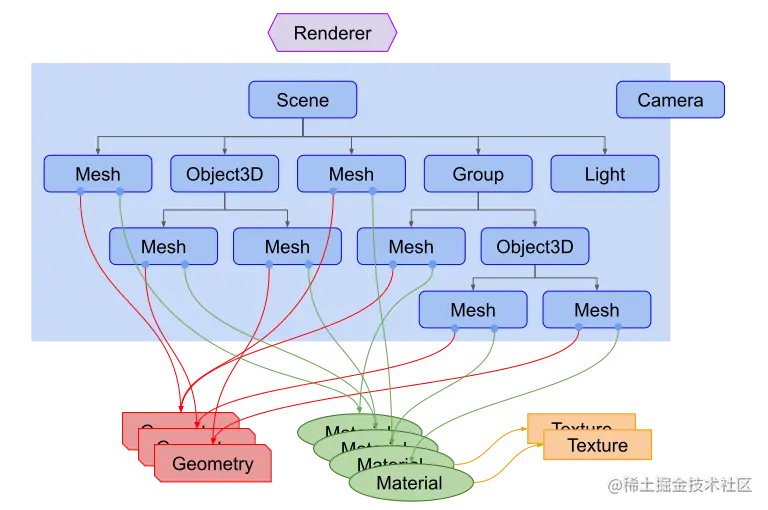
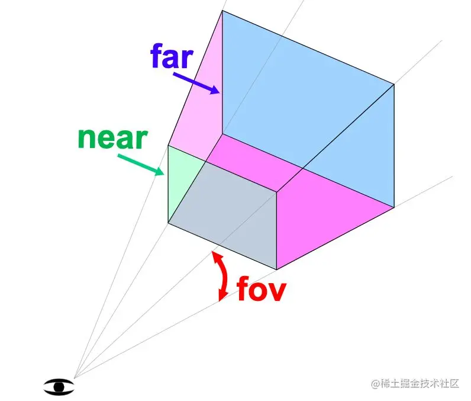
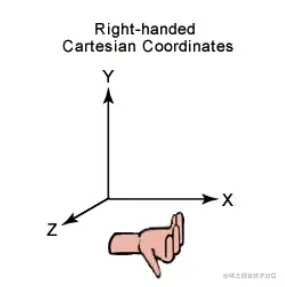

## 1. 入门



### 1.1 渲染器（renderer）

它是 Three.js 的主要对象，场景(Scene)和摄像机(Camera)都需要传入渲染器(Renderer)中，通过它将摄像机视椎体中的三维场景渲染成一个二维图片显示在画布上。

### 1.2 场景(scene)

它就相当于一个大容器，我们需要展示的所有物体都要放入场景。如上图所示当把其对象放入场景后形成树状结构，就组合成场景图。在场景图中子对象的位置和方向总是相对于父对象而言的，比如我移动了父对象的位置，子对象也会一起移动。

### 1.3 相机(camera)

它与其他对象不同的是，它不一定要在场景图中才能起作用，它可以和场景同级。相同的是，摄像机(Camera)作为其他对象的子对象，同样会继承它父对象的位置和朝向。Three.js 内置几种摄像机：

- PerspectiveCamera 透视相机，这一投影模式被用来模拟人眼所看到的景象，它是 3D 场景的渲染中使用得最普遍的投影模式。

- CubeCamera 立方相机，这一投影模式显示的景象是在一个立方范围内的。
- OrthographicCamera 正交相机，在这种投影模式下，无论物体距离相机距离远或者近，在最终渲染的图片中物体的大小都保持不变。

### 1.4 几何体（Geometry）

就是球体、立方体、平面、狗、猫、人、树、建筑等物体的顶点信息。Three.js 内置了许多基本几何体:

- `CubeGeometry` 立方体
- `PlaneGeometry` 平面
- `SphereGeometry` 球体
- `CylinderGeometry` 圆柱体
- `TorusGeometry` 圆环面
- `TubeGeometry` 管道缓冲几何体

### 1.5 材质（Material）

和`几何体`同时使用，表示几何体不同面的颜色，和光亮程度。`Three.js`内置了许多材质:

- `MeshBasicMaterial` 基础网格材质，不受光照的影响。
- `MeshDistanceMaterial` 通过点光源实现阴影的材质。
- `MeshNormalMaterial` 一种把法向量映射到 RGB 颜色的材质。

### 1.6 纹理（Texture）

创建一个纹理贴图，将其应用到一个表面，或者作为反射/折射贴图。可以多个纹理同时在一个材质上使用。

### 1.7 网格（Mesh）

需要传入几何体和材质组合为一个带有位置和方向的特殊几何体。

### 1.8 光源（Light）

和`材质`配合使用，通过不同的光源来修改颜色，添加阴影等。

- `AmbientLight` 环境光，会均匀的照亮场景中的所有物体。
- `DirectionalLight` 平行光，是沿着特定方向发射的光。
- `HemisphereLight` 半球光，光源直接放置于场景之上，光照颜色从天空光线颜色渐变到地面光线颜色。不可以投射阴影。
- `PointLight` 点光源，从一个点向各个方向发射的光源。可以投射阴影。

### 1.9 代码

```vue
<template>
  <div>
    <canvas ref="container" height="600" width="800"></canvas>
  </div>
</template>

<script setup>
import * as THREE from "three";
import { onMounted, ref } from "vue";

const container = ref(null);

onMounted(() => {
  // 渲染器
  const renderer = new THREE.WebGLRenderer({ canvas: container.value });
  // 创建透视相机
  const fov = 40; // 视野范围
  const aspect = 2; // 相机默认值 画布的宽高比
  const near = 0.1; // 近平面
  const far = 1000; // 远平面
  // 透视投影相机
  const camera = new THREE.PerspectiveCamera(fov, aspect, near, far);

  // 相机位置  正上方向下看
  camera.position.set(0, 50, 0); // 相机位置
  camera.up.set(0, 0, 1);
  camera.lookAt(0, 0, 0); // 相机朝向

  // 创建场景
  const scene = new THREE.Scene();
  // 创建光源，并加入场景。
  const color = 0xffffff;
  const intensity = 3;
  const light = new THREE.PointLight(color, intensity);
  // 光源 加入场景
  scene.add(light);
  // 创建网格，并加入场景。
  // 球体
  const radius = 2; // 半径
  const widthSegments = 1; // 经度上的切片数
  const heightSegments = 1; // 纬度上的切片数
  // 创建球体
  const sphereGeometry = new THREE.SphereGeometry(
    radius,
    widthSegments,
    heightSegments
  );
  // 材质 emissive 不被光影响的颜色
  // MeshPhongMaterial 一种用于具有镜面高光的光泽表面的材质。
  const sunMaterial = new THREE.MeshPhongMaterial({
    color: 0x44aa88,
    emissive: 0xffff00,
  });
  // 网格
  const sunMesh = new THREE.Mesh(sphereGeometry, sunMaterial);
  sunMesh.position.x = 10;
  scene.add(sunMesh);

  function render(time) {
    time *= 0.001;

    sunMesh.rotation.y = time;
    sunMesh.rotation.x = time;

    // 加载渲染器
    renderer.render(scene, camera);

    // 开始动画
    requestAnimationFrame(render);
  }

  // 开始渲染
  requestAnimationFrame(render);
});
</script>

<style lang="scss" scoped>
div {
  height: 100%;
  canvas {
    height: 100%;
    width: 100%;
  }
}
</style>
```

## 2. 渲染器

WebGLRenderer 主要作用就是把相机视椎体中的三维场景渲染成一个二维图片显示在画布上。实例化 new WebGLRenderer()接受一个对象参数作为渲染器的行为配置。不传参数都会执行其默认值。常用配置：

- canvas 与渲染器绑定的画布节点。不传内部会自己创建一个新的画布节点，使用.domElement 获取。

- context 渲染上下文(RenderingContext) 对象。就是将渲染器附加到已经创建的 WebGL 上下文中以便后期操作。默认为 null
- precision 着色器精度。渲染成图片的颜色精度。值：highp/mediump/lowp 默认为 highp。
- alpha 是否可以设置背景色透明。默认为 false。
- antialias 是否执行抗锯齿。默认为 false。
- preserveDrawingBuffer 是否保留缓直到手动清除或被覆盖。 默认 false。

除了实例化的默认配置，我们也可以通过它的属性来控制渲染器。常用属性：

- .autoClear 定义渲染器是否在渲染每一帧之前自动清除其输出。

- .autoClearColor 定义渲染器是否需要清除颜色缓存。默认为 true。
- .autoClearDepth 定义渲染器是否清除深度缓存。 默认是 true。
- .autoClearStencil 定义渲染器是否需要清除模板缓存。默认为 true。
- .domElement 返回画布节点。当配置参数没关联 canvas，会自动创建一个新的画布节点，需要手动放入 html 中。
- .shadowMap 是一个对象。当我们需要阴影时就需要开启它。
- .shadowMap.enabled 是否允许在场景中使用阴影贴图，默认 false。
- .shadowMap.autoUpdate 是否启动场景中的阴影自动更新，默认是 true。
- .shadowMap.type 值是 Integer 类型，定义阴影贴图类型。可选值有 THREE.BasicShadowMap, THREE.PCFShadowMap (默认), THREE.PCFSoftShadowMap 和 THREE.VSMShadowMap THREE 全局常量值，代表不同的数字。

有了参数和属性的控制就还有方法的控制。常用方法：

- .clear(color:Boolean, depth:Boolean, stencil:Boolean ) 渲染器清除颜色、深度或模板缓存。

- .getContext() 返回 WebGL 上下。
- .render()(scene,camera) 传入场景和相机，在画布上渲染图片。
- .setClearColor(color,alpha) 设置背景颜色和透明度。
- .setSize()( width,height) 修改 canvas 节点的宽高。

```js
// 渲染器 实例化
const renderer = new THREE.WebGLRenderer();
// 设置 画布宽高
renderer.setSize(1000, 500);
// 加入html
document.body.appendChild(renderer.domElement);
// 获取上下文
console.log("getContext()", renderer.getContext());
// 设置背景颜色和透明度
renderer.setClearColor(0xeeeeee, 0.5);
```

渲染器(WebGLRenderer) 简单理解就是，把我们绘制的场景图，通过相机视椎体的范围来截取，转化为一张图片。然后去绑定页面上 canvas 元素把这张图片绘制到元素上。动画效果就是不断的生成新的图片替换原来的图片来实现的。渲染器上有很多属性和方法，都是配合其他内容一起使用的，比如阴影就需要灯光和几何体来配合才能展示。

## 3. 透视相机

在 three.js 中，摄像机的作用就是不断的拍摄我们创建好的场景，然后通过渲染器渲染到屏幕中。想通过不同的角度观看场景，就需要修改摄像机的位置来拍摄场景。本文详细介绍的是透视相机（PerspectiveCamera） 它是用来模拟人眼所看到的景象，它也是 3D 场景的渲染中使用得最普遍的投影模式。

**透视相机**

根据视锥的范围给渲染器提供需要渲染的场景范围。
实例化 new THREE.PerspectiveCamera() 接受 4 个参数来确认视锥的范围。只要在视锥范围内的场景才会渲染。

1.  fov 摄像机视锥体垂直视野角度。

2.  aspect 摄像机视锥体长宽比。
3.  near 摄像机视锥体近端面。
4.  far 摄像机视锥体远端面。



- 大多数属性发生改变之后，都需要调用`.updateProjectionMatrix()`来使得这些改变生效。
- 常见属性：
  1. `.fov、.aspect、.near、.far` 后期可修改这四个参数，来实现动画效果。
  2. `.zoom` 获取或者设置摄像机的缩放倍数，默认值为`1`

**常见方法**

- .setViewOffset() 设置偏移量，对于多窗口或者多显示器的设置是很有用的。

- .clearViewOffset() 清除任何由.setViewOffset()设置的偏移量。
- .getEffectiveFOV() 结合.zoom（缩放倍数），以角度返回当前垂直视野角度。
- .updateProjectionMatrix() 更新摄像机投影矩阵。在任何参数被改变以后必须被调用。

**位置**

- `.position` 设置相机在三维坐标中的位置。

```js
camera.position.set(0, 0, 0);
```

- `.up` 设置相机拍摄时相机头顶的方向。

```js
camera.up.set(0, 1, 0);
```

- `.lookAt` 设置相机拍摄时指向的方向。

```js
camera.lookAt(0, 0, 0);
```

**使用**

```js
import * as THREE from "three";
import CameraControls from "camera-controls";

// 相机控制器
CameraControls.install({ THREE: THREE });
THREE.CameraControls = CameraControls;

export default THREE;
```

```vue
<template>
  <div>
    <canvas ref="container" height="600" width="800"></canvas>
    <button @click="changeCamera">切换相机</button>
  </div>
</template>

<script setup>
import THREE from "@/global/three";
import { onMounted, ref } from "vue";
const container = ref(null);
let cameraBol = true;
const changeCamera = () => {
  cameraBol = !cameraBol;
};

onMounted(() => {
  const clock = new THREE.Clock();
  // 渲染器
  const renderer = new THREE.WebGLRenderer({ canvas: container.value });
  const fov = 40; // 视野范围
  const aspect = 2; // 相机默认值 画布的宽高比
  const near = 0.1; // 近平面
  const far = 1000; // 远平面
  // 透视投影相机
  const camera = new THREE.PerspectiveCamera(fov, aspect, near, far);
  camera.position.set(0, 10, 20);
  camera.lookAt(0, 0, 0);
  // 控制相机
  const controls = new THREE.CameraControls(camera, container.value);

  // 场景
  const scene = new THREE.Scene();
  scene.background = new THREE.Color("black");

  // 添加辅助相机
  const camera1 = new THREE.PerspectiveCamera(20, aspect, 10, 50);
  camera1.position.set(0, 5, 20);
  camera1.lookAt(0, 0, 0);
  const cameraHelper = new THREE.CameraHelper(camera1);
  // 辅助线加入 场景
  scene.add(cameraHelper);

  // 地面
  const planeSize = 20;
  // 加载纹理
  const loader = new THREE.TextureLoader();
  const texture = loader.load(
    "https://threejs.org/manual/examples/resources/images/checker.png"
  );
  texture.wrapS = THREE.RepeatWrapping;
  texture.wrapT = THREE.RepeatWrapping;
  texture.magFilter = THREE.NearestFilter;
  const repeats = planeSize / 2;
  texture.repeat.set(repeats, repeats);
  // 创建二维平面作为地面
  const planGeo = new THREE.PlaneGeometry(planeSize, planeSize);
  const planeMat = new THREE.MeshPhongMaterial({
    map: texture,
    side: THREE.DoubleSide,
  });
  const mesh = new THREE.Mesh(planGeo, planeMat);
  mesh.rotation.x = Math.PI * -0.5;
  scene.add(mesh);

  // 立方体
  const cubeSize = 4;
  const cubeGeo = new THREE.BoxGeometry(cubeSize, cubeSize, cubeSize);
  const cubeMat = new THREE.MeshPhongMaterial({ color: "#8f4b2e" });
  const cubMesh = new THREE.Mesh(cubeGeo, cubeMat);
  cubMesh.position.y = 2;
  scene.add(cubMesh);

  // 灯光
  const color = 0xffffff;
  const intensity = 1;
  // 方向光
  const light = new THREE.DirectionalLight(color, intensity);
  light.position.set(0, 10, 0);
  light.target.position.set(-5, 0, 0);
  scene.add(light);
  scene.add(light.target);

  //  渲染
  function render() {
    const delta = clock.getDelta();
    controls.update(delta);
    cameraHelper.update();
    if (cameraBol) {
      renderer.render(scene, camera);
    } else {
      renderer.render(scene, camera1);
    }
    requestAnimationFrame(render);
  }

  requestAnimationFrame(render);
});
</script>

<style lang="scss" scoped>
div {
  height: 100%;

  canvas {
    height: 100%;
    width: 100%;
  }
}
</style>
```

## 4. 使用 GUI

- 为了能够快速地搭建 three.js 的交互 UI，社区就出现了各种 UI 库，其中 lil-gui 是 three.js 社区中非常流行的 UI 库。选择它是因为语法简单，上手快。

- 主要作用，获取一个对象和该对象上的属性名，并根据属性的类型自动生成一个界面组件来操作该属性。
- 使用它后，我们可以通过界面组件来控制场景中的物体，提高调试效率。

**常用的方法**

- .add() 将控制器添加到 GUI，使用 typeof 运算符推断控制器类型。
- .addColor() 将颜色控制器添加到 GUI。
- .addFolder() 以层级的形式创建一个新的 GUI。

```vue
<template>
  <div>
    <canvas ref="container" height="600" width="800"></canvas>
  </div>
</template>

<script setup>
import { onMounted, ref } from "vue";
import dat from "dat.gui";
import THREE from "@/global/three";
const container = ref(null);

const gui = new dat.GUI();

onMounted(() => {
  const clock = new THREE.Clock();
  // 渲染器
  const renderer = new THREE.WebGLRenderer({
    canvas: container.value,
    antialias: true,
  });
  const fov = 40; // 视野范围
  const aspect = 2; // 相机默认值 画布的宽高比
  const near = 0.1; // 近平面
  const far = 1000; // 远平面
  // 透视投影相机
  const camera = new THREE.PerspectiveCamera(fov, aspect, near, far);
  camera.position.set(0, 10, 20);
  camera.lookAt(0, 0, 0);
  // 控制相机
  const controls = new THREE.CameraControls(camera, container.value);

  // 使用GUI控制相机
  function updateCamera() {
    camera.updateProjectionMatrix();
  }
  gui.add(camera, "fov", 1, 80).onChange(updateCamera);
  gui.add(camera, "near", 1, 200).onChange(updateCamera);
  gui.add(camera, "far", 1, 200).onChange(updateCamera);

  class PositionGUI {
    constructor(obj, name) {
      this.obj = obj;
      this.name = name;
    }
    get modify() {
      return this.obj[this.name];
    }
    set modify(v) {
      this.obj[this.name] = v;
    }
  }
  const folder = gui.addFolder("全局Position");
  folder.add(new PositionGUI(camera.position, "x"), "modify", 0, 200).name("x");
  folder.add(new PositionGUI(camera.position, "y"), "modify", 0, 200).name("y");
  folder.add(new PositionGUI(camera.position, "z"), "modify", 0, 200).name("z");

  // 场景
  const scene = new THREE.Scene();
  scene.background = new THREE.Color("black");

  // 地面
  const planeSize = 20;
  // 加载纹理
  const loader = new THREE.TextureLoader();
  const texture = loader.load(
    "https://threejs.org/manual/examples/resources/images/checker.png"
  );
  texture.wrapS = THREE.RepeatWrapping;
  texture.wrapT = THREE.RepeatWrapping;
  texture.magFilter = THREE.NearestFilter;
  const repeats = planeSize / 2;
  texture.repeat.set(repeats, repeats);
  // 创建二维平面作为地面
  const planGeo = new THREE.PlaneGeometry(planeSize, planeSize);
  const planeMat = new THREE.MeshPhongMaterial({
    map: texture,
    side: THREE.DoubleSide,
  });
  const mesh = new THREE.Mesh(planGeo, planeMat);
  mesh.rotation.x = Math.PI * -0.5;
  scene.add(mesh);

  // 立方体
  const cubeSize = 4;
  const cubeGeo = new THREE.BoxGeometry(cubeSize, cubeSize, cubeSize);
  const cubeMat = new THREE.MeshPhongMaterial({ color: "#8f4b2e" });
  const cubMesh = new THREE.Mesh(cubeGeo, cubeMat);
  cubMesh.position.y = 2;
  scene.add(cubMesh);

  // 灯光
  const color = 0xffffff;
  const intensity = 1;
  // 方向光
  const light = new THREE.DirectionalLight(color, intensity);
  light.position.set(0, 10, 0);
  light.target.position.set(-5, 0, 0);
  scene.add(light);
  scene.add(light.target);

  //  渲染
  function render() {
    const delta = clock.getDelta();
    controls.update(delta);
    renderer.render(scene, camera);
    requestAnimationFrame(render);
  }

  requestAnimationFrame(render);
});
</script>

<style lang="scss" scoped>
div {
  height: 100%;

  canvas {
    height: 500px;
    width: 1000px;
  }
}
</style>
```

## 5. 几何体

- 在 three.js 中如球体、立方体、平面、狗、猫、人、树、建筑等物体，都是几何体。它们都是根据大量顶点参数生成。

- 在 three.js 中内置了许多基本几何体，也提供了自定义几何体的方法。在开发中常见的做法是让美术在 3D 建模软件中创建 3D 模型，在由开发人员进行交互开发。

**BoxGeometry 盒子**

分段数简单理解，就是每多一个分段，在对应面的轴上添加两个顶点，增加组成这个面三角形的数量。分段数越多面就越精细，性能消耗也会变大。

**SphereGeometry 球**

SphereGeometry 是通过扫描并计算围绕着 Y 轴和 X 轴的顶点来创建的。我们可以通过修改水平、垂直扫描角度的大来实现球体切片。

**BufferGeometry 自定义几何体**

- BufferGeometry 是面片、线或点几何体的有效表述。通过顶点位置、法相量、颜色值、UV 坐标等值来绘制几何体
- 使用 BufferGeometry 可以有效减少向 GPU 传输顶点数据所需的开销。
  - 定义面的顶点位置，法线坐标（法线是面朝向的信息）。一个面是两个三角形组成，所以需要 6 个顶点，一个立方体就需要 36 个顶点信息。
  - 通过.setAttribute()设置定义好的顶点信息。这里需要注意的是.BufferAttribute()第二个参数是确认，数组中连续的几个值组合为一组信息。
- 自定义几何体的优势是它和 GPU 传输的数度快，缺点是顶点信息难以修改，在开发中需要根据需求判断是否使用。

```vue
<template>
  <div>
    <canvas ref="container" height="600" width="800"></canvas>
  </div>
</template>

<script setup>
import { onMounted, ref } from "vue";
import THREE from "@/global/three";
const container = ref(null);

onMounted(() => {
  const clock = new THREE.Clock();
  // 渲染器
  const renderer = new THREE.WebGLRenderer({
    canvas: container.value,
    antialias: true,
  });
  const fov = 40; // 视野范围
  const aspect = 2; // 相机默认值 画布的宽高比
  const near = 0.1; // 近平面
  const far = 1000; // 远平面
  // 透视投影相机
  const camera = new THREE.PerspectiveCamera(fov, aspect, near, far);
  camera.position.set(0, 10, 20);
  camera.lookAt(0, 0, 0);
  // 控制相机
  const controls = new THREE.CameraControls(camera, container.value);

  // 场景
  const scene = new THREE.Scene();
  scene.background = new THREE.Color("black");

  // 立方体
  {
    const width = 8; // 宽度
    const height = 8; // 高度
    const depth = 8; // 深度
    const widthSegments = 4; // ui: 宽度的分段数
    const heightSegments = 4; // ui: 高度的分段数
    const depthSegments = 4; // ui: 深度的分段数
    const boxGeometry = new THREE.BoxGeometry(
      width,
      height,
      depth,
      widthSegments,
      heightSegments,
      depthSegments
    );
    const boxMat = new THREE.MeshPhongMaterial({ color: "#8f4b2e" });
    const boxMesh = new THREE.Mesh(boxGeometry, boxMat);
    boxMesh.position.y = 2;
    scene.add(boxMesh);
  }

  const material = new THREE.MeshPhongMaterial({ color: "#8f4b2e" });
  {
    const radius = 2; // 球体半径
    const widthSegments = 32; // 水平分段数
    const heightSegments = 16; // 垂直分段数
    const geometry = new THREE.SphereGeometry(
      radius,
      widthSegments,
      heightSegments
    );

    // 网格
    const mesh = new THREE.Mesh(geometry, material);
    mesh.position.x = 10;
    scene.add(mesh);
  }

  // 圆环
  {
    const radius = 2; // 球体半径
    const widthSegments = 32; // 水平分段数
    const heightSegments = 16; // 垂直分段数
    const phiStart = Math.PI * 0.25; // 水平（经线）起始角度
    const phiLength = Math.PI * 2; // 水平（经线）扫描角度的大小
    const thetaStart = Math.PI * 0.25; // 垂直（纬线）起始角度
    const thetaLength = Math.PI * 0.5; // 垂直（纬线）扫描角度大小
    const geometry1 = new THREE.SphereGeometry(
      radius,
      widthSegments,
      heightSegments,
      phiStart,
      phiLength,
      thetaStart,
      thetaLength
    );

    // 网格
    const mesh1 = new THREE.Mesh(geometry1, material);
    mesh1.position.x = -10;
    scene.add(mesh1);
  }

  // 灯光
  const color = 0xffffff;
  const intensity = 1;
  // 方向光
  const light = new THREE.DirectionalLight(color, intensity);
  light.position.set(0, 10, 0);
  light.target.position.set(-5, 0, 0);
  scene.add(light);
  scene.add(light.target);

  // 环境光
  const ambientLight = new THREE.AmbientLight(0x404040); // 设置环境光的颜色
  scene.add(ambientLight);

  //  渲染
  function render() {
    const delta = clock.getDelta();
    controls.update(delta);
    renderer.render(scene, camera);
    requestAnimationFrame(render);
  }

  requestAnimationFrame(render);
});
</script>

<style lang="scss" scoped>
div {
  height: 100%;

  canvas {
    height: 500px;
    width: 1000px;
  }
}
</style>
```

## 6. 材质

- 材质简单理解就是设置几何体各个面的颜色。但它不是单纯的颜色，它能模拟在不同光照下颜色的表现。比如太阳光照射光滑的物体，表面会出现白色的反光，都能模拟。

- 材质和渲染器无关，在开发中定义一份材质就可以重复使用。

- 定义材质的常用的方式有两种:

  - 在实例化时传入要配置的参数。

    ```js
    const material = new THREE.MeshPhongMaterial({
      color: 0xff0000, // 也可以使用CSS的颜色字符串
    });
    ```

  - 通过材质的方法设置属性。

    ```js
    const material = new THREE.MeshPhongMaterial();
    material.color.setHSL(0, 1, 0.5);
    material.color.set(0x00ffff); // 同 CSS的 #RRGGBB 风格
    ```

### 6.1 MeshBasicMaterial 基础材质

- 以简单着色的方式实现。
- 不受灯光的影响。

```js
const color = 0xeeeeee;
const intensity = 1;
// 创建光源
const light = new THREE.DirectionalLight(color, intensity);
// 光源 加入场景
scene.add(light);

// 基础材质
const material = new THREE.MeshBasicMaterial({ color: 0x44aa88 });
// 网格
const mesh = new THREE.Mesh(sphereGeometry, material);
mesh.position.x = 10;
scene.add(mesh);

// 基础材质
const material2 = new THREE.MeshBasicMaterial({
  color: 0x44aa88,
  wireframe: true,
});
// 网格
const mesh2 = new THREE.Mesh(sphereGeometry, material2);
mesh2.position.x = 0;
scene.add(mesh2);
```

- wireframe 基础材质的属性，设置 true，只渲染线框。
- 创建球几何体使用基础材质，和平面没区别。
- 通常用于显示几何体线框时使用。

### 6.2 MeshLambertMaterial Lambert 网格材质

- 表面光滑的材质。
- 受灯光的影响，不过只在顶点计算光照。
- 能很好的模拟一些表面（例如未经处理的木材或石材）。因为只在顶点计算光照，不能模拟具有镜面高光的表面（如地板砖这些）。

```js
const material = new THREE.MeshLambertMaterial({ color: 0x44aa88 });
// 网格
const mesh = new THREE.Mesh(sphereGeometry, material);
mesh.position.x = 5;
scene.add(mesh);
```

emissive 是材质的属性，用于设置材质发出的颜色，这种颜色不受光照影响。

### 6.3 MeshPhongMaterial Phong 网格材质

- 具有镜面高光的材质。
- 每个像素都会计算光照。
- 模拟具有镜面高光的表面（如地板砖）。

```js
const material = new THREE.MeshPhongMaterial({ color: 0x44aa88 });
// 网格
const mesh = new THREE.Mesh(sphereGeometry, material);
mesh.position.x = 5;
scene.add(mesh);
```

shininess 属性，决定高光的光泽，值越大光泽越亮。默认是 30。

## 7. 纹理

- 简单理解`纹理`就是一张图片，它是由像素点组成。
- 在`three.js`一般都是使用在材质上，和配置颜色一样。**颜色**是材质表面所有的像素都是同一个颜色，**纹理**是根据配置信息在材质表面显示纹理（贴图）不同位置的像素点。

### 7.1 创建纹理

```js
// 立体几何
const boxWidth = 4;
const boxHeight = 4;
const boxDepth = 4;
const geometry = new THREE.BoxGeometry(boxWidth, boxHeight, boxDepth);

const loader = new THREE.TextureLoader();
// 基础材质
const material = new THREE.MeshBasicMaterial({
  map: loader.load(
    "https://gimg2.baidu.com/image_search/src=http%3A%2F%2Fpic.16pic.com%2F00%2F07%2F46%2F16pic_746871_b.jpg"
  ),
});
// 网格
const mesh = new THREE.Mesh(geometry, material);
mesh.position.x = 5;
scene.add(mesh);
```

- 使用`.TextureLoader()`加载图片，转化为纹理，通过属性`map`设置材质纹理。就实现了简单的纹理加载。
- 需要注意`.TextureLoader()`是异步的，当几何绘制先执行完，几何体是不会有纹理的。

### 7.2 加载纹理方式

- 简单加载。

  ```js
  const texture = loader.load(
    "https://gimg2.baidu.com/image_search/src=http%3A%2F%2Fpic.16pic.com%2F00%2F07%2F46%2F16pic_746871_b.jpg"
  );
  ```

- 等待纹理加载完成。loader.load()的第二个参数是个回调函数，当纹理加载完后执行。

  ```js
  const loader = new THREE.TextureLoader();
  let mesh = null;
  loader.load(
    "https://gimg2.baidu.com/image_search/src=http%3A%2F%2Fpic.16pic.com%2F00%2F07%2F46%2F16pic_746871_b.jpg",
    (texture) => {
      // 基础材质
      const material = new THREE.MeshBasicMaterial({
        map: texture,
      });
      // 网格
      mesh = new THREE.Mesh(geometry, material);
      mesh.position.x = 5;
      scene.add(mesh);
    }
  );
  ```

### 7.3 重复

1. 设置重复的方式需要属性.wrapS 水平包裹、.wrapT 垂直包裹。对应纹理 UV 映射中 UV。

   ```js
   // THREE.js 中的常量
   // THREE.ClampToEdgeWrapping 每条边上的最后一个像素无限重复
   // THREE.RepeatWrapping      纹理重复
   // THREE.MirroredRepeatWrapping 在每次重复时将进行镜像
   texture.wrapS = THREE.RepeatWrapping;
   texture.wrapT = THREE.RepeatWrapping;
   ```

2. 设置水平和垂直重复的次数是用.repeat。

   ```js
   // 水平
   texture.repeat.x = 4;
   // 垂直
   texture.repeat.y = 4;
   ```

### 7.4 偏移

1. 设置水平和垂直的偏移需要使用`.offset`。

2. 需要注意这里的 1 个单位=1 个纹理大小，换句话说，0 = 没有偏移，1 = 偏移一个完整的纹理数量。

   ```js
   // 水平
   texture.offset.x = 0.5;
   // 垂直
   texture.offset.y = 0.5;
   ```

### 7.5 旋转

1. 设置纹理的旋转需要两个属性，以弧度为单位的 `.rotation` 以及设置旋转中心点的`.center`。
2. `.center`单位也是 1 个单位=1 个纹理大小。

```js
// 水平
texture.center.x = 0.5;
// 垂直
texture.center.y = 0.5;
// 旋转弧度
texture.rotation = THREE.MathUtils.degToRad(45);
```

## 8. 网格

- 表示基于以三角形组合成的几何体的类。
- three.js 中几何体是不能直接渲染的。在 three.js 有一种类型物体，这种类型放入场景中才能直接渲染图形。网格（Mesh）是这种类型中的一种。

### 8.1 创建使用

构造参数 new THREE.Mesh( geometry, material )

- geometry 几何体实例。
- material 一个材质(material)或多个材质(material)，多个材质对应几何体的各个面。

```js
// 立体几何
const boxWidth = 6;
const boxHeight = 6;
const boxDepth = 6;
const geometry = new THREE.BoxGeometry(boxWidth, boxHeight, boxDepth);

const loader = new THREE.TextureLoader();
const texture = loader.load(
  "https://gimg2.baidu.com/image_search/src=http%3A%2F%2Fpic.16pic.com%2F00%2F07%2F46%2F16pic_746871_b.jpg"
);

// 基础材质
const material = new THREE.MeshBasicMaterial({
  map: texture,
});

// 网格
const mesh = new THREE.Mesh(geometry, material);
mesh.position.x = 5;
scene.add(mesh);
```

### 8.2 位置、缩放、旋转

因为网格(Mesh)的基类是.Object3D。因此包含 scale、rotation、position 三个属性，设置网站在场景中的位置。

- .position 网格相对于父级坐标的位置。

  ```js
  mesh.position.x = x;
  mesh.position.y = y;
  mesh.position.z = z;
  ```

- .rotation 围绕 x、y、z 轴旋转的弧度，需注意是弧度值。

  ```js
  mesh.rotation.x = x;
  mesh.rotation.y = y;
  mesh.rotation.z = z;
  ```

- .scale 在 x、y、z 轴缩放的大小。

  ```js
  mesh.scale.x = x;
  mesh.scale.y = y;
  mesh.scale.z = z;
  ```

### 8.3 使用多个材质

```js
const loader = new THREE.TextureLoader();
const texture = loader.load(
  "https://gimg2.baidu.com/image_search/src=http%3A%2F%2Fpic.16pic.com%2F00%2F07%2F46%2F16pic_746871_b.jpg"
);
const texture2 = loader.load(
  "https://img2.baidu.com/it/u=363752184,2041904643&fm=253&fmt=auto&app=138&f=JPEG?w=747&h=500"
);
// 基础材质
const material = new THREE.MeshBasicMaterial({
  map: texture,
});
const material2 = new THREE.MeshBasicMaterial({
  map: texture2,
});
// 网格
const mesh = new THREE.Mesh(geometry, [
  material,
  material,
  material,
  material,
  material,
  material2,
]);
```

- 通过网格的第二个参数，传入多个材质就能实现。
- 并不是所有的几何体类型都支持多种材质，立方体可以使用 6 种材料，每个面一个。圆锥体可以使用 2 种材料，一种用于底部，一种用于侧面。

### 8.4 网格组

在物体类中有一个组（Group）对象。使用.add()方法将网格加入到组。用于同时操作网格组在场景中的坐标。

```js
const group = new THREE.Group();
group.add(sphere);
group.add(cube);
scene.add(group);
```

1. 在使用了组后。我们修改组的位置、缩放、旋转，是会同步到子对象的，他们被视为一个整体。当我们单独修改**网格对象**时，它的位置、缩放、旋转，都是相对于其父对象所在位置上进行变化。
2. 我们通常说的，全局坐标就是场景的坐标，相对坐标是其父对象的坐标。

```js
// 网格
const mesh = new THREE.Mesh(geometry, material);
// 相对坐标 x 移动5
mesh.position.x = 5;

const mesh2 = new THREE.Mesh(geometry, material);
// 相对坐标 z 移动-10
mesh2.position.z = -10;

const group = new THREE.Group();
group.add(mesh);
group.add(mesh2);

// 全局坐标x 移动10
group.position.x = 10;
scene.add(group);
```

## 9. 光源

为了模拟物体在不同情况下的样式，three.js 中提供了多种光源。需要注意光源和材质是相互的，简单来说物体表面的颜色是光源和材质的乘积。在材质中的基础材质是不受灯光影响的。

**使用 Phong 材质，在没有灯光的情况下，渲染的物体都是黑色。**

### 9.1 环境光 AmbientLight

- 只是简单地将材质的颜色与光源颜色进行相乘，再乘以光照强度。所以只使用环境光，场景内的物体看起来没有立体感。
- 环境光，它没有方向，无法产生阴影，场景内任何一点受到的光照强度都是相同的。

```js
const color = 0xffffff;
const intensity = 1;
const light = new THREE.AmbientLight(color, intensity);
scene.add(light);
```

### 9.2 半球光 HemisphereLight

- 颜色是从天空到地面两个颜色之间的渐变，与物体材质的颜色相乘后得到最终的颜色效果。
- 一般都是与其他光源一起使用。

```js
const skyColor = 0xb1e1ff; // 天空 蓝色
const groundColor = 0xffffff; // 地面白色
const intensity = 1;
const light = new THREE.HemisphereLight(skyColor, groundColor, intensity);
scene.add(light);
```

### 9.3 方向光 DirectionalLight

- 方向光表示的是来自一个方向上的光，并不是从某个点发射出来的，而是从一个无限大的平面内，发射出全部相互平行的光线。
- 一般用于模仿太阳光。

```js
const color = 0xffffff;
const intensity = 1;
const light = new THREE.DirectionalLight(color, intensity);
light.position.set(0, 10, 10);
scene.add(light);

// 光源辅助线
const helper = new THREE.DirectionalLightHelper(light);
scene.add(helper);
```

### 9.4 点光源 PointLight

- 表示的是从一个点朝各个方向发射出光线的一种光照效果。
- 一般用于模拟电灯。
- 使用`.PointLightHelper()`生成点光源辅助线。

```js
const color = 0xffffff;
const intensity = 1;
const light = new THREE.PointLight(color, intensity);
light.position.set(0, 5, 10);
scene.add(light);

// 光源辅助线
const helper = new THREE.PointLightHelper(light);
scene.add(helper);
```

### 9.5 光源强度

- 在`WebGLRenderer`中有一个设置项 `.physicallyCorrectLights`。开启后可设置随着离光源的距离增加光照如何减弱。点光源和聚光灯等灯光受其影响。
- 在光源上有两个属性。`.power`以"流明（光通量单位）"为单位的光功率,`.decay`沿着光照距离的衰退量，默认值 1。

```js
renderer.physicallyCorrectLights = true;

// 点光源修改
light.power = 800;
light.decay = 2;
```

```vue
<template>
  <div>
    <canvas ref="container" height="600" width="800"></canvas>
  </div>
</template>

<script setup>
import { onMounted, ref } from "vue";
import THREE from "@/global/three";
const container = ref(null);

onMounted(() => {
  const clock = new THREE.Clock();
  // 渲染器
  const renderer = new THREE.WebGLRenderer({
    canvas: container.value,
    antialias: true,
  });
  const fov = 40; // 视野范围
  const aspect = 2; // 相机默认值 画布的宽高比
  const near = 0.1; // 近平面
  const far = 1000; // 远平面
  // 透视投影相机
  const camera = new THREE.PerspectiveCamera(fov, aspect, near, far);
  camera.position.set(0, 10, 20);
  camera.lookAt(0, 0, 0);
  // 控制相机
  const controls = new THREE.CameraControls(camera, container.value);

  // 场景
  const scene = new THREE.Scene();
  scene.background = new THREE.Color("black");

  {
    // 地面 平铺
    const planeSize = 20;
    const loader = new THREE.TextureLoader();
    const texture = loader.load(
      "https://threejs.org/manual/examples/resources/images/checker.png"
    );
    // THREE.RepeatWrapping 纹理重复
    texture.wrapS = THREE.RepeatWrapping;
    texture.wrapT = THREE.RepeatWrapping;
    // 当一个纹素覆盖大于一个像素时，贴图将如何采样。 THREE.NearestFilter，它将使用最接近的纹素的值。
    texture.magFilter = THREE.NearestFilter;
    const repeats = planeSize / 2;
    // 重复次数
    texture.repeat.set(repeats, repeats);
    const planeGeo = new THREE.PlaneGeometry(planeSize, planeSize);
    // Phong材质
    const planeMat = new THREE.MeshPhongMaterial({
      map: texture,
      side: THREE.DoubleSide,
    });
    const mesh = new THREE.Mesh(planeGeo, planeMat);
    mesh.rotation.x = Math.PI * -0.5;
    scene.add(mesh);
  }

  // 立方体
  const boxGeometry = new THREE.BoxGeometry(8, 8, 8, 4, 4, 4);
  const boxMat = new THREE.MeshPhongMaterial({ color: "#8f4b2e" });
  const boxMesh = new THREE.Mesh(boxGeometry, boxMat);
  boxMesh.position.y = 2;
  scene.add(boxMesh);

  {
    // 环境光
    const ambientLight = new THREE.AmbientLight(0x404040); // 设置环境光的颜色
    scene.add(ambientLight);
  }

  // {
  //   // 半球光
  //   const skyColor = 0xb1e1ff // 天空 蓝色
  //   const groundColor = 0xffffff // 地面白色
  //   const intensity = 1
  //   const light = new THREE.HemisphereLight(skyColor, groundColor, intensity)
  //   scene.add(light)
  // }

  // {
  //   // 方向光
  //   const color = 0xffffff
  //   const intensity = 1
  //   const light = new THREE.DirectionalLight(color, intensity)
  //   light.position.set(0, 10, 10)
  //   scene.add(light)

  //   // 光源辅助线
  //   const helper = new THREE.DirectionalLightHelper(light)
  //   scene.add(helper)
  // }
  renderer.physicallyCorrectLights = true;
  {
    // 点光源 PointLight
    const color = 0xffffff;
    const intensity = 1;
    const light = new THREE.PointLight(color, intensity);
    light.position.set(0, 5, 10);
    light.power = 800;
    light.decay = 2;
    scene.add(light);

    // 光源辅助线
    const helper = new THREE.PointLightHelper(light);
    scene.add(helper);
  }

  //  渲染
  function render() {
    const delta = clock.getDelta();
    controls.update(delta);
    renderer.render(scene, camera);
    requestAnimationFrame(render);
  }

  requestAnimationFrame(render);
});
</script>

<style lang="scss" scoped>
div {
  height: 100%;

  canvas {
    height: 500px;
    width: 1000px;
  }
}
</style>
```

## 10. 场景

- 在`three.js`中使用的是右手坐标系，原因是`webGL`默认的就是这种坐标系。
- 简单理解就是，**x 轴正方向向右，y 轴正方向向上，z 轴正方向由屏幕从里向外**。
- 在场景中所有的物体在容器的位置都是依靠这个坐标系设置的。



**常用属性**

- `.background` 设置场景的背景。
- `.fog` 控制场景中的每个物体的雾的类型。
- `.environment` 设置场景中没有纹理物体的默认纹理，如物体有纹理不会修改其纹理。
- `.children` 返回场景的所有子对象。

**常用方法**

- .add() 添加对象。

- .remove() 删除已添加对象。
- .getObjectByName(name,recursive) 在创建对象时可以指定唯一的标识 name，使用该方法可以查找特定名字的对象。recursive 布尔对象，false：子元素上查找。true：所有后代对象上查找。

## 11. 模拟太阳、地球、月亮的运动

### 11.1 布置基础场景

```js
const renderer = new THREE.WebGLRenderer({
  canvas: container.value,
  antialias: true,
});
renderer.setPixelRatio(window.devicePixelRatio);
renderer.precision = "highp";
// 检查设备的像素比例
const pixelRatio = window.devicePixelRatio || 1;

const fov = 40; // 视野范围
const aspect = 2; // 相机默认值 画布的宽高比
const near = 0.1; // 近平面
const far = 1000; // 远平面
// 透视投影相机
const camera = new THREE.PerspectiveCamera(fov, aspect, near, far);
camera.position.set(0, 10, 50);
camera.up.set(0, 0, 1);
camera.lookAt(0, 0, 0);
// 场景
const scene = new THREE.Scene();
const loader = new THREE.TextureLoader();
const bgTexture = loader.load(bg);
bgTexture.minFilter = THREE.LinearFilter; // 设置纹理过滤方式，避免模糊
scene.background = bgTexture;

{
  const color = 0xffffff;
  const intensity = 1;
  // 创建光源
  const light = new THREE.PointLight(color, intensity);
  // 光源 加入场景
  scene.add(light);
}

// 设置渲染器的像素比例
renderer.setPixelRatio(pixelRatio);
//  渲染
function render() {
  renderer.render(scene, camera);
  requestAnimationFrame(render);
}
requestAnimationFrame(render);
```

### 11.2 添加太阳

```js
// 物体网格对象
const objects = [];
{
  const radius = 2;
  const widthSegments = 36;
  const heightSegments = 36;
  const sphereGeometry = new THREE.SphereGeometry(
    radius,
    widthSegments,
    heightSegments
  );

  // 太阳
  const sunTexture = loader.load("../img/1.jpg");
  const sunMaterial = new THREE.MeshBasicMaterial({ map: sunTexture });
  const sunMesh = new THREE.Mesh(sphereGeometry, sunMaterial);
  // 放大3倍
  sunMesh.scale.set(3, 3, 3);
  scene.add(sunMesh);
  // 放入控制对象
  objects.push(sunMesh);
}
```

1. 创建一个球几何体，太阳、地球、月亮都是球形，我们可以公用一个球体。
2. 使用**基础材质**加载太阳纹理。因为灯光是点光源，发光点在中心，太阳也在中心，使用其他材质是无法接收光源。
3. 太阳比其他球体大，放大 3 倍。

### 11.3 添加地球

```js
// 地球
const earthTexture = loader.load("../img/3.jpg");
const earthMaterial = new THREE.MeshPhongMaterial({
  map: earthTexture,
});
const earthMesh = new THREE.Mesh(sphereGeometry, earthMaterial);
earthMesh.position.x = 20;
scene.add(earthMesh);
// 放入控制对象
objects.push(earthMesh);
```

- 这里重复使用`sphereGeometry`球几何体，创建`.MeshPhongMaterial()`材质。将其定位在太阳的左边 20 个单位。

1. 可以看到太阳和地球都在自转，但地球并没有绕着太阳转。
2. 如果我们通过计算的方式修改地球的全局坐标围绕太阳转是可以的，但是这样很麻烦。这里我们添加一个新场景**太阳系**，把地球和太阳都放入场景中，旋转太阳系这个场景，因为太阳在中心，实现的效果就是地球围绕太阳转。

```js
// 太阳系 物体对象
const solarSystem = new THREE.Object3D();
scene.add(solarSystem);
objects.push(solarSystem);

solarSystem.add(sunMesh);
solarSystem.add(earthMesh);
```

### 11.4 添加月球

```js
const landOrbit = new THREE.Object3D();
landOrbit.position.x = 20;
solarSystem.add(landOrbit);
objects.push(landOrbit);
// 月球
const moonTexture = loader.load("../img/2.jpg");
const moonMaterial = new THREE.MeshPhongMaterial({ map: moonTexture });
const moonMesh = new THREE.Mesh(sphereGeometry, moonMaterial);
moonMesh.scale.set(0.5, 0.5, 0.5);
moonMesh.position.x = 5;
objects.push(moonMesh);

// 加入地月系
landOrbit.add(earthMesh);
landOrbit.add(moonMesh);
```

```vue
<template>
  <div>
    <canvas ref="container" height="600" width="800"></canvas>
  </div>
</template>

<script setup>
import { onMounted, ref } from "vue";
import THREE from "@/global/three";
import bg from "@/assets/img/4.jpg";
import sun from "@/assets/img/1.jpg";
import earth from "@/assets/img/3.jpg";
import moon from "@/assets/img/2.jpg";

const container = ref(null);

onMounted(() => {
  // 渲染器
  const renderer = new THREE.WebGLRenderer({
    canvas: container.value,
    antialias: true,
  });
  renderer.setPixelRatio(window.devicePixelRatio);
  renderer.precision = "highp";
  // 检查设备的像素比例
  const pixelRatio = window.devicePixelRatio || 1;

  const fov = 40; // 视野范围
  const aspect = 2; // 相机默认值 画布的宽高比
  const near = 0.1; // 近平面
  const far = 1000; // 远平面
  // 透视投影相机
  const camera = new THREE.PerspectiveCamera(fov, aspect, near, far);
  camera.position.set(0, 10, 50);
  camera.up.set(0, 0, 1);
  camera.lookAt(0, 0, 0);
  // 场景
  const scene = new THREE.Scene();
  const loader = new THREE.TextureLoader();
  const bgTexture = loader.load(bg);
  bgTexture.minFilter = THREE.LinearFilter; // 设置纹理过滤方式，避免模糊
  scene.background = bgTexture;

  {
    const color = 0xffffff;
    const intensity = 1;
    // 创建光源
    const light = new THREE.PointLight(color, intensity);
    // 光源 加入场景
    scene.add(light);
  }
  // 物体网格对象
  const objects = [];
  {
    const radius = 2;
    const widthSegments = 36;
    const heightSegments = 36;
    const sphereGeometry = new THREE.SphereGeometry(
      radius,
      widthSegments,
      heightSegments
    );

    // 太阳
    const sunTexture = loader.load(sun);
    const sunMaterial = new THREE.MeshBasicMaterial({ map: sunTexture });
    const sunMesh = new THREE.Mesh(sphereGeometry, sunMaterial);
    // 放大3倍
    sunMesh.scale.set(3, 3, 3);
    // scene.add(sunMesh)
    // 放入控制对象
    objects.push(sunMesh);

    // 地球
    const earthTexture = loader.load(earth);
    const earthMaterial = new THREE.MeshPhongMaterial({
      map: earthTexture,
    });
    const earthMesh = new THREE.Mesh(sphereGeometry, earthMaterial);
    // earthMesh.position.x = 20
    // scene.add(earthMesh)
    // 放入控制对象
    objects.push(earthMesh);

    const solarSystem = new THREE.Object3D();
    scene.add(solarSystem);
    objects.push(solarSystem);

    solarSystem.add(sunMesh);

    const landOrbit = new THREE.Object3D();
    landOrbit.position.x = 20;
    solarSystem.add(landOrbit);
    objects.push(landOrbit);
    // 月球
    const moonTexture = loader.load(moon);
    const moonMaterial = new THREE.MeshPhongMaterial({ map: moonTexture });
    const moonMesh = new THREE.Mesh(sphereGeometry, moonMaterial);
    moonMesh.scale.set(0.5, 0.5, 0.5);
    moonMesh.position.x = 5;
    objects.push(moonMesh);

    // 加入地月系
    landOrbit.add(earthMesh);
    landOrbit.add(moonMesh);
  }

  // 设置渲染器的像素比例
  renderer.setPixelRatio(pixelRatio);

  //  渲染
  function render(time) {
    time *= 0.001;
    // 网格对象 旋转
    objects.forEach((obj) => {
      obj.rotation.y = time;
    });
    renderer.render(scene, camera);
    requestAnimationFrame(render);
  }

  requestAnimationFrame(render);
});
</script>

<style lang="scss" scoped>
div {
  height: 100%;

  canvas {
    height: 500px;
    width: 1000px;
  }
}
</style>
```

## 12. 实现一辆坦克沿路径行驶

### 12.1 基础搭建

```vue
<template>
  <div>
    <canvas ref="container" height="600" width="800"></canvas>
  </div>
</template>

<script setup>
import THREE from "@/global/three";
import { onMounted, ref } from "vue";

const container = ref(null);
const clock = new THREE.Clock();

// 创建相机
const makeCamera = (fov = 40) => {
  const aspect = 2; // 相机默认值 画布的宽高比
  const near = 0.1; // 近平面
  const far = 1000; // 远平面
  return new THREE.PerspectiveCamera(fov, aspect, near, far);
};

const initThree = () => {
  // 渲染器
  const renderer = new THREE.WebGLRenderer({
    canvas: container.value,
    antialias: true,
  });
  document.querySelector("#app").appendChild(renderer.domElement);
  renderer.setClearColor(0xeeeeee, 0.5);

  // 透视投影相机
  const camera = makeCamera();
  // .multiplyScalar() 矩阵的每个元素乘以参数。
  camera.position.set(8, 4, 10).multiplyScalar(3);
  camera.lookAt(0, 0, 0); // 相机朝向
  const controls = new THREE.CameraControls(camera, container.value);
  controls.update();

  // 创建场景
  const scene = new THREE.Scene();

  {
    // 方向光
    const light = new THREE.DirectionalLight(0xffffff, 1);
    light.position.set(0, 20, 0);
    scene.add(light);
  }
  {
    // 方向光
    const light = new THREE.DirectionalLight(0xffffff, 1);
    light.position.set(1, 2, 4);
    scene.add(light);
  }

  // 创建一个平面，旋转一下。
  {
    // 平面几何
    const groundGeometry = new THREE.PlaneGeometry(50, 50);
    const groundMaterial = new THREE.MeshPhongMaterial({ color: 0xcc8866 });
    const groundMesh = new THREE.Mesh(groundGeometry, groundMaterial);
    groundMesh.rotation.x = Math.PI * -0.5;
    scene.add(groundMesh);
  }

  function render() {
    const delta = clock.getDelta();
    controls.update(delta);
    // 加载渲染器
    renderer.render(scene, camera);
    // 开始动画
    requestAnimationFrame(render);
  }

  // 开始渲染
  requestAnimationFrame(render);
};

onMounted(() => {
  initThree();
});
</script>

<style lang="scss" scoped>
div {
  height: 100%;
  canvas {
    height: 500px;
    width: 1000px;
  }
}
</style>
```

### 12.2 绘制坦克

绘制多个几何体组合一个物体时，我们移动坦克的时候是所有的几何体都要移动。这里我们就要分析这个物体，那些部位是要一起变化的。把需要一起变化的几何体都放入局部空间中

1. 创建坦克局部空间，几何体都放入这个局部空间。在全局空间中移动这个局部空间，就是移动整个坦克。

   ```js
   const tank = new THREE.Object3D();
   scene.add(tank);
   ```

2. 创建轮胎和底盘。

   ```js
   // 创建底盘
   const carWidth = 4;
   const carHeight = 1;
   const carLength = 8;
   // 几何体
   const bodyGeometry = new THREE.BoxGeometry(carWidth, carHeight, carLength);
   const bodyMaterial = new THREE.MeshPhongMaterial({ color: 0x6688aa });
   const bodyMesh = new THREE.Mesh(bodyGeometry, bodyMaterial);
   bodyMesh.position.y = 1.4;
   tank.add(bodyMesh);

   const wheelRadius = 1;
   const wheelThickness = 0.5;
   const wheelSegments = 36;
   // 圆柱体
   const wheelGeometry = new THREE.CylinderGeometry(
     wheelRadius, // 圆柱顶部圆的半径
     wheelRadius, // 圆柱底部圆的半径
     wheelThickness, // 高度
     wheelSegments // X轴分成多少段
   );
   const wheelMaterial = new THREE.MeshPhongMaterial({ color: 0x888888 });
   // 根据底盘 定位轮胎位置
   const wheelPositions = [
     [-carWidth / 2 - wheelThickness / 2, -carHeight / 2, carLength / 3],
     [carWidth / 2 + wheelThickness / 2, -carHeight / 2, carLength / 3],
     [-carWidth / 2 - wheelThickness / 2, -carHeight / 2, 0],
     [carWidth / 2 + wheelThickness / 2, -carHeight / 2, 0],
     [-carWidth / 2 - wheelThickness / 2, -carHeight / 2, -carLength / 3],
     [carWidth / 2 + wheelThickness / 2, -carHeight / 2, -carLength / 3],
   ];
   const wheelMeshes = wheelPositions.map((position) => {
     const mesh = new THREE.Mesh(wheelGeometry, wheelMaterial);
     mesh.position.set(...position);
     mesh.rotation.z = Math.PI * 0.5;
     bodyMesh.add(mesh);
     return mesh;
   });
   ```

3. 添加局部相机到底盘上。它父节点是底盘，所以它的位移和旋转都是在底盘局部空间变化的。

   ```js
   // 底盘局部相机
   const tankCameraFov = 75;
   const tankCamera = makeCamera(tankCameraFov);
   tankCamera.position.y = 3;
   tankCamera.position.z = -6;
   tankCamera.rotation.y = Math.PI;
   bodyMesh.add(tankCamera);
   ```

4. 绘制坦克头

   ```js
   // 坦克头
   const domeRadius = 2;
   const domeWidthSubdivisions = 12;
   const domeHeightSubdivisions = 12;
   const domePhiStart = 0;
   const domePhiEnd = Math.PI * 2;
   const domeThetaStart = 0;
   const domeThetaEnd = Math.PI * 0.5;
   const domeGeometry = new THREE.SphereGeometry(
     domeRadius,
     domeWidthSubdivisions,
     domeHeightSubdivisions,
     domePhiStart,
     domePhiEnd,
     domeThetaStart,
     domeThetaEnd
   );
   const domeMesh = new THREE.Mesh(domeGeometry, bodyMaterial);
   bodyMesh.add(domeMesh);
   domeMesh.position.y = 0.5;

   // 炮干
   const turretWidth = 0.5;
   const turretHeight = 0.5;
   const turretLength = 5;
   const turretGeometry = new THREE.BoxGeometry(
     turretWidth,
     turretHeight,
     turretLength
   );
   const turretMesh = new THREE.Mesh(turretGeometry, bodyMaterial);
   const turretPivot = new THREE.Object3D();
   turretPivot.position.y = 0.5;
   turretMesh.position.z = turretLength * 0.5;
   turretPivot.add(turretMesh);
   bodyMesh.add(turretPivot);
   ```

### 12.3 绘制目标

目标是另一个在全局场景中的物体。绘制目标后我们把炮干指向目标。

```js
// 目标
const targetGeometry = new THREE.SphereGeometry(0.5, 36, 36);
const targetMaterial = new THREE.MeshPhongMaterial({
  color: 0x00ff00,
  flatShading: true,
});
const targetMesh = new THREE.Mesh(targetGeometry, targetMaterial);
const targetElevation = new THREE.Object3D();
const targetBob = new THREE.Object3D();
scene.add(targetElevation);
targetElevation.position.z = carLength * 2;
targetElevation.position.y = 8;
targetElevation.add(targetBob);
targetBob.add(targetMesh);

// 获取目标全局坐标
const targetPosition = new THREE.Vector3();
targetMesh.getWorldPosition(targetPosition);
// 炮台瞄准目标
turretPivot.lookAt(targetPosition);

// 目标上的相机
const targetCamera = makeCamera();
targetCamera.position.y = 1;
targetCamera.position.z = -2;
targetCamera.rotation.y = Math.PI;
targetBob.add(targetCamera);
```

### 12.4 绘制移动路径

使用.SplineCurve()创建一个平滑的二维样条曲线。

```js
// 绘制移动路径
const curve = new THREE.SplineCurve([
  new THREE.Vector2(-10, 20),
  new THREE.Vector2(-5, 5),
  new THREE.Vector2(0, 0),
  new THREE.Vector2(5, -5),
  new THREE.Vector2(10, 0),
  new THREE.Vector2(5, 10),
  new THREE.Vector2(-5, 10),
  new THREE.Vector2(-10, -10),
  new THREE.Vector2(-15, -8),
  new THREE.Vector2(-10, 20),
]);

const points = curve.getPoints(50);
const geometry = new THREE.BufferGeometry().setFromPoints(points);
const material = new THREE.LineBasicMaterial({ color: 0xff0000 });
const splineObject = new THREE.Line(geometry, material);
splineObject.rotation.x = Math.PI * 0.5;
splineObject.position.y = 0.05;
scene.add(splineObject);
```

### 12.5 加入动画

- 在循环渲染函数中，改变物体的位置使轮胎滚动就实现了坦克的移动。
- 先把相机放入数组中，根据循环次数获取对应下标的相机渲染切换场景。也可以手动切换渲染相机。

1. 移动坦克

   ```js
   const targetPosition2 = new THREE.Vector3()
   const tankPosition = new THREE.Vector2()
   const tankTarget = new THREE.Vector2()
   function render(time) {
       ...
       // 上下移动目标
       targetBob.position.y = Math.sin(time * 2) * 4
       targetMaterial.emissive.setHSL((time * 10) % 1, 1, 0.25)
       targetMaterial.color.setHSL((time * 10) % 1, 1, 0.25)
       // 获取目标全局坐标
       targetMesh.getWorldPosition(targetPosition2)
       // 炮台瞄准目标
       turretPivot.lookAt(targetPosition2)

       // 根据路线移动坦克
       const tankTime = time * 0.05
       curve.getPointAt(tankTime % 1, tankPosition)
       // 获取 路径 坦克前一点坐标 用于坦克头 向前
       curve.getPointAt((tankTime + 0.01) % 1, tankTarget)
       // 位移
       tank.position.set(tankPosition.x, 0, tankPosition.y)
       tank.lookAt(tankTarget.x, 0, tankTarget.y)
       ...
   }
   ```

2. 切换场景。

   ```js
   const cameras = [
       { cam: camera, desc: '全局相机' },
       { cam: targetCamera, desc: '目标上的相机' },
       { cam: tankCamera, desc: '底盘 局部相机' }
   ]
   function render(time) {
       ...
       // 切换相机
       const camera1 = cameras[time % cameras.length | 0]
       // 获取坦克的 全局坐标
       tank.getWorldPosition(targetPosition2)
       // 看向坦克
       targetCamera.lookAt(targetPosition2)

       // 加载渲染器 tankCamera targetCamera
       renderer.render(scene, camera1.cam)
       ...
   }
   ```

```vue
<template>
  <div>
    <canvas ref="container" height="600" width="800"></canvas>
  </div>
</template>

<script setup>
import THREE from "@/global/three";
import { onMounted, ref } from "vue";

const container = ref(null);
const clock = new THREE.Clock();

// 创建相机
const makeCamera = (fov = 40) => {
  const aspect = 2; // 相机默认值 画布的宽高比
  const near = 0.1; // 近平面
  const far = 1000; // 远平面
  return new THREE.PerspectiveCamera(fov, aspect, near, far);
};

const initThree = () => {
  // 渲染器
  const renderer = new THREE.WebGLRenderer({
    canvas: container.value,
    antialias: true,
  });
  document.querySelector("#app").appendChild(renderer.domElement);
  renderer.setClearColor(0xeeeeee, 0.5);

  // 透视投影相机
  const camera = makeCamera();
  // .multiplyScalar() 矩阵的每个元素乘以参数。
  camera.position.set(8, 4, 10).multiplyScalar(3);
  camera.lookAt(0, 0, 0); // 相机朝向
  const controls = new THREE.CameraControls(camera, container.value);
  controls.update();

  // 创建场景
  const scene = new THREE.Scene();

  {
    // 方向光
    const light = new THREE.DirectionalLight(0xffffff, 1);
    light.position.set(0, 20, 0);
    scene.add(light);
  }
  {
    // 方向光
    const light = new THREE.DirectionalLight(0xffffff, 1);
    light.position.set(1, 2, 4);
    scene.add(light);
  }

  // 创建一个平面，旋转一下。
  {
    // 平面几何
    const groundGeometry = new THREE.PlaneGeometry(50, 50);
    const groundMaterial = new THREE.MeshPhongMaterial({ color: 0xcc8866 });
    const groundMesh = new THREE.Mesh(groundGeometry, groundMaterial);
    groundMesh.rotation.x = Math.PI * -0.5;
    scene.add(groundMesh);
  }

  // ============================ 创建坦克 start =============================
  // 创建坦克局部空间
  const tank = new THREE.Object3D();
  scene.add(tank);
  // 创建轮胎和底盘。
  const carWidth = 4;
  const carHeight = 1;
  const carLength = 8;
  // 几何体
  const bodyGeometry = new THREE.BoxGeometry(carWidth, carHeight, carLength);
  const bodyMaterial = new THREE.MeshPhongMaterial({ color: 0x6688aa });
  const bodyMesh = new THREE.Mesh(bodyGeometry, bodyMaterial);
  bodyMesh.position.y = 1.4;
  tank.add(bodyMesh);
  const wheelRadius = 1;
  const wheelThickness = 0.5;
  const wheelSegments = 36;
  // 圆柱体
  const wheelGeometry = new THREE.CylinderGeometry(
    wheelRadius, // 圆柱顶部圆的半径
    wheelRadius, // 圆柱底部圆的半径
    wheelThickness, // 高度
    wheelSegments // X轴分成多少段
  );
  const wheelMaterial = new THREE.MeshPhongMaterial({ color: 0x888888 });
  // 根据底盘 定位轮胎位置
  const wheelPositions = [
    [-carWidth / 2 - wheelThickness / 2, -carHeight / 2, carLength / 3],
    [carWidth / 2 + wheelThickness / 2, -carHeight / 2, carLength / 3],
    [-carWidth / 2 - wheelThickness / 2, -carHeight / 2, 0],
    [carWidth / 2 + wheelThickness / 2, -carHeight / 2, 0],
    [-carWidth / 2 - wheelThickness / 2, -carHeight / 2, -carLength / 3],
    [carWidth / 2 + wheelThickness / 2, -carHeight / 2, -carLength / 3],
  ];
  const wheelMeshes = wheelPositions.map((position) => {
    const mesh = new THREE.Mesh(wheelGeometry, wheelMaterial);
    mesh.position.set(...position);
    mesh.rotation.z = Math.PI * 0.5;
    bodyMesh.add(mesh);
    return mesh;
  });
  // 底盘局部相机
  const tankCameraFov = 75;
  const tankCamera = makeCamera(tankCameraFov);
  tankCamera.position.y = 3;
  tankCamera.position.z = -6;
  tankCamera.rotation.y = Math.PI;
  bodyMesh.add(tankCamera);
  // 绘制坦克头
  const domeRadius = 2;
  const domeWidthSubdivisions = 12;
  const domeHeightSubdivisions = 12;
  const domePhiStart = 0;
  const domePhiEnd = Math.PI * 2;
  const domeThetaStart = 0;
  const domeThetaEnd = Math.PI * 0.5;
  const domeGeometry = new THREE.SphereGeometry(
    domeRadius,
    domeWidthSubdivisions,
    domeHeightSubdivisions,
    domePhiStart,
    domePhiEnd,
    domeThetaStart,
    domeThetaEnd
  );
  const domeMesh = new THREE.Mesh(domeGeometry, bodyMaterial);
  bodyMesh.add(domeMesh);
  domeMesh.position.y = 0.5;

  // 炮干
  const turretWidth = 0.5;
  const turretHeight = 0.5;
  const turretLength = 5;
  const turretGeometry = new THREE.BoxGeometry(
    turretWidth,
    turretHeight,
    turretLength
  );
  const turretMesh = new THREE.Mesh(turretGeometry, bodyMaterial);
  const turretPivot = new THREE.Object3D();
  turretPivot.position.y = 0.5;
  turretMesh.position.z = turretLength * 0.5;
  turretPivot.add(turretMesh);
  bodyMesh.add(turretPivot);
  // ============================ 创建坦克 end =============================

  // ============================ 绘制目标 start =============================
  // 目标
  const targetGeometry = new THREE.SphereGeometry(0.5, 36, 36);
  const targetMaterial = new THREE.MeshPhongMaterial({
    color: 0x00ff00,
    flatShading: true,
  });
  const targetMesh = new THREE.Mesh(targetGeometry, targetMaterial);
  const targetElevation = new THREE.Object3D();
  const targetBob = new THREE.Object3D();
  scene.add(targetElevation);
  targetElevation.position.z = carLength * 2;
  targetElevation.position.y = 8;
  targetElevation.add(targetBob);
  targetBob.add(targetMesh);

  // 获取目标全局坐标
  const targetPosition = new THREE.Vector3();
  targetMesh.getWorldPosition(targetPosition);
  // 炮台瞄准目标
  turretPivot.lookAt(targetPosition);

  // 目标上的相机
  const targetCamera = makeCamera();
  targetCamera.position.y = 1;
  targetCamera.position.z = -2;
  targetCamera.rotation.y = Math.PI;
  targetBob.add(targetCamera);
  // ============================ 绘制目标 end =============================

  // ============================== 绘制移动路径 start ======================
  const curve = new THREE.SplineCurve([
    new THREE.Vector2(-10, 20),
    new THREE.Vector2(-5, 5),
    new THREE.Vector2(0, 0),
    new THREE.Vector2(5, -5),
    new THREE.Vector2(10, 0),
    new THREE.Vector2(5, 10),
    new THREE.Vector2(-5, 10),
    new THREE.Vector2(-10, -10),
    new THREE.Vector2(-15, -8),
    new THREE.Vector2(-10, 20),
  ]);

  const points = curve.getPoints(50);
  const geometry = new THREE.BufferGeometry().setFromPoints(points);
  const material = new THREE.LineBasicMaterial({ color: 0xff0000 });
  const splineObject = new THREE.Line(geometry, material);
  splineObject.rotation.x = Math.PI * 0.5;
  splineObject.position.y = 0.05;
  scene.add(splineObject);
  // ============================== 绘制移动路径 end ======================

  const targetPosition2 = new THREE.Vector3();
  const tankPosition = new THREE.Vector2();
  const tankTarget = new THREE.Vector2();

  const cameras = [
    { cam: camera, desc: "全局相机" },
    { cam: targetCamera, desc: "目标上的相机" },
    { cam: tankCamera, desc: "底盘 局部相机" },
  ];

  function render(time) {
    time *= 0.001;
    // 上下移动目标
    targetBob.position.y = Math.sin(time * 2) * 4;
    targetMaterial.emissive.setHSL((time * 10) % 1, 1, 0.25);
    targetMaterial.color.setHSL((time * 10) % 1, 1, 0.25);
    // 获取目标全局坐标
    targetMesh.getWorldPosition(targetPosition2);
    // 炮台瞄准目标
    turretPivot.lookAt(targetPosition2);

    // 根据路线移动坦克
    const tankTime = time * 0.05;
    curve.getPointAt(tankTime % 1, tankPosition);
    // 获取 路径 坦克前一点坐标 用于坦克头 向前
    curve.getPointAt((tankTime + 0.01) % 1, tankTarget);
    // 位移
    tank.position.set(tankPosition.x, 0, tankPosition.y);
    tank.lookAt(tankTarget.x, 0, tankTarget.y);
    const delta = clock.getDelta();
    controls.update(delta);
    // 加载渲染器
    renderer.render(scene, camera);
    // // 切换相机
    const camera1 = cameras[time % cameras.length | 0];
    // 获取坦克的 全局坐标
    tank.getWorldPosition(targetPosition2);
    // 看向坦克
    targetCamera.lookAt(targetPosition2);

    // 加载渲染器 tankCamera targetCamera
    renderer.render(scene, camera1.cam);
    // 开始动画
    requestAnimationFrame(render);
  }

  // 开始渲染
  requestAnimationFrame(render);
};

onMounted(() => {
  initThree();
});
</script>

<style lang="scss" scoped>
div {
  height: 100%;
  canvas {
    height: 500px;
    width: 1000px;
  }
}
</style>
```

## 13. 阴影

- three.js 中使用的是阴影贴图，阴影贴图的工作方式就是具有投射阴影的光能对所有能被投射阴影的物体从光源渲染阴影。
- 注意事项：
  - 每多一个能投射阴影光源，就会重复绘制一次场景。阴影的计算是一个光源一个光源的依次计算的。
  - 要展示阴影需要，渲染器开启阴影渲染、灯光投开启投射阴影、物体开启接收阴影
  - 只有 DirectionalLight、PointLight、RectAreaLight、SpotLight 这 4 种光源才能投谁阴影。
  - MeshLambertMaterial 材质是不能接受投射阴影的。

### 13.1 开启阴影想过配置

```js
// 开启阴影渲染
renderer.shadowMap.enabled = true;
```

### 13.2 添加灯光并开启投射阴影

```js
{
  // 灯光
  const color = 0xffffff;
  const intensity = 2;
  const light = new THREE.DirectionalLight(color, intensity);
  light.castShadow = true; // 投射阴影
  light.position.set(10, 10, 10);
  light.target.position.set(-4, 0, -4);
  scene.add(light);
  scene.add(light.target);

  const helper = new THREE.DirectionalLightHelper(light);
  scene.add(helper);
}
```

### 13.3 绘制物体开启接收阴影

```js
{
  // 平面几何
  const groundGeometry = new THREE.PlaneGeometry(50, 50);
  const groundMaterial = new THREE.MeshPhongMaterial({
    color: 0xcc8866,
    side: THREE.DoubleSide,
  });
  const groundMesh = new THREE.Mesh(groundGeometry, groundMaterial);
  groundMesh.rotation.x = Math.PI * -0.5;
  groundMesh.receiveShadow = true; // 接受阴影
  scene.add(groundMesh);
}
{
  // 几何体
  const cubeSize = 4;
  const cubeGeo = new THREE.BoxGeometry(cubeSize, cubeSize, cubeSize);
  const cubeMat = new THREE.MeshPhongMaterial({ color: "#8AC" });
  const mesh = new THREE.Mesh(cubeGeo, cubeMat);
  mesh.castShadow = true; // 投射阴影
  mesh.receiveShadow = true; // 接受阴影
  mesh.position.set(cubeSize + 1, cubeSize / 2, 0);
  scene.add(mesh);
}
```

- 从结果中看，阴影少了一部分。是因为光源阴影相机决定了阴影投射的区域。使用`.CameraHelper(light.shadow.camera)`来获取光源的阴影相机的辅助线。

```js
const cameraHelper = new THREE.CameraHelper(light.shadow.camera);
scene.add(cameraHelper);
```

### 13.4 设置阴影相机

- 通过设置`light.shadow.camera`修改阴影相机的区域。

```js
const d = 50;
light.shadow.camera.left = -d;
light.shadow.camera.right = d;
light.shadow.camera.top = d;
light.shadow.camera.bottom = -d;
light.shadow.camera.near = 1;
light.shadow.camera.far = 60;
```

```vue
<template>
  <div>
    <canvas ref="container" height="600" width="800"></canvas>
  </div>
</template>

<script setup>
import THREE from "@/global/three";
import { onMounted, ref } from "vue";

const container = ref(null);

onMounted(() => {
  const clock = new THREE.Clock();
  // 渲染器
  const renderer = new THREE.WebGLRenderer({
    canvas: container.value,
    antialias: true,
  });
  renderer.shadowMap.enabled = true;
  // 创建透视相机
  const fov = 40; // 视野范围
  const aspect = 2; // 相机默认值 画布的宽高比
  const near = 0.1; // 近平面
  const far = 1000; // 远平面
  // 透视投影相机
  const camera = new THREE.PerspectiveCamera(fov, aspect, near, far);

  // 相机位置  正上方向下看
  camera.position.set(0, 0, 10); // 相机位置
  camera.lookAt(0, 0, 0); // 相机朝向
  // 控制相机
  const controls = new THREE.CameraControls(camera, container.value);
  // 创建场景
  const scene = new THREE.Scene();
  {
    // 灯光
    const color = 0xffffff;
    const intensity = 2;
    const light = new THREE.DirectionalLight(color, intensity);
    light.castShadow = true; // 投射阴影
    light.position.set(10, 10, 10);
    light.target.position.set(-4, 0, -4);
    scene.add(light);
    scene.add(light.target);

    const helper = new THREE.DirectionalLightHelper(light);
    scene.add(helper);
    const cameraHelper = new THREE.CameraHelper(light.shadow.camera);
    scene.add(cameraHelper);

    const d = 50;
    light.shadow.camera.left = -d;
    light.shadow.camera.right = d;
    light.shadow.camera.top = d;
    light.shadow.camera.bottom = -d;
    light.shadow.camera.near = 1;
    light.shadow.camera.far = 60;
  }

  {
    // 平面几何
    const groundGeometry = new THREE.PlaneGeometry(50, 50);
    const groundMaterial = new THREE.MeshPhongMaterial({
      color: 0xcc8866,
      side: THREE.DoubleSide,
    });
    const groundMesh = new THREE.Mesh(groundGeometry, groundMaterial);
    groundMesh.rotation.x = Math.PI * -0.5;
    groundMesh.receiveShadow = true; // 接受阴影
    scene.add(groundMesh);
  }
  {
    // 几何体
    const cubeSize = 4;
    const cubeGeo = new THREE.BoxGeometry(cubeSize, cubeSize, cubeSize);
    const cubeMat = new THREE.MeshPhongMaterial({ color: "#8AC" });
    const mesh = new THREE.Mesh(cubeGeo, cubeMat);
    mesh.castShadow = true; // 投射阴影
    mesh.receiveShadow = true; // 接受阴影
    mesh.position.set(cubeSize + 1, cubeSize / 2, 0);
    scene.add(mesh);
  }

  function render(time) {
    const delta = clock.getDelta();
    controls.update(delta);

    // 加载渲染器
    renderer.render(scene, camera);

    // 开始动画
    requestAnimationFrame(render);
  }

  // 开始渲染
  requestAnimationFrame(render);
});
</script>

<style lang="scss" scoped>
div {
  height: 100%;
  canvas {
    height: 100%;
    width: 100%;
  }
}
</style>
```

## 14. 雾

- 雾通常是基于离摄像机的距离褪色至某种特定颜色的方式。
- 在 three.js 中有两种设置雾的对象：
  - .Fog() 定义了线性雾。简单来说就是雾的密度是随着距离线性增大的。
  - .FogExp2() 定义了指数雾。在相机附近提供清晰的视野，且距离相机越远，雾的浓度随着指数增长越快。

### 14.1 Fog

**属性**

- .name 对象的名称。
- .color 雾的颜色。
- .near 应用雾的最小距离。任何物体比 near 近不会受到影响。
- .far 应用雾的最大距离。任何物体比 far 远则完全是雾的颜色。

**注意**

- 需要注意雾是作用在渲染的物体上的，想要实现效果就需要设定雾 **和** 场景的背景颜色为同一种颜色。
- 雾设置的最小距离，最大距离都是以相机所在位置计算的。

```js
{
  const near = 1;
  const far = 11;
  const color = "lightblue";
  scene.fog = new THREE.Fog(color, near, far);
  scene.background = new THREE.Color(color);
}

{
  const color = 0xffffff;
  const intensity = 1;
  const light = new THREE.DirectionalLight(color, intensity);
  light.position.set(-1, 2, 4);
  scene.add(light);
}
const box = 3;
const geometry = new THREE.BoxGeometry(box, box, box);
const material = new THREE.MeshPhongMaterial({ color: 0x8844aa });
const cube = new THREE.Mesh(geometry, material);
scene.add(cube);
```

- fog 在材质上有个布尔属性，用来设置材质是否会受到雾的影响。默认是 true

```js
material.fog = false;
```

### 14.2 FogExp2

**属性**

1. `.name` 对象的名称。
2. `.color` 雾的颜色。
3. `.density` 定义雾的密度将会增长多块。

**使用方式和`Fog`一样，它效果更接近真实环境。**

```js
{
  const color = "lightblue";
  const density = 0.1;
  scene.fog = new THREE.FogExp2(color, density);
  scene.background = new THREE.Color(color);
}
```

```vue
<template>
  <div>
    <canvas ref="container" height="600" width="800"></canvas>
  </div>
</template>

<script setup>
import THREE from "@/global/three";
import { color } from "dat.gui";
import { onMounted, ref } from "vue";

const container = ref(null);

onMounted(() => {
  const clock = new THREE.Clock();
  // 渲染器
  const renderer = new THREE.WebGLRenderer({
    canvas: container.value,
    antialias: true,
  });
  renderer.shadowMap.enabled = true;
  // 创建透视相机
  const fov = 40; // 视野范围
  const aspect = 2; // 相机默认值 画布的宽高比
  const near = 0.1; // 近平面
  const far = 1000; // 远平面
  // 透视投影相机
  const camera = new THREE.PerspectiveCamera(fov, aspect, near, far);

  // 相机位置  正上方向下看
  camera.position.set(0, 0, 10); // 相机位置
  camera.lookAt(0, 0, 0); // 相机朝向
  // 控制相机
  const controls = new THREE.CameraControls(camera, container.value);
  // 创建场景
  const scene = new THREE.Scene();

  //   {
  //     // 创建fog
  //     const near = 1;
  //     const far = 11;
  //     const color = "lightblue";
  //     scene.fog = new THREE.Fog(color, near, far);
  //     scene.background = new THREE.Color(color);
  //   }
  {
    const color = "lightblue";
    const density = 0.1;
    scene.fog = new THREE.FogExp2(color, density);
    scene.background = new THREE.Color(color);
  }

  {
    // 灯光
    const color = 0xffffff;
    const intensity = 1;
    const light = new THREE.DirectionalLight(color, intensity);
    light.position.set(-1, 2, 4);
    scene.add(light);
  }

  const geometry = new THREE.BoxGeometry(3, 3, 3);
  const material = new THREE.MeshPhongMaterial({ color: 0x8844aa });
  const cube = new THREE.Mesh(geometry, material);
  scene.add(cube);

  function render(time) {
    const delta = clock.getDelta();
    controls.update(delta);
    time *= 0.001;
    cube.rotation.x = time;
    cube.rotation.y = time;

    // 加载渲染器
    renderer.render(scene, camera);

    // 开始动画
    requestAnimationFrame(render);
  }

  // 开始渲染
  requestAnimationFrame(render);
});
</script>

<style lang="scss" scoped>
div {
  height: 100%;
  canvas {
    height: 100%;
    width: 100%;
  }
}
</style>
```

## 15.WebGLRenderTarget 把场景当做纹理渲染

- `WebGLRenderTarget` 是一个渲染器。用于在缓存中为场景绘制像素。
- 简单理解就是在缓存创建一张图片，我们可以把这张图片当成纹理在几何体上使用。

**使用**

- 创建渲染器。

  ```js
  const rtWidth = 512;
  const rtHeight = 512;
  const renderTarget = new THREE.WebGLRenderTarget(rtWidth, rtHeight);
  ```

- 使用渲染器就需要一个 Camera（相机） 和一个 Scene（场景）。

- 这里使用的相机比例（rtAspect）是几何体面的比例，不是画布的比例

  ```js
  const rtFov = 75;
  const rtAspect = rtWidth / rtHeight;
  const rtNear = 0.1;
  const rtFar = 5;
  const rtCamera = new THREE.PerspectiveCamera(rtFov, rtAspect, rtNear, rtFar);
  rtCamera.position.z = 2;
  const rtScene = new THREE.Scene();
  rtScene.background = new THREE.Color("white");
  ```

- 有了场景，需要展示的纹理就和普通的绘制是一样的。

- 添加几何体。

  ```js
  // 几何体
  const rtBox = 1;
  const rtGeometry = new THREE.BoxGeometry(rtBox, rtBox, rtBox);
  const rtMaterial = new THREE.MeshBasicMaterial({ color: 0x44aa88 });
  const rtCube = new THREE.Mesh(rtGeometry, rtMaterial);
  rtScene.add(rtCube);
  ```

- 在几何体中使用缓存画面。

```js
// 材质
const material = new THREE.MeshPhongMaterial({
  map: renderTarget.texture,
});
```

- 渲染时，我们首先渲染目标的场景(rtScene)，在渲染要在画布上展示的场景。

  ```js
  function render(time) {
    renderer.setRenderTarget(renderTarget);
    renderer.render(rtScene, rtCamera);
    renderer.setRenderTarget(null);
  }
  ```

- 几何体的表面就是我们绘制的缓存场景。

- 既然是缓存渲染器，我们也可以为纹理添加动画。

  ```js
  function render(time) {
    rtCube.rotation.y = time;
    rtCube.rotation.x = time;
  }
  ```

**总结**

`WebGLRenderTarget`可以用在各种各样的物体上，比如在开发中绘制镜子反射场景，这一类物体就需要。需要注意，`WebGLRenderTarget`会创建两个纹理。 颜色纹理和深度、模版纹理。如果你不需要深度或者模版纹理，设置`depthBuffer: false,stencilBuffer: false`。

```vue
<template>
  <div>
    <canvas ref="container" height="600" width="800"></canvas>
  </div>
</template>

<script setup>
import THREE from "@/global/three";
import { color } from "dat.gui";
import { onMounted, ref } from "vue";

const container = ref(null);

onMounted(() => {
  // 创建渲染器。
  const rtWidth = 512;
  const rtHeight = 512;
  const renderTarget = new THREE.WebGLRenderTarget(rtWidth, rtHeight);

  const rtFov = 75;
  const rtAspect = rtWidth / rtHeight;
  const rtNear = 0.1;
  const rtFar = 5;
  const rtCamera = new THREE.PerspectiveCamera(rtFov, rtAspect, rtNear, rtFar);
  rtCamera.position.z = 2;
  const rtScene = new THREE.Scene();
  rtScene.background = new THREE.Color("white");

  // 几何体
  const rtBox = 1;
  const rtGeometry = new THREE.BoxGeometry(rtBox, rtBox, rtBox);
  const rtMaterial = new THREE.MeshBasicMaterial({ color: 0x44aa88 });
  const rtCube = new THREE.Mesh(rtGeometry, rtMaterial);
  rtScene.add(rtCube);

  const clock = new THREE.Clock();
  // 渲染器
  const renderer = new THREE.WebGLRenderer({
    canvas: container.value,
    antialias: true,
  });
  renderer.shadowMap.enabled = true;
  // 创建透视相机
  const fov = 40; // 视野范围
  const aspect = 2; // 相机默认值 画布的宽高比
  const near = 0.1; // 近平面
  const far = 1000; // 远平面
  // 透视投影相机
  const camera = new THREE.PerspectiveCamera(fov, aspect, near, far);

  // 相机位置  正上方向下看
  camera.position.set(10, 10, 20); // 相机位置
  camera.lookAt(0, 0, 0); // 相机朝向
  // 控制相机
  const controls = new THREE.CameraControls(camera, container.value);
  // 创建场景
  const scene = new THREE.Scene();

  {
    // 灯光
    const color = 0xffffff;
    const intensity = 1;
    const light = new THREE.DirectionalLight(color, intensity);
    light.position.set(-1, 2, 4);
    scene.add(light);
  }

  const geometry = new THREE.BoxGeometry(3, 3, 3);
  const material = new THREE.MeshPhongMaterial({
    map: renderTarget.texture,
  });
  const cube = new THREE.Mesh(geometry, material);
  scene.add(cube);

  function render(time) {
    const delta = clock.getDelta();
    controls.update(delta);
    time *= 0.001;
    cube.rotation.x = time;
    cube.rotation.y = time;
    rtCube.rotation.y = time;
    rtCube.rotation.x = time;
    renderer.setRenderTarget(renderTarget);
    renderer.render(rtScene, rtCamera);
    renderer.setRenderTarget(null);
    // 加载渲染器
    renderer.render(scene, camera);

    // 开始动画
    requestAnimationFrame(render);
  }

  // 开始渲染
  requestAnimationFrame(render);
});
</script>

<style lang="scss" scoped>
div {
  height: 100%;
  canvas {
    height: 100%;
    width: 100%;
  }
}
</style>
```

## 16. 加载 .OBJ 格式模型

- `obj`文件是 3D 模型文件格式。
- 它包含的信息都是几何体顶点相关数据，不包含动画、材质特性、粒子等信息。

**使用**

- 引入官方插件 OBJLoader 解析文件。
- 创建实例。通过 url 加载.obj 文件，并在回调函数中将已加载完的模型添加到场景里。

```js
import * as THREE from "three";
import CameraControls from "camera-controls";
import { OBJLoader } from "three/examples/jsm/loaders/OBJLoader.js";
import { MTLLoader } from "three/examples/jsm/loaders/MTLLoader.js";

console.log(MTLLoader);
console.log(OBJLoader);

// 相机控制器
CameraControls.install({ THREE: THREE });
THREE.CameraControls = CameraControls;
// // 挂载mtl文件加载
THREE.MTLLoader = MTLLoader;
// // 挂载OBJ文件加载
THREE.OBJLoader = OBJLoader;

export default THREE;
```

```js
const objLoader = new THREE.OBJLoader();
objLoader.load("./windmill/windmill.obj", (root) => {
  scene.add(root);
});
```

**加载.mtl 文件**

- 因为.obj 文件是没有材质信息的，我们还需要加载一个和它配套的.mtl 文件。
- 每一个 newmtl Material 代表一个材质信息，这里有两个材质。材质里面使用了图片，图片需要和文件在同级目录。
- 首先要引用 MTLLoader 解析文件。
- 然后实例化，加载.mtl 文件。通过 OBJLoader 的方法.setMaterials()加载材质。

```js
const mtlLoader = new THREE.MTLLoader();
mtlLoader.load("./windmill/windmill.mtl", (mtl) => {
  mtl.preload();
  const objLoader = new THREE.OBJLoader();
  objLoader.setMaterials(mtl);
  objLoader.load("./windmill/windmill.obj", (root) => {
    scene.add(root);
  });
});
```

**修改材质**

- 通过 MTLLoader 对象的.materials 属性获取材质。

  ```js
  for (const material of Object.values(mtl.materials)) {
    console.log("material", material);
    // 设置材质双面
    material.side = THREE.DoubleSide;
  }
  ```

- 解析完成后，就是创建的一个材质对象，我们可以正常对这个材质对象修改。

**总结**

一般情况下我们都会使用模型进行开发，用代码绘制图像会浪费大量时间。除.OBJ 格式，还有很多其他格式的模型。当然我们都是使用官方插件进行加载，不过插件不同代表对象的属性不同，使用的方式就会有差异。

```vue
<template>
  <div>
    <canvas ref="container" height="600" width="800"></canvas>
  </div>
</template>

<script setup>
import THREE from "@/global/three";
import { onMounted, ref } from "vue";

const container = ref(null);

onMounted(() => {
  const clock = new THREE.Clock();
  // 渲染器
  const renderer = new THREE.WebGLRenderer({
    canvas: container.value,
    antialias: true,
  });
  renderer.shadowMap.enabled = true;
  // 创建透视相机
  const fov = 40; // 视野范围
  const aspect = 2; // 相机默认值 画布的宽高比
  const near = 0.1; // 近平面
  const far = 1000; // 远平面
  // 透视投影相机
  const camera = new THREE.PerspectiveCamera(fov, aspect, near, far);

  // 相机位置  正上方向下看
  camera.position.set(0, 50, 50); // 相机位置
  camera.lookAt(0, 0, 0); // 相机朝向
  // 控制相机
  const controls = new THREE.CameraControls(camera, container.value);
  // 创建场景
  const scene = new THREE.Scene();

  {
    // 半球光
    const skyColor = 0xb1e1ff; // 蓝色
    const groundColor = 0xffffff; // 白色
    const intensity = 1;
    const light = new THREE.HemisphereLight(skyColor, groundColor, intensity);
    scene.add(light);
  }

  {
    // 方向光
    const color = 0xffffff;
    const intensity = 1;
    const light = new THREE.DirectionalLight(color, intensity);
    light.position.set(0, 10, 0);
    light.target.position.set(-5, 0, 0);
    scene.add(light);
    scene.add(light.target);
  }

  const mtlLoader = new THREE.MTLLoader();
  mtlLoader.load("./windmill/windmill.mtl", (mtl) => {
    mtl.preload();
    const objLoader = new THREE.OBJLoader();
    objLoader.setMaterials(mtl);
    objLoader.load("./windmill/windmill.obj", (root) => {
      scene.add(root);
    });
    for (const material of Object.values(mtl.materials)) {
      console.log("material", material);
      // 设置材质双面
      material.side = THREE.DoubleSide;
    }
  });

  function render(time) {
    const delta = clock.getDelta();
    controls.update(delta);

    // 加载渲染器
    renderer.render(scene, camera);

    // 开始动画
    requestAnimationFrame(render);
  }

  // 开始渲染
  requestAnimationFrame(render);
});
</script>

<style lang="scss" scoped>
div {
  height: 100%;
  canvas {
    height: 100%;
    width: 100%;
  }
}
</style>
```

## 17. 加载 .GLTF 格式模型

- 用于显示图形的格式。也是各种 3D 编辑器之间的传输格式。
- `.gltf格式`本质上是一个 JSON 文件。它能描述一整个 3D 场景，比如一个模型使用多少个网格，网格的旋转、位移等信息。

**使用**

- 通常情况下加载和显示`.GLTF文件`比 `.OBJ文件`更简单，因为`.GLTF文件`中材质和几何体信息都是在一起的。
- 这里加载的`.glb格式`，它是`.GLTF格式`的压缩文件。

```js
{
  const gltfLoader = new THREE.GLTFLoader();
  gltfLoader.load("./file/bingdundun.glb", (gltf) => {
    const root = gltf.scene;
    scene.add(root);
  });
}
```

**修改模型**

- 解析完成后，生成的就是一个场景对象。

  ```js
  console.log("root", root);
  ```

- 可以看见最后生成的是一个 Group 组场景对象。

- 使用.traverse()操作场景中的所有对象。

  ```js
  // 遍历所有子对象
  root.traverse((child) => {
    if (child.isMesh) {
      // 内部
      if (child.name === "oldtiger001") {
        // 金属度
        child.material.metalness = 0.5;
        // 粗糙度
        child.material.roughness = 0.8;
      }
      // 半透明外壳
      if (child.name === "oldtiger002") {
        // 启用透明
        child.material.transparent = true;
        // 透明度
        child.material.opacity = 0.5;
        // 透明反射效果
        child.material.refractionRatio = 1;
        child.material.metalness = 0.2;
        child.material.roughness = 0;
      }
    }
  });
  ```

- `.isMesh`网格对象的属性，`true`表示是网格对象。

- `.name`在创建模型时定义的网格名。

```vue
<template>
  <div>
    <canvas ref="container" height="600" width="800"></canvas>
  </div>
</template>

<script setup>
import THREE from "@/global/three";
import { onMounted, ref } from "vue";

const container = ref(null);

onMounted(() => {
  const clock = new THREE.Clock();
  // 渲染器
  const renderer = new THREE.WebGLRenderer({
    canvas: container.value,
    antialias: true,
  });
  renderer.shadowMap.enabled = true;
  // 创建透视相机
  const fov = 40; // 视野范围
  const aspect = 2; // 相机默认值 画布的宽高比
  const near = 0.1; // 近平面
  const far = 100; // 远平面
  // 透视投影相机
  const camera = new THREE.PerspectiveCamera(fov, aspect, near, far);

  // 相机位置  正上方向下看
  camera.position.set(0, 50, 10); // 相机位置
  camera.lookAt(0, 0, 0); // 相机朝向
  // 控制相机
  const controls = new THREE.CameraControls(camera, container.value);
  // 创建场景
  const scene = new THREE.Scene();

  {
    // 半球光
    const skyColor = 0xb1e1ff; // 蓝色
    const groundColor = 0xffffff; // 白色
    const intensity = 1;
    const light = new THREE.HemisphereLight(skyColor, groundColor, intensity);
    scene.add(light);
  }

  {
    // 方向光
    const color = 0xffffff;
    const intensity = 1;
    const light = new THREE.DirectionalLight(color, intensity);
    light.position.set(0, 10, 0);
    light.target.position.set(-5, 0, 0);
    scene.add(light);
    scene.add(light.target);
  }

  {
    const gltfLoader = new THREE.GLTFLoader();
    gltfLoader.load("./file/bingdundun.glb", (gltf) => {
      const root = gltf.scene;
      scene.add(root);
      // 遍历所有子对象
      root.traverse((child) => {
        if (child.isMesh) {
          // 内部
          if (child.name === "oldtiger001") {
            // 金属度
            child.material.metalness = 0.5;
            // 粗糙度
            child.material.roughness = 0.8;
          }
          // 半透明外壳
          if (child.name === "oldtiger002") {
            // 启用透明
            child.material.transparent = true;
            // 透明度
            child.material.opacity = 0.5;
            // 透明反射效果
            child.material.refractionRatio = 1;
            child.material.metalness = 0.2;
            child.material.roughness = 0;
          }
        }
      });
    });
  }

  function render(time) {
    const delta = clock.getDelta();
    controls.update(delta);

    // 加载渲染器
    renderer.render(scene, camera);

    // 开始动画
    requestAnimationFrame(render);
  }

  // 开始渲染
  requestAnimationFrame(render);
});
</script>

<style lang="scss" scoped>
div {
  height: 100%;
  canvas {
    height: 100%;
    width: 100%;
  }
}
</style>
```

## 18. 天空盒

在 3D 场景中，为了增强场景表现力，我们通常会为场景添加天空盒。就是在整个场景的上方绘制天空这一类图片。

最简单的做法是，制作一个很大的立方体为 6 个面添加纹理，这里要注意我们渲染的是内部。**纹理是特殊处理了的能组合成一个整体**。当然还有其他的方式比如创建球体或半圆的穹顶等。

**创建**

- 添加几何体，给每个面设置纹理。

- 需要注意材质要设置`THREE.BackSide`渲染内部，相机的远平面必须大于盒子的长度。`directions[]`数组中的图片也是有序的。

  ```js
  {
    var directions = [
      "./file/18/pos-x.jpg",
      "./file/18/neg-x.jpg",
      "./file/18/pos-y.jpg",
      "./file/18/neg-y.jpg",
      "./file/18/pos-z.jpg",
      "./file/18/neg-z.jpg",
    ]; // 获取对象

    const loader = new THREE.TextureLoader();
    // 创建盒子，并设置盒子的大小为( 5000, 5000, 5000 )
    const skyGeometry = new THREE.BoxGeometry(5000, 5000, 5000);
    // 设置盒子材质
    const materialArray = [];
    for (let i = 0; i < 6; i++)
      materialArray.push(
        new THREE.MeshBasicMaterial({
          map: loader.load(directions[i]), // 将图片纹理贴上
          side: THREE.BackSide, // 镜像翻转
        })
      );
    // 创建一个完整的天空盒，填入几何模型和材质的参数
    const skyBox = new THREE.Mesh(skyGeometry, materialArray);
    scene.add(skyBox); // 在场景中加入天空盒
  }
  ```

- three.js 提供了一种特殊的纹理 CubeTextureLoader，可以模拟正方形的 6 个边。只需要很少的代码就能实现上面的效果。

  ```js
  {
    const loader = new THREE.CubeTextureLoader();
    const texture = loader.load([
      "./file/18/pos-x.jpg",
      "./file/18//neg-x.jpg",
      "./file/18//pos-y.jpg",
      "./file/18//neg-y.jpg",
      "./file/18//pos-z.jpg",
      "./file/18//neg-z.jpg",
    ]);
    scene.background = texture;
  }
  ```

- three.js 中除几张图组合的方式，还可以使用 360 度的全景图来设置天空。

- 使用 WebGLCubeRenderTarget 渲染器的.fromEquirectangularTexture，把全景图转换为立方体贴图格式。

  ```js
  {
    const loader = new THREE.TextureLoader();
    const texture = loader.load("./file/18/2.webp", () => {
      const rt = new THREE.WebGLCubeRenderTarget(texture.image.height);
      rt.fromEquirectangularTexture(renderer, texture);
      scene.background = rt.texture;
    });
  }
  ```

```vue
<template>
  <div>
    <canvas ref="container" height="600" width="800"></canvas>
  </div>
</template>

<script setup>
import THREE from "@/global/three";
import { onMounted, ref } from "vue";

const container = ref(null);

onMounted(() => {
  const clock = new THREE.Clock();
  // 渲染器
  const renderer = new THREE.WebGLRenderer({
    canvas: container.value,
    antialias: true,
  });
  renderer.shadowMap.enabled = true;
  // 创建透视相机
  const fov = 40; // 视野范围
  const aspect = 2; // 相机默认值 画布的宽高比
  const near = 0.1; // 近平面
  const far = 1000; // 远平面
  // 透视投影相机
  const camera = new THREE.PerspectiveCamera(fov, aspect, near, far);

  // 相机位置  正上方向下看
  camera.position.set(0, 50, 50); // 相机位置
  camera.lookAt(0, 0, 0); // 相机朝向
  // 控制相机
  const controls = new THREE.CameraControls(camera, container.value);
  // 创建场景
  const scene = new THREE.Scene();

  // {
  //   var directions = [
  //     './file/18/pos-x.jpg',
  //     './file/18/neg-x.jpg',
  //     './file/18/pos-y.jpg',
  //     './file/18/neg-y.jpg',
  //     './file/18/pos-z.jpg',
  //     './file/18/neg-z.jpg'
  //   ] // 获取对象

  //   const loader = new THREE.TextureLoader()
  //   // 创建盒子，并设置盒子的大小为( 5000, 5000, 5000 )
  //   const skyGeometry = new THREE.BoxGeometry(500, 500, 500)
  //   // 设置盒子材质
  //   const materialArray = []
  //   for (let i = 0; i < 6; i++)
  //     materialArray.push(
  //       new THREE.MeshBasicMaterial({
  //         map: loader.load(directions[i]), // 将图片纹理贴上
  //         side: THREE.BackSide // 镜像翻转
  //       })
  //     )
  //   // 创建一个完整的天空盒，填入几何模型和材质的参数
  //   const skyBox = new THREE.Mesh(skyGeometry, materialArray)
  //   scene.add(skyBox) // 在场景中加入天空盒
  // }

  // {
  //   const loader = new THREE.CubeTextureLoader()
  //   const texture = loader.load([
  //     './file/18/pos-x.jpg',
  //     './file/18//neg-x.jpg',
  //     './file/18//pos-y.jpg',
  //     './file/18//neg-y.jpg',
  //     './file/18//pos-z.jpg',
  //     './file/18//neg-z.jpg'
  //   ])
  //   scene.background = texture
  // }

  {
    const loader = new THREE.TextureLoader();
    const texture = loader.load("./file/18/2.webp", () => {
      const rt = new THREE.WebGLCubeRenderTarget(texture.image.height);
      rt.fromEquirectangularTexture(renderer, texture);
      scene.background = rt.texture;
    });
  }

  function render(time) {
    const delta = clock.getDelta();
    controls.update(delta);

    // 加载渲染器
    renderer.render(scene, camera);

    // 开始动画
    requestAnimationFrame(render);
  }

  // 开始渲染
  requestAnimationFrame(render);
});
</script>

<style lang="scss" scoped>
div {
  height: 100%;
  canvas {
    height: 100%;
    width: 100%;
  }
}
</style>
```

## 19. 鼠标拾取

- 射线追踪法是最常见的方法，因为`three.js`提供了`Raycaster`对象来实现它。
- 原理：从鼠标处发射一条射线，穿透场景的视椎体，通过计算，找出与射线相交的对象。

**Raycaster**

- 属性
  - origin 光线投射的原点。
  - direction 射线的方向。
  - near 投射近点，不能大于 far，不能为负值，其默认值为 0。
  - far 投射远点，不能小于 near，其默认值为无穷大。
- 方法
  - .setFromCamera(coords,camera) 更新原点坐标和相机视椎。coords 原点坐标，camera 相机。
  - .intersectObject(scenes,recursive,optionalTarget) 检查射线与场景对象和其子集是否有交集。scenes 要检查的场景对象数组格式。recursive 为 true 检查所有后代。optionalTarget 返回交集结果，可选。

**使用.Raycaster()**

- 第一步获取鼠标的屏幕坐标，将鼠标坐标转化成设备坐标（归一化），后续的操作都交由`.Raycaster()`完成。

- 这里非全屏使用画布，鼠标坐标以画布开始计算。

  ```js
  // 计算 以画布 开始为（0，0）点 的鼠标坐标
  function getCanvasRelativePosition(event) {
    const rect = canvas.getBoundingClientRect();
    return {
      x: ((event.clientX - rect.left) * canvas.width) / rect.width,
      y: ((event.clientY - rect.top) * canvas.height) / rect.height,
    };
  }
  ```

- 归一化鼠标坐标。

  ```js
  /**
   * 获取鼠标在three.js 中归一化坐标
   * */
  function setPickPosition(event) {
    let pickPosition = { x: 0, y: 0 };

    // 计算后 以画布 开始为 （0，0）点
    const pos = getCanvasRelativePosition(event);

    // 数据归一化
    pickPosition.x = (pos.x / canvas.width) * 2 - 1;
    pickPosition.y = (pos.y / canvas.height) * -2 + 1;

    return pickPosition;
  }
  ```

- 监听鼠标事件，获取归一化坐标。使用.intersectObjects()发出射线计算相交对象。

- 需要一个全局对象，用于鼠标离开后恢复对象的原样。

  ```js
  // 监听鼠标
  window.addEventListener("mousemove", onRay);
  // 全局对象
  let lastPick = null;
  function onRay(event) {
    let pickPosition = setPickPosition(event);

    const raycaster = new THREE.Raycaster();
    raycaster.setFromCamera(pickPosition, camera);
    // 计算物体和射线的交点
    const intersects = raycaster.intersectObjects(scene.children, true);

    // 数组大于0 表示有相交对象
    if (intersects.length > 0) {
      if (lastPick) {
        lastPick.object.material.color.set("yellow");
      }
      lastPick = intersects[0];
    } else {
      if (lastPick) {
        // 复原
        lastPick.object.material.color.set(0x6688aa);
        lastPick = null;
      }
    }
  }
  ```

- 就这样一个简单鼠标拾取就完成了。

- 除了射线追踪法还可以使用**GPU 拾取**，它是利用颜色的 6 位 16 进制表示，以颜色作为 ID，在后台渲染出纹理后。然后，检查鼠标位置关联的像素的颜色，通过颜色来确认相交的对象是哪个。

**完整代码**

```vue
<template>
  <div>
    <canvas ref="container" height="600" width="800"></canvas>
  </div>
</template>

<script setup>
import THREE from "@/global/three";
import { onMounted, ref } from "vue";

const container = ref(null);
const getCanvasRelativePosition = (e) => {
  const rect = container.value.getBoundingClientRect();
  return {
    x: ((e.clientX - rect.left) * container.value.width) / rect.width,
    y: ((e.clientY - rect.top) * container.value.height) / rect.height,
  };
};

const getPickPosition = (e) => {
  const pickPosition = { x: 0, y: 0 };
  // 计算后 以画布 开始为 （0，0）点
  const pos = getCanvasRelativePosition(e);
  // 归一化坐标
  // 数据归一化
  pickPosition.x = (pos.x / container.value.width) * 2 - 1;
  pickPosition.y = (pos.y / container.value.height) * -2 + 1;
  return pickPosition;
};

let lastPick = null;

onMounted(() => {
  const clock = new THREE.Clock();
  // 渲染器
  const renderer = new THREE.WebGLRenderer({
    canvas: container.value,
    antialias: true,
  });
  renderer.shadowMap.enabled = true;
  // 创建透视相机
  const fov = 40; // 视野范围
  const aspect = 2; // 相机默认值 画布的宽高比
  const near = 0.1; // 近平面
  const far = 1000; // 远平面
  // 透视投影相机
  const camera = new THREE.PerspectiveCamera(fov, aspect, near, far);

  // 相机位置  正上方向下看
  camera.position.set(0, 6, 5); // 相机位置
  camera.lookAt(0, 0, 0); // 相机朝向
  // 控制相机
  const controls = new THREE.CameraControls(camera, container.value);
  // 创建场景
  const scene = new THREE.Scene();
  //   添加光
  const light = new THREE.DirectionalLight(0xffffff, 1);
  light.position.set(-1, 10, 4);
  scene.add(light);
  // 添加两个立方体放在场景中
  const geometry = new THREE.BoxGeometry(1, 1, 1);
  const material = new THREE.MeshPhongMaterial({ color: 0x6688aa });
  const material1 = new THREE.MeshPhongMaterial({ color: 0x6688aa });
  const cube = new THREE.Mesh(geometry, material);
  cube.position.x = -1;
  const cube1 = new THREE.Mesh(geometry, material1);
  cube1.position.x = 1;
  scene.add(cube);
  scene.add(cube1);

  function render(time) {
    const delta = clock.getDelta();
    controls.update(delta);

    // 加载渲染器
    renderer.render(scene, camera);

    // 开始动画
    requestAnimationFrame(render);
  }

  // 事件
  function onRay(e) {
    // 将坐标转换为threejs的坐标
    const pickPosition = getPickPosition(e);
    const raycaster = new THREE.Raycaster();
    raycaster.setFromCamera(pickPosition, camera);
    // 计算物体和射线的交点
    const intersects = raycaster.intersectObjects(scene.children, true);
    if (intersects.length) {
      // 将上一个被点亮的变回去
      if (lastPick) lastPick.object.material.color.set(0x6688aa);
      lastPick = intersects[0];
      if (lastPick) {
        lastPick.object.material.color.set("yellow");
      }
    } else {
      if (lastPick) {
        // 复原
        lastPick.object.material.color.set(0x6688aa);
        lastPick = null;
      }
    }
  }

  container.value.addEventListener("click", onRay);
  // 开始渲染
  requestAnimationFrame(render);
});
</script>

<style lang="scss" scoped>
div {
  height: 100%;
  canvas {
    height: 100%;
    width: 100%;
  }
}
</style>
```

## 20. 绘制不规则图形

- 通过路径来绘制二维形状平面。简单理解就是在一个平面上用不规则的线连接成一个图形。
- 想在`three.js`中展示需要使用`ExtrudeGeometry，ShapeGeometry`来生成几何体。
- 它有一个`.holes`属性，用于在形状平面中挖洞。`.holes`值是一个[`THREE.Path()`](https://link.juejin.cn?target=https%3A%2F%2Fthreejs.org%2Fdocs%2Findex.html%3Fq%3DShape%23api%2Fzh%2Fextras%2Fcore%2FPath)数组，定义了二维路径。

### 20.1 常用绘图函数

- moveTo(x, y) 将绘图点移动到指定的 x、y 坐标处。

- lineTo(x, y) 从当前位置创建一条到 x、y 坐标的线。
- quadricCurveTo(cpx, cpy, x, y) 创建一条到 x、y 坐标的二次曲线。
- bezierCurveTo(cpx1, cpy1, cpx2, cpy2, x, y) 创建一条到 x、y 坐标的贝塞尔曲线。
- splineThru(points) 沿着参数指定的坐标集合绘制一条光滑的样条曲线。

### 20.2 ShapeGeometry 形状缓冲几何体

- 从一个或多个路径形状中创建一个单面多边形几何体。
- `new THREE.ShapeGeometry(shapes, curveSegments)` 两个参数：
  - `shapes` 一个或多个形状`（THREE.Shape对象）`。
  - `curveSegments` 形状的分段数。

### 20.3 ExtrudeGeometry 挤压缓冲几何体

- 将一个二维图形拉伸成三维图形。
- `new THREE.ExtrudeGeometry(shapes, options)` 两个参数：
  - `shapes` 一个或多个形状`（THREE.Shape对象）`。
  - `options` 拉伸成三维图形的配置参数。

### 20.4 拉伸三维图形

- 使用`.ExtrudeGeometry`绘制三维图形。

- 增强立体感，在几何体上下都添加灯光。

  ```js
  {
    // 灯光
    const color = 0xffffff;
    const intensity = 1;
    const light = new THREE.DirectionalLight(color, intensity);
    light.position.set(-1, -10, -4);
    scene.add(light);
  }
  ```

- 配置参数。

  ```js
  const extrudeSettings = {
    steps: 2,
    depth: 3,
  };
  ```

- 使用.ExtrudeGeometry，拉伸为三维图形。

  ```js
  const geometry = new THREE.ExtrudeGeometry(heartShape, extrudeSettings);
  const material = new THREE.MeshPhongMaterial({
    color: 0x00ff00,
    side: THREE.DoubleSide,
  });
  const mesh = new THREE.Mesh(geometry, material);
  scene.add(mesh);
  ```

**挖洞**

- 使用.Path 创建路径。放入形状的.holes 中。

  ```js
  const shape_c = new THREE.Path();
  shape_c.moveTo(-1, 1);
  shape_c.lineTo(-1, -1);
  shape_c.lineTo(1, -1);
  shape_c.lineTo(1, 1);
  shape_c.lineTo(-1, 1);
  heartShape.holes.push(shape_c);
  ```

**完整代码**

```vue
<template>
  <div>
    <canvas ref="container" height="600" width="800"></canvas>
  </div>
</template>

<script setup>
import THREE from "@/global/three";
import { onMounted, ref } from "vue";

const container = ref(null);

onMounted(() => {
  const clock = new THREE.Clock();
  // 渲染器
  const renderer = new THREE.WebGLRenderer({
    canvas: container.value,
    antialias: true,
  });
  renderer.shadowMap.enabled = true;
  // 创建透视相机
  const fov = 40; // 视野范围
  const aspect = 2; // 相机默认值 画布的宽高比
  const near = 0.1; // 近平面
  const far = 1000; // 远平面
  // 透视投影相机
  const camera = new THREE.PerspectiveCamera(fov, aspect, near, far);

  // 相机位置  正上方向下看
  camera.position.set(0, 10, 10); // 相机位置
  camera.lookAt(0, 0, 0); // 相机朝向
  // 控制相机
  const controls = new THREE.CameraControls(camera, container.value);
  // 创建场景
  const scene = new THREE.Scene();
  {
    // 灯光
    const color = 0xffffff;
    const intensity = 1;
    const light = new THREE.DirectionalLight(color, intensity);
    light.position.set(-1, -10, -4);
    scene.add(light);
  }
  {
    // 创建心形 路径
    const heartShape = new THREE.Shape();
    heartShape.moveTo(0, 1.5);
    heartShape.bezierCurveTo(2, 3.5, 4, 1.5, 2, -0.5);
    heartShape.lineTo(0, -2.5);
    heartShape.lineTo(-2, -0.5);
    heartShape.bezierCurveTo(-4, 1.5, -2, 3.5, 0, 1.5);
    // 心形平面
    const extrudeSettings = {
      steps: 2,
      depth: 3,
    };
    // const geometry = new THREE.ShapeGeometry(heartShape);
    const shape_c = new THREE.Path();
    shape_c.moveTo(-1, 1);
    shape_c.lineTo(-1, -1);
    shape_c.lineTo(1, -1);
    shape_c.lineTo(1, 1);
    shape_c.lineTo(-1, 1);
    heartShape.holes.push(shape_c);
    const geometry = new THREE.ExtrudeGeometry(heartShape, extrudeSettings);
    const material = new THREE.MeshBasicMaterial({
      color: 0x00ff00,
      side: THREE.DoubleSide,
    });
    const mesh = new THREE.Mesh(geometry, material);
    scene.add(mesh);
  }

  function render(time) {
    const delta = clock.getDelta();
    controls.update(delta);

    // 加载渲染器
    renderer.render(scene, camera);

    // 开始动画
    requestAnimationFrame(render);
  }

  // 开始渲染
  requestAnimationFrame(render);
});
</script>

<style lang="scss" scoped>
div {
  height: 100%;
  canvas {
    height: 100%;
    width: 100%;
  }
}
</style>
```

## 21. 绘制中国地图

### 21.1 加载几何信息数据

- THREE.FileLoader() 用于加载任何没有对应加载器的文件类型。

  ```js
  const loader = new THREE.FileLoader();
  loader.load("./file/100000_full.json", (data) => {
    const jsondata = JSON.parse(data);
    console.log("jsondata", jsondata);
  });
  ```

- 每个省的数据是分开的，会多次创建图形。创建图形公用方法。

  ```js
  /**
   * 立体几何图形
   * @param polygon 多边形 点数组
   * @param color 材质颜色
   * */
  function drawExtrudeMesh(polygon, color) {
    const shape = new THREE.Shape();
    polygon.forEach((row, i) => {
      const [x, y] = [row[0], row[1]];

      if (i === 0) {
        shape.moveTo(x, y);
      }
      shape.lineTo(x, y);
    });

    // 拉伸
    const geometry = new THREE.ExtrudeGeometry(shape, {
      depth: 10,
      bevelEnabled: false,
    });
    const material = new THREE.MeshBasicMaterial({
      color: color,
      transparent: true,
      opacity: 0.5,
    });
    return new THREE.Mesh(geometry, material);
  }
  ```

- 添加坐标辅助，更好的绘制图形。

  ```js
  // 坐标轴 辅助
  var axes = new THREE.AxesHelper(700);
  scene.add(axes);
  ```

- 解析全球几何信息，对每一个多边形绘制图形。

  ```js
  const map = new THREE.Object3D();
  // 解析数据
  function operationData(jsondata) {
    // 全国信息
    const features = jsondata.features;

    features.forEach((feature) => {
      // 单个省份
      const province = new THREE.Object3D();
      // 地址
      province.properties = feature.properties.name;
      const coordinates = feature.geometry.coordinates;
      const color = "yellow";

      if (feature.geometry.type === "MultiPolygon") {
        // 多个，多边形
        coordinates.forEach((coordinate) => {
          // coordinate 多边形数据
          coordinate.forEach((rows) => {
            const mesh = drawExtrudeMesh(rows, color);
            province.add(mesh);
          });
        });
      }

      if (feature.geometry.type === "Polygon") {
        // 多边形
        coordinates.forEach((coordinate) => {
          const mesh = drawExtrudeMesh(coordinate, color);
          province.add(mesh);
        });
      }
      map.add(province);
    });
    scene.add(map);
  }
  ```

### 21.2 优化地图

- 引入 d3.geoMercator()经纬度坐标转换。使用第三方控件帮助我们计算坐标转换。

  ```js
  import * as d3 from "d3";
  // 修改北京的坐标为中心
  const projection = d3
    .geoMercator()
    .center([116.412318, 39.909843])
    .translate([0, 0]);
  ```

- 修改 drawExtrudeMesh()函数，坐标转换部分。

  ```js
   ...
   const shape = new THREE.Shape();
      polygon.forEach((row, i) => {
        const [x, y] = projection(row);

        if (i === 0) {
          shape.moveTo(x, -y);
        }
        shape.lineTo(x, -y);
      });
  ...
  ```

- 添加省份边界线。和图形绘制一样创建公用方法。

  ```js
  /**
   * 边框 图形绘制
   * @param polygon 多边形 点数组
   * @param color 材质颜色
   * */
  function lineDraw(polygon, color) {
    const lineGeometry = new THREE.BufferGeometry();
    const pointsArray = new Array();
    polygon.forEach((row) => {
      const [x, y] = projection(row);
      // 创建三维点
      pointsArray.push(new THREE.Vector3(x, -y, 9));
    });
    // 放入多个点
    lineGeometry.setFromPoints(pointsArray);

    const lineMaterial = new THREE.LineBasicMaterial({
      color: color,
    });
    return new THREE.Line(lineGeometry, lineMaterial);
  }
  ```

- 修改 operationData()方法，在绘制立体图像（drawExtrudeMesh(rows, color)）的后面绘制边框图形。

  ```js
  // coordinate 多边形数据
  coordinate.forEach((rows) => {
    const mesh = drawExtrudeMesh(rows, color);
    const line = lineDraw(rows, color);
    province.add(line);
    province.add(mesh);
  });
  ```

- 在数据操作方法中，我们还可以根据省份名字做一些特殊操作。比如修改省份颜色等。

  ```js
  const color = ["重庆市", "上海市"].includes(feature.properties.name)
    ? "blue"
    : "yellow";
  ```

```vue
<template>
  <div>
    <canvas ref="container" height="600" width="800"></canvas>
  </div>
</template>

<script setup>
import THREE from "@/global/three";
import * as d3 from "d3";
import { onMounted, ref } from "vue";

const container = ref(null);

onMounted(() => {
  const clock = new THREE.Clock();
  // 渲染器
  const renderer = new THREE.WebGLRenderer({
    canvas: container.value,
    antialias: true,
  });
  renderer.shadowMap.enabled = true;
  // 创建透视相机
  const fov = 40; // 视野范围
  const aspect = 2; // 相机默认值 画布的宽高比
  const near = 0.1; // 近平面
  const far = 1000; // 远平面
  // 透视投影相机
  const camera = new THREE.PerspectiveCamera(fov, aspect, near, far);

  // 相机位置  正上方向下看
  camera.position.set(0, 0, 300);
  camera.lookAt(0, 0, 0);
  // 控制相机
  const controls = new THREE.CameraControls(camera, container.value);
  // 创建场景
  const scene = new THREE.Scene();

  {
    const color = 0xffffff;
    const intensity = 1;
    // 环境光
    const light = new THREE.AmbientLight(color, intensity);
    // 加入场景
    scene.add(light);
  }

  const loader = new THREE.FileLoader();
  // 修改北京的坐标为中心
  const projection = d3
    .geoMercator()
    .center([116.412318, 39.909843])
    .translate([0, 0]);

  /**
   * 立体几何图形
   * @param polygon 多边形 点数组
   * @param color 材质颜色
   * */
  function drawExtrudeMesh(polygon, color) {
    const shape = new THREE.Shape();
    polygon.forEach((row, i) => {
      const [x, y] = projection(row);

      if (i === 0) {
        shape.moveTo(x, -y);
      }
      shape.lineTo(x, -y);
    });

    // 拉伸
    const geometry = new THREE.ExtrudeGeometry(shape, {
      depth: 10,
      bevelEnabled: false,
    });
    const material = new THREE.MeshBasicMaterial({
      color: color,
      transparent: true,
      opacity: 0.5,
    });
    return new THREE.Mesh(geometry, material);
  }

  /**
   * 边框 图形绘制
   * @param polygon 多边形 点数组
   * @param color 材质颜色
   * */
  function lineDraw(polygon, color) {
    const lineGeometry = new THREE.BufferGeometry();
    const pointsArray = new Array();
    polygon.forEach((row) => {
      const [x, y] = projection(row);
      // 创建三维点
      pointsArray.push(new THREE.Vector3(x, -y, 9));
    });
    // 放入多个点
    lineGeometry.setFromPoints(pointsArray);

    const lineMaterial = new THREE.LineBasicMaterial({
      color: color,
    });
    return new THREE.Line(lineGeometry, lineMaterial);
  }

  // 解析数据
  function operationData(jsondata, map) {
    // 全国信息
    const features = jsondata.features;

    features.forEach((feature) => {
      // 单个省份
      const province = new THREE.Object3D();
      // 地址
      province.properties = feature.properties.name;
      const coordinates = feature.geometry.coordinates;
      //   const color = "yellow";
      const color = ["重庆市", "上海市"].includes(feature.properties.name)
        ? "blue"
        : "yellow";

      if (feature.geometry.type === "MultiPolygon") {
        // 多个，多边形
        coordinates.forEach((coordinate) => {
          // coordinate 多边形数据
          coordinate.forEach((rows) => {
            const mesh = drawExtrudeMesh(rows, color);
            const line = lineDraw(rows, color);
            province.add(line);
            province.add(mesh);
          });
        });
      }

      if (feature.geometry.type === "Polygon") {
        // 多边形
        coordinates.forEach((coordinate) => {
          const mesh = drawExtrudeMesh(coordinate, color);
          province.add(mesh);
        });
      }
      map.add(province);
    });
    scene.add(map);
  }

  loader.load("./file/100000_full.json", (data) => {
    const jsondata = JSON.parse(data);
    const map = new THREE.Object3D();
    operationData(jsondata, map);
  });

  // 坐标轴 辅助
  const axes = new THREE.AxesHelper(700);
  scene.add(axes);

  function render(time) {
    const delta = clock.getDelta();
    controls.update(delta);

    // 加载渲染器
    renderer.render(scene, camera);

    // 开始动画
    requestAnimationFrame(render);
  }

  // 开始渲染
  requestAnimationFrame(render);
});
</script>

<style lang="scss" scoped>
div {
  height: 100%;
  canvas {
    height: 100%;
    width: 100%;
  }
}
</style>
```

### 21.3 飞线

#### 21.3.1 起始点添加动画

1. 在飞线图的起始点都会有醒目的标识。这里实现一个扩散光圈效果。

2. 起始点会有很多，我们要创建一个公用方法。

3. 先在起始点坐标，绘制一个平面圆和一个平面圆环。在渲染函数中对平面圆环放大和透明。

   ```js
     // 圆环网格对象组
     const circleYs = []
     /**
      * 目标位置
      * */
     function spotCircle(spot) {
       // 圆
       const geometry1 = new THREE.CircleGeometry(0.5, 200)
       const material1 = new THREE.MeshBasicMaterial({ color: 0xff0000, side: THREE.DoubleSide })
       const circle = new THREE.Mesh(geometry1, material1)
       // 绘制地图时 y轴取反 这里同步
       circle.position.set(spot[0], -spot[1], spot[2] + 0.1)
       scene.add(circle)

       // 圆环
       const geometry2 = new THREE.RingGeometry(0.5, 0.7, 50)
       // transparent 设置 true 开启透明
       const material2 = new THREE.MeshBasicMaterial({ color: 0xff0000, side: THREE.DoubleSide, transparent: true })
       const circleY = new THREE.Mesh(geometry2, material2)\
       // 绘制地图时 y轴取反 这里同步
       circleY.position.set(spot[0], -spot[1], spot[2] + 0.1)
       scene.add(circleY)

       circleYs.push(circleY)
     }
   ```

4. 渲染函数中放大圆环同时修改其透明度。

   ```js
   // 渲染函数
   function render() {
     circleYs.forEach(function (mesh) {
       // 目标 圆环放大 并 透明
       mesh._s += 0.01;
       mesh.scale.set(1 * mesh._s, 1 * mesh._s, 1 * mesh._s);
       if (mesh._s <= 2) {
         mesh.material.opacity = 2 - mesh._s;
       } else {
         mesh._s = 1;
       }
     });
   }
   ```

#### 21.3.2 起始点连线

1. 使用`.QuadraticBezierCurve3()`创建三维二次贝塞尔曲线。

2. 使用自定义方法`spotCircle()`传入三维坐标，绘制目标点

3. 为了线更好看使用`.BufferGeometry()`对线的每一个顶点设置颜色，让线有渐变色。

   ```js
   /**
    * 两点链接飞线
    * */
   function lineConnect(posStart, posEnd) {
     // 根据目标坐标设置3D坐标  z轴位置在地图表面
     const [x0, y0, z0] = [...posStart, 10.01];
     const [x1, y1, z1] = [...posEnd, 10.01];

     // 使用QuadraticBezierCurve3() 创建 三维二次贝塞尔曲线
     const curve = new THREE.QuadraticBezierCurve3(
       new THREE.Vector3(x0, -y0, z0),
       new THREE.Vector3((x0 + x1) / 2, -(y0 + y1) / 2, 20),
       new THREE.Vector3(x1, -y1, z1)
     );

     // 绘制 目标位置
     spotCircle([x0, y0, z0]);
     spotCircle([x1, y1, z1]);

     const lineGeometry = new THREE.BufferGeometry();
     // 获取曲线 上的50个点
     var points = curve.getPoints(50);
     var positions = [];
     var colors = [];
     var color = new THREE.Color();

     // 给每个顶点设置演示 实现渐变
     for (var j = 0; j < points.length; j++) {
       color.setHSL(0.81666 + j, 0.88, 0.715 + j * 0.0025); // 粉色
       colors.push(color.r, color.g, color.b);
       positions.push(points[j].x, points[j].y, points[j].z);
     }
     // 放入顶点 和 设置顶点颜色
     lineGeometry.addAttribute(
       "position",
       new THREE.BufferAttribute(new Float32Array(positions), 3, true)
     );
     lineGeometry.addAttribute(
       "color",
       new THREE.BufferAttribute(new Float32Array(colors), 3, true)
     );

     const material = new THREE.LineBasicMaterial({
       vertexColors: THREE.VertexColors,
       side: THREE.DoubleSide,
     });
     const line = new THREE.Line(lineGeometry, material);

     return line;
   }
   ```

4. 使用`projection()`方法，转换经纬度为 3D 坐标。

   ```js
   const line = lineConnect(
     projection([106.557691, 29.559296]),
     projection([121.495721, 31.236797])
   );
   scene.add(line);
   ```

#### 21.3.3 绘制移动物体

1. 飞线都有一个从起点到终点的移动物体，这里绘制一个简单的几何体。为了好看你也可以加载一个飞机模型在这使用。

2. 移动物体是在飞线上的，这里需要传入三维二次贝塞尔曲线的实例，在渲染函数中使用。

   ```js
   // 移动物体网格对象组
   const moveSpots = [];
   /**
    * 线上移动物体
    * */
   function moveSpot(curve) {
     // 线上的移动物体
     const aGeo = new THREE.SphereGeometry(0.4, 0.4, 0.4);
     const aMater = new THREE.MeshPhongMaterial({
       color: 0xff0000,
       side: THREE.DoubleSide,
     });
     const aMesh = new THREE.Mesh(aGeo, aMater);
     // 保存曲线实例
     aMesh.curve = curve;
     aMesh._s = 0;
     scene.add(aMesh);

     moveSpots.push(aMesh);
   }
   ```

3. 在渲染函数中修改移动物体的位置。

4. 这里使用曲线实例的`.getPointAt()`方法，获取[0~1]曲线上点的位置。设置给移动物体让其在线上移动。

5. 在`lineConnect()`函数中调用。

   ```js
   function lineConnect(posStart, posEnd) {
       ...

       // 绘制 目标位置
       spotCircle([x0, y0, z0])
       spotCircle([x1, y1, z1])
       moveSpot(curve)

       ...
   }
   ```

#### 21.3.4 完整代码

```vue
<template>
  <div>
    <canvas ref="container" height="600" width="800"></canvas>
  </div>
</template>

<script setup>
import THREE from "@/global/three";
import * as d3 from "d3";
import { onMounted, ref } from "vue";

const container = ref(null);

onMounted(() => {
  const clock = new THREE.Clock();
  // 渲染器
  const renderer = new THREE.WebGLRenderer({
    canvas: container.value,
    antialias: true,
  });
  renderer.shadowMap.enabled = true;
  // 创建透视相机
  const fov = 40; // 视野范围
  const aspect = 2; // 相机默认值 画布的宽高比
  const near = 0.1; // 近平面
  const far = 1000; // 远平面
  // 透视投影相机
  const camera = new THREE.PerspectiveCamera(fov, aspect, near, far);

  // 相机位置  正上方向下看
  camera.position.set(0, 0, 300);
  camera.lookAt(0, 0, 0);
  // 控制相机
  const controls = new THREE.CameraControls(camera, container.value);
  // 创建场景
  const scene = new THREE.Scene();

  {
    const color = 0xffffff;
    const intensity = 1;
    // 环境光
    const light = new THREE.AmbientLight(color, intensity);
    // 加入场景
    scene.add(light);
  }
  // =================================== 生成地图 start ==========================================
  const loader = new THREE.FileLoader();
  // 修改北京的坐标为中心
  const projection = d3
    .geoMercator()
    .center([116.412318, 39.909843])
    .translate([0, 0]);

  /**
   * 立体几何图形
   * @param polygon 多边形 点数组
   * @param color 材质颜色
   * */
  function drawExtrudeMesh(polygon, color) {
    const shape = new THREE.Shape();
    polygon.forEach((row, i) => {
      const [x, y] = projection(row);

      if (i === 0) {
        shape.moveTo(x, -y);
      }
      shape.lineTo(x, -y);
    });

    // 拉伸
    const geometry = new THREE.ExtrudeGeometry(shape, {
      depth: 10,
      bevelEnabled: false,
    });
    const material = new THREE.MeshBasicMaterial({
      color: color,
      transparent: true,
      opacity: 0.5,
      side: THREE.DoubleSide,
    });
    return new THREE.Mesh(geometry, material);
  }

  /**
   * 边框 图形绘制
   * @param polygon 多边形 点数组
   * @param color 材质颜色
   * */
  function lineDraw(polygon, color) {
    const lineGeometry = new THREE.BufferGeometry();
    const pointsArray = new Array();
    polygon.forEach((row) => {
      const [x, y] = projection(row);
      // 创建三维点
      pointsArray.push(new THREE.Vector3(x, -y, 9));
    });
    // 放入多个点
    lineGeometry.setFromPoints(pointsArray);

    const lineMaterial = new THREE.LineBasicMaterial({
      color: color,
    });
    return new THREE.Line(lineGeometry, lineMaterial);
  }

  // 解析数据
  function operationData(jsondata, map) {
    // 全国信息
    const features = jsondata.features;

    features.forEach((feature) => {
      // 单个省份
      const province = new THREE.Object3D();
      // 地址
      province.properties = feature.properties.name;
      const coordinates = feature.geometry.coordinates;
      //   const color = "yellow";
      const color = ["重庆市", "上海市"].includes(feature.properties.name)
        ? "blue"
        : "yellow";

      if (feature.geometry.type === "MultiPolygon") {
        // 多个，多边形
        coordinates.forEach((coordinate) => {
          // coordinate 多边形数据
          coordinate.forEach((rows) => {
            const mesh = drawExtrudeMesh(rows, color);
            const line = lineDraw(rows, color);
            province.add(line);
            province.add(mesh);
          });
        });
      }

      if (feature.geometry.type === "Polygon") {
        // 多边形
        coordinates.forEach((coordinate) => {
          const mesh = drawExtrudeMesh(coordinate, color);
          province.add(mesh);
        });
      }
      map.add(province);
    });
    scene.add(map);
  }

  loader.load("./file/100000_full.json", (data) => {
    const jsondata = JSON.parse(data);
    const map = new THREE.Object3D();
    operationData(jsondata, map);
    const line = lineConnect(
      projection([106.557691, 29.559296]),
      projection([121.495721, 31.236797])
    );
    scene.add(line);
    const line2 = lineConnect(
      projection([106.557691, 29.559296]),
      projection([104.006215, 30.650055])
    );
    scene.add(line2);
    const line3 = lineConnect(
      projection([106.557691, 29.559296]),
      projection([116.396795, 39.93242])
    );
    scene.add(line3);
  });

  // =================================== 生成地图 end ==========================================

  // =================================== 飞线 start ==========================================
  const circleYs = [];

  //   创建飞线的目标位置
  function spotCircle(spot) {
    const geometry1 = new THREE.CircleGeometry(0.5, 200);
    const material1 = new THREE.MeshBasicMaterial({
      color: 0xff0000,
      side: THREE.DoubleSide,
    });
    const circle = new THREE.Mesh(geometry1, material1);
    // 绘制地图时 y轴取反 这里同步
    circle.position.set(spot[0], -spot[1], spot[2] + 0.1);
    scene.add(circle);

    // 圆环
    const geometry2 = new THREE.RingGeometry(0.5, 0.7, 50);
    // transparent 设置 true 开启透明
    const material2 = new THREE.MeshBasicMaterial({
      color: 0xff0000,
      side: THREE.DoubleSide,
      transparent: true,
    });
    const circleY = new THREE.Mesh(geometry2, material2);
    // 绘制地图时 y轴取反 这里同步
    circleY.position.set(spot[0], -spot[1], spot[2] + 0.1);
    scene.add(circleY);

    circleYs.push(circleY);
  }

  //   亮点连接飞线
  function lineConnect(posStart, posEnd) {
    // 根据目标坐标设置3D坐标  z轴位置在地图表面
    const [x0, y0, z0] = [...posStart, 10.01];
    const [x1, y1, z1] = [...posEnd, 10.01];
    // 使用QuadraticBezierCurve3() 创建 三维二次贝塞尔曲线
    const curve = new THREE.QuadraticBezierCurve3(
      new THREE.Vector3(x0, -y0, z0),
      new THREE.Vector3((x0 + x1) / 2, -(y0 + y1) / 2, 20),
      new THREE.Vector3(x1, -y1, z1)
    );
    // 绘制 目标位置
    spotCircle([x0, y0, z0]);
    spotCircle([x1, y1, z1]);
    moveSpot(curve);

    const lineGeometry = new THREE.BufferGeometry();
    // 获取曲线上的50个点
    const points = curve.getPoints(50);
    const positions = [];
    const colors = [];
    const color = new THREE.Color();

    // 给每个顶点设置颜色 实现渐变
    points.forEach((point, i) => {
      color.setHSL(0.81666 + i, 0.88, 0.75 + i * 0.0025); // 粉色
      colors.push(color.r, color.g, color.b);
      positions.push(point.x, point.y, point.z);
    });

    // 放入顶点 和 设置顶点颜色
    lineGeometry.setAttribute(
      "position",
      new THREE.BufferAttribute(new Float32Array(positions), 3, true)
    );
    lineGeometry.setAttribute(
      "color",
      new THREE.BufferAttribute(new Float32Array(positions), 3, true)
    );

    const material = new THREE.LineBasicMaterial({
      vertexColors: THREE.VertexColors,
      side: THREE.DoubleSide,
    });

    const line = new THREE.Line(lineGeometry, material);
    return line;
  }

  // =================================== 飞线 end ==========================================

  // =================================== 移动物体 start ==========================================
  // 移动物体网格对象组
  const moveSpots = [];
  function moveSpot(curve) {
    const aGeo = new THREE.SphereGeometry(0.4, 0.4, 0.4);
    const aMater = new THREE.MeshPhongMaterial({
      color: 0xff0000,
      side: THREE.DoubleSide,
    });
    const aMesh = new THREE.Mesh(aGeo, aMater);
    // 保存曲线实例
    aMesh.curve = curve;
    aMesh._s = 0;
    scene.add(aMesh);
    moveSpots.push(aMesh);
  }
  // =================================== 移动物体 end ==========================================

  // 坐标轴 辅助
  const axes = new THREE.AxesHelper(700);
  scene.add(axes);

  function render(time) {
    circleYs.forEach((mesh) => {
      // 目标 圆环放大 并 透明
      mesh._s += 0.01;
      mesh.scale.set(1 * mesh._s, 1 * mesh._s, 1 * mesh._s);
      if (mesh._s <= 2) {
        mesh.material.opacity = 2 - mesh._s;
      } else {
        mesh._s = 1;
      }
    });

    moveSpots.forEach(function (mesh) {
      mesh._s += 0.006;
      let tankPosition = new THREE.Vector3();
      tankPosition = mesh.curve.getPointAt(mesh._s % 1);
      mesh.position.set(tankPosition.x, tankPosition.y, tankPosition.z);
    });

    const delta = clock.getDelta();
    controls.update(delta);

    // 加载渲染器
    renderer.render(scene, camera);

    // 开始动画
    requestAnimationFrame(render);
  }

  // 开始渲染
  requestAnimationFrame(render);
});
</script>

<style lang="scss" scoped>
div {
  height: 100%;
  canvas {
    height: 100%;
    width: 100%;
  }
}
</style>
```

### 21.4 地图下钻功能

#### 21.4.1 绘制中国地图

- 之前的公用方法中`projection()`函数是全局方法，当地图下钻后中心点是要修改的，所以使用参数的方式传入。
- 给`drawExtrudeMesh()`方法生成的立体几何添加，唯一标识`.properties`属性。

#### 21.4.2 鼠标拾取

- 使用`Raycaster()`射线追踪法，监听鼠标事件。

  ```js
  // 计算 以画布 开始为（0，0）点 的鼠标坐标
  function getCanvasRelativePosition(event) {
    const rect = canvas.getBoundingClientRect();
    return {
      x: ((event.clientX - rect.left) * canvas.width) / rect.width,
      y: ((event.clientY - rect.top) * canvas.height) / rect.height,
    };
  }
  /**
   * 获取鼠标在three.js 中归一化坐标
   * */
  function setPickPosition(event) {
    let pickPosition = { x: 0, y: 0 };
    // 计算后 以画布 开始为 （0，0）点
    const pos = getCanvasRelativePosition(event);
    // 数据归一化
    pickPosition.x = (pos.x / canvas.width) * 2 - 1;
    pickPosition.y = (pos.y / canvas.height) * -2 + 1;
    return pickPosition;
  }
  ```

- 监听鼠标点击事件。

  ```js
  // 监听鼠标
  window.addEventListener("click", onRay);
  // 全局对象
  let lastPick = null;
  function onRay(event) {
    let pickPosition = setPickPosition(event);
    const raycaster = new THREE.Raycaster();
    raycaster.setFromCamera(pickPosition, camera);
    // 计算物体和射线的交点
    const intersects = raycaster.intersectObjects([map], true);
    // 数组大于0 表示有相交对象
    if (intersects.length > 0) {
      if (lastPick) {
        if (lastPick.object.properties !== intersects[0].object.properties) {
          lastPick.object.material.color.set("yellow");
          lastPick = null;
        }
      }

      if (intersects[0].object.properties) {
        intersects[0].object.material.color.set("blue");
      }

      lastPick = intersects[0];
    } else {
      if (lastPick) {
        // 复原
        if (lastPick.object.properties) {
          lastPick.object.material.color.set("yellow");
          lastPick = null;
        }
      }
    }
  }
  ```

#### 21.4.3 完整代码

```vue
<template>
  <div>
    <canvas ref="container" height="600" width="800"></canvas>
  </div>
</template>

<script setup>
import THREE from "@/global/three";
import * as d3 from "d3";
import { onMounted, ref } from "vue";

const container = ref(null);
const getCanvasRelativePosition = (e) => {
  const rect = container.value.getBoundingClientRect();
  return {
    x: ((e.clientX - rect.left) * container.value.width) / rect.width,
    y: ((e.clientY - rect.top) * container.value.height) / rect.height,
  };
};

const getPickPosition = (e) => {
  const pickPosition = { x: 0, y: 0 };
  // 计算后 以画布 开始为 （0，0）点
  const pos = getCanvasRelativePosition(e);
  // 归一化坐标
  // 数据归一化
  pickPosition.x = (pos.x / container.value.width) * 2 - 1;
  pickPosition.y = (pos.y / container.value.height) * -2 + 1;
  return pickPosition;
};

onMounted(() => {
  const clock = new THREE.Clock();
  // 渲染器
  const renderer = new THREE.WebGLRenderer({
    canvas: container.value,
    antialias: true,
  });
  renderer.shadowMap.enabled = true;
  // 创建透视相机
  const fov = 40; // 视野范围
  const aspect = 2; // 相机默认值 画布的宽高比
  const near = 0.1; // 近平面
  const far = 1000; // 远平面
  // 透视投影相机
  const camera = new THREE.PerspectiveCamera(fov, aspect, near, far);

  // 相机位置  正上方向下看
  camera.position.set(0, 0, 300);
  camera.lookAt(0, 0, 0);
  // 控制相机
  const controls = new THREE.CameraControls(camera, container.value);
  // 创建场景
  const scene = new THREE.Scene();

  {
    const color = 0xffffff;
    const intensity = 1;
    // 环境光
    const light = new THREE.AmbientLight(color, intensity);
    // 加入场景
    scene.add(light);
  }

  const loader = new THREE.FileLoader();
  // 修改北京的坐标为中心
  const projection = d3
    .geoMercator()
    .center([116.412318, 39.909843])
    .translate([0, 0]);

  // 全局对象
  let lastPick = null;
  function onRay(e) {
    // 将坐标转换为threejs的坐标
    const pickPosition = getPickPosition(e);
    const raycaster = new THREE.Raycaster();
    raycaster.setFromCamera(pickPosition, camera);
    // 计算物体和射线的交点
    const intersects = raycaster.intersectObjects(scene.children, true);
    if (intersects.length) {
      // 将上一个被点亮的变回去
      if (lastPick) lastPick.object.material.color.set("yellow");
      lastPick = intersects[0];
      console.log(lastPick.object.parent.properties);
      if (lastPick) {
        lastPick.object.material.color.set(0x00ff00);
      }
    } else {
      if (lastPick) {
        // 复原
        lastPick.object.material.color.set("yellow");
        lastPick = null;
      }
    }
  }
  container.value.addEventListener("click", onRay);

  /**
   * 立体几何图形
   * @param polygon 多边形 点数组
   * @param color 材质颜色
   * */
  function drawExtrudeMesh(polygon, color) {
    const shape = new THREE.Shape();
    polygon.forEach((row, i) => {
      const [x, y] = projection(row);

      if (i === 0) {
        shape.moveTo(x, -y);
      }
      shape.lineTo(x, -y);
    });

    // 拉伸
    const geometry = new THREE.ExtrudeGeometry(shape, {
      depth: 10,
      bevelEnabled: false,
    });
    const material = new THREE.MeshBasicMaterial({
      color: color,
      transparent: true,
      opacity: 0.5,
      side: THREE.DoubleSide,
    });
    return new THREE.Mesh(geometry, material);
  }

  /**
   * 边框 图形绘制
   * @param polygon 多边形 点数组
   * @param color 材质颜色
   * */
  function lineDraw(polygon, color) {
    const lineGeometry = new THREE.BufferGeometry();
    const pointsArray = new Array();
    polygon.forEach((row) => {
      const [x, y] = projection(row);
      // 创建三维点
      pointsArray.push(new THREE.Vector3(x, -y, 9));
    });
    // 放入多个点
    lineGeometry.setFromPoints(pointsArray);

    const lineMaterial = new THREE.LineBasicMaterial({
      color: color,
    });
    return new THREE.Line(lineGeometry, lineMaterial);
  }

  // 解析数据
  function operationData(jsondata) {
    const map = new THREE.Object3D();
    // 全国信息
    const features = jsondata.features;

    features.forEach((feature) => {
      // 单个省份
      const province = new THREE.Object3D();
      // 地址
      province.properties = feature.properties;
      const coordinates = feature.geometry.coordinates;
      const color = "yellow";

      if (feature.geometry.type === "MultiPolygon") {
        // 多个，多边形
        coordinates.forEach((coordinate) => {
          // coordinate 多边形数据
          coordinate.forEach((rows) => {
            const mesh = drawExtrudeMesh(rows, color);
            const line = lineDraw(rows, color);
            province.add(line);
            province.add(mesh);
          });
        });
      }

      if (feature.geometry.type === "Polygon") {
        // 多边形
        coordinates.forEach((coordinate) => {
          const mesh = drawExtrudeMesh(coordinate, color);
          province.add(mesh);
        });
      }
      map.add(province);
    });
    scene.add(map);
  }

  loader.load("./file/100000_full.json", (data) => {
    const jsondata = JSON.parse(data);
    operationData(jsondata);
  });

  // 坐标轴 辅助
  const axes = new THREE.AxesHelper(700);
  scene.add(axes);

  function render(time) {
    const delta = clock.getDelta();
    controls.update(delta);

    // 加载渲染器
    renderer.render(scene, camera);

    // 开始动画
    requestAnimationFrame(render);
  }

  // 开始渲染
  requestAnimationFrame(render);
});
</script>

<style lang="scss" scoped>
div {
  height: 100%;
  canvas {
    height: 100%;
    width: 100%;
  }
}
</style>
```

**思考：点击某个区域如何将地图切换到那个区域。**

- 可以创建不同的场景然后为其添加不同的相机，在场景里面加载地图。render 的时候改变相机。

## 22. 绘制一个有房子的场景

### 22.1 绘制地面

1. 添加 AxisHelper()增加坐标轴辅助，方便绘制几何体时定位。

   ```js
   // 辅助
   const axes = new THREE.AxisHelper(700);
   scene.add(axes);
   ```

2. 添加光源，增强场景立体感。

   ```js
   {
     // 灯光
     const skyColor = 0xffffff; // 天空 白色
     const groundColor = 0x000000; // 地面 黑色
     const intensity = 1;
     const light = new THREE.HemisphereLight(skyColor, groundColor, intensity);
     scene.add(light);
   }
   ```

3. 通过 TextureLoader 加载地面纹理，添加到平面几何体上，旋转平面几，地面就绘制好了。

   ```js
   {
     const loader = new THREE.TextureLoader();
     const texture = loader.load("./file/23/1.jpg");
     texture.wrapS = THREE.RepeatWrapping;
     texture.wrapT = THREE.RepeatWrapping;
     texture.magFilter = THREE.NearestFilter;
     // 纹理 重复
     texture.repeat.set(100, 100);

     const planeGeo = new THREE.PlaneGeometry(10000, 10000);
     const planeMat = new THREE.MeshPhongMaterial({
       map: texture,
       side: THREE.DoubleSide,
     });
     const mesh = new THREE.Mesh(planeGeo, planeMat);
     mesh.rotation.x = Math.PI * -0.5;

     scene.add(mesh);
   }
   ```

4. 背景是黑色的让场景不太协调，添加背景色和雾的效果

   ```js
   // 背景
   scene.background = new THREE.Color(0x87ceeb);
   // 雾
   scene.fog = new THREE.Fog(0x87ceeb, 200, 10000);
   ```

### 22.2 绘制房子

1. 使用绘制地面的方式，绘制房子的地板。

   ```js
   {
     // 地板
     const loader = new THREE.TextureLoader();
     const texture = loader.load("./file/23/2.jpg");
     texture.wrapS = THREE.RepeatWrapping;
     texture.wrapT = THREE.RepeatWrapping;
     texture.magFilter = THREE.NearestFilter;
     texture.repeat.set(2, 2);
     const planeGeo = new THREE.PlaneGeometry(300, 300);
     const planeMat = new THREE.MeshPhongMaterial({
       map: texture,
       side: THREE.DoubleSide,
     });
     const mesh = new THREE.Mesh(planeGeo, planeMat);
     mesh.rotation.x = Math.PI * -0.5;
     mesh.position.y = 1;
     scene.add(mesh);
   }
   ```

2. 绘制后墙和左右墙。可以使用立方体绘制墙或者使用.Shape()绘制墙的形状，在使用.ExtrudeGeometry()拉伸为三维图形。

   - 添加.ExtrudeGeometry()的全局配置

     ```js
     // 拉伸配置
     const extrudeSettings = {
       amount: 8,
       bevelSegments: 2,
       steps: 2,
       bevelSize: 1,
       bevelThickness: 1,
     };
     ```

   - 左右墙形状是相同的可以创建公用方法，多次调用绘制。

     ```js
     {
       // 绘制左右墙
       function wallAdd() {
         const shape = new THREE.Shape(); // 用Shape类绘制二维形状
         shape.moveTo(-150, 0); // 绘制方法类似canvas中的绘制方法
         shape.lineTo(150, 0);
         shape.lineTo(150, 150);
         shape.lineTo(0, 200);
         shape.lineTo(-150, 150);

         const extrudeGeometry = new THREE.ExtrudeGeometry(
           shape,
           extrudeSettings
         );

         var material = new THREE.MeshBasicMaterial({ color: 0xe5d890 });
         const sideWall = new THREE.Mesh(extrudeGeometry, material);
         sideWall.position.y = 1;
         return sideWall;
       }
       const sideWall = wallAdd();
       const sideWall2 = wallAdd();
       sideWall.position.z = -150;
       sideWall2.position.z = 150;

       scene.add(sideWall);
       scene.add(sideWall2);
     }
     ```

   - 绘制后墙，主要注意坐标的位置能合在一起。

     ```js
     {
       // 后墙
       const shape = new THREE.Shape();
       shape.moveTo(-150, 0);
       shape.lineTo(150, 0);
       shape.lineTo(150, 150);
       shape.lineTo(-150, 150);

       const extrudeGeometry = new THREE.ExtrudeGeometry(
         shape,
         extrudeSettings
       );

       const material = new THREE.MeshBasicMaterial({ color: 0xe5d890 });
       const backWall = new THREE.Mesh(extrudeGeometry, material);

       backWall.position.x = -150;
       backWall.position.y = 1;
       backWall.rotation.y = Math.PI * 0.5;

       scene.add(backWall);
     }
     ```

3. 绘制前墙，前墙有门和窗户就需要使用.Shape()的.holes 属性来挖洞。

   ```js
   {
     // 前墙
     const shape = new THREE.Shape();
     shape.moveTo(-150, 0);
     shape.lineTo(150, 0);
     shape.lineTo(150, 150);
     shape.lineTo(-150, 150);

     const shape_a = new THREE.Path();
     shape_a.moveTo(30, 30);
     shape_a.lineTo(80, 30);
     shape_a.lineTo(80, 80);
     shape_a.lineTo(30, 80);
     shape_a.lineTo(30, 30);
     shape.holes.push(shape_a);

     const shape_b = new THREE.Path();
     shape_b.moveTo(-20, 0);
     shape_b.lineTo(-20, 100);
     shape_b.lineTo(-80, 100);
     shape_b.lineTo(-80, 0);
     shape_b.lineTo(-20, 0);
     shape.holes.push(shape_b);

     const extrudeGeometry = new THREE.ExtrudeGeometry(shape, extrudeSettings);

     const material = new THREE.MeshBasicMaterial({ color: "grey" });
     const backWall = new THREE.Mesh(extrudeGeometry, material);

     backWall.position.x = 143;
     backWall.position.y = 1;
     backWall.rotation.y = Math.PI * 0.5;

     scene.add(backWall);
   }
   ```

4. 最后就是房顶了，使用 BoxGeometry()绘制两个几何体，加上贴图。在旋转和位移到适合的位置就好了。

   ```js
   {
     // 房顶
     function roof() {
       const roofGeometry = new THREE.BoxGeometry(200, 320, 10);
       const loader = new THREE.TextureLoader();
       const roofTexture = loader.load("./file/23/3.jpg");
       roofTexture.wrapS = roofTexture.wrapT = THREE.RepeatWrapping;
       roofTexture.repeat.set(2, 2);
       const textureMaterial = new THREE.MeshBasicMaterial({
         map: roofTexture,
       });
       const colorMaterial = new THREE.MeshBasicMaterial({ color: "grey" });
       const materials = [
         colorMaterial,
         colorMaterial,
         colorMaterial,
         colorMaterial,
         colorMaterial,
         textureMaterial,
       ];
       const roof = new THREE.Mesh(roofGeometry, materials);
       return roof;
     }

     const roof1 = roof();

     roof1.rotation.x = Math.PI / 2;
     roof1.rotation.y = (-Math.PI / 4) * 0.4;
     roof1.position.y = 170;
     roof1.position.x = 90;

     const roof2 = roof();
     roof2.rotation.x = Math.PI / 2;
     roof2.rotation.y = (Math.PI / 4) * 0.4;
     roof2.position.y = 170;
     roof2.position.x = -90;

     scene.add(roof1);
     scene.add(roof2);
   }
   ```

### 22.3 添加门和门框

因为门和门框都需要移动到房子门的位置，可以视为一组。使用.group()合并在一起移动。

```js
{
  // 门框
  const shape = new THREE.Shape();
  shape.moveTo(-20, 0);
  shape.lineTo(-20, 100);
  shape.lineTo(-80, 100);
  shape.lineTo(-80, 0);
  shape.lineTo(-20, 0);

  const shape_c = new THREE.Path();
  shape_c.moveTo(-25, 5);
  shape_c.lineTo(-25, 95);
  shape_c.lineTo(-75, 95);
  shape_c.lineTo(-75, 5);
  shape_c.lineTo(-25, 5);

  shape.holes.push(shape_c);
  const extrudeGeometry = new THREE.ExtrudeGeometry(shape, extrudeSettings);
  const material = new THREE.MeshBasicMaterial({ color: "silver" });
  const frame = new THREE.Mesh(extrudeGeometry, material);

  // 门
  const doorGeometry = new THREE.BoxGeometry(50, 90, 4); //门的形状
  const doorTexture = new THREE.TextureLoader().load("./file/23/4.jpg");
  const doorMaterial = new THREE.MeshLambertMaterial({ map: doorTexture }); //门的材质
  const door = new THREE.Mesh(doorGeometry, doorMaterial);
  door.position.set(-50, 50, 5); // 门相对于group的位移和旋转，开关门动画会用到。

  const group = new THREE.Group(); // 创建Group
  group.add(frame); // 往Group加入门框
  group.add(door); // 往Group加入门板

  group.position.x = 143;
  group.position.y = 1;
  group.rotation.y = Math.PI / 2;

  scene.add(group);
}
```

### 22.4 加入模型

使用`GLTFLoader()`插件加载模型，通过`.traverse()`函数遍历所有网格，修改模型材质属性，位置等信息，让他到门口。

```js
const gltfLoader = new THREE.GLTFLoader();
gltfLoader.load("./file/bingdundun.glb", (gltf) => {
  const root = gltf.scene;
  root.scale.set(110, 110, 110);
  root.position.x = 200;
  root.position.y = -7.5;
  // 遍历所有子对象
  root.traverse((child) => {
    if (child.isMesh) {
      // 内部
      if (child.name === "oldtiger001") {
        // 辅助
        // const axes = new THREE.AxesHelper(700)
        // child.add(axes)

        // 金属度
        child.material.metalness = 0.5;
        // 粗糙度
        child.material.roughness = 0.8;
      }
      //  半透明外壳
      if (child.name === "oldtiger002") {
        // 启用透明
        child.material.transparent = true;
        // 透明度
        child.material.opacity = 0.5;
        // 透明反射效果
        child.material.refractionRatio = 1;
        child.material.metalness = 0.2;
        child.material.roughness = 0;
      }
    }
    scene.add(root);
  });
});
```

### 22.5 添加键盘监听

1. 添加一个相机到模型局部空间里，查看模型前面的场景。
2. 我们来通过键盘事件，移动模型，相应的相机在模型里也会移动。

- 创建局部相机并加入模型中。

  ```js
  ...
  let cameraBin = new THREE.PerspectiveCamera(40, aspect, near, far)
  // 透视投影相机
  cameraBin.position.y = 1
  cameraBin.position.z = 15
  cameraBin.position.x = 1
  cameraBin.rotation.y = Math.PI
  ...

  // 辅助
  const axes = new THREE.AxisHelper(700)
  child.add(axes)
  // 在 oldtiger001 模型中加入相机
  child.add(cameraBin)
  ...
  ```

- 因为要操作模型位移，修改模型为全局变量。

  ```js
  let root = null;
  ```

- 添加键盘监听事件。

  ```js
  let cameraBinBol = false;
  document.onkeydown = function (e) {
    if (root) {
      if (e && e.keyCode == 87) {
        // w
        root.position.x += 1;
      }
      if (e && e.keyCode == 83) {
        // s
        root.position.x -= 1;
      }
      if (e && e.keyCode == 65) {
        // a
        root.position.z += 1;
      }
      if (e && e.keyCode == 68) {
        // d
        root.position.z -= 1;
      }
    }
    if (e && e.keyCode == 13) {
      // 切换相机
      if (cameraBinBol) {
        cameraBinBol = false;
      } else {
        cameraBinBol = true;
      }
    }
  };
  ```

- 修改渲染函数。

  ```js
  // 渲染
  function render() {
    //  cameraBin
    if (cameraBinBol) {
      renderer.render(scene, cameraBin);
    } else {
      renderer.render(scene, camera);
    }
    requestAnimationFrame(render);
  }
  ```

### 22.6 完整代码

```vue
<template>
  <div>
    <canvas ref="container" height="600" width="800"></canvas>
  </div>
</template>

<script setup>
import THREE from "@/global/three";
import { onMounted, ref } from "vue";

const container = ref(null);
// 因为要操作模型位移，修改模型为全局变量。
let root = null;

onMounted(() => {
  const clock = new THREE.Clock();
  // 渲染器
  const renderer = new THREE.WebGLRenderer({
    canvas: container.value,
    antialias: true,
  });
  renderer.shadowMap.enabled = true;
  // 创建透视相机
  const fov = 40; // 视野范围
  const aspect = 2; // 相机默认值 画布的宽高比
  const near = 0.1; // 近平面
  const far = 1000; // 远平面
  // 透视投影相机
  const camera = new THREE.PerspectiveCamera(fov, aspect, near, far);

  // 相机位置  正上方向下看
  camera.position.set(1000, 500, 1500); // 相机位置
  camera.lookAt(0, 0, 0); // 相机朝向
  // 控制相机
  const controls = new THREE.CameraControls(camera, container.value);
  // 创建场景
  const scene = new THREE.Scene();

  // 辅助
  // const axes = new THREE.AxesHelper(700);
  // scene.add(axes);

  {
    // 灯光
    const skyColor = 0xffffff; // 天空 白色
    const groundColor = 0x000000; // 地面 黑色
    const intensity = 1;
    const light = new THREE.HemisphereLight(skyColor, groundColor, intensity);
    scene.add(light);
  }

  {
    const loader = new THREE.TextureLoader();
    const texture = loader.load("./file/23/1.jpg");
    texture.wrapS = THREE.RepeatWrapping;
    texture.wrapT = THREE.RepeatWrapping;
    texture.magFilter = THREE.NearestFilter;
    // 纹理 重复
    texture.repeat.set(100, 100);

    const planeGeo = new THREE.PlaneGeometry(10000, 10000);
    const planeMat = new THREE.MeshPhongMaterial({
      map: texture,
      side: THREE.DoubleSide,
    });
    const mesh = new THREE.Mesh(planeGeo, planeMat);
    mesh.rotation.x = Math.PI * -0.5;

    scene.add(mesh);
  }

  // 背景
  scene.background = new THREE.Color(0x87ceeb);
  // 雾
  scene.fog = new THREE.Fog(0x87ceeb, 200, 10000);

  // ================================= 绘制房子 start========================================
  // 使用绘制地面的方式，绘制房子的地板。
  {
    // 地板
    const loader = new THREE.TextureLoader();
    const texture = loader.load("./file/23/2.jpg");
    texture.wrapS = THREE.RepeatWrapping;
    texture.wrapT = THREE.RepeatWrapping;
    texture.magFilter = THREE.NearestFilter;
    texture.repeat.set(2, 2);
    const planeGeo = new THREE.PlaneGeometry(300, 300);
    const planeMat = new THREE.MeshPhongMaterial({
      map: texture,
      side: THREE.DoubleSide,
    });
    const mesh = new THREE.Mesh(planeGeo, planeMat);
    mesh.rotation.x = Math.PI * -0.5;
    mesh.position.y = 1;
    scene.add(mesh);
  }

  // 拉伸配置
  const extrudeSettings = {
    amount: 8,
    bevelSegments: 2,
    steps: 2,
    bevelSize: 1,
    bevelThickness: 1,
  };

  {
    // 绘制左右墙
    function wallAdd() {
      const shape = new THREE.Shape(); // 用Shape类绘制二维形状
      shape.moveTo(-150, 0); // 绘制方法类似canvas中的绘制方法
      shape.lineTo(150, 0);
      shape.lineTo(150, 150);
      shape.lineTo(0, 200);
      shape.lineTo(-150, 150);

      const extrudeGeometry = new THREE.ExtrudeGeometry(shape, extrudeSettings);

      var material = new THREE.MeshBasicMaterial({ color: 0xe5d890 });
      const sideWall = new THREE.Mesh(extrudeGeometry, material);
      sideWall.position.y = 1;
      return sideWall;
    }
    const sideWall = wallAdd();
    const sideWall2 = wallAdd();
    sideWall.position.z = -150;
    sideWall2.position.z = 150;

    scene.add(sideWall);
    scene.add(sideWall2);
  }

  {
    // 后墙
    const shape = new THREE.Shape();
    shape.moveTo(-150, 0);
    shape.lineTo(150, 0);
    shape.lineTo(150, 150);
    shape.lineTo(-150, 150);

    const extrudeGeometry = new THREE.ExtrudeGeometry(shape, extrudeSettings);

    const material = new THREE.MeshBasicMaterial({ color: 0xe5d890 });
    const backWall = new THREE.Mesh(extrudeGeometry, material);

    backWall.position.x = -150;
    backWall.position.y = 1;
    backWall.rotation.y = Math.PI * 0.5;

    scene.add(backWall);
  }

  {
    // 前墙
    const shape = new THREE.Shape();
    shape.moveTo(-150, 0);
    shape.lineTo(150, 0);
    shape.lineTo(150, 150);
    shape.lineTo(-150, 150);

    const shape_a = new THREE.Path();
    shape_a.moveTo(30, 30);
    shape_a.lineTo(80, 30);
    shape_a.lineTo(80, 80);
    shape_a.lineTo(30, 80);
    shape_a.lineTo(30, 30);
    shape.holes.push(shape_a);

    const shape_b = new THREE.Path();
    shape_b.moveTo(-20, 0);
    shape_b.lineTo(-20, 100);
    shape_b.lineTo(-80, 100);
    shape_b.lineTo(-80, 0);
    shape_b.lineTo(-20, 0);
    shape.holes.push(shape_b);

    const extrudeGeometry = new THREE.ExtrudeGeometry(shape, extrudeSettings);

    const material = new THREE.MeshBasicMaterial({ color: "grey" });
    const backWall = new THREE.Mesh(extrudeGeometry, material);

    backWall.position.x = 143;
    backWall.position.y = 1;
    backWall.rotation.y = Math.PI * 0.5;

    scene.add(backWall);
  }

  {
    // 房顶
    function roof() {
      const roofGeometry = new THREE.BoxGeometry(200, 320, 10);
      const loader = new THREE.TextureLoader();
      const roofTexture = loader.load("./file/23/3.jpg");
      roofTexture.wrapS = roofTexture.wrapT = THREE.RepeatWrapping;
      roofTexture.repeat.set(2, 2);
      const textureMaterial = new THREE.MeshBasicMaterial({ map: roofTexture });
      const colorMaterial = new THREE.MeshBasicMaterial({ color: "grey" });
      const materials = [
        colorMaterial,
        colorMaterial,
        colorMaterial,
        colorMaterial,
        colorMaterial,
        textureMaterial,
      ];
      const roof = new THREE.Mesh(roofGeometry, materials);
      return roof;
    }

    const roof1 = roof();

    roof1.rotation.x = Math.PI / 2;
    roof1.rotation.y = (-Math.PI / 4) * 0.4;
    roof1.position.y = 170;
    roof1.position.x = 90;

    const roof2 = roof();
    roof2.rotation.x = Math.PI / 2;
    roof2.rotation.y = (Math.PI / 4) * 0.4;
    roof2.position.y = 170;
    roof2.position.x = -90;

    scene.add(roof1);
    scene.add(roof2);
  }
  // ================================= 绘制房子 end  ========================================

  // ================================= 添加门和门框 start ========================================
  {
    // 门框
    const shape = new THREE.Shape();
    shape.moveTo(-20, 0);
    shape.lineTo(-20, 100);
    shape.lineTo(-80, 100);
    shape.lineTo(-80, 0);
    shape.lineTo(-20, 0);

    const shape_c = new THREE.Path();
    shape_c.moveTo(-25, 5);
    shape_c.lineTo(-25, 95);
    shape_c.lineTo(-75, 95);
    shape_c.lineTo(-75, 5);
    shape_c.lineTo(-25, 5);

    shape.holes.push(shape_c);
    const extrudeGeometry = new THREE.ExtrudeGeometry(shape, extrudeSettings);
    const material = new THREE.MeshBasicMaterial({ color: "silver" });
    const frame = new THREE.Mesh(extrudeGeometry, material);

    // 门
    const doorGeometry = new THREE.BoxGeometry(50, 90, 4); //门的形状
    const doorTexture = new THREE.TextureLoader().load("./file/23/4.jpg");
    const doorMaterial = new THREE.MeshLambertMaterial({ map: doorTexture }); //门的材质
    const door = new THREE.Mesh(doorGeometry, doorMaterial);
    door.position.set(-50, 50, 5); // 门相对于group的位移和旋转，开关门动画会用到。

    const group = new THREE.Group(); // 创建Group
    group.add(frame); // 往Group加入门框
    group.add(door); // 往Group加入门板

    group.position.x = 143;
    group.position.y = 1;
    group.rotation.y = Math.PI / 2;

    scene.add(group);
  }
  // ================================= 添加门和门框 end   ========================================

  // ================================= 加入模型 start ========================================
  // 创建透视相机
  let cameraBin = new THREE.PerspectiveCamera(40, aspect, near, far);
  cameraBin.position.x = 1;
  cameraBin.position.y = 1;
  cameraBin.position.z = 15;
  cameraBin.rotation.y = Math.PI;
  {
    const gltfLoader = new THREE.GLTFLoader();
    gltfLoader.load("./file/bingdundun.glb", (gltf) => {
      root = gltf.scene;
      root.scale.set(110, 110, 110);
      root.position.x = 200;
      root.position.y = -7.5;

      // 遍历所有子对象
      root.traverse((child) => {
        if (child.isMesh) {
          // 内部
          if (child.name === "oldtiger001") {
            // 辅助
            // const axes = new THREE.AxesHelper(700)
            // child.add(axes)
            child.add(cameraBin);
            // 金属度
            child.material.metalness = 0.5;
            // 粗糙度
            child.material.roughness = 0.8;
          }
          //  半透明外壳
          if (child.name === "oldtiger002") {
            // 启用透明
            child.material.transparent = true;
            // 透明度
            child.material.opacity = 0.5;
            // 透明反射效果
            child.material.refractionRatio = 1;
            child.material.metalness = 0.2;
            child.material.roughness = 0;
          }
        }
        scene.add(root);
      });
    });
  }
  // ================================= 加入模型 end   ========================================
  // ====================================键盘事件 start=========================================
  let cameraBinBol = false;
  document.onkeydown = function (e) {
    if (root) {
      if (e && e.keyCode == 87) {
        // w
        root.position.x += 1;
      }
      if (e && e.keyCode == 83) {
        // s
        root.position.x -= 1;
      }
      if (e && e.keyCode == 65) {
        // a
        root.position.z += 1;
      }
      if (e && e.keyCode == 68) {
        // d
        root.position.z -= 1;
      }
    }
    if (e && e.keyCode == 13) {
      // 切换相机
      if (cameraBinBol) {
        cameraBinBol = false;
      } else {
        cameraBinBol = true;
      }
    }
  };
  // ====================================键盘事件 end  =========================================
  function render(time) {
    const delta = clock.getDelta();
    controls.update(delta);

    // 加载渲染器
    if (cameraBinBol) {
      renderer.render(scene, cameraBin);
    } else {
      renderer.render(scene, camera);
    }

    // 开始动画
    requestAnimationFrame(render);
  }

  // 开始渲染
  requestAnimationFrame(render);
});
</script>

<style lang="scss" scoped>
div {
  height: 100%;

  canvas {
    height: 100%;
    width: 100%;
  }
}
</style>
```

## 23. AnimationMixer 动画混合器

在`three.js`中动画也是很重要的一环。在使用软件创建模型时，一般都会创建模型的骨骼动画用于在开发中使用。下面我们加载`.fbx`格式的文件模型（它除了包含几何、材质信息，可以存储骨骼动画等数据）来实现动画。

- 动画混合器是用于场景中特定对象的动画的播放器。当场景中的多个对象独立动画时，每个对象都可以使用同一个动画混合器。
- 参数：`rootObject` 混合器播放的动画所属的对象。就是包含动画模型的场景对象。
- 常用参数和属性：

  1. `.time` 全局的混合器时间。
  2. `.clipAction(AnimationClip)` 返回所传入的剪辑参数的`AnimationAction`对象。`AnimationAction`用来调度存储在`AnimationClip`中的动画。

- `AnimationClip` 动画剪辑，是一个可重用的关键帧轨道集，它代表动画。
  1. `.getRoot()` 返回混合器的根对象。
  2. `.update()` 推进混合器时间并更新动画。在渲染函数中调用更新动画。

### 23.1 加载.fbx 模型

```js
const loader = new THREE.FBXLoader();
loader.load("./file/Naruto.fbx", function (mesh) {
  console.log(mesh);
  mesh.position.y = 110;
  scene.add(mesh);
});
```

- 可以看见解析出来的对象中，存在`animations`属性并且有 27 条数据，代表有 27 个动画。

### 23.2 使用 AnimationMixer 控制动画

1. 创建全局参数获取动画相关对象。

   ```js
   let actions = []; // 所有的动画数组
   let gui = {}; // 动画控制
   let mixer = null; // AnimationMixer 对象
   ```

2. 解析动画，并执行第 24 个动画。

   ```js
   mixer = new THREE.AnimationMixer(mesh);
   for (var i = 0; i < mesh.animations.length; i++) {
     actions[i] = mixer.clipAction(mesh.animations[i]);
   }
   gui["action"] = function (s) {
     for (var j = 0; j < actions.length; j++) {
       if (j === s) {
         actions[j].play();
       } else {
         actions[j].stop();
       }
     }
   };
   // 第24个动作是鸣人站立的动作
   gui["action"](24);
   ```

3. 在渲染函数中执行.update()函数，推进动画进行。

   ```js
   function render(time) {
     const delta = clock.getDelta();
     controls.update(delta);

     if (mixer) {
       mixer.update(delta);
     }

     // 加载渲染器
     renderer.render(scene, camera);

     // 开始动画
     requestAnimationFrame(render);
   }
   ```

### 23.3 通过键盘空格切换动画

- 监听键盘事件，调用`gui`对象执行新的动画。

  ```js
  let keyNum = 24; // 动作
  document.onkeydown = function (e) {
    if (e && e.keyCode == 13) {
      if (keyNum === 27) {
        keyNum = 1;
      }
      keyNum += 1;
      gui["action"](keyNum);
    }
  };
  ```

### 23.4 完整代码

```vue
<template>
  <div>
    <canvas ref="container" height="600" width="800"></canvas>
  </div>
</template>

<script setup>
import THREE from "@/global/three";
import { onMounted, ref } from "vue";

const container = ref(null);

onMounted(() => {
  const clock = new THREE.Clock();
  // 渲染器
  const renderer = new THREE.WebGLRenderer({
    canvas: container.value,
    antialias: true,
  });
  renderer.shadowMap.enabled = true;
  // 创建透视相机
  const fov = 40; // 视野范围
  const aspect = 2; // 相机默认值 画布的宽高比
  const near = 0.1; // 近平面
  const far = 1000; // 远平面
  // 透视投影相机
  const camera = new THREE.PerspectiveCamera(fov, aspect, near, far);

  // 相机位置  正上方向下看
  camera.position.set(1000, 500, 1500); // 相机位置
  camera.lookAt(0, 0, 0); // 相机朝向
  // 控制相机
  const controls = new THREE.CameraControls(camera, container.value);
  // 创建场景
  const scene = new THREE.Scene();

  scene.background = new THREE.Color(0x87ceeb);
  // 雾
  scene.fog = new THREE.Fog(0x87ceeb, 200, 10000);
  // 辅助
  const axes = new THREE.AxesHelper(700);
  scene.add(axes);
  {
    // 灯光
    const skyColor = 0xffffff; // 天空 白色
    const groundColor = 0x000000; // 地面 黑色
    const intensity = 1;
    const light = new THREE.HemisphereLight(skyColor, groundColor, intensity);
    scene.add(light);
  }

  {
    // 地面
    const loader = new THREE.TextureLoader();
    const texture = loader.load("./file/23/1.jpg");
    texture.wrapS = THREE.RepeatWrapping;
    texture.wrapT = THREE.RepeatWrapping;
    texture.magFilter = THREE.NearestFilter;
    // 纹理 重复
    texture.repeat.set(100, 100);

    const planeGeo = new THREE.PlaneGeometry(10000, 10000);
    const planeMat = new THREE.MeshPhongMaterial({
      map: texture,
      side: THREE.DoubleSide,
    });
    const mesh = new THREE.Mesh(planeGeo, planeMat);
    mesh.rotation.x = Math.PI * -0.5;

    scene.add(mesh);
  }
  let actions = []; // 所有的动画数组
  let gui = {}; // 动画控制
  let mixer = null; // AnimationMixer 对象
  {
    const loader = new THREE.FBXLoader();
    loader.load("./file/Naruto.fbx", function (mesh) {
      mesh.position.y = 110;
      scene.add(mesh);
      mixer = new THREE.AnimationMixer(mesh);
      for (var i = 0; i < mesh.animations.length; i++) {
        actions[i] = mixer.clipAction(mesh.animations[i]);
      }
      gui["action"] = function (s) {
        for (var j = 0; j < actions.length; j++) {
          if (j === s) {
            actions[j].play();
          } else {
            actions[j].stop();
          }
        }
      };
      // 第24个动作是鸣人站立的动作
      gui["action"](24);
    });
  }
  let keyNum = 24; // 动作
  document.onkeydown = function (e) {
    if (e && e.keyCode == 13) {
      if (keyNum === 27) {
        keyNum = 1;
      }
      keyNum += 1;
      gui["action"](keyNum);
    }
  };

  function render(time) {
    const delta = clock.getDelta();
    controls.update(delta);

    if (mixer) {
      mixer.update(delta);
    }

    // 加载渲染器
    renderer.render(scene, camera);

    // 开始动画
    requestAnimationFrame(render);
  }

  // 开始渲染
  requestAnimationFrame(render);
});
</script>

<style lang="scss" scoped>
div {
  height: 100%;
  canvas {
    height: 100%;
    width: 100%;
  }
}
</style>
```

## 24. 通过键盘控制模型移动和攻击

### 24.1 修改灯光并添加阴影

1. 开启阴影渲染。

   ```js
   // 开启阴影
   renderer.shadowMap.enabled = true;
   ```

2. 添加方向光，开启阴影投射。

   ```js
   let dLight = null;
   {
     const light = new THREE.DirectionalLight(0xaaaaaa);
     light.position.set(0, 200, 100);
     light.lookAt(new THREE.Vector3());

     light.castShadow = true;
     light.shadow.camera.top = 300;
     light.shadow.camera.bottom = -300;
     light.shadow.camera.left = -300;
     light.shadow.camera.right = 300;

     // 开启阴影投射
     light.castShadow = true;
     dLight = light;
     scene.add(light);
   }
   ```

3. 在地面网格上开启阴影接收。

   ```js
   mesh.receiveShadow = true;
   ```

4. 修改模型网格对象，开启阴影投射。并设置方向光的焦点为模型网格对象，用于移动模型时方向光同步移动。

   ```js
   // 设置模型的每个部位都可以投影
   mesh.traverse(function (child) {
     if (child.isMesh) {
       child.castShadow = true;
       child.receiveShadow = true;
     }
   });

   // 设置光线焦点模型
   dLight.target = mesh;
   ```

5. 取消`OrbitControls`控件修改全局相机位置，用于模型网格对象移动时相机同步移动。

   ```js
   // camera.position.set(1000, 500, 1500)
   camera.position.set(-1000, 1000, 100);

   // 控制相机
   // const controls = new OrbitControls(camera, canvas)
   // controls.update()
   ```

### 24.2 修改键盘监听事件

- 在浏览器中两个按键一起按下时，两个事件都会被监听到，但是只有后面一个事件会被响应。就是说`keydown`只会持续响应最后一个按下的键。

- 我们需要对控制模型移动的键添加状态，`keydown`触发时修改为`true`按下状态，`keyup`触发时修改为`false`非按下状态。以此来判断按下了那几个建。 1.监听`W、A、S、D`来控制方向。

  ```js
  document.addEventListener(
    "keydown",
    (e) => {
      switch (e.keyCode) {
        case 87:
          keyCodeW = true;
          break;
        case 83:
          keyCodeS = true;
          break;
        case 65:
          keyCodeA = true;
          break;
        case 68:
          keyCodeD = true;
          break;
        case 75:
          keyCodeK = true;
          break;
        default:
          break;
      }
    },
    false
  );
  document.addEventListener(
    "keyup",
    (e) => {
      switch (e.keyCode) {
        case 87:
          keyCodeW = false;
          break;
        case 83:
          keyCodeS = false;
          break;
        case 65:
          keyCodeA = false;
          break;
        case 68:
          keyCodeD = false;
          break;
        default:
          break;
      }
    },
    false
  );
  ```

- 根据按键控制模型移动，控制模型的的朝向。同时控制方向光和相机一起跟随模型移动。

  ```js
  // 控制 移动
  function onCodeMove(mesh) {
    if (keyCodeW) {
      mesh.position.x += 2;
      camera.position.x += 2;
      dLight.position.x += 2;
      mesh.rotation.y = Math.PI * 0.5;
    }
    if (keyCodeA) {
      mesh.position.z -= 2;
      camera.position.z -= 2;
      dLight.position.z -= 2;
      mesh.rotation.y = Math.PI;
    }
    if (keyCodeS) {
      mesh.position.x -= 2;
      camera.position.x -= 2;
      dLight.position.x -= 2;
      mesh.rotation.y = Math.PI * 1.5;
    }
    if (keyCodeD) {
      mesh.position.z += 2;
      camera.position.z += 2;
      dLight.position.z += 2;
      mesh.rotation.y = Math.PI * 2;
    }

    if (keyCodeW && keyCodeD) {
      mesh.rotation.y = Math.PI * 0.25;
    }
    if (keyCodeW && keyCodeA) {
      mesh.rotation.y = Math.PI * 0.75;
    }
    if (keyCodeA && keyCodeS) {
      mesh.rotation.y = Math.PI * 1.25;
    }
    if (keyCodeS && keyCodeD) {
      mesh.rotation.y = Math.PI * 1.75;
    }

    if (!keyCodeK) {
      resetMove();
    }
  }

  let moveNum = false;
  // 重置移动
  function resetMove() {
    // 按下键盘 跑步动画
    if (keyCodeW || keyCodeS || keyCodeA || keyCodeD) {
      gui["action"](3);
      moveNum = true;
    } else {
      // 只执行一次
      if (moveNum) {
        moveNum = false;
        gui["action"](24);
      }
    }
  }
  ```

- 修改模型为全局变量，修改渲染函数。

  ```js
  ...
  let meshHY = null
  ...
      // 设置光线焦点模型
      dLight.target = mesh
      meshHY = mesh
  ...
  // 渲染
  function render() {
  ...
      if (meshHY) {
        onCodeMove(meshHY)
      }
  ...
  ```

### 24.3 添加攻击动作

- 在前面键盘监听事件可以看到**K**的监听进行了特殊处理。当按下**K**时取消移动动作， 并调用`attack()`方法。

- 攻击动作需要的全局变量

  ```js
  let attackList = [12, 8, 9, 10]; // 连招的循序
  let attackCombo = true;
  let skills = 0; // 下标
  let clickNum = 0; // 点击次数
  ```

1. 攻击动作是多个动画组合来的，创建一个数组来保存要执行的动画。

2. 还要设置`attackCombo`状态，保证上一次动画未执行完之前不重复执行。

3. 根据`skills`和`clickNum`判断执行几个动画和动画执行后重置参数。

   ```js
   function attack() {
     clickNum++;
     if (attackCombo) {
       attackCombo = false;
       // 执行第一个动画
       gui["action"](attackList[skills]);
       timeCallback();
     }
   }

   function timeCallback() {
     setTimeout(() => {
       // 进行下一个动作
       skills++;
       // 判断点击次数是否还有下一个动作，如果全部动作完成结束循环
       if (skills === clickNum || skills > attackList.length - 1) {
         skills = 0;
         clickNum = 0;
         attackCombo = true;
         keyCodeK = false;
         moveNum = true;
         resetMove();
       } else {
         gui["action"](attackList[skills]);
         timeCallback();
       }
     }, meshHY.animations[attackList[skills]].duration * 1000);
   }
   ```

### 24.4 完整代码

```vue
<template>
  <div>
    <canvas ref="container" height="600" width="800"></canvas>
  </div>
</template>

<script setup>
import THREE from "@/global/three";
import { onMounted, ref } from "vue";

const container = ref(null);

onMounted(() => {
  let meshHY = null;
  const clock = new THREE.Clock();
  // 渲染器
  const renderer = new THREE.WebGLRenderer({
    canvas: container.value,
    antialias: true,
  });
  // 开启阴影
  renderer.shadowMap.enabled = true;
  // 创建透视相机
  const fov = 40; // 视野范围
  const aspect = 2; // 相机默认值 画布的宽高比
  const near = 0.1; // 近平面
  const far = 1000; // 远平面
  // 透视投影相机
  const camera = new THREE.PerspectiveCamera(fov, aspect, near, far);

  // 相机位置  正上方向下看
  camera.position.set(109, 206, 300); // 相机位置
  camera.lookAt(0, 0, 0); // 相机朝向
  // 控制相机
  const controls = new THREE.CameraControls(camera, container.value);
  // 创建场景
  const scene = new THREE.Scene();

  scene.background = new THREE.Color(0x87ceeb);
  // 雾
  scene.fog = new THREE.Fog(0x87ceeb, 200, 10000);
  // 辅助
  const axes = new THREE.AxesHelper(700);
  scene.add(axes);
  {
    // 灯光
    const skyColor = 0xffffff; // 天空 白色
    const groundColor = 0x000000; // 地面 黑色
    const intensity = 1;
    const light = new THREE.HemisphereLight(skyColor, groundColor, intensity);
    scene.add(light);
  }
  let dLight = null;
  {
    // 添加方向光，开启阴影投射。
    const light = new THREE.DirectionalLight(0xaaaaaa);
    light.position.set(0, 200, 100);
    light.lookAt(new THREE.Vector3());

    light.castShadow = true;
    light.shadow.camera.top = 300;
    light.shadow.camera.bottom = -300;
    light.shadow.camera.left = -300;
    light.shadow.camera.right = 300;

    // 开启阴影投射
    light.castShadow = true;
    dLight = light;
    scene.add(light);
  }

  {
    // 地面
    const loader = new THREE.TextureLoader();
    const texture = loader.load("./file/23/1.jpg");
    texture.wrapS = THREE.RepeatWrapping;
    texture.wrapT = THREE.RepeatWrapping;
    texture.magFilter = THREE.NearestFilter;
    // 纹理 重复
    texture.repeat.set(100, 100);

    const planeGeo = new THREE.PlaneGeometry(10000, 10000);
    const planeMat = new THREE.MeshPhongMaterial({
      map: texture,
      side: THREE.DoubleSide,
    });
    const mesh = new THREE.Mesh(planeGeo, planeMat);
    mesh.rotation.x = Math.PI * -0.5;
    // 在地面网格上开启阴影接收。
    mesh.receiveShadow = true;

    scene.add(mesh);
  }

  let actions = []; // 所有的动画数组
  let gui = {}; // 动画控制
  let mixer = null; // AnimationMixer 对象
  {
    const loader = new THREE.FBXLoader();
    loader.load("./file/Naruto.fbx", function (mesh) {
      mesh.position.y = 110;
      scene.add(mesh);
      mixer = new THREE.AnimationMixer(mesh);
      for (var i = 0; i < mesh.animations.length; i++) {
        actions[i] = mixer.clipAction(mesh.animations[i]);
      }
      gui["action"] = function (s) {
        for (var j = 0; j < actions.length; j++) {
          if (j === s) {
            actions[j].play();
          } else {
            actions[j].stop();
          }
        }
      };
      // 第24个动作是鸣人站立的动作
      gui["action"](24);
      // 设置模型的每个部位都可以投影
      mesh.traverse(function (child) {
        if (child.isMesh) {
          child.castShadow = true;
          child.receiveShadow = true;
        }
      });

      // 设置光线焦点模型
      dLight.target = mesh;
      meshHY = mesh;
    });
  }

  //  监听键盘是否按下
  let keyCodeW = false;
  let keyCodeS = false;
  let keyCodeA = false;
  let keyCodeD = false;
  let keyCodeK = false; // 攻击

  document.addEventListener(
    "keydown",
    (e) => {
      switch (e.keyCode) {
        case 87:
          keyCodeW = true;
          break;
        case 83:
          keyCodeS = true;
          break;
        case 65:
          keyCodeA = true;
          break;
        case 68:
          keyCodeD = true;
          break;
        case 75:
          keyCodeK = true;
          attack();
          break;
        default:
          break;
      }
    },
    false
  );
  document.addEventListener(
    "keyup",
    (e) => {
      switch (e.keyCode) {
        case 87:
          keyCodeW = false;
          break;
        case 83:
          keyCodeS = false;
          break;
        case 65:
          keyCodeA = false;
          break;
        case 68:
          keyCodeD = false;
          break;
        default:
          break;
      }
    },
    false
  );
  // 控制 移动
  function onCodeMove(mesh) {
    if (keyCodeW) {
      mesh.position.x += 2;
      camera.position.x += 2;
      dLight.position.x += 2;
      mesh.rotation.y = Math.PI * 0.5;
    }
    if (keyCodeA) {
      mesh.position.z -= 2;
      camera.position.z -= 2;
      dLight.position.z -= 2;
      mesh.rotation.y = Math.PI;
    }
    if (keyCodeS) {
      mesh.position.x -= 2;
      camera.position.x -= 2;
      dLight.position.x -= 2;
      mesh.rotation.y = Math.PI * 1.5;
    }
    if (keyCodeD) {
      mesh.position.z += 2;
      camera.position.z += 2;
      dLight.position.z += 2;
      mesh.rotation.y = Math.PI * 2;
    }

    if (keyCodeW && keyCodeD) {
      mesh.rotation.y = Math.PI * 0.25;
    }
    if (keyCodeW && keyCodeA) {
      mesh.rotation.y = Math.PI * 0.75;
    }
    if (keyCodeA && keyCodeS) {
      mesh.rotation.y = Math.PI * 1.25;
    }
    if (keyCodeS && keyCodeD) {
      mesh.rotation.y = Math.PI * 1.75;
    }

    if (!keyCodeK) {
      resetMove();
    }
  }

  let moveNum = false;
  // 重置移动
  function resetMove() {
    // 按下键盘 跑步动画
    if (keyCodeW || keyCodeS || keyCodeA || keyCodeD) {
      gui["action"](3);
      moveNum = true;
    } else {
      // 只执行一次
      if (moveNum) {
        moveNum = false;
        gui["action"](24);
      }
    }
  }

  let attackList = [12, 8, 9, 10]; // 连招的循序
  let attackCombo = true;
  let skills = 0; // 下标
  let clickNum = 0; // 点击次数

  function attack() {
    clickNum++;
    if (attackCombo) {
      attackCombo = false;
      // 执行第一个动画
      gui["action"](attackList[skills]);
      timeCallback();
    }
  }

  function timeCallback() {
    setTimeout(() => {
      // 进行下一个动作
      skills++;
      // 判断点击次数是否还有下一个动作，如果全部动作完成结束循环
      if (skills === clickNum || skills > attackList.length - 1) {
        skills = 0;
        clickNum = 0;
        attackCombo = true;
        keyCodeK = false;
        moveNum = true;
        resetMove();
      } else {
        gui["action"](attackList[skills]);
        timeCallback();
      }
    }, meshHY.animations[attackList[skills]].duration * 1000);
  }

  function render(time) {
    const delta = clock.getDelta();
    controls.update(delta);

    if (meshHY) {
      onCodeMove(meshHY);
    }

    if (mixer) {
      mixer.update(delta);
    }

    // 加载渲染器
    renderer.render(scene, camera);

    // 开始动画
    requestAnimationFrame(render);
  }

  // 开始渲染
  requestAnimationFrame(render);
});
</script>

<style lang="scss" scoped>
div {
  height: 100%;
  canvas {
    height: 100%;
    width: 100%;
  }
}
</style>
```

## 25. 物体碰撞检测

碰撞检测在`three.js`开发中是很常见的。最常见的两种方式实现：

1. 使用`.Raycaste()`在物体的各个顶点发出射线，计算是否和其他物体相交。
2. 使用`.Box3`在物体上创建包围盒，计算两个物体包围盒是否相交。

**Raycaster(origin, direction, near, far)**

- origin — 光线投射的原点向量。
- direction — 射线的方向向量，应该归一化。
- near — 所有返回的结果应该比 near 远。near 不能为负，默认值为 0。
- far — 所有返回的结果应该比 far 近。far 不能小于 near，默认值为无穷大。

> 射线检测法缺点也比较明显，当物体的中心在另一个物体内部时，是不能够检测到碰撞的。而且当两个物体能够互相穿过，且有较大部分重合时，检测效果也不理想。

### 25.1 添加键盘控制

```js
document.addEventListener(
  "keydown",
  (e) => {
    var ev = e || window.event;
    switch (ev.keyCode) {
      case 87:
        cube.position.z -= 0.05;
        break;
      case 83:
        cube.position.z += 0.05;
        break;
      case 65:
        cube.position.x -= 0.05;
        break;
      case 68:
        cube.position.x += 0.05;
        break;
      default:
        break;
    }
  },
  false
);
```

### 25.2 创建检测方法

1. 获取移动物体中心点的世界坐标。
2. 获取移动物体的所有顶点坐标。
3. 循环所有顶点坐标，根据移动物体的变换矩阵转换顶点坐标。
4. 通过`Raycaster()`从中心点的世界坐标向转换后的顶点坐标，发出射线检测要碰撞的物体。
5. 比较射线的长度是否小于物体的长度。

```js
function onIntersect() {
  // 声明一个变量用来表示是否碰撞
  let bool = false;
  // .position 对象局部位置
  // .clone() 复制一个新的三维向量
  // 网格中心 世界坐标
  const centerCoord = cube.position.clone();
  // 获取网格中 几何对象的顶点对象
  const position = cube.geometry.attributes.position;
  // 顶点三维向量
  const vertices = [];
  // .count 矢量个数
  for (let i = 0; i < position.count; i++) {
    // .getX() 获取给定索引的矢量的第一维元素
    vertices.push(
      new THREE.Vector3(position.getX(i), position.getY(i), position.getZ(i))
    );
  }

  for (let i = 0; i < vertices.length; i++) {
    // .matrixWorld 物体的世界坐标变换 -- 物体旋转、位移 的四维矩阵
    // .applyMatrix4() 将该向量乘以四阶矩阵
    // 获取世界坐标下 网格变换后的坐标
    let vertexWorldCoord = vertices[i].clone().applyMatrix4(cube.matrixWorld);
    // .sub(x) 从该向量减去x向量
    // 获得由中心指向顶点的向量
    var dir = vertexWorldCoord.clone().sub(centerCoord);
    // .normalize() 将该向量转换为单位向量
    // 发射光线 centerCoord 为投射的原点向量  dir 向射线提供方向的方向向量
    let raycaster = new THREE.Raycaster(centerCoord, dir.clone().normalize());

    // 放入要检测的 物体cube2，返回相交物体
    let intersects = raycaster.intersectObjects([cube2], true);
    if (intersects.length > 0) {
      // intersects[0].distance：射线起点与交叉点之间的距离(交叉点：射线和模型表面交叉点坐标)
      // dir.length()：几何体顶点和几何体中心构成向量的长度
      // intersects[0].distance小于dir.length() 表示物体相交
      if (intersects[0].distance < dir.length()) {
        bool = true;
      }
    }
  }

  return bool;
}
```

在键盘监听事件中添加网格颜色修改。

```js
if (onIntersect()) {
  cube.material.color.set("yellow");
} else {
  cube.material.color.set(0x6688aa);
}
```

> 这种方式存在很多小问题，在需要物理引擎这一类操作的时候，建议大家还是直接使用第三方插件。如官方使用的[ammo.js](https://link.juejin.cn/?target=https%3A%2F%2Fgithub.com%2Fkripken%2Fammo.js%2F)等。

### 25.3. 完整代码

```js
<template>
  <div>
    <canvas ref="container" height="600" width="800"></canvas>
  </div>
</template>

<script setup>
import THREE from "@/global/three";
import { onMounted, ref } from "vue";

const container = ref(null);

onMounted(() => {
  const clock = new THREE.Clock();
  // 渲染器
  const renderer = new THREE.WebGLRenderer({
    canvas: container.value,
    antialias: true,
  });
  renderer.shadowMap.enabled = true;
  // 创建透视相机
  const fov = 40; // 视野范围
  const aspect = 2; // 相机默认值 画布的宽高比
  const near = 0.1; // 近平面
  const far = 1000; // 远平面
  // 透视投影相机
  const camera = new THREE.PerspectiveCamera(fov, aspect, near, far);

  // 相机位置  正上方向下看
  camera.position.set(0, 6, 5); // 相机位置
  camera.lookAt(0, 0, 0); // 相机朝向
  // 控制相机
  const controls = new THREE.CameraControls(camera, container.value);
  // 创建场景
  const scene = new THREE.Scene();

  {
    // 灯光
    const color = 0xffffff;
    const intensity = 1;
    const light = new THREE.DirectionalLight(color, intensity);
    light.position.set(-1, 10, 4);
    scene.add(light);
  }

  // 立方体
  const boxWidth = 1;
  const boxHeight = 1;
  const boxDepth = 1;
  const geometry = new THREE.BoxGeometry(boxWidth, boxHeight, boxDepth);

  const material = new THREE.MeshPhongMaterial({
    color: 0x6688aa,
  });
  const cube = new THREE.Mesh(geometry, material);
  cube.position.x = -1;
  scene.add(cube);

  const material2 = new THREE.MeshPhongMaterial({
    color: 0x6688aa,
  });
  const cube2 = new THREE.Mesh(geometry, material2);
  cube2.position.x = 1;
  scene.add(cube2);

  document.addEventListener(
    "keydown",
    (e) => {
      switch (e.keyCode) {
        case 87:
          cube.position.z -= 0.05;
          break;
        case 83:
          cube.position.z += 0.05;
          break;
        case 65:
          cube.position.x -= 0.05;
          break;
        case 68:
          cube.position.x += 0.05;
          break;
        default:
          break;
      }
      if (onIntersect()) {
        cube.material.color.set("yellow");
      } else {
        cube.material.color.set(0x6688aa);
      }
    },
    false
  );
  function onIntersect() {
    // 声明一个变量用来表示是否碰撞
    let bool = false;
    // .position 对象局部位置
    // .clone() 复制一个新的三维向量
    // 网格中心 世界坐标
    const centerCoord = cube.position.clone();
    // 获取网格中 几何对象的顶点对象
    const position = cube.geometry.attributes.position;
    // 顶点三维向量
    const vertices = [];
    // .count 矢量个数
    for (let i = 0; i < position.count; i++) {
      // .getX() 获取给定索引的矢量的第一维元素
      vertices.push(
        new THREE.Vector3(position.getX(i), position.getY(i), position.getZ(i))
      );
    }

    for (let i = 0; i < vertices.length; i++) {
      // .matrixWorld 物体的世界坐标变换 -- 物体旋转、位移 的四维矩阵
      // .applyMatrix4() 将该向量乘以四阶矩阵
      // 获取世界坐标下 网格变换后的坐标
      let vertexWorldCoord = vertices[i].clone().applyMatrix4(cube.matrixWorld);
      // .sub(x) 从该向量减去x向量
      // 获得由中心指向顶点的向量
      var dir = vertexWorldCoord.clone().sub(centerCoord);
      // .normalize() 将该向量转换为单位向量
      // 发射光线 centerCoord 为投射的原点向量  dir 向射线提供方向的方向向量
      let raycaster = new THREE.Raycaster(centerCoord, dir.clone().normalize());

      // 放入要检测的 物体cube2，返回相交物体
      let intersects = raycaster.intersectObjects([cube2], true);
      if (intersects.length > 0) {
        // intersects[0].distance：射线起点与交叉点之间的距离(交叉点：射线和模型表面交叉点坐标)
        // dir.length()：几何体顶点和几何体中心构成向量的长度
        // intersects[0].distance小于dir.length() 表示物体相交
        if (intersects[0].distance < dir.length()) {
          bool = true;
        }
      }
    }

    return bool;
  }

  function render(time) {
    const delta = clock.getDelta();
    controls.update(delta);

    // 加载渲染器
    renderer.render(scene, camera);

    // 开始动画
    requestAnimationFrame(render);
  }

  // 开始渲染
  requestAnimationFrame(render);
});
</script>

<style lang="scss" scoped>
div {
  height: 100%;
  canvas {
    height: 100%;
    width: 100%;
  }
}
</style>
```

## 26. 着色器材质

我们知道`three.js`是对`webGL`的封装，不需要我们操作复杂的[着色器](https://link.juejin.cn/?target=https%3A%2F%2Fwebglfundamentals.org%2Fwebgl%2Flessons%2Fzh_cn%2Fwebgl-shaders-and-glsl.html)。有时候需求要我们实现一些十分丰富的图像，比如线条的流光动效等。这时候只使用`three.js`会很麻烦，就出现了**着色器材质**来自定义着色器

### 26.1 ShaderMaterial 着色器材质

使用自定义着色器渲染的材质。着色器材质是一个用**GLSL**编写的小程序 ，在 GPU 上运行。需要知道**GLSL**是着色器使用的语言，它和`JavaScript`使用方式完全不同，主要目的是为栅格化图形提供常用的计算功能。常用属性和方法：

- `.uniforms` 指定要传递给着色器代码的`uniforms`。`uniforms`是`GLSL`语言中的全局变量，在一次绘制过程中传递给着色器的值都一样。
- `.fragmentShader` 片元着色器的`GLSL`代码。字符串格式由`webGL`编译。
- `.vertexShader` 顶点着色器的`GLSL`代码。字符串格式由`webGL`编译。
- `.defines` 使用 #define 指令在`GLSL`代码为顶点着色器和片段着色器定义自定义常量。

> `ShaderMaterial`只有使用`WebGLRenderer`才可以绘制正常，因为`GLSL`代码必须使用`WebGL`来编译并运行在 GPU 中。

### 26.1 编写 GLSL 代码

- 着色器的使用。简单理解，就是通过顶点着色器设置几何体顶点的位置。通过片元着色器设置从顶点出发点与点之间的颜色。**点与点之间会自动计算颜色值**。
- `position`变量是几何体传入`GLSL`程序中的顶点信息。

```js
//   顶点着色器代码
const vertexShader = `
  void main(){
    // 设置点的大小为50px
    gl_PointSize = 50;
    // 设置点的位置
    gl_Position = vec4(position,1.0);
  }
  `;
// 片元着色器代码
const fragmentShader = `
  void main() {
    // 光栅化片元的颜色
    gl_FragColor = vec4(1.0, 0.0, 0.0, 1.0);
  }`;
```

### 26.2 使用着色器材质

```js
// 初始化几何体对象
const geometry = new THREE.BufferGeometry();
// 设置顶点数据
const pos = new Float32Array([0, 0, 0]);
// 设置几何体顶点信息
geometry.setAttribute("position", new THREE.BufferAttribute(pos, 3));

const material = new THREE.ShaderMaterial({
  vertexShader,
  fragmentShader,
});

const points = new THREE.Points(geometry, material);
scene.add(points);
```

### 26.3 完整代码

```vue
<template>
  <div>
    <canvas ref="container" height="600" width="800"></canvas>
  </div>
</template>

<script setup>
import THREE from "@/global/three";
import { onMounted, ref } from "vue";

const container = ref(null);

onMounted(() => {
  const clock = new THREE.Clock();
  // 渲染器
  const renderer = new THREE.WebGLRenderer({
    canvas: container.value,
    antialias: true,
  });
  renderer.shadowMap.enabled = true;
  // 创建透视相机
  const fov = 40; // 视野范围
  const aspect = 2; // 相机默认值 画布的宽高比
  const near = 0.1; // 近平面
  const far = 1000; // 远平面
  // 透视投影相机
  const camera = new THREE.PerspectiveCamera(fov, aspect, near, far);

  // 相机位置  正上方向下看
  camera.position.set(0, 0, 300); // 相机位置
  camera.lookAt(0, 0, 0); // 相机朝向
  // 控制相机
  const controls = new THREE.CameraControls(camera, container.value);
  // 创建场景
  const scene = new THREE.Scene();

  //   顶点着色器代码
  const vertexShader = `
  void main(){
    // 设置点的大小为50px
    gl_PointSize   = 50.0;
    // 设置点的位置
    gl_Position  = projectionMatrix * modelViewMatrix * vec4(position,1.0);
  }
  `;
  // 片元着色器代码
  const fragmentShader = `
  void main() {
    // 光栅化片元的颜色
    gl_FragColor  = vec4(1.0, 0.0, 0.0, 1.0);
  }`;

  // 初始化几何体对象
  const geometry = new THREE.BufferGeometry();
  // 设置顶点数据 一个顶点
  const pos = new Float32Array([0, 0, 0]);
  // 设置 几何体顶点信息
  geometry.setAttribute("position", new THREE.BufferAttribute(pos, 3));
  const mate = new THREE.ShaderMaterial({
    vertexShader,
    fragmentShader,
  });
  const mesh = new THREE.Points(geometry, mate);
  scene.add(mesh);

  function render(time) {
    const delta = clock.getDelta();
    controls.update(delta);

    // 加载渲染器
    renderer.render(scene, camera);

    // 开始动画
    requestAnimationFrame(render);
  }

  // 开始渲染
  requestAnimationFrame(render);
});
</script>

<style lang="scss" scoped>
div {
  height: 100%;
  canvas {
    height: 100%;
    width: 100%;
  }
}
</style>
```

## 27. 着色器材质使用变量

### 27.1 着色器变量

着色器中有三种变量：

- `Uniforms` 全局变量。可以传入顶点着色器，也可以传入片元着色器，在整个渲染过程中保持不变的变量。
- `Varyings` 是从顶点着色器传递到片元着色器的变量。我们需要确保在两个着色器中变量的类型和命名完全一致。
- `Attributes` 与每个顶点关联的变量。例如，顶点位置，法线和顶点颜色都是存储在`attributes`中的数据。它只能在顶点着色器获取。

### 27.2 绘制一个只有 4/1 变色的圆

**创建着色器**。

1. `three.js`在顶点着色器中定义好了一下关于顶点信息的变量，如`position、modelViewMatrix`等。
2. 创建`vPosition`变量把顶点信息传入片元着色器。
3. 在片元着色器中获取`time`全局变量，用于在不同时间修改颜色。
4. 根据顶点坐标来判断几何体要修改颜色的位置。

```js
// 顶点着色器代码
const vertexShader = `
  varying vec3  position; // 创建变量 在片元着色器 中使用
  void main(){
    vPosition = position ; // 赋值 顶点坐标
    // projectionMatrix 是投影变换矩阵 modelViewMatrix 是相机坐标系的变换矩阵 position 顶点坐标
    gl_Position = projectionMatrix * modelViewMatrix * vec4( position, 1.0 );
  }
  `;

// 片元着色器代码
const fragmentShader = `
  varying vec3 vPosition; // 获取顶点着色器 设置的变量
  uniform float time; // 获取传入的 全局变量
  void main(){
    // mod(x,y)返回x - y * floor (x/y)，即求模计算%
    float time = mod(time, 3.0); 
    if(vPosition.x > 0.0 && vPosition.y > 0.0){
      if(time < 1.0){
        gl_FragColor = vec4(1.0, 0.0, 0.0, 1.0);
      } else if(time >= 1.0 && time < 2.0){
        gl_FragColor = vec4(1.0, 0.0, 1.0, 1.0);
      }else{
        gl_FragColor = vec4(1.0, 0.7, 0.0, 1.0);
      }
    }else{
      gl_FragColor=vec4(0.2, 0.2, 0.2, 1.0);
    }
  }
  `;
```

**创建全局变量。**

```js
const uniforms = {
  time: {
    type: "f",
    value: 0.0,
  },
};
```

**创建球几何体，使用着色器材质。**

```js
const geometry = new THREE.SphereGeometry(15, 32, 16);

const mate = new THREE.ShaderMaterial({
  uniforms: uniforms,
  vertexShader: vertexShader,
  fragmentShader: fragmentShader,
});
const mesh = new THREE.Mesh(geometry, mate);
scene.add(mesh);
```

**修改渲染函数。**

1. 通过渲染函数修改全局变量大小。
2. 每一次执行渲染，着色器会重新执行，获取最新的`uniforms`。

```js
// 渲染
function render() {
  uniforms.time.value += 0.1;

  renderer.render(scene, camera);
  requestAnimationFrame(render);
}
```

### 27.3 完整代码

```vue
<template>
  <div>
    <canvas ref="container" height="600" width="800"></canvas>
  </div>
</template>

<script setup>
import THREE from "@/global/three";
import { onMounted, ref } from "vue";

const container = ref(null);

onMounted(() => {
  const clock = new THREE.Clock();
  // 渲染器
  const renderer = new THREE.WebGLRenderer({
    canvas: container.value,
    antialias: true,
  });
  renderer.shadowMap.enabled = true;
  // 创建透视相机
  const fov = 40; // 视野范围
  const aspect = 2; // 相机默认值 画布的宽高比
  const near = 0.1; // 近平面
  const far = 1000; // 远平面
  // 透视投影相机
  const camera = new THREE.PerspectiveCamera(fov, aspect, near, far);

  // 相机位置  正上方向下看
  camera.position.set(0, 0, 300); // 相机位置
  camera.lookAt(0, 0, 0); // 相机朝向
  // 控制相机
  const controls = new THREE.CameraControls(camera, container.value);
  // 创建场景
  const scene = new THREE.Scene();

  //   ====================================== 着色器源码 start =============================================
  // 顶点着色器代码
  const vertexShader = `
    varying vec3 vPosition;// 创建变量 在片元着色器 中使用
    void main() {
        vPosition = position;// 赋值 顶点坐标
        // projectionMatrix 是投影变换矩阵 modelViewMatrix 是相机坐标系的变换矩阵 position 顶点坐标
        gl_Position = projectionMatrix * modelViewMatrix * vec4( position, 1.0 );
    }
    `;

  // mod(x,y)返回x – y * floor (x/y)，即求模计算%
  // 片元着色器代码
  const fragmentShader = `
      varying vec3 vPosition;// 获取顶点着色器 设置的变量
      uniform float time;// 获取传入的 全局变量
      void main() {
        float time = mod(time, 3.0); 
        if(vPosition.x > 0.0 && vPosition.y > 0.0){
          if(time < 1.0){
            gl_FragColor = vec4(1.0, 0.0, 0.0, 1.0);
          } else if(time >= 1.0 && time < 2.0){
            gl_FragColor = vec4(1.0, 0.0, 1.0, 1.0);
          }else{
            gl_FragColor = vec4(1.0, 0.7, 0.0, 1.0);
          }
        }else{
          gl_FragColor=vec4(0.2, 0.2, 0.2, 1.0);
        }
      }
      `;
  //   ====================================== 着色器源码 end   =============================================
  //   创建全局变量
  const uniforms = {
    time: {
      type: "f",
      value: 0.0,
    },
  };

  //   创建球几何体，使用着色器材质。
  const geometry = new THREE.SphereGeometry(15, 32, 16);
  console.log(geometry);

  const mate = new THREE.ShaderMaterial({
    uniforms: uniforms,
    vertexShader: vertexShader,
    fragmentShader: fragmentShader,
  });
  const mesh = new THREE.Mesh(geometry, mate);
  scene.add(mesh);

  function render(time) {
    const delta = clock.getDelta();
    controls.update(delta);
    uniforms.time.value += 0.1;
    // 加载渲染器
    renderer.render(scene, camera);

    // 开始动画
    requestAnimationFrame(render);
  }

  // 开始渲染
  requestAnimationFrame(render);
});
</script>

<style lang="scss" scoped>
div {
  height: 100%;
  canvas {
    height: 100%;
    width: 100%;
  }
}
</style>
```

## 28. 实现地图边界炫光路径效果

### 28.1 加载地图数据，绘制地图、自定义几何体

1. 创建变量`lines`保存边界点数据。
2. 创建`BufferGeometry()`几何体，绘制透明点。
3. 绘制线条公用方法，并把边界点信息放入`lines`中。
4. 使用`indexBol`变量，是因为我们只需要地图数据第一个数组中的边界点数据。

### 28.2 使用着色器材质和点网格绘制透明点

- 创建控制变量。
- 定义顶点着色器
  1. three.js 中的变量。projectionMatrix 是投影变换矩阵，modelViewMatrix 是相机坐标系的变换矩阵，position 顶点坐标。
  2. 通过 uniform 全局变量获取外部设置 uSize，设置粒子大小。
  3. 通过 varying 变量把顶点对应的透明度 aOpacity 传入片元着色器。
- 定义片元着色器
  1. 通过 uniform 全局变量获取外部设置 uColor，基础颜色。
  2. 通过 varying 变量获取透明度 vOpacity。
  3. 设置透明度小于 0.2 的片元不执行。
  4. 根据算法获取当前顶点要展示的颜色，这个算法是网上找的，实现发光效果。
- 创建着色器材质，放入点材质中绘制透明点。
  1. 放入顶点和片元着色器，设置 uniforms 全局变量。
  2. 创建 Points()网格，绘制透明点，加入场景。

### 28.3 修改粒子透明度形成炫光效果

1. 两个循环，第一个清除上一次粒子透明度的修改。第二个设置炫光长度和修改粒子的透明度。
2. `.needsUpdate`必须设置，设置后着色器中的顶点信息才会修改。

### 28.4 完整代码

```vue
<template>
  <div>
    <canvas ref="container" height="600" width="800"></canvas>
  </div>
</template>

<script setup>
import THREE from "@/global/three";
import { onMounted, ref } from "vue";
import * as d3 from "d3";

const container = ref(null);

onMounted(() => {
  const clock = new THREE.Clock();
  // 渲染器
  const renderer = new THREE.WebGLRenderer({
    canvas: container.value,
    antialias: true,
  });
  renderer.shadowMap.enabled = true;
  // 创建透视相机
  const fov = 40; // 视野范围
  const aspect = 2; // 相机默认值 画布的宽高比
  const near = 0.1; // 近平面
  const far = 1000; // 远平面
  // 透视投影相机
  const camera = new THREE.PerspectiveCamera(fov, aspect, near, far);

  // 相机位置  正上方向下看
  camera.position.set(0, 100, 500); // 相机位置
  camera.lookAt(0, 0, 0); // 相机朝向
  // 控制相机
  const controls = new THREE.CameraControls(camera, container.value);
  // 创建场景
  const scene = new THREE.Scene();

  //   =============================== 加载地图数据 start ===================================
  const lines = [];
  const geometry = new THREE.BufferGeometry();
  let positions = null;
  let opacitys = null;
  // 以北京为中心 修改坐标
  const projection = d3
    .geoMercator()
    .center([116.412318, 39.909843])
    .translate([0, 0]);

  let indexBol = true;

  /**
   * 边框 图形绘制
   * @param polygon 多边形 点数组
   * @param color 材质颜色
   * */
  function lineDraw(polygon, color) {
    const lineGeometry = new THREE.BufferGeometry();
    const pointsArray = new Array();
    polygon.forEach((row) => {
      const [x, y] = projection(row);
      // 创建三维点
      pointsArray.push(new THREE.Vector3(x, -y, 9));
      if (indexBol) {
        lines.push([x, -y, 0]);
      }
    });
    indexBol = false;
    // 放入多个点
    lineGeometry.setFromPoints(pointsArray);

    const lineMaterial = new THREE.LineBasicMaterial({
      color: color,
    });
    return new THREE.Line(lineGeometry, lineMaterial);
  }

  // 解析数据
  function operationData(jsondata) {
    // 中国边界
    const feature = jsondata.features[0];
    // 单个省份
    const province = new THREE.Object3D();
    // 地址
    const coordinates = feature.geometry.coordinates;
    coordinates.forEach((coordinate) => {
      // coordinate 多边形数据
      coordinate.forEach((rows) => {
        const line = lineDraw(rows, 0xffffff);
        province.add(line);
      });
    });

    positions = new Float32Array(lines.flat(1));
    // 设置顶点
    geometry.setAttribute("position", new THREE.BufferAttribute(positions, 3));
    // 设置 粒子透明度为 0
    opacitys = new Float32Array(positions.length).map(() => 0);
    geometry.setAttribute("aOpacity", new THREE.BufferAttribute(opacitys, 1));

    scene.add(province);
  }

  const loader = new THREE.FileLoader();
  loader.load("./file/100000.json", (data) => {
    const jsondata = JSON.parse(data);
    operationData(jsondata);
  });
  //   =============================== 加载地图数据 end   ===================================

  //   =============================== 使用着色器材质和点网格绘制透明点 start ===================================
  // 控制 颜色和粒子大小
  const params = {
    pointSize: 2.0,
    pointColor: "#4ec0e9",
  };
  //   定义顶点着色器
  const vertexShader = `
    attribute float aOpacity;
    uniform float uSize;
    varying float vOpacity;
    void main(){
        gl_Position = projectionMatrix*modelViewMatrix*vec4(position,1.0);
        gl_PointSize = uSize;
        vOpacity=aOpacity;
    }
  `;

  //   定义片元着色器
  const fragmentShader = `
    varying float vOpacity;
    uniform vec3 uColor;

    float invert(float n){
        return 1.-n;
    }

    void main(){
      if(vOpacity <=0.2){
          discard;
      }
      vec2 uv=vec2(gl_PointCoord.x,invert(gl_PointCoord.y));
      vec2 cUv=2.*uv-1.;
      vec4 color=vec4(1./length(cUv));
      color*=vOpacity;
      color.rgb*=uColor;
      
      gl_FragColor=color;
    }
    `;
  // 创建着色器材质，放入点材质中绘制透明点。
  const material = new THREE.ShaderMaterial({
    vertexShader: vertexShader,
    fragmentShader: fragmentShader,
    transparent: true, // 设置透明
    uniforms: {
      uSize: {
        value: params.pointSize,
      },
      uColor: {
        value: new THREE.Color(params.pointColor),
      },
    },
  });
  const points = new THREE.Points(geometry, material);
  scene.add(points);

  //   =============================== 使用着色器材质和点网格绘制透明点 end   ===================================

  //   =============================== 修改粒子透明度形成炫光效果 start ===================================
  let currentPos = 0;
  let pointSpeed = 20; // 速度
  //   =============================== 修改粒子透明度形成炫光效果 end   ===================================

  function render(time) {
    const delta = clock.getDelta();
    controls.update(delta);
    if (points && geometry.attributes.position) {
      currentPos += pointSpeed;
      for (let i = 0; i < pointSpeed; i++) {
        opacitys[(currentPos - i) % lines.length] = 0;
      }
      for (let i = 0; i < 200; i++) {
        opacitys[(currentPos + i) % lines.length] = i / 50 > 2 ? 2 : i / 50;
      }
      geometry.attributes.aOpacity.needsUpdate = true;
    }

    // 加载渲染器
    renderer.render(scene, camera);

    // 开始动画
    requestAnimationFrame(render);
  }

  // 开始渲染
  requestAnimationFrame(render);
});
</script>

<style lang="scss" scoped>
div {
  height: 100%;
  canvas {
    height: 100%;
    width: 100%;
  }
}
</style>
```

## 29. 使用着色器材质绘制立方体

顶点着色器中。`projectionMatrix`是投影变换矩阵，`modelViewMatrix`是相机坐标系的变换矩阵，`position`顶点坐标，都是`three.js`定义好的。

片元着色器中。通过`background`函数计算出当前顶点的颜色，交由片元自动计算各个顶点之间的渐变。

1. 首先要创建一个[基本图元的距离函数](https://link.juejin.cn/?target=https%3A%2F%2Fwww.iquilezles.org%2Fwww%2Farticles%2Fdistfunctions%2Fdistfunctions.htm)。

   ```glsl
   float sdBox(vec3 p,vec3 b){
       vec3 q=abs(p)-b;
       return length(max(q,0.))+min(max(q.x,max(q.y,q.z)),0.);
   }
   ```

2. 有了方块，就需要一个[光线步进函数](https://link.juejin.cn/?target=https%3A%2F%2Fwww.iquilezles.org%2Fwww%2Farticles%2Fraymarchingdf%2Fraymarchingdf.htm)来展示它。

   - 光线步进函数，计算出方块。[Ray Marching（光线步进）](https://link.juejin.cn/?target=https%3A%2F%2Fzhuanlan.zhihu.com%2Fp%2F94499619)

     ```glsl
     float rayMarch(vec3 ro,vec3 rd,float end,int maxIter){
         float d0 = 0.;
         for(int i=0;i<maxIter;i++){
               vec3 pos=ro+d0*rd;
               float ds=sdBox(pos,vec3(.3));
               d0+=ds;
               if(ds >= end || ds < 0.01){
                   break;
               }
         }
         return d0;
     }
     ```

   - 控制片元的颜色，来展示方块。

     ```glsl
     void main(){
         ...

         // 光线位置 位置
         vec3 eye = vec3(0.,0.,2.5);
         // 方向
         vec3 ray = normalize(vec3(vUv,-eye.z));
         // 最大距离
         float end = 5.;
         // 最大步数
         int maxIter=256;
         float depth = rayMarch(eye,ray,end,maxIter);
         if(depth < end){
             vec3 pos = eye + depth * ray;
             color = pos;
         }
         ...
     }
     ```

3. 让方块动起来

   - 开始我们定义了 uTime 全局变量，通过修改它来实现旋转方块。

   - 矩阵函数。

     ```glsl
     mat4 rotationMatrix(vec3 axis,float angle){
         axis=normalize(axis);
         float s=sin(angle);
         float c=cos(angle);
         float oc=1.-c;

         return mat4(oc*axis.x*axis.x+c,oc*axis.x*axis.y-axis.z*s,oc*axis.z*axis.x+axis.y*s,0.,
           oc*axis.x*axis.y+axis.z*s,oc*axis.y*axis.y+c,oc*axis.y*axis.z-axis.x*s,0.,
           oc*axis.z*axis.x-axis.y*s,oc*axis.y*axis.z+axis.x*s,oc*axis.z*axis.z+c,0.,
         0.,0.,0.,1.);
     }
     ```

   - 旋转函数。

     ```glsl
     vec3 rotate(vec3 v,vec3 axis,float angle){
         mat4 m=rotationMatrix(axis,angle);
         return(m*vec4(v,1.)).xyz;
     }
     ```

   - 修改 rayMarch 函数，在加载方块之前先旋转方块。这里要注意 rotate()函数需要在 rayMarch()函数之前加载。

     ```glsl
     float rayMarch(vec3 ro,vec3 rd,float end,int maxIter){
         ...
         vec3 pos=ro+d0*rd;
         vec3 p1=rotate(pos,vec3(1.),uTime);
         float ds=sdBox(p1,vec3(.3));
         ...
     }
     ```

4. 修改方块的位置

   - 修改法线为居中法线。

     ```glsl
     vec2 centerUv(vec2 uv){
         uv=2.*uv-1.;
         float aspect=1;
         uv.x*=aspect;
         return uv;
     }
     ```

   - 修改光线步进的方向。

     ```glsl
     ...

     // 方向
     vec2 cUv=centerUv(vUv);
     vec3 ray=normalize(vec3(cUv,-eye.z));
     // vec3 ray = normalize(vec3(vUv,-eye.z));
     ...
     ```

**完整代码**

```vue
<template>
  <div>
    <canvas ref="container" height="600" width="800"></canvas>
  </div>
</template>

<script setup>
import THREE from "@/global/three";
import { onMounted, ref } from "vue";

const container = ref(null);

onMounted(() => {
  const clock = new THREE.Clock();
  // 渲染器
  const renderer = new THREE.WebGLRenderer({
    canvas: container.value,
    antialias: true,
  });
  renderer.shadowMap.enabled = true;
  // 创建透视相机
  const fov = 40; // 视野范围
  const aspect = 2; // 相机默认值 画布的宽高比
  const near = 0.1; // 近平面
  const far = 1000; // 远平面
  // 透视投影相机
  const camera = new THREE.PerspectiveCamera(fov, aspect, near, far);

  // 相机位置  正上方向下看
  camera.position.set(0, 50, 50); // 相机位置
  camera.lookAt(0, 0, 0); // 相机朝向
  // 控制相机
  const controls = new THREE.CameraControls(camera, container.value);
  // 创建场景
  const scene = new THREE.Scene();
  // 顶点着色器
  const vertexShader = `
      varying vec2 vUv;
      varying vec3 vPosition;

      void main(){
          gl_Position = projectionMatrix*modelViewMatrix*vec4(position,1.0);
          
          vUv=uv;
          vPosition=position;
      }
      `;

  // 片元着色器
  const fragmentShader = `
      uniform float uTime;
      varying vec2 vUv;

      vec3 background(vec2 uv){
          float dist=length(uv-vec2(.5));
          vec3 bg=mix(vec3(.3),vec3(.0),dist);
          return bg;
      }

      mat4 rotationMatrix(vec3 axis,float angle){
          axis=normalize(axis);
          float s=sin(angle);
          float c=cos(angle);
          float oc=1.-c;
          
          return mat4(oc*axis.x*axis.x+c,oc*axis.x*axis.y-axis.z*s,oc*axis.z*axis.x+axis.y*s,0.,
              oc*axis.x*axis.y+axis.z*s,oc*axis.y*axis.y+c,oc*axis.y*axis.z-axis.x*s,0.,
              oc*axis.z*axis.x-axis.y*s,oc*axis.y*axis.z+axis.x*s,oc*axis.z*axis.z+c,0.,
          0.,0.,0.,1.);
      }
      vec3 rotate(vec3 v,vec3 axis,float angle){
          mat4 m=rotationMatrix(axis,angle);
          return(m*vec4(v,1.)).xyz;
      }

      float sdBox(vec3 p,vec3 b){
          vec3 q=abs(p)-b;
          return length(max(q,0.))+min(max(q.x,max(q.y,q.z)),0.);
      }
      float rayMarch(vec3 ro,vec3 rd,float end,int maxIter){
          float d0 = 0.;
          for(int i=0;i<maxIter;i++){
              vec3 pos=ro+d0*rd;
              vec3 p1=rotate(pos,vec3(1.),uTime);
              float ds=sdBox(p1,vec3(.3));
              d0+=ds;
              if(ds >= end || ds < 0.01){
                  break;
              }
          }
          return d0;
      }

      vec2 centerUv(vec2 uv){
          uv=2.*uv-1.;
          float aspect=1.;
          uv.x*=aspect;
          return uv;
      }


      void main(){
          vec3 bg=background(vUv);
          vec3 color=bg;

          // 光线位置 位置
          vec3 eye = vec3(0.,0.,2.5);
          // 方向
          vec2 cUv=centerUv(vUv);
          vec3 ray=normalize(vec3(cUv,-eye.z));
          // vec3 ray = normalize(vec3(vUv,-eye.z));
          // 最大距离
          float end = 5.;
          // 最大步数
          int maxIter=256;
          float depth = rayMarch(eye,ray,end,maxIter);
          if(depth < end){
            vec3 pos = eye + depth * ray;
            color = pos;
          }

          gl_FragColor=vec4(color,1.);
      }
    `;
  const geometry = new THREE.BoxGeometry(1, 1, 1);
  const shaderMaterial = new THREE.ShaderMaterial({
    vertexShader: vertexShader,
    fragmentShader: fragmentShader,
    side: THREE.DoubleSide,
    uniforms: {
      uTime: {
        value: 0,
      },
    },
  });

  const mesh = new THREE.Mesh(geometry, shaderMaterial);
  scene.add(mesh);

  function render(time) {
    const delta = clock.getDelta();
    controls.update(delta);
    shaderMaterial.uniforms.uTime.value = clock.getElapsedTime();
    // 加载渲染器
    renderer.render(scene, camera);

    // 开始动画
    requestAnimationFrame(render);
  }

  // 开始渲染
  requestAnimationFrame(render);
});
</script>

<style lang="scss" scoped>
div {
  height: 100%;
  canvas {
    height: 100%;
    width: 100%;
  }
}
</style>
```

## 30. 实现一个简单的 3D 地球可视化

### 30.1 基础代码

```vue
<template>
  <div>
    <canvas ref="container" height="600" width="800"></canvas>
  </div>
</template>

<script setup>
import THREE from "@/global/three";
import { onMounted, ref } from "vue";
const container = ref(null);

// 纹理加载器
const loader = new THREE.TextureLoader();
// 渲染器
let renderer;
// 相机
let camera;
// 场景
let scene;
// 灯光
let light;
// 相机控制
let controls;

/**
 * 初始化渲染器
 * */
const initRenderer = () => {
  // antialias: true, alpha: true 抗锯齿设置
  renderer = new THREE.WebGLRenderer({
    canvas: container.value,
    antialias: true,
    alpha: true,
  });
};

/**
 * 初始化相机
 */
const initCamera = () => {
  camera = new THREE.PerspectiveCamera(
    45,
    container.value.clientWidth / container.value.clientHeight,
    1,
    10000
  );
  camera.position.set(5, -20, 200);
  camera.lookAt(0, 3, 0);
};

/**
 * 初始化场景
 */
const initScene = () => {
  scene = new THREE.Scene();
  scene.background = new THREE.Color(0x020924);
  // 雾
  // scene.fog = new THREE.Fog(0x020924, 200, 1000)
};

/**
 * 初始化 相机控制
 */
const initControls = () => {
  controls = new THREE.CameraControls(camera, renderer.domElement);
  controls.enableDamping = true;
  controls.enableZoom = true;
  controls.autoRotate = false;
  controls.autoRotateSpeed = 2;
  controls.enablePan = true;
};

/**
 * 初始化光
 */
const initLight = () => {
  // 环境光
  const ambientLight = new THREE.AmbientLight(0xcccccc, 1.1);
  scene.add(ambientLight);
  // 平行光
  let directionalLight = new THREE.DirectionalLight(0xffffff, 0.2);
  directionalLight.position.set(1, 0.1, 0).normalize();
  // 平行光2
  let directionalLight2 = new THREE.DirectionalLight(0xff2ffff, 0.2);
  directionalLight2.position.set(1, 0.1, 0.1).normalize();
  scene.add(directionalLight);
  scene.add(directionalLight2);
  // 半球光
  let hemiLight = new THREE.HemisphereLight(0xffffff, 0x444444, 0.2);
  hemiLight.position.set(0, 1, 0);
  scene.add(hemiLight);
  // 平行光3
  let directionalLight3 = new THREE.DirectionalLight(0xffffff);
  directionalLight3.position.set(1, 500, -20);
  // 开启阴影
  directionalLight3.castShadow = true;
  // 设置光边界
  directionalLight3.shadow.camera.top = 18;
  directionalLight3.shadow.camera.bottom = -10;
  directionalLight3.shadow.camera.left = -52;
  directionalLight3.shadow.camera.right = 12;
  scene.add(directionalLight3);
};

/**
 * 渲染函数
 * */

const renders = (time) => {
  time *= 0.003;
  renderer.clear();
  renderer.render(scene, camera);
};

/**
 * 动画渲染函数
 */
const animate = () => {
  requestAnimationFrame((time) => {
    if (controls) controls.update();

    renders(time);
    animate();
  });
};

onMounted(() => {
  // 初始化
  initRenderer();
  initCamera();
  initScene();
  initLight();
  initControls();

  // 渲染
  animate();
});
</script>

<style lang="scss" scoped>
div {
  height: 100%;
  canvas {
    height: 100%;
    width: 100%;
  }
}
</style>
```

### 30.2 创建星空背景

- 既然是地图的背景，用动态星空的方式更加合理。

- 使用图片贴图，让图片中的图形模拟球形，然后动态设置颜色、旋转偏移等，更好的模拟星空效果。

- 这里使用 canvas 创建图片。我们能更好的控制星星的团，这里使用的圆形。

  ```js
  const generateSprite = () => {
    const canvas = document.createElement("canvas");
    canvas.width = 16;
    canvas.height = 16;

    const context = canvas.getContext("2d");
    // 创建颜色渐变
    const gradient = context.createRadialGradient(
      canvas.width / 2,
      canvas.height / 2,
      0,
      canvas.width / 2,
      canvas.height / 2,
      canvas.width / 2
    );
    gradient.addColorStop(0, "rgba(255,255,255,1)");
    gradient.addColorStop(0.2, "rgba(0,255,255,1)");
    gradient.addColorStop(0.4, "rgba(0,0,64,1)");
    gradient.addColorStop(1, "rgba(0,0,0,1)");

    // 绘制方形
    context.fillStyle = gradient;
    context.fillRect(0, 0, canvas.width, canvas.height);
    // 转为纹理
    const texture = new THREE.Texture(canvas);
    texture.needsUpdate = true;
    return texture;
  };
  ```

- 随机生成 10000 个坐标。

- 创建一个几何体，把这些坐标转换为`Vector3`坐标，保存在`position`中。

- 使用`ParticleBasicMaterial`材质，来控制每个坐标要展示的图案（纹理）、大小、透明度等。

- 使用`ParticleSystem`网格，在这些坐标上绘制要展示的粒子。

- 最后加入场景中。

  ```js
  /**
   * 背景绘制
   * */
  const bg = () => {
    const positions = [];
    const colors = [];
    // 创建 几何体
    const geometry = new THREE.BufferGeometry();
    for (let i = 0; i < 10000; i++) {
      let vertex = new THREE.Vector3();
      vertex.x = Math.random() * 2 - 1;
      vertex.y = Math.random() * 2 - 1;
      vertex.z = Math.random() * 2 - 1;
      positions.push(vertex.x, vertex.y, vertex.z);
    }
    // 对几何体 设置 坐标 和 颜色
    geometry.setAttribute(
      "position",
      new THREE.Float32BufferAttribute(positions, 3)
    );
    // 默认球体
    geometry.computeBoundingSphere();
    const starsMaterial = new THREE.PointsMaterial({
      map: generateSprite(),
      size: 2,
      transparent: true,
      opacity: 1,
      //true：且该几何体的colors属性有值，则该粒子会舍弃第一个属性--color，而应用该几何体的colors属性的颜色
      // vertexColors: true,
      blending: THREE.AdditiveBlending,
      sizeAttenuation: true,
    });
    // 粒子系统 网格
    let stars = new THREE.Points(geometry, starsMaterial);
    stars.scale.set(300, 300, 300);
    scene.add(stars);
  };
  ```

### 30.3 创建地球和月球

- 我们知道月球要围绕地球转，地球需要自转。通过计算的方式去修改坐标非常的复杂，这是使用`Object3D`创建内部场景的方式来实现旋转。

- 修改渲染函数，添加旋转动画队列。

  ```js
  // 旋转队列
  const rotateSlowArr = [];
  /**
   * 渲染函数
   * */
  function renders(time) {
    time *= 0.003;

    // 3D对象 旋转
    // _y 初始坐标 _s 旋转速度
    rotateSlowArr.forEach((obj) => {
      obj.rotation.y = obj._y + time * obj._s;
    });

    renderer.clear();
    renderer.render(scene, camera);
  }
  ```

- 创建 3 个内部场景，用来控制地球和月球单独旋转。只需要设置旋转场景，在场景中固定位置的几何体，就会按场景的原点进行旋转。

- 通过`sphereGeometry` 创建球形几何体。

- 通过`loader.load` 加载地球和月球纹理图，设置给材质。

- 创建网格加入对应的内部场景。

- 设置场景的旋转参数，加入旋转队列中。

  ```js
  // 地球，月亮 3D层
  const landOrbitObject = new THREE.Object3D();
  // 地球3D层
  const earthObject = new THREE.Object3D();
  // 月亮3D层
  const moonObject = new THREE.Object3D();
  // 地球半径
  const globeRadius = 5;

  /**
   * 球相关加载
   * */
  const earth = () => {
    const radius = globeRadius;
    const widthSegments = 100;
    const heightSegments = 100;
    const sphereGeometry = new THREE.SphereGeometry(
      radius,
      widthSegments,
      heightSegments
    );

    // 地球
    const earthTexture = loader.load("./img/3.jpg");
    const earthMaterial = new THREE.MeshStandardMaterial({
      map: earthTexture,
    });
    const earthMesh = new THREE.Mesh(sphereGeometry, earthMaterial);

    // 月球
    const moonTexture = loader.load("./img/2.jpg");
    const moonMaterial = new THREE.MeshPhongMaterial({ map: moonTexture });
    const moonMesh = new THREE.Mesh(sphereGeometry, moonMaterial);
    moonMesh.scale.set(0.1, 0.1, 0.1);
    moonMesh.position.x = 10;

    moonObject.add(moonMesh);
    // 加入动画队列
    moonObject._y = 0;
    moonObject._s = 1;
    rotateSlowArr.push(moonObject);

    // 地球加入 地球3D层
    earthObject.add(earthMesh);
    earthObject.rotation.set(0.5, 2.9, 0.1);
    earthObject._y = 2.0;
    earthObject._s = 0.1;
    // 加入动画队列
    rotateSlowArr.push(earthObject);

    // 加入 地球3D层
    landOrbitObject.add(earthObject);
    // 加入 月亮3D层
    landOrbitObject.add(moonObject);

    scene.add(landOrbitObject);
  };
  ```

### 30.4 绘制目标点

- 想要在球形几何体上绘图，我们就需要知道要绘制的坐标。创建公用函数，经维度转换坐标。

  ```js
  /**
   * 经维度 转换坐标
   * THREE.Spherical 球类坐标
   * lng:经度
   * lat:维度
   * radius:地球半径
   */
  const lglt2xyz = (lng, lat, radius) => {
    // 以z轴正方向为起点的水平方向弧度值
    const theta = (90 + lng) * (Math.PI / 180);
    // 以y轴正方向为起点的垂直方向弧度值
    const phi = (90 - lat) * (Math.PI / 180);

    return new THREE.Vector3().setFromSpherical(
      new THREE.Spherical(radius, phi, theta)
    );
  };
  ```

- 坐标知道了，绘制目标点样式就非常简单了。这里需要注意的是，绘制好的几何体都需要指向圆心。

- 这里实现里一个放大并透明的动画，创建动画队列。

  ```js
  // 放大并透明 队列
  const bigByOpacityArr = [];
  function renders(time) {
    time *= 0.003;
    bigByOpacityArr.forEach(function (mesh) {
      //  目标 圆环放大 并 透明
      mesh._s += 0.01;
      mesh.scale.set(1 * mesh._s, 1 * mesh._s, 1 * mesh._s);
      if (mesh._s <= 2) {
        mesh.material.opacity = 2 - mesh._s;
      } else {
        mesh._s = 1;
      }
    });
  }
  ```

- 在对应坐标创建几何体，指向圆心。把需要动画的网格加入动画队列。最后加入地球内部内部场景，这些几何体也需要和地球几何体一起旋转。

  ```js
  /**
   * 绘制 目标点
   * */
  const spotCircle = (spot) => {
    // 圆
    const geometry1 = new THREE.CircleGeometry(0.02, 100);
    const material1 = new THREE.MeshBasicMaterial({
      color: 0xff0000,
      side: THREE.DoubleSide,
    });
    const circle = new THREE.Mesh(geometry1, material1);
    circle.position.set(spot[0], spot[1], spot[2]);
    // mesh在球面上的法线方向(球心和球面坐标构成的方向向量)
    var coordVec3 = new THREE.Vector3(spot[0], spot[1], spot[2]).normalize();
    // mesh默认在XOY平面上，法线方向沿着z轴new THREE.Vector3(0, 0, 1)
    var meshNormal = new THREE.Vector3(0, 0, 1);
    // 四元数属性.quaternion表示mesh的角度状态
    //.setFromUnitVectors();计算两个向量之间构成的四元数值
    circle.quaternion.setFromUnitVectors(meshNormal, coordVec3);
    earthObject.add(circle);

    // 圆环
    const geometry2 = new THREE.RingGeometry(0.03, 0.04, 100);
    // transparent 设置 true 开启透明
    const material2 = new THREE.MeshBasicMaterial({
      color: 0xff0000,
      side: THREE.DoubleSide,
      transparent: true,
    });
    const circleY = new THREE.Mesh(geometry2, material2);
    circleY.position.set(spot[0], spot[1], spot[2]);

    // 指向圆心
    circleY.lookAt(new THREE.Vector3(0, 0, 0));
    earthObject.add(circleY);
    // 加入动画队列
    bigByOpacityArr.push(circleY);
  };
  /**
   * 画图
   * */
  const drawChart = () => {
    let markPos = lglt2xyz(106.553091, 29.57337, 5);
    // 目标点
    spotCircle([markPos.x, markPos.y, markPos.z]);
  };
  ```

### 30.5 绘制飞线

- 在 3D 中飞线，都是曲线且都是在球外部进行连接的。所以我们需要使用三维三次贝塞尔曲线。

- 先获取要连线的两个坐标。计算出两点的夹角，根据夹角计算偏移。计算出放大后的终点位置。以这两个值计算出三维三次贝塞尔曲线的中间点。

- 这是在网上随便找的算法，想优化的可以自己计算或者继续在网上找。

- 然后就是根据三维三次贝塞尔曲线创建线几何体，加入地球场景中。

  ```js
  /**
   * 绘制 两个目标点并连线
   * */
  const lineConnect = (posStart, posEnd) => {
    const v0 = lglt2xyz(posStart[0], posStart[1], globeRadius);
    const v3 = lglt2xyz(posEnd[0], posEnd[1], globeRadius);

    // angleTo() 计算向量的夹角
    const angle = v0.angleTo(v3);
    let vtop = v0.clone().add(v3);
    // multiplyScalar 将该向量与所传入的 标量进行相乘
    vtop = vtop.normalize().multiplyScalar(globeRadius);

    let n;
    if (angle <= 1) {
      n = (globeRadius / 5) * angle;
    } else if (angle > 1 && angle < 2) {
      n = (globeRadius / 5) * Math.pow(angle, 2);
    } else {
      n = (globeRadius / 5) * Math.pow(angle, 1.5);
    }

    const v1 = v0
      .clone()
      .add(vtop)
      .normalize()
      .multiplyScalar(globeRadius + n);
    const v2 = v3
      .clone()
      .add(vtop)
      .normalize()
      .multiplyScalar(globeRadius + n);
    // 三维三次贝塞尔曲线(v0起点，v1第一个控制点，v2第二个控制点，v3终点)
    const curve = new THREE.CubicBezierCurve3(v0, v1, v2, v3);

    // 绘制 目标位置
    spotCircle([v0.x, v0.y, v0.z]);
    spotCircle([v3.x, v3.y, v3.z]);
    moveSpot(curve);

    const lineGeometry = new THREE.BufferGeometry();
    // 获取曲线 上的50个点
    var points = curve.getPoints(50);
    var positions = [];
    var colors = [];
    var color = new THREE.Color();

    // 给每个顶点设置演示 实现渐变
    for (var j = 0; j < points.length; j++) {
      color.setHSL(0.81666 + j, 0.88, 0.715 + j * 0.0025); // 粉色
      colors.push(color.r, color.g, color.b);
      positions.push(points[j].x, points[j].y, points[j].z);
    }
    // 放入顶点 和 设置顶点颜色
    lineGeometry.setAttribute(
      "position",
      new THREE.BufferAttribute(new Float32Array(positions), 3, true)
    );
    lineGeometry.setAttribute(
      "color",
      new THREE.BufferAttribute(new Float32Array(colors), 3, true)
    );

    const material = new THREE.LineBasicMaterial({
      vertexColors: THREE.VertexColors,
      side: THREE.DoubleSide,
    });
    const line = new THREE.Line(lineGeometry, material);

    earthObject.add(line);
  };
  ```

- 在线上移动的物体就简单了。根据三维三次贝塞尔曲线得到的点，绘制一个几何体。把点缓存下来，加入移动队列进行动画。

  ```js
  /**
   * 线上移动物体
   * */
  const moveSpot = (curve) => {
    // 线上的移动物体
    const aGeo = new THREE.SphereGeometry(0.04, 0.04, 0.04);
    const aMater = new THREE.MeshPhongMaterial({
      color: 0xff0000,
      side: THREE.DoubleSide,
    });
    const aMesh = new THREE.Mesh(aGeo, aMater);
    // 保存曲线实例
    aMesh.curve = curve;
    aMesh._s = 0;

    moveArr.push(aMesh);
    earthObject.add(aMesh);
  };
  ```

- 移动动画，获取当前时间在`curve`上的点位置，修改移动物体的坐标。

  ```js
  // 移动 队列
  const moveArr = [];
  function renders(time) {
    time *= 0.003;
    moveArr.forEach(function (mesh) {
      mesh._s += 0.01;
      let tankPosition = new THREE.Vector3();
      tankPosition = mesh.curve.getPointAt(mesh._s % 1);
      mesh.position.set(tankPosition.x, tankPosition.y, tankPosition.z);
    });
  }
  ```

- 画图

  ```js
  /**
   * 画图
   * */
  const drawChart = () => {
    let markPos = lglt2xyz(106.553091, 29.57337, 5);
    // 目标点
    spotCircle([markPos.x, markPos.y, markPos.z]);
    let markPos2 = lglt2xyz(106.553091, 33.57337, 5);
    // 目标点
    spotCircle([markPos2.x, markPos2.y, markPos2.z]);
    let markPos3 = lglt2xyz(111.553091, 29.57337, 5);
    // 目标点
    spotCircle([markPos3.x, markPos3.y, markPos3.z]);

    lineConnect([121.48, 31.23], [116.4, 39.91]);
    lineConnect([121.48, 31.23], [121.564136, 25.071558]);
    lineConnect([121.48, 31.23], [104.896185, 11.598253]);
    lineConnect([121.48, 31.23], [130.376441, -16.480708]);
    lineConnect([121.48, 31.23], [-71.940328, -13.5304]);
    lineConnect([121.48, 31.23], [-3.715707, 40.432926]);
  };
  ```

### 30.6 边界炫光

```js
// 边界 绘制点集合
const lines = [];
// 炫光粒子 几何体
const geometryLz = new THREE.BufferGeometry();
// 炫光粒子 透明度
let opacitys = [];
/**
 * 定义 着色器
 **/
const vertexShader = `
        attribute float aOpacity;
        uniform float uSize;
        varying float vOpacity;

        void main(){
            gl_Position = projectionMatrix*modelViewMatrix*vec4(position,1.0);
            gl_PointSize = uSize;

            vOpacity=aOpacity;
        }
        `;
const fragmentShader = `
          varying float vOpacity;
          uniform vec3 uColor;

          float invert(float n){
              return 1.-n;
          }

          void main(){
            if(vOpacity <=0.2){
                discard;
            }
            vec2 uv=vec2(gl_PointCoord.x,invert(gl_PointCoord.y));
            vec2 cUv=2.*uv-1.;
            vec4 color=vec4(1./length(cUv));
            color*=vOpacity;
            color.rgb*=uColor;

            gl_FragColor=color;
          }
          `;

/**
 * 边界炫光路径
 * */
function dazzleLight() {
  const loader = new THREE.FileLoader();
  loader.load("./file/100000.json", (data) => {
    const jsondata = JSON.parse(data);

    // 中国边界
    const feature = jsondata.features[0];
    const province = new THREE.Object3D();
    province.properties = feature.properties.name;
    // 点数据
    const coordinates = feature.geometry.coordinates;

    coordinates.forEach((coordinate) => {
      // coordinate 多边形数据
      coordinate.forEach((rows) => {
        // 绘制线
        const line = lineDraw(rows, 0xaa381e);
        province.add(line);
      });
    });
    // 添加地图边界
    earthObject.add(province);

    // 拉平 为一维数组
    const positions = new Float32Array(lines.flat(1));
    // 设置顶点
    geometryLz.setAttribute(
      "position",
      new THREE.BufferAttribute(positions, 3)
    );
    // 设置 粒子透明度为 0
    opacitys = new Float32Array(positions.length).map(() => 0);
    geometryLz.setAttribute("aOpacity", new THREE.BufferAttribute(opacitys, 1));

    geometryLz.currentPos = 0;
    // 炫光移动速度
    geometryLz.pointSpeed = 20;

    // 控制 颜色和粒子大小
    const params = {
      pointSize: 2.0,
      pointColor: "#4ec0e9",
    };

    // 创建着色器材质
    const material = new THREE.ShaderMaterial({
      vertexShader: vertexShader,
      fragmentShader: fragmentShader,
      transparent: true, // 设置透明
      uniforms: {
        uSize: {
          value: params.pointSize,
        },
        uColor: {
          value: new THREE.Color(params.pointColor),
        },
      },
    });
    const points = new THREE.Points(geometryLz, material);

    earthObject.add(points);
  });
}

/**
 * 边框 图形绘制
 * @param polygon 多边形 点数组
 * @param color 材质颜色
 * */
let indexBol = true;
function lineDraw(polygon, color) {
  const lineGeometry = new THREE.BufferGeometry();
  const pointsArray = new Array();
  polygon.forEach((row) => {
    // 转换坐标
    const xyz = lglt2xyz(row[0], row[1], globeRadius);
    // 创建三维点
    pointsArray.push(xyz);

    if (indexBol) {
      // 为了好看 这里只要内陆边界
      lines.push([xyz.x, xyz.y, xyz.z]);
    }
  });

  indexBol = false;

  // 放入多个点
  lineGeometry.setFromPoints(pointsArray);

  const lineMaterial = new THREE.LineBasicMaterial({
    color: color,
  });
  return new THREE.Line(lineGeometry, lineMaterial);
}
```

### 30.7 完整代码

```vue
<template>
  <div>
    <canvas ref="container" height="600" width="800"></canvas>
  </div>
</template>

<script setup>
import THREE from "@/global/three";
import { onMounted, ref } from "vue";
const container = ref(null);

// 纹理加载器
const loader = new THREE.TextureLoader();
// 渲染器
let renderer;
// 相机
let camera;
// 场景
let scene;
// 灯光
let light;
// 相机控制
let controls;

/**
 * 初始化渲染器
 * */
const initRenderer = () => {
  // antialias: true, alpha: true 抗锯齿设置
  renderer = new THREE.WebGLRenderer({
    canvas: container.value,
    antialias: true,
    alpha: true,
  });
};

/**
 * 初始化相机
 */
const initCamera = () => {
  camera = new THREE.PerspectiveCamera(
    45,
    container.value.clientWidth / container.value.clientHeight,
    1,
    10000
  );
  camera.position.set(5, -20, 200);
  camera.lookAt(0, 3, 0);
};

/**
 * 初始化场景
 */
const initScene = () => {
  scene = new THREE.Scene();
  scene.background = new THREE.Color(0x020924);
  // 雾
  // scene.fog = new THREE.Fog(0x020924, 200, 1000)
};

/**
 * 初始化 相机控制
 */
const initControls = () => {
  controls = new THREE.CameraControls(camera, renderer.domElement);
  controls.enableDamping = true;
  controls.enableZoom = true;
  controls.autoRotate = false;
  controls.autoRotateSpeed = 2;
  controls.enablePan = true;
};

/**
 * 初始化光
 */
const initLight = () => {
  // 环境光
  const ambientLight = new THREE.AmbientLight(0xcccccc, 1.1);
  scene.add(ambientLight);
  // 平行光
  let directionalLight = new THREE.DirectionalLight(0xffffff, 0.2);
  directionalLight.position.set(1, 0.1, 0).normalize();
  // 平行光2
  let directionalLight2 = new THREE.DirectionalLight(0xff2ffff, 0.2);
  directionalLight2.position.set(1, 0.1, 0.1).normalize();
  scene.add(directionalLight);
  scene.add(directionalLight2);
  // 半球光
  let hemiLight = new THREE.HemisphereLight(0xffffff, 0x444444, 0.2);
  hemiLight.position.set(0, 1, 0);
  scene.add(hemiLight);
  // 平行光3
  let directionalLight3 = new THREE.DirectionalLight(0xffffff);
  directionalLight3.position.set(1, 500, -20);
  // 开启阴影
  directionalLight3.castShadow = true;
  // 设置光边界
  directionalLight3.shadow.camera.top = 18;
  directionalLight3.shadow.camera.bottom = -10;
  directionalLight3.shadow.camera.left = -52;
  directionalLight3.shadow.camera.right = 12;
  scene.add(directionalLight3);
};

// ==================================== 创建星空背景 start ===========================
/**
 * 创建 方形纹理
 * */
const generateSprite = () => {
  const canvas = document.createElement("canvas");
  canvas.width = 16;
  canvas.height = 16;

  const context = canvas.getContext("2d");
  // 创建颜色渐变
  const gradient = context.createRadialGradient(
    canvas.width / 2,
    canvas.height / 2,
    0,
    canvas.width / 2,
    canvas.height / 2,
    canvas.width / 2
  );
  gradient.addColorStop(0, "rgba(255,255,255,1)");
  gradient.addColorStop(0.2, "rgba(0,255,255,1)");
  gradient.addColorStop(0.4, "rgba(0,0,64,1)");
  gradient.addColorStop(1, "rgba(0,0,0,1)");

  // 绘制方形
  context.fillStyle = gradient;
  context.fillRect(0, 0, canvas.width, canvas.height);
  // 转为纹理
  const texture = new THREE.Texture(canvas);
  texture.needsUpdate = true;
  return texture;
};

/**
 * 背景绘制
 * */
const bg = () => {
  const positions = [];
  const colors = [];
  // 创建 几何体
  const geometry = new THREE.BufferGeometry();
  for (let i = 0; i < 10000; i++) {
    let vertex = new THREE.Vector3();
    vertex.x = Math.random() * 2 - 1;
    vertex.y = Math.random() * 2 - 1;
    vertex.z = Math.random() * 2 - 1;
    positions.push(vertex.x, vertex.y, vertex.z);
  }
  // 对几何体 设置 坐标 和 颜色
  geometry.setAttribute(
    "position",
    new THREE.Float32BufferAttribute(positions, 3)
  );
  // 默认球体
  geometry.computeBoundingSphere();
  const starsMaterial = new THREE.PointsMaterial({
    map: generateSprite(),
    size: 2,
    transparent: true,
    opacity: 1,
    //true：且该几何体的colors属性有值，则该粒子会舍弃第一个属性--color，而应用该几何体的colors属性的颜色
    // vertexColors: true,
    blending: THREE.AdditiveBlending,
    sizeAttenuation: true,
  });
  // 粒子系统 网格
  let stars = new THREE.Points(geometry, starsMaterial);
  stars.scale.set(300, 300, 300);
  scene.add(stars);
};
// ==================================== 创建星空背景 end   ===========================
// ==================================== 创建地球和月球 start ===========================
// 旋转队列
const rotateSlowArr = [];
// 地球，月亮 3D层
const landOrbitObject = new THREE.Object3D();
// 地球3D层
const earthObject = new THREE.Object3D();
// 月亮3D层
const moonObject = new THREE.Object3D();
// 地球半径
const globeRadius = 5;

/**
 * 球相关加载
 * */
const earth = () => {
  const radius = globeRadius;
  const widthSegments = 100;
  const heightSegments = 100;
  const sphereGeometry = new THREE.SphereGeometry(
    radius,
    widthSegments,
    heightSegments
  );

  // 地球
  const earthTexture = loader.load("./img/3.jpg");
  const earthMaterial = new THREE.MeshStandardMaterial({
    map: earthTexture,
  });
  const earthMesh = new THREE.Mesh(sphereGeometry, earthMaterial);

  // 月球
  const moonTexture = loader.load("./img/2.jpg");
  const moonMaterial = new THREE.MeshPhongMaterial({ map: moonTexture });
  const moonMesh = new THREE.Mesh(sphereGeometry, moonMaterial);
  moonMesh.scale.set(0.1, 0.1, 0.1);
  moonMesh.position.x = 10;

  moonObject.add(moonMesh);
  // 加入动画队列
  moonObject._y = 0;
  moonObject._s = 1;
  rotateSlowArr.push(moonObject);

  // 地球加入 地球3D层
  earthObject.add(earthMesh);
  earthObject.rotation.set(0.5, 2.9, 0.1);
  earthObject._y = 2.0;
  earthObject._s = 0.1;
  // 加入动画队列
  rotateSlowArr.push(earthObject);

  // 加入 地球3D层
  landOrbitObject.add(earthObject);
  // 加入 月亮3D层
  landOrbitObject.add(moonObject);

  scene.add(landOrbitObject);
};
// ==================================== 创建地球和月球 end   ===========================

// ==================================== 绘制目标点 start ===========================
/**
 * 经维度 转换坐标
 * THREE.Spherical 球类坐标
 * lng:经度
 * lat:维度
 * radius:地球半径
 */
const lglt2xyz = (lng, lat, radius) => {
  // 以z轴正方向为起点的水平方向弧度值
  const theta = (90 + lng) * (Math.PI / 180);
  // 以y轴正方向为起点的垂直方向弧度值
  const phi = (90 - lat) * (Math.PI / 180);

  return new THREE.Vector3().setFromSpherical(
    new THREE.Spherical(radius, phi, theta)
  );
};

// 放大并透明 队列
const bigByOpacityArr = [];

/**
 * 绘制 目标点
 * */
const spotCircle = (spot) => {
  // 圆
  const geometry1 = new THREE.CircleGeometry(0.02, 100);
  const material1 = new THREE.MeshBasicMaterial({
    color: 0xff0000,
    side: THREE.DoubleSide,
  });
  const circle = new THREE.Mesh(geometry1, material1);
  circle.position.set(spot[0], spot[1], spot[2]);
  // mesh在球面上的法线方向(球心和球面坐标构成的方向向量)
  var coordVec3 = new THREE.Vector3(spot[0], spot[1], spot[2]).normalize();
  // mesh默认在XOY平面上，法线方向沿着z轴new THREE.Vector3(0, 0, 1)
  var meshNormal = new THREE.Vector3(0, 0, 1);
  // 四元数属性.quaternion表示mesh的角度状态
  //.setFromUnitVectors();计算两个向量之间构成的四元数值
  circle.quaternion.setFromUnitVectors(meshNormal, coordVec3);
  earthObject.add(circle);

  // 圆环
  const geometry2 = new THREE.RingGeometry(0.03, 0.04, 100);
  // transparent 设置 true 开启透明
  const material2 = new THREE.MeshBasicMaterial({
    color: 0xff0000,
    side: THREE.DoubleSide,
    transparent: true,
  });
  const circleY = new THREE.Mesh(geometry2, material2);
  circleY.position.set(spot[0], spot[1], spot[2]);

  // 指向圆心
  circleY.lookAt(new THREE.Vector3(0, 0, 0));
  earthObject.add(circleY);
  // 加入动画队列
  bigByOpacityArr.push(circleY);
};
/**
 * 画图
 * */
const drawChart = () => {
  let markPos = lglt2xyz(106.553091, 29.57337, 5);
  // 目标点
  spotCircle([markPos.x, markPos.y, markPos.z]);
  let markPos2 = lglt2xyz(106.553091, 33.57337, 5);
  // 目标点
  spotCircle([markPos2.x, markPos2.y, markPos2.z]);
  let markPos3 = lglt2xyz(111.553091, 29.57337, 5);
  // 目标点
  spotCircle([markPos3.x, markPos3.y, markPos3.z]);

  lineConnect([121.48, 31.23], [116.4, 39.91]);
  lineConnect([121.48, 31.23], [121.564136, 25.071558]);
  lineConnect([121.48, 31.23], [104.896185, 11.598253]);
  lineConnect([121.48, 31.23], [130.376441, -16.480708]);
  lineConnect([121.48, 31.23], [-71.940328, -13.5304]);
  lineConnect([121.48, 31.23], [-3.715707, 40.432926]);
};

// ==================================== 绘制目标点 end   ===========================
// ==================================== 绘制飞线 start ===========================
/**
 * 绘制 两个目标点并连线
 * */
const lineConnect = (posStart, posEnd) => {
  const v0 = lglt2xyz(posStart[0], posStart[1], globeRadius);
  const v3 = lglt2xyz(posEnd[0], posEnd[1], globeRadius);

  // angleTo() 计算向量的夹角
  const angle = v0.angleTo(v3);
  let vtop = v0.clone().add(v3);
  // multiplyScalar 将该向量与所传入的 标量进行相乘
  vtop = vtop.normalize().multiplyScalar(globeRadius);

  let n;
  if (angle <= 1) {
    n = (globeRadius / 5) * angle;
  } else if (angle > 1 && angle < 2) {
    n = (globeRadius / 5) * Math.pow(angle, 2);
  } else {
    n = (globeRadius / 5) * Math.pow(angle, 1.5);
  }

  const v1 = v0
    .clone()
    .add(vtop)
    .normalize()
    .multiplyScalar(globeRadius + n);
  const v2 = v3
    .clone()
    .add(vtop)
    .normalize()
    .multiplyScalar(globeRadius + n);
  // 三维三次贝塞尔曲线(v0起点，v1第一个控制点，v2第二个控制点，v3终点)
  const curve = new THREE.CubicBezierCurve3(v0, v1, v2, v3);

  // 绘制 目标位置
  spotCircle([v0.x, v0.y, v0.z]);
  spotCircle([v3.x, v3.y, v3.z]);
  moveSpot(curve);

  const lineGeometry = new THREE.BufferGeometry();
  // 获取曲线 上的50个点
  var points = curve.getPoints(50);
  var positions = [];
  var colors = [];
  var color = new THREE.Color();

  // 给每个顶点设置演示 实现渐变
  for (var j = 0; j < points.length; j++) {
    color.setHSL(0.81666 + j, 0.88, 0.715 + j * 0.0025); // 粉色
    colors.push(color.r, color.g, color.b);
    positions.push(points[j].x, points[j].y, points[j].z);
  }
  // 放入顶点 和 设置顶点颜色
  lineGeometry.setAttribute(
    "position",
    new THREE.BufferAttribute(new Float32Array(positions), 3, true)
  );
  lineGeometry.setAttribute(
    "color",
    new THREE.BufferAttribute(new Float32Array(colors), 3, true)
  );

  const material = new THREE.LineBasicMaterial({
    vertexColors: THREE.VertexColors,
    side: THREE.DoubleSide,
  });
  const line = new THREE.Line(lineGeometry, material);

  earthObject.add(line);
};

/**
 * 线上移动物体
 * */
const moveSpot = (curve) => {
  // 线上的移动物体
  const aGeo = new THREE.SphereGeometry(0.04, 0.04, 0.04);
  const aMater = new THREE.MeshPhongMaterial({
    color: 0xff0000,
    side: THREE.DoubleSide,
  });
  const aMesh = new THREE.Mesh(aGeo, aMater);
  // 保存曲线实例
  aMesh.curve = curve;
  aMesh._s = 0;

  moveArr.push(aMesh);
  earthObject.add(aMesh);
};
// 移动 队列
const moveArr = [];

// ==================================== 绘制飞线 end   ===========================

// ==================================== 边界炫光 start ===========================
// 边界 绘制点集合
const lines = [];
// 炫光粒子 几何体
const geometryLz = new THREE.BufferGeometry();
// 炫光粒子 透明度
let opacitys = [];
/**
 * 定义 着色器
 **/
const vertexShader = `
        attribute float aOpacity;
        uniform float uSize;
        varying float vOpacity;

        void main(){
            gl_Position = projectionMatrix*modelViewMatrix*vec4(position,1.0);
            gl_PointSize = uSize;

            vOpacity=aOpacity;
        }
        `;
const fragmentShader = `
          varying float vOpacity;
          uniform vec3 uColor;

          float invert(float n){
              return 1.-n;
          }

          void main(){
            if(vOpacity <=0.2){
                discard;
            }
            vec2 uv=vec2(gl_PointCoord.x,invert(gl_PointCoord.y));
            vec2 cUv=2.*uv-1.;
            vec4 color=vec4(1./length(cUv));
            color*=vOpacity;
            color.rgb*=uColor;

            gl_FragColor=color;
          }
          `;

/**
 * 边界炫光路径
 * */
function dazzleLight() {
  const loader = new THREE.FileLoader();
  loader.load("./file/100000.json", (data) => {
    const jsondata = JSON.parse(data);

    // 中国边界
    const feature = jsondata.features[0];
    const province = new THREE.Object3D();
    province.properties = feature.properties.name;
    // 点数据
    const coordinates = feature.geometry.coordinates;

    coordinates.forEach((coordinate) => {
      // coordinate 多边形数据
      coordinate.forEach((rows) => {
        // 绘制线
        const line = lineDraw(rows, 0xaa381e);
        province.add(line);
      });
    });
    // 添加地图边界
    earthObject.add(province);

    // 拉平 为一维数组
    const positions = new Float32Array(lines.flat(1));
    // 设置顶点
    geometryLz.setAttribute(
      "position",
      new THREE.BufferAttribute(positions, 3)
    );
    // 设置 粒子透明度为 0
    opacitys = new Float32Array(positions.length).map(() => 0);
    geometryLz.setAttribute("aOpacity", new THREE.BufferAttribute(opacitys, 1));

    geometryLz.currentPos = 0;
    // 炫光移动速度
    geometryLz.pointSpeed = 20;

    // 控制 颜色和粒子大小
    const params = {
      pointSize: 2.0,
      pointColor: "#4ec0e9",
    };

    // 创建着色器材质
    const material = new THREE.ShaderMaterial({
      vertexShader: vertexShader,
      fragmentShader: fragmentShader,
      transparent: true, // 设置透明
      uniforms: {
        uSize: {
          value: params.pointSize,
        },
        uColor: {
          value: new THREE.Color(params.pointColor),
        },
      },
    });
    const points = new THREE.Points(geometryLz, material);

    earthObject.add(points);
  });
}

/**
 * 边框 图形绘制
 * @param polygon 多边形 点数组
 * @param color 材质颜色
 * */
let indexBol = true;
function lineDraw(polygon, color) {
  const lineGeometry = new THREE.BufferGeometry();
  const pointsArray = new Array();
  polygon.forEach((row) => {
    // 转换坐标
    const xyz = lglt2xyz(row[0], row[1], globeRadius);
    // 创建三维点
    pointsArray.push(xyz);

    if (indexBol) {
      // 为了好看 这里只要内陆边界
      lines.push([xyz.x, xyz.y, xyz.z]);
    }
  });

  indexBol = false;

  // 放入多个点
  lineGeometry.setFromPoints(pointsArray);

  const lineMaterial = new THREE.LineBasicMaterial({
    color: color,
  });
  return new THREE.Line(lineGeometry, lineMaterial);
}

// ==================================== 边界炫光 end   ===========================
/**
 * 渲染函数
 * */

const renders = (time) => {
  time *= 0.003;
  // 3D对象 旋转
  // _y 初始坐标 _s 旋转速度
  rotateSlowArr.forEach((obj) => {
    obj.rotation.y = obj._y + time * obj._s;
  });
  bigByOpacityArr.forEach(function (mesh) {
    //  目标 圆环放大 并 透明
    mesh._s += 0.01;
    mesh.scale.set(1 * mesh._s, 1 * mesh._s, 1 * mesh._s);
    if (mesh._s <= 2) {
      mesh.material.opacity = 2 - mesh._s;
    } else {
      mesh._s = 1;
    }
  });
  moveArr.forEach(function (mesh) {
    mesh._s += 0.01;
    let tankPosition = new THREE.Vector3();
    tankPosition = mesh.curve.getPointAt(mesh._s % 1);
    mesh.position.set(tankPosition.x, tankPosition.y, tankPosition.z);
  });

  if (geometryLz.attributes.position) {
    geometryLz.currentPos += geometryLz.pointSpeed;
    for (let i = 0; i < geometryLz.pointSpeed; i++) {
      opacitys[(geometryLz.currentPos - i) % lines.length] = 0;
    }

    for (let i = 0; i < 200; i++) {
      opacitys[(geometryLz.currentPos + i) % lines.length] =
        i / 50 > 2 ? 2 : i / 50;
    }
    geometryLz.attributes.aOpacity.needsUpdate = true;
  }
  renderer.clear();
  renderer.render(scene, camera);
};

/**
 * 动画渲染函数
 */
const animate = () => {
  requestAnimationFrame((time) => {
    if (controls) controls.update();

    renders(time);
    animate();
  });
};

onMounted(() => {
  // 初始化
  initRenderer();
  initCamera();
  initScene();
  initLight();
  initControls();
  bg();
  earth();
  drawChart();
  dazzleLight();
  // 渲染
  animate();
});
</script>

<style lang="scss" scoped>
div {
  height: 100%;
  canvas {
    height: 100%;
    width: 100%;
  }
}
</style>
```
